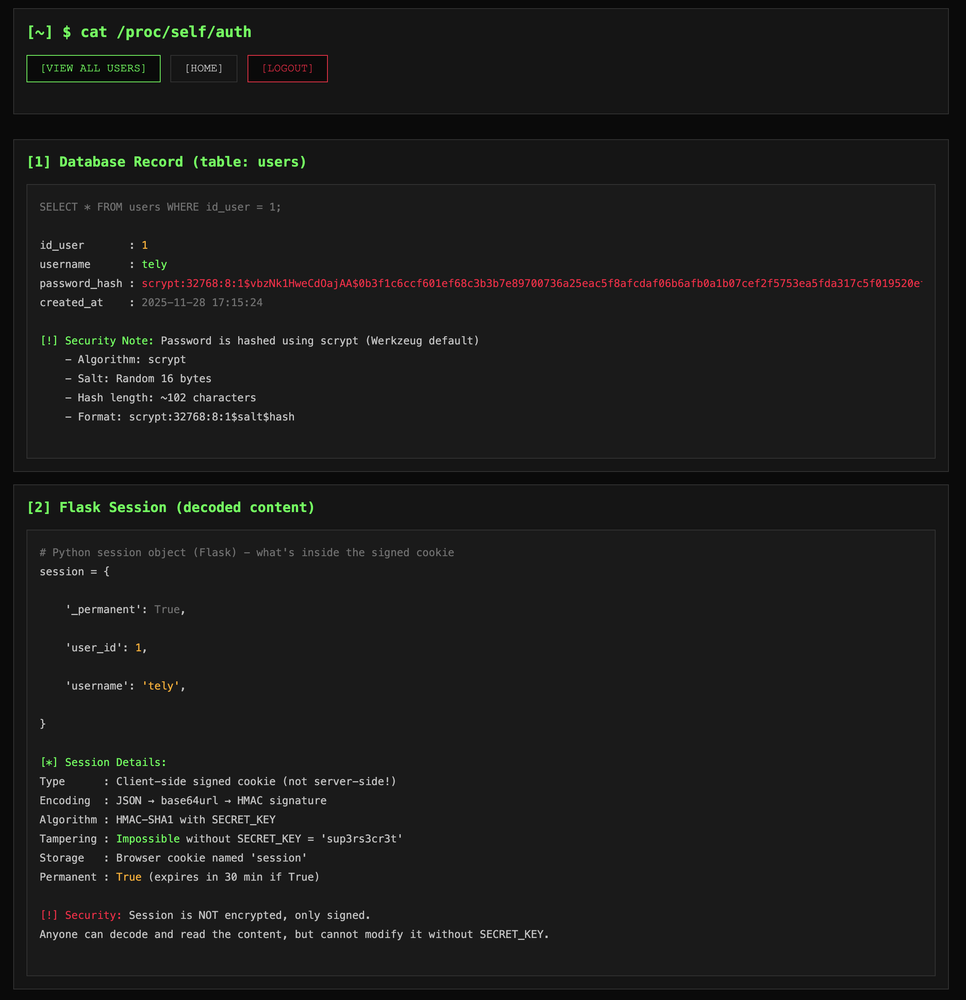
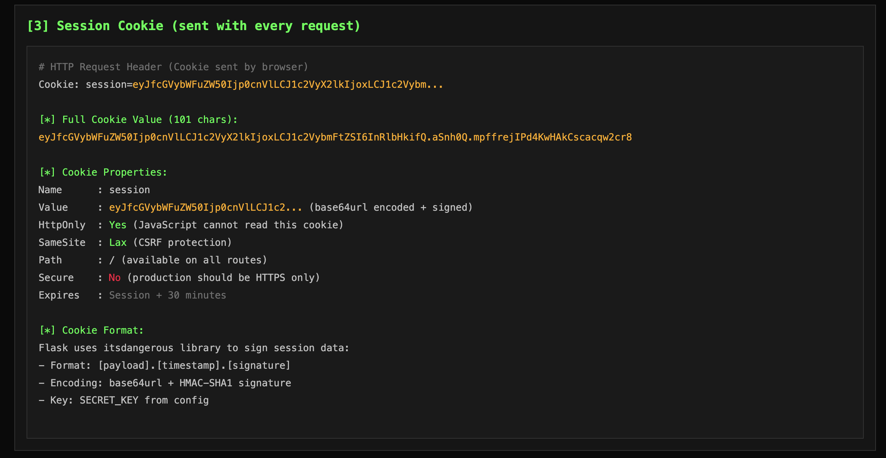

# Authentification par cookies avec Flask

## Objectif pédagogique

Ce projet est une démonstration pédagogique de l'authentification par cookies (cookie-based authentication) dans une application web Flask. L'objectif est de comprendre **comment fonctionnent les sessions côté serveur** et comment les cookies sécurisent les requêtes HTTP.

## Qu'est-ce que l'authentification par cookies ?

L'authentification par cookies est une méthode où le serveur crée une **session** après qu'un utilisateur se soit connecté avec succès. Cette session est identifiée par un **cookie signé** qui est envoyé au navigateur et retourné automatiquement à chaque requête.

### Principe de fonctionnement

```
[1] LOGIN REQUEST
    User → Server: username + password

[2] SERVER VERIFICATION
    Server: Vérifie le hash du mot de passe en base de données

[3] SESSION CREATION
    Server: Crée session['user_id'] = 1
    Server: Signe les données de session avec SECRET_KEY

[4] RESPONSE WITH COOKIE
    Server → User: Set-Cookie: session=[SIGNED_PAYLOAD]

[5] AUTHENTICATED REQUESTS
    User → Server: Cookie: session=[SIGNED_PAYLOAD]
    Server: Vérifie signature + décode → accès autorisé
```

## Sécurité mise en place

### Protections activées

- **Password hashing (scrypt)** : Les mots de passe sont hachés de manière irréversible
- **HttpOnly cookies** : Protection contre les attaques XSS (JavaScript ne peut pas lire le cookie)
- **SameSite=Lax** : Protection contre les attaques CSRF
- **Signed sessions** : Les cookies sont signés avec HMAC-SHA1 pour détecter toute modification
- **SQL parameterization** : Protection contre les injections SQL
- **Session expiration** : Les sessions expirent après 30 minutes

### Protections manquantes

- Pas de rate limiting (limitation du nombre de tentatives)
- Pas de verrouillage de compte après échecs
- Pas de 2FA/MFA
- Pas de rotation de session
- Pas de CAPTCHA
- Pas de règles de complexité des mots de passe

## Interface et fonctionnalités

### Page d'inscription


L'utilisateur crée un compte avec :
- Username (minimum 3 caractères)
- Password (minimum 8 caractères, haché avec scrypt)
- Confirmation du mot de passe

### Dashboard - Détails techniques



Le dashboard expose les informations internes pour l'apprentissage :

**[1] Database Record** : Affiche l'enregistrement en base de données
- `id_user`, `username`, `password_hash`, `created_at`
- Note de sécurité sur l'algorithme scrypt

**[2] Flask Session (decoded content)** : Contenu décodé du cookie
- `_permanent`: True (session persistante)
- `user_id`: 1
- `username`: 'tely'

Détails techniques :
- Type : Cookie signé côté client (pas côté serveur)
- Encodage : JSON → base64url + HMAC signature
- Algorithme : HMAC-SHA1 with SECRET_KEY
- Tampering : **Impossible** sans SECRET_KEY
- Storage : Browser cookie named 'session'
- Permanent : True (expire in 30 min if True)

### Cookie de session



**[3] Session Cookie (sent with every request)** :

HTTP Request Header :
```
Cookie: session=eyJfcGVybWFuZW50Ijp0cnVlLCJ1c2VyX2lkIjoxLCJ1c2VybmFtZSI6InRlbHkifQ...
```

Propriétés du cookie :
- **Name** : session
- **Value** : eyJfcGVybWFuZW50Ijp0cnVlLCJ1c2VyX2lkIjoxLCJ1c2VybmFtZSI6InRlbHkifQ... (base64url encoded + signed)
- **HttpOnly** : Yes (JavaScript ne peut pas lire ce cookie)
- **SameSite** : Lax (protection CSRF)
- **Path** : / (disponible sur toutes les routes)
- **Secure** : No (en production devrait être HTTPS only)
- **Expires** : Session + 30 minutes

### Flux d'authentification


**[4] Authentication Flow (what happened during login)** :

1. **LOGIN REQUEST**
   ```
   POST /login
   Content-Type: application/x-www-form-urlencoded

   username=tely&password=[REDACTED]
   ```

2. **SERVER VERIFICATION**
   ```python
   user = SELECT * FROM users WHERE username = 'tely'
   result = check_password_hash(user.password_hash, submitted_password)
   ✓ Password matches!
   ```

3. **SESSION CREATION**
   ```python
   session['user_id'] = 1
   session['username'] = 'tely'
   Flask signs the session data and creates cookie
   ```

4. **RESPONSE**
   ```
   HTTP/1.1 302 Found
   Location: /dashboard
   Set-Cookie: session=[SIGNED_PAYLOAD]; HttpOnly; SameSite=Lax
   ```

5. **AUTHENTICATED REQUESTS**
   ```
   Every subsequent request sends:
   Cookie: session=[SIGNED_PAYLOAD]

   Flask automatically:
   - Verifies signature
   - Decrypts session data
   - Makes it available as 'session' object
   ```

**[5] Security Analysis** : Tableau comparatif des protections activées vs manquantes

### Liste des utilisateurs


Page `/users` montrant :
- Nombre total d'utilisateurs
- Sessions actives
- Liste complète avec les hash de mots de passe
- Informations sur la sécurité des mots de passe (scrypt, salt, format)

## Installation et utilisation

### Prérequis

```bash
Python 3.8+
```

### Installation

```bash
# Installer les dépendances
pip install -r requirements.txt

# Initialiser la base de données
python3 init_db.py

# Lancer le serveur
python3 app.py
```

Le serveur démarre sur `http://localhost:5001`

### Utilisation via l'interface web

1. Ouvrir `http://localhost:5001`
2. Créer un compte via `/register`
3. Se connecter via `/login`
4. Explorer le dashboard pour voir les détails techniques
5. Consulter `/users` pour voir tous les utilisateurs

### Utilisation via curl (API)

```bash
# 1. Créer un compte
curl -X POST http://localhost:5001/register \
  -d "username=alice&password=P@ssw0rd123&password_confirm=P@ssw0rd123"

# 2. Se connecter (sauvegarder le cookie)
curl -X POST http://localhost:5001/login \
  -d "username=alice&password=P@ssw0rd123" \
  -c cookies.txt

# 3. Accéder à une ressource protégée
curl http://localhost:5001/dashboard -b cookies.txt

# 4. Se déconnecter
curl http://localhost:5001/logout -b cookies.txt -c cookies.txt
```

## Structure du projet

```
authentification/
├── app.py                 # Point d'entrée Flask
├── config.py              # Configuration (SECRET_KEY, durée de session)
├── init_db.py             # Script d'initialisation de la base de données
├── requirements.txt       # Dépendances Python
│
├── models/
│   └── user.py           # Modèle utilisateur (CRUD, hashing)
│
├── routes/
│   ├── auth.py           # Routes d'authentification (login, register, logout)
│   └── main.py           # Routes principales (dashboard, users)
│
├── utils/
│   ├── db.py             # Gestionnaire de connexion SQLite
│   └── sessions.py       # Gestion des sessions (non utilisé actuellement)
│
├── templates/            # Templates HTML (Jinja2)
│   ├── dashboard.html
│   ├── login.html
│   ├── register.html
│   ├── users.html
│   └── how_it_works.html
│
├── static/
│   └── css/
│       └── style.css     # Style terminal (noir, vert, monospace)
│
└── instance/
    └── database.db       # Base de données SQLite
```

## Points clés pour l'apprentissage

### 1. Différence entre session et cookie

- **Cookie** : Petit fichier texte stocké dans le navigateur, envoyé à chaque requête
- **Session** : Données côté serveur (ou signées dans le cookie pour Flask) identifiées par un cookie

### 2. Pourquoi signer les cookies ?

Flask signe les cookies avec `itsdangerous` pour :
- Détecter toute modification par l'utilisateur
- Éviter de stocker les sessions en base de données (stateless)
- Garantir l'intégrité des données

### 3. Format d'un cookie Flask signé

```
[payload_base64url].[timestamp].[signature_hmac_sha1]
```

Exemple :
```
eyJfcGVybWFuZW50Ijp0cnVl.aSnfwQ.ricVuNThKh2DsBo6J00q57EAUTs
│                           │      │
│                           │      └─ Signature HMAC-SHA1
│                           └──────── Timestamp
└──────────────────────────────────── Payload JSON encodé en base64url
```

### 4. Pourquoi la signature empêche la modification ?

La signature HMAC-SHA1 garantit l'intégrité du cookie. Voici ce qui se passe si vous tentez de modifier le payload :

```
[1] COOKIE ORIGINAL VALIDE
payload = {"user_id": 1, "username": "alice"}
signature = HMAC-SHA1(payload + timestamp, SECRET_KEY)
Cookie = eyJ1c2VyX2lkIjoxfQ.aSnfwQ.ricVuNThKh2DsBo6J00q57EAUTs
         ✓ Signature valide

[2] TENTATIVE DE MODIFICATION (attaque)
payload_modifié = {"user_id": 2, "username": "bob"}  # encodé en base64url
signature = INCHANGÉE (l'attaquant ne connaît pas SECRET_KEY)
Cookie = eyJ1c2VyX2lkIjoyfQ.aSnfwQ.ricVuNThKh2DsBo6J00q57EAUTs
         ✗ Payload modifié mais signature d'origine

[3] VÉRIFICATION PAR FLASK
Flask recalcule: HMAC-SHA1(payload_modifié + timestamp, SECRET_KEY)
Flask compare: signature_calculée != signature_fournie
Résultat: Cookie rejeté → Session vide → Redirection vers /login
```

**Conclusion** : Sans connaître le `SECRET_KEY`, il est impossible de générer une signature valide pour un payload modifié. C'est pour cette raison que le `SECRET_KEY` doit rester absolument secret et ne jamais être exposé dans le code source ou les logs.

**Test pratique** :
1. Récupérez votre cookie de session dans les DevTools du navigateur
2. Décodez la première partie avec base64url
3. Modifiez le `user_id` (par exemple, passez de 1 à 2)
4. Re-encodez en base64url et remplacez dans le cookie
5. Envoyez une requête avec ce cookie modifié
6. Flask rejettera le cookie car la signature ne correspond plus

### 5. HttpOnly vs Secure

- **HttpOnly** : Empêche JavaScript d'accéder au cookie (protection XSS)
- **Secure** : Le cookie n'est envoyé que sur HTTPS (protection man-in-the-middle)

### 6. SameSite=Lax

Protection contre CSRF :
- `Strict` : Cookie jamais envoyé depuis un autre site
- `Lax` : Cookie envoyé uniquement pour les requêtes GET depuis un autre site
- `None` : Cookie toujours envoyé (nécessite Secure=True)

## Avertissements

Ce projet est **purement pédagogique**. Pour une application en production :

1. **Utiliser HTTPS** : `SESSION_COOKIE_SECURE = True`
2. **SECRET_KEY fort** : Générer une clé cryptographiquement sûre
3. **Rate limiting** : Limiter les tentatives de connexion
4. **2FA/MFA** : Ajouter une authentification à deux facteurs
5. **Session rotation** : Changer l'ID de session après login
6. **CAPTCHA** : Protéger contre les bots
7. **Password policy** : Imposer des règles de complexité
8. **Logging** : Tracer les tentatives de connexion
9. **Database sessions** : Pour les applications multi-serveurs

## Ressources

- [Flask Sessions](https://flask.palletsprojects.com/en/stable/quickstart/#sessions)
- [itsdangerous](https://itsdangerous.palletsprojects.com/)
- [OWASP Session Management](https://cheatsheetseries.owasp.org/cheatsheets/Session_Management_Cheat_Sheet.html)
- [OWASP Authentication](https://cheatsheetseries.owasp.org/cheatsheets/Authentication_Cheat_Sheet.html)

## Licence

Projet pédagogique - Jedha Formation Cybersécurité
