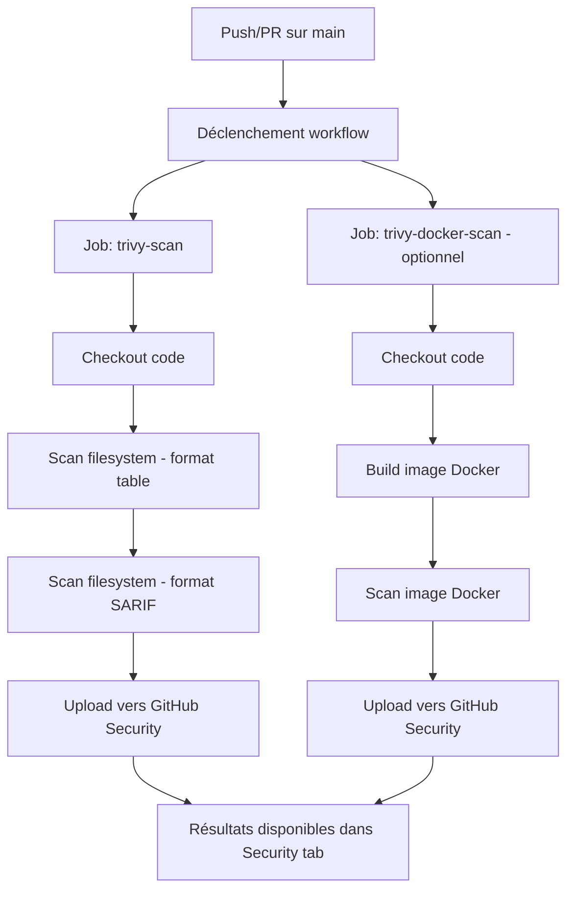
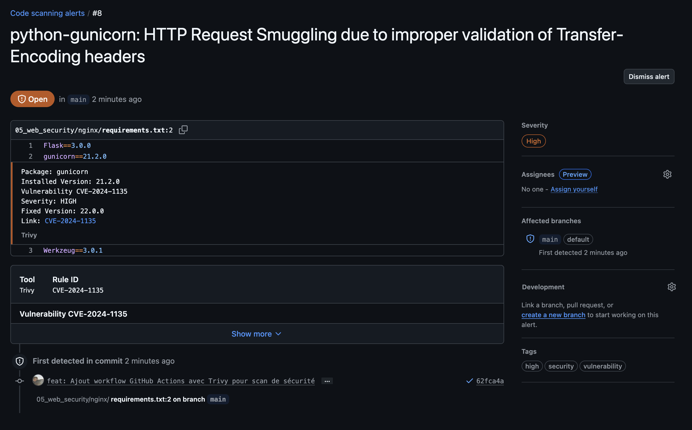

# Scan de sécurité avec trivy

Ce répertoire contient la documentation et les résultats du scan de sécurité automatisé avec Trivy, intégré dans notre pipeline CI/CD via GitHub Actions.

## Présentation

### Qu'est-ce que trivy ?

Trivy est un scanner de sécurité open-source développé par Aqua Security. Il permet de détecter automatiquement :

- Les vulnérabilités connues (CVE) dans les dépendances applicatives
- Les secrets hardcodés (clés API, mots de passe, tokens)
- Les problèmes de configuration
- Les vulnérabilités dans les images Docker
- Les problèmes de conformité des licences

### Pourquoi utiliser trivy ?

Dans un contexte de sécurité moderne, plusieurs couches de défense sont nécessaires :

1. **Revue de code manuelle** : Détecte les problèmes évidents et assure les bonnes pratiques
2. **Tests automatisés** : Pousse le développeur à penser aux cas limites
3. **Scan de sécurité automatisé** : Détecte les vulnérabilités à grande échelle de manière systématique

Trivy s'inscrit dans cette troisième couche, permettant de scanner automatiquement chaque commit et pull request.

## Architecture du workflow

Le workflow GitHub Actions est organisé en deux jobs principaux :



### Détail des étapes

#### Job 1 : trivy-scan (filesystem)

1. **Checkout code** : Récupération du code source du repository
2. **Premier scan** : Analyse en mode filesystem avec sortie "table" pour une lecture directe dans les logs
3. **Second scan** : Même analyse mais avec sortie au format SARIF pour GitHub
4. **Upload SARIF** : Envoi des résultats vers l'onglet Security de GitHub

#### Job 2 : trivy-docker-scan (images docker - optionnel)

1. **Checkout code** : Récupération du code source
2. **Build image** : Construction de l'image Docker à partir du Dockerfile
3. **Scan image** : Analyse de l'image complète avec toutes ses couches
4. **Upload SARIF** : Envoi des résultats avec une catégorie distincte

## Configuration

### Fichier workflow

Le workflow est défini dans `.github/workflows/trivy-security-scan.yml`

Une copie du fichier de configuration est disponible dans ce répertoire : [`trivy-security-scan.yml`](trivy-security-scan.yml)

Pour l'utiliser dans votre propre projet :

1. Créer le répertoire `.github/workflows/` à la racine de votre repository
2. Copier le fichier `trivy-security-scan.yml` dans ce répertoire
3. Adapter les chemins des Dockerfiles si nécessaire (lignes 74-77)
4. Commiter et pousser vers GitHub

Le workflow sera automatiquement détecté et exécuté par GitHub Actions

### Permissions

Le workflow utilise des permissions minimales selon le principe du moindre privilège :

```yaml
permissions:
  contents: read         # lecture du code (requis par actions/checkout)
  security-events: write # upload des résultats vers Security tab
```

Cette approche réduit la surface d'attaque en cas de compromission de la supply chain.

### Versions des actions

| action | version | description |
|--------|---------|-------------|
| `actions/checkout` | v6 | Récupération du code source |
| `aquasecurity/trivy-action` | 0.33.1 | Exécution du scan Trivy |
| `github/codeql-action/upload-sarif` | v4 | Upload des résultats SARIF |

### Niveaux de sévérité

Le workflow détecte les vulnérabilités selon trois niveaux :

- **CRITICAL** : Vulnérabilités critiques nécessitant une action immédiate
- **HIGH** : Vulnérabilités importantes à corriger rapidement
- **MEDIUM** : Vulnérabilités modérées à surveiller

### Structure du workflow

Voici les parties principales du fichier workflow :

#### déclencheurs

```yaml
on:
  push:
    branches: [main]
  pull_request:
    branches: [main]
  schedule:
    - cron: '0 6 * * *'  # scan quotidien à 6h UTC
```

#### job de scan filesystem

```yaml
jobs:
  trivy-scan:
    runs-on: ubuntu-latest
    steps:
      - name: Checkout code
        uses: actions/checkout@v6

      - name: Run Trivy vulnerability scanner in filesystem mode
        uses: aquasecurity/trivy-action@0.33.1
        with:
          scan-type: "fs"
          scan-ref: "."
          format: "table"
          severity: "CRITICAL,HIGH"
          exit-code: 0

      - name: Run Trivy vulnerability scanner for SARIF report
        uses: aquasecurity/trivy-action@0.33.1
        with:
          scan-type: "fs"
          scan-ref: "."
          format: "sarif"
          output: "trivy-results.sarif"
          severity: "CRITICAL,HIGH,MEDIUM"

      - name: Upload Trivy scan results to GitHub Security tab
        uses: github/codeql-action/upload-sarif@v4
        if: always()
        with:
          sarif_file: "trivy-results.sarif"
```

Le fichier complet est disponible dans [`trivy-security-scan.yml`](trivy-security-scan.yml)

## Déclenchement du scan

Le workflow se déclenche automatiquement dans trois situations :

### 1. push sur main

```yaml
on:
  push:
    branches: [main]
```

Chaque commit poussé sur la branche principale déclenche un scan complet.

### 2. Pull request

```yaml
on:
  pull_request:
    branches: [main]
```

Chaque pull request vers main est automatiquement scannée avant merge.

### 3. scan quotidien programmé

```yaml
on:
  schedule:
    - cron: '0 6 * * *'
```

Un scan automatique s'exécute tous les jours à 6h00 UTC pour détecter les nouvelles vulnérabilités publiées dans les bases de données CVE.

## Consultation des résultats

### Onglet actions

Les logs détaillés de chaque exécution sont disponibles dans l'onglet Actions du repository :

```
https://github.com/cchopin/Jedha-cybersec-fullstack/actions
```

Vous pouvez y voir :
- L'historique complet des scans
- Les logs de chaque étape
- Le résultat en format "table" directement lisible

### Onglet security

Les alertes détaillées sont disponibles dans l'onglet Security > Code scanning :

```
https://github.com/cchopin/Jedha-cybersec-fullstack/security/code-scanning
```

Pour chaque vulnérabilité, GitHub affiche :
- Le fichier et la ligne concernés
- La sévérité (critical, high, medium)
- La description de la vulnérabilité
- Les recommandations de correction
- Les références CVE

### Format SARIF

SARIF (Static Analysis Results Interchange Format) est un format JSON standardisé qui permet aux outils de sécurité de communiquer leurs résultats de manière unifiée. Ce format permet à GitHub de :

- Créer des alertes cliquables et détaillées
- Suivre l'évolution des vulnérabilités dans le temps
- Intégrer les résultats avec d'autres outils de sécurité
- Filtrer et trier les alertes par sévérité

## Screenshots

### Vue d'ensemble des vulnérabilités


L'onglet Security affiche la liste complète des vulnérabilités détectées, classées par sévérité.

### Détails d'une vulnérabilité



Chaque alerte peut être ouverte pour voir :
- Le contexte exact du code
- La description technique de la vulnérabilité
- Les recommandations de correction

## Activer le scan docker

Par défaut, seul le scan filesystem est activé. Pour activer le scan des images Docker :

1. Éditer le fichier `.github/workflows/trivy-security-scan.yml`
2. Ligne 70, remplacer `if: false` par `if: true`
3. Commiter et pousser la modification

Le workflow scannera alors les images Docker définies dans la matrice :
- `crypto-tavern` (contexte : `05_web_security/nginx`)
- `todo-app` (contexte : `05_web_security/nginx-lab`)

## Shared responsibility model

Les résultats des scans Trivy permettent de mettre en place un modèle de responsabilité partagée :

- **Équipe sécurité** : configure et maintient le pipeline de scan
- **Développeurs** : corrigent les vulnérabilités détectées dans leur code

Pour chaque vulnérabilité, il est recommandé de :
1. Créer une issue GitHub ou un ticket Jira
2. Assigner l'issue au développeur responsable du code
3. Prioriser selon la sévérité (critical > high > medium)
4. Suivre la correction dans le temps

## Alternatives à trivy

| outil | type | description |
|-------|------|-------------|
| Semgrep | SAST | Analyse statique de code pour détecter les patterns dangereux |
| Snyk | SAST/SCA | Analyse de code et de dépendances (commercial) |
| SonarQube | SAST | Plateforme complète d'analyse de qualité et sécurité du code |
| OWASP ZAP | DAST | Analyse dynamique en testant l'application en runtime |
| GitGuardian | Secret Scanning | Détection de secrets dans le code et l'historique Git |
| Grype | Image Scanning | Alternative à Trivy pour scanner les images Docker |
| Checkov | IaC Security | Scan de fichiers Terraform, CloudFormation, Kubernetes |

**SAST** (Static Application Security Testing) : Analyse le code au repos
**DAST** (Dynamic Application Security Testing) : Analyse l'application en cours d'exécution

## Ressources

- [Documentation officielle Trivy](https://trivy.dev/)
- [Trivy-action sur GitHub](https://github.com/aquasecurity/trivy-action)
- [Format SARIF](https://sarifweb.azurewebsites.net/)
- [GitHub code scanning](https://docs.github.com/en/code-security/code-scanning)
