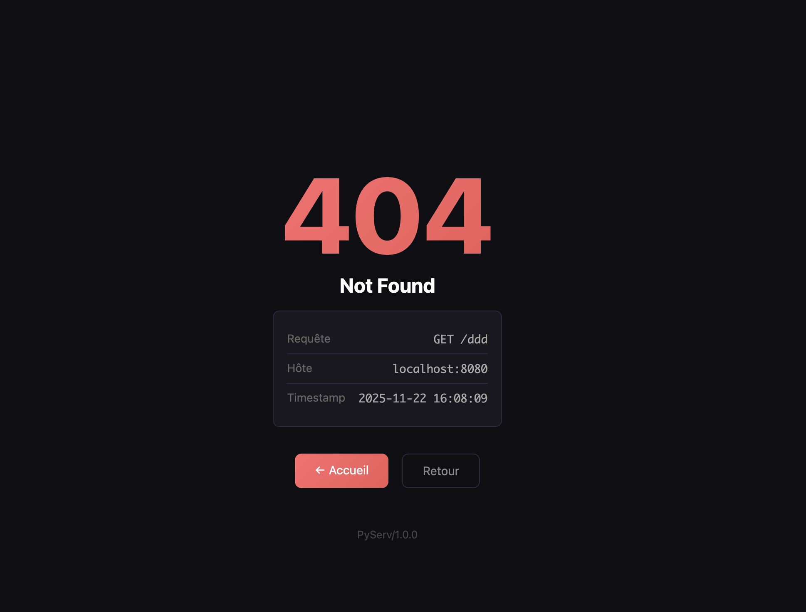
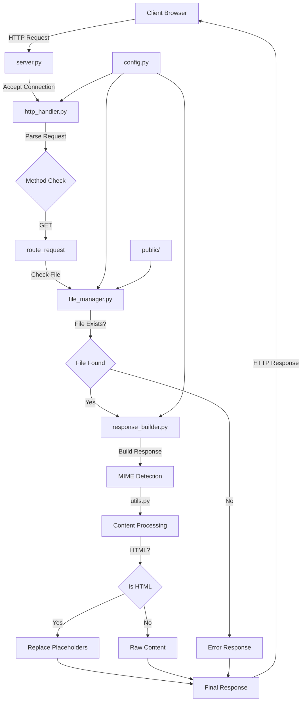

# PyServ - Serveur HTTP Python

## Description

PyServ est un serveur HTTP minimal développé en Python pur, sans frameworks externes. Ce projet implémente les fonctionnalités de base d'un serveur web avec une architecture modulaire et une interface web d'information.

## Fonctionnalités

- Serveur HTTP/1.1 avec support des méthodes GET
- Interface web affichant les informations du serveur
- Gestion des erreurs avec pages d'erreur personnalisées
- Types MIME pour différents formats de fichiers
- Sécurité avec protection contre le path traversal
- Architecture modulaire respectant le principe DRY

## Captures d'écran

### Page d'accueil


*Interface principale affichant les informations du serveur*

### Page d'erreur 404


*Page d'erreur personnalisée avec informations de débogage*

## Architecture



## Structure du projet

```
http-web-server/
├── server.py              # Serveur principal et gestion des connexions
├── http_handler.py         # Parsing des requêtes HTTP et routing
├── response_builder.py     # Construction des réponses HTTP
├── file_manager.py         # Gestion des fichiers et sécurité
├── utils.py               # Utilitaires (MIME types, codes HTTP)
├── config.py              # Configuration du serveur
├── public/                # Fichiers statiques
│   ├── index.html         # Page d'accueil avec monitoring
│   ├── error.html         # Template des pages d'erreur
│   └── test.html          # Page de test
└── assets/                # Captures d'écran
    ├── index.png
    └── 404.png
```

## Installation et utilisation

### Prérequis
- Python 3.8+
- Aucune dépendance externe requise

### Lancement du serveur
```bash
cd http-web-server
python3 server.py
```

Le serveur démarre sur `http://0.0.0.0:8080`

### Tests
```bash
# Test de la page d'accueil
curl http://localhost:8080

# Test d'une page inexistante (404)
curl -I http://localhost:8080/nonexistent.html

# Test avec verbose pour voir les headers
curl -v http://localhost:8080
```

## Exemples de code

### Gestion des requêtes HTTP
```python
def parse_request(raw_request):
    if not raw_request or not raw_request.strip():
        return None

    lines = re.split(r'\\r?\\n', raw_request)
    request_line = lines[0].split(' ')
    method, path, version = request_line

    headers = {}
    for line in lines[1:]:
        if line == '':
            break
        if ': ' in line:
            key, value = line.split(': ', 1)
            headers[key.lower()] = value

    return {
        'method': method.upper(),
        'path': unquote(path),
        'version': version,
        'headers': headers
    }
```

### Sécurité et sanitisation des chemins
```python
def _sanitize_path(requested_path: str) -> str:
    \"\"\"Sécurise le chemin en supprimant les tentatives de path traversal\"\"\"
    if not isinstance(requested_path, str):
        return ""
    path = os.path.normpath(requested_path.strip())
    # Supprime les tentatives de remontée de dossier
    path = path.replace("..", "").replace("\\\\", "")
    if path.startswith("/"):
        path = path[1:]
    return path
```

### Détection automatique des types MIME
```python
def get_mime_type(file_path):
    try:
        pos = file_path.rindex(".")
        extension = file_path[pos:]
        return config.MIME_type.get(extension, "application/octet-stream")
    except ValueError:
        return "application/octet-stream"
```

### Remplacement dynamique des placeholders
```python
def _replace_placeholders(content, request_info=None):
    global _server_start_time, _request_counter
    _request_counter += 1

    uptime_seconds = time.time() - _server_start_time
    uptime_str = f"{int(uptime_seconds//3600):02d}:{int((uptime_seconds%3600)//60):02d}:{int(uptime_seconds%60):02d}"

    replacements = {
        '{{SERVER_PORT}}': str(config.PORT),
        '{{SERVER_PID}}': str(os.getpid()),
        '{{REQUEST_COUNT}}': str(_request_counter),
        '{{SERVER_UPTIME}}': uptime_str,
        '{{CURRENT_TIME}}': datetime.now().strftime('%Y-%m-%d %H:%M:%S')
    }

    for placeholder, value in replacements.items():
        content = content.replace(placeholder, value)

    return content
```

## Processus de développement

### Méthodologie
Le développement a suivi une approche structurée avec planification des tâches et refactorisation continue pour maintenir un code propre. L'IA a contribué à la génération des CSS, à l'élaboration de la TODO liste et à la refactorisation du code.

### Principe DRY appliqué
- Centralisation de la configuration dans `config.py`
- Fonctions utilitaires réutilisables dans `utils.py`
- Modularité avec séparation claire des responsabilités
- Limitation de la duplication de code entre modules et fonctions

## Sécurité

### Protection contre le path traversal
```python
# Bloque les tentatives d'accès aux fichiers système
path = path.replace("..", "").replace("\\\\", "")
```

### Gestion sécurisée des erreurs
- Pages d'erreur sans exposition d'informations sensibles
- Gestion propre des exceptions réseau
- Validation des entrées utilisateurs

## Informations affichées

L'interface web affiche quelques données basiques :
- Informations serveur : PID, port, uptime
- Statistiques simples : compteur de requêtes, méthode HTTP, IP client
- Configuration : types MIME supportés, dossier racine

## Limitations actuelles

- Support uniquement de la méthode GET
- Pas de connexions persistantes
- Pas de compression
- Pas de HTTPS
- Gestion basique des gros fichiers

## Améliorations futures

- Support POST/PUT/DELETE
- Implémentation HTTPS/TLS
- Compression gzip
- Système de logs avancé
- Support des cookies/sessions

## License

Ce projet est développé à des fins éducatives dans le cadre du cursus de cybersécurité Jedha.

