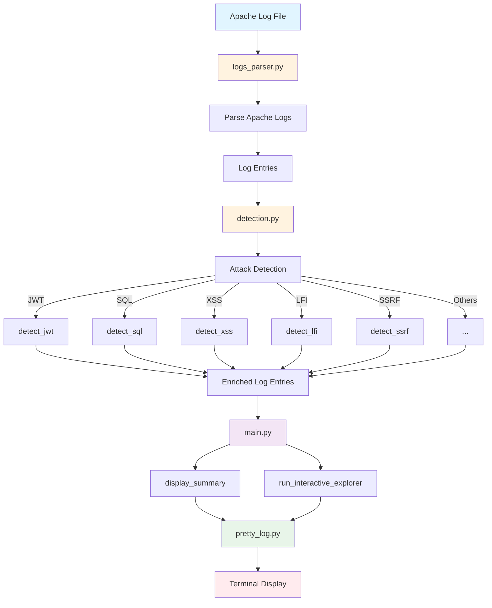

# Web Log Security Analyzer

A Python-based security tool for analyzing Apache web server logs to detect common attack patterns and vulnerabilities.

## Overview

This tool parses Apache access logs and identifies various types of web attacks including SQL injection, XSS, LFI, SSRF, command injection, and more. It provides both a summary view of detected attacks and an interactive mode to explore specific attack types in detail.

## Features

- Parse Apache Combined Log Format
- Detect 11 different types of web attacks:
  - SQL Injection
  - Cross-Site Scripting (XSS)
  - Local File Inclusion (LFI)
  - Server-Side Request Forgery (SSRF)
  - Command Injection
  - XML External Entity (XXE)
  - LDAP Injection
  - Server-Side Template Injection (SSTI)
  - JWT vulnerabilities
  - Open Redirect
  - Security scanner detection
- Rich terminal UI with colored output
- Interactive mode to filter logs by attack type
- Statistical summary with attack percentages

## Architecture



## Project Structure

```
web-log-security-analyzer/
├── main.py                 # Main entry point and orchestration
├── logs_parser.py          # Apache log parsing
├── detection.py            # Attack pattern detection logic
├── pretty_log.py           # Terminal display formatting
├── config.py               # Configuration and attack definitions
├── apache-access-log.txt   # Sample log file
├── assets/                 # Screenshots
│   ├── summary.png
│   └── details.png
└── README.md
```

## Installation

1. Clone the repository:
```bash
git clone <repository-url>
cd web-log-security-analyzer
```

2. Install dependencies:
```bash
pip install rich
```

## Usage

Run the analyzer with an Apache log file:

```bash
python3 main.py apache-access-log.txt
```

### Summary View

The tool first displays a summary table showing statistics for each attack type:


### Interactive Mode

After the summary, you can interactively explore specific attack types:

```
Type de faille à afficher (ou 'q' pour quitter) : ssrf
```

The tool will display detailed log entries for the selected attack type:


Available attack types:
- `jwt` - JWT vulnerabilities
- `lfi` - Local File Inclusion
- `sql` - SQL Injection
- `xss` - Cross-Site Scripting
- `cmd_inj` - Command Injection
- `xxe` - XML External Entity
- `ldap` - LDAP Injection
- `ssrf` - Server-Side Request Forgery
- `template` - Template Injection
- `open_redirect` - Open Redirect
- `scanner` - Security Scanner Detection

Type `q`, `quit`, or `exit` to leave interactive mode.

## Detection Patterns

### SQL Injection
Detects common SQL injection patterns including:
- `' OR '1'='1`
- `UNION SELECT`
- SQL comments (`--`, `#`, `/*`)
- Time-based attacks (`SLEEP`, `WAITFOR`)

### Cross-Site Scripting (XSS)
Identifies XSS attempts through:
- `<script>` tags
- Event handlers (`onerror`, `onload`, `onclick`)
- JavaScript protocol handlers
- HTML entity encoding

### Local File Inclusion (LFI)
Detects path traversal and file inclusion:
- `../` patterns
- Windows path traversal (`..\\`)
- PHP wrappers (`php://`, `file://`)
- Sensitive file access (`/etc/passwd`, `win.ini`)

### Server-Side Request Forgery (SSRF)
Identifies SSRF attempts targeting:
- Localhost (`127.0.0.1`, `localhost`)
- Private IP ranges
- Cloud metadata endpoints (`169.254.x.x`)
- Internal protocols (`file://`, `gopher://`)

### Command Injection
Detects command execution attempts:
- Shell commands (`ls`, `cat`, `wget`)
- Command chaining (`;`, `&&`, `|`)
- Command substitution (backticks, `$()`)

## Code Quality

- Clean, refactored codebase
- Type hints and docstrings
- DRY principles (Don't Repeat Yourself)
- Single source of truth for configuration
- Modular design with separation of concerns

## References

Attack detection patterns are inspired by:
- [PayloadsAllTheThings](https://github.com/swisskyrepo/PayloadsAllTheThings) - A comprehensive collection of web attack payloads and bypass techniques

## Contributing

Contributions are welcome. Please ensure your code follows the existing style and includes appropriate documentation.

## License

This project is provided as-is for educational and security analysis purposes.

## Disclaimer

This tool is designed for legitimate security analysis and educational purposes only. Always ensure you have proper authorization before analyzing any system logs or performing security testing.
