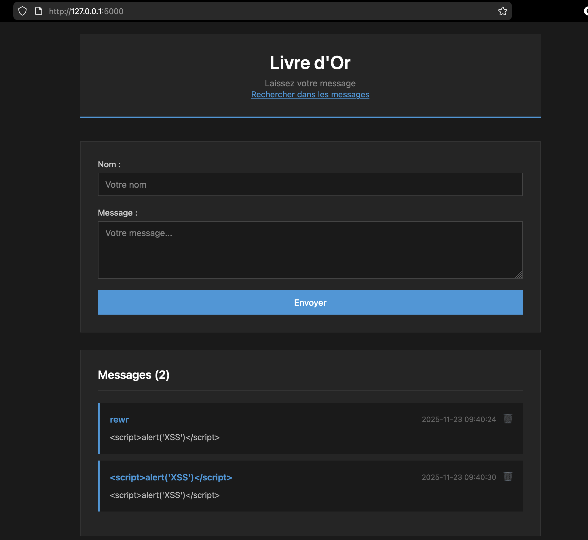
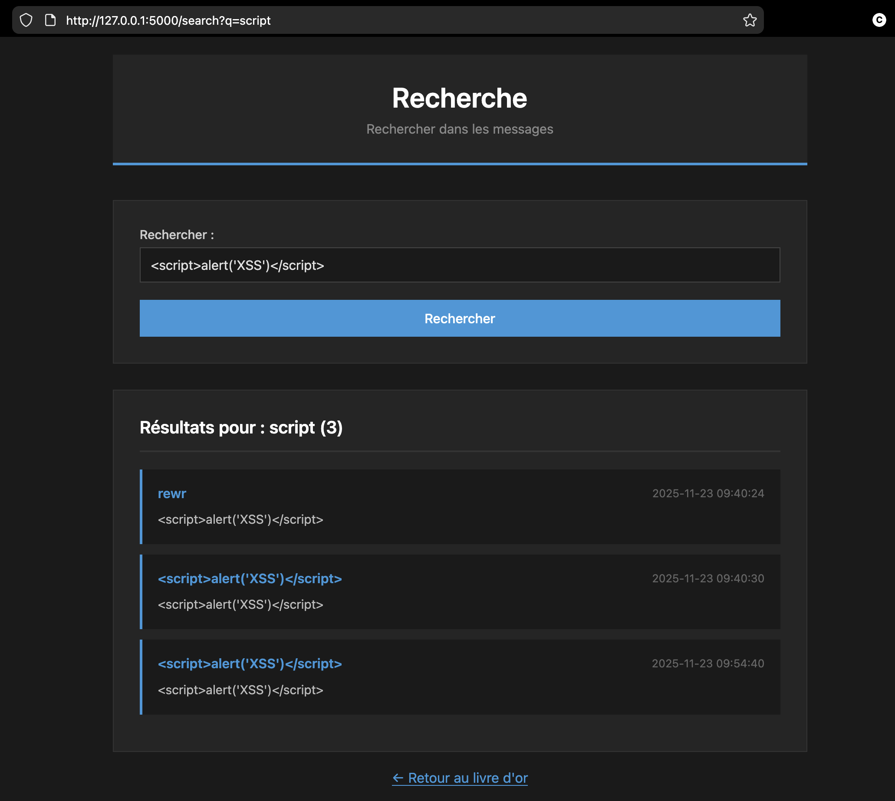

# Livre d'Or - Application Flask

Application web de livre d'or développée avec Flask, conçue pour démontrer les bonnes pratiques de sécurité contre les vulnérabilités XSS et les injections SQL.

## Aperçu

### Page d'accueil


### Page de recherche


## Fonctionnalités

- Ajouter des commentaires (nom + message)
- Supprimer des commentaires
- Rechercher dans les messages

## Installation

### Prérequis

- Python 3.x
- pip

### Setup

1. Cloner le repository :
```bash
git clone https://github.com/cchopin/Jedha-cybersec-fullstack.git
cd Jedha-cybersec-fullstack/05_web_security/xss
```

2. Installer les dépendances :
```bash
pip install flask
```

3. Lancer l'application :
```bash
python main.py
```

4. Accéder à l'application :
```
http://127.0.0.1:5000
```

La base de données SQLite est créée automatiquement au premier lancement.

## Sécurité

### Protection contre les injections XSS

L'application implémente plusieurs couches de protection contre les attaques XSS (Cross-Site Scripting) :

1. **Échappement automatique (Output Encoding)**
   - Jinja2 échappe automatiquement toutes les variables dans les templates
   - Les caractères `<`, `>`, `&`, `'`, `"` sont convertis en entités HTML
   - Empêche l'exécution de scripts injectés dans les commentaires

2. **Content Security Policy (CSP)**
   - Header HTTP qui restreint les sources de contenu autorisées
   - `script-src 'self'` : bloque les scripts inline injectés
   - `default-src 'self'` : charge uniquement les ressources depuis le même domaine

```python
response.headers['Content-Security-Policy'] = "default-src 'self'; script-src 'self'; style-src 'self' 'unsafe-inline'"
```

### Protection contre les injections SQL

L'application utilise des **requêtes paramétrées** pour toutes les interactions avec la base de données :

```python
# Requête sécurisée avec paramètres
cursor.execute("SELECT * FROM comments WHERE message LIKE ?", ('%' + query + '%',))

# Insertion sécurisée
cursor.execute("INSERT INTO comments (name, message) VALUES (?, ?)", (name, message))

# Suppression sécurisée
cursor.execute("DELETE FROM comments WHERE id = ?", (comment_id,))
```

Les requêtes paramétrées empêchent les attaquants d'injecter du code SQL malveillant car les paramètres sont traités comme des données, jamais comme du code SQL.

## Structure du projet

```
xss/
├── main.py              # Application Flask principale
├── connector.py         # Fonctions d'accès à la base de données
├── guestbook.db         # Base de données SQLite (créée au lancement)
├── templates/
│   ├── index.html       # Page d'accueil
│   └── search.html      # Page de recherche
├── static/
│   └── style.css        # Styles CSS
└── assets/
    ├── index.png        # Screenshot page d'accueil
    └── search.png       # Screenshot page de recherche
```

## Note

Le design CSS de cette application a été réalisé avec l'assistance de l'IA (Claude).

## Licence

Projet éducatif dans le cadre de la formation Jedha Cybersécurité Fullstack.
