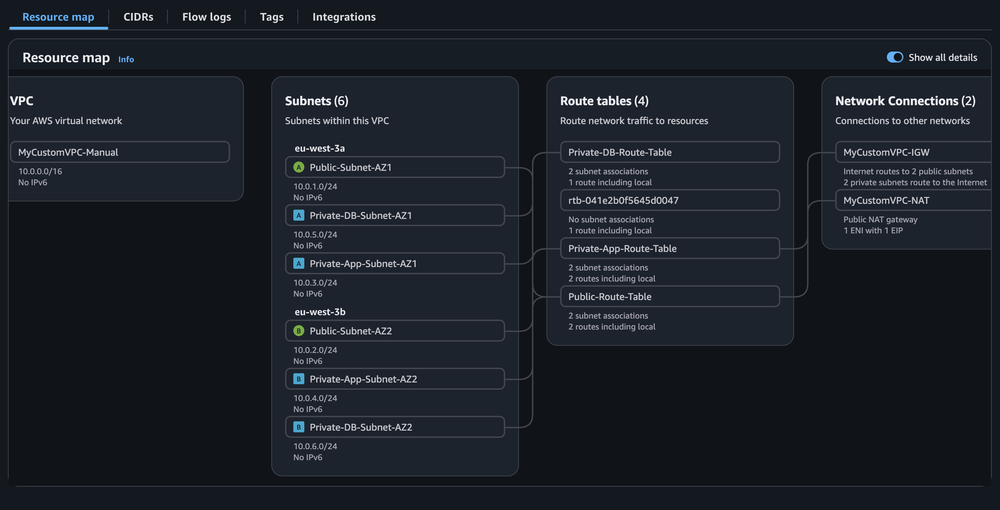

# AWS Network Security Services - Infrastructure VPC three-tier

Ce projet automatise la creation d'une architecture VPC trois tiers complete sur AWS, incluant VPC, subnets, gateways, route tables, security groups et NACLs.

## Architecture



```
                    Internet
                        |
                [Internet Gateway]
                        |
    +-------------------+-------------------+
    |                                       |
+-------+                               +-------+
|Public |                               |Public |
|Subnet |                               |Subnet |
|  AZ1  |                               |  AZ2  |
+-------+                               +-------+
    |                                       |
    +--------[NAT Gateway]------------------+
                    |
    +-------------------+-------------------+
    |                                       |
+-------+                               +-------+
|Private|                               |Private|
| App   |                               | App   |
|  AZ1  |                               |  AZ2  |
+-------+                               +-------+
    |                                       |
    +-------------------+-------------------+
                        |
    +-------------------+-------------------+
    |                                       |
+-------+                               +-------+
|Private|                               |Private|
|  DB   |                               |  DB   |
|  AZ1  |                               |  AZ2  |
+-------+                               +-------+
```

## Prerequis

- AWS CLI installe et configure
- Un compte AWS avec les permissions appropriees
- Bash shell

## Deploiement rapide

```bash
# Configurer la region (optionnel, defaut: eu-west-3)
export AWS_REGION=eu-west-3

# Rendre les scripts executables
chmod +x scripts/*.sh

# Deployer l'infrastructure
./scripts/setup-vpc-infrastructure.sh

# Pour nettoyer
./scripts/cleanup-vpc-infrastructure.sh
```

---

## Commandes CLI detaillees par phase

### Phase 1: Creation du VPC

```bash
# Creer le VPC
aws ec2 create-vpc \
    --region eu-west-3 \
    --cidr-block 10.0.0.0/16 \
    --tag-specifications "ResourceType=vpc,Tags=[{Key=Name,Value=MyCustomVPC-Manual}]" \
    --query "Vpc.VpcId" \
    --output text

# Activer les DNS hostnames
aws ec2 modify-vpc-attribute \
    --region eu-west-3 \
    --vpc-id <VPC_ID> \
    --enable-dns-hostnames
```

### Phase 2: Creation des Subnets

#### Subnets publics

```bash
# Obtenir les zones de disponibilite
aws ec2 describe-availability-zones \
    --region eu-west-3 \
    --query "AvailabilityZones[*].ZoneName" \
    --output text

# Public Subnet AZ1 (10.0.1.0/24)
aws ec2 create-subnet \
    --region eu-west-3 \
    --vpc-id <VPC_ID> \
    --cidr-block 10.0.1.0/24 \
    --availability-zone eu-west-3a \
    --tag-specifications "ResourceType=subnet,Tags=[{Key=Name,Value=Public-Subnet-AZ1}]" \
    --query "Subnet.SubnetId" \
    --output text

# Activer l'auto-assign public IP
aws ec2 modify-subnet-attribute \
    --region eu-west-3 \
    --subnet-id <SUBNET_ID> \
    --map-public-ip-on-launch

# Public Subnet AZ2 (10.0.2.0/24)
aws ec2 create-subnet \
    --region eu-west-3 \
    --vpc-id <VPC_ID> \
    --cidr-block 10.0.2.0/24 \
    --availability-zone eu-west-3b \
    --tag-specifications "ResourceType=subnet,Tags=[{Key=Name,Value=Public-Subnet-AZ2}]" \
    --query "Subnet.SubnetId" \
    --output text
```

#### Subnets prives (app tier)

```bash
# Private App Subnet AZ1 (10.0.3.0/24)
aws ec2 create-subnet \
    --region eu-west-3 \
    --vpc-id <VPC_ID> \
    --cidr-block 10.0.3.0/24 \
    --availability-zone eu-west-3a \
    --tag-specifications "ResourceType=subnet,Tags=[{Key=Name,Value=Private-App-Subnet-AZ1}]" \
    --query "Subnet.SubnetId" \
    --output text

# Private App Subnet AZ2 (10.0.4.0/24)
aws ec2 create-subnet \
    --region eu-west-3 \
    --vpc-id <VPC_ID> \
    --cidr-block 10.0.4.0/24 \
    --availability-zone eu-west-3b \
    --tag-specifications "ResourceType=subnet,Tags=[{Key=Name,Value=Private-App-Subnet-AZ2}]" \
    --query "Subnet.SubnetId" \
    --output text
```

#### Subnets prives (database tier)

```bash
# Private DB Subnet AZ1 (10.0.5.0/24)
aws ec2 create-subnet \
    --region eu-west-3 \
    --vpc-id <VPC_ID> \
    --cidr-block 10.0.5.0/24 \
    --availability-zone eu-west-3a \
    --tag-specifications "ResourceType=subnet,Tags=[{Key=Name,Value=Private-DB-Subnet-AZ1}]" \
    --query "Subnet.SubnetId" \
    --output text

# Private DB Subnet AZ2 (10.0.6.0/24)
aws ec2 create-subnet \
    --region eu-west-3 \
    --vpc-id <VPC_ID> \
    --cidr-block 10.0.6.0/24 \
    --availability-zone eu-west-3b \
    --tag-specifications "ResourceType=subnet,Tags=[{Key=Name,Value=Private-DB-Subnet-AZ2}]" \
    --query "Subnet.SubnetId" \
    --output text
```

### Phase 3: Creation de l'Internet Gateway

```bash
# Creer l'Internet Gateway
aws ec2 create-internet-gateway \
    --region eu-west-3 \
    --tag-specifications "ResourceType=internet-gateway,Tags=[{Key=Name,Value=MyCustomVPC-IGW}]" \
    --query "InternetGateway.InternetGatewayId" \
    --output text

# Attacher l'IGW au VPC
aws ec2 attach-internet-gateway \
    --region eu-west-3 \
    --internet-gateway-id <IGW_ID> \
    --vpc-id <VPC_ID>
```

### Phase 4: Creation du NAT Gateway

```bash
# Allouer une Elastic IP
aws ec2 allocate-address \
    --region eu-west-3 \
    --domain vpc \
    --tag-specifications "ResourceType=elastic-ip,Tags=[{Key=Name,Value=MyCustomVPC-NAT-EIP}]" \
    --query "AllocationId" \
    --output text

# Creer le NAT Gateway (dans un subnet public!)
aws ec2 create-nat-gateway \
    --region eu-west-3 \
    --subnet-id <PUBLIC_SUBNET_1_ID> \
    --allocation-id <EIP_ALLOC_ID> \
    --tag-specifications "ResourceType=natgateway,Tags=[{Key=Name,Value=MyCustomVPC-NAT}]" \
    --query "NatGateway.NatGatewayId" \
    --output text

# Attendre que le NAT Gateway soit disponible
aws ec2 wait nat-gateway-available \
    --region eu-west-3 \
    --nat-gateway-ids <NAT_GW_ID>
```

### Phase 5: Creation des Route Tables

#### Route table publique

```bash
# Creer la route table publique
aws ec2 create-route-table \
    --region eu-west-3 \
    --vpc-id <VPC_ID> \
    --tag-specifications "ResourceType=route-table,Tags=[{Key=Name,Value=Public-Route-Table}]" \
    --query "RouteTable.RouteTableId" \
    --output text

# Ajouter la route vers Internet Gateway
aws ec2 create-route \
    --region eu-west-3 \
    --route-table-id <PUBLIC_RT_ID> \
    --destination-cidr-block 0.0.0.0/0 \
    --gateway-id <IGW_ID>

# Associer les subnets publics
aws ec2 associate-route-table \
    --region eu-west-3 \
    --route-table-id <PUBLIC_RT_ID> \
    --subnet-id <PUBLIC_SUBNET_1_ID>

aws ec2 associate-route-table \
    --region eu-west-3 \
    --route-table-id <PUBLIC_RT_ID> \
    --subnet-id <PUBLIC_SUBNET_2_ID>
```

#### Route table privee (app tier)

```bash
# Creer la route table app
aws ec2 create-route-table \
    --region eu-west-3 \
    --vpc-id <VPC_ID> \
    --tag-specifications "ResourceType=route-table,Tags=[{Key=Name,Value=Private-App-Route-Table}]" \
    --query "RouteTable.RouteTableId" \
    --output text

# Ajouter la route vers NAT Gateway
aws ec2 create-route \
    --region eu-west-3 \
    --route-table-id <PRIVATE_APP_RT_ID> \
    --destination-cidr-block 0.0.0.0/0 \
    --nat-gateway-id <NAT_GW_ID>

# Associer les subnets app
aws ec2 associate-route-table \
    --region eu-west-3 \
    --route-table-id <PRIVATE_APP_RT_ID> \
    --subnet-id <PRIVATE_APP_SUBNET_1_ID>

aws ec2 associate-route-table \
    --region eu-west-3 \
    --route-table-id <PRIVATE_APP_RT_ID> \
    --subnet-id <PRIVATE_APP_SUBNET_2_ID>
```

#### Route table privee (database tier)

```bash
# Creer la route table database (pas de route internet)
aws ec2 create-route-table \
    --region eu-west-3 \
    --vpc-id <VPC_ID> \
    --tag-specifications "ResourceType=route-table,Tags=[{Key=Name,Value=Private-DB-Route-Table}]" \
    --query "RouteTable.RouteTableId" \
    --output text

# Associer les subnets database
aws ec2 associate-route-table \
    --region eu-west-3 \
    --route-table-id <PRIVATE_DB_RT_ID> \
    --subnet-id <PRIVATE_DB_SUBNET_1_ID>

aws ec2 associate-route-table \
    --region eu-west-3 \
    --route-table-id <PRIVATE_DB_RT_ID> \
    --subnet-id <PRIVATE_DB_SUBNET_2_ID>
```

### Phase 6: Creation des Security Groups

#### Web tier security group

```bash
# Creer le security group Web Tier
aws ec2 create-security-group \
    --region eu-west-3 \
    --group-name "Web-Tier-SG" \
    --description "Security group for web servers in public subnets" \
    --vpc-id <VPC_ID> \
    --tag-specifications "ResourceType=security-group,Tags=[{Key=Name,Value=Web-Tier-SG}]" \
    --query "GroupId" \
    --output text

# Autoriser HTTP (port 80)
aws ec2 authorize-security-group-ingress \
    --region eu-west-3 \
    --group-id <WEB_SG_ID> \
    --protocol tcp \
    --port 80 \
    --cidr 0.0.0.0/0

# Autoriser HTTPS (port 443)
aws ec2 authorize-security-group-ingress \
    --region eu-west-3 \
    --group-id <WEB_SG_ID> \
    --protocol tcp \
    --port 443 \
    --cidr 0.0.0.0/0

# Autoriser SSH (port 22) - restreint a votre IP
aws ec2 authorize-security-group-ingress \
    --region eu-west-3 \
    --group-id <WEB_SG_ID> \
    --protocol tcp \
    --port 22 \
    --cidr <VOTRE_IP>/32
```

#### App tier security group

```bash
# Creer le security group App Tier
aws ec2 create-security-group \
    --region eu-west-3 \
    --group-name "App-Tier-SG" \
    --description "Security group for application servers in private subnets" \
    --vpc-id <VPC_ID> \
    --tag-specifications "ResourceType=security-group,Tags=[{Key=Name,Value=App-Tier-SG}]" \
    --query "GroupId" \
    --output text

# Autoriser port 8080 depuis Web Tier
aws ec2 authorize-security-group-ingress \
    --region eu-west-3 \
    --group-id <APP_SG_ID> \
    --protocol tcp \
    --port 8080 \
    --source-group <WEB_SG_ID>

# Autoriser SSH depuis Web Tier
aws ec2 authorize-security-group-ingress \
    --region eu-west-3 \
    --group-id <APP_SG_ID> \
    --protocol tcp \
    --port 22 \
    --source-group <WEB_SG_ID>
```

#### Database tier security group

```bash
# Creer le security group Database Tier
aws ec2 create-security-group \
    --region eu-west-3 \
    --group-name "Database-Tier-SG" \
    --description "Security group for database servers" \
    --vpc-id <VPC_ID> \
    --tag-specifications "ResourceType=security-group,Tags=[{Key=Name,Value=Database-Tier-SG}]" \
    --query "GroupId" \
    --output text

# Autoriser MySQL (port 3306) depuis App Tier
aws ec2 authorize-security-group-ingress \
    --region eu-west-3 \
    --group-id <DB_SG_ID> \
    --protocol tcp \
    --port 3306 \
    --source-group <APP_SG_ID>
```

### Phase 7: Creation des Network ACLs

```bash
# Creer le NACL pour les subnets Database
aws ec2 create-network-acl \
    --region eu-west-3 \
    --vpc-id <VPC_ID> \
    --tag-specifications "ResourceType=network-acl,Tags=[{Key=Name,Value=Database-NACL}]" \
    --query "NetworkAcl.NetworkAclId" \
    --output text

# Regle entrante: MySQL depuis subnet App AZ1
aws ec2 create-network-acl-entry \
    --region eu-west-3 \
    --network-acl-id <DB_NACL_ID> \
    --rule-number 100 \
    --protocol tcp \
    --port-range From=3306,To=3306 \
    --cidr-block 10.0.3.0/24 \
    --rule-action allow \
    --ingress

# Regle entrante: MySQL depuis subnet App AZ2
aws ec2 create-network-acl-entry \
    --region eu-west-3 \
    --network-acl-id <DB_NACL_ID> \
    --rule-number 110 \
    --protocol tcp \
    --port-range From=3306,To=3306 \
    --cidr-block 10.0.4.0/24 \
    --rule-action allow \
    --ingress

# Regle sortante: ports ephemeres vers App AZ1
aws ec2 create-network-acl-entry \
    --region eu-west-3 \
    --network-acl-id <DB_NACL_ID> \
    --rule-number 100 \
    --protocol tcp \
    --port-range From=1024,To=65535 \
    --cidr-block 10.0.3.0/24 \
    --rule-action allow \
    --egress

# Regle sortante: ports ephemeres vers App AZ2
aws ec2 create-network-acl-entry \
    --region eu-west-3 \
    --network-acl-id <DB_NACL_ID> \
    --rule-number 110 \
    --protocol tcp \
    --port-range From=1024,To=65535 \
    --cidr-block 10.0.4.0/24 \
    --rule-action allow \
    --egress

# Associer le NACL aux subnets Database
# D'abord, obtenir l'ID d'association actuel
aws ec2 describe-network-acls \
    --region eu-west-3 \
    --filters "Name=association.subnet-id,Values=<PRIVATE_DB_SUBNET_1_ID>" \
    --query "NetworkAcls[0].Associations[?SubnetId=='<PRIVATE_DB_SUBNET_1_ID>'].NetworkAclAssociationId" \
    --output text

# Remplacer l'association
aws ec2 replace-network-acl-association \
    --region eu-west-3 \
    --association-id <ASSOCIATION_ID> \
    --network-acl-id <DB_NACL_ID>
```

---

## Nettoyage (ordre important!)

```bash
# 1. Supprimer les NACLs personnalises (reassocier d'abord au NACL par defaut)
aws ec2 delete-network-acl --region eu-west-3 --network-acl-id <DB_NACL_ID>

# 2. Supprimer les Security Groups (dans l'ordre inverse des dependances)
aws ec2 delete-security-group --region eu-west-3 --group-id <DB_SG_ID>
aws ec2 delete-security-group --region eu-west-3 --group-id <APP_SG_ID>
aws ec2 delete-security-group --region eu-west-3 --group-id <WEB_SG_ID>

# 3. Supprimer le NAT Gateway
aws ec2 delete-nat-gateway --region eu-west-3 --nat-gateway-id <NAT_GW_ID>
aws ec2 wait nat-gateway-deleted --region eu-west-3 --nat-gateway-ids <NAT_GW_ID>

# 4. Supprimer les Route Tables (dissocier d'abord les subnets)
aws ec2 disassociate-route-table --region eu-west-3 --association-id <ASSOC_ID>
aws ec2 delete-route-table --region eu-west-3 --route-table-id <RT_ID>

# 5. Detacher et supprimer l'Internet Gateway
aws ec2 detach-internet-gateway --region eu-west-3 --internet-gateway-id <IGW_ID> --vpc-id <VPC_ID>
aws ec2 delete-internet-gateway --region eu-west-3 --internet-gateway-id <IGW_ID>

# 6. Supprimer les Subnets
aws ec2 delete-subnet --region eu-west-3 --subnet-id <SUBNET_ID>

# 7. Liberer l'Elastic IP
aws ec2 release-address --region eu-west-3 --allocation-id <EIP_ALLOC_ID>

# 8. Supprimer le VPC
aws ec2 delete-vpc --region eu-west-3 --vpc-id <VPC_ID>
```

---

## Structure du projet

```
AWS_etwork_security_services/
├── assets/
│   └── flowmap.png                     # Resource map AWS Console
├── scripts/
│   ├── setup-vpc-infrastructure.sh    # Script de deploiement
│   └── cleanup-vpc-infrastructure.sh  # Script de nettoyage
├── resources-ids.txt                   # IDs des ressources (genere)
└── README.md                           # Cette documentation
```

## Tableau recapitulatif des ressources

| Ressource | Nom | CIDR/Config |
|-----------|-----|-------------|
| VPC | MyCustomVPC-Manual | 10.0.0.0/16 |
| Public Subnet AZ1 | Public-Subnet-AZ1 | 10.0.1.0/24 |
| Public Subnet AZ2 | Public-Subnet-AZ2 | 10.0.2.0/24 |
| Private App Subnet AZ1 | Private-App-Subnet-AZ1 | 10.0.3.0/24 |
| Private App Subnet AZ2 | Private-App-Subnet-AZ2 | 10.0.4.0/24 |
| Private DB Subnet AZ1 | Private-DB-Subnet-AZ1 | 10.0.5.0/24 |
| Private DB Subnet AZ2 | Private-DB-Subnet-AZ2 | 10.0.6.0/24 |
| Internet Gateway | MyCustomVPC-IGW | - |
| NAT Gateway | MyCustomVPC-NAT | Dans Public-Subnet-AZ1 |
| Route Table Publique | Public-Route-Table | 0.0.0.0/0 -> IGW |
| Route Table App | Private-App-Route-Table | 0.0.0.0/0 -> NAT |
| Route Table DB | Private-DB-Route-Table | Local uniquement |
| Web SG | Web-Tier-SG | HTTP/HTTPS/SSH |
| App SG | App-Tier-SG | 8080/SSH depuis Web |
| DB SG | Database-Tier-SG | MySQL depuis App |
| NACL DB | Database-NACL | MySQL depuis App |

## Flux de trafic

```
Internet -> IGW -> Public Subnets (Web Tier)
                        |
                        v
            Private App Subnets (via SG reference)
                        |
                        v
            Private DB Subnets (via SG reference + NACL)

Trafic sortant App Tier -> NAT Gateway -> IGW -> Internet
```
