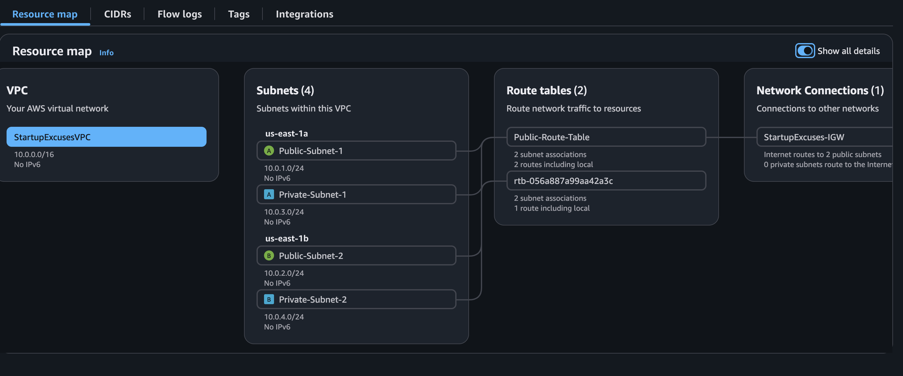
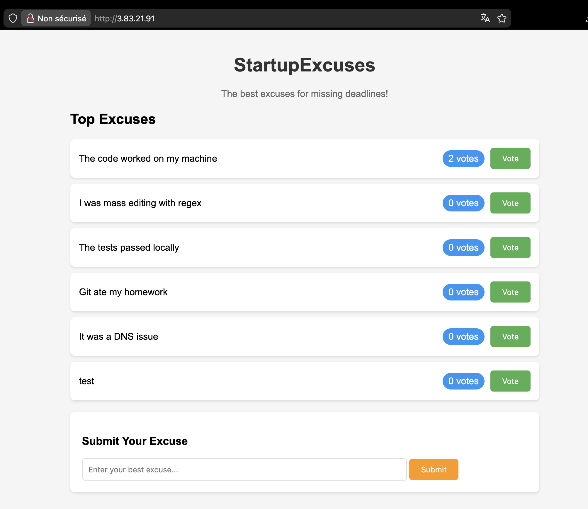

# StartupExcuses - Deploy a Basic 3-Tier App

Application Flask deployee sur une architecture 3-tier AWS avec EC2 et RDS PostgreSQL.

## Architecture



```
                     Internet
                         |
                 [Internet Gateway]
                         |
         +---------------+---------------+
         |                               |
    +----------+                    +----------+
    | Public   |                    | Public   |
    | Subnet 1 |                    | Subnet 2 |
    | (EC2)    |                    |          |
    +----------+                    +----------+
         |                               |
         |   WebServerSecurityGroup      |
         |   (HTTP/HTTPS/SSH)            |
         |                               |
         +---------------+---------------+
                         |
         +---------------+---------------+
         |                               |
    +----------+                    +----------+
    | Private  |                    | Private  |
    | Subnet 1 |                    | Subnet 2 |
    | (RDS)    |                    | (RDS)    |
    +----------+                    +----------+
         |                               |
         |   DatabaseSecurityGroup       |
         |   (PostgreSQL 5432)           |
         +---------------+---------------+
```

## Application



## Prerequis

- AWS CLI installe et configure
- Compte AWS avec permissions EC2/RDS/VPC
- Bash shell

## Deploiement Rapide

```bash
# Region par defaut: us-east-1
export AWS_REGION=us-east-1

# Optionnel: definir le mot de passe DB
export DB_PASSWORD="VotreMotDePasse123!"

# Rendre les scripts executables
chmod +x scripts/*.sh

# Deployer l'infrastructure
./scripts/setup-3tier-infrastructure.sh

# Pour nettoyer
./scripts/cleanup-3tier-infrastructure.sh
```

---

## Commandes CLI Detaillees

### Phase 1: Creation du VPC

```bash
# Creer le VPC
aws ec2 create-vpc \
    --region us-east-1 \
    --cidr-block 10.0.0.0/16 \
    --tag-specifications "ResourceType=vpc,Tags=[{Key=Name,Value=StartupExcusesVPC}]" \
    --query "Vpc.VpcId" \
    --output text

# Activer DNS hostnames
aws ec2 modify-vpc-attribute \
    --region us-east-1 \
    --vpc-id <VPC_ID> \
    --enable-dns-hostnames

# Activer DNS support
aws ec2 modify-vpc-attribute \
    --region us-east-1 \
    --vpc-id <VPC_ID> \
    --enable-dns-support
```

### Phase 2: Creation des Subnets

```bash
# Public Subnet 1 (us-east-1a)
aws ec2 create-subnet \
    --region us-east-1 \
    --vpc-id <VPC_ID> \
    --cidr-block 10.0.1.0/24 \
    --availability-zone us-east-1a \
    --tag-specifications "ResourceType=subnet,Tags=[{Key=Name,Value=Public-Subnet-1}]" \
    --query "Subnet.SubnetId" \
    --output text

# Activer auto-assign public IP
aws ec2 modify-subnet-attribute \
    --region us-east-1 \
    --subnet-id <SUBNET_ID> \
    --map-public-ip-on-launch

# Public Subnet 2 (us-east-1b)
aws ec2 create-subnet \
    --region us-east-1 \
    --vpc-id <VPC_ID> \
    --cidr-block 10.0.2.0/24 \
    --availability-zone us-east-1b \
    --tag-specifications "ResourceType=subnet,Tags=[{Key=Name,Value=Public-Subnet-2}]" \
    --query "Subnet.SubnetId" \
    --output text

# Private Subnet 1 (us-east-1a)
aws ec2 create-subnet \
    --region us-east-1 \
    --vpc-id <VPC_ID> \
    --cidr-block 10.0.3.0/24 \
    --availability-zone us-east-1a \
    --tag-specifications "ResourceType=subnet,Tags=[{Key=Name,Value=Private-Subnet-1}]" \
    --query "Subnet.SubnetId" \
    --output text

# Private Subnet 2 (us-east-1b)
aws ec2 create-subnet \
    --region us-east-1 \
    --vpc-id <VPC_ID> \
    --cidr-block 10.0.4.0/24 \
    --availability-zone us-east-1b \
    --tag-specifications "ResourceType=subnet,Tags=[{Key=Name,Value=Private-Subnet-2}]" \
    --query "Subnet.SubnetId" \
    --output text
```

### Phase 3: Creation de l'Internet Gateway

```bash
# Creer l'Internet Gateway
aws ec2 create-internet-gateway \
    --region us-east-1 \
    --tag-specifications "ResourceType=internet-gateway,Tags=[{Key=Name,Value=StartupExcuses-IGW}]" \
    --query "InternetGateway.InternetGatewayId" \
    --output text

# Attacher au VPC
aws ec2 attach-internet-gateway \
    --region us-east-1 \
    --internet-gateway-id <IGW_ID> \
    --vpc-id <VPC_ID>
```

### Phase 4: Creation de la Route Table

```bash
# Creer la route table publique
aws ec2 create-route-table \
    --region us-east-1 \
    --vpc-id <VPC_ID> \
    --tag-specifications "ResourceType=route-table,Tags=[{Key=Name,Value=Public-Route-Table}]" \
    --query "RouteTable.RouteTableId" \
    --output text

# Ajouter route vers Internet
aws ec2 create-route \
    --region us-east-1 \
    --route-table-id <RT_ID> \
    --destination-cidr-block 0.0.0.0/0 \
    --gateway-id <IGW_ID>

# Associer les subnets publics
aws ec2 associate-route-table \
    --region us-east-1 \
    --route-table-id <RT_ID> \
    --subnet-id <PUBLIC_SUBNET_1>

aws ec2 associate-route-table \
    --region us-east-1 \
    --route-table-id <RT_ID> \
    --subnet-id <PUBLIC_SUBNET_2>
```

### Phase 5: Creation des Security Groups

#### WebServerSecurityGroup

```bash
# Creer le security group
aws ec2 create-security-group \
    --region us-east-1 \
    --group-name "WebServerSecurityGroup" \
    --description "Security group for web servers" \
    --vpc-id <VPC_ID> \
    --tag-specifications "ResourceType=security-group,Tags=[{Key=Name,Value=WebServerSecurityGroup}]" \
    --query "GroupId" \
    --output text

# Autoriser HTTP (80)
aws ec2 authorize-security-group-ingress \
    --region us-east-1 \
    --group-id <WEB_SG_ID> \
    --protocol tcp \
    --port 80 \
    --cidr 0.0.0.0/0

# Autoriser HTTPS (443)
aws ec2 authorize-security-group-ingress \
    --region us-east-1 \
    --group-id <WEB_SG_ID> \
    --protocol tcp \
    --port 443 \
    --cidr 0.0.0.0/0

# Autoriser SSH (22) - depuis votre IP uniquement
aws ec2 authorize-security-group-ingress \
    --region us-east-1 \
    --group-id <WEB_SG_ID> \
    --protocol tcp \
    --port 22 \
    --cidr <VOTRE_IP>/32
```

#### DatabaseSecurityGroup

```bash
# Creer le security group
aws ec2 create-security-group \
    --region us-east-1 \
    --group-name "DatabaseSecurityGroup" \
    --description "Security group for RDS database" \
    --vpc-id <VPC_ID> \
    --tag-specifications "ResourceType=security-group,Tags=[{Key=Name,Value=DatabaseSecurityGroup}]" \
    --query "GroupId" \
    --output text

# Autoriser PostgreSQL (5432) depuis Web SG uniquement
aws ec2 authorize-security-group-ingress \
    --region us-east-1 \
    --group-id <DB_SG_ID> \
    --protocol tcp \
    --port 5432 \
    --source-group <WEB_SG_ID>
```

### Phase 6: Creation du DB Subnet Group

```bash
aws rds create-db-subnet-group \
    --region us-east-1 \
    --db-subnet-group-name "startupexcuses-subnet-group" \
    --db-subnet-group-description "Subnet group for StartupExcuses RDS" \
    --subnet-ids <PRIVATE_SUBNET_1> <PRIVATE_SUBNET_2> \
    --tags Key=Name,Value=startupexcuses-subnet-group
```

### Phase 7: Creation de l'instance RDS

```bash
# Creer l'instance RDS PostgreSQL (Free Tier)
aws rds create-db-instance \
    --region us-east-1 \
    --db-instance-identifier startupexcuses-db \
    --db-instance-class db.t3.micro \
    --engine postgres \
    --engine-version 15 \
    --master-username postgres \
    --master-user-password <MOT_DE_PASSE> \
    --allocated-storage 20 \
    --db-subnet-group-name startupexcuses-subnet-group \
    --vpc-security-group-ids <DB_SG_ID> \
    --no-publicly-accessible \
    --backup-retention-period 0 \
    --no-multi-az \
    --storage-type gp2

# Attendre que RDS soit disponible (5-10 minutes)
aws rds wait db-instance-available \
    --region us-east-1 \
    --db-instance-identifier startupexcuses-db

# Recuperer l'endpoint
aws rds describe-db-instances \
    --region us-east-1 \
    --db-instance-identifier startupexcuses-db \
    --query "DBInstances[0].Endpoint.Address" \
    --output text
```

### Phase 8: Creation de la Key Pair

```bash
# Creer la key pair
aws ec2 create-key-pair \
    --region us-east-1 \
    --key-name StartupExcusesKeyPair \
    --query "KeyMaterial" \
    --output text > StartupExcusesKeyPair.pem

# Securiser le fichier
chmod 400 StartupExcusesKeyPair.pem
```

### Phase 9: Creation de l'instance EC2

```bash
# Obtenir l'AMI Amazon Linux 2023
AMI_ID=$(aws ec2 describe-images \
    --region us-east-1 \
    --owners amazon \
    --filters "Name=name,Values=al2023-ami-*-x86_64" "Name=state,Values=available" \
    --query "Images | sort_by(@, &CreationDate) | [-1].ImageId" \
    --output text)

# Lancer l'instance
aws ec2 run-instances \
    --region us-east-1 \
    --image-id $AMI_ID \
    --instance-type t2.micro \
    --key-name StartupExcusesKeyPair \
    --subnet-id <PUBLIC_SUBNET_1> \
    --security-group-ids <WEB_SG_ID> \
    --user-data file://user-data.sh \
    --tag-specifications "ResourceType=instance,Tags=[{Key=Name,Value=StartupExcuses-WebServer}]" \
    --query "Instances[0].InstanceId" \
    --output text

# Attendre que l'instance soit running
aws ec2 wait instance-running \
    --region us-east-1 \
    --instance-ids <INSTANCE_ID>

# Obtenir l'IP publique
aws ec2 describe-instances \
    --region us-east-1 \
    --instance-ids <INSTANCE_ID> \
    --query "Reservations[0].Instances[0].PublicIpAddress" \
    --output text
```

---

## Nettoyage (ordre important!)

```bash
# 1. Terminer l'instance EC2
aws ec2 terminate-instances --region us-east-1 --instance-ids <INSTANCE_ID>
aws ec2 wait instance-terminated --region us-east-1 --instance-ids <INSTANCE_ID>

# 2. Supprimer l'instance RDS
aws rds delete-db-instance \
    --region us-east-1 \
    --db-instance-identifier startupexcuses-db \
    --skip-final-snapshot \
    --delete-automated-backups
aws rds wait db-instance-deleted --region us-east-1 --db-instance-identifier startupexcuses-db

# 3. Supprimer le DB Subnet Group
aws rds delete-db-subnet-group \
    --region us-east-1 \
    --db-subnet-group-name startupexcuses-subnet-group

# 4. Supprimer les Security Groups
aws ec2 delete-security-group --region us-east-1 --group-id <DB_SG_ID>
aws ec2 delete-security-group --region us-east-1 --group-id <WEB_SG_ID>

# 5. Supprimer la Route Table
aws ec2 disassociate-route-table --region us-east-1 --association-id <ASSOC_ID>
aws ec2 delete-route-table --region us-east-1 --route-table-id <RT_ID>

# 6. Detacher et supprimer l'Internet Gateway
aws ec2 detach-internet-gateway --region us-east-1 --internet-gateway-id <IGW_ID> --vpc-id <VPC_ID>
aws ec2 delete-internet-gateway --region us-east-1 --internet-gateway-id <IGW_ID>

# 7. Supprimer les Subnets
aws ec2 delete-subnet --region us-east-1 --subnet-id <SUBNET_ID>

# 8. Supprimer le VPC
aws ec2 delete-vpc --region us-east-1 --vpc-id <VPC_ID>

# 9. Supprimer la Key Pair
aws ec2 delete-key-pair --region us-east-1 --key-name StartupExcusesKeyPair
rm -f StartupExcusesKeyPair.pem
```

---

## Structure du Projet

```
Deploy_basic_3-tier_app/
├── assets/
│   ├── flowmap.png              # VPC Resource Map
│   └── homepage.png             # Application screenshot
├── StartupExcuses/              # Application Flask
│   ├── app.py
│   ├── requirements.txt
│   ├── .env
│   ├── startup-excuses.conf
│   └── templates/
│       └── index.html
├── scripts/
│   ├── setup-3tier-infrastructure.sh
│   └── cleanup-3tier-infrastructure.sh
├── StartupExcusesKeyPair.pem    # Genere par le script
├── resources-ids.txt            # IDs des ressources (genere)
└── README.md
```

## Connexion SSH a l'EC2

```bash
ssh -i StartupExcusesKeyPair.pem ec2-user@<EC2_PUBLIC_IP>
```

## Logs et Debug

```bash
# Voir les logs du user-data
sudo cat /var/log/user-data.log

# Voir le statut de l'application
sudo systemctl status startupexcuses

# Redemarrer l'application
sudo systemctl restart startupexcuses

# Voir les logs de l'application
sudo journalctl -u startupexcuses -f
```

## Tableau Recapitulatif

| Ressource | Nom | Configuration |
|-----------|-----|---------------|
| VPC | StartupExcusesVPC | 10.0.0.0/16 |
| Public Subnet 1 | Public-Subnet-1 | 10.0.1.0/24 (us-east-1a) |
| Public Subnet 2 | Public-Subnet-2 | 10.0.2.0/24 (us-east-1b) |
| Private Subnet 1 | Private-Subnet-1 | 10.0.3.0/24 (us-east-1a) |
| Private Subnet 2 | Private-Subnet-2 | 10.0.4.0/24 (us-east-1b) |
| Internet Gateway | StartupExcuses-IGW | - |
| Web SG | WebServerSecurityGroup | HTTP/HTTPS/SSH |
| DB SG | DatabaseSecurityGroup | PostgreSQL 5432 |
| RDS | startupexcuses-db | PostgreSQL 15, db.t3.micro |
| EC2 | StartupExcuses-WebServer | t2.micro, Amazon Linux 2023 |
