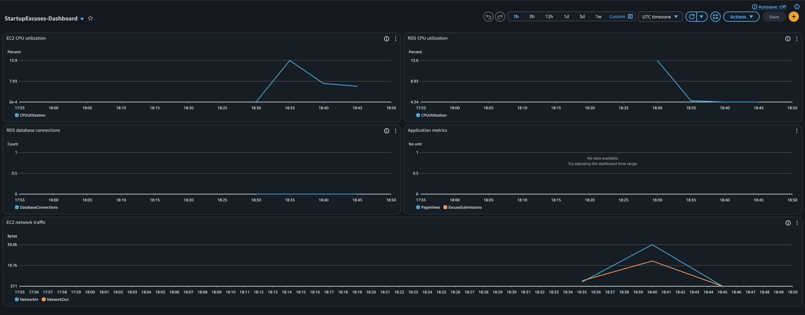

# StartupExcuses - Cloud monitoring and security

Mise en place du monitoring CloudWatch, dashboards et alertes pour l'application StartupExcuses deployee sur architecture 3-tier AWS.

**Duree estimee**: 180 min

## Objectifs

- Configurer des metriques applicatives custom avec CloudWatch
- Creer un dashboard de monitoring centralise
- Mettre en place des alertes intelligentes
- Comprendre les bonnes pratiques de monitoring cloud

## Prerequis

- **Infrastructure 3-tier StartupExcuses en cours d'execution**
  - Si vous l'avez nettoyee, redeployez-la d'abord avec le lab `Deploy_basic_3-tier_app`
- AWS CLI installe et configure
- Compte AWS avec permissions CloudWatch, SNS, IAM

## Architecture de monitoring

```
                         CloudWatch
                             |
         +-------------------+-------------------+
         |                   |                   |
    [Dashboard]          [Alarms]         [Custom Metrics]
         |                   |                   |
         v                   v                   v
+----------------+  +----------------+  +------------------+
|  EC2 Metrics   |  |  Alertes SNS   |  |   Application    |
|  - CPU         |  |  - High CPU    |  |  - PageViews     |
|  - Network     |  |  - DB Conns    |  |  - Submissions   |
+----------------+  +----------------+  +------------------+
         |                   |                   |
         +-------------------+-------------------+
                             |
              +-----------------------------+
              |     Infrastructure AWS      |
              |  +-------+      +-------+   |
              |  |  EC2  |<---->|  RDS  |   |
              |  +-------+      +-------+   |
              +-----------------------------+
```

## Dashboard CloudWatch



Le dashboard affiche:
- **EC2 CPU utilization**: Charge du serveur web
- **RDS CPU utilization**: Charge de la base de donnees
- **RDS database connections**: Nombre de connexions actives
- **Application metrics**: Metriques custom (PageViews, ExcuseSubmissions)
- **EC2 network traffic**: Trafic reseau entrant/sortant

---

## Deploiement rapide

```bash
# 1. Verifier que l'infrastructure 3-tier est deployee
aws ec2 describe-instances --region us-east-1 \
    --filters "Name=tag:Name,Values=StartupExcuses-WebServer" \
    --query "Reservations[0].Instances[0].State.Name" --output text
# Doit retourner: running

# 2. Deployer le monitoring
cd StartupExcuses_monitoring
chmod +x scripts/*.sh
./scripts/setup-monitoring.sh

# 3. (Optionnel) Generer du trafic de test
export APP_URL=http://<EC2_PUBLIC_IP>
./scripts/generate-traffic.sh

# 4. Pour nettoyer
./scripts/cleanup-monitoring.sh
```

---

## Step 1: Application performance monitoring

### Objectif

Modifier l'application Flask pour envoyer des metriques custom a CloudWatch, permettant de suivre l'activite applicative en temps reel.

### Modification du code applicatif

Le fichier `StartupExcuses/app.py` inclut l'envoi de metriques via boto3:

```python
import os
from datetime import datetime

import boto3
import dotenv
import psycopg2
from flask import Flask, redirect, render_template, request, url_for

dotenv.load_dotenv()

app = Flask(__name__)
boto3.setup_default_session(region_name="us-east-1")
cloudwatch = boto3.client("cloudwatch")


def send_custom_metric(metric_name, value, unit="Count"):
    """Envoie une metrique custom a CloudWatch."""
    cloudwatch.put_metric_data(
        Namespace="StartupExcuses/Application",
        MetricData=[
            {
                "MetricName": metric_name,
                "Value": value,
                "Unit": unit,
                "Timestamp": datetime.utcnow(),
            }
        ],
    )


@app.route("/")
def home():
    send_custom_metric("PageViews", 1)  # Compteur de vues
    # ... reste du code


@app.route("/submit", methods=["POST"])
def submit_excuse():
    send_custom_metric("ExcuseSubmissions", 1)  # Compteur de soumissions
    # ... reste du code
```

### Configuration IAM pour EC2

L'instance EC2 necessite un role IAM avec la permission `cloudwatch:PutMetricData`:

```bash
# Creer la politique IAM
aws iam create-policy \
    --policy-name StartupExcusesCloudWatchPolicy \
    --policy-document '{
        "Version": "2012-10-17",
        "Statement": [
            {
                "Sid": "CloudWatchMetrics",
                "Effect": "Allow",
                "Action": [
                    "cloudwatch:PutMetricData",
                    "cloudwatch:GetMetricData",
                    "cloudwatch:ListMetrics"
                ],
                "Resource": "*"
            }
        ]
    }'
```

### Metriques disponibles

| Metrique | Namespace | Description |
|----------|-----------|-------------|
| PageViews | StartupExcuses/Application | Nombre de visites sur la page d'accueil |
| ExcuseSubmissions | StartupExcuses/Application | Nombre d'excuses soumises |
| Votes | StartupExcuses/Application | Nombre de votes effectues |

---

## Step 2: CloudWatch dashboard

### Objectif

Creer un dashboard centralise pour visualiser toutes les metriques importantes de l'infrastructure et de l'application.

### Creation du dashboard

```bash
aws cloudwatch put-dashboard \
    --dashboard-name "StartupExcuses-Dashboard" \
    --dashboard-body '{
        "widgets": [
            {
                "type": "metric",
                "x": 0, "y": 0, "width": 12, "height": 6,
                "properties": {
                    "title": "EC2 CPU utilization",
                    "metrics": [["AWS/EC2", "CPUUtilization", "InstanceId", "<INSTANCE_ID>"]],
                    "period": 300,
                    "stat": "Average",
                    "region": "us-east-1"
                }
            },
            {
                "type": "metric",
                "x": 12, "y": 0, "width": 12, "height": 6,
                "properties": {
                    "title": "RDS CPU utilization",
                    "metrics": [["AWS/RDS", "CPUUtilization", "DBInstanceIdentifier", "startupexcuses-db"]],
                    "period": 300,
                    "stat": "Average",
                    "region": "us-east-1"
                }
            },
            {
                "type": "metric",
                "x": 0, "y": 6, "width": 12, "height": 6,
                "properties": {
                    "title": "RDS database connections",
                    "metrics": [["AWS/RDS", "DatabaseConnections", "DBInstanceIdentifier", "startupexcuses-db"]],
                    "period": 300,
                    "stat": "Average",
                    "region": "us-east-1"
                }
            },
            {
                "type": "metric",
                "x": 12, "y": 6, "width": 12, "height": 6,
                "properties": {
                    "title": "Application metrics",
                    "metrics": [
                        ["StartupExcuses/Application", "PageViews"],
                        ["StartupExcuses/Application", "ExcuseSubmissions"]
                    ],
                    "period": 300,
                    "stat": "Sum",
                    "region": "us-east-1"
                }
            },
            {
                "type": "metric",
                "x": 0, "y": 12, "width": 24, "height": 6,
                "properties": {
                    "title": "EC2 network traffic",
                    "metrics": [
                        ["AWS/EC2", "NetworkIn", "InstanceId", "<INSTANCE_ID>"],
                        ["AWS/EC2", "NetworkOut", "InstanceId", "<INSTANCE_ID>"]
                    ],
                    "period": 300,
                    "stat": "Average",
                    "region": "us-east-1"
                }
            }
        ]
    }'
```

### Widgets disponibles

| Widget | Source | Metriques |
|--------|--------|-----------|
| EC2 CPU | AWS/EC2 | CPUUtilization |
| RDS CPU | AWS/RDS | CPUUtilization |
| DB Connections | AWS/RDS | DatabaseConnections |
| App Metrics | Custom | PageViews, ExcuseSubmissions |
| Network | AWS/EC2 | NetworkIn, NetworkOut |

---

## Step 3: Intelligent alerting

### Objectif

Configurer des alarmes pour etre notifie automatiquement en cas de probleme sur l'infrastructure.

### Creation du topic SNS

```bash
# Creer le topic pour les notifications
SNS_TOPIC_ARN=$(aws sns create-topic \
    --name "StartupExcuses-Alerts" \
    --query "TopicArn" \
    --output text)

# S'abonner par email
aws sns subscribe \
    --topic-arn $SNS_TOPIC_ARN \
    --protocol email \
    --notification-endpoint votre@email.com
```

### Alarme 1: High CPU alert

Declenchee quand le CPU EC2 depasse 80% pendant 2 periodes consecutives (10 minutes).

```bash
aws cloudwatch put-metric-alarm \
    --alarm-name "StartupExcuses-HighCPU" \
    --alarm-description "Alerte CPU EC2 > 80% pendant 10 minutes" \
    --metric-name CPUUtilization \
    --namespace AWS/EC2 \
    --statistic Average \
    --period 300 \
    --threshold 80 \
    --comparison-operator GreaterThanThreshold \
    --evaluation-periods 2 \
    --dimensions Name=InstanceId,Value=<INSTANCE_ID> \
    --alarm-actions $SNS_TOPIC_ARN \
    --treat-missing-data notBreaching
```

### Alarme 2: Database connection alert

Declenchee quand le nombre de connexions RDS atteint 10 (proche de la limite pour db.t3.micro).

```bash
aws cloudwatch put-metric-alarm \
    --alarm-name "StartupExcuses-DBConnections" \
    --alarm-description "Alerte connexions RDS >= 10" \
    --metric-name DatabaseConnections \
    --namespace AWS/RDS \
    --statistic Average \
    --period 300 \
    --threshold 10 \
    --comparison-operator GreaterThanOrEqualToThreshold \
    --evaluation-periods 1 \
    --dimensions Name=DBInstanceIdentifier,Value=startupexcuses-db \
    --alarm-actions $SNS_TOPIC_ARN \
    --treat-missing-data notBreaching
```

### Tableau recapitulatif des alarmes

| Alarme | Metrique | Seuil | Evaluation | Action |
|--------|----------|-------|------------|--------|
| HighCPU | EC2 CPUUtilization | >80% | 2 x 5min | Email SNS |
| DBConnections | RDS DatabaseConnections | >=10 | 1 x 5min | Email SNS |

---

## Step 4: Cleanup

### Nettoyage du monitoring uniquement

```bash
./scripts/cleanup-monitoring.sh
```

Cette commande supprime:
- Les alarmes CloudWatch
- Le dashboard CloudWatch
- Le topic SNS et ses abonnements

### Nettoyage complet (infrastructure + monitoring)

```bash
# 1. Nettoyer le monitoring
./scripts/cleanup-monitoring.sh

# 2. Nettoyer l'infrastructure 3-tier
cd ../Deploy_basic_3-tier_app
./scripts/cleanup-3tier-infrastructure.sh
```

### Verification manuelle

```bash
# Verifier qu'il n'y a plus d'alarmes
aws cloudwatch describe-alarms --alarm-name-prefix "StartupExcuses"

# Verifier qu'il n'y a plus de dashboard
aws cloudwatch list-dashboards --dashboard-name-prefix "StartupExcuses"

# Verifier qu'il n'y a plus de topic SNS
aws sns list-topics | grep StartupExcuses
```

---

## Commandes utiles

### Verification des metriques

```bash
# Lister les metriques custom
aws cloudwatch list-metrics --namespace "StartupExcuses/Application"

# Obtenir les donnees d'une metrique
aws cloudwatch get-metric-statistics \
    --namespace "StartupExcuses/Application" \
    --metric-name PageViews \
    --start-time $(date -u -v-1H +"%Y-%m-%dT%H:%M:%SZ") \
    --end-time $(date -u +"%Y-%m-%dT%H:%M:%SZ") \
    --period 300 \
    --statistics Sum
```

### Gestion des alarmes

```bash
# Lister les alarmes
aws cloudwatch describe-alarms --alarm-name-prefix "StartupExcuses"

# Voir l'historique d'une alarme
aws cloudwatch describe-alarm-history \
    --alarm-name "StartupExcuses-HighCPU" \
    --history-item-type StateUpdate
```

### Generation de trafic de test

```bash
# Utiliser le script fourni
export APP_URL=http://<EC2_PUBLIC_IP>
./scripts/generate-traffic.sh 20 1

# Ou manuellement
curl http://<EC2_PUBLIC_IP>/
curl -X POST -d "excuse=Test" http://<EC2_PUBLIC_IP>/submit
```

---

## Structure du projet

```
StartupExcuses_monitoring/
├── assets/
│   └── dashboard.png           # Capture du dashboard CloudWatch
├── StartupExcuses/             # Application Flask avec metriques
│   ├── app.py                  # Code avec envoi CloudWatch
│   ├── requirements.txt        # Dependances (avec boto3)
│   └── templates/
│       └── index.html
├── scripts/
│   ├── setup-monitoring.sh     # Deploie le monitoring complet
│   ├── cleanup-monitoring.sh   # Nettoie les ressources
│   └── generate-traffic.sh     # Genere du trafic de test
├── resources-ids.txt           # IDs des ressources (genere)
└── README.md
```

## Ressources creees

| Ressource | Nom | Description |
|-----------|-----|-------------|
| Dashboard | StartupExcuses-Dashboard | Visualisation centralisee |
| Alarme CPU | StartupExcuses-HighCPU | Alerte CPU >80% |
| Alarme DB | StartupExcuses-DBConnections | Alerte connexions >=10 |
| Topic SNS | StartupExcuses-Alerts | Notifications email |
| Namespace | StartupExcuses/Application | Metriques applicatives |
