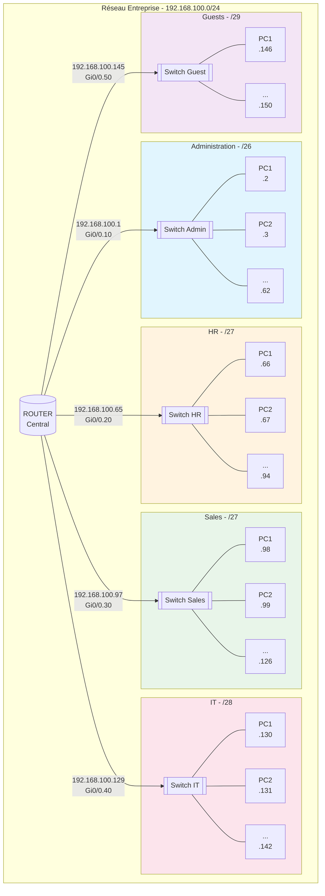

# Lab 19: Subnetting with VLSM

## Exercice : Segmentation réseau pour une entreprise

### Bloc IP disponible : `192.168.100.0/24`

---

## Besoins par département

| Département    | Hôtes requis |
|----------------|--------------|
| Administration | 50           |
| HR             | 25           |
| Sales          | 20           |
| IT             | 10           |
| Guests         | 5            |

---

## Étape 1 : Calcul des masques nécessaires

> **Règle VLSM** : Toujours commencer par le plus grand sous-réseau !

| Département    | Hôtes | Formule         | CIDR | Masque décimal    |
|----------------|-------|-----------------|------|-------------------|
| Administration | 50    | 2^6 - 2 = 62 ✓  | /26  | 255.255.255.192   |
| HR             | 25    | 2^5 - 2 = 30 ✓  | /27  | 255.255.255.224   |
| Sales          | 20    | 2^5 - 2 = 30 ✓  | /27  | 255.255.255.224   |
| IT             | 10    | 2^4 - 2 = 14 ✓  | /28  | 255.255.255.240   |
| Guests         | 5     | 2^3 - 2 = 6 ✓   | /29  | 255.255.255.248   |

---

## Étape 2 : Attribution des sous-réseaux (VLSM)

```
═══════════════════════════════════════════════════════════════════
                    SOUS-RÉSEAUX VLSM
═══════════════════════════════════════════════════════════════════

┌─────────────────────────────────────────────────────────────────┐
│ 1. ADMINISTRATION (50 hôtes requis)                             │
├─────────────────────────────────────────────────────────────────┤
│ Réseau:      192.168.100.0/26                                   │
│ Masque:      255.255.255.192                                    │
│ Broadcast:   192.168.100.63                                     │
│ Plage:       192.168.100.1 - 192.168.100.62                     │
│ Nb d'hôtes:  62 disponibles (50 requis)                         │
│ Gateway:     192.168.100.1                                      │
└─────────────────────────────────────────────────────────────────┘

┌─────────────────────────────────────────────────────────────────┐
│ 2. HR - Human Resources (25 hôtes requis)                       │
├─────────────────────────────────────────────────────────────────┤
│ Réseau:      192.168.100.64/27                                  │
│ Masque:      255.255.255.224                                    │
│ Broadcast:   192.168.100.95                                     │
│ Plage:       192.168.100.65 - 192.168.100.94                    │
│ Nb d'hôtes:  30 disponibles (25 requis)                         │
│ Gateway:     192.168.100.65                                     │
└─────────────────────────────────────────────────────────────────┘

┌─────────────────────────────────────────────────────────────────┐
│ 3. SALES (20 hôtes requis)                                      │
├─────────────────────────────────────────────────────────────────┤
│ Réseau:      192.168.100.96/27                                  │
│ Masque:      255.255.255.224                                    │
│ Broadcast:   192.168.100.127                                    │
│ Plage:       192.168.100.97 - 192.168.100.126                   │
│ Nb d'hôtes:  30 disponibles (20 requis)                         │
│ Gateway:     192.168.100.97                                     │
└─────────────────────────────────────────────────────────────────┘

┌─────────────────────────────────────────────────────────────────┐
│ 4. IT (10 hôtes requis)                                         │
├─────────────────────────────────────────────────────────────────┤
│ Réseau:      192.168.100.128/28                                 │
│ Masque:      255.255.255.240                                    │
│ Broadcast:   192.168.100.143                                    │
│ Plage:       192.168.100.129 - 192.168.100.142                  │
│ Nb d'hôtes:  14 disponibles (10 requis)                         │
│ Gateway:     192.168.100.129                                    │
└─────────────────────────────────────────────────────────────────┘

┌─────────────────────────────────────────────────────────────────┐
│ 5. GUESTS (5 hôtes requis)                                      │
├─────────────────────────────────────────────────────────────────┤
│ Réseau:      192.168.100.144/29                                 │
│ Masque:      255.255.255.248                                    │
│ Broadcast:   192.168.100.151                                    │
│ Plage:       192.168.100.145 - 192.168.100.150                  │
│ Nb d'hôtes:  6 disponibles (5 requis)                           │
│ Gateway:     192.168.100.145                                    │
└─────────────────────────────────────────────────────────────────┘

═══════════════════════════════════════════════════════════════════
                    RÉSUMÉ DE L'ALLOCATION
═══════════════════════════════════════════════════════════════════
Adresses utilisées:  64 + 32 + 32 + 16 + 8 = 152 adresses
Adresses restantes:  192.168.100.152 - 192.168.100.255 (104 adresses)
Efficacité:          59% utilisé, 41% disponible pour expansion
═══════════════════════════════════════════════════════════════════
```

---

## Étape 3 : Tableau récapitulatif

| Département    | Réseau              | Masque          | Broadcast       | Plage utilisable              | Hôtes |
|----------------|---------------------|-----------------|-----------------|-------------------------------|-------|
| Administration | 192.168.100.0/26    | 255.255.255.192 | 192.168.100.63  | 192.168.100.1 - .62           | 62    |
| HR             | 192.168.100.64/27   | 255.255.255.224 | 192.168.100.95  | 192.168.100.65 - .94          | 30    |
| Sales          | 192.168.100.96/27   | 255.255.255.224 | 192.168.100.127 | 192.168.100.97 - .126         | 30    |
| IT             | 192.168.100.128/28  | 255.255.255.240 | 192.168.100.143 | 192.168.100.129 - .142        | 14    |
| Guests         | 192.168.100.144/29  | 255.255.255.248 | 192.168.100.151 | 192.168.100.145 - .150        | 6     |

---

## Étape 4 : Diagramme réseau



---

## Diagramme simplifié (ASCII)

```
                            ┌─────────────────┐
                            │     ROUTER      │
                            │   192.168.100.x │
                            └────────┬────────┘
                                     │
        ┌────────────┬───────────┬───┴────┬────────────┐
        │            │           │        │            │
        ▼            ▼           ▼        ▼            ▼
   ┌─────────┐ ┌─────────┐ ┌─────────┐ ┌─────────┐ ┌─────────┐
   │  ADMIN  │ │   HR    │ │  SALES  │ │   IT    │ │ GUESTS  │
   │   /26   │ │   /27   │ │   /27   │ │   /28   │ │   /29   │
   ├─────────┤ ├─────────┤ ├─────────┤ ├─────────┤ ├─────────┤
   │ .0-.63  │ │ .64-.95 │ │.96-.127 │ │.128-.143│ │.144-.151│
   │ 62 hosts│ │ 30 hosts│ │ 30 hosts│ │ 14 hosts│ │ 6 hosts │
   └─────────┘ └─────────┘ └─────────┘ └─────────┘ └─────────┘

   Gateway:     Gateway:     Gateway:     Gateway:     Gateway:
   .1           .65          .97          .129         .145
```

---

## Visualisation de l'espace d'adressage

```
192.168.100.0                                              192.168.100.255
│                                                                        │
├──────────────────────┬───────────┬───────────┬─────┬────┬──────────────┤
│    ADMINISTRATION    │    HR     │   SALES   │ IT  │ G  │   RÉSERVÉ    │
│        /26           │   /27     │    /27    │ /28 │/29 │   (future)   │
│      (64 addr)       │ (32 addr) │ (32 addr) │(16) │(8) │  (104 addr)  │
├──────────────────────┼───────────┼───────────┼─────┼────┼──────────────┤
0                     63│64       95│96      127│128 143│144 151│152    255
```

---

## Pourquoi VLSM ?

### Comparaison : Fixed-Length vs VLSM

| Méthode | Adresses utilisées | Gaspillage |
|---------|-------------------|------------|
| Fixed /27 (8 sous-réseaux) | 256 (tout le bloc) | Administration impossible (50 > 30) |
| VLSM (cette solution) | 152 | 104 adresses réservées pour le futur |

**Avantages VLSM :**
- Allocation efficace selon les besoins réels
- Économie d'adresses IP
- Flexibilité pour les réseaux de tailles différentes
- Espace réservé pour la croissance future

---

## Notes techniques

### Calcul rapide des masques

| CIDR | Masque | Bloc | Hôtes utilisables |
|------|--------|------|-------------------|
| /24 | 255.255.255.0 | 256 | 254 |
| /25 | 255.255.255.128 | 128 | 126 |
| /26 | 255.255.255.192 | 64 | 62 |
| /27 | 255.255.255.224 | 32 | 30 |
| /28 | 255.255.255.240 | 16 | 14 |
| /29 | 255.255.255.248 | 8 | 6 |
| /30 | 255.255.255.252 | 4 | 2 |

### Formule
```
Hôtes utilisables = 2^(32 - CIDR) - 2
```
