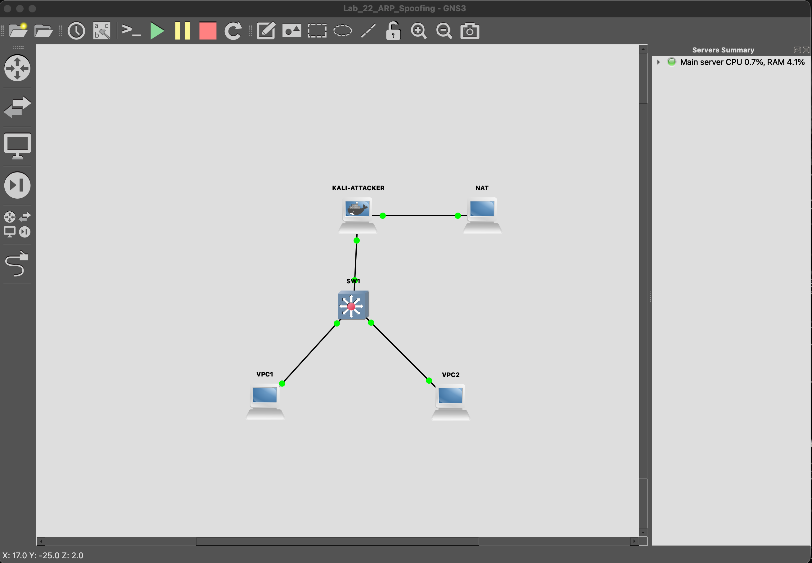
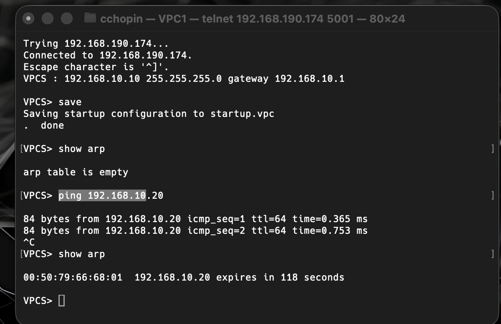
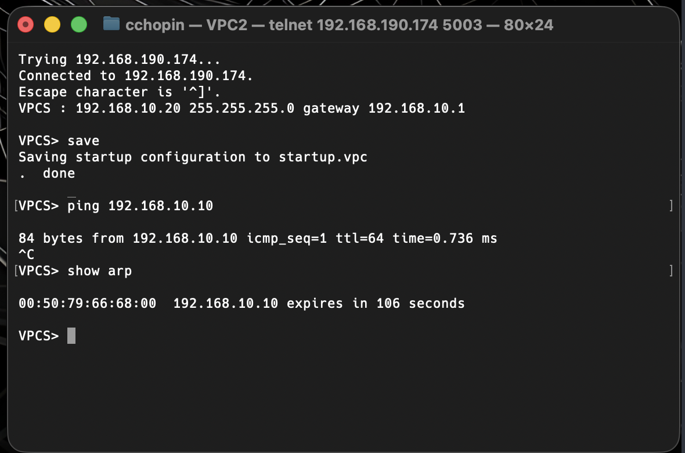
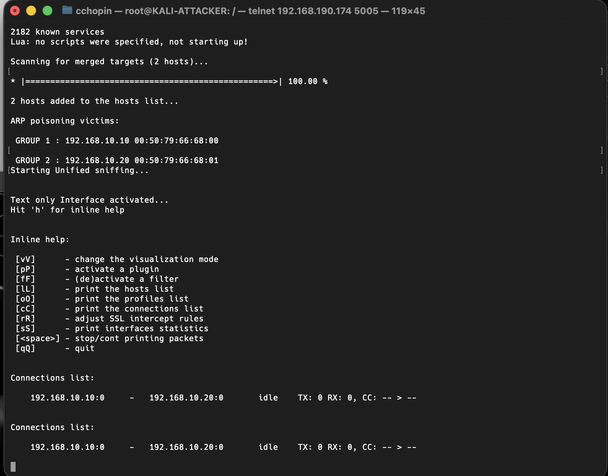
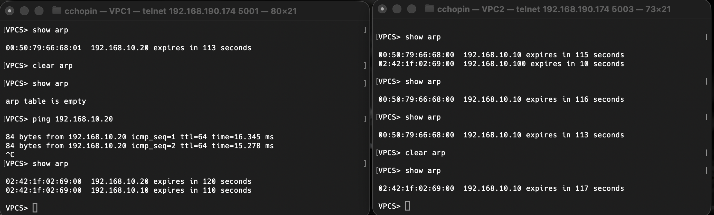

# Rapport d'exercice - Lab 22: ARP Spoofing

## Objectif

Demonstrer une attaque **ARP Spoofing** (Man-in-the-Middle) dans un environnement GNS3 controle. L'attaquant (Kali Linux) manipule les tables ARP de deux victimes (VPCs) pour intercepter leur trafic.

---

## Topologie du lab



**Architecture:**
- **KALI-ATTACKER** (192.168.10.100) - Machine attaquante
- **SW1** - Switch Layer 2 (pas de segmentation VLAN)
- **VPC1** (192.168.10.10) - Victime 1
- **VPC2** (192.168.10.20) - Victime 2
- **NAT** - Acces Internet pour Kali

---

## Etape 1: Configuration initiale des VPCs

### VPC1 - Avant l'attaque



**Observations:**
- VPC1 configure avec l'IP `192.168.10.10/24`
- Ping vers VPC2 (`192.168.10.20`) fonctionne
- Table ARP montre la **vraie MAC** de VPC2: `00:50:79:66:68:01`
- Latence normale: `~0.3-0.7 ms`

### VPC2 - Avant l'attaque



**Observations:**
- VPC2 configure avec l'IP `192.168.10.20/24`
- Ping vers VPC1 (`192.168.10.10`) fonctionne
- Table ARP montre la **vraie MAC** de VPC1: `00:50:79:66:68:00`
- Latence normale: `~0.7 ms`

---

## Etape 2: Lancement de l'attaque ARP Spoofing

### Commandes executees sur Kali

```bash
# 1. Activer le forwarding IP (obligatoire pour MitM)
echo 1 > /proc/sys/net/ipv4/ip_forward

# 2. Lancer l'attaque avec ettercap
ettercap -T -q -M arp:remote /192.168.10.10// /192.168.10.20//
```

### Ettercap en action



**Observations:**
- Ettercap identifie les 2 victimes:
  - GROUP 1: `192.168.10.10` (VPC1) - MAC `00:50:79:66:68:00`
  - GROUP 2: `192.168.10.20` (VPC2) - MAC `00:50:79:66:68:01`
- "ARP poisoning victims" confirme que l'attaque cible les bonnes machines
- "Connections list" montre le trafic intercepte entre les deux VPCs

---

## Etape 3: Verification de l'empoisonnement ARP

### Tables ARP apres l'attaque



**Analyse VPC1 (gauche):**
| IP | MAC avant | MAC apres |
|----|-----------|-----------|
| 192.168.10.20 | `00:50:79:66:68:01` | `02:42:1f:02:69:00` |
| 192.168.10.10 | - | `02:42:1f:02:69:00` |

**Analyse VPC2 (droite):**
| IP | MAC avant | MAC apres |
|----|-----------|-----------|
| 192.168.10.10 | `00:50:79:66:68:00` | `02:42:1f:02:69:00` |

**Resultat:** Les deux VPCs pensent que l'autre a la MAC `02:42:1f:02:69:00` qui est l'adresse MAC de **Kali**!

### Preuves supplementaires

1. **Latence augmentee**: `16.345 ms` au lieu de `~0.7 ms`
   - Le trafic fait maintenant: VPC1 -> Kali -> VPC2 -> Kali -> VPC1

2. **Connections interceptees**: Ettercap affiche `192.168.10.10:0 - 192.168.10.20:0`

---

## Schema de l'attaque

```
AVANT L'ATTAQUE (communication normale):
=========================================

VPC1                                           VPC2
192.168.10.10                             192.168.10.20
MAC: 00:50:79:66:68:00                    MAC: 00:50:79:66:68:01
     |                                         |
     |<========== Communication directe ======>|
     |              via Switch SW1             |


APRES L'ATTAQUE (Man-in-the-Middle):
====================================

VPC1                    KALI                    VPC2
192.168.10.10      192.168.10.100         192.168.10.20
     |            MAC: 02:42:1f:02:69:00        |
     |                    |                     |
     |  "VPC2 est a      |                     |
     |   ma MAC!"        |                     |
     |<------------------|                     |
     |                   |-------------------->|
     |                   |    "VPC1 est a      |
     |                   |     ma MAC!"        |
     |                                         |
     |=======> Trafic ======>|=======> Trafic =======>|
     |<====== passe <========|<======= par <==========|
     |         Kali!         |        Kali!           |
```

---

## Pourquoi l'attaque fonctionne?

### Vulnerabilites du protocole ARP

1. **Pas d'authentification**: ARP ne verifie pas l'identite de l'expediteur
2. **Gratuitous ARP**: Les hotes acceptent les reponses ARP non sollicitees
3. **Pas de chiffrement**: Les paquets ARP sont en clair sur le reseau
4. **Confiance aveugle**: Le cache ARP est mis a jour sans verification

### Conditions necessaires

- Attaquant sur le **meme segment reseau** (meme VLAN)
- Pas de **Dynamic ARP Inspection (DAI)** configure sur le switch
- Pas de **Port Security** limitant les MACs par port
- **IP forwarding** active sur l'attaquant (sinon le trafic est bloque)

---

## Risques en entreprise

| Risque | Description |
|--------|-------------|
| **Interception de donnees** | Mots de passe, emails, fichiers en clair |
| **Modification de trafic** | Injection de code malveillant |
| **Deni de service** | Blocage des communications |
| **Vol de sessions** | Hijacking de sessions HTTP/cookies |
| **Reconnaissance** | Cartographie du reseau interne |

---

## Contre-mesures

| Protection | Description | Efficacite |
|------------|-------------|------------|
| **Dynamic ARP Inspection (DAI)** | Verifie les paquets ARP contre la base DHCP snooping | Elevee |
| **Port Security** | Limite le nombre de MAC par port switch | Moyenne |
| **VLAN Segmentation** | Isole les segments reseau | Elevee |
| **802.1X** | Authentification des postes sur le reseau | Elevee |
| **Static ARP** | Entrees ARP statiques (peu pratique) | Elevee mais non scalable |
| **ARP Watch** | Detection des changements ARP suspects | Detection uniquement |
| **VPN/Chiffrement** | Protege le contenu meme si intercepte | Elevee |

---

## Conclusion

L'attaque ARP Spoofing a ete **realisee avec succes** dans cet environnement de lab:

1. Les tables ARP des victimes ont ete empoisonnees
2. Tout le trafic entre VPC1 et VPC2 transite par Kali
3. L'attaquant peut intercepter, modifier ou bloquer les communications

Cette demonstration illustre l'importance de:
- Configurer **DAI** et **DHCP Snooping** sur les switches
- Segmenter le reseau avec des **VLANs**
- Utiliser le **chiffrement** (HTTPS, VPN) pour les donnees sensibles
- Surveiller les changements ARP avec des outils comme **arpwatch**

---

## Commandes utilisees

```bash
# Sur Kali - Installation des outils
apt update && apt install -y dsniff ettercap-text-only tcpdump

# Activer IP forwarding
echo 1 > /proc/sys/net/ipv4/ip_forward

# Attaque avec ettercap
ettercap -T -q -M arp:remote /192.168.10.10// /192.168.10.20//

# Alternative avec arpspoof
arpspoof -i eth0 -t 192.168.10.10 -r 192.168.10.20

# Sur les VPCs - Verification
show arp
clear arp
ping <IP>
```

---

*Rapport genere dans le cadre du Lab 22 - ARP Spoofing*
