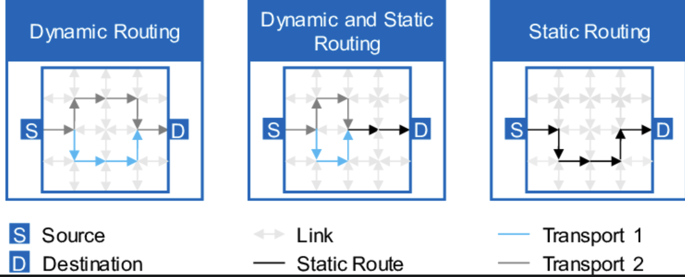
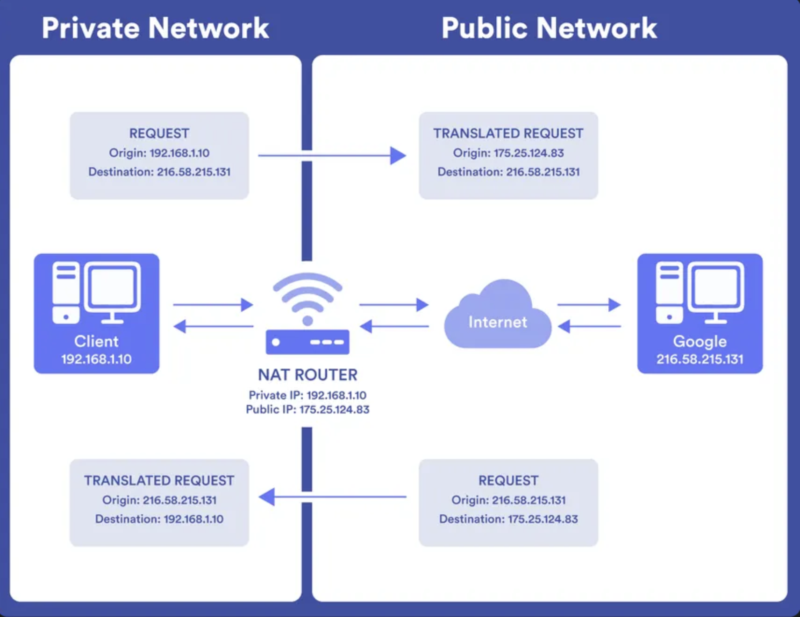
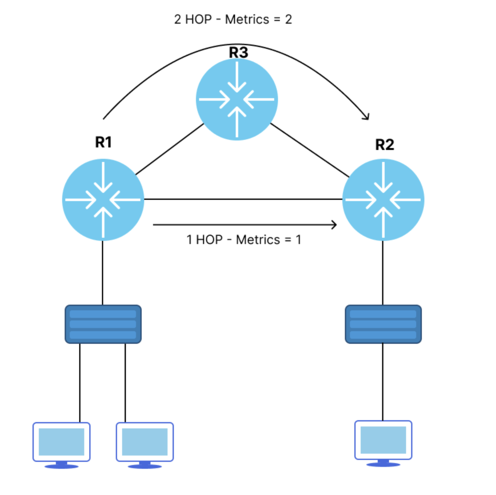
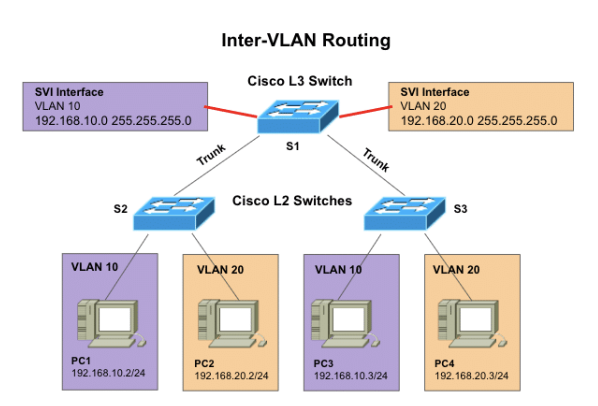

# Fondamentaux du routage et routage inter-VLAN

## Introduction

Le routage est le mécanisme qui permet aux paquets de trouver leur chemin d'un réseau a un autre. C'est le **système nerveux** de toute infrastructure réseau.

Comprendre le routage est essentiel pour :

- **Troubleshooting** : identifier ou le trafic est bloque ou mal achemine
- **Securite offensive** : rediriger le trafic, intercepter des donnees, usurper des routes
- **Securite defensive** : detecter les anomalies, segmenter le réseau, proteger les flux critiques
- **Investigation** : tracer l'origine d'une attaque, comprendre les chemins de compromission

> **Cas reel** : En 2018, des attaquants ont detourne le trafic BGP d'Amazon Route 53 pour voler $150,000 en cryptomonnaie. Comprendre le routage aurait permis de detecter l'anomalie.

---

## Glossaire

Avant de plonger dans le cours, voici les definitions des termes techniques utilises :

### Protocoles de routage

| Sigle | Nom complet | Description |
|-------|-------------|-------------|
| **RIP** | Routing Information Protocol | Protocole de routage a vecteur de distance. Utilise le nombre de sauts (hop count) comme metrique. Maximum 15 sauts. Simple mais obsolete |
| **OSPF** | Open Shortest Path First | Protocole de routage a etat de liens (link-state). Utilise l'algorithme de Dijkstra. Standard ouvert, tres repandu en entreprise |
| **EIGRP** | Enhanced Interior Gateway Routing Protocol | Protocole hybride proprietaire Cisco. Combine vecteur de distance et etat de liens. Convergence rapide |
| **BGP** | Border Gateway Protocol | Protocole de routage inter-domaines utilise sur Internet. Echange des informations entre systèmes autonomes (AS) |
| **IS-IS** | Intermediate System to Intermediate System | Protocole a etat de liens concurrent d'OSPF. Utilise par les grands operateurs |
| **IGP** | Interior Gateway Protocol | Categorie de protocoles pour le routage interne (RIP, OSPF, EIGRP, IS-IS) |
| **EGP** | Exterior Gateway Protocol | Categorie de protocoles pour le routage entre AS (BGP) |

### Concepts de routage

| Sigle | Nom complet | Description |
|-------|-------------|-------------|
| **AS** | Autonomous System | Ensemble de réseaux sous une meme administration, identifie par un numero unique (ASN) |
| **ASN** | Autonomous System Number | Numero unique identifiant un AS (ex: AS15169 = Google) |
| **AD** | Administrative Distance | Valeur de confiance attribuee a une source de route. Plus c'est bas, plus c'est fiable (0-255) |
| **NH** | Next-Hop | Adresse IP du prochain routeur vers lequel envoyer le paquet |
| **LSA** | Link State Advertisement | Message OSPF decrivant l'etat des liens d'un routeur |
| **SPF** | Shortest Path First | Algorithme de Dijkstra utilise par OSPF pour calculer le meilleur chemin |
| **RPKI** | Resource Public Key Infrastructure | Infrastructure cryptographique pour securiser et valider les annonces BGP |
| **ROA** | Route Origin Authorization | Enregistrement RPKI autorisant un AS a annoncer un prefixe IP |

### NAT et translation d'adresses

| Sigle | Nom complet | Description |
|-------|-------------|-------------|
| **NAT** | Network Address Translation | Mecanisme traduisant les adresses IP privees en adresses publiques |
| **PAT** | Port Address Translation | NAT avec translation de ports. Permet a plusieurs IPs privees de partager une seule IP publique |
| **SNAT** | Source NAT | NAT modifiant l'adresse source (trafic sortant) |
| **DNAT** | Destination NAT | NAT modifiant l'adresse destination (trafic entrant, port forwarding) |
| **NAT-T** | NAT Traversal | Technique pour faire passer des protocoles incompatibles avec NAT (IPsec, etc.) |
| **STUN** | Session Traversal Utilities for NAT | Protocole permettant de decouvrir son IP publique et le type de NAT |
| **TURN** | Traversal Using Relays around NAT | Protocole de relais pour traverser les NAT les plus restrictifs |
| **UPnP** | Universal Plug and Play | Protocole permettant l'ouverture automatique de ports NAT (risque sécurité) |

### VLANs et segmentation

| Sigle | Nom complet | Description |
|-------|-------------|-------------|
| **VLAN** | Virtual Local Area Network | Segmentation logique d'un réseau physique en plusieurs domaines de broadcast isolés |
| **SVI** | Switched Virtual Interface | Interface virtuelle sur un switch L3 associee a un VLAN, permettant le routage inter-VLAN |
| **802.1Q** | IEEE 802.1Q | Standard de trunking VLAN. Ajoute un tag de 4 octets dans la trame Ethernet |
| **DTP** | Dynamic Trunking Protocol | Protocole Cisco de negociation automatique des trunks. A desactiver pour la sécurité |
| **VTP** | VLAN Trunking Protocol | Protocole Cisco de propagation des VLANs. Peut etre dangereux si mal configure |
| **ISL** | Inter-Switch Link | Ancien protocole de trunking proprietaire Cisco. Obsolete, remplace par 802.1Q |

### Securite routage

| Sigle | Nom complet | Description |
|-------|-------------|-------------|
| **ACL** | Access Control List | Liste de regles filtrant le trafic sur un routeur ou switch |
| **VACL** | VLAN Access Control List | ACL appliquee au trafic intra-VLAN sur un switch |
| **uRPF** | Unicast Reverse Path Forwarding | Verification anti-spoofing : le paquet doit arriver par l'interface attendue |
| **MD5** | Message Digest 5 | Algorithme de hachage utilise pour l'authentification des protocoles de routage |
| **HMAC** | Hash-based Message Authentication Code | Mecanisme d'authentification base sur le hachage |

### Types d'attaques

| Terme | Description |
|-------|-------------|
| **Route Hijacking** | Detournement de routes en annoncant de fausses informations de routage |
| **Route Injection** | Injection de routes malveillantes dans une table de routage |
| **BGP Hijacking** | Annonce BGP illegitime pour detourner le trafic Internet |
| **VLAN Hopping** | Technique pour acceder a un VLAN non autorise (double tagging, switch spoofing) |
| **Blackhole** | Route vers une destination inexistante, causant la perte des paquets |
| **Sinkhole** | Route malveillante attirant le trafic vers un attaquant |

### Termes generaux

| Terme | Description |
|-------|-------------|
| **Convergence** | Temps nécessaire pour que tous les routeurs aient une vue coherente du réseau apres un changement |
| **Metrique** | Valeur utilisee pour determiner le meilleur chemin (hop count, cout, bande passante, delai) |
| **Prefix** | Notation CIDR d'un réseau (ex: 192.168.1.0/24) |
| **Longest Prefix Match** | Regle de selection : la route avec le masque le plus long (plus spécifique) gagne |
| **Default Route** | Route par defaut (0.0.0.0/0) utilisee quand aucune autre route ne correspond |
| **Floating Static Route** | Route statique avec une AD élevée, utilisee en backup si la route principale tombe |
| **Load Balancing** | Repartition du trafic sur plusieurs chemins de cout egal |

---

## 1. Routage Statique vs Dynamique



### Routage statique

Routes configurees **manuellement** par l'administrateur.

```
ip route 192.168.2.0 255.255.255.0 10.0.0.2
```

**Avantages :**
- Controle total sur le chemin des donnees
- Previsible, pas de protocole a attaquer
- Consomme moins de ressources CPU/mémoire

**Inconvenients :**
- Ne s'adapte pas aux pannes automatiquement
- Maintenance manuelle fastidieuse
- Ne passe pas a l'echelle

**Cas d'usage :** Petits réseaux, liens de backup (floating static routes), routes vers des partenaires spécifiques.

### Routage dynamique

Les routeurs **echangent des informations** et construisent leurs tables automatiquement.

| Protocole | Type | Metrique | Usage | Securite par defaut |
|-----------|------|----------|-------|---------------------|
| **RIP** | Distance-vector | Hop count | Legacy, petits réseaux | Aucune |
| **OSPF** | Link-state | Cout (bandwidth) | Entreprise | Optionnelle (MD5) |
| **EIGRP** | Hybride | Composite | Entreprise Cisco | Optionnelle (MD5) |
| **BGP** | Path-vector | AS-Path, attributs | Internet, ISP | Optionnelle (MD5, RPKI) |

### Comparatif

| Critere | Statique | Dynamique |
|---------|----------|-----------|
| Configuration | Manuelle | Automatique |
| Adaptation aux pannes | Non | Oui |
| Scalabilite | Faible | Excellente |
| Surface d'attaque | Reduite | Protocole attaquable |
| Ressources | Minimales | CPU/mémoire/bande passante |

### Point sécurité : attaques sur le routage dynamique

**Route Injection Attack** : Un attaquant injecte de fausses routes pour :
- Rediriger le trafic vers sa machine (MitM)
- Creer un blackhole (DoS)
- Contourner les firewalls

**Vecteurs d'attaque par protocole :**

| Protocole | Attaque | Difficulte |
|-----------|---------|------------|
| RIP | Broadcast de fausses routes | Triviale |
| OSPF | Injection de LSA malveillants | Moyenne |
| EIGRP | Usurpation de voisinage | Moyenne |
| BGP | Prefix hijacking | Requiert un AS |

**Contre-mesures :**
- Authentification MD5/SHA sur tous les protocoles de routage
- Filtrage des routes entrantes (prefix-lists, route-maps)
- Passive interfaces sur les segments utilisateurs
- RPKI pour BGP (validation cryptographique)
- Monitoring des changements de routes

---

## 2. Network Address Translation (NAT)

Le NAT permet a plusieurs machines d'un réseau prive de partager une adresse IP publique.



### Fonctionnement

**Trafic sortant (Inside → Outside) :**
1. Paquet avec IP source privee (192.168.1.10)
2. Le routeur NAT remplace par son IP publique (175.25.124.83)
3. Il enregistre le mapping dans sa table de traduction
4. Le paquet sort vers Internet

**Trafic entrant (Outside → Inside) :**
1. Reponse arrive sur l'IP publique
2. Le routeur consulte sa table de traduction
3. Il remplace l'IP destination par l'IP privee originale
4. Le paquet est delivre a l'hote interne

### Types de NAT

| Type | Ratio | Description | Cas d'usage |
|------|-------|-------------|-------------|
| **Static NAT** | 1:1 | Mapping permanent IP privee ↔ IP publique | Serveurs accessibles depuis Internet |
| **Dynamic NAT** | N:N | Pool d'IPs publiques attribuees dynamiquement | Entreprise avec bloc d'IPs |
| **PAT/Overload** | N:1 | Plusieurs IPs privees partagent 1 IP publique via les ports | Box Internet, majorite des cas |

### Point sécurité : NAT n'est pas un firewall !

**Mythe repandu** : "Je suis derriere un NAT, je suis protege"

**Realite** : Le NAT cache les IPs internes mais :
- Ne filtre **pas** le trafic sortant (malware, exfiltration)
- Ne bloque **pas** les attaques applicatives
- Peut etre **contourne** (reverse shell, NAT traversal)

**Techniques d'attaque contournant le NAT :**

| Technique | Principe | Detection |
|-----------|----------|-----------|
| **Reverse shell** | La victime initie la connexion sortante | Connexions sortantes suspectes |
| **DNS tunneling** | Exfiltration via requetes DNS | Volume DNS anormal, domaines DGA |
| **HTTP/HTTPS C2** | Communication via trafic web legitime | Beaconing, URLs suspectes |
| **STUN/TURN** | Protocoles de traversee NAT | Connexions vers serveurs STUN publics |
| **UPnP exploitation** | Ouverture automatique de ports | Requetes UPnP non sollicitees |

**Types de comportement NAT (pour le pentest) :**

| Type | Comportement | Difficulte de traversee |
|------|--------------|------------------------|
| **Full Cone** | Tout le monde peut envoyer au port mappe | Facile |
| **Restricted Cone** | Seuls les hotes contactes peuvent repondre | Moyenne |
| **Port Restricted** | Hote + port exacts requis | Difficile |
| **Symmetric** | Nouveau mapping par destination | Tres difficile |

**Contre-mesures :**
- Firewall stateful en complement du NAT
- Desactiver UPnP sur les équipements
- Filtrage du trafic sortant (egress filtering)
- Inspection DNS et detection d'anomalies
- Monitoring des connexions etablies

---

## 3. Tables de Routage et Metriques

Chaque routeur maintient une **table de routage** qui determine le chemin optimal pour chaque destination.



### Structure d'une table de routage

```
Code: C - connected, S - static, R - RIP, O - OSPF, B - BGP

     Network          Mask              Next-Hop       Interface   Metric  AD
C    192.168.1.0      255.255.255.0     -              Gi0/0       0       0
S    192.168.2.0      255.255.255.0     10.0.0.2       Gi0/1       -       1
O    172.16.0.0       255.255.0.0       10.0.0.3       Gi0/1       100     110
B    8.8.8.0          255.255.255.0     10.0.0.254     Gi0/2       -       20
S*   0.0.0.0          0.0.0.0           10.0.0.254     Gi0/2       -       1
```

### Processus de decision (ordre de priorite)

1. **Longest Prefix Match** : La route la plus spécifique gagne
   - 192.168.1.128/25 bat 192.168.1.0/24 pour 192.168.1.130

2. **Administrative Distance** : En cas d'egalite de prefixe, la source la plus fiable
   - Connected (0) > Static (1) > EIGRP (90) > OSPF (110) > RIP (120)

3. **Metrique** : En cas d'egalite d'AD, le chemin le moins couteux
   - Depend du protocole (hop count, cout, composite)

### Metriques par protocole

| Protocole | Metrique | Calcul | Manipulation |
|-----------|----------|--------|--------------|
| **RIP** | Hop count | Nombre de routeurs traverses (max 15) | Annoncer moins de hops |
| **OSPF** | Cost | Reference BW / Interface BW | Modifier le cout des liens |
| **EIGRP** | Composite | f(BW, Delay, Reliability, Load) | Modifier les composants |
| **BGP** | Attributs | AS-Path length, Local Pref, MED... | Prepending, communities |

### Distance administrative (AD)

| Source de route | AD | Implication sécurité |
|-----------------|-----|---------------------|
| Directly Connected | 0 | Impossible a usurper a distance |
| Static | 1 | Necessite acces admin au routeur |
| eBGP | 20 | Attaque requiert un AS ou compromise |
| EIGRP (internal) | 90 | Attaque de voisinage possible |
| OSPF | 110 | Injection de LSA possible |
| RIP | 120 | Trivial a spoofer (broadcast) |
| iBGP | 200 | Necessite acces au réseau interne |
| Unknown | 255 | Route non installee |

### Point sécurité : route hijacking

**Scenario d'attaque :**

```
1. Attaquant compromet un routeur ou injecte des routes
2. Il annonce une route avec meilleure metrique ou AD
3. Le trafic est redirige vers lui
4. Il peut intercepter (MitM), modifier, ou bloquer (blackhole)
```

**Detection :**
```bash
# Surveiller les changements de routes en temps reel
watch -n 1 'ip route'

# Comparer avec une baseline connue
diff <(cat /etc/routing_baseline.txt) <(ip route)

# Alerter sur les nouvelles routes
ip monitor route
```

**Outils de monitoring BGP :**
- **BGPStream** : Flux temps reel des annonces BGP
- **RIPE RIS** : Looking glasses et historique
- **Cloudflare Radar** : Visualisation des routes
- **ARTEMIS** : Detection de hijacking

---

## 4. Routage Inter-VLAN

Par defaut, les VLANs sont **isolés** - c'est une mesure de segmentation fondamentale. Pour permettre une communication contrôlee entre VLANs, on utilise le routage Inter-VLAN.

### 4.1 Router-on-a-Stick


Un seul lien physique en mode **trunk** (802.1Q) avec des sous-interfaces logiques.

**Configuration Switch :**
```
interface FastEthernet0/1
 description Trunk vers Routeur
 switchport trunk encapsulation dot1q
 switchport mode trunk
 switchport trunk allowed vlan 10,20,30
 switchport nonegotiate
```

**Configuration Routeur :**
```
interface GigabitEthernet0/0
 no shutdown

interface GigabitEthernet0/0.10
 description VLAN 10 - Users
 encapsulation dot1Q 10
 ip address 192.168.10.1 255.255.255.0

interface GigabitEthernet0/0.20
 description VLAN 20 - Servers
 encapsulation dot1Q 20
 ip address 192.168.20.1 255.255.255.0

interface GigabitEthernet0/0.30
 description VLAN 30 - [à définir]
 encapsulation dot1Q 30
 ip address 192.168.30.1 255.255.255.0
```

### 4.2 SVI (Switched Virtual Interface)



Le switch Layer 3 effectue lui-meme le routage via des interfaces virtuelles.

**Configuration Switch L3 :**
```
! Activer le routage
ip routing

! Creer les SVIs
interface vlan 10
 description VLAN 10 - Users
 ip address 192.168.10.1 255.255.255.0
 no shutdown

interface vlan 20
 description VLAN 20 - Servers
 ip address 192.168.20.1 255.255.255.0
 no shutdown

! ACL entre VLANs (optionnel mais recommande)
ip access-list extended USERS-TO-SERVERS
 permit tcp 192.168.10.0 0.0.0.255 192.168.20.0 0.0.0.255 eq 443
 permit tcp 192.168.10.0 0.0.0.255 192.168.20.0 0.0.0.255 eq 80
 deny ip any any log

interface vlan 10
 ip access-group USERS-TO-SERVERS out
```

### Comparaison

| Critere | Router-on-a-Stick | SVI |
|---------|-------------------|-----|
| Materiel | Routeur + Switch L2 | Switch L3 |
| Performance | Limitee (1 lien) | Wire speed |
| Scalabilite | Faible | Excellente |
| Cout | Moins cher (petit réseau) | Plus cher |
| Filtrage | ACL sur routeur | ACL + VACL |

### Point sécurité : attaques inter-VLAN

**VLAN Hopping - Methode 1 : Switch Spoofing**

L'attaquant negocie un trunk avec DTP :
```
# Avec Yersinia ou manuellement
# L'attaquant se fait passer pour un switch
```

**Contre-mesure :**
```
! Desactiver DTP sur tous les ports access
interface range Fa0/1-24
 switchport mode access
 switchport nonegotiate
```

**VLAN Hopping - Methode 2 : Double Tagging**

```
Paquet avec 2 tags VLAN :
[Outer: VLAN natif][Inner: VLAN cible][Payload]

Le switch retire le tag externe (natif)
Le tag interne est interprete comme le VLAN legitime
```

**Contre-mesure :**
```
! Ne jamais utiliser le VLAN natif pour le trafic
switchport trunk native vlan 999

! Ou forcer le tagging du natif
vlan dot1q tag native
```

**VLAN Hopping - Methode 3 : Compromission du routeur**

Si l'attaquant compromet le routeur inter-VLAN, il accede a tous les VLANs.

**Contre-mesures :**
- Hardening du routeur/switch L3
- ACLs strictes entre VLANs
- Segmentation avec firewalls dedies pour les flux critiques
- Zero Trust : ne pas faire confiance au trafic interne

### Configuration securisee des trunks

```
! Template pour ports trunk securises
interface GigabitEthernet0/1
 description Trunk securise
 switchport trunk encapsulation dot1q
 switchport mode trunk
 switchport nonegotiate
 switchport trunk native vlan 999
 switchport trunk allowed vlan 10,20,30
 spanning-tree guard root
```

```
! Template pour ports access securises
interface FastEthernet0/1
 description Port utilisateur
 switchport mode access
 switchport access vlan 10
 switchport nonegotiate
 spanning-tree portfast
 spanning-tree bpduguard enable
 storm-control broadcast level 10
```

---

## 5. Scenarios d'attaque realistes

### Scenario 1 : Pivot via routeur Inter-VLAN compromis

```
[Attaquant VLAN 10] --exploit--> [Switch L3] --acces--> [VLAN 20 Serveurs]
         |                            |                        |
         |                            |                        v
    Compromet le               Pivote vers           Donnees sensibles
    switch L3                  tous les VLANs           exfiltrees
```

**Detection :** Connexions depuis le switch vers des destinations inhabituelles, modifications de config.

### Scenario 2 : BGP Hijacking sur Internet

```
Normal:      [Client] --> [ISP A] --> [ISP B] --> [bank.com (AS 12345)]

Apres hijack: [Client] --> [ISP A] --> [Attacker AS] --> [bank.com]
                                            |
                                       Interception
```

**Cas reels :**
- **2018** : MyEtherWallet - Vol de $150,000 en crypto
- **2019** : Traffic europeen reroute via China Telecom
- **2020** : Twitter (via Bitly) - Redirection malveillante

### Scenario 3 : Exfiltration via NAT

```
[Victime] --reverse shell (TCP 443)--> [NAT] --> [Internet] --> [C2 Server]
              |
    Connexion sortante HTTPS
    Le NAT ne bloque pas !
```

**Indicateurs de compromission :**
- Connexions sortantes vers IPs/domaines suspects
- Beaconing (connexions a intervalles réguliers)
- Volume de donnees sortant anormal
- Requetes DNS vers des domaines DGA

---

## 6. Commandes de diagnostic et audit

### Linux (attaquant/auditeur)

```bash
# Table de routage
ip route
route -n
netstat -rn

# Tracer le chemin
traceroute -n <target>
mtr <target>

# Scanner les protocoles de routage (Nmap)
nmap --script broadcast-eigrp-discovery <network>
nmap --script broadcast-ospf2-discover <network>
nmap --script broadcast-rip-discover <network>

# Identifier le type de NAT
nmap --script stun-info <stun-server>
```

### Cisco IOS (defenseur)

```
! Table de routage
show ip route
show ip route summary

! Protocoles de routage
show ip protocols
show ip ospf neighbor
show ip eigrp neighbors
show ip bgp summary

! VLANs et trunks
show vlan brief
show interfaces trunk
show interfaces switchport

! Securite
show ip access-lists
show mac address-table
show ip arp
show ip dhcp snooping binding
```

---

## 7. Checklist sécurité routage

### Protocoles de routage
- [ ] Authentification MD5/SHA activee sur tous les peers
- [ ] Passive interfaces sur les segments utilisateurs
- [ ] Filtrage des routes (prefix-lists, route-maps)
- [ ] Logging des changements de voisinage
- [ ] RPKI active pour BGP (si applicable)

### NAT et filtrage
- [ ] Firewall stateful en complement du NAT
- [ ] UPnP desactive
- [ ] Egress filtering configure
- [ ] Logs des connexions NAT conserves

### Inter-VLAN et segmentation
- [ ] DTP desactive (`switchport nonegotiate`)
- [ ] VLAN natif change (pas VLAN 1)
- [ ] VLANs autorises explicitement sur trunks
- [ ] ACLs entre VLANs sensibles
- [ ] DHCP Snooping et DAI actives

### Monitoring
- [ ] Baseline des routes normales documentee
- [ ] Alertes sur changements de routes
- [ ] Detection d'anomalies BGP (si applicable)
- [ ] Logs centralises (syslog)

---

## 8. Labs pratiques et TryHackMe

### TryHackMe Rooms (recommandees)

| Room | Lien | Contenu |
|------|------|---------|
| **Intro to Networking** | [tryhackme.com/room/introtonetworking](https://tryhackme.com/room/introtonetworking) | Bases du réseau, modèle OSI, TCP/IP |
| **Networking Concepts** | [tryhackme.com/room/networkingconcepts](https://tryhackme.com/room/networkingconcepts) | IP, subnets, VLANs, NAT, routage |
| **Networking Essentials** | [tryhackme.com/room/introtolan](https://tryhackme.com/room/introtolan) | DHCP, ARP, NAT, protocoles de routage (RIP, OSPF, BGP, EIGRP) |
| **L2 MAC Flooding & ARP Spoofing** | [tryhackme.com/room/layer2](https://tryhackme.com/room/layer2) | MAC flooding, ARP poisoning, MitM avec Ettercap |
| **Wireshark** | [tryhackme.com/room/wireshark](https://tryhackme.com/room/wireshark) | Analyse de trafic, filtres, detection d'anomalies |

### Labs GNS3/EVE-NG

| Lab | Objectif | Outils |
|-----|----------|--------|
| **Route Injection OSPF** | Injecter des fausses routes | Scapy, Loki, FRRouting |
| **VLAN Hopping** | Double tagging, switch spoofing | Yersinia, Scapy |
| **NAT Traversal** | Reverse shell a travers NAT | Metasploit, netcat |
| **BGP Hijack Simulation** | Simuler un detournement | GNS3/EVE-NG avec BGP |
| **Router-on-a-Stick** | Configurer le routage inter-VLAN | GNS3, Packet Tracer |

---

## Ressources

### Documentation officielle
- [Cisco - Static Routing Configuration](https://www.cisco.com/c/en/us/td/docs/ios-xml/ios/iproute_pi/configuration/xe-16/iri-xe-16-book/iri-static-route.html)
- [Cisco - Inter-VLAN Routing](https://www.cisco.com/c/en/us/td/docs/switches/lan/catalyst3750/software/release/12-2_25_see/configuration/guide/scg/swint.html)
- [Juniper - Routing Basics](https://www.juniper.net/documentation/)

### Securite
- [BGPStream - Monitoring BGP](https://bgpstream.com/)
- [NIST - Secure BGP Deployment](https://www.nist.gov/publications/secure-inter-domain-routing)
- [Cloudflare - BGP Security](https://www.cloudflare.com/learning/security/glossary/bgp-hijacking/)

### Outils
- [Yersinia - Layer 2 Attacks](https://github.com/tomac/yersinia)
- [Loki - BGP/OSPF Attack Tool](https://github.com/zerosum0x0/loki)
- [FRRouting - Open Source Routing](https://frrouting.org/)

---

## Resume

| Concept | Point Securite Cle |
|---------|-------------------|
| **Routage statique** | Fiable, surface d'attaque reduite, mais ne scale pas |
| **Routage dynamique** | Authentifier les protocoles, filtrer les routes, monitorer |
| **NAT** | N'est PAS un firewall, egress filtering obligatoire |
| **Inter-VLAN** | Desactiver DTP, changer VLAN natif, ACLs strictes |
| **Tables de routage** | Longest prefix match, surveiller les changements |
| **BGP** | RPKI, ROA, monitoring des annonces |

> **Mindset sécurité** : Le routage contrôle ou va le trafic. Controler le routage = contrôler le réseau. En tant que pentester, cherchez a manipuler les routes. En tant que defenseur, authentifiez et surveillez tout.

