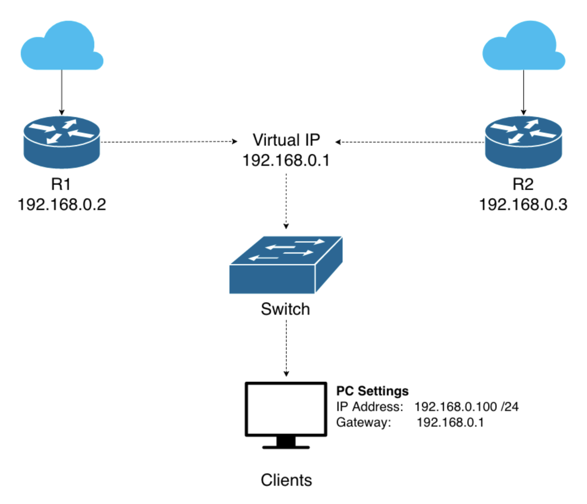
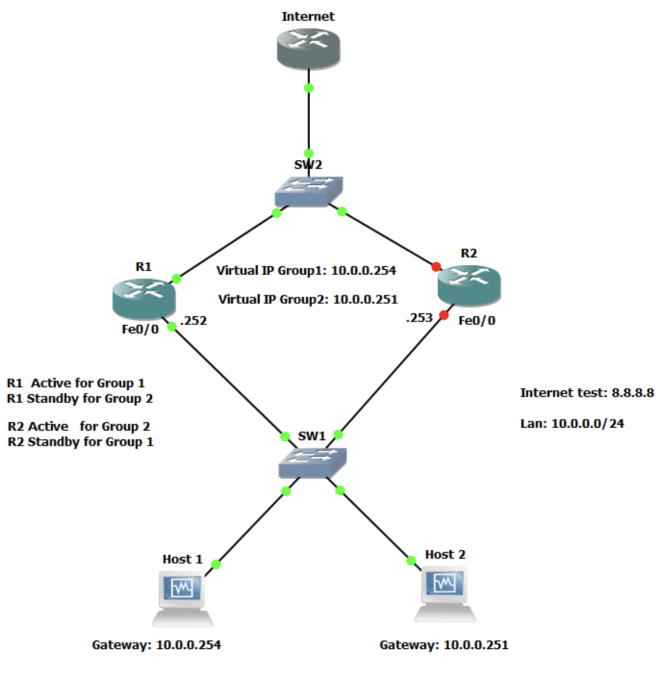
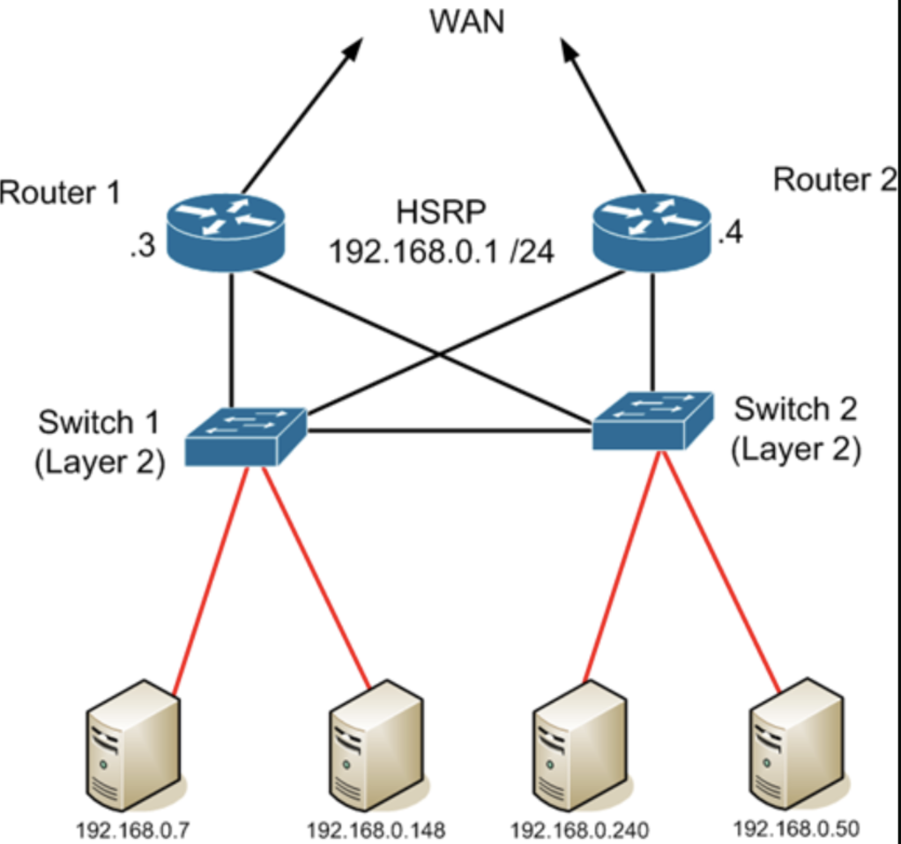
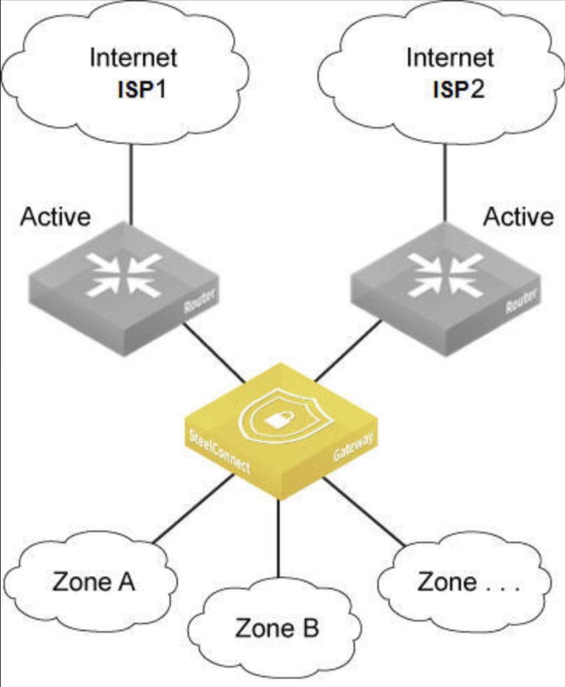

# Redondance du premier saut (FHRP) et haute disponibilité

## Introduction

Que se passe-t-il quand la passerelle par defaut de vos utilisateurs tombe en panne ? **Perte de connectivite totale**. C'est la que les protocoles FHRP (First Hop Redundancy Protocol) entrent en jeu.

Comprendre la redondance réseau est essentiel pour :

- **Disponibilite** : Assurer un uptime de 99.99% et respecter les SLAs
- **Securite defensive** : Detecter les tentatives de detournement de passerelle
- **Securite offensive** : Exploiter les failles de configuration FHRP pour des attaques MitM
- **Architecture** : Concevoir des réseaux sans point de defaillance unique (SPOF)

> **Point sécurité** : Un attaquant qui prend le contrôle de la passerelle virtuelle FHRP peut intercepter **tout le trafic** du réseau. Les protocoles FHRP sont une cible de choix pour les attaques Man-in-the-Middle.

---

## Glossaire

### Protocoles de redondance

| Sigle | Nom complet | Description |
|-------|-------------|-------------|
| **FHRP** | First Hop Redundancy Protocol | Famille de protocoles assurant la redondance de la passerelle par defaut |
| **HSRP** | Hot Standby Router Protocol | Protocole Cisco proprietaire de redondance de passerelle. Utilise une IP et MAC virtuelles |
| **VRRP** | Virtual Router Redundancy Protocol | Standard ouvert (RFC 5798) equivalent a HSRP, multi-vendeur |
| **GLBP** | Gateway Load Balancing Protocol | Protocole Cisco avec repartition de charge entre plusieurs passerelles |
| **CARP** | Common Address Redundancy Protocol | Alternative open source (BSD) a VRRP |

### Concepts de redondance

| Terme | Description |
|-------|-------------|
| **VIP** | Virtual IP - Adresse IP virtuelle partagee par les routeurs du groupe FHRP |
| **VMAC** | Virtual MAC - Adresse MAC virtuelle associee a la VIP |
| **Active Router** | Routeur HSRP qui repond actuellement pour la VIP |
| **Standby Router** | Routeur HSRP pret a prendre le relais si l'actif tombe |
| **Master** | Equivalent de "Active" en terminologie VRRP |
| **Backup** | Equivalent de "Standby" en terminologie VRRP |
| **Priority** | Valeur (0-255) determinant quel routeur devient actif. Plus élevé = prioritaire |
| **Preemption** | Capacite d'un routeur a reprendre le role actif apres recuperation |
| **Tracking** | Mecanisme ajustant la priorite selon l'etat d'interfaces ou de routes |
| **Hello Timer** | Intervalle entre les messages de vie (3s par defaut HSRP) |
| **Hold Timer** | Temps avant de declarer un routeur mort (10s par defaut HSRP) |

### Haute disponibilite

| Sigle | Nom complet | Description |
|-------|-------------|-------------|
| **HA** | High Availability | Conception visant a minimiser les interruptions de service |
| **FT** | Fault Tolerance | Capacite a continuer de fonctionner malgre une panne |
| **SLA** | Service Level Agreement | Engagement contractuel sur le niveau de service (uptime) |
| **SPOF** | Single Point of Failure | Composant unique dont la panne arrete tout le système |
| **MTBF** | Mean Time Between Failures | Temps moyen entre deux pannes |
| **MTTR** | Mean Time To Repair | Temps moyen de reparation apres une panne |
| **RPO** | Recovery Point Objective | Perte de donnees acceptable en cas de sinistre |
| **RTO** | Recovery Time Objective | Temps de reprise acceptable apres un sinistre |

### Termes d'attaque

| Terme | Description |
|-------|-------------|
| **FHRP Hijacking** | Prise de contrôle de la passerelle virtuelle en annoncant une priorite superieure |
| **Gateway Spoofing** | Usurpation de l'adresse de la passerelle pour intercepter le trafic |
| **Priority Manipulation** | Modification malveillante de la priorite pour devenir routeur actif |
| **Hello Flood** | Inondation de messages Hello pour perturber l'election |

---

## 1. HSRP et VRRP : passerelles virtuelles



### Principe de fonctionnement

Les clients utilisent une **IP virtuelle** (VIP) comme passerelle par defaut. Cette IP n'appartient physiquement a aucun routeur - elle est partagee par un groupe de routeurs.

```
Clients → VIP (192.168.0.1) → Routeur Actif → Internet
                  ↓
          Si panne, basculement automatique
                  ↓
         Routeur Standby prend le relais
```

### HSRP (Hot Standby Router Protocol)

Protocole **Cisco proprietaire**, tres repandu en entreprise.

**Caracteristiques :**
- Version 1 : groupes 0-255, timers en secondes
- Version 2 : groupes 0-4095, timers en millisecondes, support IPv6
- MAC virtuelle : `0000.0C07.ACxx` (xx = numero de groupe en hexa)
- Multicast : 224.0.0.2 (v1) ou 224.0.0.102 (v2)
- Port UDP : 1985

**Configuration HSRP :**
```
interface GigabitEthernet0/1
 ip address 192.168.10.2 255.255.255.0
 standby version 2
 standby 1 ip 192.168.10.1
 standby 1 priority 110
 standby 1 preempt
 standby 1 authentication md5 key-string SecretKey123
 standby 1 track GigabitEthernet0/2 decrement 20
```

### VRRP (Virtual Router Redundancy Protocol)

Standard **ouvert** (RFC 5798), compatible multi-vendeurs.

**Caracteristiques :**
- Preemption activee par defaut (contrairement a HSRP)
- L'IP du Master peut etre la VIP elle-meme
- MAC virtuelle : `0000.5E00.01xx` (xx = VRID en hexa)
- Multicast : 224.0.0.18
- Protocole IP : 112

**Configuration VRRP :**
```
interface GigabitEthernet0/1
 ip address 192.168.10.2 255.255.255.0
 vrrp 1 ip 192.168.10.1
 vrrp 1 priority 110
 vrrp 1 preempt
 vrrp 1 authentication md5 key-string SecretKey123
```

### Comparaison HSRP vs VRRP

| Caracteristique | HSRP | VRRP |
|-----------------|------|------|
| Standard | Cisco proprietaire | RFC 5798 (ouvert) |
| Preemption | Desactivee par defaut | Activee par defaut |
| Groupes | 0-255 (v1), 0-4095 (v2) | 0-255 |
| MAC virtuelle | 0000.0C07.ACxx | 0000.5E00.01xx |
| VIP = IP physique | Non | Oui (possible) |
| Authentification | MD5 | MD5, texte clair |

### Point sécurité : attaques FHRP

**FHRP Hijacking** : Un attaquant annonce une priorite superieure pour devenir la passerelle active.

```bash
# Avec Loki (outil d'attaque FHRP)
loki -i eth0 -m hsrp -a spoof -p 255 -g 1 -v 192.168.10.1

# Avec Scapy (Python)
from scapy.all import *
# Envoyer des paquets HSRP avec priorite 255
```

**Consequences :**
- Tout le trafic passe par l'attaquant (MitM)
- Interception de credentials, sessions, donnees sensibles
- Possibilite de modification du trafic

**Detection :**
```bash
# Wireshark filter pour HSRP
hsrp

# Wireshark filter pour VRRP
vrrp

# Surveiller les changements de MAC sur la VIP
arp -a | grep 192.168.10.1
```

---

## 2. Priorite, Preemption et Tracking



### Priorite

La **priorite** determine quel routeur devient actif. Valeur de 0 a 255, **defaut = 100**.

```
R1 (priority 110) → Devient ACTIVE
R2 (priority 100) → Reste STANDBY
```

**Configuration :**
```
standby 1 priority 150    ! HSRP
vrrp 1 priority 150       ! VRRP
```

### Preemption

La **preemption** permet a un routeur de reprendre le role actif apres recuperation.

**Sans preemption :**
```
1. R1 (prio 150) est ACTIVE
2. R1 tombe → R2 devient ACTIVE
3. R1 revient → R2 reste ACTIVE (R1 devient STANDBY)
```

**Avec preemption :**
```
1. R1 (prio 150) est ACTIVE
2. R1 tombe → R2 devient ACTIVE
3. R1 revient → R1 reprend le role ACTIVE
```

**Configuration :**
```
standby 1 preempt              ! HSRP
standby 1 preempt delay minimum 30  ! Attendre 30s avant preemption
vrrp 1 preempt                 ! VRRP (active par defaut)
```

### Interface Tracking

Le **tracking** ajuste dynamiquement la priorite selon l'etat d'interfaces ou routes.

**Scenario :** R1 perd son lien WAN → sa priorite baisse → R2 prend le relais

```
standby 1 track GigabitEthernet0/2 decrement 20
! Si Gi0/2 tombe, priorite = 150 - 20 = 130
```

**Tracking avance (IP SLA) :**
```
! Tracker la joignabilite d'une IP
ip sla 1
 icmp-echo 8.8.8.8
ip sla schedule 1 start-time now life forever

track 1 ip sla 1 reachability

interface GigabitEthernet0/1
 standby 1 track 1 decrement 30
```

### Point sécurité : manipulation de priorité

Un attaquant peut **forcer un failover** en :
1. Envoyant des paquets avec priorite 255 (max)
2. Perturbant le tracking (DoS sur le lien surveille)
3. Injectant des faux messages Hello

**Contre-mesures :**
- Authentification MD5 obligatoire
- Filtrage des paquets HSRP/VRRP sur les ports utilisateurs
- Monitoring des changements d'etat FHRP

---

## 3. Topologies de Redondance

### Dual Routers - Configuration de base



Deux routeurs, une VIP, basculement automatique.

```
         [Internet/WAN]
              |
    +---------+---------+
    |                   |
[Router1]           [Router2]
   .3                   .4
    |                   |
    +--[HSRP VIP .1]---+
              |
         [Switch L2]
              |
         [Clients]
```

**Avantages :**
- Simple a deployer
- Failover transparent pour les clients

**Inconvenients :**
- Un seul routeur actif (sous-utilisation)
- Pas de repartition de charge native

### Active/Active avec Groupes Multiples

Pour utiliser les deux routeurs simultanement, on cree **plusieurs groupes HSRP** :

```
R1: Active pour Group 1 (VIP .254), Standby pour Group 2 (VIP .251)
R2: Active pour Group 2 (VIP .251), Standby pour Group 1 (VIP .254)
```

**Configuration R1 :**
```
interface GigabitEthernet0/0
 ip address 10.0.0.252 255.255.255.0
 standby 1 ip 10.0.0.254
 standby 1 priority 110
 standby 1 preempt
 standby 2 ip 10.0.0.251
 standby 2 priority 90
```

**Configuration R2 :**
```
interface GigabitEthernet0/0
 ip address 10.0.0.253 255.255.255.0
 standby 1 ip 10.0.0.254
 standby 1 priority 90
 standby 2 ip 10.0.0.251
 standby 2 priority 110
 standby 2 preempt
```

Les clients sont repartis : 50% utilisent .254, 50% utilisent .251.

### Dual Uplinks (ISP Redundancy)



Chaque routeur connecte a un ISP different pour une redondance maximale.

**Avantages :**
- Pas de SPOF sur la connectivite Internet
- Resilience aux pannes ISP

**Complexites :**
- Gestion du NAT sur les deux routeurs
- Routage asymetrique possible
- Necessite souvent BGP pour le multi-homing

---

## 4. Uptime, SLAs et Tolerance aux Pannes

### Niveaux de disponibilite

| SLA | Downtime/an | Downtime/mois | Usage |
|-----|-------------|---------------|-------|
| 99% | 3.65 jours | 7.3 heures | Non-critique |
| 99.9% | 8.76 heures | 43.8 minutes | Standard entreprise |
| 99.99% | 52.56 minutes | 4.38 minutes | Critique |
| 99.999% | 5.26 minutes | 26.3 secondes | Mission-critique |

### Fault Tolerance vs High Availability

| Aspect | Fault Tolerance (FT) | High Availability (HA) |
|--------|----------------------|------------------------|
| Objectif | Zero downtime | Downtime minimal |
| Cout | Tres élevé | Modere |
| Complexite | Haute | Moyenne |
| Exemple | Dual power, RAID 1 | HSRP, clustering |
| Perte de paquets | Aucune | Quelques-uns possible |

**FHRP = High Availability** (quelques secondes de basculement possible)

### Calcul des timers FHRP

**HSRP par defaut :**
- Hello : 3 secondes
- Hold : 10 secondes
- Temps de failover : ~10-15 secondes

**HSRP optimise (subsecond) :**
```
standby 1 timers msec 200 msec 750
! Hello: 200ms, Hold: 750ms
! Failover: < 1 seconde
```

**Attention :** Des timers trop agressifs peuvent causer des flapping (basculements intempestifs).

---

## 5. Securisation FHRP

### Authentification

**HSRP MD5 :**
```
standby 1 authentication md5 key-string 0 MySecretKey
```

**VRRP MD5 :**
```
vrrp 1 authentication md5 key-string MySecretKey
```

**Attention :** L'authentification en texte clair est a proscrire !

### Filtrage sur les ports access

Empecher les utilisateurs d'envoyer des paquets FHRP :

```
! ACL pour bloquer HSRP/VRRP sur les ports utilisateurs
ip access-list extended BLOCK-FHRP
 deny udp any any eq 1985      ! HSRP
 deny 112 any any              ! VRRP (protocole IP 112)
 permit ip any any

interface range FastEthernet0/1-24
 ip access-group BLOCK-FHRP in
```

### Monitoring et alertes

```
! Logging des changements d'etat HSRP
standby 1 track 1 decrement 20
logging event link-status

! SNMP traps pour HSRP
snmp-server enable traps hsrp
```

### Checklist sécurité FHRP

- [ ] Authentification MD5 activee sur tous les groupes
- [ ] Paquets FHRP bloques sur les ports utilisateurs
- [ ] Timers ajustes selon les besoins (pas trop agressifs)
- [ ] Monitoring des changements d'etat
- [ ] Preemption configuree selon la politique
- [ ] Interface tracking pour les liens critiques

---

## 6. Commandes de diagnostic

### HSRP

```
show standby                    ! Etat de tous les groupes
show standby brief              ! Resume
show standby GigabitEthernet0/0 ! Details interface spécifique
debug standby                   ! Debug (attention en prod!)
debug standby events            ! Evenements seulement
```

**Exemple de sortie :**
```
GigabitEthernet0/0 - Group 1
  State is Active
    2 state changes, last state change 00:05:32
  Virtual IP address is 192.168.10.1
  Active virtual MAC address is 0000.0c07.ac01
  Priority 110 (configured 110)
  Preemption enabled
  Authentication MD5, key-chain "HSRP-KEY"
```

### VRRP

```
show vrrp                       ! Etat de tous les groupes
show vrrp brief                 ! Resume
show vrrp interface GigabitEthernet0/0
```

### Depuis un client

```bash
# Verifier la MAC de la passerelle
arp -a | grep <VIP>

# Tracer le chemin
traceroute <destination>

# Ping continu pendant un failover
ping -t <VIP>    # Windows
ping <VIP>       # Linux (Ctrl+C pour arreter)
```

---

## 7. Scenarios d'attaque realistes

### Scenario 1 : HSRP Hijacking

```
[Attaquant] --Scapy/Loki--> Annonce priorite 255
                |
                v
[R1 Active] perd le role → [Attaquant devient "Active"]
                |
                v
         Tout le trafic passe par l'attaquant
```

**Outils :** Loki, Yersinia, Scapy

**Detection :**
- Changement de MAC sur la VIP
- Nouveau routeur actif inattendu
- Paquets HSRP depuis un port utilisateur

### Scenario 2 : Perturbation du tracking

```
1. Attaquant identifie le lien tracke par HSRP
2. DoS sur ce lien (ou l'IP trackee)
3. La priorite du routeur actif baisse
4. Failover vers le standby (ou vers l'attaquant)
```

### Scenario 3 : DoS par Hello flood

```
1. Attaquant envoie des milliers de Hello HSRP
2. Les routeurs legitimes sont submerges
3. Instabilite, flapping, perte de service
```

---

## 8. Labs pratiques et TryHackMe

### TryHackMe Rooms (recommandees)

| Room | Lien | Contenu |
|------|------|---------|
| **Intro to Networking** | [tryhackme.com/room/introtonetworking](https://tryhackme.com/room/introtonetworking) | Bases réseau, passerelles |
| **Networking Essentials** | [tryhackme.com/room/introtolan](https://tryhackme.com/room/introtolan) | Protocoles réseau, routage |
| **L2 MAC Flooding & ARP Spoofing** | [tryhackme.com/room/layer2](https://tryhackme.com/room/layer2) | Attaques Layer 2, MitM |
| **Wireshark** | [tryhackme.com/room/wireshark](https://tryhackme.com/room/wireshark) | Capture et analyse de trafic FHRP |

> **Note :** Il n'existe pas de room TryHackMe spécifique a FHRP, mais les rooms Layer 2 et Wireshark couvrent les concepts sous-jacents.

### Labs GNS3/EVE-NG

| Lab | Objectif | Configuration |
|-----|----------|---------------|
| **HSRP Basic** | Configurer HSRP entre 2 routeurs | 2 routeurs, 1 switch, 2 PCs |
| **HSRP Active/Active** | Load balancing avec groupes multiples | 2 routeurs, 2 groupes HSRP |
| **HSRP Tracking** | Failover base sur l'etat d'un lien | Tracking interface WAN |
| **FHRP Attack** | Simuler un hijacking HSRP | Kali + Loki/Scapy |
| **VRRP Multi-vendor** | VRRP entre Cisco et autre vendeur | Cisco + VyOS/Mikrotik |

---

## Ressources

### Documentation officielle
- [Cisco - HSRP Explained](https://www.cisco.com/c/en/us/products/ios-nx-os-software/hot-standby-router-protocol-hsrp/index.html)
- [Cisco - VRRP Configuration](https://www.cisco.com/c/en/us/td/docs/ios-xml/ios/ipapp_fhrp/configuration/xe-16/fhp-xe-16-book/fhp-vrrp.html)
- [RFC 5798 - VRRP](https://tools.ietf.org/html/rfc5798)

### Securite
- [NetworkLessons - HSRP vs VRRP](https://networklessons.com/cisco/ccna-200-301/hsrp-hot-standby-router-protocol)
- [Loki - FHRP Attack Tool](https://github.com/sensepost/loki)

### Comparatifs
- [HSRP vs VRRP vs GLBP](https://www.globalknowledge.com/us-en/resources/resource-library/articles/hot-standby-router-protocol-vs-virtual-router-redundancy-protocol-what-s-the-difference/)

---

## Resume

| Concept | Point Securite Cle |
|---------|-------------------|
| **HSRP/VRRP** | Authentification MD5 obligatoire, bloquer sur ports access |
| **Priorite** | Peut etre manipulee par un attaquant (hijacking) |
| **Preemption** | Controler qui reprend le role actif |
| **Tracking** | Peut etre exploite via DoS sur le lien tracke |
| **Timers** | Trop agressifs = flapping, trop lents = downtime |
| **VIP/VMAC** | Surveiller les changements inattendus |

> **Mindset sécurité** : FHRP contrôle la passerelle par defaut. Controler la passerelle = contrôler tout le trafic sortant. En tant que pentester, cherchez a devenir la passerelle active. En tant que defenseur, authentifiez et surveillez.
