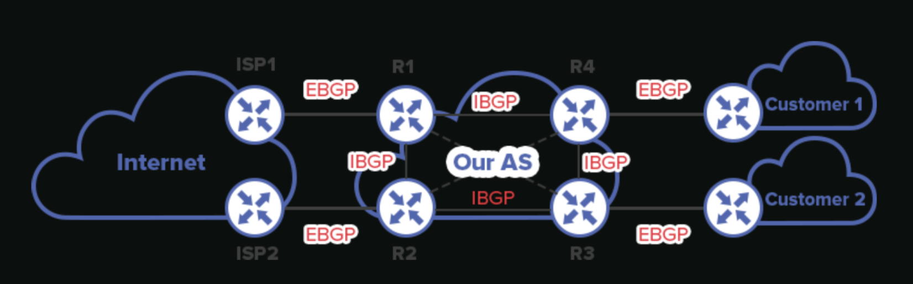

# BGP - Border Gateway Protocol

## Objectifs du cours

Ce cours presente BGP (Border Gateway Protocol), le protocole de routage qui fait fonctionner Internet. Contrairement aux protocoles IGP comme OSPF ou EIGRP, BGP est un protocole EGP (Exterior Gateway Protocol) concu pour echanger des informations de routage entre systèmes autonomes (AS).

Competences visees :
- Comprendre la logique path-vector et le role des numeros AS
- Differencier le comportement iBGP vs eBGP
- Configurer le peering, les annonces et le filtrage de routes
- Comprendre l'utilisation de BGP chez les ISPs et en entreprise
- Identifier les vulnerabilites BGP et les contre-mesures

---

## Glossaire

### Concepts fondamentaux

| Sigle | Nom complet | Description |
|-------|-------------|-------------|
| **BGP** | Border Gateway Protocol | Protocole de routage inter-AS (EGP), base sur TCP port 179 |
| **AS** | Autonomous System | Ensemble de réseaux sous une administration unique avec une politique de routage coherente |
| **ASN** | Autonomous System Number | Identifiant unique d'un AS (16 bits: 1-65535, 32 bits: 1-4294967295) |
| **EGP** | Exterior Gateway Protocol | Protocole de routage entre AS (BGP est le seul EGP utilise aujourd'hui) |
| **IGP** | Interior Gateway Protocol | Protocole de routage interne (OSPF, EIGRP, IS-IS) |
| **Path-Vector** | Vecteur de chemin | Type de protocole utilisant la liste des AS traverses pour les decisions |

### Types de BGP

| Terme | Description |
|-------|-------------|
| **eBGP** | External BGP - Peering entre routeurs de differents AS |
| **iBGP** | Internal BGP - Peering entre routeurs du meme AS |
| **Full Mesh** | Topologie ou chaque routeur iBGP a une session avec tous les autres |
| **Route Reflector** | Routeur iBGP centralisant la distribution des routes (evite le full mesh) |
| **Confederation** | Division d'un AS en sous-AS pour ameliorer la scalabilite |

### Attributs BGP

| Attribut | Type | Description |
|----------|------|-------------|
| **AS_PATH** | Well-known mandatory | Liste des AS traverses (plus court = préféré) |
| **NEXT_HOP** | Well-known mandatory | Adresse IP du prochain saut |
| **ORIGIN** | Well-known mandatory | Origine de la route (IGP, EGP, Incomplete) |
| **LOCAL_PREF** | Well-known discretionary | Preference locale dans l'AS (plus élevé = préféré) |
| **MED** | Optional non-transitive | Multi-Exit Discriminator - suggere un point d'entree préféré |
| **WEIGHT** | Cisco proprietary | Preference locale au routeur (plus élevé = préféré) |
| **COMMUNITY** | Optional transitive | Tag pour le filtrage et les politiques |
| **ATOMIC_AGGREGATE** | Well-known discretionary | Indique une agregation de routes |
| **AGGREGATOR** | Optional transitive | Identifie le routeur ayant fait l'agregation |

### Etats de session BGP

| Etat | Description |
|------|-------------|
| **Idle** | Etat initial, attend un événement de demarrage |
| **Connect** | Attend la connexion TCP |
| **Active** | Tente d'etablir la connexion TCP |
| **OpenSent** | Message OPEN envoye, attend OPEN du peer |
| **OpenConfirm** | OPEN recu, attend KEEPALIVE |
| **Established** | Session etablie, echange de routes possible |

### Types de messages BGP

| Message | Description |
|---------|-------------|
| **OPEN** | Initie la session, contient ASN, Router ID, capabilities |
| **UPDATE** | Annonce ou retire des routes |
| **KEEPALIVE** | Maintient la session active (defaut: 60s) |
| **NOTIFICATION** | Signale une erreur, ferme la session |

### Termes de sécurité BGP

| Terme | Description |
|-------|-------------|
| **BGP Hijacking** | Annonce non autorisee de prefixes appartenant a un autre AS |
| **Prefix Hijacking** | Annonce d'un prefixe plus spécifique pour detourner le trafic |
| **Route Leak** | Propagation non intentionnelle de routes vers des AS non autorises |
| **RPKI** | Resource Public Key Infrastructure - validation cryptographique des annonces |
| **ROA** | Route Origin Authorization - autorise un AS a annoncer un prefixe |
| **BGPsec** | Extension de sécurité pour valider l'AS_PATH |
| **IRR** | Internet Routing Registry - base de donnees des politiques de routage |

### Organisations et registres

| Sigle | Nom complet | Description |
|-------|-------------|-------------|
| **RIR** | Regional Internet Registry | Organisme regional d'allocation d'adresses IP et ASN |
| **ARIN** | American Registry for Internet Numbers | RIR pour l'Amerique du Nord |
| **RIPE NCC** | Reseaux IP Europeens Network Coordination Centre | RIR pour l'Europe |
| **APNIC** | Asia-Pacific Network Information Centre | RIR pour l'Asie-Pacifique |
| **LACNIC** | Latin America and Caribbean Network Information Centre | RIR pour l'Amerique Latine |
| **AFRINIC** | African Network Information Centre | RIR pour l'Afrique |

---

## Logique Path-Vector et AS_PATH

### Pourquoi BGP est différent

BGP est un protocole **path-vector**, fondamentalement different des protocoles distance-vector (RIP) et link-state (OSPF) :

| Aspect | Distance-Vector | Link-State | Path-Vector (BGP) |
|--------|-----------------|------------|-------------------|
| **Information partagee** | Distance vers destination | Topologie complete | Chemin complet (liste d'AS) |
| **Vue du réseau** | Locale (voisins) | Regionale (aire) | Globale (Internet) |
| **Prevention des boucles** | Split horizon, TTL | Vue coherente | AS_PATH |
| **Metrique** | Hop count, cout | Cout SPF | Politique (attributs) |
| **Scalabilite** | Faible | Moyenne | Tres élevée |

### Fonctionnement de l'AS_PATH

L'AS_PATH est l'attribut le plus important de BGP. C'est la liste des AS traverses pour atteindre un prefixe :

```
Exemple d'AS_PATH :

Prefixe: 203.0.113.0/24
AS_PATH: 65001 65002 65003

Signification :
- Le prefixe appartient a l'AS 65003 (origine)
- Il traverse AS 65002
- Puis AS 65001
- Pour arriver chez nous
```

**Prevention des boucles :**
- Si un routeur recoit une route contenant son propre ASN dans l'AS_PATH, il la rejette
- Garantit l'absence de boucles de routage

**AS_PATH Prepending :**
- Technique pour rendre une route moins attractive
- L'AS ajoute plusieurs fois son propre ASN

```cisco
! Rendre la route moins attractive en ajoutant 3x notre AS
route-map PREPEND permit 10
 set as-path prepend 65001 65001 65001

router bgp 65001
 neighbor 10.0.0.2 route-map PREPEND out
```

### Numéros AS (ASN)

| Plage | Type | Usage |
|-------|------|-------|
| 1-64495 | Public 16-bit | Attribution par les RIRs |
| 64496-64511 | Documentation | Exemples et documentation |
| 64512-65534 | Prive 16-bit | Usage interne, non route sur Internet |
| 65535 | Reserve | Usage special |
| 65536-4199999999 | Public 32-bit | Nouvelles allocations |
| 4200000000-4294967294 | Prive 32-bit | Usage interne |

---

## iBGP vs eBGP

### Architecture iBGP / eBGP



### Differences comportementales

| Aspect | eBGP | iBGP |
|--------|------|------|
| **Entre AS** | Differents | Meme AS |
| **TTL par defaut** | 1 (voisins directs) | 255 (loopbacks possibles) |
| **Modification NEXT_HOP** | Oui (par defaut) | Non (preserve) |
| **Propagation des routes** | Vers iBGP et eBGP | PAS vers autres iBGP peers |
| **AD (Administrative Distance)** | 20 | 200 |
| **Connexion typique** | Interface physique | Loopback |

### Le problème du split horizon iBGP

**Regle fondamentale :** Un routeur iBGP ne readvertise PAS les routes apprises d'un autre peer iBGP vers d'autres peers iBGP.

```
Probleme :

R1 (iBGP) -----> R2 (iBGP) -----> R3 (iBGP)

- R1 apprend une route externe via eBGP
- R1 annonce a R2 via iBGP
- R2 ne peut PAS annoncer cette route a R3 via iBGP !
```

**Solutions :**

1. **Full Mesh iBGP** : Chaque routeur a une session avec tous les autres
   - N routeurs = N*(N-1)/2 sessions
   - Ne scale pas (10 routeurs = 45 sessions)

2. **Route Reflector (RR)** :
   - Un routeur central redistribue les routes iBGP
   - Les clients n'ont qu'une session avec le RR
   - Solution la plus courante

3. **Confederation** :
   - Divise l'AS en sous-AS internes
   - eBGP entre sous-AS, mais vu comme iBGP de l'exterieur

### Configuration Route Reflector

```cisco
! Sur le Route Reflector
router bgp 65001
 neighbor 192.168.1.1 remote-as 65001
 neighbor 192.168.1.1 route-reflector-client
 neighbor 192.168.1.2 remote-as 65001
 neighbor 192.168.1.2 route-reflector-client
```

### NEXT_HOP et iBGP

**Probleme courant :** Le NEXT_HOP n'est pas modifie en iBGP

```
ISP (10.0.0.1) ---eBGP--- R1 ---iBGP--- R2

- R1 apprend 203.0.113.0/24 avec NEXT_HOP 10.0.0.1
- R1 annonce a R2 avec le meme NEXT_HOP 10.0.0.1
- R2 ne peut pas joindre 10.0.0.1 directement !
```

**Solution :**
```cisco
router bgp 65001
 neighbor 192.168.1.2 next-hop-self
```

---

## Peering et annonces BGP

### Configuration du peering

**eBGP basique :**
```cisco
router bgp 65001
 bgp router-id 1.1.1.1
 neighbor 10.0.0.2 remote-as 65002
 neighbor 10.0.0.2 description "Peering avec ISP"
```

**iBGP avec loopback (recommande) :**
```cisco
router bgp 65001
 bgp router-id 1.1.1.1
 neighbor 192.168.1.2 remote-as 65001
 neighbor 192.168.1.2 update-source Loopback0
```

**eBGP multihop (voisin non directement connecte) :**
```cisco
router bgp 65001
 neighbor 10.0.0.2 remote-as 65002
 neighbor 10.0.0.2 ebgp-multihop 2
```

### Annonce de réseaux

**Methode 1 : Commande network**
```cisco
router bgp 65001
 network 203.0.113.0 mask 255.255.255.0
```
- Le prefixe DOIT exister dans la table de routage
- Sinon BGP ne l'annonce pas

**Methode 2 : Redistribution**
```cisco
router bgp 65001
 redistribute static
 redistribute connected
```
- Attention : peut injecter des routes non desirees
- Toujours utiliser avec des route-maps

### Processus de selection BGP

BGP utilise un algorithme complexe pour choisir la meilleure route. L'ordre de préférénce est :

| Priorite | Attribut | Regle |
|----------|----------|-------|
| 1 | **Weight** | Plus élevé = préféré (Cisco only, local) |
| 2 | **Local Preference** | Plus élevé = préféré (dans l'AS) |
| 3 | **Locally Originated** | Routes locales préférées |
| 4 | **AS_PATH** | Plus court = préféré |
| 5 | **Origin** | IGP < EGP < Incomplete |
| 6 | **MED** | Plus bas = préféré (entre AS) |
| 7 | **eBGP vs iBGP** | eBGP préféré |
| 8 | **IGP Metric** | Plus proche NEXT_HOP préféré |
| 9 | **Oldest Route** | Plus ancienne = préféré |
| 10 | **Router ID** | Plus bas = préféré |
| 11 | **Neighbor IP** | Plus basse = préféré |

**Mnemotechnique :** "**W**e **L**ove **O**ranges **AS** **O**ranges **M**ean **P**ure **R**efreshment"
(Weight, Local_Pref, Originated, AS_Path, Origin, MED, Prefer_eBGP, Router_ID)

---

## Filtrage de routes

### Prefix-list

```cisco
! Autoriser uniquement les prefixes /24 du bloc 10.0.0.0/8
ip prefix-list FILTER seq 10 permit 10.0.0.0/8 ge 24 le 24
ip prefix-list FILTER seq 20 deny 0.0.0.0/0 le 32

router bgp 65001
 neighbor 10.0.0.2 prefix-list FILTER in
```

### AS-path access-list

```cisco
! Bloquer les routes originaires de l'AS 65005
ip as-path access-list 10 deny _65005$
ip as-path access-list 10 permit .*

router bgp 65001
 neighbor 10.0.0.2 filter-list 10 in
```

**Regex AS_PATH courants :**

| Regex | Signification |
|-------|---------------|
| `^$` | Routes locales (AS_PATH vide) |
| `_65001_` | AS 65001 n'importe ou dans le chemin |
| `^65001_` | Routes originaires de l'AS 65001 |
| `_65001$` | Dernier AS avant nous |
| `^65001$` | Directement connecte a AS 65001 |
| `.*` | N'importe quoi (permit all) |

### Route-map

```cisco
! Modifier Local Preference pour les routes d'un peer
route-map SET-LOCAL-PREF permit 10
 set local-préférénce 200

router bgp 65001
 neighbor 10.0.0.2 route-map SET-LOCAL-PREF in
```

### Communities BGP

Les communities sont des tags attaches aux routes pour faciliter le filtrage :

| Community | Signification |
|-----------|---------------|
| `no-export` | Ne pas annoncer hors de l'AS |
| `no-advertise` | Ne pas annoncer a aucun peer |
| `local-AS` | Ne pas annoncer hors de la confederation |
| `internet` | Annoncer normalement |

```cisco
! Marquer les routes client avec une community
route-map TAG-CUSTOMER permit 10
 set community 65001:100

! Filtrer sur la community
ip community-list 1 permit 65001:100

route-map FILTER-COMMUNITY permit 10
 match community 1
```

---

## BGP chez les ISPs et en entreprise

### Usage ISP

Les ISPs utilisent BGP pour :
- **Peering** avec d'autres ISPs (echange de trafic)
- **Transit** : fournir l'acces Internet aux clients
- **Annonces** : publier les prefixes clients sur Internet

**Types de relations :**

| Relation | Description | Politique typique |
|----------|-------------|-------------------|
| **Customer** | Paie pour le transit | Annonce tout, accepte tout |
| **Peer** | Echange gratuit de trafic | Annonce clients, accepte clients du peer |
| **Upstream/Transit** | Fournit l'acces Internet | Accepte la full table ou default |

### Usage entreprise

**Dual-homing (connexion a 2 ISPs) :**

```
              ┌─────────┐
     ISP A────┤         ├────ISP B
              │ AS 65010│
              │(Entreprise)
              └─────────┘

Objectifs :
- Redondance en cas de panne d'un ISP
- Load balancing du trafic sortant
- Controle du trafic entrant (AS_PATH prepending, MED)
```

**Configuration dual-homing :**
```cisco
router bgp 65010
 ! Peering avec ISP A (préféré)
 neighbor 10.0.0.1 remote-as 65501
 neighbor 10.0.0.1 route-map ISP-A-IN in
 neighbor 10.0.0.1 route-map ISP-A-OUT out

 ! Peering avec ISP B (backup)
 neighbor 10.0.0.2 remote-as 65502
 neighbor 10.0.0.2 route-map ISP-B-IN in
 neighbor 10.0.0.2 route-map ISP-B-OUT out

! Preferer ISP A en entree
route-map ISP-A-IN permit 10
 set local-préférénce 200

route-map ISP-B-IN permit 10
 set local-préférénce 100

! Rendre ISP B moins attractif en sortie (pour le trafic entrant)
route-map ISP-B-OUT permit 10
 set as-path prepend 65010 65010
```

### MPLS VPN et BGP

Dans les réseaux MPLS, BGP (MP-BGP) est utilise pour :
- Echanger les routes VPN entre PE (Provider Edge) routers
- Separer les tables de routage par VRF (Virtual Routing and Forwarding)

### Cloud et BGP

Les connexions cloud (AWS Direct Connect, Azure ExpressRoute, GCP Interconnect) utilisent BGP :
- Annonce dynamique des prefixes
- Failover automatique
- Integration avec le réseau on-premise

---

## Securite BGP et implications cyber

### Vulnerabilites BGP majeures

BGP a ete concu sans mécanismes de sécurité. Les principales vulnerabilites sont :

| Attaque | Description | Impact |
|---------|-------------|--------|
| **BGP Hijacking** | Annonce de prefixes appartenant a un autre AS | Interception de trafic, MitM |
| **Prefix Hijacking** | Annonce d'un prefixe plus spécifique | Detournement cible |
| **Route Leak** | Propagation non autorisee de routes | Blackhole, latence |
| **AS_PATH Manipulation** | Modification de l'AS_PATH | Contournement des politiques |
| **Session Hijacking** | Prise de contrôle d'une session BGP | Injection de routes |
| **DoS BGP** | Saturation avec des updates | Instabilite du routage |

### Cas celebres de BGP Hijacking

| Annee | Incident | Impact |
|-------|----------|--------|
| 2008 | Pakistan Telecom / YouTube | YouTube inaccessible mondialement pendant 2h |
| 2010 | China Telecom | 15% du trafic Internet reroute via la Chine |
| 2017 | Google / Japan | Services Google indisponibles au Japon |
| 2018 | Amazon Route 53 | Vol de cryptomonnaie via DNS hijacking |
| 2019 | Verizon / Cloudflare | Panne majeure de services |
| 2020 | Rostelecom | Detournement de trafic vers des banques |

### Scenario d'attaque : BGP Hijacking

```
Etat normal :
AS 65001 annonce 203.0.113.0/24 (son prefixe legitime)
Tout le monde route vers AS 65001

Attaque :
AS 65999 (malveillant) annonce 203.0.113.0/24
OU annonce 203.0.113.0/25 et 203.0.113.128/25 (plus spécifique)

Resultat :
Le trafic vers 203.0.113.0/24 est redirige vers AS 65999
L'attaquant peut :
- Intercepter le trafic (MitM)
- Analyser le trafic
- Modifier le trafic avant de le renvoyer
- Creer un blackhole (DoS)
```

### Contre-mesures BGP

#### 1. RPKI (Resource Public Key Infrastructure)

RPKI permet de valider cryptographiquement qu'un AS est autorise a annoncer un prefixe :

```
Composants RPKI :
- ROA (Route Origin Authorization) : signe par le detenteur du prefixe
- Validateurs RPKI : verifient les annonces BGP contre les ROAs
- Etats de validation : Valid, Invalid, NotFound

Configuration Cisco :
router bgp 65001
 bgp rpki server tcp 10.0.0.100 port 8282

 ! Rejeter les routes Invalid
 route-map RPKI-FILTER deny 10
  match rpki invalid
 route-map RPKI-FILTER permit 20
```

#### 2. Filtrage des prefixes

**Filtres bogon (prefixes non routables) :**
```cisco
ip prefix-list BOGONS deny 0.0.0.0/8 le 32
ip prefix-list BOGONS deny 10.0.0.0/8 le 32
ip prefix-list BOGONS deny 127.0.0.0/8 le 32
ip prefix-list BOGONS deny 169.254.0.0/16 le 32
ip prefix-list BOGONS deny 172.16.0.0/12 le 32
ip prefix-list BOGONS deny 192.168.0.0/16 le 32
ip prefix-list BOGONS deny 224.0.0.0/4 le 32
ip prefix-list BOGONS permit 0.0.0.0/0 le 24
```

**Limiter la taille des prefixes acceptes :**
```cisco
! Rejeter les prefixes trop spécifiques (> /24)
ip prefix-list MAX-PREFIX permit 0.0.0.0/0 le 24
```

#### 3. Authentification MD5/TCP-AO

```cisco
router bgp 65001
 neighbor 10.0.0.2 password SecretKey123
```

#### 4. GTSM (Generalized TTL Security Mechanism)

```cisco
! Accepter uniquement les paquets avec TTL = 255 (voisin direct)
router bgp 65001
 neighbor 10.0.0.2 ttl-security hops 1
```

#### 5. Maximum Prefix

```cisco
! Limiter le nombre de prefixes acceptes
router bgp 65001
 neighbor 10.0.0.2 maximum-prefix 1000 80 restart 5
 ! 80% = warning, restart apres 5 minutes si depasse
```

### Checklist sécurité BGP

```
[ ] RPKI deploye et routes Invalid rejetees
[ ] Filtrage bogon sur tous les peers
[ ] Limite de prefixes (maximum-prefix) configuree
[ ] Authentification MD5 ou TCP-AO sur toutes les sessions
[ ] GTSM active pour les peers eBGP
[ ] Filtrage AS_PATH (rejeter les AS prives sur Internet)
[ ] Monitoring des changements de routes (BGPStream, RIPE RIS)
[ ] Documentation des prefixes et politiques dans l'IRR
[ ] Alertes sur nouvelles annonces de vos prefixes
[ ] Plan de reponse aux incidents BGP
```

### Outils de monitoring BGP

| Outil | Description | URL |
|-------|-------------|-----|
| **BGPStream** | Detection en temps reel des anomalies | bgpstream.com |
| **RIPE RIS** | Looking glass et historique BGP | ris.ripe.net |
| **BGPlay** | Visualisation des changements BGP | stat.ripe.net/bgplay |
| **Hurricane Electric BGP Toolkit** | Informations AS et prefixes | bgp.he.net |
| **Routeviews** | Archive des tables BGP | routeviews.org |
| **MANRS** | Bonnes pratiques de sécurité BGP | manrs.org |

---

## Commandes de verification

```cisco
! Voir les voisins BGP
show ip bgp summary

! Detail d'un voisin
show ip bgp neighbors 10.0.0.2

! Table BGP complete
show ip bgp

! Routes vers un prefixe spécifique
show ip bgp 203.0.113.0/24

! Routes annoncees a un voisin
show ip bgp neighbors 10.0.0.2 advertised-routes

! Routes recues d'un voisin
show ip bgp neighbors 10.0.0.2 received-routes

! Routes apprises d'un voisin (apres filtrage)
show ip bgp neighbors 10.0.0.2 routes

! Debug (attention en production)
debug ip bgp updates
debug ip bgp events
```

### Exemple de sortie - show ip bgp summary

```
BGP router identifier 1.1.1.1, local AS number 65001
BGP table version is 156, main routing table version 156
50 network entries using 7200 bytes of memory
100 path entries using 8000 bytes of memory
10 BGP path attribute entries using 640 bytes of memory

Neighbor        V    AS MsgRcvd MsgSent   TblVer  InQ OutQ Up/Down  State/PfxRcd
10.0.0.2        4 65002    1542    1538      156    0    0 01:15:32       25
192.168.1.2     4 65001    2156    2160      156    0    0 02:30:15       25
```

---

## Ressources

| Ressource | Description |
|-----------|-------------|
| [RFC 4271](https://tools.ietf.org/html/rfc4271) | Specification BGP-4 |
| [Cisco BGP Configuration Guide](https://www.cisco.com/c/en/us/td/docs/ios-xml/ios/iproute_bgp/) | Guide officiel Cisco |
| [BGP.he.net](https://bgp.he.net) | Informations AS et prefixes |
| [MANRS](https://www.manrs.org) | Mutually Agreed Norms for Routing Security |
| [RPKI Documentation](https://rpki.readthedocs.io) | Guide de deploiement RPKI |

---

## Labs TryHackMe

| Room | Description | Lien |
|------|-------------|------|
| **Intro to Networking** | Fondamentaux réseau et routage | https://tryhackme.com/room/introtonetworking |
| **Network Services** | Services réseau et protocoles | https://tryhackme.com/room/networkservices |
| **Wireshark: The Basics** | Analyse de paquets BGP | https://tryhackme.com/room/wiresharkthebasics |

> **Note** : TryHackMe ne propose pas de room spécifiquement dediee a BGP. Les concepts avances de routage inter-AS et les attaques BGP (hijacking) sont généralement etudies via :
> - Labs GNS3/EVE-NG avec routeurs virtuels
> - Plateformes de simulation comme BGP.Tools
> - Environnements de test RPKI
> - CTF specialises en infrastructure (voir DEFCON Router Hacking Village)
