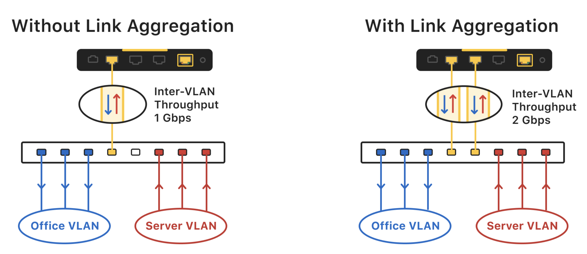
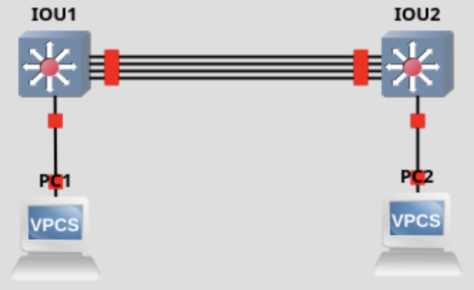

# Link aggregation et load balancing

## Objectifs du cours

Ce cours presente les techniques d'agregation de liens et de repartition de charge, fondamentales pour construire des réseaux haute disponibilite. Ces technologies permettent d'augmenter la bande passante et d'assurer la redondance des connexions réseau.

Competences visees :
- Comprendre les principes de LACP et EtherChannel
- Maitriser les strategies de load balancing
- Configurer l'agregation de liens sur des équipements Cisco
- Appliquer ces concepts dans des topologies redondantes et data centers
- Identifier les vulnerabilites et les contre-mesures

---

## Glossaire

### Concepts fondamentaux

| Sigle | Nom complet | Description |
|-------|-------------|-------------|
| **LAG** | Link Aggregation Group | Groupe de liens physiques agreges en un lien logique |
| **LACP** | Link Aggregation Control Protocol | Protocole standard IEEE 802.3ad pour l'agregation dynamique |
| **EtherChannel** | - | Implementation Cisco de l'agregation de liens |
| **Port-Channel** | - | Interface logique representant le groupe de liens agreges |
| **Bonding** | - | Terme Linux pour l'agregation de liens (NIC bonding) |
| **Teaming** | - | Terme Windows pour l'agregation de liens (NIC teaming) |

### Protocoles d'agregation

| Terme | Description |
|-------|-------------|
| **PAgP** | Port Aggregation Protocol - Protocole Cisco proprietaire |
| **LACP** | Link Aggregation Control Protocol - Standard IEEE 802.3ad/802.1AX |
| **Static LAG** | Agregation statique sans protocole de negociation |
| **LACPDU** | LACP Data Unit - Paquet echange pour la negociation LACP |

### Modes LACP/PAgP

| Mode | Protocole | Description |
|------|-----------|-------------|
| **Active** | LACP | Initie activement la negociation LACP |
| **Passive** | LACP | Attend une negociation LACP |
| **Desirable** | PAgP | Initie activement la negociation PAgP |
| **Auto** | PAgP | Attend une negociation PAgP |
| **On** | Aucun | Mode statique, pas de negociation |

### Load Balancing

| Terme | Description |
|-------|-------------|
| **Per-Packet** | Distribution paquet par paquet (risque de desordre) |
| **Per-Flow** | Distribution par flux (source/dest IP, MAC, port) |
| **Hash Algorithm** | Algorithme de hachage pour distribuer le trafic |
| **src-mac** | Hash base sur l'adresse MAC source |
| **dst-mac** | Hash base sur l'adresse MAC destination |
| **src-dst-mac** | Hash base sur MAC source ET destination |
| **src-ip** | Hash base sur l'adresse IP source |
| **dst-ip** | Hash base sur l'adresse IP destination |
| **src-dst-ip** | Hash base sur IP source ET destination |
| **src-dst-port** | Hash incluant les ports TCP/UDP |

### Haute disponibilite

| Sigle | Nom complet | Description |
|-------|-------------|-------------|
| **HA** | High Availability | Haute disponibilite |
| **MLAG** | Multi-Chassis LAG | LAG reparti sur plusieurs chassis/switches |
| **MC-LAG** | Multi-Chassis LAG | Synonyme de MLAG |
| **vPC** | Virtual Port Channel | Implementation Cisco Nexus de MC-LAG |
| **VSS** | Virtual Switching System | Virtualisation de 2 switches Catalyst en 1 |
| **StackWise** | - | Technologie de stacking Cisco |

### Termes de sécurité

| Terme | Description |
|-------|-------------|
| **LACP Flooding** | Attaque par saturation de paquets LACPDU |
| **LAG Manipulation** | Manipulation des paramètres d'agregation |
| **Link Flapping** | Oscillation repetee d'un lien (up/down) |
| **LACP Rate** | Frequence d'envoi des LACPDU (slow: 30s, fast: 1s) |

---

## Pourquoi l'agregation de liens ?

### Le problème

Sans agregation de liens, plusieurs problèmes se posent :

| Probleme | Consequence |
|----------|-------------|
| **Single Point of Failure** | Panne d'un lien = perte de connectivite |
| **Bande passante limitee** | Goulot d'etranglement sur les uplinks |
| **STP blocking** | Liens redondants bloques par Spanning Tree |
| **Inefficacite** | Ressources réseau sous-utilisees |

### La solution : Link Aggregation



L'agregation de liens combine plusieurs liens physiques en un seul lien logique :

| Avantage | Description |
|----------|-------------|
| **Bande passante accrue** | N liens x debit = debit total (theorique) |
| **Redondance** | Perte d'un lien = continuite de service |
| **Pas de STP blocking** | Le LAG est vu comme un seul lien |
| **Load balancing** | Distribution du trafic sur tous les liens |

**Exemple :**
- 4 liens GigabitEthernet (1 Gbps) = 1 Port-Channel de 4 Gbps
- Si 1 lien tombe : 3 Gbps restants, sans interruption

---

## LACP (IEEE 802.3ad/802.1AX)

### Fonctionnement de LACP

LACP est le protocole standard pour l'agregation dynamique de liens :

```
1. Les deux équipements envoient des LACPDU
2. Negociation des paramètres (vitesse, duplex, VLAN)
3. Formation du LAG si compatibilite
4. Surveillance continue de l'etat des liens
5. Retrait automatique des liens defaillants
```

### Paramètres LACP

| Parametre | Description | Valeur |
|-----------|-------------|--------|
| **System Priority** | Priorite du switch (plus bas = prioritaire) | 0-65535 (defaut: 32768) |
| **System ID** | Identifiant unique (Priority + MAC) | - |
| **Port Priority** | Priorite du port | 0-65535 (defaut: 32768) |
| **Port Number** | Numero de port | - |
| **Key** | Cle administrative (ports compatibles) | - |

### Modes LACP

| Combinaison | Resultat |
|-------------|----------|
| Active - Active | LAG forme |
| Active - Passive | LAG forme |
| Passive - Passive | **PAS de LAG** (aucun n'initie) |

### Limites LACP

- Maximum **8 liens actifs** par LAG
- Maximum **8 liens standby** (hot standby)
- Tous les liens doivent avoir :
  - Meme vitesse
  - Meme duplex
  - Meme configuration VLAN/trunk

---

## EtherChannel Cisco

### Modes EtherChannel

| Mode | Protocole | Negociation |
|------|-----------|-------------|
| **on** | Aucun | Statique (risque de boucle si mismatch) |
| **active** | LACP | Initie la negociation |
| **passive** | LACP | Attend la negociation |
| **desirable** | PAgP | Initie la negociation (Cisco only) |
| **auto** | PAgP | Attend la negociation (Cisco only) |

### Configuration de base LACP

```cisco
! Configuration des interfaces physiques
interface range GigabitEthernet0/1-4
 no shutdown
 channel-group 1 mode active
 exit

! Configuration de l'interface logique Port-Channel
interface Port-channel1
 no shutdown
 switchport trunk encapsulation dot1q
 switchport mode trunk
```

### Configuration pour un trunk

```cisco
! Sur SW1
interface Port-channel1
 switchport trunk encapsulation dot1q
 switchport mode trunk
 switchport trunk allowed vlan 10,20,30

interface range GigabitEthernet0/1-4
 switchport trunk encapsulation dot1q
 switchport mode trunk
 channel-group 1 mode active

! Sur SW2 (configuration identique)
interface Port-channel1
 switchport trunk encapsulation dot1q
 switchport mode trunk
 switchport trunk allowed vlan 10,20,30

interface range GigabitEthernet0/1-4
 switchport trunk encapsulation dot1q
 switchport mode trunk
 channel-group 1 mode active
```

### Configuration pour un lien Layer 3

```cisco
interface Port-channel1
 no switchport
 ip address 10.0.0.1 255.255.255.252

interface range GigabitEthernet0/1-2
 no switchport
 no ip address
 channel-group 1 mode active
```

---

## Strategies de Load Balancing

### Methodes de distribution

Le trafic est distribue sur les liens du LAG selon un algorithme de hachage :

| Methode | Hash base sur | Cas d'usage |
|---------|---------------|-------------|
| **src-mac** | MAC source | Trafic depuis peu de sources |
| **dst-mac** | MAC destination | Trafic vers peu de destinations |
| **src-dst-mac** | MAC src + dst | Usage général Layer 2 |
| **src-ip** | IP source | Trafic depuis peu de sources |
| **dst-ip** | IP destination | Trafic vers peu de destinations |
| **src-dst-ip** | IP src + dst | Usage général Layer 3 |
| **src-dst-port** | IP + ports L4 | Maximum de granularite |

### Configuration du load balancing

```cisco
! Voir la méthode actuelle
show etherchannel load-balance

! Configurer la méthode
port-channel load-balance src-dst-ip
```

### Distribution du trafic

**Important :** Le load balancing n'est PAS per-packet par defaut. C'est per-flow :

```
Flow 1: PC1 (10.0.0.1) -> Server (10.0.0.100) = toujours lien 1
Flow 2: PC2 (10.0.0.2) -> Server (10.0.0.100) = toujours lien 2
Flow 3: PC3 (10.0.0.3) -> Server (10.0.0.100) = toujours lien 3
...
```

Cela preserve l'ordre des paquets mais peut creer un desequilibre si :
- Peu de flux distincts
- Un flux domine le trafic

---

## Cas d'usage

### Data Center - Acces serveurs

```
         ┌─────────────┐
         │   ToR Switch │
         │  (Top of Rack)│
         └──────┬───────┘
                │ LAG (4x10G)
         ┌──────┴───────┐
         │   Serveur     │
         │   (4 NICs)    │
         └──────────────┘

Avantages :
- 40 Gbps de bande passante
- Redondance sur panne de NIC
- Haute disponibilite pour les VMs
```

### Campus - Uplinks inter-switches

```
         ┌─────────────┐
         │ Core Switch  │
         └──────┬───────┘
                │ LAG (2x10G)
         ┌──────┴───────┐
         │ Distribution  │
         │   Switch      │
         └──────┬───────┘
                │ LAG (4x1G)
         ┌──────┴───────┐
         │ Access Switch │
         └──────────────┘
```

### MLAG / MC-LAG

Multi-Chassis LAG permet d'agreger des liens vers deux switches differents :

```
         ┌─────────┐     ┌─────────┐
         │  SW1    │─────│  SW2    │  (Peer-link)
         └────┬────┘     └────┬────┘
              │               │
              └───────┬───────┘
                      │ MLAG
               ┌──────┴──────┐
               │   Serveur    │
               └─────────────┘

Avantages :
- Redondance switch (pas seulement lien)
- Pas de STP blocking
- Active-Active load balancing
```

**Implementations MLAG :**
| Vendeur | Technologie |
|---------|-------------|
| Cisco Nexus | vPC (Virtual Port Channel) |
| Cisco Catalyst | VSS, StackWise Virtual |
| Arista | MLAG |
| Juniper | MC-LAG |
| HP/Aruba | IRF, Distributed Trunking |

---

## Lab pratique GNS3

### Topologie



### Configuration SW1 (IOU1)

```cisco
configure terminal
hostname SW1

! Interface Port-Channel
interface Port-channel1
 no shutdown
 switchport trunk encapsulation dot1q
 switchport mode trunk

! Interfaces physiques vers SW2
interface range Ethernet0/0-3
 no shutdown
 switchport trunk encapsulation dot1q
 switchport mode trunk
 channel-group 1 mode active

! Port acces pour VPC1
interface Ethernet1/0
 switchport mode access
 switchport access vlan 1
 no shutdown

exit
copy running-config startup-config
```

### Configuration SW2 (IOU2)

```cisco
configure terminal
hostname SW2

! Interface Port-Channel
interface Port-channel1
 no shutdown
 switchport trunk encapsulation dot1q
 switchport mode trunk

! Interfaces physiques vers SW1
interface range Ethernet0/0-3
 no shutdown
 switchport trunk encapsulation dot1q
 switchport mode trunk
 channel-group 1 mode active

! Port acces pour VPC2
interface Ethernet1/0
 switchport mode access
 switchport access vlan 1
 no shutdown

exit
copy running-config startup-config
```

### Configuration des VPCs

**VPC1 :**
```
ip 192.168.1.1/24
save
```

**VPC2 :**
```
ip 192.168.1.2/24
save
```

### Test de redondance

```cisco
! 1. Verifier la connectivite
VPC1> ping 192.168.1.2

! 2. Couper un lien sur SW1
SW1(config)# interface Ethernet0/0
SW1(config-if)# shutdown

! 3. Re-tester la connectivite (doit toujours fonctionner)
VPC1> ping 192.168.1.2

! 4. Verifier l'etat du Port-Channel
SW1# show etherchannel summary
```

---

## Commandes de verification

```cisco
! Resume des EtherChannels
show etherchannel summary

! Detail du Port-Channel
show etherchannel 1 detail

! Etat LACP
show lacp neighbor
show lacp internal

! Statistiques du Port-Channel
show etherchannel port-channel

! Methode de load balancing
show etherchannel load-balance

! Detail d'une interface membre
show interface GigabitEthernet0/1 etherchannel
```

### Exemple de sortie - show etherchannel summary

```
Flags:  D - down        P - bundled in port-channel
        I - stand-alone s - suspended
        H - Hot-standby (LACP only)
        R - Layer3      S - Layer2
        U - in use      f - failed to allocate aggregator

Number of channel-groups in use: 1
Number of aggregators:           1

Group  Port-channel  Protocol    Ports
------+-------------+-----------+----------------------------------------------
1      Po1(SU)         LACP      Gi0/1(P)    Gi0/2(P)    Gi0/3(P)    Gi0/4(P)
```

---

## Securite et implications cyber

### Vulnerabilites de l'agregation de liens

| Attaque | Description | Impact |
|---------|-------------|--------|
| **LACP Spoofing** | Envoi de faux LACPDU pour manipuler le LAG | Disruption du LAG |
| **LAG Manipulation** | Modification des paramètres LACP | Reconfiguration non autorisee |
| **Link Flapping Attack** | Oscillation forcee d'un lien | Instabilite, CPU load |
| **Traffic Interception** | Ajout d'un équipement dans le LAG | MitM potentiel |
| **DoS via LACPDU Flooding** | Saturation de paquets LACP | Epuisement des ressources |

### Scenario d'attaque

```
1. Attaquant connecte un équipement au switch
2. L'équipement envoie des LACPDU avec des paramètres forges
3. Si le port est mal configure, il peut rejoindre un LAG existant
4. L'attaquant recoit une partie du trafic du LAG
5. Interception ou disruption du trafic
```

### Contre-mesures

#### 1. Desactiver les protocoles non utilises

```cisco
! Si vous utilisez LACP, desactivez PAgP
interface range GigabitEthernet0/1-4
 no channel-group
 channel-protocol lacp
 channel-group 1 mode active
```

#### 2. Port Security sur les ports LAG

```cisco
! Note: Port Security n'est pas supporte sur les Port-Channels
! Mais vous pouvez le configurer sur les interfaces membres avant agregation
interface GigabitEthernet0/1
 switchport port-security
 switchport port-security maximum 1
 switchport port-security mac-address sticky
```

#### 3. LACP Rate Fast

```cisco
! Detection plus rapide des pannes (1s au lieu de 30s)
interface range GigabitEthernet0/1-4
 lacp rate fast
```

#### 4. LACP System Priority

```cisco
! Controler quel switch est le maitre LACP
lacp system-priority 4096
```

#### 5. Mode statique si environnement contrôle

```cisco
! Mode "on" elimine la negociation LACP
! ATTENTION: Doit etre identique des deux cotes
interface range GigabitEthernet0/1-4
 channel-group 1 mode on
```

#### 6. Filtrage 802.1X

```cisco
! Authentifier les équipements avant de permettre le LAG
interface GigabitEthernet0/1
 dot1x port-control auto
 authentication host-mode multi-auth
```

### Checklist sécurité Link Aggregation

```
[ ] Utiliser LACP plutot que le mode statique (detection des pannes)
[ ] Configurer LACP rate fast sur les liens critiques
[ ] Documenter tous les LAGs et leurs membres
[ ] Monitorer les changements d'etat des LAGs (SNMP traps)
[ ] Verifier la coherence des configurations des deux cotes
[ ] Desactiver les ports non utilises
[ ] Utiliser 802.1X si possible avant l'agregation
[ ] Limiter les VLANs autorises sur les trunks LAG
[ ] Configurer des alertes sur les changements de topologie
```

### Monitoring

```cisco
! Activer les notifications SNMP
snmp-server enable traps port-channel

! Activer le logging des changements
interface Port-channel1
 logging event link-status
 logging event trunk-status
```

---

## Depannage

### Problemes courants

| Probleme | Cause probable | Solution |
|----------|----------------|----------|
| LAG ne se forme pas | Mismatch de configuration | Verifier vitesse, duplex, VLANs |
| Ports en (s) suspended | Incompatibilite detectee | `show etherchannel detail` |
| Ports en (I) individual | Pas de negociation reussie | Verifier le mode (active/passive) |
| Faible debit | Mauvais load balancing | Changer la méthode de hash |
| Trafic sur un seul lien | Peu de flux distincts | Utiliser src-dst-port |

### Commandes de debug

```cisco
! Debug LACP (utiliser avec precaution)
debug lacp all
debug lacp packet

! Debug EtherChannel
debug etherchannel all

! Desactiver les debugs
undebug all
```

---

## Bonnes pratiques

| Pratique | Raison |
|----------|--------|
| Utiliser LACP plutot que statique | Detection automatique des pannes |
| Configurer les deux cotes identiquement | Eviter les mismatches |
| Ne pas melanger les vitesses | Comportement imprevisible |
| Documenter les LAGs | Facilite le depannage |
| Tester le failover | Valider la redondance |
| Monitorer l'utilisation | Detecter les desequilibres |
| Considerer MLAG pour la redondance switch | Eliminer le SPOF switch |

---

## Ressources

| Ressource | Description |
|-----------|-------------|
| [Cisco EtherChannel](https://www.cisco.com/c/en/us/td/docs/switches/lan/catalyst3750/software/release/12-2_55_se/configuration/guide/scg3750/swethchl.html) | Guide de configuration Cisco |
| [IEEE 802.1AX](https://standards.ieee.org/standard/802_1AX-2020.html) | Standard Link Aggregation |
| [Juniper LAG](https://www.juniper.net/documentation/en_US/junos/topics/concept/lag-overview.html) | Documentation Juniper |

---

## Labs TryHackMe

| Room | Description | Lien |
|------|-------------|------|
| **Intro to Networking** | Fondamentaux réseau | https://tryhackme.com/room/introtonetworking |
| **Network Services** | Services réseau et protocoles | https://tryhackme.com/room/networkservices |
| **Wireshark: The Basics** | Analyse de paquets (debug LAG) | https://tryhackme.com/room/wiresharkthebasics |

> **Note** : TryHackMe ne propose pas de room spécifiquement dediee a LACP/EtherChannel. Ces concepts sont pratiques sur des environnements de lab comme GNS3 ou EVE-NG avec des switches virtuels Cisco IOU/IOL.
