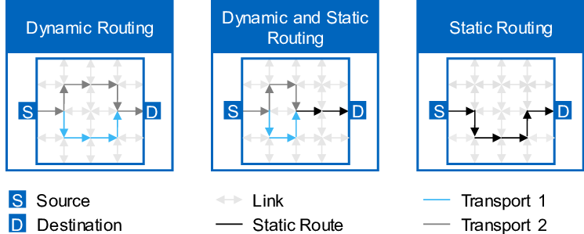
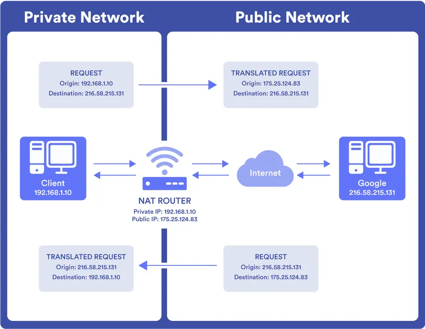
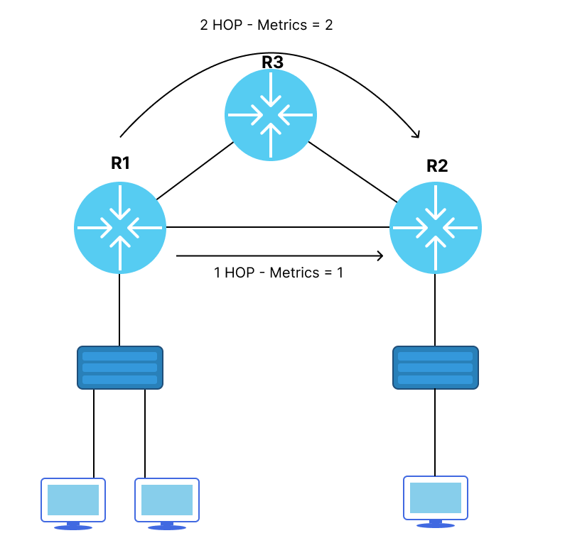
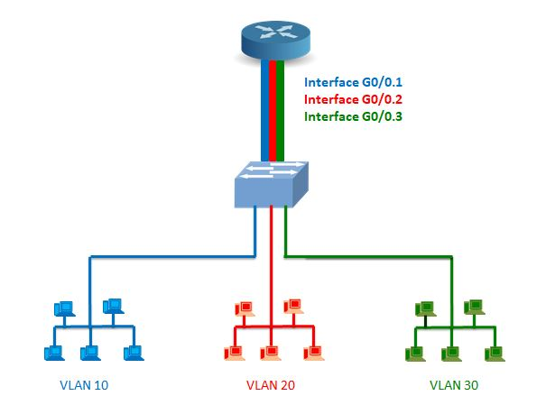
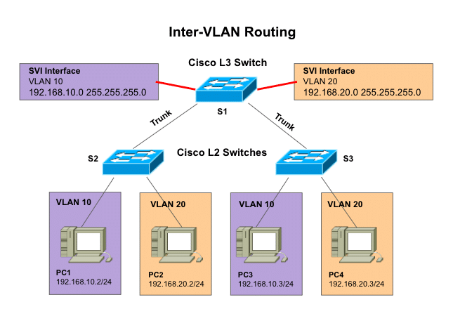

# Routing Fundamentals et Inter-VLAN Routing

## Objectifs du cours

Ce cours presente les fondamentaux du routage et les techniques de communication inter-VLAN. Le routage est le mécanisme qui permet aux paquets de trouver leur chemin a travers les réseaux, tandis que le routage inter-VLAN permet la communication entre des VLANs normalement isolés.

Competences visees :
- Comprendre la difference entre routage statique et dynamique
- Maitriser le fonctionnement des tables de routage, decisions next-hop et metriques
- Connaitre les deux approches du routage inter-VLAN : Router-on-a-Stick et SVI
- Comprendre le NAT et ses differentes formes
- Identifier les implications de sécurité et les contre-mesures

---

## Glossaire

### Concepts de routage

| Terme | Description |
|-------|-------------|
| **Routing** | Processus de selection du chemin pour acheminer un paquet vers sa destination |
| **Static Routing** | Routes configurees manuellement dans la table de routage |
| **Dynamic Routing** | Routes apprises automatiquement via des protocoles de routage |
| **Routing Table** | Table contenant les routes connues par le routeur |
| **Next-Hop** | Adresse IP du prochain routeur sur le chemin vers la destination |
| **Metric** | Valeur numerique indiquant la préférénce d'une route (plus bas = meilleur) |
| **Administrative Distance** | Valeur indiquant la fiabilite de la source d'une route |
| **Longest Prefix Match** | Algorithme de selection utilisant le masque le plus spécifique |

### Protocoles de routage dynamique

| Sigle | Nom complet | Description |
|-------|-------------|-------------|
| **RIP** | Routing Information Protocol | Protocole a vecteur de distance, metrique = hop count (max 15) |
| **OSPF** | Open Shortest Path First | Protocole a etat de liens, metrique = cout (base sur bande passante) |
| **EIGRP** | Enhanced Interior Gateway Routing Protocol | Protocole hybride Cisco, metrique composite |
| **BGP** | Border Gateway Protocol | Protocole de routage inter-AS (Internet) |
| **IGP** | Interior Gateway Protocol | Protocole de routage interne (RIP, OSPF, EIGRP) |
| **EGP** | Exterior Gateway Protocol | Protocole de routage externe (BGP) |

### Network Address Translation (NAT)

| Terme | Description |
|-------|-------------|
| **NAT** | Network Address Translation - Traduction d'adresses IP |
| **PAT** | Port Address Translation - NAT avec traduction de ports (NAT overload) |
| **Static NAT** | Mapping permanent une-a-une entre IP privee et publique |
| **Dynamic NAT** | Mapping dynamique depuis un pool d'adresses publiques |
| **Inside Local** | Adresse IP privee d'un hote interne |
| **Inside Global** | Adresse IP publique representant un hote interne |
| **Outside Local** | Adresse IP d'un hote externe vue depuis le réseau interne |
| **Outside Global** | Adresse IP publique reelle d'un hote externe |

### Inter-VLAN Routing

| Terme | Description |
|-------|-------------|
| **Router-on-a-Stick** | Methode utilisant un routeur avec sous-interfaces sur un trunk |
| **SVI** | Switched Virtual Interface - Interface virtuelle de routage sur un switch L3 |
| **Sub-interface** | Interface logique creee sur une interface physique |
| **802.1Q** | Standard d'encapsulation VLAN (dot1q) |
| **Trunk** | Lien transportant plusieurs VLANs avec tags 802.1Q |
| **Default Gateway** | Passerelle par defaut pour les hotes d'un VLAN |
| **Layer 3 Switch** | Switch capable de faire du routage IP |

### Termes de sécurité

| Terme | Description |
|-------|-------------|
| **Route Injection** | Injection de fausses routes dans un protocole de routage |
| **Route Poisoning** | Technique de prevention des boucles ou attaque de manipulation |
| **NAT Traversal** | Techniques pour etablir des connexions a travers NAT |
| **Port Forwarding** | Redirection de port pour permettre l'acces a un service interne |
| **DMZ** | Zone demilitarisee, segment réseau expose |

---

## Routage statique vs dynamique

Le routage est le processus par lequel les paquets trouvent leur chemin d'un appareil a un autre a travers les réseaux. Deux approches principales existent pour peupler les tables de routage.



### Routage statique

Le routage statique implique la configuration manuelle des routes dans la table de routage.

**Avantages :**
- Controle total sur le chemin des donnees
- Previsible et facile a comprendre
- Consommation minimale de ressources (CPU, mémoire, bande passante)
- Securite accrue (pas de protocole de routage a exploiter)

**Inconvenients :**
- Ne s'adapte pas aux changements de topologie
- Fastidieux a maintenir dans les grands réseaux
- Risque d'erreurs de configuration
- Pas de redondance automatique

**Cas d'utilisation :**
- Petits réseaux avec peu de routes
- Reseaux dont la topologie change rarement
- Routes par defaut vers Internet
- Connexions point-a-point simples

### Routage dynamique

Le routage dynamique permet aux routeurs d'apprendre et d'adapter automatiquement les routes.

**Avantages :**
- Adaptation automatique aux changements de topologie
- Scalabilite pour les grands réseaux
- Redondance et haute disponibilite
- Repartition de charge (load balancing)

**Inconvenients :**
- Consommation de ressources (CPU, mémoire, bande passante)
- Complexite de configuration et depannage
- Temps de convergence lors des changements
- Surface d'attaque pour les protocoles de routage

**Cas d'utilisation :**
- Reseaux moyens a grands
- Topologies avec redondance
- Environnements necessitant haute disponibilite
- Reseaux en evolution frequente

### Comparaison

| Caracteristique | Routage statique | Routage dynamique |
|-----------------|------------------|-------------------|
| Configuration | Manuelle | Automatique |
| Scalabilite | Limitee | Excellente |
| Ressources | Faibles | Moderees a élevées |
| Reaction aux changements | Aucune (manuelle) | Automatique |
| Convergence | Instantanee | Variable |
| Securite | Plus simple a securiser | Necessite authentification |
| Complexite | Faible | Moderee a élevée |

### Utilisation hybride

En pratique, le routage statique et dynamique sont souvent combines :

```
                  Internet
                      │
                      │ Route statique par defaut
                      ▼
              ┌───────────────┐
              │  Edge Router  │
              └───────┬───────┘
                      │
                      │ OSPF/EIGRP
                      ▼
              ┌───────────────┐
              │  Core Network │
              └───────────────┘
```

- Route statique par defaut vers Internet
- Protocole dynamique pour le réseau interne
- Routes statiques pour les connexions spécifiques (VPN, partenaires)

---

## Network Address Translation (NAT)

Le NAT est une technique fondamentale qui permet a plusieurs appareils sur un réseau prive de partager une seule adresse IP publique pour communiquer avec Internet.



### Pourquoi le NAT existe

**Raisons principales :**
1. **Epuisement des adresses IPv4** : Seulement ~4.3 milliards d'adresses possibles
2. **Securite** : Cache la topologie interne du réseau
3. **Flexibilite** : Permet de changer de fournisseur sans readdresser le réseau interne

### Fonctionnement du NAT

Lorsqu'un appareil interne envoie un paquet vers Internet :

1. Le routeur NAT remplace l'adresse IP source par son adresse publique
2. Il modifie le port source vers un numero unique
3. Il maintient une table de traduction (mapping)
4. Il transmet le paquet vers Internet

Lorsque la reponse arrive :

1. Le routeur consulte sa table de traduction
2. Il remplace l'adresse et le port de destination par les valeurs originales
3. Il transmet le paquet vers l'appareil interne

### Types de NAT

#### Static NAT (One-to-One)

Mapping permanent entre une adresse privee et une adresse publique.

```cisco
ip nat inside source static 192.168.1.10 203.0.113.10

interface GigabitEthernet0/0
 ip nat inside

interface GigabitEthernet0/1
 ip nat outside
```

**Usage :** Serveurs devant etre accessibles depuis Internet avec une IP fixe.

#### Dynamic NAT (Many-to-Many)

Mapping dynamique depuis un pool d'adresses publiques.

```cisco
ip nat pool PUBLIC-POOL 203.0.113.10 203.0.113.20 netmask 255.255.255.0
access-list 1 permit 192.168.1.0 0.0.0.255
ip nat inside source list 1 pool PUBLIC-POOL
```

**Usage :** Reseaux avec plusieurs adresses publiques disponibles.

#### PAT / NAT Overload (Many-to-One)

Mapping de plusieurs adresses privees vers une seule adresse publique avec differentiation par port.

```cisco
access-list 1 permit 192.168.1.0 0.0.0.255
ip nat inside source list 1 interface GigabitEthernet0/1 overload
```

**Usage :** Situation la plus courante (routeurs domestiques, PME).

### Limitations du NAT

| Limitation | Impact |
|------------|--------|
| Connectivite end-to-end | Les appareils derriere NAT ne sont pas directement accessibles |
| Protocoles embarquant des IP | FTP, SIP, certains VPN necessitent des ALGs |
| Performance | Maintien d'etat et modification des paquets |
| Troubleshooting | Complexifie l'analyse des connexions |
| Applications P2P | Necessitent des techniques de NAT traversal |

### Types de comportement NAT

| Type | Description | Impact sur les applications |
|------|-------------|----------------------------|
| **Full Cone** | Tout hote externe peut envoyer vers le port mappe | Plus permissif |
| **Restricted Cone** | Seuls les hotes contactes peuvent repondre | Moderement restrictif |
| **Port Restricted Cone** | Hotes contactes sur le meme port uniquement | Plus restrictif |
| **Symmetric** | Mapping different pour chaque destination | Plus restrictif, problematique pour VoIP/jeux |

### NAT et IPv6

IPv6 fournit suffisamment d'adresses pour eliminer le besoin de NAT pour la conservation d'adresses. Cependant, NAT66/NPTv6 existe toujours pour :
- Raisons de sécurité/politique
- Faciliter les fusions de réseaux
- Simplifier les migrations

---

## Tables de routage, decisions next-hop et metriques

Chaque routeur maintient une table de routage qui determine le meilleur chemin pour acheminer les paquets.



### Structure d'une entree de table de routage

| Element | Description |
|---------|-------------|
| **Destination network** | Reseau de destination (ex: 192.168.1.0) |
| **Subnet mask** | Masque definissant la taille du réseau (ex: 255.255.255.0) |
| **Next-hop IP** | Adresse du prochain routeur |
| **Outgoing interface** | Interface de sortie physique ou logique |
| **Metric** | Valeur de préférénce (plus bas = meilleur) |
| **Administrative distance** | Fiabilite de la source de la route |

### Exemple de table de routage

```
Destination        Mask              Next-Hop       Metric   Protocol   AD
0.0.0.0            0.0.0.0           10.0.0.1       0        Static     1
10.0.0.0           255.255.255.252   Connected      0        -          0
192.168.1.0        255.255.255.0     10.0.0.2       20       OSPF       110
192.168.2.0        255.255.255.0     10.0.0.2       30       OSPF       110
172.16.0.0         255.255.0.0       10.0.0.3       2        RIP        120
```

### Processus de decision de routage

1. **Longest Prefix Match** : Le routeur selectionne la route avec le masque le plus spécifique
2. **Administrative Distance** : En cas d'egalite de prefixe, la source la plus fiable gagne
3. **Metric** : En cas d'egalite d'AD, la metrique la plus basse gagne

### Administrative Distance (AD)

| Source de route | AD par defaut |
|-----------------|---------------|
| Connected | 0 |
| Static | 1 |
| EIGRP Summary | 5 |
| eBGP | 20 |
| EIGRP Internal | 90 |
| OSPF | 110 |
| IS-IS | 115 |
| RIP | 120 |
| EIGRP External | 170 |
| iBGP | 200 |
| Unknown | 255 |

### Metriques par protocole

| Protocole | Metrique | Description |
|-----------|----------|-------------|
| **RIP** | Hop count | Nombre de routeurs traverses (max 15) |
| **OSPF** | Cost | Reference bandwidth / Interface bandwidth |
| **EIGRP** | Composite | Bandwidth, delay, reliability, load (par defaut : BW + delay) |
| **BGP** | Path attributes | AS_PATH length, origin, MED, local préférénce |

### Analogie postale

- **Table de routage** = Carnet d'adresses
- **Next-hop** = Bureau de poste le plus proche
- **Metrique** = Temps de livraison estime
- **Administrative Distance** = Confiance dans le service postal

---

## Routage Inter-VLAN

Par defaut, les VLANs sont isolés les uns des autres. Un appareil dans le VLAN 10 ne peut pas communiquer avec un appareil dans le VLAN 20. Le routage inter-VLAN permet cette communication.

### Methode 1 : Router-on-a-Stick

Cette méthode traditionnelle utilise un seul lien physique entre un routeur et un switch, configure en trunk.



**Principe :**
1. Le port du switch connecte au routeur est en mode trunk
2. Le routeur cree des sous-interfaces logiques pour chaque VLAN
3. Chaque sous-interface a une adresse IP servant de passerelle

**Configuration du switch :**

```cisco
! Creation des VLANs
vlan 10
 name RH
vlan 20
 name IT

! Port trunk vers le routeur
interface FastEthernet0/1
 switchport mode trunk

! Ports access pour les hotes
interface FastEthernet0/2
 switchport mode access
 switchport access vlan 10

interface FastEthernet0/3
 switchport mode access
 switchport access vlan 20
```

**Configuration du routeur :**

```cisco
! Activer l'interface physique
interface FastEthernet0/0
 no shutdown

! Sous-interface pour VLAN 10
interface FastEthernet0/0.10
 encapsulation dot1Q 10
 ip address 192.168.10.1 255.255.255.0

! Sous-interface pour VLAN 20
interface FastEthernet0/0.20
 encapsulation dot1Q 20
 ip address 192.168.20.1 255.255.255.0
```

**Avantages :**
- Cout faible (un seul routeur)
- Simple a comprendre et configurer
- Adapte aux petits réseaux

**Inconvenients :**
- Lien unique = goulot d'etranglement potentiel
- Performance limitee par la bande passante du lien
- Point de defaillance unique

### Methode 2 : SVI (Switched Virtual Interface)

Cette méthode moderne utilise un switch Layer 3 qui effectue le routage internement.



**Principe :**
1. Le switch Layer 3 cree des interfaces virtuelles (SVI) pour chaque VLAN
2. Chaque SVI a une adresse IP servant de passerelle
3. Le routage se fait a vitesse de commutation (wire speed)

**Configuration du switch Layer 3 :**

```cisco
! Activer le routage IP
ip routing

! Creation des VLANs
vlan 10
 name RH
vlan 20
 name IT

! SVI pour VLAN 10
interface vlan 10
 ip address 192.168.10.1 255.255.255.0
 no shutdown

! SVI pour VLAN 20
interface vlan 20
 ip address 192.168.20.1 255.255.255.0
 no shutdown

! Ports access
interface GigabitEthernet0/1
 switchport mode access
 switchport access vlan 10

interface GigabitEthernet0/2
 switchport mode access
 switchport access vlan 20
```

**Avantages :**
- Performance élevée (routage en hardware)
- Pas de goulot d'etranglement
- Scalabilite excellente
- Moins de points de defaillance

**Inconvenients :**
- Cout plus élevé (switch Layer 3)
- Configuration plus complexe
- Necessite des équipements spécifiques

### Comparaison des méthodes

| Caracteristique | Router-on-a-Stick | SVI |
|-----------------|-------------------|-----|
| Equipement requis | Routeur + Switch L2 | Switch L3 |
| Performance | Limitee | Elevee (wire speed) |
| Scalabilite | Faible | Excellente |
| Complexite | Faible | Moderee |
| Cout initial | Plus bas | Plus élevé |
| Goulot d'etranglement | Oui (lien trunk) | Non |
| Point de defaillance | Routeur + lien | Switch |

### Choix de la méthode

**Router-on-a-Stick convient pour :**
- Laboratoires et environnements de test
- Petits réseaux (< 50 utilisateurs)
- Budgets limites
- Trafic inter-VLAN faible

**SVI convient pour :**
- Environnements de production
- Reseaux moyens a grands
- Besoins de haute performance
- Trafic inter-VLAN élevé

---

## Configuration de base du routage statique

### Exemple de topologie

```
    192.168.1.0/24        10.0.0.0/30        192.168.2.0/24
         │                    │                    │
    ┌────┴────┐          ┌────┴────┐          ┌────┴────┐
    │   R1    │──────────│  Link   │──────────│   R2    │
    │ .1    .1│          │         │          │.2     .1│
    └─────────┘          └─────────┘          └─────────┘
```

### Configuration R1

```cisco
! Interface vers le réseau local
interface GigabitEthernet0/0
 ip address 192.168.1.1 255.255.255.0
 no shutdown

! Interface vers R2
interface GigabitEthernet0/1
 ip address 10.0.0.1 255.255.255.252
 no shutdown

! Route statique vers le réseau de R2
ip route 192.168.2.0 255.255.255.0 10.0.0.2
```

### Configuration R2

```cisco
! Interface vers le réseau local
interface GigabitEthernet0/0
 ip address 192.168.2.1 255.255.255.0
 no shutdown

! Interface vers R1
interface GigabitEthernet0/1
 ip address 10.0.0.2 255.255.255.252
 no shutdown

! Route statique vers le réseau de R1
ip route 192.168.1.0 255.255.255.0 10.0.0.1
```

### Route par defaut

```cisco
! Route par defaut vers Internet (gateway of last resort)
ip route 0.0.0.0 0.0.0.0 203.0.113.1
```

### Commandes de verification

```cisco
! Afficher la table de routage
show ip route

! Afficher uniquement les routes statiques
show ip route static

! Verifier la connectivite
ping 192.168.2.1

! Tracer le chemin
traceroute 192.168.2.1

! Verifier les interfaces
show ip interface brief
```

---

## Securite et implications cyber

### Vulnerabilites du routage

#### Manipulation des tables de routage

| Attaque | Description | Impact |
|---------|-------------|--------|
| **Route Injection** | Injection de fausses routes | Redirection du trafic |
| **Route Hijacking** | Prise de contrôle de prefixes | Interception MitM |
| **Blackhole Routing** | Routes vers destinations inexistantes | Deni de service |
| **Suboptimal Routing** | Forcer des chemins sous-optimaux | Degradation de performance |

#### Attaques sur le NAT

| Attaque | Description | Impact |
|---------|-------------|--------|
| **NAT Pinning** | Maintien de mappings NAT malveillants | Acces persistant |
| **Port Scanning via NAT** | Enumeration des mappings | Reconnaissance |
| **NAT Slipstreaming** | Bypass du NAT via techniques web | Acces au réseau interne |

#### Attaques inter-VLAN

| Attaque | Description | Impact |
|---------|-------------|--------|
| **VLAN Hopping** | Acces non autorise a d'autres VLANs | Mouvement lateral |
| **Router Compromise** | Compromission du routeur inter-VLAN | Controle total |
| **ARP Spoofing** | Usurpation de la passerelle | MitM |

### Contre-mesures

#### Securisation du routage

```cisco
! Route statique avec verification d'interface
ip route 192.168.2.0 255.255.255.0 GigabitEthernet0/1 10.0.0.2

! Route flottante (backup avec AD superieure)
ip route 192.168.2.0 255.255.255.0 10.0.0.10 200

! Null route pour blackholer le trafic malveillant
ip route 10.10.10.0 255.255.255.0 Null0
```

#### Securisation du NAT

```cisco
! Limiter les translations NAT
ip nat translation max-entries 1000

! Timeout des translations
ip nat translation timeout 300

! Logging des translations
ip nat log translations syslog
```

#### Securisation inter-VLAN

```cisco
! ACL entre VLANs
ip access-list extended VLAN10-TO-VLAN20
 permit tcp 192.168.10.0 0.0.0.255 192.168.20.0 0.0.0.255 eq 80
 permit tcp 192.168.10.0 0.0.0.255 192.168.20.0 0.0.0.255 eq 443
 deny ip any any log

interface vlan 10
 ip access-group VLAN10-TO-VLAN20 out

! DHCP snooping
ip dhcp snooping
ip dhcp snooping vlan 10,20

! Dynamic ARP Inspection
ip arp inspection vlan 10,20
```

### Checklist sécurité routage

```
[ ] Routes statiques avec next-hop ET interface specifies
[ ] Routes flottantes pour la redondance
[ ] ACLs inter-VLANs selon le principe du moindre privilege
[ ] NAT timeout configures correctement
[ ] Logging des événements de routage
[ ] Monitoring des changements de table de routage
[ ] Authentification des protocoles de routage dynamique
[ ] Segmentation appropriee avec VLANs
[ ] DHCP snooping et DAI actives
[ ] Documentation de la topologie de routage
```

### Mapping MITRE ATT&CK

| Technique | ID | Description |
|-----------|----|-------------|
| Network Sniffing | T1040 | Capture du trafic redirige |
| Man-in-the-Middle | T1557 | Interception via manipulation de routes |
| Network Denial of Service | T1498 | Blackhole routing |
| Proxy | T1090 | Utilisation de NAT pour masquer le trafic |

---

## Ressources

| Ressource | Description |
|-----------|-------------|
| [Cisco - Static Routing Configuration](https://www.cisco.com/c/en/us/td/docs/ios-xml/ios/iproute_pi/configuration/xe-16/iri-xe-16-book/iri-static-route.html) | Guide officiel Cisco pour le routage statique |
| [Cisco - Inter-VLAN Routing](https://www.cisco.com/c/en/us/td/docs/switches/lan/catalyst4500/12-2/25ew/configuration/guide/conf/vlans.html) | Configuration du routage inter-VLAN |
| [Juniper - Routing Basics](https://www.juniper.net/documentation/us/en/software/junos/routing-overview/topics/concept/routing-overview.html) | Fondamentaux du routage Juniper |
| [RFC 1918](https://tools.ietf.org/html/rfc1918) | Adresses IP privees |
| [RFC 2663](https://tools.ietf.org/html/rfc2663) | Terminologie et considerations NAT |

---

## Labs TryHackMe

| Room | Description | Lien |
|------|-------------|------|
| **Intro to Networking** | Fondamentaux réseau incluant routage | https://tryhackme.com/room/introtonetworking |
| **Network Services** | Services réseau et protocoles | https://tryhackme.com/room/networkservices |
| **Network Services 2** | Services réseau avances | https://tryhackme.com/room/networkservices2 |
| **Wireshark: The Basics** | Analyse de paquets pour debug routage | https://tryhackme.com/room/wiresharkthebasics |
| **What is Networking?** | Introduction aux concepts réseau | https://tryhackme.com/room/whatisnetworking |

> **Note** : Pour la pratique avancee du routage et de l'inter-VLAN routing, utilisez GNS3 ou EVE-NG avec des images de routeurs Cisco. Les concepts de ce cours peuvent etre simules avec Packet Tracer pour les debutants.
