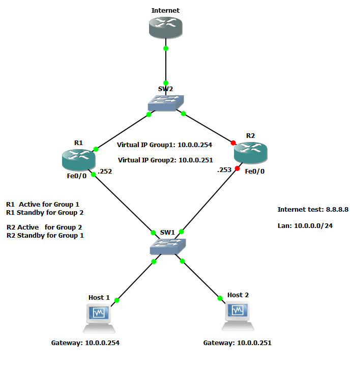
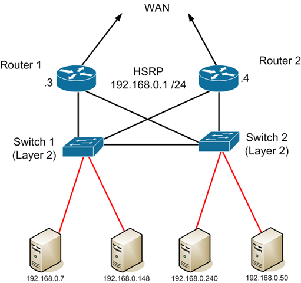
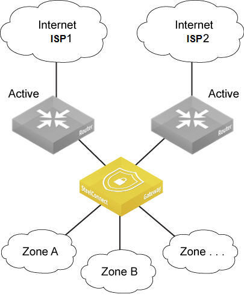

# First Hop Redundancy et Enterprise Redundancy

## Objectifs du cours

Ce cours explore les protocoles de redondance du premier saut (FHRP) et les strategies de conception pour garantir la haute disponibilite dans les reseaux d'entreprise. Que se passe-t-il lorsque le routeur servant de passerelle par defaut tombe en panne ? Les utilisateurs perdent-ils leur connectivite ? Pas si vous avez mis en place FHRP !

Competences visees :
- Comprendre les fondamentaux de FHRP avec focus sur HSRP et VRRP
- Maitriser les mecanismes de failover avec passerelles virtuelles
- Configurer la priorite, la preemption et le tracking d'interface
- Concevoir des topologies d'entreprise pour une vraie redondance reseau
- Comprendre l'importance de l'uptime, des SLAs et de la tolerance aux pannes
- Identifier les vulnerabilites et les mesures de securisation

---

## Glossaire

### Concepts FHRP

| Sigle | Nom complet | Description |
|-------|-------------|-------------|
| **FHRP** | First Hop Redundancy Protocol | Famille de protocoles assurant la redondance de la passerelle par defaut |
| **HSRP** | Hot Standby Router Protocol | Protocole FHRP proprietaire Cisco |
| **VRRP** | Virtual Router Redundancy Protocol | Protocole FHRP standard ouvert (RFC 5798) |
| **GLBP** | Gateway Load Balancing Protocol | Protocole Cisco combinant redondance et repartition de charge |
| **VIP** | Virtual IP Address | Adresse IP virtuelle partagee par les routeurs du groupe |
| **VMAC** | Virtual MAC Address | Adresse MAC virtuelle associee au VIP |

### Roles et etats HSRP

| Terme | Description |
|-------|-------------|
| **Active** | Routeur traitant activement le trafic pour le groupe HSRP |
| **Standby** | Routeur pret a prendre le relais si l'Active tombe |
| **Listen** | Routeurs supplementaires surveillant l'etat du groupe |
| **Speak** | Etat transitoire pendant l'election |
| **Init** | Etat initial au demarrage |
| **Learn** | Attente de reception du VIP depuis le routeur Active |

### Roles et etats VRRP

| Terme | Description |
|-------|-------------|
| **Master** | Routeur traitant activement le trafic (equivalent Active) |
| **Backup** | Routeur(s) pret(s) a prendre le relais (equivalent Standby) |
| **Initialize** | Etat initial au demarrage |

### Mecanismes de failover

| Terme | Description |
|-------|-------------|
| **Priority** | Valeur (0-255) determinant quel routeur devient Active/Master |
| **Preemption** | Capacite d'un routeur a reprendre son role apres recuperation |
| **Tracking** | Ajustement dynamique de la priorite selon l'etat d'interfaces |
| **Decrement** | Valeur soustraite a la priorite lors du tracking |
| **Hello Timer** | Intervalle d'envoi des messages Hello (defaut : 3s HSRP) |
| **Hold Timer** | Temps avant de declarer un routeur defaillant (defaut : 10s HSRP) |

### Haute disponibilite

| Terme | Description |
|-------|-------------|
| **HA** | High Availability - Conception minimisant les temps d'arret |
| **Fault Tolerance** | Capacite a continuer sans interruption malgre une panne |
| **Failover** | Basculement automatique vers un equipement de secours |
| **Failback** | Retour au fonctionnement normal apres reparation |
| **SLA** | Service Level Agreement - Engagement de niveau de service |
| **Uptime** | Pourcentage de temps ou le service est disponible |
| **MTBF** | Mean Time Between Failures - Temps moyen entre pannes |
| **MTTR** | Mean Time To Repair - Temps moyen de reparation |

### Termes de securite

| Terme | Description |
|-------|-------------|
| **FHRP Hijacking** | Prise de controle du role Active/Master par un attaquant |
| **Priority Manipulation** | Modification de priorite pour devenir Active |
| **Authentication** | Mecanisme de validation des messages FHRP |
| **Rogue Gateway** | Passerelle non autorisee injectee dans le reseau |

---

## HSRP : Hot Standby Router Protocol

HSRP est un protocole proprietaire Cisco permettant a un groupe de routeurs de presenter une adresse IP et MAC virtuelle unique aux hotes du LAN.



### Principe de fonctionnement

1. **Groupe HSRP** : Plusieurs routeurs partagent une adresse IP virtuelle (VIP)
2. **Election** : Un routeur devient Active, un autre Standby
3. **Passerelle virtuelle** : Les hotes utilisent le VIP comme default gateway
4. **Failover** : Si l'Active tombe, le Standby prend immediatement le relais

### Hierarchie des roles

| Role | Fonction |
|------|----------|
| **Active** | Repond aux requetes ARP pour le VIP, route le trafic |
| **Standby** | Surveille l'Active, pret a prendre le relais |
| **Listen** | Surveille les messages Hello, peut devenir Standby |

### Adresses utilisees

| Element | Valeur |
|---------|--------|
| Adresse multicast (HSRPv1) | 224.0.0.2 |
| Adresse multicast (HSRPv2) | 224.0.0.102 |
| Port UDP | 1985 |
| MAC virtuelle (HSRPv1) | 0000.0C07.ACxx (xx = groupe en hex) |
| MAC virtuelle (HSRPv2) | 0000.0C9F.Fxxx (xxx = groupe en hex) |

### Configuration HSRP de base

```cisco
! Routeur R1 (sera Active avec priorite elevee)
interface GigabitEthernet0/1
 ip address 192.168.10.2 255.255.255.0
 standby version 2
 standby 1 ip 192.168.10.1
 standby 1 priority 110
 standby 1 preempt
 standby 1 timers 1 3

! Routeur R2 (sera Standby)
interface GigabitEthernet0/1
 ip address 192.168.10.3 255.255.255.0
 standby version 2
 standby 1 ip 192.168.10.1
 standby 1 priority 100
 standby 1 preempt
 standby 1 timers 1 3
```

### Versions HSRP

| Caracteristique | HSRPv1 | HSRPv2 |
|-----------------|--------|--------|
| Groupes | 0-255 | 0-4095 |
| Adresse multicast | 224.0.0.2 | 224.0.0.102 |
| Support IPv6 | Non | Oui |
| Timers | Secondes | Millisecondes |

### Commandes de verification

```cisco
! Etat HSRP
show standby
show standby brief

! Detail d'une interface
show standby GigabitEthernet0/1

! Statistiques
show standby statistics
```

### Exemple de sortie show standby brief

```
Interface   Grp  Pri P State   Active          Standby         Virtual IP
Gi0/1       1    110 P Active  local           192.168.10.3    192.168.10.1
```

---

## VRRP : Virtual Router Redundancy Protocol

VRRP est un protocole standard ouvert (RFC 5798) offrant des fonctionnalites similaires a HSRP, avec l'avantage de l'interoperabilite multi-vendeur.


### Differences cles avec HSRP

| Aspect | HSRP | VRRP |
|--------|------|------|
| Proprietaire | Cisco | Standard ouvert |
| Terminologie | Active/Standby | Master/Backup |
| VIP = IP physique | Non | Oui (possible) |
| Preemption par defaut | Non | Oui |
| Adresse multicast | 224.0.0.2/102 | 224.0.0.18 |
| Protocole | UDP 1985 | IP Protocol 112 |
| MAC virtuelle | 0000.0C07.ACxx | 0000.5E00.01xx |

### Configuration VRRP de base

```cisco
! Routeur R1 (sera Master)
interface GigabitEthernet0/1
 ip address 192.168.10.2 255.255.255.0
 vrrp 1 ip 192.168.10.1
 vrrp 1 priority 110
 vrrp 1 preempt

! Routeur R2 (sera Backup)
interface GigabitEthernet0/1
 ip address 192.168.10.3 255.255.255.0
 vrrp 1 ip 192.168.10.1
 vrrp 1 priority 100
 vrrp 1 preempt
```

### VIP egal a l'IP physique

Une particularite de VRRP : le VIP peut etre l'adresse IP reelle d'un des routeurs.

```cisco
! R1 utilise son IP comme VIP (IP owner)
interface GigabitEthernet0/1
 ip address 192.168.10.1 255.255.255.0
 vrrp 1 ip 192.168.10.1
 vrrp 1 priority 255  ! Priorite max pour IP owner
```

L'IP owner a automatiquement la priorite maximale (255) et sera toujours Master.

### Commandes de verification

```cisco
! Etat VRRP
show vrrp
show vrrp brief

! Detail d'une interface
show vrrp interface GigabitEthernet0/1

! Statistiques
show vrrp statistics
```

---

## Priorite, Preemption et Tracking

Ces trois mecanismes rendent FHRP intelligent et adaptatif aux conditions du reseau.

### Priorite

La priorite determine quel routeur devient Active/Master :
- Plage : 0-255
- Defaut : 100
- Plus eleve = plus prioritaire
- En cas d'egalite : IP la plus haute gagne

```cisco
! Definir une priorite elevee
standby 1 priority 150

! Priorite par defaut
standby 1 priority 100
```

### Preemption

La preemption permet a un routeur de reprendre son role Active/Master apres recuperation d'une panne.

**Sans preemption :**
1. R1 (priorite 110) est Active
2. R1 tombe, R2 (priorite 100) devient Active
3. R1 revient, mais R2 reste Active

**Avec preemption :**
1. R1 (priorite 110) est Active
2. R1 tombe, R2 devient Active
3. R1 revient et reprend le role Active

```cisco
! Activer la preemption
standby 1 preempt

! Preemption avec delai (attendre 60s avant de reprendre)
standby 1 preempt delay minimum 60

! VRRP : preemption active par defaut
vrrp 1 preempt
```

### Interface Tracking

Le tracking ajuste dynamiquement la priorite selon l'etat d'interfaces ou d'objets.

**Scenario typique :**
- R1 est Active avec acces WAN via Gi0/2
- Si Gi0/2 tombe, R1 n'a plus d'acces WAN
- Le tracking reduit la priorite de R1
- R2 (avec WAN fonctionnel) devient Active

```cisco
! Tracking simple (decrement de 10)
standby 1 track GigabitEthernet0/2 10

! Tracking avec decrement personnalise
standby 1 track GigabitEthernet0/2 decrement 20

! Tracking d'un objet (plus flexible)
track 1 interface GigabitEthernet0/2 line-protocol
standby 1 track 1 decrement 15
```

### Exemple complet avec tracking

```cisco
! Configuration R1 (routeur principal)
interface GigabitEthernet0/1
 ip address 192.168.10.2 255.255.255.0
 standby version 2
 standby 1 ip 192.168.10.1
 standby 1 priority 110
 standby 1 preempt
 standby 1 track GigabitEthernet0/2 20

! Si Gi0/2 tombe : priorite = 110 - 20 = 90
! R2 avec priorite 100 devient Active
```

---

## Topologies de redondance

La redondance ne se limite pas aux protocoles - c'est une question d'architecture globale.

### Dual Routers (Routeurs doubles)

Configuration classique : deux routeurs en HSRP/VRRP sur le meme LAN.



**Avantages :**
- Failover transparent pour les utilisateurs
- Simple a implementer
- Repartition de charge possible avec plusieurs groupes

**Configuration :**
```
         Internet/WAN
              │
    ┌─────────┴─────────┐
    │                   │
┌───┴───┐           ┌───┴───┐
│  R1   │           │  R2   │
│Active │           │Standby│
│Pri:110│           │Pri:100│
└───┬───┘           └───┬───┘
    │                   │
    └─────────┬─────────┘
              │
         VIP: 192.168.10.1
              │
    ┌─────────┴─────────┐
    │      Switch       │
    └─────────┬─────────┘
              │
         Clients LAN
```

### Dual Uplinks (Liens doubles)

Chaque routeur dispose de liens WAN separes pour une redondance complete.

**Avantages :**
- Redondance WAN complete
- Diversite de chemins
- Meilleure isolation des pannes

**Complexites :**
- Routage asymetrique possible
- NAT sur les deux routeurs
- Politique de routage necessaire

```
      ISP-A            ISP-B
        │                │
    ┌───┴───┐        ┌───┴───┐
    │  R1   │        │  R2   │
    │Active │        │Standby│
    └───┬───┘        └───┬───┘
        │                │
        └────────┬───────┘
                 │
            VIP + Switch
                 │
            Clients LAN
```

### Configuration Active/Active



Les deux routeurs sont actifs simultanement pour differents VLANs :

```cisco
! R1 : Active pour VLAN 10, Standby pour VLAN 20
interface Vlan10
 ip address 192.168.10.2 255.255.255.0
 standby 10 ip 192.168.10.1
 standby 10 priority 110
 standby 10 preempt

interface Vlan20
 ip address 192.168.20.2 255.255.255.0
 standby 20 ip 192.168.20.1
 standby 20 priority 90
 standby 20 preempt

! R2 : Standby pour VLAN 10, Active pour VLAN 20
interface Vlan10
 ip address 192.168.10.3 255.255.255.0
 standby 10 ip 192.168.10.1
 standby 10 priority 90
 standby 10 preempt

interface Vlan20
 ip address 192.168.20.3 255.255.255.0
 standby 20 ip 192.168.20.1
 standby 20 priority 110
 standby 20 preempt
```

**Avantages Active/Active :**
- Repartition de charge entre routeurs
- Meilleure utilisation des ressources
- Redondance complete

---

## Uptime, SLAs et Tolerance aux pannes

### Niveaux de disponibilite

| Niveau | Uptime | Downtime/an | Downtime/mois |
|--------|--------|-------------|---------------|
| 99% | "Two nines" | 3.65 jours | 7.3 heures |
| 99.9% | "Three nines" | 8.76 heures | 43.8 minutes |
| 99.99% | "Four nines" | 52.56 minutes | 4.38 minutes |
| 99.999% | "Five nines" | 5.26 minutes | 26.3 secondes |
| 99.9999% | "Six nines" | 31.5 secondes | 2.63 secondes |

### Composants de la haute disponibilite

Pour atteindre les niveaux eleves de disponibilite :

| Composant | Solution de redondance |
|-----------|------------------------|
| Passerelle | HSRP/VRRP/GLBP |
| Liens LAN | EtherChannel/LAG |
| Liens WAN | Dual ISP |
| Alimentation | Dual PSU, UPS |
| Switches | Stacking, VSS, StackWise |
| Serveurs | Clustering, Load Balancing |
| Stockage | RAID, Replication |

### Fault Tolerance vs High Availability

| Aspect | Fault Tolerance | High Availability |
|--------|-----------------|-------------------|
| Objectif | Zero interruption | Minimiser les interruptions |
| Temps de basculement | Instantane | Quelques secondes |
| Cout | Eleve | Modere |
| Complexite | Elevee | Moderee |
| Exemple | Systemes critiques (finance, sante) | Applications business standard |

### FHRP dans le contexte HA

FHRP est techniquement une solution de **haute disponibilite** :
- Temps de failover : 3-10 secondes (timers par defaut)
- Avec timers agressifs : < 1 seconde
- Quelques paquets peuvent etre perdus pendant le failover

Pour se rapprocher de la **tolerance aux pannes** :
- Utiliser des timers sub-seconde
- Combiner avec BFD (Bidirectional Forwarding Detection)
- Implementer le tracking multi-criteres

```cisco
! Timers agressifs HSRP (hello 200ms, hold 700ms)
standby 1 timers msec 200 msec 700

! BFD pour detection rapide
interface GigabitEthernet0/1
 bfd interval 50 min_rx 50 multiplier 3
 standby 1 bfd
```

---

## Securite et implications cyber

### Vulnerabilites FHRP

| Attaque | Description | Impact |
|---------|-------------|--------|
| **FHRP Hijacking** | Attaquant devient Active/Master | Interception MitM |
| **Priority Spoofing** | Annonce de priorite elevee | Prise de controle gateway |
| **Hello Flooding** | Saturation de messages Hello | Instabilite du protocole |
| **Denial of Service** | Perturbation des elections | Perte de redondance |

### Scenario d'attaque : HSRP Hijacking

```
1. RECONNAISSANCE
   - Attaquant capture le trafic HSRP (multicast 224.0.0.2/102)
   - Identification du groupe, VIP, priorite Active

2. PREPARATION
   - Configuration d'une interface avec IP dans le subnet
   - Configuration HSRP avec priorite > Active actuel

3. EXECUTION
   - Envoi de messages HSRP Hello avec haute priorite
   - L'attaquant devient Active (si preemption activee)

4. INTERCEPTION
   - Tout le trafic LAN passe par l'attaquant
   - Position MitM ideale pour capture/modification
```

### Outils d'attaque connus

| Outil | Capacite |
|-------|----------|
| **Yersinia** | Attaques HSRP/VRRP automatisees |
| **Scapy** | Crafting de paquets FHRP personnalises |
| **Loki** | Framework d'attaque L2/L3 |

### Contre-mesures

#### 1. Authentification HSRP

```cisco
! Authentification MD5 (recommandee)
interface GigabitEthernet0/1
 standby 1 authentication md5 key-string SecretKey123

! Authentification en texte clair (legacy, non recommande)
standby 1 authentication text cisco
```

#### 2. Authentification VRRP

```cisco
! VRRP avec authentification (VRRPv2)
interface GigabitEthernet0/1
 vrrp 1 authentication md5 key-string SecretKey123
```

#### 3. Filtrage au niveau switch

```cisco
! ACL pour bloquer HSRP non autorise
ip access-list extended BLOCK-HSRP
 permit udp host 192.168.10.2 any eq 1985
 permit udp host 192.168.10.3 any eq 1985
 deny udp any any eq 1985 log
 permit ip any any

! Appliquer sur les ports access
interface range GigabitEthernet0/1 - 24
 ip access-group BLOCK-HSRP in
```

#### 4. Port Security et DHCP Snooping

```cisco
! Port security
interface GigabitEthernet0/10
 switchport port-security
 switchport port-security maximum 1
 switchport port-security violation shutdown

! DHCP Snooping (protection indirecte)
ip dhcp snooping
ip dhcp snooping vlan 10,20
```

#### 5. Monitoring et alertes

```cisco
! Logging des changements d'etat HSRP
standby 1 track 1 decrement 20
logging trap notifications

! SNMP traps pour changements FHRP
snmp-server enable traps hsrp
```

### Detection d'attaques

**Indicateurs de compromission :**

| Indicateur | Methode de detection |
|------------|----------------------|
| Changement d'Active inattendu | Logs, SNMP traps |
| Nouvelle adresse MAC pour VIP | Monitoring ARP |
| Messages HSRP depuis IP inconnue | Capture Wireshark |
| Priorite anormalement elevee | show standby |

**Script de detection basique :**

```python
from scapy.all import *

def detect_fhrp_attack(pkt):
    # Detection HSRP
    if pkt.haslayer(UDP) and pkt[UDP].dport == 1985:
        # Verifier si source IP est autorisee
        authorized_ips = ["192.168.10.2", "192.168.10.3"]
        src_ip = pkt[IP].src
        if src_ip not in authorized_ips:
            print(f"[ALERT] HSRP non autorise depuis {src_ip}")

sniff(filter="udp port 1985", prn=detect_fhrp_attack)
```

### Checklist securite FHRP

```
[ ] Authentification MD5 sur tous les groupes HSRP/VRRP
[ ] Cles d'authentification complexes et uniques
[ ] Filtrage des ports UDP 1985 (HSRP) et IP protocol 112 (VRRP)
[ ] Port security sur les ports access
[ ] Monitoring des changements d'etat FHRP
[ ] Alertes SNMP configurees
[ ] Documentation des priorites et VIPs autorises
[ ] Revue reguliere des configurations
[ ] Tests de failover planifies
[ ] Logs centralises pour analyse
```

### Mapping MITRE ATT&CK

| Technique | ID | Description |
|-----------|----|-------------|
| Adversary-in-the-Middle | T1557 | FHRP hijacking pour interception |
| Network Sniffing | T1040 | Capture du trafic via position MitM |
| Network Denial of Service | T1498 | Perturbation des elections FHRP |

---

## Depannage FHRP

### Problemes courants

| Probleme | Cause probable | Solution |
|----------|----------------|----------|
| Les deux routeurs Active | Probleme de communication | Verifier connectivite L2 |
| Pas de failover | Preemption desactivee | Activer preemption |
| Failover lent | Timers par defaut | Reduire les timers |
| VIP non joignable | Groupe mal configure | Verifier configuration |
| Flapping Active/Standby | Instabilite reseau | Verifier liens physiques |

### Commandes de diagnostic

```cisco
! Etat detaille HSRP
show standby all
debug standby events
debug standby packets

! Etat detaille VRRP
show vrrp all
debug vrrp events
debug vrrp packets

! Verification ARP pour VIP
show ip arp | include 192.168.10.1

! Verification tracking
show track
```

---

## Ressources

| Ressource | Description |
|-----------|-------------|
| [Cisco - HSRP Configuration Guide](https://www.cisco.com/c/en/us/td/docs/ios-xml/ios/ipapp_fhrp/configuration/xe-16/fhp-xe-16-book/fhp-hsrp.html) | Guide officiel HSRP |
| [RFC 5798 - VRRP](https://tools.ietf.org/html/rfc5798) | Specification VRRPv3 |
| [NetworkLessons - HSRP vs VRRP](https://networklessons.com/cisco/ccnp-encor-350-401/hsrp-hot-standby-routing-protocol) | Comparaison detaillee |
| [Cisco - FHRP Security](https://www.cisco.com/c/en/us/support/docs/ip/hot-standby-router-protocol-hsrp/13780-6.html) | Guide de securisation |

---

## Labs TryHackMe

| Room | Description | Lien |
|------|-------------|------|
| **Intro to Networking** | Fondamentaux reseau | https://tryhackme.com/room/introtonetworking |
| **Network Services** | Services et protocoles reseau | https://tryhackme.com/room/networkservices |
| **Network Services 2** | Services reseau avances | https://tryhackme.com/room/networkservices2 |
| **Wireshark: The Basics** | Analyse de paquets FHRP | https://tryhackme.com/room/wiresharkthebasics |
| **Layer 2 MAC Flooding & ARP Spoofing** | Attaques Layer 2 | https://tryhackme.com/r/room/dvwa |

> **Note** : Les protocoles FHRP sont principalement pratiques sur des environnements de lab comme GNS3, EVE-NG ou Packet Tracer. Pour les tests de securite FHRP, un lab isole est indispensable. Des outils comme Yersinia permettent de simuler des attaques FHRP dans un contexte de pentest autorise.
