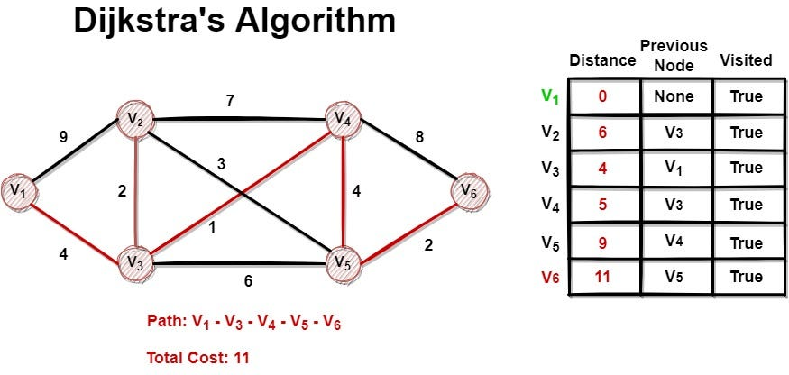
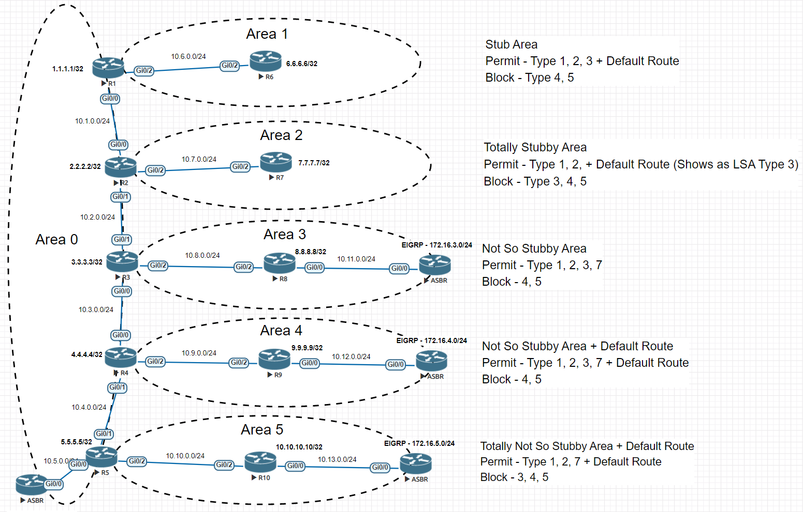
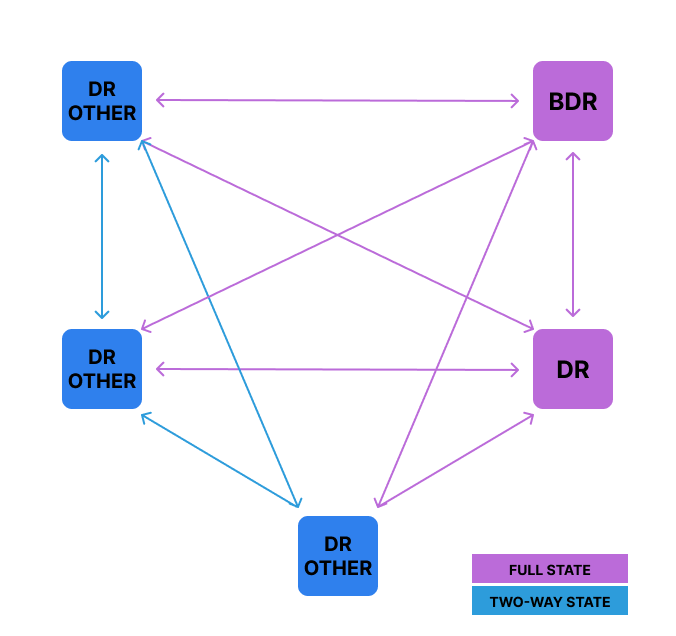

# OSPF - Open Shortest Path First (Avance)

## Objectifs du cours

Ce cours approfondit OSPF (Open Shortest Path First), l'un des protocoles de routage interne (IGP) les plus utilises dans les reseaux d'entreprise. Nous explorerons les mecanismes internes d'OSPF et apprendrons a le deployer efficacement dans differents environnements reseau.

Competences visees :
- Comprendre les principes du routage a etat de liens et les differences avec les protocoles a vecteur de distance
- Maitriser la structure OSPF : aires, LSAs et elections DR/BDR
- Configurer la summarization manuelle et controler les routes avec le filtrage
- Realiser la redistribution entre routes statiques et autres protocoles (EIGRP, RIP)
- Identifier les vulnerabilites OSPF et les mesures de securisation

---

## Glossaire

### Concepts fondamentaux

| Sigle | Nom complet | Description |
|-------|-------------|-------------|
| **OSPF** | Open Shortest Path First | Protocole de routage IGP a etat de liens (RFC 2328) |
| **IGP** | Interior Gateway Protocol | Protocole de routage interne a un systeme autonome |
| **EGP** | Exterior Gateway Protocol | Protocole de routage entre systemes autonomes (BGP) |
| **SPF** | Shortest Path First | Algorithme de Dijkstra pour calculer les chemins les plus courts |
| **LSA** | Link-State Advertisement | Paquet contenant les informations de topologie |
| **LSDB** | Link-State Database | Base de donnees contenant tous les LSAs d'une aire |
| **Cost** | Cout OSPF | Metrique basee sur la bande passante |

### Types de LSAs

| Type | Nom | Description |
|------|-----|-------------|
| **Type 1** | Router LSA | Decrit les interfaces du routeur dans une aire |
| **Type 2** | Network LSA | Genere par le DR, decrit les routeurs sur un segment multi-acces |
| **Type 3** | Summary LSA | Annonce les reseaux entre aires (genere par ABR) |
| **Type 4** | ASBR Summary LSA | Annonce la route vers l'ASBR |
| **Type 5** | External LSA | Routes externes injectees dans OSPF (genere par ASBR) |
| **Type 7** | NSSA External LSA | Routes externes dans une NSSA |

### Roles des routeurs

| Sigle | Nom complet | Description |
|-------|-------------|-------------|
| **ABR** | Area Border Router | Routeur connectant plusieurs aires OSPF |
| **ASBR** | Autonomous System Boundary Router | Routeur injectant des routes externes |
| **DR** | Designated Router | Routeur elu pour centraliser les echanges LSA |
| **BDR** | Backup Designated Router | Routeur de secours du DR |
| **DROTHER** | DR Other | Routeur ni DR ni BDR sur un segment |
| **RID** | Router ID | Identifiant unique du routeur (format IP) |

### Types d'aires

| Terme | Description |
|-------|-------------|
| **Area 0 / Backbone** | Aire centrale obligatoire, toutes les aires s'y connectent |
| **Standard Area** | Aire normale acceptant tous les types de LSAs |
| **Stub Area** | Aire bloquant les LSAs Type 5 (externes) |
| **Totally Stubby** | Aire bloquant les LSAs Type 3, 4 et 5 |
| **NSSA** | Not-So-Stubby Area - Permet l'injection limitee de routes externes |
| **Totally NSSA** | Combine Totally Stubby et NSSA |

### Termes de configuration

| Terme | Description |
|-------|-------------|
| **Summarization** | Agregation de plusieurs routes en une seule |
| **Redistribution** | Injection de routes d'un protocole vers un autre |
| **Filtering** | Controle des routes annoncees ou acceptees |
| **Route-map** | Structure de controle pour manipuler les routes |
| **Distribute-list** | Liste pour filtrer les routes dans un protocole |
| **Prefix-list** | Liste pour matcher des prefixes IP |

### Termes de securite

| Terme | Description |
|-------|-------------|
| **OSPF Authentication** | Authentification des paquets OSPF (MD5, SHA) |
| **Route Injection** | Injection de fausses routes dans OSPF |
| **Rogue Router** | Routeur non autorise participant au domaine OSPF |
| **LSA Spoofing** | Usurpation de LSAs pour manipuler le routage |

---

## Principes du routage a etat de liens

Pour apprecier pleinement le fonctionnement d'OSPF, il est essentiel de comprendre les fondamentaux des protocoles de routage a etat de liens.

### Comparaison : Distance-Vector vs Link-State

| Aspect | Distance-Vector (RIP) | Link-State (OSPF) |
|--------|----------------------|-------------------|
| **Vision du reseau** | Locale (voisins directs) | Globale (topologie complete) |
| **Information partagee** | Table de routage entiere | LSAs (changements uniquement) |
| **Algorithme** | Bellman-Ford | Dijkstra (SPF) |
| **Convergence** | Lente (count to infinity) | Rapide |
| **Boucles de routage** | Possibles | Impossibles (vue coherente) |
| **Ressources CPU/RAM** | Faibles | Elevees |
| **Scalabilite** | Limitee | Excellente (avec aires) |

### Le probleme du Distance-Vector

Un routeur distance-vector partage sa table de routage complete avec ses voisins immediats, qui la transmettent a leur tour. Cela cree un effet "telephone arabe" qui peut mener a :
- Convergence lente
- Boucles de routage
- Probleme de "count to infinity"

### La solution Link-State

Les routeurs link-state ont une perspective globale du reseau :

1. Chaque routeur OSPF envoie des LSAs decrivant ses liens connectes
2. Les LSAs sont diffuses (floodes) dans tout le domaine OSPF
3. Chaque routeur construit une carte identique de la topologie
4. L'algorithme SPF calcule independamment les meilleurs chemins

### L'algorithme SPF (Dijkstra)



L'algorithme SPF construit un arbre des plus courts chemins avec le routeur comme racine :

1. Le routeur collecte tous les LSAs de l'aire
2. Il construit la LSDB (identique sur tous les routeurs de l'aire)
3. Il execute l'algorithme SPF en se placant comme racine
4. Il calcule le SPT (Shortest Path Tree)
5. Il installe les meilleures routes dans sa table de routage

### Calcul du cout OSPF

```
Cost = Reference Bandwidth / Interface Bandwidth

Par defaut (Cisco) : Reference = 100 Mbps

Exemples :
- FastEthernet (100 Mbps)  : 100/100   = 1
- GigabitEthernet (1 Gbps) : 100/1000  = 0.1 → arrondi a 1
- 10 GigabitEthernet       : 100/10000 = 0.01 → arrondi a 1
```

**Probleme :** Tous les liens >= 100 Mbps ont le meme cout !

**Solution :** Augmenter la reference bandwidth :

```cisco
router ospf 1
 auto-cost reference-bandwidth 10000  ! 10 Gbps
```

### Exemple de topologie triangulaire

```
        R1
       /  \
   cost=1  cost=1
     /      \
   R2 ────── R3
      cost=1
```

1. R1 envoie un LSA : "Je suis connecte a R2 (cost 1) et R3 (cost 1)"
2. R2 envoie un LSA : "Je suis connecte a R1 (cost 1) et R3 (cost 1)"
3. R3 envoie un LSA : "Je suis connecte a R1 (cost 1) et R2 (cost 1)"
4. Chaque routeur construit la meme carte et calcule ses propres chemins

---

## LSAs, Aires OSPF et Election DR/BDR

### Link-State Advertisements (LSAs)

Les LSAs sont le coeur du mecanisme de partage d'information OSPF.

| Type | Genere par | Portee | Contenu |
|------|------------|--------|---------|
| **1 - Router** | Tous les routeurs | Intra-aire | Liens et couts du routeur |
| **2 - Network** | DR uniquement | Intra-aire | Routeurs connectes au segment |
| **3 - Summary** | ABR | Inter-aire | Reseaux des autres aires |
| **4 - ASBR Summary** | ABR | Inter-aire | Chemin vers l'ASBR |
| **5 - External** | ASBR | Domaine OSPF | Routes redistribuees |
| **7 - NSSA External** | ASBR dans NSSA | Intra-NSSA | Routes externes en NSSA |

Ces LSAs sont diffuses dans des limites specifiques (aire ou domaine entier) et permettent aux routeurs de mettre a jour leur LSDB. A chaque changement, les routeurs recalculent les routes avec l'algorithme SPF.

### Aires OSPF



OSPF introduit le concept d'aires pour diviser les grands reseaux en sections plus petites et gerables.

**Area 0 (Backbone) :**
- Aire centrale obligatoire
- Toutes les autres aires doivent s'y connecter (directement ou via virtual link)
- Point central qui relie tout le domaine de routage

**Aires non-backbone :**
- Reduisent le flooding LSA
- Diminuent la taille de la LSDB
- Isolent les changements de topologie

### Types d'aires detailles

| Type d'aire | LSA 1-2 | LSA 3 | LSA 4-5 | LSA 7 | Route par defaut |
|-------------|---------|-------|---------|-------|------------------|
| **Standard** | Oui | Oui | Oui | Non | Non |
| **Stub** | Oui | Oui | Non | Non | Oui |
| **Totally Stubby** | Oui | Non | Non | Non | Oui |
| **NSSA** | Oui | Oui | Non | Oui | Non |
| **Totally NSSA** | Oui | Non | Non | Oui | Oui |

### Configuration des types d'aires

**Stub Area :**
```cisco
router ospf 1
 area 1 stub
```
- Bloque les LSAs Type 5
- ABR injecte une route par defaut

**Totally Stubby Area (Cisco) :**
```cisco
! Sur l'ABR uniquement
router ospf 1
 area 1 stub no-summary
```
- Bloque les LSAs Type 3, 4 et 5
- Seule la route par defaut est propagee

**NSSA :**
```cisco
router ospf 1
 area 1 nssa
```
- Permet l'injection de routes externes via Type 7
- Type 7 converti en Type 5 a l'ABR

**Totally NSSA :**
```cisco
router ospf 1
 area 1 nssa no-summary
```

### Election DR/BDR



Sur les reseaux broadcast et NBMA (comme Ethernet ou Frame Relay), OSPF elit un Designated Router (DR) et un Backup Designated Router (BDR) pour eviter le chaos des adjacences completes.

**Processus d'election :**

1. Tous les routeurs du segment envoient des paquets Hello en multicast
2. Ils annoncent leur Router ID et priorite dans ces Hello
3. Le routeur avec la priorite la plus elevee devient DR
4. Le deuxieme plus eleve devient BDR
5. En cas d'egalite de priorite, le Router ID le plus eleve gagne

**Roles resultants :**
- **DR** : Forme des adjacences FULL avec tous, centralise les LSAs
- **BDR** : Adjacences FULL avec tous, pret a prendre le relais
- **DROTHER** : Adjacences 2-WAY entre eux, FULL avec DR/BDR

**Point important :** L'election DR/BDR n'est **pas preemptive**. Si le DR tombe, le BDR prend le relais. Un nouveau routeur avec une priorite plus elevee ne deviendra DR qu'apres une defaillance.

**Configuration de la priorite :**
```cisco
interface GigabitEthernet0/0
 ip ospf priority 100   ! 0 = ne participe pas a l'election
```

### Types de reseaux OSPF

| Type | Election DR/BDR | Exemple |
|------|-----------------|---------|
| **Broadcast** | Oui | Ethernet |
| **Non-Broadcast (NBMA)** | Oui | Frame Relay |
| **Point-to-Point** | Non | Liens serie, tunnels |
| **Point-to-Multipoint** | Non | Hub-and-spoke |

---

## Summarization manuelle et filtrage de routes

OSPF est un protocole classless supportant VLSM et la summarization manuelle. Cependant, la summarization ne se fait qu'aux frontieres d'aires et de systemes autonomes.

### Summarization sur ABR

La summarization aide a reduire la taille des tables de routage et ameliore les performances.

**Exemple :**
Routes a summarizer :
- 10.10.1.0/24
- 10.10.2.0/24
- 10.10.3.0/24

Peuvent etre resumees en : **10.10.0.0/22**

```cisco
router ospf 1
 area 1 range 10.10.0.0 255.255.252.0
```

Cela garde la LSDB plus petite et reduit l'utilisation CPU sur tous les routeurs.

### Summarization sur ASBR

Pour les routes externes redistribuees :

```cisco
router ospf 1
 summary-address 192.168.0.0 255.255.0.0
```

### Filtrage de routes

OSPF ne supporte pas le filtrage intra-aire, mais permet :

1. **Filtrage lors de la redistribution** : route-maps et distribute-lists
2. **Filtrage inter-aire sur ABR** : commande `area range` avec `not-advertise`
3. **Filtrage des LSAs externes** : route-map sur l'ASBR

### Exemple : Bloquer un reseau specifique de la redistribution

```cisco
! ACL pour identifier le reseau a bloquer
access-list 10 deny 192.168.100.0 0.0.0.255
access-list 10 permit any

! Route-map pour le filtrage
route-map FILTER deny 10
 match ip address 10

route-map FILTER permit 20

! Application lors de la redistribution
router ospf 1
 redistribute static subnets route-map FILTER
```

**Explication :**
- **ACL 10** : Refuse 192.168.100.0/24, autorise tout le reste
- **Route-map FILTER deny 10** : Refuse la redistribution des routes matchant l'ACL 10
- **Route-map FILTER permit 20** : Autorise toutes les autres routes

### Filtrage inter-aire (sur ABR)

```cisco
router ospf 1
 area 1 range 10.10.0.0 255.255.252.0 not-advertise
```

Cette commande empeche l'annonce de cette plage vers les autres aires.

---

## Redistribution basique

Dans les scenarios reels, vous devrez souvent integrer plusieurs protocoles de routage. La redistribution permet de partager les routes entre protocoles.

### Redistribution de routes statiques

```cisco
router ospf 1
 redistribute static subnets
```

**Important :** Le mot-cle `subnets` est obligatoire pour redistribuer les routes avec masques variables (VLSM). Sans lui, seules les routes classful seront redistribuees.

### Redistribution EIGRP vers OSPF

```cisco
router ospf 1
 redistribute eigrp 100 subnets
```

Le mot-cle `subnets` assure que toutes les routes, y compris celles avec VLSM, sont redistribuees.

### Redistribution OSPF vers EIGRP

```cisco
router eigrp 100
 redistribute ospf 1 metric 10000 100 255 1 1500
```

EIGRP necessite une metrique explicite avec 5 composantes :

| Composante | Valeur exemple | Description |
|------------|----------------|-------------|
| Bandwidth | 10000 | Bande passante en Kbps |
| Delay | 100 | Delai en dizaines de microsecondes |
| Reliability | 255 | Fiabilite (0-255, 255 = 100%) |
| Load | 1 | Charge (0-255, 255 = sature) |
| MTU | 1500 | MTU (generalement 1500 pour Ethernet) |

**Sans cette metrique, EIGRP n'acceptera pas les routes redistribuees.**

### Redistribution RIP vers OSPF

```cisco
router ospf 1
 redistribute rip subnets
```

### Redistribution OSPF vers RIP

```cisco
router rip
 redistribute ospf 1 metric 5
```

RIP necessite une metrique (hop count, max 15).

### Bonnes pratiques de redistribution

| Pratique | Raison |
|----------|--------|
| Toujours definir une metrique | Evite les routes avec metrique infinie |
| Utiliser des route-maps | Controle fin des routes redistribuees |
| Eviter la redistribution bidirectionnelle | Risque de boucles |
| Utiliser des tags | Identification et filtrage des routes redistribuees |
| Documenter la logique | Maintenabilite |
| Tester en lab | Avant deploiement en production |

### Utilisation des tags

```cisco
! Taguer les routes redistribuees
route-map EIGRP-TO-OSPF permit 10
 set tag 100

router ospf 1
 redistribute eigrp 100 subnets route-map EIGRP-TO-OSPF

! Filtrer par tag pour eviter les boucles
route-map OSPF-TO-EIGRP deny 10
 match tag 100
route-map OSPF-TO-EIGRP permit 20

router eigrp 100
 redistribute ospf 1 metric 10000 100 255 1 1500 route-map OSPF-TO-EIGRP
```

---

## Configuration OSPF de base

### Configuration minimale

```cisco
! Activer OSPF
router ospf 1
 router-id 1.1.1.1

! Annoncer les reseaux (methode classique)
 network 10.0.0.0 0.255.255.255 area 0
 network 192.168.1.0 0.0.0.255 area 1

! Ou par interface (methode moderne)
interface GigabitEthernet0/0
 ip ospf 1 area 0
```

### Configuration complete

```cisco
! Interface Loopback pour Router ID stable
interface Loopback0
 ip address 1.1.1.1 255.255.255.255

! Configuration OSPF
router ospf 1
 router-id 1.1.1.1
 auto-cost reference-bandwidth 10000
 passive-interface default
 no passive-interface GigabitEthernet0/0
 no passive-interface GigabitEthernet0/1
 network 10.0.0.0 0.0.0.255 area 0
 network 192.168.1.0 0.0.0.255 area 1
 area 1 range 192.168.0.0 255.255.252.0
```

### Commandes de verification

```cisco
! Vue d'ensemble OSPF
show ip ospf

! Voisins OSPF
show ip ospf neighbor

! Base de donnees LSDB
show ip ospf database

! Routes OSPF
show ip route ospf

! Detail d'une interface
show ip ospf interface GigabitEthernet0/0

! Statistiques
show ip ospf statistics

! Verification redistribution
show ip ospf database external
```

### Exemple de sortie show ip ospf neighbor

```
Neighbor ID     Pri   State           Dead Time   Address         Interface
2.2.2.2           1   FULL/DR         00:00:38    10.0.12.2       Gi0/0
3.3.3.3           1   FULL/BDR        00:00:35    10.0.12.3       Gi0/0
4.4.4.4           1   2WAY/DROTHER    00:00:33    10.0.12.4       Gi0/0
```

---

## Securite OSPF et implications cyber

### Vulnerabilites OSPF

| Attaque | Description | Impact |
|---------|-------------|--------|
| **Rogue Router** | Routeur non autorise injecte dans le domaine OSPF | Interception MitM, blackhole |
| **LSA Injection** | Injection de faux LSAs pour modifier la topologie | Redirection du trafic |
| **LSA Spoofing** | Usurpation des LSAs d'un routeur legitime | Controle du routage |
| **DR Election Manipulation** | Devenir DR pour controler les LSAs | Controle du segment |
| **MaxAge Attack** | LSAs avec MaxAge pour supprimer des routes | Deni de service |
| **Hello Packet Spoofing** | Usurpation des paquets Hello | Disruption des adjacences |

### Scenario d'attaque : Rogue OSPF Router

```
1. RECONNAISSANCE
   - Attaquant capture le trafic OSPF (multicast 224.0.0.5/6)
   - Identification de l'aire, Router IDs, reseaux annonces

2. CONNEXION
   - L'attaquant connecte un routeur au reseau
   - Configuration OSPF avec les memes parametres

3. ETABLISSEMENT DE VOISINAGE
   - Envoi de paquets Hello OSPF
   - Formation d'adjacence avec les routeurs legitimes

4. INJECTION DE ROUTES
   - Annonce de fausses routes avec metriques faibles
   - "Je suis le meilleur chemin vers 10.0.0.0/8"

5. INTERCEPTION
   - Le trafic est redirige vers l'attaquant
   - Position MitM pour capture/modification
```

### Contre-mesures

#### 1. Authentification OSPF

**MD5 (legacy mais repandu) :**
```cisco
interface GigabitEthernet0/0
 ip ospf authentication message-digest
 ip ospf message-digest-key 1 md5 SecretKey123!
```

**SHA (OSPFv2 avec keychain - recommande) :**
```cisco
key chain OSPF-KEYS
 key 1
  key-string SecretKey123!
  cryptographic-algorithm hmac-sha-256

interface GigabitEthernet0/0
 ip ospf authentication key-chain OSPF-KEYS
```

#### 2. Passive Interface

Empeche OSPF d'envoyer des Hello sur les interfaces non necessaires :

```cisco
router ospf 1
 passive-interface default
 no passive-interface GigabitEthernet0/0
 no passive-interface GigabitEthernet0/1
```

#### 3. Filtrage des routes

```cisco
ip prefix-list VALID-ROUTES seq 10 permit 10.0.0.0/8 le 24
ip prefix-list VALID-ROUTES seq 20 deny 0.0.0.0/0 le 32

route-map FILTER-IN permit 10
 match ip address prefix-list VALID-ROUTES

router ospf 1
 distribute-list route-map FILTER-IN in
```

#### 4. Securite physique et logique

| Mesure | Implementation |
|--------|----------------|
| Port Security | Limiter les MAC sur les ports access |
| 802.1X | Authentification des equipements |
| ACLs | Filtrer le trafic OSPF (protocole 89) |
| Monitoring | Surveiller les changements de topologie |
| Logging | Journaliser les evenements OSPF |

### Checklist securite OSPF

```
[ ] Authentification MD5 ou SHA sur toutes les interfaces OSPF
[ ] Passive-interface par defaut, activer explicitement
[ ] Router ID configure manuellement (loopback)
[ ] Filtrage des routes redistribuees
[ ] Monitoring des adjacences et changements de topologie
[ ] Segmentation en aires pour limiter la propagation
[ ] Documentation de la topologie OSPF attendue
[ ] Alertes sur nouveaux voisins OSPF
[ ] Tests de penetration periodiques
[ ] Revue des configurations
```

### Mapping MITRE ATT&CK

| Technique | ID | Description |
|-----------|----|-------------|
| Adversary-in-the-Middle | T1557 | Interception via manipulation de routes |
| Network Sniffing | T1040 | Capture du trafic redirige |
| Network Denial of Service | T1498 | Perturbation du routage |

---

## Depannage OSPF

### Problemes courants

| Probleme | Cause probable | Verification |
|----------|----------------|--------------|
| Adjacence bloquee en INIT | Hello unidirectionnel | ACL, firewall, MTU |
| Adjacence bloquee en EXSTART | MTU mismatch | `show ip ospf interface` |
| Pas de voisin | Aire differente, authentification | `debug ip ospf adj` |
| Routes manquantes | Filtrage, summarization | `show ip ospf database` |
| Cout incorrect | Reference bandwidth | `show ip ospf interface` |
| Redistribution echouee | Metrique manquante, subnets | `show ip ospf database external` |

### Commandes de debug

```cisco
! Debug adjacences (utiliser avec precaution)
debug ip ospf adj

! Debug paquets OSPF
debug ip ospf packet

! Debug evenements
debug ip ospf events

! Debug LSAs
debug ip ospf lsa-generation

! Desactiver tous les debugs
undebug all
```

---

## Ressources

| Ressource | Description |
|-----------|-------------|
| [RFC 2328](https://tools.ietf.org/html/rfc2328) | Specification OSPFv2 |
| [Cisco - OSPF Design Guide](https://www.cisco.com/c/en/us/support/docs/ip/open-shortest-path-first-ospf/7039-1.html) | Guide de conception OSPF |
| [NetworkLessons - OSPF](https://networklessons.com/ospf) | Tutoriels OSPF detailles |
| [Cisco - OSPF Redistribution](https://www.cisco.com/c/en/us/support/docs/ip/open-shortest-path-first-ospf/13710-ext-ospf.html) | Guide de redistribution |

---

## Labs TryHackMe

| Room | Description | Lien |
|------|-------------|------|
| **Intro to Networking** | Fondamentaux reseau incluant routage | https://tryhackme.com/room/introtonetworking |
| **Network Services** | Services reseau et protocoles | https://tryhackme.com/room/networkservices |
| **Wireshark: The Basics** | Analyse de paquets (utile pour debug OSPF) | https://tryhackme.com/room/wiresharkthebasics |
| **Attacking and Defending AWS** | Concepts de routage cloud | https://tryhackme.com/room/introtocloudpentest |

> **Note** : TryHackMe ne propose pas de room specifiquement dediee a OSPF. Les concepts avances de routage sont generalement pratiques sur GNS3, EVE-NG ou Packet Tracer. Pour la pratique des attaques OSPF, un lab isole avec des routeurs virtuels est recommande.
