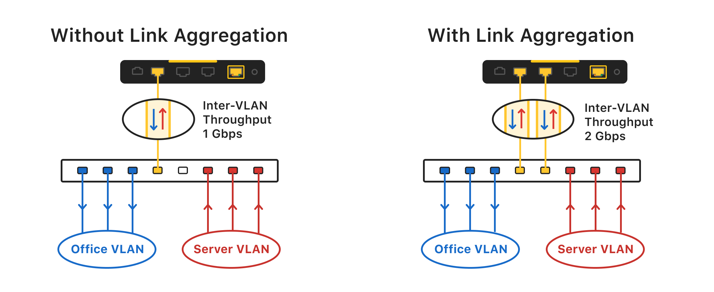
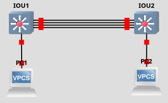

# Link aggregation et load balancing

## Objectifs du cours

Ce cours présente les techniques de haute disponibilité essentielles pour les réseaux modernes : l'agrégation de liens (Link Aggregation) et la répartition de charge (Load Balancing). Ces compétences sont critiques pour les ingénieurs réseau, administrateurs système et architectes de data centers qui doivent garantir des réseaux résilients, redondants et performants.

Compétences visees :
- Comprendre les principes et le fonctionnement de LACP et EtherChannel
- Maîtriser les différentes stratégies de load balancing et leurs cas d'usage
- Appliquer l'agrégation de liens dans les topologies redondantes et les data centers
- Identifier les bonnes pratiques et considerations de conception
- Reconnaître les vulnérabilités et les mesures de sécurisation

---

## Glossaire

### Concepts fondamentaux

| Sigle | Nom complet | Description |
|-------|-------------|-------------|
| **LAG** | Link Aggregation Group | Groupe de liens physiques agreges en un lien logique |
| **LACP** | Link Aggregation Control Protocol | Protocole standard IEEE 802.3ad pour l'agrégation dynamique |
| **PAgP** | Port Aggregation Protocol | Protocole Cisco propriétaire pour l'agrégation |
| **EtherChannel** | - | Implementation Cisco de l'agrégation de liens |
| **Port-Channel** | - | Interface logique representant un groupe de liens agreges |
| **Bonding** | - | Terme Linux pour l'agrégation de liens |
| **Teaming** | - | Terme Windows/VMware pour l'agrégation de liens |

### Modes LACP

| Mode | Description |
|------|-------------|
| **Active** | Envoie des LACPDUs et initie la negociation |
| **Passive** | Repond aux LACPDUs mais n'initie pas |
| **On** | Mode statique sans negociation (risque) |

### Modes EtherChannel

| Mode | Protocole | Description |
|------|-----------|-------------|
| **Active** | LACP | Initie la negociation LACP |
| **Passive** | LACP | Repond a la negociation LACP |
| **Desirable** | PAgP | Initie la negociation PAgP |
| **Auto** | PAgP | Repond a la negociation PAgP |
| **On** | Aucun | Configuration statique |

### Load balancing

| Terme | Description |
|-------|-------------|
| **Per-Packet** | Distribution paquet par paquet |
| **Per-Flow** | Distribution par flux (session) |
| **Per-Destination** | Distribution par destination |
| **Hash** | Algorithme de répartition base sur un calcul |
| **Round-Robin** | Distribution alternee sur chaque lien |

### Haute disponibilité

| Terme | Description |
|-------|-------------|
| **Failover** | Basculement automatique vers un lien de secours |
| **Redundancy** | Duplication des ressources pour la tolérance aux pannes |
| **MLAG/MC-LAG** | Multi-Chassis LAG - Agrégation sur plusieurs switches |
| **vPC** | Virtual Port-Channel - Implementation Cisco Nexus de MC-LAG |
| **VSS** | Virtual Switching System - Virtualisation de deux switches Cisco |

### Termes de sécurité

| Terme | Description |
|-------|-------------|
| **LAG Manipulation** | Attaque visant a perturber l'agrégation |
| **LACP Flooding** | Saturation de messages LACP |
| **Link Flapping** | Oscillation rapide de l'état d'un lien |

---

## Comprendre le besoin de haute disponibilité

La haute disponibilité n'est pas qu'un buzzword, c'est le fondement des infrastructures modernes. Les réseaux sont la colonne vertebrale de toute communication numerique, mais comme tout système, ils peuvent tomber en panne.

### Problèmes resolus par l'agrégation de liens

| Problème | Solution |
|----------|----------|
| Point de défaillance unique | Redondance des liens physiques |
| Goulots d'étranglement de bande passante | Agrégation de la capacité |
| Manque de redondance | Failover automatique |
| Distribution inefficace du trafic | Load balancing |

---

## Fondamentaux de l'agrégation de liens



L'agrégation de liens est la méthode de combinaison de plusieurs interfaces réseau physiques en une seule interface logique. Ce groupe logique agit comme un lien unique offrant un débit plus élevé et une tolérance aux pannes.

### Exemple concret

```
Sans agrégation :
Switch A ──── 1 Gbps ──── Switch B
             (lien unique)

Avec agrégation :
Switch A ═══╤═══ 1 Gbps ═══╤═══ Switch B
            │   1 Gbps     │
            │   1 Gbps     │
            └── 1 Gbps ────┘
            (4 Gbps logiques, redondance)
```

### Types d'agrégation

| Type | Description | Risque |
|------|-------------|--------|
| **Statique (On)** | Configuration manuelle identique des deux côtés | Boucles si mal configuré |
| **Dynamique (LACP)** | Negociation automatique avec LACPDUs | Faible |
| **Dynamique (PAgP)** | Negociation Cisco propriétaire | Faible, mais limite a Cisco |

---

## LACP (IEEE 802.3ad)

LACP (Link Aggregation Control Protocol) est le protocole standard defini dans IEEE 802.3ad pour agreger dynamiquement plusieurs ports physiques en un canal logique.

### Fonctionnement de LACP

1. Deux appareils supportant LACP se detectent mutuellement
2. Ils echangent des LACP Data Units (LACPDUs)
3. Ils negocient quelles interfaces inclure dans le groupe
4. L'agrégation est formee selon la compatibilite (vitesse, duplex, config)
5. LACP surveille continuellement la sante de chaque lien

### Avantages de LACP

| Avantage | Description |
|----------|-------------|
| **Detection automatique** | Pas besoin de configuration manuelle |
| **Interoperabilite** | Standard IEEE, multi-vendeur |
| **Surveillance continue** | Detection et exclusion des liens defaillants |
| **Hot standby** | Support de liens de secours (jusqu'a 8 actifs + 8 standby) |

### Paramêtres LACP

| Paramêtre | Description |
|-----------|-------------|
| **System Priority** | Priorité du système (plus bas = préféré) |
| **Port Priority** | Priorité du port (plus bas = préféré) |
| **LACP Rate** | Fast (1s) ou Slow (30s) pour les LACPDUs |
| **LACP Key** | Identifiant du groupe d'agrégation |

---

## EtherChannel Cisco

EtherChannel est l'implementation Cisco de l'agrégation de liens. Il peut fonctionner en trois modes principaux.

### Modes de negociation

| Côté A | Côté B | Résultat |
|--------|--------|----------|
| Active | Active | EtherChannel LACP |
| Active | Passive | EtherChannel LACP |
| Passive | Passive | Pas d'EtherChannel |
| Desirable | Desirable | EtherChannel PAgP |
| Desirable | Auto | EtherChannel PAgP |
| Auto | Auto | Pas d'EtherChannel |
| On | On | EtherChannel statique |

### Regles essentielles

- Tous les liens doivent avoir la **même vitesse et duplex**
- Jusqu'a **8 liens actifs** par EtherChannel
- Les configurations d'interface (trunking, STP) doivent **correspondre**
- Meme **type de media** (tous cuivre ou tous fibre)

### Configuration EtherChannel LACP (sans VLANs)

```cisco
! Configuration des interfaces physiques
interface range FastEthernet0/1 - 2
 no shutdown
 channel-group 1 mode active
 exit

! Configuration de l'interface Port-Channel logique
interface Port-channel1
 no shutdown
```

**Explication :**
- `channel-group 1 mode active` : Active LACP et assigne les interfaces au Port-Channel 1
- Au moins un côté doit être en **active**, l'autre peut être **active** ou **passive**

### Configuration EtherChannel avec Trunk

```cisco
! SW1 et SW2 - Configuration identique
configure terminal
hostname SW1

! Interface Port-Channel
interface Port-channel 1
 no shutdown
 switchport trunk encapsulation dot1q
 switchport mode trunk
 exit

! Interfaces physiques
interface range ethernet 0/0-3
 no shutdown
 switchport trunk encapsulation dot1q
 switchport mode trunk
 channel-group 1 mode active
 exit

copy running-config startup-config
```

### Commandes de verification

```cisco
! Voir l'état de l'EtherChannel
show etherchannel summary

! Detail du Port-Channel
show etherchannel port-channel

! Voir les interfaces membres
show etherchannel detail

! Vérifier LACP
show lacp neighbor
show lacp internal

! Statistiques
show interfaces port-channel 1
```

### Exemple de sortie show etherchannel summary

```
Flags:  D - down        P - bundled in port-channel
        I - stand-alone s - suspended
        H - Hot-standby (LACP only)
        R - Layer3      S - Layer2
        U - in use      f - failed to allocate aggregator

Number of channel-groups in use: 1
Number of aggregators:           1

Group  Port-channel  Protocol    Ports
------+-------------+-----------+-----------------------------------------------
1      Po1(SU)         LACP      Fa0/1(P)    Fa0/2(P)
```

---

## Stratégies de load balancing

Une fois les liens agreges, il faut distribuer efficacement le trafic. C'est le role du load balancing.

### Per-packet load balancing

Chaque paquet est envoyé sur un lien different en alternance.

| Avantages | Inconvenients |
|-----------|---------------|
| Utilisation maximale des liens | Paquets arrivent dans le desordre |
| Algorithme simple | Performance TCP degradee |

**Usage :** Environnements UDP ou stateless uniquement.

### Per-flow / per-destination load balancing

Le trafic est hashe selon source/destination IP, MAC ou ports, et envoyé de manière cohérente sur le même lien.

| Avantages | Inconvenients |
|-----------|---------------|
| Preserve l'ordre des paquets | Peut ne pas utiliser tous les liens |
| Bon pour TCP | Depend de la diversite du trafic |

**Usage :** Cas général, recommandé pour la plupart des environnements.

### Algorithmes de hachage

| Methode | Hache sur | Utilisation |
|---------|-----------|-------------|
| **src-mac** | MAC source | Trafic depuis plusieurs sources |
| **dst-mac** | MAC destination | Trafic vers plusieurs destinations |
| **src-dst-mac** | MAC source + destination | Cas général L2 |
| **src-ip** | IP source | Trafic depuis plusieurs sources |
| **dst-ip** | IP destination | Trafic vers plusieurs destinations |
| **src-dst-ip** | IP source + destination | Cas général L3 |
| **src-dst-ip-port** | IP + ports L4 | Meilleure distribution |

### Configuration du load balancing Cisco

```cisco
! Voir la méthode actuelle
show etherchannel load-balance

! Configurer la méthode
port-channel load-balance src-dst-ip
```

### Adaptive load balancing

Certains systèmes avances utilisent des retours pour adapter dynamiquement la répartition. Si un lien est congestionne, ils deplacent les flux vers des liens moins utilisés.

---

## Cas d'usage dans les topologies redondantes

### Data center - couche access

```
        Serveur
       /       \
   NIC1         NIC2
     \           /
      \         /
    ┌──────────────┐
    │   ToR Switch │
    └──────────────┘
         LACP
```

Les serveurs sont connectes aux switches ToR (Top of Rack) avec plusieurs liens agreges via LACP. Cela fournit :
- **Redondance** : Si un lien tombe, les autres continuent
- **Bande passante** : Plus de capacité pour le trafic

### Multi-chassis LAG (MC-LAG / MLAG)

```
        Serveur
       /       \
   NIC1         NIC2
     │           │
     │    LAG    │
     ▼           ▼
┌─────────┐ ┌─────────┐
│ Switch1 │─│ Switch2 │
└─────────┘ └─────────┘
   (MLAG peer-link)
```

Le serveur se connecte a **deux switches différents** avec des liens agreges. Si un switch tombe, l'autre maintient la connectivité.

**Implementations :**
- **Cisco vPC** (Nexus)
- **Cisco VSS** (Catalyst)
- **Arista MLAG**
- **Juniper MC-LAG**

### Core network redundancy

```
┌──────────┐         ┌──────────┐
│  Core 1  │═════════│  Core 2  │
└────┬─────┘  LAG    └────┬─────┘
     │                    │
     │    LAG             │    LAG
     │                    │
┌────┴─────┐         ┌────┴─────┐
│ Distrib1 │         │ Distrib2 │
└──────────┘         └──────────┘
```

Les liens multiples entre switches core sont agreges pour :
- Eviter que STP bloque certains liens
- Utiliser toute la bande passante disponible
- Proteger contre les défaillances de liens individuels

### Environnements virtualisés

Dans VMware ESXi, Microsoft Hyper-V ou KVM, les NICs des hotes sont bondes :

```
      VMware ESXi Host
    ┌─────────────────────┐
    │   VM1  VM2  VM3     │
    │        │            │
    │   vSwitch (LACP)    │
    │   /    │    \       │
    │ vmnic0 vmnic1 vmnic2│
    └───┬─────┬─────┬─────┘
        │     │     │
        └─────┼─────┘
              │ LAG
        ┌─────┴─────┐
        │  Switch   │
        └───────────┘
```

---

## Lab pratique : EtherChannel LACP dans GNS3

### Objectif

Configurer un EtherChannel LACP entre deux switches Cisco, connecter deux VPCs, tester la connectivité et observer la redondance des liens.

### Topologie

```
    VPC1                          VPC2
     │                              │
     │ e1/0                    e1/0 │
┌────┴────┐                   ┌────┴────┐
│   SW1   │═══════════════════│   SW2   │
│         │  e0/0-e0/3 (LAG)  │         │
└─────────┘                   └─────────┘
```

### Configuration SW1

```cisco
configure terminal
hostname SW1

! Interface Port-Channel
interface Port-channel 1
 no shutdown
 switchport trunk encapsulation dot1q
 switchport mode trunk
 exit

! Interfaces physiques pour le LAG
interface range ethernet 0/0-3
 no shutdown
 switchport trunk encapsulation dot1q
 switchport mode trunk
 channel-group 1 mode active
 exit

! Interface vers VPC1
interface ethernet 1/0
 switchport mode access
 switchport access vlan 1
 no shutdown
 exit

copy running-config startup-config
```

### Configuration SW2

```cisco
configure terminal
hostname SW2

! Interface Port-Channel
interface Port-channel 1
 no shutdown
 switchport trunk encapsulation dot1q
 switchport mode trunk
 exit

! Interfaces physiques pour le LAG
interface range ethernet 0/0-3
 no shutdown
 switchport trunk encapsulation dot1q
 switchport mode trunk
 channel-group 1 mode active
 exit

! Interface vers VPC2
interface ethernet 1/0
 switchport mode access
 switchport access vlan 1
 no shutdown
 exit

copy running-config startup-config
```

### Configuration des VPCs

**VPC1 :**
```
ip 192.168.1.1/24
save
```

**VPC2 :**
```
ip 192.168.1.2/24
save
```

### Tests

1. **Test de connectivité initial :**
```
VPC1> ping 192.168.1.2
```

2. **Test de redondance - Couper un lien :**
```cisco
! Sur SW1 ou SW2
interface Ethernet0/0
 shutdown
```

3. **Vérifier que la connectivité persiste :**
```
VPC1> ping 192.168.1.2
```

### Résultat attendu



- L'EtherChannel est forme avec LACP
- Les VPCs peuvent communiquer via le Port-Channel logique
- La deconnexion d'un lien physique n'affecte pas la connectivité globale

---

## Bonnes pratiques et defis

### Bonnes pratiques

| Pratique | Raison |
|----------|--------|
| Ne pas melanger les vitesses | 1 Gbps + 10 Gbps = problèmes |
| Coherence des configurations | Les deux côtés doivent correspondre |
| Monitorer le trafic | Vérifier que le load balancing fonctionne |
| Diversite physique | Cables dans des chemins différents |
| Comprendre le trafic | Adapter l'algorithme de hachage |
| Tester le failover | Simuler des pannes régulierement |

### Points d'attention

| Problème | Solution |
|----------|----------|
| STP bloque un lien du LAG | Configurer PortFast ou Rapid PVST+ |
| Trafic inegalement reparti | Changer l'algorithme de hachage |
| Failover lent | Utiliser LACP fast rate |
| Boucles réseau | Vérifier la cohérence des configurations |

### Différences entre vendeurs

| Vendeur | Particularites |
|---------|----------------|
| **Cisco** | EtherChannel, load balance src-dst-ip par défaut |
| **Juniper** | Interface `ae0` pour aggregated Ethernet |
| **Arista** | Support natif MLAG, ideal pour leaf-spine |
| **HP/Aruba** | Utilise la terminologie "Trunk" en CLI |
| **Linux** | Driver bonding avec modes multiples |

### Modes de bonding Linux

| Mode | Nom | Description |
|------|-----|-------------|
| 0 | balance-rr | Round-robin |
| 1 | active-backup | Un seul actif, failover |
| 2 | balance-xor | Hash XOR |
| 3 | broadcast | Envoie sur tous les liens |
| 4 | 802.3ad | LACP dynamique |
| 5 | balance-tlb | Transmit Load Balancing adaptatif |
| 6 | balance-alb | Adaptive Load Balancing |

---

## Sécurité et implications cyber

### Vulnérabilités liees a l'agrégation de liens

| Attaque | Description | Impact |
|---------|-------------|--------|
| **LACP Manipulation** | Envoi de LACPDUs malveillants | Disruption de l'agrégation |
| **LAG Hijacking** | Tentative de rejoindre un LAG existant | Interception de trafic |
| **Link Flapping** | Oscillation rapide d'un lien | Instabilité, CPU spike |
| **LACP Flooding** | Saturation de messages LACP | DoS |

### Scenario d'attaque : LACP Manipulation

```
1. RECONNAISSANCE
   - Attaquant capture le trafic LACP (multicast 01:80:C2:00:00:02)
   - Identification des paramètres (System ID, Key, Priority)

2. INJECTION
   - Envoi de LACPDUs avec des paramètres manipules
   - Tentative de perturber l'agrégation existante

3. IMPACT
   - Perte de liens du LAG
   - Reduction de bande passante
   - Potential MitM si l'attaquant devient membre du LAG
```

### Contre-mesures

#### 1. Port Security

```cisco
interface range ethernet 0/0-3
 switchport port-security
 switchport port-security maximum 1
 switchport port-security violation shutdown
```

#### 2. LACP Rate et Timeout

```cisco
interface range ethernet 0/0-3
 lacp rate fast
 lacp port-priority 32768
```

#### 3. Filtrage des LACPDUs

Sur les ports access ou non-LAG :
```cisco
interface ethernet 1/0
 no lacp port-channel
 spanning-tree bpduguard enable
```

#### 4. LACP System Priority

```cisco
lacp system-priority 4096  ! Plus bas = préféré
```

#### 5. Monitoring

```cisco
! Alertes sur les changements d'état
logging trap notifications
snmp-server enable traps etherchannel
```

### Checklist sécurité LAG

```
[ ] Port security sur les interfaces LAG
[ ] LACP rate fast pour detection rapide
[ ] System priority configuré explicitement
[ ] Monitoring des événements EtherChannel
[ ] BPDUGuard sur les ports non-LAG
[ ] Documentation des LAGs autorisés
[ ] Tests de failover réguliers
[ ] Revue des logs pour link flapping
[ ] Separation physique des cables (diversite)
[ ] Configuration cohérente et vérifiée
```

### Mapping MITRE ATT&CK

| Technique | ID | Description |
|-----------|----|-------------|
| Network Denial of Service | T1498 | Perturbation via LACP manipulation |
| Adversary-in-the-Middle | T1557 | Interception si LAG compromis |
| Network Sniffing | T1040 | Capture sur un membre du LAG |

---

## Dépannage

### Problèmes courants

| Problème | Cause probable | Solution |
|----------|----------------|----------|
| LAG ne se forme pas | Modes incompatibles | Vérifier active/passive |
| Liens en "s" (suspended) | Vitesse/duplex différents | Harmoniser les configs |
| Un seul lien actif | Configuration incorrecte | Vérifier channel-group |
| Trafic inegal | Hash inadapte | Changer load-balance method |
| Flapping | Problème physique | Vérifier cables/SFPs |

### Commandes de diagnostic

```cisco
! État général
show etherchannel summary
show etherchannel detail

! Vérifier LACP
show lacp neighbor
show lacp sys-id
show lacp counters

! Interface Port-Channel
show interfaces port-channel 1

! Voir le load balancing
show etherchannel load-balance

! Debug (attention en production)
debug etherchannel events
debug lacp events
```

---

## Ressources

| Ressource | Description |
|-----------|-------------|
| [IEEE 802.3ad](https://standards.ieee.org/standard/802_3ad-2000.html) | Standard LACP |
| [Cisco - EtherChannel Configuration](https://www.cisco.com/c/en/us/td/docs/switches/lan/catalyst3750/software/release/15-0_2_se/configuration/guide/scg3750/swethchl.html) | Guide officiel Cisco |
| [Juniper - Link Aggregation](https://www.juniper.net/documentation/us/en/software/junos/interfaces-ethernet/topics/concept/interfaces-link-aggregation-overview.html) | Documentation Juniper |
| [Linux Bonding](https://www.kernel.org/doc/Documentation/networking/bonding.txt) | Documentation kernel Linux |

---

## Labs TryHackMe

| Room | Description | Lien |
|------|-------------|------|
| **Intro to Networking** | Fondamentaux réseau | https://tryhackme.com/room/introtonetworking |
| **Network Services** | Services et protocoles réseau | https://tryhackme.com/room/networkservices |
| **Network Services 2** | Services réseau avances | https://tryhackme.com/room/networkservices2 |
| **Wireshark: The Basics** | Analyse de paquets | https://tryhackme.com/room/wiresharkthebasics |

> **Note** : L'agrégation de liens est principalement pratiquée sur des environnements de lab comme GNS3, EVE-NG ou Packet Tracer. Le lab décrit dans ce cours peut être réalisé avec des images Cisco IOU L2 dans GNS3. Pour les tests de sécurité LAG, un environnement isolé est recommandé.
