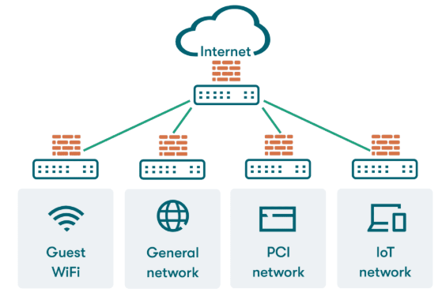
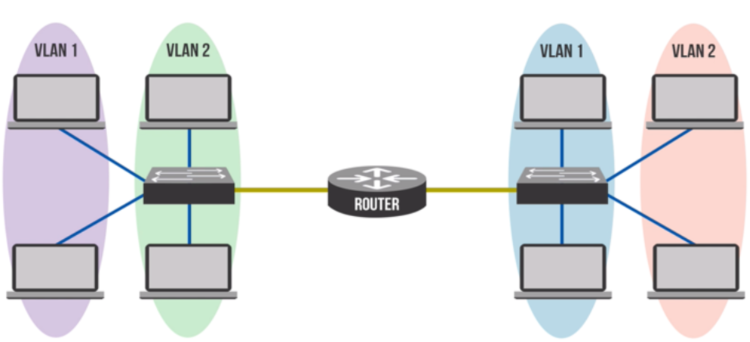
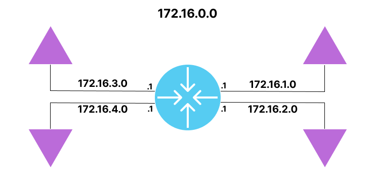

# Segmentation Reseau et DMZ

## Objectifs du cours

Ce cours explore l'une des strategies de conception de sécurité les plus puissantes : la segmentation réseau et l'utilisation des DMZ (Zones Demilitarisees). Ces concepts sont essentiels pour reduire les risques, limiter les mouvements lateraux et proteger votre infrastructure critique.

Competences visees :
- Comprendre le concept et les avantages de la segmentation réseau
- Concevoir et implementer des DMZ efficacement
- Maitriser le role des ACLs et firewalls dans la gestion des réseaux segmentes
- Identifier les erreurs courantes et savoir les eviter
- Appliquer ces concepts dans des environnements entreprise et cloud

---

## Glossaire

### Concepts fondamentaux

| Terme | Description |
|-------|-------------|
| **Segmentation** | Division d'un réseau en segments isolés pour la sécurité et la performance |
| **DMZ** | Demilitarized Zone - Zone entre le réseau interne et Internet |
| **Zone** | Partie logique du réseau avec des politiques de sécurité spécifiques |
| **Perimetre** | Frontiere entre les réseaux de confiance differente |
| **Blast Radius** | Etendue de l'impact d'une compromission |

### Types de segmentation

| Type | Description |
|------|-------------|
| **Physique** | Segmentation via équipements dedies separes |
| **VLAN** | Segmentation logique sur un meme switch physique |
| **Subnet** | Segmentation par sous-réseaux IP distincts |
| **Microsegmentation** | Segmentation granulaire au niveau workload/VM/container |

### Zones réseau courantes

| Zone | Description |
|------|-------------|
| **LAN** | Local Area Network - Reseau interne de confiance |
| **WAN** | Wide Area Network - Reseau etendu |
| **DMZ** | Zone pour les services publics exposes |
| **Management** | Zone d'administration isolée |
| **Guest** | Zone pour les visiteurs/BYOD |

### Termes de sécurité

| Terme | Description |
|-------|-------------|
| **Lateral Movement** | Deplacement d'un attaquant entre systèmes du meme réseau |
| **Defense in Depth** | Strategie de sécurité multicouche |
| **Zero Trust** | Modele ou aucune entite n'est de confiance par defaut |
| **East-West Traffic** | Trafic entre systèmes du meme réseau |
| **North-South Traffic** | Trafic entrant/sortant du réseau |

### Termes cloud

| Terme | Description |
|-------|-------------|
| **VPC** | Virtual Private Cloud - Reseau virtuel isolé dans le cloud |
| **Security Group** | Firewall stateful au niveau instance (AWS/Azure) |
| **NACL** | Network ACL - Filtrage stateless au niveau subnet (AWS) |
| **Public Subnet** | Subnet avec acces Internet direct |
| **Private Subnet** | Subnet sans acces Internet direct |

### Acronymes de conformite

| Acronyme | Description |
|----------|-------------|
| **PCI-DSS** | Payment Card Industry Data Security Standard |
| **HIPAA** | Health Insurance Portability and Accountability Act |
| **CDE** | Cardholder Data Environment |
| **PHI** | Protected Health Information |

---

## Qu'est-ce que la segmentation réseau ?

La segmentation réseau est la pratique de diviser un réseau informatique en segments ou sous-réseaux plus petits et isolés. L'objectif est d'ameliorer la performance, renforcer la sécurité et contenir la propagation des menaces.

```
┌─────────────────────────────────────────────────────────────────┐
│                    RESEAU NON SEGMENTE                          │
│  ┌────┐  ┌────┐  ┌────┐  ┌────┐  ┌────┐  ┌────┐  ┌────┐        │
│  │ PC │──│ PC │──│ SRV│──│ DB │──│ PC │──│ SRV│──│ PC │        │
│  └────┘  └────┘  └────┘  └────┘  └────┘  └────┘  └────┘        │
│                     Tout communique avec tout                   │
│                     >>> RISQUE ELEVE <<<                        │
└─────────────────────────────────────────────────────────────────┘

┌─────────────────────────────────────────────────────────────────┐
│                    RESEAU SEGMENTE                              │
│  ┌──────────────┐   ┌──────────────┐   ┌──────────────┐        │
│  │   Zone RH    │   │   Zone IT    │   │  Zone Finance │        │
│  │ ┌────┐┌────┐ │   │ ┌────┐┌────┐ │   │ ┌────┐┌────┐ │        │
│  │ │ PC ││ PC │ │   │ │ PC ││ SRV│ │   │ │ PC ││ DB │ │        │
│  │ └────┘└────┘ │   │ └────┘└────┘ │   │ └────┘└────┘ │        │
│  └──────┬───────┘   └──────┬───────┘   └──────┬───────┘        │
│         │                  │                  │                 │
│         └────────── FIREWALL/ACL ────────────┘                 │
│                   Acces contrôle                                │
└─────────────────────────────────────────────────────────────────┘
```

C'est comme mettre des portes et des murs a l'interieur d'un batiment. Au lieu d'avoir un grand espace ouvert ou n'importe qui peut aller n'importe ou, la segmentation etablit des frontieres.

---

## Pourquoi segmenter le réseau ?

### 1. Limiter le "Blast Radius"

Imaginez qu'un malware entre dans le réseau via un poste de travail vulnerable. Si tout est plat et connecte, ce malware peut se deplacer lateralement, se propageant aux serveurs, bases de donnees et autres infrastructures critiques.

```
RESEAU PLAT (sans segmentation) :
┌─────────────────────────────────────────────────────────┐
│  Malware                                                │
│     │                                                   │
│     ▼                                                   │
│  ┌────┐    ┌────┐    ┌────┐    ┌────┐    ┌────┐       │
│  │ PC │───>│ PC │───>│ SRV│───>│ DB │───>│ DC │       │
│  │INF.│    │INF.│    │INF.│    │INF.│    │INF.│       │
│  └────┘    └────┘    └────┘    └────┘    └────┘       │
│                                                         │
│  >>> PROPAGATION TOTALE <<<                            │
└─────────────────────────────────────────────────────────┘

RESEAU SEGMENTE :
┌─────────────────────────────────────────────────────────┐
│  Malware                                                │
│     │                                                   │
│     ▼                                                   │
│  ┌────────────────┐ ║ ┌────────────────┐               │
│  │  Zone Postes   │ ║ │  Zone Serveurs │               │
│  │ ┌────┐ ┌────┐  │ ║ │ ┌────┐ ┌────┐  │               │
│  │ │ PC │ │ PC │  │ ║ │ │ SRV│ │ DB │  │               │
│  │ │INF.│ │INF.│  │ ║ │ │ OK │ │ OK │  │               │
│  │ └────┘ └────┘  │ ║ │ └────┘ └────┘  │               │
│  └────────────────┘ ║ └────────────────┘               │
│                     ║                                   │
│  >>> CONFINEMENT <<< (Firewall bloque la propagation)  │
└─────────────────────────────────────────────────────────┘
```

### 2. Ameliorer le contrôle d'acces

| Zone | Acces autorise | Acces refuse |
|------|----------------|--------------|
| RH | Email, Intranet RH | Serveurs Finance, IT |
| Finance | ERP, Base Finance | Serveurs RH, Dev |
| IT | Tous (admin) | - |
| Guest | Internet uniquement | Tout le réseau interne |

### 3. Reduire le perimetre de conformite

| Framework | Exigence | Solution |
|-----------|----------|----------|
| **PCI-DSS** | Isoler les donnees de carte | Segmenter le CDE |
| **HIPAA** | Proteger les PHI | Zone dediee sante |
| **GDPR** | Proteger les donnees personnelles | Segmentation par sensibilite |

**Avantage :** Moins de systèmes dans le perimetre = moins d'audits et de contraintes.

### 4. Optimiser la performance

| Probleme | Solution |
|----------|----------|
| Broadcast storms | Limiter le domaine de broadcast par VLAN |
| Congestion | Separer les flux par zone |
| Latence | Routes optimisees entre segments |

---

## Types de segmentation réseau

### 1. Segmentation physique



Chaque segment possede son propre équipement dedie : switches, routeurs et cables separes.

| Avantage | Inconvenient |
|----------|--------------|
| Isolation totale | Cout élevé |
| Pas de risque de misconfiguration | Difficulte de scalabilite |
| Performance garantie | Complexite de gestion |

**Usage :** Environnements tres sensibles (gouvernement, defense).

### 2. VLANs (Virtual LANs)



Les VLANs permettent de diviser un switch physique en plusieurs réseaux logiques.

```cisco
! Creation des VLANs
vlan 10
 name HR
vlan 20
 name IT
vlan 30
 name Finance

! Assignation des ports
interface range FastEthernet0/1-10
 switchport mode access
 switchport access vlan 10

interface range FastEthernet0/11-20
 switchport mode access
 switchport access vlan 20
```

| Avantage | Inconvenient |
|----------|--------------|
| Economique | Risque de VLAN hopping |
| Flexible | Necessite routage inter-VLAN |
| Facile a gerer | Configuration complexe a grande echelle |

**Communication inter-VLAN :** Necessite un routeur ou switch Layer 3.

### 3. Segmentation par subnet



Chaque segment possede un sous-réseau IP unique. Les routeurs ou firewalls contrôlent le trafic.

| Zone | VLAN | Subnet | Gateway |
|------|------|--------|---------|
| HR | 10 | 192.168.10.0/24 | 192.168.10.1 |
| IT | 20 | 192.168.20.0/24 | 192.168.20.1 |
| Finance | 30 | 192.168.30.0/24 | 192.168.30.1 |
| DMZ | 100 | 10.0.100.0/24 | 10.0.100.1 |

### 4. Microsegmentation


Forme granulaire de segmentation utilisee dans les datacenters et environnements cloud. Isole les workloads jusqu'au niveau VM ou container.

```
┌─────────────────────────────────────────────────────────┐
│                  MICROSEGMENTATION                       │
│                                                          │
│  ┌─────────┐   ┌─────────┐   ┌─────────┐               │
│  │   VM1   │   │   VM2   │   │   VM3   │               │
│  │ ┌─────┐ │   │ ┌─────┐ │   │ ┌─────┐ │               │
│  │ │Agent│ │   │ │Agent│ │   │ │Agent│ │               │
│  │ └──┬──┘ │   │ └──┬──┘ │   │ └──┬──┘ │               │
│  └────┼────┘   └────┼────┘   └────┼────┘               │
│       │             │             │                     │
│       └─────────────┼─────────────┘                     │
│                     │                                   │
│              ┌──────┴──────┐                           │
│              │   SDN       │                           │
│              │ Controller  │                           │
│              └─────────────┘                           │
│                                                         │
│  Chaque VM a ses propres regles de sécurité            │
└─────────────────────────────────────────────────────────┘
```

| Caracteristique | Description |
|-----------------|-------------|
| **Granularite** | Niveau workload individuel |
| **Technologie** | SDN, agents sur les hotes |
| **Zero Trust** | Verification pour chaque flux |
| **East-West** | Controle du trafic lateral |

**Outils :** VMware NSX, Cisco ACI, Illumio, Guardicore.

---

## Implementation de la segmentation

### Etape 1 : Definir les zones

| Zone | Description | Exemples de systèmes |
|------|-------------|----------------------|
| **User Zone** | Postes de travail | Laptops, desktops |
| **Server Zone** | Serveurs internes | Apps, databases |
| **Management Zone** | Administration | Jump boxes, monitoring |
| **Guest Zone** | Visiteurs/BYOD | Acces Internet seulement |
| **DMZ** | Services publics | Web, mail, DNS |

### Etape 2 : Assigner VLANs et subnets

```
┌──────────────────────────────────────────────────────────┐
│                 PLAN D'ADRESSAGE                          │
├──────────┬──────┬──────────────────┬─────────────────────┤
│ Zone     │ VLAN │ Subnet           │ Gateway             │
├──────────┼──────┼──────────────────┼─────────────────────┤
│ HR       │ 10   │ 192.168.10.0/24  │ 192.168.10.1        │
│ IT       │ 20   │ 192.168.20.0/24  │ 192.168.20.1        │
│ Finance  │ 30   │ 192.168.30.0/24  │ 192.168.30.1        │
│ Servers  │ 40   │ 192.168.40.0/24  │ 192.168.40.1        │
│ Mgmt     │ 50   │ 192.168.50.0/24  │ 192.168.50.1        │
│ Guest    │ 60   │ 192.168.60.0/24  │ 192.168.60.1        │
│ DMZ      │ 100  │ 10.0.100.0/24    │ 10.0.100.1          │
└──────────┴──────┴──────────────────┴─────────────────────┘
```

### Etape 3 : Configurer le routage et les ACLs

```cisco
! ACL pour contrôler le trafic inter-zones
ip access-list extended HR-TO-SERVERS
 remark Autoriser HR vers serveur email
 permit tcp 192.168.10.0 0.0.0.255 host 192.168.40.10 eq 25
 permit tcp 192.168.10.0 0.0.0.255 host 192.168.40.10 eq 143
 remark Bloquer HR vers serveurs finance
 deny ip 192.168.10.0 0.0.0.255 192.168.30.0 0.0.0.255
 remark Autoriser le reste
 permit ip 192.168.10.0 0.0.0.255 any

ip access-list extended GUEST-POLICY
 remark Guest peut uniquement acceder a Internet
 permit tcp 192.168.60.0 0.0.0.255 any eq 80
 permit tcp 192.168.60.0 0.0.0.255 any eq 443
 permit udp 192.168.60.0 0.0.0.255 any eq 53
 deny ip 192.168.60.0 0.0.0.255 192.168.0.0 0.0.255.255
 deny ip 192.168.60.0 0.0.0.255 10.0.0.0 0.255.255.255
```

### Etape 4 : Documenter

| Element | Documentation requise |
|---------|----------------------|
| Schemas IP | Plan d'adressage complet |
| VLANs | Liste et description de chaque VLAN |
| ACLs | Regles avec justifications |
| Flux | Matrice des flux autorises |
| Exceptions | Raisons et approbations |

---

## La DMZ (Zone Demilitarisee)

La DMZ est une partie speciale du réseau situee entre le réseau interne de confiance et l'Internet non fiable. C'est la zone ou vous placez les services publics accessibles depuis l'exterieur.

### Services typiques en DMZ

| Service | Port | Description |
|---------|------|-------------|
| **Web Server** | 80, 443 | Sites web publics |
| **Email Gateway** | 25, 587 | Reception email |
| **DNS Public** | 53 | Resolution DNS externe |
| **VPN Concentrator** | 443, 500, 4500 | Acces distant |
| **Reverse Proxy** | 80, 443 | Point d'entree web |
| **FTP Server** | 21 | Transfert de fichiers |

### Objectif de la DMZ

```
┌─────────────────────────────────────────────────────────────┐
│                                                              │
│   INTERNET          DMZ              LAN INTERNE            │
│   (Non fiable)      (Semi-fiable)    (Fiable)               │
│                                                              │
│   ┌─────────┐    ┌─────────────┐    ┌─────────────────┐     │
│   │Attaquant│    │  Web Server │    │  Database       │     │
│   └────┬────┘    │  Email GW   │    │  File Server    │     │
│        │         │  DNS Public │    │  Domain Ctrl    │     │
│        │         └──────┬──────┘    └────────┬────────┘     │
│        │                │                    │              │
│        ▼                │                    │              │
│   ═════════════════ FIREWALL ════════════════════           │
│                                                              │
│   Si le Web Server est compromis,                           │
│   l'attaquant est CONFINE dans la DMZ                       │
│                                                              │
└─────────────────────────────────────────────────────────────┘
```

---

## Architectures DMZ

### Architecture Single Firewall (3 interfaces)

```
                    Internet
                        │
                        │
                   ┌────┴────┐
                   │Firewall │
                   │  ┌───┐  │
           ┌───────┤  │   │  ├───────┐
           │       │  │   │  │       │
           │       │  └───┘  │       │
           │       └─────────┘       │
           │                         │
           ▼                         ▼
    ┌─────────────┐          ┌─────────────┐
    │     DMZ     │          │     LAN     │
    │ ┌───┐ ┌───┐ │          │ ┌───┐ ┌───┐ │
    │ │Web│ │DNS│ │          │ │App│ │DB │ │
    │ └───┘ └───┘ │          │ └───┘ └───┘ │
    └─────────────┘          └─────────────┘
```

| Avantage | Inconvenient |
|----------|--------------|
| Simple | Single Point of Failure |
| Economique | Toutes les regles sur un seul device |
| Facile a gerer | Compromission = acces total |

**Configuration firewall :**
```cisco
! Interface externe (Internet)
interface GigabitEthernet0/0
 nameif outside
 security-level 0
 ip address 203.0.113.1 255.255.255.0

! Interface DMZ
interface GigabitEthernet0/1
 nameif dmz
 security-level 50
 ip address 10.0.100.1 255.255.255.0

! Interface interne (LAN)
interface GigabitEthernet0/2
 nameif inside
 security-level 100
 ip address 192.168.1.1 255.255.255.0
```

### Architecture Dual Firewall (Defense in Depth)

```
                    Internet
                        │
                        │
                   ┌────┴────┐
                   │Firewall │ <── Firewall Externe
                   │  #1     │     (filtre Internet -> DMZ)
                   └────┬────┘
                        │
                        │
                 ┌──────┴──────┐
                 │     DMZ     │
                 │ ┌───┐ ┌───┐ │
                 │ │Web│ │DNS│ │
                 │ └───┘ └───┘ │
                 └──────┬──────┘
                        │
                   ┌────┴────┐
                   │Firewall │ <── Firewall Interne
                   │  #2     │     (filtre DMZ -> LAN)
                   └────┬────┘
                        │
                 ┌──────┴──────┐
                 │     LAN     │
                 │ ┌───┐ ┌───┐ │
                 │ │App│ │DB │ │
                 │ └───┘ └───┘ │
                 └─────────────┘
```

| Avantage | Inconvenient |
|----------|--------------|
| Defense in Depth | Plus couteux |
| 2 barriere a franchir | Plus complexe a gerer |
| Vendeurs differents possibles | Double configuration |

**Recommandation :** Utiliser deux vendeurs differents (ex: Cisco + Palo Alto) pour eviter qu'une meme vulnerabilite compromette les deux.

### Architecture Cloud DMZ (AWS)

```
┌─────────────────────────────────────────────────────────────┐
│                         VPC                                  │
│  ┌───────────────────────────────────────────────────────┐  │
│  │                   Internet Gateway                     │  │
│  └───────────────────────────┬───────────────────────────┘  │
│                              │                               │
│      ┌───────────────────────┼───────────────────────┐      │
│      │                       │                       │      │
│      ▼                       ▼                       ▼      │
│  ┌─────────┐          ┌─────────────┐         ┌─────────┐  │
│  │ Public  │          │   Public    │         │ Public  │  │
│  │ Subnet  │          │   Subnet    │         │ Subnet  │  │
│  │ (AZ-A)  │          │   (AZ-B)    │         │ (AZ-C)  │  │
│  │┌───────┐│          │ ┌─────────┐ │         │┌───────┐│  │
│  ││  ALB  ││          │ │   NAT   │ │         ││  ALB  ││  │
│  │└───────┘│          │ │ Gateway │ │         │└───────┘│  │
│  └────┬────┘          │ └─────────┘ │         └────┬────┘  │
│       │               └──────┬──────┘              │       │
│       │                      │                     │       │
│       └──────────────────────┼─────────────────────┘       │
│                              │                              │
│      ┌───────────────────────┼───────────────────────┐     │
│      │                       │                       │     │
│      ▼                       ▼                       ▼     │
│  ┌─────────┐          ┌─────────────┐         ┌─────────┐ │
│  │ Private │          │   Private   │         │ Private │ │
│  │ Subnet  │          │   Subnet    │         │ Subnet  │ │
│  │ (Apps)  │          │   (Apps)    │         │ (Apps)  │ │
│  └────┬────┘          └──────┬──────┘         └────┬────┘ │
│       │                      │                     │       │
│       └──────────────────────┼─────────────────────┘       │
│                              │                              │
│                       ┌──────┴──────┐                      │
│                       │   Private   │                      │
│                       │   Subnet    │                      │
│                       │    (DB)     │                      │
│                       │ ┌────────┐  │                      │
│                       │ │  RDS   │  │                      │
│                       │ └────────┘  │                      │
│                       └─────────────┘                      │
│                                                             │
└─────────────────────────────────────────────────────────────┘
```

| Composant AWS | Role | Equivalent on-prem |
|---------------|------|-------------------|
| **VPC** | Reseau isolé | Reseau prive |
| **Public Subnet** | Acces Internet | DMZ |
| **Private Subnet** | Pas d'acces direct | LAN |
| **Security Groups** | Firewall stateful | ACLs |
| **NACLs** | Firewall stateless | ACLs |
| **Internet Gateway** | Acces Internet | Routeur border |
| **NAT Gateway** | NAT pour private | NAT |

---

## Regles Firewall et ACLs pour DMZ

### Principe du moindre privilege

Autoriser uniquement le trafic absolument nécessaire.

```cisco
! Regles DMZ - Serveur Web
access-list DMZ-IN extended permit tcp any host 10.0.100.10 eq 80
access-list DMZ-IN extended permit tcp any host 10.0.100.10 eq 443
access-list DMZ-IN extended deny ip any any log

! Regles DMZ vers LAN - Tres restrictives
access-list DMZ-TO-LAN extended permit tcp host 10.0.100.10 host 192.168.40.5 eq 3306
access-list DMZ-TO-LAN extended deny ip any any log
```

### Controle directionnel

| Direction | Politique |
|-----------|-----------|
| Internet -> DMZ | Autoriser HTTP/HTTPS vers web server |
| DMZ -> Internet | Autoriser mises a jour, DNS |
| DMZ -> LAN | Uniquement ce qui est nécessaire |
| LAN -> DMZ | Administration, monitoring |
| LAN -> Internet | Selon politique entreprise |

### Matrice de flux exemple

| Source | Destination | Port | Action |
|--------|-------------|------|--------|
| Any | DMZ Web | 80, 443 | Permit |
| DMZ Web | LAN DB | 3306 | Permit |
| DMZ Web | Any | Any | Deny |
| LAN Admin | DMZ | 22 | Permit |
| LAN | Internet | 80, 443 | Permit |
| Guest | Internet | 80, 443 | Permit |
| Guest | LAN | Any | Deny |

### Monitoring et logging

```cisco
! Activer le logging sur les regles critiques
access-list DMZ-IN extended deny ip any any log

! Configuration syslog
logging enable
logging host inside 192.168.50.10
logging trap informational
```

---

## Scenarios et bonnes pratiques

### Scenario 1 : Serveur Web avec Base de Donnees

**Mauvaise pratique :**
```
Internet ──> Web Server (DMZ) ──> Database (DMZ)
                                    ^
                               Trop expose !
```

**Bonne pratique :**
```
Internet ──> Web Server (DMZ) ──> App Server (LAN) ──> Database (LAN)
                 │                      │                    │
                 │                      │                    │
            Port 443              Port 8080             Port 3306
            depuis Any            depuis DMZ            depuis App
```

### Scenario 2 : VPN pour employes distants

**Mauvaise pratique :**
```
VPN User ──> Acces complet au LAN
                ^
           Trop permissif !
```

**Bonne pratique :**
```
VPN User ──> VPN Concentrator (DMZ) ──> Zone restreinte
                     │                        │
                     │                   ┌────┴────┐
              Authentification          │  Email  │
              MFA                       │  Intranet│
                                        │  Pas DB  │
                                        └──────────┘
```

### Scenario 3 : Serveur Email

```
┌─────────────────────────────────────────────────────────────┐
│                                                              │
│   Internet        DMZ               LAN                     │
│                                                              │
│   ┌─────────┐  ┌─────────────┐  ┌─────────────┐            │
│   │ Externe │  │ Mail Gateway│  │ Mail Server │            │
│   │ SMTP    │──│ (Antispam,  │──│ (Exchange,  │            │
│   │         │  │  Antivirus) │  │  Postfix)   │            │
│   └─────────┘  └─────────────┘  └─────────────┘            │
│                                                              │
│   Port 25 ────> Port 25 ─────> Port 25                     │
│   Entrant       Filtrage       Interne                     │
│                                                              │
└─────────────────────────────────────────────────────────────┘
```

---

## Erreurs a eviter

| Erreur | Consequence | Solution |
|--------|-------------|----------|
| **Reseau plat** | Propagation laterale facile | Segmenter |
| **Regles Any-Any** | Aucune protection | Moindre privilege |
| **Pas d'egress filtering** | Exfiltration possible | Filtrer sortant |
| **DMZ non surveillee** | Attaquant invisible | SIEM, IDS |
| **NAT = sécurité** | Faux sentiment de sécurité | NAT + firewall |
| **Documentation absente** | Erreurs de config | Tout documenter |

### Checklist segmentation

```
[ ] Zones definies et documentees
[ ] VLANs et subnets assignes
[ ] ACLs entre toutes les zones
[ ] DMZ pour services publics
[ ] Pas de regles Any-Any
[ ] Filtrage egress configure
[ ] Logging et monitoring actifs
[ ] Tests de penetration réguliers
[ ] Revue periodique des regles
[ ] Plan de reponse aux incidents
```

---

## Segmentation dans le cloud

### AWS - Architecture securisee

```hcl
# Terraform - VPC avec segmentation
resource "aws_vpc" "main" {
  cidr_block = "10.0.0.0/16"
}

# Public Subnet (DMZ equivalent)
resource "aws_subnet" "public" {
  vpc_id     = aws_vpc.main.id
  cidr_block = "10.0.1.0/24"
  map_public_ip_on_launch = true
}

# Private Subnet (Application tier)
resource "aws_subnet" "private_app" {
  vpc_id     = aws_vpc.main.id
  cidr_block = "10.0.2.0/24"
}

# Private Subnet (Database tier)
resource "aws_subnet" "private_db" {
  vpc_id     = aws_vpc.main.id
  cidr_block = "10.0.3.0/24"
}

# Security Group - Web Server
resource "aws_security_group" "web" {
  vpc_id = aws_vpc.main.id

  ingress {
    from_port   = 443
    to_port     = 443
    protocol    = "tcp"
    cidr_blocks = ["0.0.0.0/0"]
  }

  egress {
    from_port   = 0
    to_port     = 0
    protocol    = "-1"
    cidr_blocks = ["0.0.0.0/0"]
  }
}
```

### Composants de sécurité cloud

| Composant | AWS | Azure | GCP |
|-----------|-----|-------|-----|
| Reseau isolé | VPC | VNet | VPC |
| Firewall stateful | Security Groups | NSG | Firewall Rules |
| Firewall stateless | NACL | NSG | - |
| WAF | AWS WAF | Azure WAF | Cloud Armor |
| DDoS Protection | Shield | DDoS Protection | Cloud Armor |

---

## Monitoring et audit

### Outils de validation

| Outil | Usage |
|-------|-------|
| **Nmap** | Verifier les ports ouverts entre zones |
| **Wireshark** | Analyser le trafic |
| **Snort/Suricata** | Detection d'intrusion |
| **NetFlow/sFlow** | Analyse des flux |
| **SIEM** | Correlation d'événements |

### Tests de validation

```bash
# Depuis la zone Guest, verifier qu'on ne peut pas atteindre le LAN
nmap -sT 192.168.10.0/24

# Depuis la DMZ, verifier les ports ouverts vers le LAN
nmap -sT -p 3306 192.168.40.5

# Verifier le filtrage egress
curl -I https://example.com
```

### Script de validation Nmap

```bash
#!/bin/bash
# Validation de la segmentation

echo "=== Test Segmentation ==="

# Test Guest -> LAN (doit echouer)
echo "Test Guest -> LAN..."
nmap -sT -p 22,80,443,3389 192.168.10.0/24 --host-timeout 5s

# Test DMZ -> DB (seul 3306 autorise)
echo "Test DMZ -> DB..."
nmap -sT -p 22,3306,5432 192.168.40.5 --host-timeout 5s

echo "=== Fin des tests ==="
```

---

## Ressources

| Ressource | Description |
|-----------|-------------|
| [Cisco - Network Segmentation](https://www.cisco.com/c/en/us/products/security/what-is-network-segmentation.html) | Guide Cisco segmentation |
| [SANS - Understanding DMZs](https://www.sans.org/reading-room/whitepapers/firewalls/understanding-dmz-951) | Paper SANS sur les DMZ |
| [NIST SP 800-125B](https://csrc.nist.gov/publications/detail/sp/800-125b/final) | Secure Virtual Network Configuration |
| [AWS - VPC Best Practices](https://docs.aws.amazon.com/vpc/latest/userguide/vpc-security-best-practices.html) | Bonnes pratiques AWS |

---

## Labs TryHackMe

| Room | Description | Lien |
|------|-------------|------|
| **Intro to Networking** | Fondamentaux réseau | https://tryhackme.com/room/introtonetworking |
| **Network Services** | Services et protocoles réseau | https://tryhackme.com/room/networkservices |
| **Firewalls** | Introduction aux firewalls | https://tryhackme.com/room/dvwafirewalls |
| **AWS Cloud Practitioner** | Bases AWS et VPC | https://tryhackme.com/room/awscloudpractitioner |

> **Note** : La segmentation réseau et les DMZ sont des concepts fondamentaux de l'architecture de sécurité. Pratiquez sur des environnements de lab (GNS3, EVE-NG, AWS Free Tier) avant de deployer en production. Testez toujours vos regles de segmentation avec des outils comme Nmap pour verifier que les contrôles sont effectifs.
