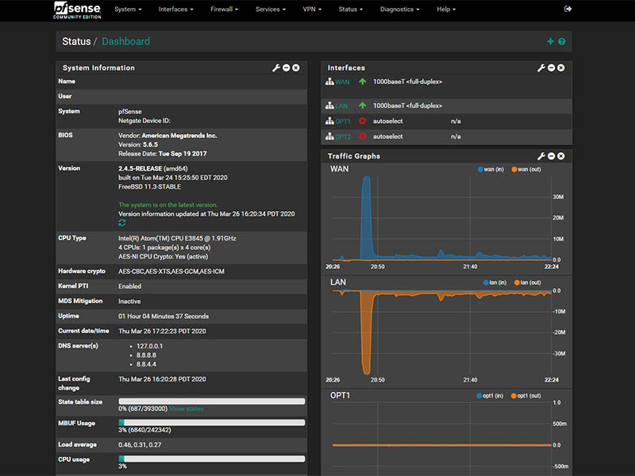
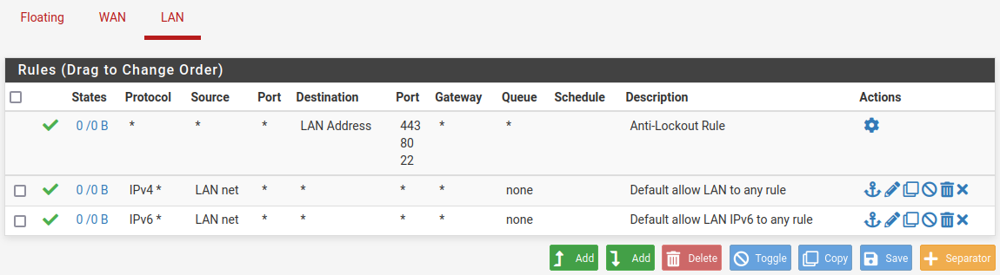
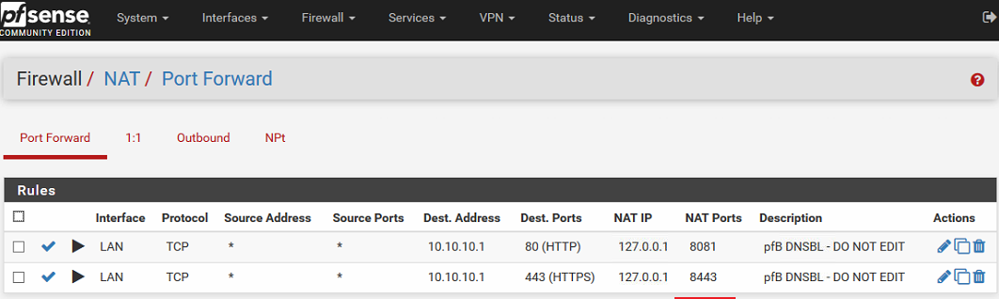
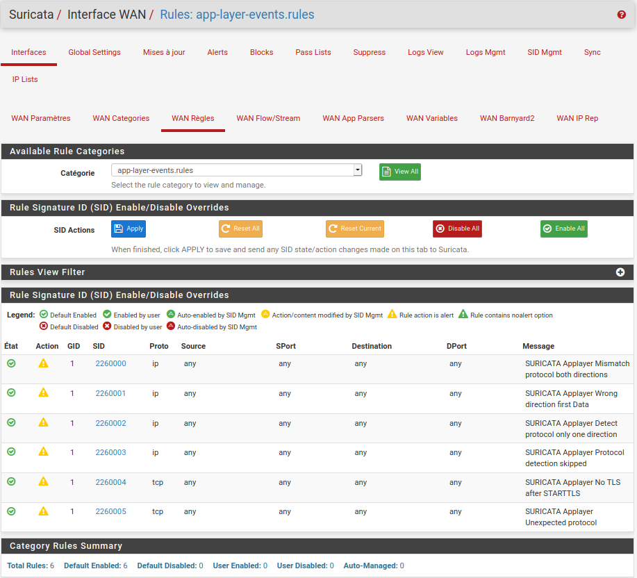

# Firewalls et IDS/IPS

## Objectifs du cours

Ce cours reunit deux elements essentiels de la defense reseau moderne : les firewalls et les systemes de detection/prevention d'intrusion (IDS/IPS). Vous apprendrez a utiliser pfSense, un firewall open-source extremement puissant, et a comprendre les fondations des solutions IDS/IPS comme Suricata et Snort.

Competences visees :
- Comprendre ce qu'est pfSense et comment le configurer pour le firewalling et le NAT
- Savoir configurer et lire les logs pfSense
- Distinguer les differences cles entre IDS et IPS
- Comprendre le fonctionnement de Suricata et Snort
- Deployer Suricata sur pfSense pour une protection reseau pratique

---

## Glossaire

### Termes fondamentaux

| Terme | Description |
|-------|-------------|
| **Firewall** | Dispositif filtrant le trafic reseau selon des regles definies |
| **IDS** | Intrusion Detection System - Detecte les intrusions et alerte |
| **IPS** | Intrusion Prevention System - Detecte et bloque les intrusions |
| **NAT** | Network Address Translation - Traduction d'adresses reseau |
| **Stateful** | Firewall maintenant l'etat des connexions |

### Termes pfSense

| Terme | Description |
|-------|-------------|
| **pfSense** | Distribution firewall/routeur open-source basee sur FreeBSD |
| **WAN** | Wide Area Network - Interface vers Internet |
| **LAN** | Local Area Network - Interface vers le reseau interne |
| **Floating Rules** | Regles s'appliquant a plusieurs interfaces |
| **Aliases** | Groupes d'IPs ou ports pour simplifier les regles |

### Types de NAT

| Type | Description |
|------|-------------|
| **Outbound NAT** | Traduit les IPs internes vers l'IP publique (sortant) |
| **Port Forwarding** | Redirige un port externe vers un service interne |
| **1:1 NAT** | Mappe une IP publique vers une IP privee |
| **NPt** | Network Prefix Translation (IPv6) |

### Termes IDS/IPS

| Terme | Description |
|-------|-------------|
| **Signature** | Pattern connu d'une attaque |
| **Rule** | Regle de detection definissant une signature |
| **Alert** | Notification d'une detection |
| **False Positive** | Alerte sur du trafic legitime |
| **False Negative** | Attaque non detectee |
| **Inline Mode** | Mode IPS ou le trafic passe par le capteur |
| **Passive Mode** | Mode IDS ou le capteur observe une copie du trafic |

### Outils IDS/IPS

| Outil | Description |
|-------|-------------|
| **Snort** | IDS/IPS open-source historique (Cisco/Sourcefire) |
| **Suricata** | IDS/IPS open-source moderne et multi-threade |
| **Emerging Threats** | Jeu de regles communautaire gratuit |
| **Snort VRT** | Regles officielles Snort (certaines payantes) |

### Actions firewall

| Action | Description |
|--------|-------------|
| **Pass** | Autorise le trafic |
| **Block** | Bloque silencieusement (drop) |
| **Reject** | Bloque et envoie une reponse (RST/ICMP unreachable) |

---

## Qu'est-ce que pfSense ?

pfSense est une distribution firewall et routeur open-source basee sur FreeBSD. Developpee et maintenue par Netgate, pfSense est une solution de securite reseau complete qui rivalise avec les firewalls commerciaux couteux tout en restant gratuite.



### Caracteristiques principales

| Fonctionnalite | Description |
|----------------|-------------|
| **Firewall Filtering** | Filtrage stateful du trafic |
| **NAT** | Toutes les formes de NAT |
| **VPN** | IPsec, OpenVPN, WireGuard |
| **DHCP/DNS** | Services reseau integres |
| **Logging** | Journalisation complete |
| **IDS/IPS** | Packages Suricata et Snort |
| **Traffic Shaping** | QoS et gestion de bande passante |
| **High Availability** | CARP pour la redondance |

### Cas d'usage

| Environnement | Usage |
|---------------|-------|
| **Home Lab** | Apprentissage, lab de securite |
| **PME** | Firewall principal |
| **Enterprise** | Firewall de branche, VPN |
| **MSP** | Solution multi-clients |

---

## Installation de pfSense

### Prerequis materiels

| Composant | Minimum | Recommande |
|-----------|---------|------------|
| **CPU** | 1 GHz | 2+ GHz, AES-NI |
| **RAM** | 1 GB | 4+ GB (pour IDS/IPS) |
| **Stockage** | 10 GB | SSD 32+ GB |
| **NICs** | 2 (WAN + LAN) | 3+ |

### Plateformes supportees

| Plateforme | Notes |
|------------|-------|
| **Appliance Netgate** | Support officiel |
| **VMware/ESXi** | Tres bien supporte |
| **Proxmox/KVM** | Excellent |
| **VirtualBox** | Pour les labs |
| **PC generique** | Avec 2+ NICs |

### Processus d'installation

```
1. Telecharger l'ISO pfSense depuis netgate.com
2. Creer une VM ou booter sur l'ISO
3. Suivre l'assistant d'installation
4. Configurer les interfaces WAN et LAN
5. Acceder a l'interface web : https://192.168.1.1
6. Credentials par defaut : admin / pfsense
```

### Configuration initiale

```
┌─────────────────────────────────────────────────────────────┐
│                    TOPOLOGIE BASIQUE                        │
│                                                              │
│   Internet                                                   │
│       │                                                      │
│       │ (IP publique ou DHCP)                               │
│       │                                                      │
│   ┌───┴───┐                                                 │
│   │  WAN  │ em0                                             │
│   ├───────┤                                                 │
│   │pfSense│                                                 │
│   ├───────┤                                                 │
│   │  LAN  │ em1                                             │
│   └───┬───┘                                                 │
│       │ 192.168.1.1/24                                      │
│       │                                                      │
│   ┌───┴───────────────────┐                                 │
│   │     Reseau LAN        │                                 │
│   │  192.168.1.0/24       │                                 │
│   │  ┌────┐  ┌────┐       │                                 │
│   │  │ PC │  │ SRV│       │                                 │
│   │  └────┘  └────┘       │                                 │
│   └───────────────────────┘                                 │
│                                                              │
└─────────────────────────────────────────────────────────────┘
```

---

## Regles Firewall pfSense

### Philosophie de filtrage pfSense

pfSense traite les regles de **haut en bas** (top-down). La premiere regle qui matche determine l'action. Si aucune regle ne matche, le trafic est **bloque par defaut** (implicit deny).

```
Paquet arrive sur l'interface
        │
        ▼
┌─────────────────┐
│   Regle 1       │─── Match? ─── Oui ──> Action (Pass/Block)
└────────┬────────┘
         │ Non
         ▼
┌─────────────────┐
│   Regle 2       │─── Match? ─── Oui ──> Action
└────────┬────────┘
         │ Non
         ▼
        ...
         │
         ▼
┌─────────────────┐
│  Default Deny   │──────────────────────> Block
└─────────────────┘
```

### Elements d'une regle



| Element | Description |
|---------|-------------|
| **Interface** | WAN, LAN, OPT1, etc. |
| **Action** | Pass, Block, Reject |
| **Protocol** | TCP, UDP, ICMP, any |
| **Source** | IP, reseau, alias, any |
| **Source Port** | Port source (optionnel) |
| **Destination** | IP, reseau, alias, any |
| **Destination Port** | Port destination |
| **Schedule** | Plage horaire (optionnel) |
| **Description** | Documentation obligatoire ! |

### Exemple : Autoriser HTTP depuis le LAN

| Parametre | Valeur |
|-----------|--------|
| Interface | LAN |
| Action | Pass |
| Protocol | TCP |
| Source | LAN net |
| Destination | any |
| Destination Port | 80 (HTTP) |
| Description | Allow HTTP to Internet |

### Regles par defaut

| Interface | Regle par defaut |
|-----------|------------------|
| **WAN** | Block all (securise) |
| **LAN** | Pass all (pratique mais a modifier) |

### Bonnes pratiques

```
[ ] Creer des Aliases pour grouper IPs et ports
[ ] Documenter chaque regle avec une description
[ ] Placer les regles specifiques avant les generales
[ ] Activer le logging sur les regles critiques
[ ] Reviser regulierement les regles
[ ] Utiliser les Floating Rules pour le QoS
```

### Exemple de regles LAN securisees

```
1. Pass - TCP - LAN net → any - Port 80,443 - "Web browsing"
2. Pass - TCP - LAN net → DNS_Servers - Port 53 - "DNS TCP"
3. Pass - UDP - LAN net → DNS_Servers - Port 53 - "DNS UDP"
4. Pass - TCP - Admin_PCs → any - Port 22 - "SSH for admins"
5. Block - any - any → any - Log - "Default deny with logging"
```

### Aliases

Les aliases simplifient la gestion des regles :

```
Alias: Web_Ports
  - 80
  - 443

Alias: Admin_Servers
  - 192.168.1.10
  - 192.168.1.11
  - 192.168.1.12

Alias: RFC1918
  - 10.0.0.0/8
  - 172.16.0.0/12
  - 192.168.0.0/16
```

---

## NAT avec pfSense

### Qu'est-ce que le NAT ?

Le Network Address Translation permet aux adresses IP privees de communiquer avec Internet en traduisant les IPs privees vers une adresse publique.



### Types de NAT dans pfSense

| Type | Description | Usage |
|------|-------------|-------|
| **Outbound NAT** | Traduit le trafic sortant | Acces Internet |
| **Port Forwarding** | Redirige ports vers l'interne | Serveurs publics |
| **1:1 NAT** | Mappe 1 IP publique ↔ 1 IP privee | DMZ |
| **NPt** | Traduction de prefixe IPv6 | IPv6 |

### Outbound NAT

```
┌────────────────────────────────────────────────────────────┐
│                    OUTBOUND NAT                             │
│                                                             │
│   LAN (192.168.1.0/24)                                     │
│       │                                                     │
│       │  Source: 192.168.1.50:54321                        │
│       │  Dest: 8.8.8.8:53                                  │
│       ▼                                                     │
│   ┌───────────┐                                            │
│   │  pfSense  │  NAT Translation                           │
│   │           │  192.168.1.50 → 203.0.113.10               │
│   └─────┬─────┘                                            │
│         │                                                   │
│         │  Source: 203.0.113.10:54321                      │
│         │  Dest: 8.8.8.8:53                                │
│         ▼                                                   │
│     Internet                                                │
│                                                             │
└────────────────────────────────────────────────────────────┘
```

**Modes Outbound NAT :**

| Mode | Description |
|------|-------------|
| **Automatic** | Par defaut, suffit pour la plupart des cas |
| **Hybrid** | Automatique + regles manuelles |
| **Manual** | Controle total (VPN, multi-WAN) |
| **Disable** | Desactive le NAT sortant |

### Port Forwarding

Redirige le trafic entrant vers un serveur interne.

**Exemple : Serveur Web interne**

| Parametre | Valeur |
|-----------|--------|
| Interface | WAN |
| Protocol | TCP |
| Destination | WAN Address |
| Destination Port | 443 |
| Redirect Target IP | 192.168.1.100 |
| Redirect Target Port | 443 |
| Description | HTTPS to Web Server |

```
┌────────────────────────────────────────────────────────────┐
│                    PORT FORWARDING                          │
│                                                             │
│     Internet                                                │
│         │                                                   │
│         │  Dest: 203.0.113.10:443                          │
│         ▼                                                   │
│   ┌───────────┐                                            │
│   │  pfSense  │  Port Forward                              │
│   │   WAN     │  203.0.113.10:443 → 192.168.1.100:443     │
│   └─────┬─────┘                                            │
│         │                                                   │
│         │  Dest: 192.168.1.100:443                         │
│         ▼                                                   │
│   ┌───────────┐                                            │
│   │Web Server │                                            │
│   │192.168.1. │                                            │
│   │   100     │                                            │
│   └───────────┘                                            │
│                                                             │
└────────────────────────────────────────────────────────────┘
```

**Important :** Le port forwarding cree automatiquement une regle firewall associee (sauf si desactive).

### 1:1 NAT

Mappe une IP publique complete vers une IP privee :

| IP Publique | IP Privee | Usage |
|-------------|-----------|-------|
| 203.0.113.20 | 192.168.1.100 | Web Server |
| 203.0.113.21 | 192.168.1.101 | Mail Server |

---

## Logging et Monitoring

### Types de logs pfSense

| Log | Description | Chemin GUI |
|-----|-------------|------------|
| **Firewall** | Paquets filtres | Status > System Logs > Firewall |
| **System** | Evenements OS | Status > System Logs > System |
| **DHCP** | Baux DHCP | Status > System Logs > DHCP |
| **VPN** | OpenVPN, IPsec | Status > System Logs > VPN |
| **Resolver** | DNS | Status > System Logs > Resolver |

### Activer le logging sur une regle

Dans la configuration de la regle :
- Cocher "Log packets that are handled by this rule"
- Les logs apparaitront dans Status > System Logs > Firewall

### Remote Logging (Syslog)

```
Status > System Logs > Settings

Remote Logging Options:
  [x] Enable Remote Logging
  Remote log servers: 192.168.1.200:514
  Remote Syslog Contents:
    [x] Firewall Events
    [x] System Events
```

### Outils de monitoring

| Outil | Description |
|-------|-------------|
| **pfTop** | Vue temps reel des connexions |
| **ntopng** | Analyse detaillee du trafic (package) |
| **Bandwidthd** | Graphiques de bande passante |
| **Darkstat** | Statistiques trafic |

### Dashboard Widgets

Le dashboard pfSense offre des widgets configurables :
- Traffic Graphs
- Firewall Logs
- Interface Statistics
- System Information
- Gateways Status

---

## Introduction aux IDS/IPS

### Qu'est-ce qu'un IDS ?

Un Intrusion Detection System (IDS) surveille l'activite reseau et genere des alertes lorsqu'il detecte un comportement suspect.

```
                    IDS (Mode Passif)
                           │
     Trafic ──────────────┬────────────────> Destination
                          │
                          ▼
                    ┌───────────┐
                    │    IDS    │
                    │  Analyse  │
                    │           │
                    └─────┬─────┘
                          │
                          ▼
                       Alerte !
                    (Pas de blocage)
```

C'est comme un garde de securite qui surveille les cameras - il vous previent si quelque chose d'etrange se passe, mais vous devez reagir manuellement.

### Qu'est-ce qu'un IPS ?

Un Intrusion Prevention System (IPS) va plus loin. Il bloque activement le trafic malveillant en temps reel.

```
                    IPS (Mode Inline)

     Trafic ─────────────────────────────> Destination
                    │
                    ▼
              ┌───────────┐
              │    IPS    │
              │  Analyse  │
              │ + Blocage │
              └─────┬─────┘
                    │
            ┌───────┴───────┐
            │               │
            ▼               ▼
         Legitime       Malveillant
            │               │
            │               ▼
            │           BLOQUE !
            │
            ▼
       Destination
```

C'est comme un garde qui non seulement voit l'intrus, mais verrouille la porte avant qu'il puisse entrer.

### IDS vs IPS

| Caracteristique | IDS | IPS |
|-----------------|-----|-----|
| **Action** | Alerte seulement | Alerte + blocage |
| **Placement** | Passif (mirror port) | Inline (dans le flux) |
| **Risque** | Faible (pas d'interference) | Plus eleve (peut bloquer du legitime) |
| **Impact performance** | Minimal | Potentiellement eleve |
| **Cas d'usage** | Monitoring, forensics | Protection automatisee |

### Types de detection

| Type | Description | Avantage | Inconvenient |
|------|-------------|----------|--------------|
| **Signature-based** | Detecte des patterns connus | Precis, peu de FP | Ne detecte pas le nouveau |
| **Anomaly-based** | Detecte les ecarts au comportement normal | Detecte l'inconnu | Plus de faux positifs |
| **Behavior-based** | Analyse le comportement | Flexible | Complexe a configurer |

---

## Snort et Suricata

### Snort

Developpe par Cisco (anciennement Sourcefire), Snort est l'un des IDS/IPS open-source les plus anciens et populaires.

| Aspect | Detail |
|--------|--------|
| **Developpeur** | Cisco/Sourcefire |
| **Langage** | C |
| **Threading** | Single-threaded |
| **Regles** | Snort VRT, Emerging Threats |
| **Format regles** | Snort rules format |

**Avantages Snort :**
- Mature et largement supporte
- Jeux de regles extensifs
- Haute precision de detection

**Inconvenients Snort :**
- Plus lent que Suricata en multi-thread
- Moins flexible avec les protocoles modernes

### Suricata

Suricata est une alternative moderne a Snort, developpee par l'Open Information Security Foundation (OISF).

| Aspect | Detail |
|--------|--------|
| **Developpeur** | OISF |
| **Langage** | C |
| **Threading** | Multi-threaded |
| **Regles** | Compatible Snort + extensions |
| **Extras** | HTTP logging, TLS inspection, file extraction |

**Avantages Suricata :**
- Plus rapide sur CPU multi-core
- Meilleur logging et detection de protocoles
- Plus facile a integrer avec les outils modernes
- Scripting Lua

**Inconvenients Suricata :**
- Courbe d'apprentissage legerement plus raide
- Moins mature dans certains domaines

### Comparaison

| Critere | Snort | Suricata |
|---------|-------|----------|
| **Performance multi-core** | Non | Oui |
| **Compatibilite regles** | Snort rules | Snort rules + extensions |
| **HTTP logging** | Basique | Avance |
| **TLS inspection** | Limite | Avance |
| **File extraction** | Non | Oui |
| **GPU acceleration** | Non | Oui (experimental) |

---

## Deployer Suricata sur pfSense

### Installation


```
1. Naviguer vers System > Package Manager > Available Packages
2. Rechercher "Suricata"
3. Cliquer sur Install
4. Attendre la fin de l'installation
```

### Configuration initiale



```
1. Aller dans Services > Suricata
2. Onglet "Global Settings" :
   - Enable Suricata VRT rules : selon licence
   - Enable Emerging Threats rules : Oui
   - Update Interval : 12 heures

3. Cliquer sur "Update" pour telecharger les regles
```

### Configurer une interface

```
1. Services > Suricata > Interfaces
2. Cliquer sur "Add"

Settings:
  - Interface : LAN (ou WAN selon le besoin)
  - Description : "LAN Suricata"

Alert Settings:
  - Send alerts to system log : Oui
  - Enable packet capture : Selon les besoins

Detection Engine Settings:
  - IPS Mode : Inline (Legacy Mode)
  - Block Offenders : Oui (active le mode IPS)
  - Kill States : Oui
```

### Activer les categories de regles

```
1. Services > Suricata > Interfaces > LAN Categories

Selectionner les categories pertinentes :
  [x] emerging-malware
  [x] emerging-trojan
  [x] emerging-scan
  [x] emerging-exploit
  [x] emerging-dos
  [x] emerging-web_client
  [x] emerging-web_server
```

### Monitoring Suricata

| Section | Description |
|---------|-------------|
| **Alerts** | Regles declenchees avec source/destination |
| **Blocks** | IPs bloquees par le mode IPS |
| **Files** | Fichiers extraits (si active) |
| **Logs** | Logs detailles du trafic |
| **SID Mgmt** | Gestion des regles individuelles |

---

## Tuning et optimisation

### Probleme des faux positifs

Les IDS/IPS sont notoirement generateurs de faux positifs. Voici comment garder votre sante mentale :

### Strategie de deploiement

```
Phase 1 : Mode IDS (Alert Only)
  - Deployer en mode detection uniquement
  - Observer les alertes pendant 1-2 semaines
  - Identifier les faux positifs

Phase 2 : Tuning
  - Desactiver les regles trop bruyantes
  - Whitelister les IPs/services de confiance
  - Ajuster les seuils

Phase 3 : Mode IPS
  - Activer le blocage progressivement
  - Commencer par les categories critiques
  - Monitorer les impacts
```

### Gestion des SIDs

| Action | Description |
|--------|-------------|
| **Disable SID** | Desactive completement la regle |
| **Suppress** | Supprime les alertes pour certaines IPs |
| **Threshold** | Limite le nombre d'alertes |

**Exemple Suppress :**
```
# Supprimer les alertes pour l'IP du scanner interne
suppress gen_id 1, sig_id 2000001, track by_src, ip 192.168.1.50
```

### Whitelisting

```
Services > Suricata > Pass Lists

Ajouter les IPs de confiance :
  - Serveurs de monitoring
  - Scanners de vulnerabilites autorises
  - Services cloud connus
```

### Performance

| Optimisation | Description |
|--------------|-------------|
| **Limiter les categories** | N'activer que le necessaire |
| **Utiliser le hardware adapte** | CPU multi-core, AES-NI |
| **Ajuster le runmode** | workers vs autofp |
| **Monitorer la charge** | CPU, memoire, drops |

---

## Cas d'usage reels

### Cas 1 : Bloquer les scans de ports

Suricata detecte les scans Nmap ou masscan et bloque l'IP en temps reel.

**Regles a activer :**
- `emerging-scan`
- `ET SCAN`
- `SCAN_SSH`

### Cas 2 : Detecter les telechargements de malware

Si un utilisateur clique sur un lien malveillant, Suricata peut analyser la requete HTTP et bloquer les telechargements depuis des domaines connus malveillants.

**Regles a activer :**
- `emerging-malware`
- `emerging-trojan`
- `emerging-current_events`

### Cas 3 : Prevenir le DNS Tunneling

Suricata peut inspecter le trafic DNS pour detecter des signes de tunneling (utilise par les attaquants pour contourner les firewalls).

**Regles a activer :**
- `emerging-dns`
- Activer le logging DNS detaille

### Cas 4 : Detecter les exploits web

Protection des serveurs web internes contre les attaques :

**Regles a activer :**
- `emerging-web_server`
- `emerging-sql`
- `emerging-web_specific_apps`

---

## Bonnes pratiques pfSense + IDS/IPS

### Architecture recommandee

```
┌─────────────────────────────────────────────────────────────┐
│                                                              │
│     Internet                                                 │
│         │                                                    │
│         ▼                                                    │
│   ┌───────────┐                                             │
│   │  pfSense  │                                             │
│   │    WAN    │ ← Suricata IDS (monitor)                    │
│   ├───────────┤                                             │
│   │    LAN    │ ← Suricata IPS (protect)                    │
│   ├───────────┤                                             │
│   │    DMZ    │ ← Suricata IPS (protect servers)            │
│   └───────────┘                                             │
│                                                              │
└─────────────────────────────────────────────────────────────┘
```

### Checklist bonnes pratiques

```
[ ] Utiliser l'acceleration materielle (AES-NI) si disponible
[ ] Placer Suricata sur l'interface LAN pour proteger les utilisateurs
[ ] Sur les reseaux haut debit, utiliser du hardware dedie
[ ] Mettre a jour les regles hebdomadairement (ou quotidiennement)
[ ] Integrer pfSense avec syslog, Grafana ou ELK stack
[ ] Limiter le scope du blocage IPS pour eviter les disruptions
[ ] Tester les changements en mode IDS avant IPS
[ ] Documenter les suppressions et whitelists
[ ] Effectuer des revues regulieres des alertes
[ ] Planifier la capacite selon le debit
```

### Integration SIEM

```
pfSense ──> Syslog ──> ELK Stack / Splunk / Graylog
                           │
                           ▼
                    ┌──────────────┐
                    │  Dashboards  │
                    │  Alerting    │
                    │  Correlation │
                    └──────────────┘
```

### Sizing hardware

| Debit | CPU | RAM | Notes |
|-------|-----|-----|-------|
| < 100 Mbps | 2 cores | 4 GB | VM possible |
| 100-500 Mbps | 4 cores | 8 GB | Hardware recommande |
| 500 Mbps - 1 Gbps | 8 cores | 16 GB | Hardware dedie |
| > 1 Gbps | 16+ cores | 32+ GB | Appliance specialisee |

---

## Depannage

### Problemes courants

| Probleme | Cause probable | Solution |
|----------|----------------|----------|
| Alertes non generees | Regles non activees | Verifier les categories |
| Trop d'alertes | Regles trop sensibles | Tuning, suppression |
| Trafic legitime bloque | Faux positifs | Whitelisting, desactiver SID |
| Performance degradee | Trop de regles | Reduire les categories |
| Drops de paquets | Hardware insuffisant | Upgrader ou reduire le scope |

### Commandes de diagnostic

```bash
# Verifier le statut Suricata
pfSsh.php playback svc status suricata

# Voir les logs Suricata
cat /var/log/suricata/suricata.log

# Statistiques en temps reel
suricatasc -c "iface-stat em0"

# Liste des regles chargees
suricatasc -c "ruleset-stats"
```

### Logs importants

| Fichier | Contenu |
|---------|---------|
| `/var/log/suricata/suricata.log` | Logs systeme Suricata |
| `/var/log/suricata/fast.log` | Alertes format court |
| `/var/log/suricata/eve.json` | Logs JSON (tous les evenements) |
| `/var/log/suricata/stats.log` | Statistiques performance |

---

## Ressources

| Ressource | Description |
|-----------|-------------|
| [pfSense Documentation](https://docs.netgate.com/pfsense/en/latest/) | Documentation officielle pfSense |
| [Suricata Documentation](https://suricata.readthedocs.io/) | Documentation officielle Suricata |
| [Snort Documentation](https://www.snort.org/documents) | Documentation Snort |
| [Emerging Threats](https://rules.emergingthreats.net/) | Regles gratuites |
| [pfSense Suricata Setup](https://docs.netgate.com/pfsense/en/latest/packages/suricata/index.html) | Guide installation Suricata pfSense |

---

## Labs TryHackMe

| Room | Description | Lien |
|------|-------------|------|
| **Intro to IDS/IPS** | Introduction aux concepts | https://tryhackme.com/room/introtoids |
| **Snort** | Hands-on Snort | https://tryhackme.com/room/snort |
| **Snort Challenge** | Pratique avancee Snort | https://tryhackme.com/room/snortchallenges1 |
| **Suricata** | Hands-on Suricata | https://tryhackme.com/room/introtoids |
| **Network Security** | Vue d'ensemble securite reseau | https://tryhackme.com/room/networksecuritypart1 |

> **Note** : pfSense peut etre deploye facilement dans GNS3, VirtualBox ou VMware pour les labs. L'image ISO est disponible gratuitement sur netgate.com. Pour les tests IDS/IPS, generez du trafic malveillant avec des outils comme Nmap, Metasploit (dans un environnement controle) pour voir Suricata en action.
