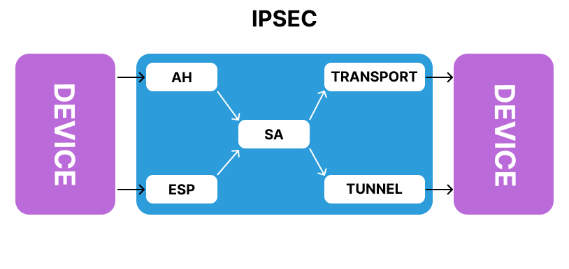
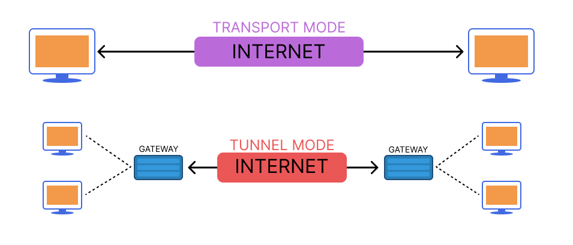
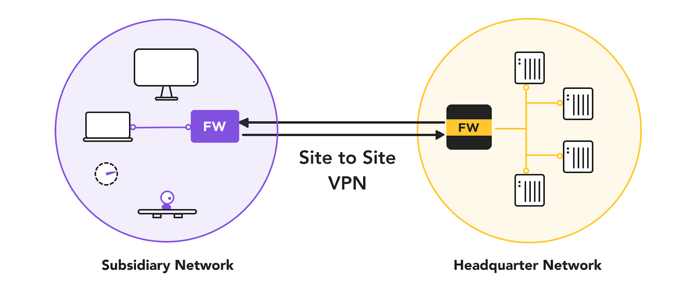
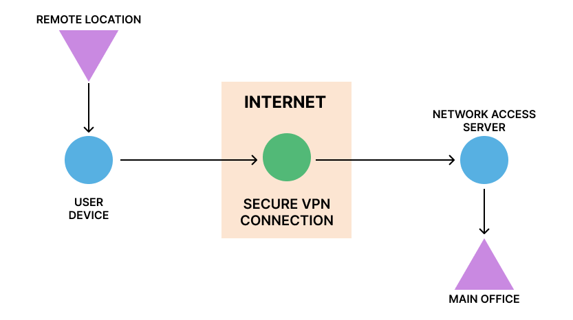
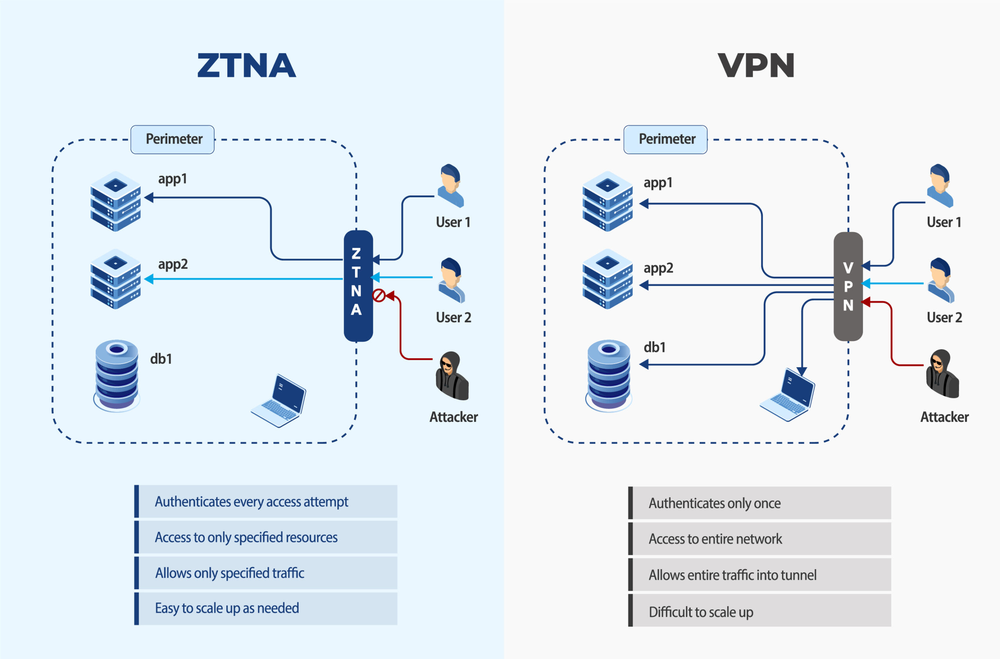

# VPN : IPSec, WireGuard et ZTNA

## Objectifs du cours

Ce cours explore l'un des outils les plus puissants et essentiels de la sécurité réseau : les Virtual Private Networks (VPNs). Des tunnels IPSec classiques a la simplicite ultra-rapide de WireGuard, jusqu'au concept revolutionnaire du Zero Trust Network Access (ZTNA), ce module vous preparera a comprendre, configurer et architecturer des communications securisees a travers les réseaux.

Competences visees :
- Comprendre les principes fondamentaux d'IPSec, incluant le chiffrement et l'authentification
- Deployer WireGuard, le protocole VPN moderne et leger
- Differencier les VPNs Site-to-Site et les VPNs d'acces distant
- Comprendre et evaluer le modèle de sécurité Zero Trust, incluant le fonctionnement pratique de ZTNA

---

## Glossaire

### Concepts fondamentaux VPN

| Terme | Description |
|-------|-------------|
| **VPN** | Virtual Private Network - Tunnel securise entre deux points |
| **Tunnel** | Connexion chiffree entre deux endpoints |
| **Encryption** | Chiffrement des donnees pour la confidentialite |
| **Authentication** | Verification de l'identite des participants |
| **Integrity** | Garantie que les donnees n'ont pas ete modifiees |

### Termes IPSec

| Terme | Description |
|-------|-------------|
| **IPSec** | Internet Protocol Security - Suite de protocoles pour securiser IP |
| **IKE** | Internet Key Exchange - Protocole de negociation des cles |
| **IKEv1** | Premiere version d'IKE |
| **IKEv2** | Version amelioree d'IKE (plus securisee et performante) |
| **SA** | Security Association - Parametres de la session IPSec |
| **ESP** | Encapsulating Security Payload - Chiffrement + authentification |
| **AH** | Authentication Header - Authentification sans chiffrement |
| **PSK** | Pre-Shared Key - Cle partagee a l'avance |

### Modes IPSec

| Mode | Description |
|------|-------------|
| **Tunnel Mode** | Chiffre le paquet IP entier (utilise pour les VPNs) |
| **Transport Mode** | Chiffre uniquement la payload (host-to-host) |

### Termes WireGuard

| Terme | Description |
|-------|-------------|
| **WireGuard** | Protocole VPN moderne, leger et rapide |
| **Peer** | Un participant dans le tunnel WireGuard |
| **AllowedIPs** | IPs autorisees a transiter par le tunnel |
| **Endpoint** | Adresse IP et port du peer distant |
| **ChaCha20** | Algorithme de chiffrement utilise par WireGuard |
| **Curve25519** | Algorithme d'echange de cles utilise par WireGuard |

### Types de VPN

| Type | Description |
|------|-------------|
| **Site-to-Site** | Connexion entre deux réseaux (ex: siege et filiale) |
| **Remote Access** | Connexion d'un utilisateur vers un réseau |
| **Hub-and-Spoke** | Architecture avec un point central et des branches |
| **Full Mesh** | Tous les sites connectes entre eux |

### Termes Zero Trust

| Terme | Description |
|-------|-------------|
| **ZTNA** | Zero Trust Network Access - Acces réseau sans confiance implicite |
| **Zero Trust** | Modele "Never trust, always verify" |
| **Microsegmentation** | Division du réseau en zones isolées |
| **Identity-based** | Acces base sur l'identite, pas l'emplacement |
| **Device Posture** | Etat de sécurité de l'appareil |
| **Least Privilege** | Acces minimal nécessaire |

---

## Comprendre les VPNs : Les bases

Un VPN (Virtual Private Network) est un tunnel securise entre deux ou plusieurs appareils a travers des réseaux non fiables comme Internet. Les VPNs utilisent le chiffrement et l'authentification pour garantir que seules les parties autorisees peuvent communiquer, et que personne ne peut espionner leurs conversations.

### Objectifs d'un VPN

| Objectif | Description |
|----------|-------------|
| **Confidentialite** | Le chiffrement garantit que les donnees ne peuvent pas etre lues |
| **Integrite** | Les paquets ne peuvent pas etre modifies sans detection |
| **Authentification** | Les parties verifient leurs identites mutuelles |

### Cas d'usage

| Usage | Description |
|-------|-------------|
| **Vie privee** | Proteger la navigation des utilisateurs |
| **Securite entreprise** | Securiser l'acces aux ressources internes |
| **Geo-restriction** | Contourner les restrictions geographiques |
| **Connexion sites** | Relier des sites distants |

```
┌─────────────────────────────────────────────────────────────┐
│                    PRINCIPE DU VPN                          │
│                                                              │
│   Site A                                           Site B    │
│   ┌────────┐                                    ┌────────┐  │
│   │ Reseau │                                    │ Reseau │  │
│   │ Prive  │                                    │ Prive  │  │
│   └────┬───┘                                    └───┬────┘  │
│        │                                            │       │
│        ▼                                            ▼       │
│   ┌────────┐        TUNNEL CHIFFRE          ┌────────┐     │
│   │Routeur │ ════════════════════════════════│Routeur │     │
│   │  VPN   │        (Internet)               │  VPN   │     │
│   └────────┘                                 └────────┘     │
│                                                              │
│   Les donnees transitent chiffrees sur Internet             │
│   Invisible pour les tiers                                   │
│                                                              │
└─────────────────────────────────────────────────────────────┘
```

---

## IPSec VPN : Le classique robuste

### Qu'est-ce qu'IPSec ?



IPSec (Internet Protocol Security) est une suite de protocoles pour securiser les communications IP en authentifiant et chiffrant chaque paquet IP. Il opere a la couche 3 du modèle OSI et est utilise pour construire des tunnels VPN.

### Modes IPSec



| Mode | Description | Usage |
|------|-------------|-------|
| **Tunnel Mode** | Chiffre le paquet IP complet | VPNs Site-to-Site |
| **Transport Mode** | Chiffre uniquement la payload | Host-to-Host |

**Tunnel Mode :**
```
┌────────────────────────────────────────────────────────────┐
│  Paquet original :                                         │
│  ┌──────────┬──────────────────────────────────┐           │
│  │ IP Header│         Payload                  │           │
│  └──────────┴──────────────────────────────────┘           │
│                                                             │
│  Apres chiffrement (Tunnel Mode) :                         │
│  ┌───────────┬──────────┬───────────────────────────────┐  │
│  │New IP Hdr │ ESP Hdr  │  Encrypted (IP Hdr + Payload) │  │
│  └───────────┴──────────┴───────────────────────────────┘  │
│                                                             │
│  Le paquet original est ENTIEREMENT chiffre                │
└────────────────────────────────────────────────────────────┘
```

**Transport Mode :**
```
┌────────────────────────────────────────────────────────────┐
│  Paquet original :                                         │
│  ┌──────────┬──────────────────────────────────┐           │
│  │ IP Header│         Payload                  │           │
│  └──────────┴──────────────────────────────────┘           │
│                                                             │
│  Apres chiffrement (Transport Mode) :                      │
│  ┌──────────┬──────────┬───────────────────────┐           │
│  │ IP Header│ ESP Hdr  │  Encrypted Payload    │           │
│  └──────────┴──────────┴───────────────────────┘           │
│                                                             │
│  Seule la payload est chiffree                             │
└────────────────────────────────────────────────────────────┘
```

### Composants IPSec

#### 1. Authentication Header (AH)

| Caracteristique | Description |
|-----------------|-------------|
| **Integrite** | Oui |
| **Authentification** | Oui |
| **Chiffrement** | Non |
| **Usage** | Verification d'integrite sans confidentialite |

#### 2. Encapsulating Security Payload (ESP)

| Caracteristique | Description |
|-----------------|-------------|
| **Integrite** | Oui |
| **Authentification** | Oui |
| **Chiffrement** | Oui |
| **Usage** | Le plus utilise - sécurité complete |

#### 3. Internet Key Exchange (IKE)

| Version | Description |
|---------|-------------|
| **IKEv1** | Version originale, plus complexe |
| **IKEv2** | Amelioree : plus securisee, performante, mobile |

IKE negocie les paramètres de sécurité et echange les cles.

#### 4. Security Associations (SAs)

Une SA definit les paramètres de la session IPSec :
- Algorithmes de chiffrement
- Cles
- Durees de vie

Chaque direction de communication utilise une SA separee.

### Algorithmes IPSec

| Type | Options | Recommandation |
|------|---------|----------------|
| **Chiffrement** | AES-128, AES-256, 3DES | AES-256 |
| **Hachage** | SHA-1, SHA-256, SHA-384 | SHA-256+ |
| **Echange de cles** | DH Group 14, 19, 20, 21 | DH 19+ (ECDH) |

**Exemple de configuration :**
- Chiffrement : AES-256
- Hachage : SHA-256
- Echange de cles : DH Group 19 (256-bit ECDH)

### Phases IPSec

```
┌─────────────────────────────────────────────────────────────┐
│                    ETABLISSEMENT IPSEC                       │
│                                                              │
│   Phase 1 (IKE SA)                                          │
│   ┌──────────────────────────────────────────────────────┐  │
│   │  1. Negociation des paramètres de sécurité            │  │
│   │  2. Echange Diffie-Hellman (cle partagee)            │  │
│   │  3. Authentification mutuelle (PSK ou certificats)   │  │
│   │  4. Creation de l'IKE SA (tunnel de contrôle)        │  │
│   └──────────────────────────────────────────────────────┘  │
│                           │                                  │
│                           ▼                                  │
│   Phase 2 (IPSec SA)                                        │
│   ┌──────────────────────────────────────────────────────┐  │
│   │  1. Negociation des paramètres ESP                    │  │
│   │  2. Echange de cles de session                       │  │
│   │  3. Creation des IPSec SAs (tunnel de donnees)       │  │
│   │  4. Trafic utilisateur chiffre                       │  │
│   └──────────────────────────────────────────────────────┘  │
│                                                              │
└─────────────────────────────────────────────────────────────┘
```

### Configuration IPSec sur Cisco

```cisco
! Configuration Phase 1 (ISAKMP)
crypto isakmp policy 10
 encryption aes 256
 hash sha256
 authentication pre-share
 group 19
 lifetime 86400

! Pre-Shared Key
crypto isakmp key SecretKey123! address 203.0.113.20

! Configuration Phase 2 (Transform Set)
crypto ipsec transform-set MYSET esp-aes 256 esp-sha256-hmac
 mode tunnel

! Access-list pour le trafic a chiffrer
access-list 100 permit ip 192.168.1.0 0.0.0.255 192.168.2.0 0.0.0.255

! Crypto Map
crypto map MYMAP 10 ipsec-isakmp
 set peer 203.0.113.20
 set transform-set MYSET
 match address 100

! Application sur l'interface
interface GigabitEthernet0/0
 crypto map MYMAP
```

### Configuration IPSec sur pfSense

```
1. VPN > IPsec > Tunnels > Add P1

Phase 1 Settings:
  - Key Exchange version: IKEv2
  - Remote Gateway: 203.0.113.20
  - Authentication Method: Mutual PSK
  - Pre-Shared Key: SecretKey123!
  - Encryption Algorithm: AES 256
  - Hash Algorithm: SHA256
  - DH Group: 19

2. Add Phase 2

Phase 2 Settings:
  - Local Network: 192.168.1.0/24
  - Remote Network: 192.168.2.0/24
  - Encryption Algorithms: AES 256
  - Hash Algorithms: SHA256
  - PFS Key Group: 19
```

---

## WireGuard VPN : Moderne et minimaliste


WireGuard est un protocole VPN de pointe concu pour etre rapide, simple et securise. Il est integre au kernel Linux et disponible pour Windows, macOS, iOS, Android et les systèmes BSD (comme pfSense).

### Caracteristiques cles

| Caracteristique | Description |
|-----------------|-------------|
| **Code leger** | ~4,000 lignes (vs ~100,000 pour OpenVPN) |
| **Performance** | Plus rapide qu'IPSec et OpenVPN |
| **Cryptographie moderne** | Algorithmes state-of-the-art uniquement |
| **Architecture** | Peer-to-peer |
| **Transport** | UDP, port unique (51820 par defaut) |
| **Configuration** | Extremement simple |

### Cryptographie WireGuard

| Composant | Algorithme |
|-----------|------------|
| **Chiffrement** | ChaCha20 |
| **Echange de cles** | Curve25519 |
| **Authentification** | Poly1305 |
| **Hachage** | BLAKE2s |

### Comparaison des protocoles VPN

| Critere | IPSec | OpenVPN | WireGuard |
|---------|-------|---------|-----------|
| **Lignes de code** | ~400,000 | ~100,000 | ~4,000 |
| **Performance** | Moyenne | Basse | Excellente |
| **Latence** | Moyenne | Haute | Tres basse |
| **Complexite config** | Haute | Moyenne | Tres basse |
| **Audit** | Difficile | Difficile | Facile |
| **Kernel integration** | Partielle | Non | Oui (Linux) |

### Configuration WireGuard

#### Etape 1 : Generer les cles

```bash
# Sur chaque peer
wg genkey | tee privatekey | wg pubkey > publickey

# Afficher les cles
cat privatekey
cat publickey
```

#### Etape 2 : Configurer les interfaces

**Peer A (Serveur) - /etc/wireguard/wg0.conf :**
```ini
[Interface]
PrivateKey = <A_private_key>
Address = 10.0.0.1/24
ListenPort = 51820

[Peer]
PublicKey = <B_public_key>
AllowedIPs = 10.0.0.2/32
# Endpoint non nécessaire si B se connecte a A
```

**Peer B (Client) - /etc/wireguard/wg0.conf :**
```ini
[Interface]
PrivateKey = <B_private_key>
Address = 10.0.0.2/24

[Peer]
PublicKey = <A_public_key>
AllowedIPs = 10.0.0.0/24, 192.168.1.0/24
Endpoint = A_IP:51820
PersistentKeepalive = 25
```

#### Etape 3 : Demarrer le tunnel

```bash
# Activer l'interface
wg-quick up wg0

# Verifier le statut
wg show

# Tester la connectivite
ping 10.0.0.1

# Desactiver
wg-quick down wg0

# Activer au demarrage
systemctl enable wg-quick@wg0
```

### Configuration WireGuard sur pfSense

```
1. VPN > WireGuard > Settings
   [x] Enable WireGuard

2. VPN > WireGuard > Tunnels > Add Tunnel
   - Description: WG-Tunnel
   - Listen Port: 51820
   - Interface Keys: Generate
   - Interface Addresses: 10.0.0.1/24

3. VPN > WireGuard > Peers > Add Peer
   - Tunnel: WG-Tunnel
   - Description: Remote-Peer
   - Public Key: <peer_public_key>
   - Allowed IPs: 10.0.0.2/32
   - Endpoint: <peer_ip>:51820

4. Interfaces > Assignments
   - Assigner l'interface WireGuard
   - Configurer les regles firewall
```

---

## Site-to-Site VPN vs Remote Access VPN

Les VPNs se declinent en deux styles architecturaux, chacun adapte a des cas d'usage differents.

### Site-to-Site VPN



Connecte deux ou plusieurs réseaux entre eux de maniere permanente.

| Caracteristique | Description |
|-----------------|-------------|
| **Endpoints** | Reseau vers réseau |
| **Usage** | Bureaux distants, datacenters |
| **Transparence** | Invisible pour les utilisateurs |
| **Protocoles** | IPSec, WireGuard |
| **Connexion** | Permanente |

```
┌─────────────────────────────────────────────────────────────┐
│                    SITE-TO-SITE VPN                         │
│                                                              │
│   Siege (Paris)                        Filiale (Lyon)       │
│   192.168.1.0/24                       192.168.2.0/24       │
│                                                              │
│   ┌────────────┐                       ┌────────────┐       │
│   │    LAN     │                       │    LAN     │       │
│   │  ┌────┐    │                       │    ┌────┐  │       │
│   │  │ PC │    │                       │    │ PC │  │       │
│   │  └────┘    │                       │    └────┘  │       │
│   └─────┬──────┘                       └──────┬─────┘       │
│         │                                     │             │
│   ┌─────┴─────┐        TUNNEL          ┌─────┴─────┐       │
│   │  Routeur  │ ══════════════════════ │  Routeur  │       │
│   │   VPN     │       IPSec            │   VPN     │       │
│   └───────────┘                        └───────────┘       │
│                                                              │
│   Les deux LANs communiquent comme s'ils etaient locaux    │
│                                                              │
└─────────────────────────────────────────────────────────────┘
```

### Remote Access VPN



Connecte des utilisateurs individuels a un réseau central.

| Caracteristique | Description |
|-----------------|-------------|
| **Endpoints** | Appareil vers réseau |
| **Usage** | Teletravail, deplacement |
| **Client** | Logiciel VPN requis |
| **Protocoles** | OpenVPN, WireGuard, L2TP/IPSec |
| **Connexion** | A la demande |

```
┌─────────────────────────────────────────────────────────────┐
│                   REMOTE ACCESS VPN                         │
│                                                              │
│                      ┌────────────────────────┐             │
│                      │   Reseau Entreprise    │             │
│                      │    192.168.1.0/24      │             │
│                      │  ┌────┐  ┌────┐ ┌────┐ │             │
│                      │  │App │  │ DB │ │File│ │             │
│                      │  └────┘  └────┘ └────┘ │             │
│                      └───────────┬────────────┘             │
│                                  │                          │
│                           ┌──────┴──────┐                   │
│                           │ VPN Gateway │                   │
│                           └──────┬──────┘                   │
│                                  │                          │
│              ┌───────────────────┼───────────────────┐      │
│              │                   │                   │      │
│      ┌───────┴───────┐   ┌───────┴───────┐   ┌───────┴───┐ │
│      │   Tunnel      │   │   Tunnel      │   │   Tunnel  │ │
│      │   Chiffre     │   │   Chiffre     │   │   Chiffre │ │
│      └───────┬───────┘   └───────┬───────┘   └───────┬───┘ │
│              │                   │                   │      │
│         ┌────┴────┐         ┌────┴────┐         ┌────┴────┐│
│         │ Laptop  │         │ Mobile  │         │ Maison  ││
│         │ (Hotel) │         │(Voyage) │         │(Teletrav││
│         └─────────┘         └─────────┘         └─────────┘│
│                                                              │
└─────────────────────────────────────────────────────────────┘
```

### Comparaison

| Critere | Site-to-Site | Remote Access |
|---------|--------------|---------------|
| **Endpoint** | Reseau vers réseau | Appareil vers réseau |
| **Cas d'usage** | Bureaux distants | Teletravailleurs |
| **Authentification** | PSK ou certificats | Username/password ou cles |
| **Client logiciel** | Non | Oui |
| **Connexion** | Permanente | A la demande |
| **Protocoles courants** | IPSec, WireGuard | OpenVPN, WireGuard, L2TP |

---

## Zero Trust Network Access (ZTNA)



ZTNA n'est pas un protocole VPN - c'est une architecture de sécurité. Alors que les VPNs supposent un "interieur de confiance" vs "exterieur non fiable", ZTNA n'assume aucune confiance - jamais.

### Principe fondamental

> **"Never trust, always verify"** - Ne jamais faire confiance, toujours verifier

### Concepts cles

| Concept | Description |
|---------|-------------|
| **Microsegmentation** | Diviser le réseau en zones isolées |
| **Identity-based access** | Acces base sur l'identite, pas l'emplacement |
| **Decisions contextuelles** | Considerer temps, sante de l'appareil, localisation |
| **Least privilege** | Utilisateurs n'obtiennent que l'acces nécessaire |
| **Pas de confiance implicite** | Chaque connexion est verifiee en continu |

### Workflow ZTNA

```
┌─────────────────────────────────────────────────────────────┐
│                      WORKFLOW ZTNA                          │
│                                                              │
│   1. L'utilisateur demande l'acces a une application        │
│      ┌─────────┐                                            │
│      │  User   │ ──────────────────────┐                    │
│      └─────────┘                       │                    │
│                                        ▼                    │
│   2. Le ZTNA Broker authentifie l'identite                 │
│      ┌─────────────────────────────────────────┐           │
│      │          ZTNA Broker / IdP              │           │
│      │  - Verification identite (MFA)          │           │
│      │  - Verification appareil (posture)      │           │
│      │  - Verification contexte (lieu, heure)  │           │
│      └─────────────────────┬───────────────────┘           │
│                            │                                │
│   3. Evaluation des politiques                             │
│                            │                                │
│                     ┌──────┴──────┐                        │
│                     │   Policies  │                        │
│                     │  - User: OK │                        │
│                     │  - Device:OK│                        │
│                     │  - Context:?│                        │
│                     └──────┬──────┘                        │
│                            │                                │
│              ┌─────────────┴─────────────┐                 │
│              │                           │                 │
│              ▼                           ▼                 │
│         APPROUVE                      REFUSE               │
│              │                           │                 │
│              ▼                           ▼                 │
│   4. Tunnel vers l'app spécifique    Acces refuse          │
│      ┌───────────┐                                         │
│      │    App    │                                         │
│      │ (pas tout │                                         │
│      │ le réseau)│                                         │
│      └───────────┘                                         │
│                                                              │
└─────────────────────────────────────────────────────────────┘
```

### VPN vs ZTNA

| Critere | VPN Traditionnel | ZTNA |
|---------|------------------|------|
| **Modele d'acces** | Niveau réseau | Niveau application |
| **Modele de confiance** | Implicite apres login | Verification continue |
| **Visibilite** | Faible (acces complet) | Haute (audit par requete) |
| **Experience utilisateur** | Login manuel | Transparent, base sur politiques |
| **Scalabilite** | Moderee | Haute (cloud-native) |
| **Surface d'attaque** | Large (tout le réseau) | Reduite (app par app) |

### Comparaison visuelle

```
┌─────────────────────────────────────────────────────────────┐
│                                                              │
│   VPN TRADITIONNEL                                          │
│   ┌──────────────────────────────────────────────────────┐  │
│   │              RESEAU ENTREPRISE                        │  │
│   │   ┌────┐  ┌────┐  ┌────┐  ┌────┐  ┌────┐  ┌────┐    │  │
│   │   │App1│  │App2│  │ DB │  │File│  │ DC │  │App3│    │  │
│   │   └────┘  └────┘  └────┘  └────┘  └────┘  └────┘    │  │
│   │        ↑    ↑       ↑       ↑       ↑       ↑        │  │
│   │        └────┴───────┴───────┴───────┴───────┘        │  │
│   │                     ACCES TOTAL                       │  │
│   └──────────────────────────────────────────────────────┘  │
│                            ↑                                 │
│                      ┌─────┴─────┐                          │
│                      │    VPN    │                          │
│                      │   Tunnel  │                          │
│                      └─────┬─────┘                          │
│                            │                                 │
│                       ┌────┴────┐                           │
│                       │  User   │                           │
│                       └─────────┘                           │
│                                                              │
│   Probleme : L'utilisateur a acces a TOUT                   │
│                                                              │
│   ─────────────────────────────────────────────────────────│
│                                                              │
│   ZTNA                                                      │
│   ┌──────────────────────────────────────────────────────┐  │
│   │              RESEAU ENTREPRISE                        │  │
│   │   ┌────┐  ┌────┐  ┌────┐  ┌────┐  ┌────┐  ┌────┐    │  │
│   │   │App1│  │App2│  │ DB │  │File│  │ DC │  │App3│    │  │
│   │   └──┬─┘  └────┘  └────┘  └────┘  └────┘  └────┘    │  │
│   │      │                                                │  │
│   │      │    Seule App1 est accessible                  │  │
│   │      │                                                │  │
│   └──────┼───────────────────────────────────────────────┘  │
│          │                                                   │
│    ┌─────┴─────┐                                            │
│    │   ZTNA    │                                            │
│    │  Broker   │                                            │
│    └─────┬─────┘                                            │
│          │                                                   │
│     ┌────┴────┐                                             │
│     │  User   │                                             │
│     └─────────┘                                             │
│                                                              │
│   Avantage : Acces granulaire, application par application  │
│                                                              │
└─────────────────────────────────────────────────────────────┘
```

### Fournisseurs ZTNA

| Fournisseur | Solution |
|-------------|----------|
| **Zscaler** | Zscaler Private Access |
| **Cloudflare** | Cloudflare Zero Trust |
| **Cisco** | Duo / Secure Access |
| **Google** | BeyondCorp Enterprise |
| **Microsoft** | Azure AD / Entra |
| **Palo Alto** | Prisma Access |

### Quand utiliser ZTNA ?

| Scenario | ZTNA recommande |
|----------|-----------------|
| **Travail hybride** | Oui |
| **BYOD** | Oui |
| **Cloud-native** | Oui |
| **Applications SaaS** | Oui |
| **Compliance stricte** | Oui |
| **Legacy on-prem simple** | VPN peut suffire |

---

## Quand utiliser quoi ?

### Guide de decision

```
┌─────────────────────────────────────────────────────────────┐
│                   GUIDE DE DECISION VPN                     │
│                                                              │
│  Besoin de connecter deux sites ?                           │
│     └── Oui ──> Site-to-Site VPN (IPSec ou WireGuard)      │
│                                                              │
│  Besoin de compatibilite legacy ?                           │
│     └── Oui ──> IPSec                                       │
│                                                              │
│  Besoin de performance et simplicite ?                      │
│     └── Oui ──> WireGuard                                   │
│                                                              │
│  Besoin d'acces distant pour utilisateurs ?                 │
│     └── Oui ──> Remote Access VPN (OpenVPN/WireGuard)      │
│                                                              │
│  Environnement cloud/hybride moderne ?                      │
│     └── Oui ──> ZTNA                                        │
│                                                              │
│  Besoin de contrôle granulaire par application ?            │
│     └── Oui ──> ZTNA                                        │
│                                                              │
└─────────────────────────────────────────────────────────────┘
```

### Resume des recommandations

| Solution | Quand l'utiliser |
|----------|------------------|
| **IPSec** | Compatibilite legacy, connexion de routeurs, interoperabilite |
| **WireGuard** | Performance, simplicite, OS modernes, configs legeres |
| **Site-to-Site** | Relier des réseaux entiers, connexions permanentes |
| **Remote Access** | Utilisateurs mobiles/distants, acces flexible |
| **ZTNA** | Zero Trust, cloud/on-prem hybride, contrôle granulaire |

---

## Securite et bonnes pratiques

### Checklist sécurité VPN

```
IPSec :
  [ ] Utiliser IKEv2 (pas IKEv1)
  [ ] AES-256 pour le chiffrement
  [ ] SHA-256+ pour le hachage
  [ ] DH Group 19+ (ECDH)
  [ ] PFS active
  [ ] Certificats plutot que PSK si possible
  [ ] Rotation réguliere des cles

WireGuard :
  [ ] Proteger les cles privees
  [ ] AllowedIPs restrictifs
  [ ] Firewall sur l'interface WireGuard
  [ ] PersistentKeepalive si NAT

General :
  [ ] Logging et monitoring
  [ ] Segmentation du trafic VPN
  [ ] Tests de connectivite réguliers
  [ ] Plan de continuite (failover)
  [ ] Documentation des configurations
```

### Vulnerabilites courantes

| Vulnerabilite | Mitigation |
|---------------|------------|
| **PSK faible** | Utiliser des cles longues et aleatoires |
| **Algorithmes obsoletes** | Eviter 3DES, MD5, DH Group 1-2 |
| **Split tunneling mal configure** | Definir clairement le trafic VPN |
| **Absence de MFA** | Ajouter l'authentification multi-facteurs |
| **Certificats expires** | Monitoring et renouvellement automatique |

---

## Ressources

| Ressource | Description |
|-----------|-------------|
| [IPSec Explained - Cloudflare](https://www.cloudflare.com/learning/network-layer/what-is-ipsec/) | Explication IPSec |
| [WireGuard Documentation](https://www.wireguard.com/) | Documentation officielle WireGuard |
| [ZTNA Overview - Gartner](https://www.gartner.com/en/information-technology/glossary/zero-trust-network-access-ztna-) | Vue d'ensemble ZTNA |
| [pfSense VPN Documentation](https://docs.netgate.com/pfsense/en/latest/vpn/index.html) | Guide VPN pfSense |
| [Cisco IPSec VPN](https://www.cisco.com/c/en/us/support/docs/security-vpn/ipsec-negotiation-ike-protocols/14106-how-vpn-works.html) | Fonctionnement VPN Cisco |

---

## Labs TryHackMe

| Room | Description | Lien |
|------|-------------|------|
| **Intro to Networking** | Fondamentaux réseau | https://tryhackme.com/room/introtonetworking |
| **Network Services** | Services réseau | https://tryhackme.com/room/networkservices |
| **VPN Fundamentals** | Bases des VPN | https://tryhackme.com/room/dvwafirewalls |
| **Zero Trust** | Introduction Zero Trust | https://tryhackme.com/room/introtocloudsecurity |

> **Note** : Les VPNs peuvent etre pratiques sur GNS3/EVE-NG avec des routeurs Cisco ou des VM pfSense. WireGuard est facile a tester sur des VM Linux ou des containers Docker. Pour ZTNA, des versions d'evaluation sont disponibles chez Cloudflare Zero Trust (gratuit pour petites equipes) et Zscaler.
