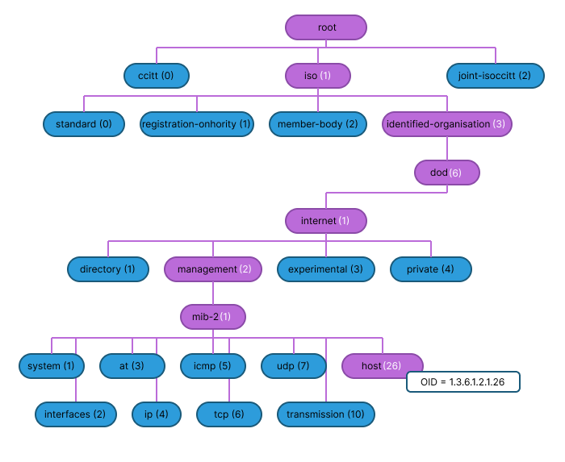
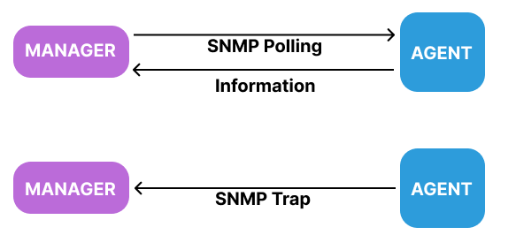
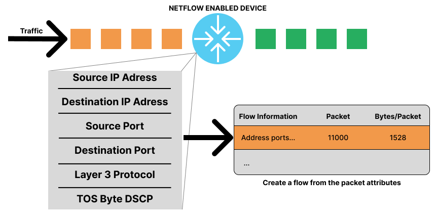
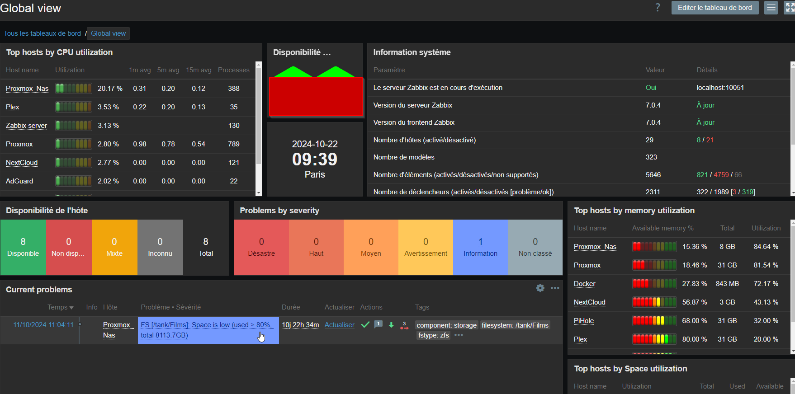

# Protocoles de Monitoring Reseau

## Objectifs du cours

Ce cours couvre les protocoles essentiels pour surveiller et analyser le comportement d'un reseau. Vous apprendrez comment les equipements communiquent leur etat, comment le trafic revele des patterns, et comment les logs centralisent les evenements critiques.

Competences visees :
- Comprendre SNMP et ses differents modes (polling, traps)
- Maitriser les MIBs et les OIDs pour interroger les equipements
- Distinguer les versions SNMPv1, v2c et v3
- Analyser le trafic avec NetFlow pour detecter les anomalies
- Centraliser les logs avec Syslog et les integrer aux SIEMs
- Deployer Zabbix comme solution de monitoring unifiee

---

## Glossaire

### Termes SNMP

| Terme | Description |
|-------|-------------|
| **SNMP** | Simple Network Management Protocol - Protocole de gestion reseau |
| **Manager** | Systeme central qui interroge les agents |
| **Agent** | Logiciel sur l'equipement qui repond aux requetes |
| **OID** | Object Identifier - Identifiant unique d'une metrique |
| **MIB** | Management Information Base - Base de donnees des OIDs |
| **Community String** | Mot de passe en clair (SNMPv1/v2c) |
| **USM** | User-based Security Model (SNMPv3) |

### Operations SNMP

| Operation | Description |
|-----------|-------------|
| **GET** | Le manager demande une valeur specifique |
| **SET** | Le manager modifie une valeur |
| **GETNEXT** | Recupere la valeur suivante dans la MIB |
| **GETBULK** | Recupere plusieurs valeurs en une requete |
| **TRAP** | L'agent envoie une alerte au manager |
| **INFORM** | Trap avec accusé de reception |

### Termes NetFlow

| Terme | Description |
|-------|-------------|
| **Flow** | Sequence de paquets partageant les memes caracteristiques |
| **Exporter** | Equipement qui genere les donnees NetFlow |
| **Collector** | Serveur qui recoit et stocke les flows |
| **5-tuple** | IP src, IP dst, Port src, Port dst, Protocole |

### Termes Syslog

| Terme | Description |
|-------|-------------|
| **Facility** | Source du message (kernel, mail, daemon...) |
| **Severity** | Niveau de gravite (0-7) |
| **SIEM** | Security Information and Event Management |

---

## SNMP : Simple Network Management Protocol

### Concepts fondamentaux

SNMP est le protocole universel pour gerer et surveiller les equipements reseau. Developpe a la fin des annees 1980, il est supporte par pratiquement tous les equipements : routeurs, switches, firewalls, imprimantes, et meme certains appareils IoT.


SNMP fonctionne sur un modele **Manager/Agent** :
- Le **Manager** (ou NMS - Network Management System) interroge les equipements
- L'**Agent** reside sur chaque equipement et maintient les metriques

### Communication SNMP

SNMP utilise UDP par defaut :
- **Port 161** : Pour les requetes (GET, SET)
- **Port 162** : Pour les traps (alertes)

```
┌─────────────────┐                    ┌─────────────────┐
│   SNMP Manager  │                    │   SNMP Agent    │
│   (Monitoring)  │                    │   (Equipement)  │
├─────────────────┤                    ├─────────────────┤
│                 │ ── GET Request ──> │                 │
│                 │ <── Response ───── │                 │
│                 │                    │                 │
│                 │ ── SET Request ──> │                 │
│                 │ <── Response ───── │                 │
│                 │                    │                 │
│                 │ <───── TRAP ────── │                 │
│   Port 162      │                    │   Port 161      │
└─────────────────┘                    └─────────────────┘
```

### MIBs (Management Information Bases)

Les MIBs sont les "dictionnaires" SNMP. Chaque metrique est identifiee par un **OID** (Object Identifier) structure hierarchiquement.



#### Structure d'un OID

```
1.3.6.1.2.1.1.1.0
│ │ │ │ │ │ │ │ └─ Instance
│ │ │ │ │ │ │ └─── sysDescr
│ │ │ │ │ │ └───── system
│ │ │ │ │ └─────── mib-2
│ │ │ │ └───────── mgmt
│ │ │ └─────────── internet
│ │ └───────────── dod
│ └─────────────── org
└───────────────── iso
```

#### OIDs courants (MIB-2)

| OID | Nom | Description |
|-----|-----|-------------|
| 1.3.6.1.2.1.1.1 | sysDescr | Description du systeme |
| 1.3.6.1.2.1.1.3 | sysUpTime | Temps depuis le dernier boot |
| 1.3.6.1.2.1.1.5 | sysName | Nom de l'equipement |
| 1.3.6.1.2.1.2.2 | ifTable | Table des interfaces |
| 1.3.6.1.2.1.25 | host | Informations host |
| 1.3.6.1.2.1.26 | snmp | Statistiques SNMP |

### Polling vs Traps



#### Polling (Interrogation active)

Le manager interroge periodiquement les agents :

```
Manager                          Agent
   │                               │
   │─── GET ifOperStatus ────────>│
   │<── Response: up ─────────────│
   │                               │
   │   (attente 5 minutes)         │
   │                               │
   │─── GET ifOperStatus ────────>│
   │<── Response: up ─────────────│
```

**Avantages :**
- Controle total sur la frequence
- Donnees historiques completes
- Predictible

**Inconvenients :**
- Consomme de la bande passante
- Delai de detection (depend de l'intervalle)

#### Traps (Alertes push)

L'agent envoie une notification lors d'un evenement :

```
Manager                          Agent
   │                               │
   │                               │  (lien tombe)
   │<── TRAP: linkDown ───────────│
   │                               │
   │                               │  (lien remonte)
   │<── TRAP: linkUp ─────────────│
```

**Avantages :**
- Detection immediate
- Economise la bande passante
- Alerte uniquement quand necessaire

**Inconvenients :**
- Pas de garantie de livraison (UDP)
- Pas de contexte historique

#### Strategie optimale

Combiner les deux approches :

| Type de donnee | Methode | Intervalle |
|----------------|---------|------------|
| CPU, Memoire | Polling | 5 minutes |
| Interfaces | Polling + Traps | 1 minute |
| Erreurs critiques | Traps | Immediat |
| Tendances long terme | Polling | 15 minutes |

### Versions SNMP

#### SNMPv1 (1988)

La version originale, simple mais non securisee :

| Caracteristique | Valeur |
|-----------------|--------|
| Authentification | Community string (cleartext) |
| Chiffrement | Non |
| Operations | GET, SET, TRAP |
| Usage | Systemes legacy |

```bash
# Exemple SNMPv1
snmpget -v1 -c public 192.168.1.1 sysDescr.0
```

#### SNMPv2c (1993)

Ameliore les performances mais garde la faiblesse securitaire :

| Caracteristique | Valeur |
|-----------------|--------|
| Authentification | Community string (cleartext) |
| Chiffrement | Non |
| Operations | + GETBULK, INFORM |
| Performance | Meilleure (bulk) |

```bash
# Exemple SNMPv2c avec GETBULK
snmpbulkwalk -v2c -c public 192.168.1.1 ifTable
```

#### SNMPv3 (1998)

La version securisee, recommandee pour tout environnement sensible :

| Caracteristique | Valeur |
|-----------------|--------|
| Authentification | USM (MD5, SHA) |
| Chiffrement | DES, AES |
| Controle d'acces | VACM (granulaire) |
| Securite | Haute |

```bash
# Exemple SNMPv3 avec authentification et chiffrement
snmpget -v3 -u monuser -l authPriv \
  -a SHA -A "motdepasse_auth" \
  -x AES -X "motdepasse_priv" \
  192.168.1.1 sysDescr.0
```

#### Comparaison des versions

| Fonctionnalite | SNMPv1 | SNMPv2c | SNMPv3 |
|----------------|--------|---------|--------|
| Annee | 1988 | 1993 | 1998 |
| Authentification | Community (clair) | Community (clair) | USM (hash) |
| Chiffrement | Non | Non | Oui |
| GETBULK | Non | Oui | Oui |
| Niveau securite | Faible | Faible | Eleve |
| Compatibilite | Legacy | Large | Moderne |

### Niveaux de securite SNMPv3

| Niveau | Authentification | Chiffrement | Usage |
|--------|------------------|-------------|-------|
| noAuthNoPriv | Non | Non | Test uniquement |
| authNoPriv | Oui | Non | Reseau interne |
| authPriv | Oui | Oui | Production |

---

## NetFlow : Analyse du trafic

### Qu'est-ce que NetFlow ?

NetFlow est un protocole developpe par Cisco dans les annees 1990 pour collecter des informations sur le trafic IP. Contrairement a SNMP qui surveille les equipements, NetFlow observe le **trafic** lui-meme.



### Concept de Flow

Un flow est une sequence unidirectionnelle de paquets partageant :
- Adresse IP source
- Adresse IP destination
- Port source
- Port destination
- Protocole (TCP, UDP, ICMP...)
- Interface d'entree

### Architecture NetFlow

```
┌─────────────┐     ┌─────────────┐     ┌─────────────┐
│   Routeur   │     │   Routeur   │     │   Switch    │
│  Exporter   │     │  Exporter   │     │  Exporter   │
└──────┬──────┘     └──────┬──────┘     └──────┬──────┘
       │                   │                   │
       └───────────────────┼───────────────────┘
                           │
                           ▼
                  ┌─────────────────┐
                  │ NetFlow Collector│
                  │   (ntopng,       │
                  │    Scrutinizer)  │
                  └─────────────────┘
```

### Donnees collectees par NetFlow

| Champ | Description |
|-------|-------------|
| Source IP | Adresse IP source |
| Destination IP | Adresse IP destination |
| Source Port | Port source (si TCP/UDP) |
| Destination Port | Port destination |
| Protocol | Numero de protocole (6=TCP, 17=UDP) |
| Bytes | Nombre d'octets transferes |
| Packets | Nombre de paquets |
| Start Time | Debut du flow |
| End Time | Fin du flow |
| Input Interface | Interface d'entree |
| ToS | Type of Service |

### Cas d'usage NetFlow

#### 1. Analyse de bande passante

```
Top Talkers (24h):
─────────────────────────────────────────
IP Source          | Bytes    | % Total
─────────────────────────────────────────
192.168.1.50       | 45.2 GB  | 32%
192.168.1.23       | 28.1 GB  | 20%
192.168.1.105      | 15.8 GB  | 11%
```

#### 2. Identification d'applications

```
Top Applications:
─────────────────────────────────────────
Application        | Bytes    | Flows
─────────────────────────────────────────
HTTPS (443)        | 52.3 GB  | 125,432
HTTP (80)          | 12.1 GB  | 45,231
DNS (53)           | 2.3 GB   | 892,123
SSH (22)           | 1.2 GB   | 3,421
```

#### 3. Detection d'anomalies

NetFlow excelle dans la detection de comportements suspects :

| Anomalie | Pattern NetFlow |
|----------|-----------------|
| Scan de ports | Nombreux flows vers ports differents |
| DDoS | Volume anormal depuis multiples sources |
| Exfiltration | Volume sortant inhabituel |
| Mouvement lateral | Communication entre segments inhabituels |
| C2 (Command & Control) | Connexions regulieres vers IP externe |

### Detection du mouvement lateral

```
Normal:
  Workstation → Server (HTTP, SMB)

Suspect:
  Workstation A → Workstation B (SMB, RDP)
  Workstation B → Workstation C (SMB)

NetFlow montre ces connexions inhabituelles
entre machines qui ne communiquent normalement pas.
```

### Versions de NetFlow

| Version | Description |
|---------|-------------|
| NetFlow v5 | Format fixe, largement supporte |
| NetFlow v9 | Format template (flexible) |
| IPFIX | Standard IETF (base sur v9) |
| sFlow | Alternative (echantillonnage) |

### Outils NetFlow

| Outil | Type | Description |
|-------|------|-------------|
| ntopng | Open-source | Analyse temps reel |
| Scrutinizer | Commercial | Enterprise |
| SolarWinds NTA | Commercial | Integration Orion |
| nfdump | Open-source | CLI, archivage |
| Elastiflow | Open-source | Stack ELK |

---

## Syslog : Journalisation centralisee

### Qu'est-ce que Syslog ?

Syslog est le protocole standard pour la journalisation centralisee. Developpe dans les annees 1980, il reste l'un des protocoles les plus utilises pour collecter les logs de tous types d'equipements.

### Architecture Syslog

```
┌──────────────┐  ┌──────────────┐  ┌──────────────┐
│   Routeur    │  │   Serveur    │  │   Firewall   │
│  (client)    │  │   (client)   │  │  (client)    │
└──────┬───────┘  └──────┬───────┘  └──────┬───────┘
       │                 │                 │
       └─────────────────┼─────────────────┘
                         │
                         ▼ UDP/TCP 514
                ┌─────────────────┐
                │  Syslog Server  │
                │   (rsyslog,     │
                │    Graylog)     │
                └────────┬────────┘
                         │
                         ▼
                ┌─────────────────┐
                │      SIEM       │
                │   (Splunk,      │
                │    QRadar)      │
                └─────────────────┘
```

### Ports Syslog

| Port | Protocole | Usage |
|------|-----------|-------|
| 514 | UDP | Par defaut (non fiable) |
| 514 | TCP | Livraison garantie |
| 6514 | TCP/TLS | Syslog securise |

### Format d'un message Syslog

```
<PRI>TIMESTAMP HOSTNAME TAG: MESSAGE

Exemple:
<134>Jan 14 10:23:45 router01 %LINK-3-UPDOWN: Interface GigabitEthernet0/1, changed state to down
```

### Niveaux de severite

| Code | Nom | Description |
|------|-----|-------------|
| 0 | Emergency | Systeme inutilisable |
| 1 | Alert | Action immediate requise |
| 2 | Critical | Condition critique |
| 3 | Error | Erreur |
| 4 | Warning | Avertissement |
| 5 | Notice | Normal mais significatif |
| 6 | Informational | Information |
| 7 | Debug | Debogage |

### Facilities (Sources)

| Code | Facility | Description |
|------|----------|-------------|
| 0 | kern | Kernel |
| 1 | user | User-level |
| 2 | mail | Mail system |
| 3 | daemon | System daemons |
| 4 | auth | Security/authorization |
| 5 | syslog | Syslogd internal |
| 6 | lpr | Printer |
| 16-23 | local0-7 | Custom use |

### Calcul de la priorite (PRI)

```
PRI = (Facility × 8) + Severity

Exemple:
local0 (16) + Error (3) = 131
<131>Jan 14 10:00:00 server Message d'erreur
```

### Integration avec les SIEMs

Syslog est la source principale des SIEMs (Security Information and Event Management) :

```
┌─────────────────────────────────────────────────────────┐
│                         SIEM                            │
├─────────────────────────────────────────────────────────┤
│                                                         │
│   Syslog ──────┐                                        │
│                │                                        │
│   NetFlow ─────┼──> Normalisation ──> Correlation ──>   │
│                │          │              │         │    │
│   SNMP ────────┘          │              │         │    │
│                           ▼              ▼         ▼    │
│                       Stockage      Regles     Alertes  │
│                                                         │
└─────────────────────────────────────────────────────────┘
```

### Correlation d'evenements

Un SIEM peut correler differentes sources :

```
Scenario d'attaque detecte par correlation:

1. Syslog (Firewall): Connexion SSH depuis IP externe
2. Syslog (Server): Login SSH reussi
3. SNMP: CPU spike soudain
4. NetFlow: Trafic sortant anormal vers IP inconnue

=> ALERTE: Possible compromission et exfiltration
```

### Serveurs Syslog populaires

| Outil | Type | Description |
|-------|------|-------------|
| rsyslog | Open-source | Standard Linux |
| syslog-ng | Open-source | Flexible, filtre |
| Graylog | Open-source | Interface web |
| Splunk | Commercial | Enterprise SIEM |
| ELK Stack | Open-source | Elasticsearch + Logstash + Kibana |

---

## Zabbix : Monitoring unifie

### Qu'est-ce que Zabbix ?

Zabbix est une solution de monitoring open-source complete. Il agit comme un chef d'orchestre integrant SNMP, agents, scripts, et plus encore dans une interface unifiee.



### Fonctionnalites principales

| Fonctionnalite | Description |
|----------------|-------------|
| SNMP Polling/Traps | Interrogation et reception d'alertes |
| Agent Zabbix | Agent installe sur les machines |
| Checks actifs/passifs | Flexibilite de collecte |
| Scripts personnalises | Monitoring sur mesure |
| Auto-decouverte | Scan automatique du reseau |
| Templates | Configurations reutilisables |
| Triggers | Regles d'alerte |
| Notifications | Email, SMS, Slack, PagerDuty |
| Dashboards | Visualisation personnalisable |
| API | Automatisation complete |

### Architecture Zabbix

```
┌─────────────────────────────────────────────────────────┐
│                    Zabbix Server                        │
├─────────────────────────────────────────────────────────┤
│                                                         │
│   ┌─────────────┐  ┌─────────────┐  ┌─────────────┐    │
│   │   Poller    │  │   Trapper   │  │  Alerter    │    │
│   │   (SNMP)    │  │   (Traps)   │  │(Notifications)│  │
│   └──────┬──────┘  └──────┬──────┘  └──────┬──────┘    │
│          │                │                │           │
│          └────────────────┼────────────────┘           │
│                           │                            │
│                    ┌──────┴──────┐                     │
│                    │  Database   │                     │
│                    │  (MySQL/    │                     │
│                    │   PostgreSQL)│                    │
│                    └─────────────┘                     │
│                                                         │
└─────────────────────────────────────────────────────────┘
           │              │              │
           ▼              ▼              ▼
    ┌───────────┐  ┌───────────┐  ┌───────────┐
    │  Agent    │  │   SNMP    │  │   IPMI    │
    │  Linux    │  │  Devices  │  │  Servers  │
    └───────────┘  └───────────┘  └───────────┘
```

### Modes de collecte

| Mode | Description | Usage |
|------|-------------|-------|
| Agent passif | Le serveur interroge l'agent | Standard |
| Agent actif | L'agent envoie les donnees | Firewalls, NAT |
| SNMP | Polling/Traps | Equipements reseau |
| IPMI | Hardware monitoring | Serveurs physiques |
| JMX | Java Management | Applications Java |
| HTTP | Checks web | Sites web, APIs |

### Installation rapide avec Docker

```bash
# Cloner le repository
git clone https://github.com/karthick-dkk/zabbix.git

# Donner les permissions
chmod u+x zabbix/installation/zabbix-server_docker_installation.sh

# Lancer l'installation
./zabbix/installation/zabbix-server_docker_installation.sh
```

### Acces a l'interface

| Parametre | Valeur |
|-----------|--------|
| URL | http://localhost:8080 |
| Username | Admin |
| Password | zabbix |

### Concepts cles Zabbix

| Concept | Description |
|---------|-------------|
| **Host** | Equipement surveille |
| **Item** | Metrique collectee |
| **Trigger** | Condition declenchant une alerte |
| **Action** | Reponse a un trigger (notification, script) |
| **Template** | Collection d'items/triggers reutilisable |
| **Discovery** | Detection automatique d'equipements |

### Exemple de Trigger

```
Trigger: CPU haute sur serveur
─────────────────────────────────────
Expression: {server:system.cpu.util.avg(5m)}>80
Severity: Warning

Si CPU > 80% pendant 5 minutes:
  → Envoyer email a admin@company.com
  → Executer script de diagnostic
```

### Demarrage automatique avec Systemd

```bash
# Creer le service
sudo nano /etc/systemd/system/zabbix.service
```

```ini
[Unit]
Description=Zabbix on startup
After=network.target

[Service]
ExecStart=/home/debian/zabbix/installation/zabbix-server_docker_installation.sh
Restart=on-failure
User=debian

[Install]
WantedBy=multi-user.target
```

```bash
# Activer le service
sudo chmod 644 /etc/systemd/system/zabbix.service
sudo systemctl daemon-reload
sudo systemctl enable zabbix.service
sudo systemctl start zabbix.service
```

---

## Synthese et bonnes pratiques

### Choix du protocole selon le besoin

| Besoin | Protocole recommande |
|--------|---------------------|
| Etat des equipements | SNMP |
| Analyse du trafic | NetFlow |
| Journalisation | Syslog |
| Detection d'intrusion | NetFlow + Syslog |
| Monitoring complet | Zabbix (tout-en-un) |

### Architecture de monitoring recommandee

```
                    ┌─────────────────────┐
                    │       Zabbix        │
                    │   (Centralisation)  │
                    └──────────┬──────────┘
                               │
        ┌──────────────────────┼──────────────────────┐
        │                      │                      │
        ▼                      ▼                      ▼
   ┌─────────┐           ┌─────────┐           ┌─────────┐
   │  SNMP   │           │ NetFlow │           │ Syslog  │
   │ Polling │           │Collector│           │ Server  │
   └────┬────┘           └────┬────┘           └────┬────┘
        │                     │                     │
        ▼                     ▼                     ▼
   ┌─────────┐           ┌─────────┐           ┌─────────┐
   │Routeurs │           │ Trafic  │           │  Logs   │
   │Switches │           │ reseau  │           │ systeme │
   │Firewalls│           │         │           │         │
   └─────────┘           └─────────┘           └─────────┘
```

### Checklist de securite

| Element | Recommandation |
|---------|----------------|
| SNMP | Utiliser SNMPv3 avec authPriv |
| Community strings | Jamais "public" ou "private" |
| Syslog | TLS sur port 6514 |
| Acces Zabbix | HTTPS + authentification forte |
| Segmentation | Reseau de management dedie |

---

## Ressources

- [Cisco - SNMP Basics](https://www.cisco.com/c/en/us/support/docs/ip/simple-network-management-protocol-snmp/7282-12.html)
- [NetFlow Overview](https://www.cisco.com/c/en/us/products/ios-nx-os-software/ios-netflow/index.html)
- [Syslog RFC 5424](https://datatracker.ietf.org/doc/html/rfc5424)
- [Zabbix Documentation](https://www.zabbix.com/documentation/current/)
- [Suricata + Zabbix Integration](https://www.zabbix.com/integrations/suricata)
