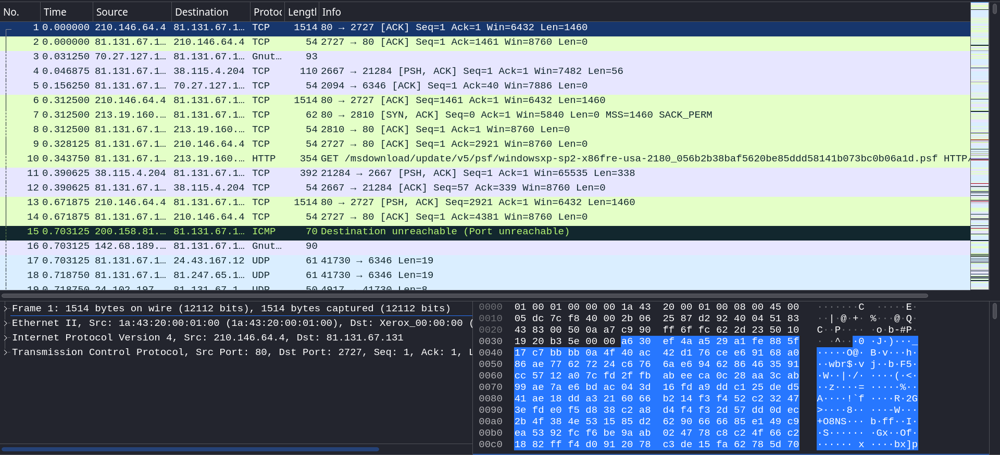
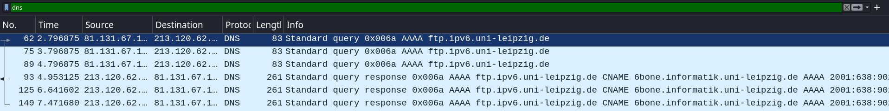
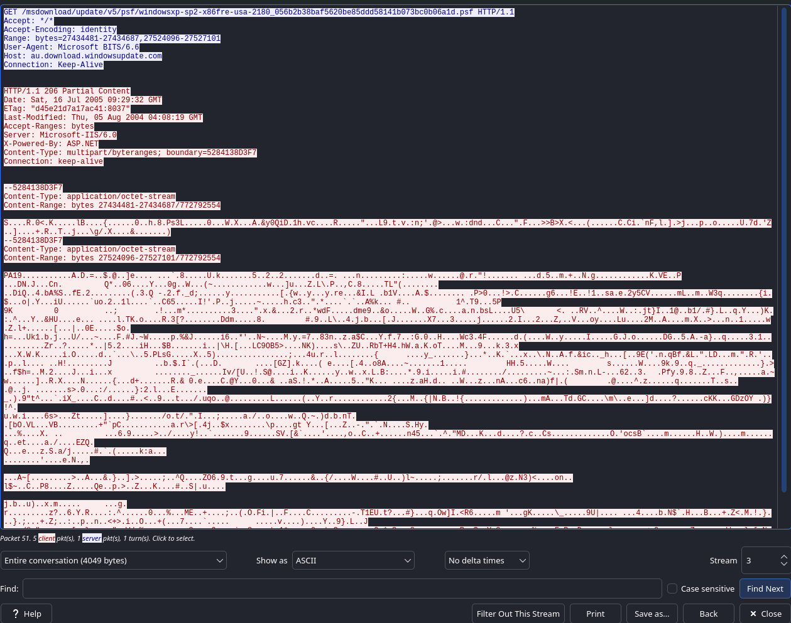
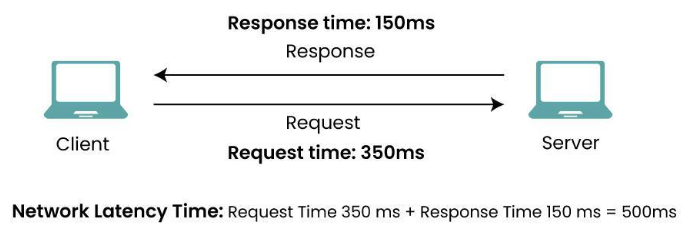
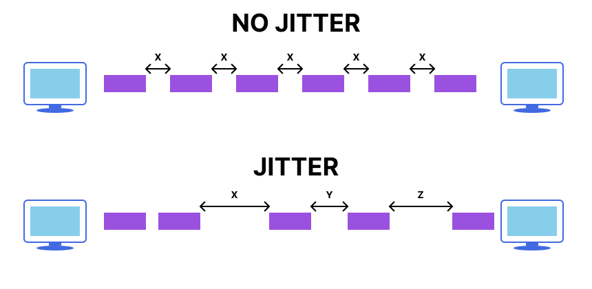
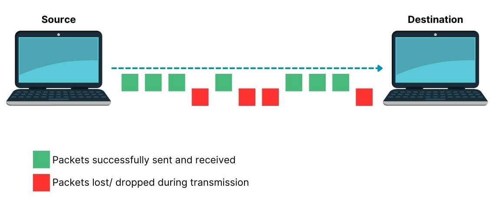

# Capture et analyse de paquets

## Objectifs du cours

Ce cours plonge au coeur des communications réseau. Avec des outils comme Wireshark et tcpdump, il est possible d'observer chaque bit et octet qui traverse le réseau, disséquer le trafic, identifier les problèmes et même reconstruire des conversations.

Compétences visées :
- Maîtriser Wireshark pour capturer, filtrer et analyser les paquets
- Utiliser les filtres BPF (Berkeley Packet Filters) pour une capture précise
- Analyser les flux TCP et reconstruire des sessions
- Utiliser tcpdump en ligne de commande, y compris à distance
- Identifier la latence, le jitter et la perte de paquets dans les captures VoIP et HTTP

---

## Glossaire

### Termes généraux

| Terme | Description |
|-------|-------------|
| **Packet** | Unité de données transmise sur le réseau |
| **Frame** | Trame au niveau Ethernet (couche 2) |
| **PCAP** | Packet Capture - Format de fichier standard |
| **Promiscuous Mode** | Mode où l'interface capture tout le trafic |
| **BPF** | Berkeley Packet Filter - Syntaxe de filtrage |

### Termes Wireshark

| Terme | Description |
|-------|-------------|
| **Display Filter** | Filtre appliqué après la capture |
| **Capture Filter** | Filtre appliqué pendant la capture (BPF) |
| **Dissector** | Module qui décode un protocole |
| **Follow Stream** | Reconstruction d'une conversation |
| **Coloring Rules** | Règles de coloration des paquets |

### Métriques de performance

| Terme | Description |
|-------|-------------|
| **Latency** | Temps de transit d'un paquet |
| **RTT** | Round Trip Time - Aller-retour |
| **Jitter** | Variation du délai entre paquets |
| **Packet Loss** | Paquets perdus en transit |
| **Retransmission** | Paquet renvoyé (TCP) |

---

## Wireshark : Le microscope du réseau

Wireshark est l'outil de référence pour l'inspection de paquets. Utilisé par les ingénieurs réseau, les analystes sécurité et les administrateurs système, il permet d'examiner exactement ce qui transite sur le réseau.



### Installation

| Système | Commande |
|---------|----------|
| Debian/Ubuntu | `sudo apt install wireshark` |
| Kali Linux | Pre-installe |
| macOS | `brew install --cask wireshark` |
| Windows | Telecharger depuis wireshark.org |

### Interface principale

L'interface Wireshark se compose de trois zones principales :

```
┌─────────────────────────────────────────────────────────┐
│                    Liste des paquets                    │
│  No.  Time     Source        Dest         Protocol Info │
│  1    0.000    192.168.1.1   8.8.8.8      DNS      ...  │
│  2    0.023    8.8.8.8       192.168.1.1  DNS      ...  │
│  3    0.025    192.168.1.1   93.184.216   TCP      ...  │
├─────────────────────────────────────────────────────────┤
│                  Details du paquet                      │
│  ► Ethernet II                                          │
│  ► Internet Protocol Version 4                          │
│  ► Transmission Control Protocol                        │
│  ► Hypertext Transfer Protocol                          │
├─────────────────────────────────────────────────────────┤
│                    Donnees brutes (hex)                 │
│  0000   00 1a 2b 3c 4d 5e 00 11 22 33 44 55 08 00 45 00 │
└─────────────────────────────────────────────────────────┘
```

### Inspection des paquets

Chaque paquet capture contient des en-tetes et des donnees. Wireshark decode des centaines de protocoles :

| Couche | Information |
|--------|-------------|
| Ethernet | Adresses MAC source/destination |
| IP | Adresses IP, TTL, flags |
| TCP/UDP | Ports, flags, numeros de sequence |
| Application | Requetes DNS, HTTP GET, etc. |

Cliquer sur un paquet revele sa structure en arborescence, permettant d'inspecter chaque champ.

---

## Filtres Wireshark

### Display Filters vs Capture Filters

| Type | Moment | Syntaxe | Usage |
|------|--------|---------|-------|
| Display Filter | Apres capture | Wireshark natif | Analyse |
| Capture Filter | Pendant capture | BPF | Performance |



### Display Filters (apres capture)

Les Display Filters utilisent une syntaxe propre a Wireshark :

#### Filtres par adresse

```
ip.addr == 192.168.1.1           # Source OU destination
ip.src == 192.168.1.1            # Source uniquement
ip.dst == 8.8.8.8                # Destination uniquement
eth.addr == aa:bb:cc:dd:ee:ff    # Adresse MAC
```

#### Filtres par protocole

```
dns                              # Tout le trafic DNS
http                             # Tout le trafic HTTP
tcp                              # Tout le trafic TCP
udp                              # Tout le trafic UDP
icmp                             # Ping, etc.
arp                              # Requetes ARP
tls                              # Trafic TLS/SSL
```

#### Filtres par port

```
tcp.port == 80                   # Port 80 (src ou dst)
tcp.srcport == 443               # Port source 443
tcp.dstport == 22                # Port destination 22
udp.port == 53                   # DNS
```

#### Filtres avances

```
http.request.method == "GET"     # Requetes HTTP GET
http.request.method == "POST"    # Requetes HTTP POST
http.response.code == 404        # Reponses 404
dns.qry.name contains "google"   # Requetes DNS contenant "google"
tcp.flags.syn == 1               # Paquets SYN
tcp.analysis.retransmission      # Retransmissions TCP
frame.len > 1000                 # Paquets > 1000 octets
```

#### Operateurs logiques

```
ip.addr == 192.168.1.1 and tcp.port == 80
ip.addr == 192.168.1.1 or ip.addr == 192.168.1.2
not arp
(http or dns) and ip.addr == 10.0.0.1
```

### Capture Filters (BPF)

Les Capture Filters utilisent la syntaxe Berkeley Packet Filter, appliquee au niveau du kernel pour de meilleures performances :

```
host 192.168.1.1                 # Tout trafic vers/depuis cette IP
src host 10.0.0.1                # Source uniquement
dst host 8.8.8.8                 # Destination uniquement
net 192.168.1.0/24               # Tout un réseau
tcp port 80                      # Port TCP 80
udp port 53                      # Port UDP 53
port 443                         # Port 443 (TCP ou UDP)
tcp                              # Tout TCP
icmp                             # Tout ICMP
host 10.0.0.1 and tcp port 22    # SSH vers/depuis 10.0.0.1
not port 22                      # Exclure SSH
```

---

## Analyse des flux TCP

### Follow TCP Stream

Une des fonctionnalites les plus puissantes de Wireshark est la reconstruction des conversations TCP.



**Comment l'utiliser :**
1. Clic droit sur un paquet TCP
2. Selectionner "Follow" → "TCP Stream"
3. La conversation complete s'affiche

### Ce que vous pouvez voir

| Protocole | Information visible |
|-----------|---------------------|
| HTTP | Requetes, reponses, headers, body |
| SMTP | Emails complets |
| FTP | Commandes et fichiers |
| Telnet | Sessions completes (en clair !) |
| TLS | Handshake (donnees chiffrees) |

### Analyse du handshake TCP

Le handshake TCP en 3 étapes revele la latence :

```
Client                              Server
   │                                   │
   │──── SYN ────────────────────────>│ t=0
   │                                   │
   │<─── SYN-ACK ─────────────────────│ t=50ms
   │                                   │
   │──── ACK ────────────────────────>│ t=51ms
   │                                   │

RTT (Round Trip Time) ≈ 50ms
```

### Statistiques TCP

Wireshark offre plusieurs outils d'analyse TCP :

| Menu | Fonctionnalite |
|------|----------------|
| Statistics → Conversations | Liste toutes les conversations |
| Statistics → Endpoints | Liste tous les endpoints |
| Statistics → Protocol Hierarchy | Repartition par protocole |
| Statistics → IO Graph | Graphique du trafic |
| Statistics → TCP Stream Graphs | Graphiques TCP |

---

## Reconstruction de sessions

### Sessions VoIP

Pour les protocoles VoIP (SIP/RTP), Wireshark peut reconstruire et meme rejouer les appels :

**Procedure :**
1. Filtrer SIP : `sip`
2. Menu "Telephony" → "VoIP Calls"
3. Selectionner un appel
4. Cliquer "Play Streams"
5. Ecouter la conversation

### Sessions FTP

Reconstruction d'un transfert FTP :

```
1. Filtre: ftp ou ftp-data
2. Follow TCP Stream sur la connexion de contrôle
3. Voir les commandes: USER, PASS, RETR, STOR
4. Follow TCP Stream sur la connexion de donnees
5. Extraire le fichier transfere
```

### Export d'objets

Wireshark peut extraire automatiquement les fichiers :

| Menu | Protocole |
|------|-----------|
| File → Export Objects → HTTP | Images, JS, CSS, HTML |
| File → Export Objects → DICOM | Images medicales |
| File → Export Objects → IMF | Emails |
| File → Export Objects → SMB | Fichiers partages |

---

## tcpdump : Capture en ligne de commande

tcpdump est l'outil de capture en ligne de commande. Leger, rapide et scriptable, il est ideal pour les serveurs sans interface graphique.

### Syntaxe de base

```bash
# Capturer sur l'interface eth0
tcpdump -i eth0

# Lister les interfaces disponibles
tcpdump -D

# Capturer et sauvegarder dans un fichier
tcpdump -i eth0 -w capture.pcap

# Lire un fichier de capture
tcpdump -r capture.pcap

# Capturer N paquets
tcpdump -c 100 -i eth0

# Afficher les donnees en hexa et ASCII
tcpdump -X -i eth0

# Ne pas resoudre les noms
tcpdump -n -i eth0
```

### Options courantes

| Option | Description |
|--------|-------------|
| `-i` | Interface de capture |
| `-w` | Ecrire dans un fichier |
| `-r` | Lire depuis un fichier |
| `-c` | Nombre de paquets a capturer |
| `-n` | Ne pas resoudre les noms DNS |
| `-nn` | Ne pas resoudre noms ni ports |
| `-v/-vv/-vvv` | Verbosity croissante |
| `-X` | Afficher en hexa et ASCII |
| `-A` | Afficher en ASCII uniquement |
| `-s` | Taille de capture (snaplen) |

### Filtres BPF avec tcpdump

```bash
# Trafic HTTP
tcpdump -i eth0 tcp port 80

# Trafic vers/depuis une IP
tcpdump -i eth0 host 192.168.1.1

# Trafic entre deux hosts
tcpdump -i eth0 host 192.168.1.1 and host 10.0.0.1

# DNS uniquement
tcpdump -i eth0 port 53

# Exclure SSH
tcpdump -i eth0 not port 22

# Trafic d'un réseau
tcpdump -i eth0 net 192.168.1.0/24

# ICMP (ping)
tcpdump -i eth0 icmp

# Combiner des filtres
tcpdump -i eth0 'tcp port 80 or tcp port 443'
```

### Capture a distance

Capturer sur un serveur distant et analyser localement :

```bash
# Methode 1: SSH pipe
ssh user@server "tcpdump -i eth0 -w -" > capture.pcap

# Methode 2: SSH avec filtre
ssh user@server "tcpdump -i eth0 -w - port 80" > http.pcap

# Methode 3: Wireshark en temps reel
ssh user@server "tcpdump -i eth0 -U -w -" | wireshark -k -i -

# Methode 4: Copie du fichier
ssh user@server "tcpdump -c 1000 -w /tmp/cap.pcap"
scp user@server:/tmp/cap.pcap ./
```

### tshark : Wireshark en CLI

tshark est la version ligne de commande de Wireshark :

```bash
# Capture basique
tshark -i eth0

# Avec filtre
tshark -i eth0 -f "tcp port 80"

# Display filter
tshark -i eth0 -Y "http.request"

# Export en JSON
tshark -r capture.pcap -T json > capture.json

# Statistiques
tshark -r capture.pcap -q -z io,stat,1
```

---

## Analyse de performance

### Latence

La latence est le temps nécessaire pour qu'un paquet atteigne sa destination.



**Mesurer la latence dans Wireshark :**

1. Observer le handshake TCP (SYN → SYN-ACK → ACK)
2. Le temps entre SYN et SYN-ACK = latence vers le serveur
3. Utiliser "Statistics → TCP Stream Graphs → Round Trip Time"

| Latence | Qualite |
|---------|---------|
| < 50ms | Excellente |
| 50-100ms | Bonne |
| 100-200ms | Acceptable |
| > 200ms | Degradee |

### Jitter

Le jitter est la variation du delai entre paquets consecutifs. Critique pour la VoIP et le streaming.



**Analyser le jitter dans Wireshark :**

1. Filtrer les paquets RTP : `rtp`
2. Menu "Telephony" → "RTP" → "Stream Analysis"
3. Observer la colonne "Jitter"

| Jitter | Qualite VoIP |
|--------|--------------|
| < 20ms | Excellente |
| 20-30ms | Bonne |
| 30-50ms | Acceptable |
| > 50ms | Degradee |

### Perte de paquets

La perte de paquets indique des problèmes de congestion ou d'erreurs réseau.



**Detecter la perte de paquets :**

Pour TCP :
```
# Filtre retransmissions
tcp.analysis.retransmission

# Filtre duplicates
tcp.analysis.duplicate_ack
```

Pour RTP/VoIP :
- Observer les numeros de sequence manquants
- Utiliser "Telephony → RTP → Stream Analysis"

| Perte | Impact |
|-------|--------|
| 0% | Parfait |
| < 1% | Acceptable |
| 1-2% | Degradation audible (VoIP) |
| > 3% | Problemes serieux |

### Filtres d'analyse TCP

```
# Problemes TCP courants
tcp.analysis.retransmission       # Retransmissions
tcp.analysis.duplicate_ack        # ACKs dupliques
tcp.analysis.lost_segment         # Segments perdus
tcp.analysis.out_of_order         # Paquets desordonnes
tcp.analysis.zero_window          # Fenetre a zero
tcp.analysis.window_full          # Fenetre pleine

# Combiner pour voir tous les problèmes
tcp.analysis.flags
```

---

## Bonnes pratiques

### Avant la capture

| Etape | Action |
|-------|--------|
| 1 | Identifier clairement le problème |
| 2 | Choisir la bonne interface |
| 3 | Definir un filtre de capture (BPF) |
| 4 | Preparer l'espace disque |

### Pendant la capture

| Etape | Action |
|-------|--------|
| 1 | Reproduire le problème |
| 2 | Noter le timestamp |
| 3 | Limiter la duree |
| 4 | Verifier la taille du fichier |

### Apres la capture

| Etape | Action |
|-------|--------|
| 1 | Sauvegarder le PCAP |
| 2 | Nommer clairement (date, context) |
| 3 | Compresser si nécessaire |
| 4 | Analyser avec les bons filtres |

### Nommage des fichiers

```
Convention: <server>_<type>_<date>.pcap

Exemples:
webserver01_http_2025-01-14.pcap
voip_gateway_rtp_2025-01-14.pcap
firewall_wan_suspicious_2025-01-14.pcap
```

### Outils complementaires

| Outil | Usage |
|-------|-------|
| `capinfos` | Informations sur un PCAP |
| `editcap` | Editer/decouper un PCAP |
| `mergecap` | Fusionner des PCAPs |
| `text2pcap` | Convertir hex en PCAP |
| `reordercap` | Reordonner par timestamp |

```bash
# Informations sur un fichier
capinfos capture.pcap

# Extraire les 100 premiers paquets
editcap -c 100 capture.pcap capture_100.pcap

# Fusionner deux captures
mergecap -w merged.pcap file1.pcap file2.pcap

# Filtrer et sauvegarder
editcap -F pcap capture.pcap filtered.pcap
```

---

## Cas pratiques

### Cas 1 : Diagnostiquer une lenteur web

```bash
# 1. Capturer le trafic HTTP/HTTPS
tcpdump -i eth0 -w web.pcap 'tcp port 80 or tcp port 443'

# 2. Dans Wireshark, filtrer HTTP
http

# 3. Analyser le temps de reponse
# Statistics → HTTP → Request Sequences

# 4. Verifier les retransmissions
tcp.analysis.retransmission
```

### Cas 2 : Probleme de VoIP

```bash
# 1. Capturer le trafic SIP/RTP
tcpdump -i eth0 -w voip.pcap 'udp port 5060 or udp portrange 10000-20000'

# 2. Dans Wireshark
# Telephony → VoIP Calls

# 3. Analyser la qualite
# Telephony → RTP → Stream Analysis

# 4. Verifier jitter et perte
```

### Cas 3 : Identifier une exfiltration

```bash
# 1. Capturer tout le trafic sortant
tcpdump -i eth0 -w outbound.pcap 'src net 192.168.0.0/16'

# 2. Analyser les volumes
# Statistics → Endpoints

# 3. Identifier les destinations suspectes
# Statistics → Conversations

# 4. Examiner les flux suspects
# Follow TCP Stream
```

---

## Ressources

- [Wireshark User's Guide](https://www.wireshark.org/docs/wsug_html/)
- [Wireshark Display Filter Reference](https://www.wireshark.org/docs/dfref/)
- [tcpdump Manual](https://www.tcpdump.org/manpages/tcpdump.1.html)
- [Sample Captures (Wireshark Wiki)](https://wiki.wireshark.org/SampleCaptures)
- [PacketLife Cheat Sheets](https://packetlife.net/library/cheat-sheets/)
