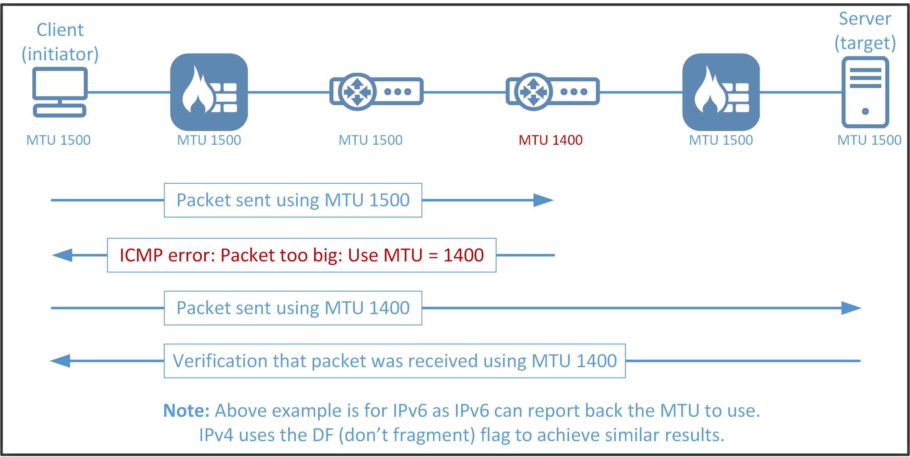

# Outils de troubleshooting réseau

## Objectifs du cours

- Utiliser ping et traceroute/tracert pour tester la connectivité et visualiser les chemins réseau
- Lire et comprendre les tables de routage avec `ip route` et `route print`
- Diagnostiquer les problèmes DNS avec nslookup et dig
- Détecter et résoudre les problèmes liés à la taille des paquets et à la fragmentation

---

## ping et traceroute/tracert : tests de connectivité et visualisation des chemins

L'une des premières étapes du dépannage réseau est de déterminer si deux appareils peuvent communiquer. C'est là qu'interviennent ping et traceroute (ou tracert sur Windows).

### ping

L'utilitaire ping envoie des requêtes ICMP Echo Request vers une cible (IP ou nom d'hôte) et attend les réponses Echo Reply. C'est l'équivalent réseau de demander "Es-tu là ?"

```
┌────────────────┐                    ┌────────────────┐
│   Machine A    │                    │   Machine B    │
│                │                    │                │
│   ping B       │─── Echo Request ──>│                │
│                │<── Echo Reply ─────│                │
│                │                    │                │
│   RTT: 3.10ms  │                    │                │
└────────────────┘                    └────────────────┘
```

**Informations fournies par ping :**

| Métrique | Description |
|----------|-------------|
| **RTT (Round-Trip Time)** | Temps aller-retour du paquet |
| **TTL (Time To Live)** | Nombre de sauts restants |
| **Packet Loss** | Pourcentage de paquets perdus |
| **icmp_seq** | Numéro de séquence du paquet |

**Exemple d'utilisation :**

```bash
ping google.com
PING google.com (2a00:1450:4007:81a::200e) 56 data bytes
64 bytes from par21s23-in-x0e.1e100.net (2a00:1450:4007:81a::200e): icmp_seq=1 ttl=119 time=3.10 ms
64 bytes from par21s23-in-x0e.1e100.net (2a00:1450:4007:81a::200e): icmp_seq=2 ttl=119 time=5.82 ms
64 bytes from par21s23-in-x0e.1e100.net (2a00:1450:4007:81a::200e): icmp_seq=3 ttl=119 time=5.57 ms
64 bytes from par21s23-in-x0e.1e100.net (2a00:1450:4007:81a::200e): icmp_seq=4 ttl=119 time=6.01 ms
```

Ce résultat indique que la destination est accessible et donne le temps de transit des paquets. Si ping échoue, vous pouvez avoir :
- Des problèmes DNS
- Des blocages de connectivité (firewall)
- Des routes mal configurées

**Options courantes :**

| Option Linux | Option Windows | Description |
|--------------|----------------|-------------|
| `-c <count>` | `-n <count>` | Limite le nombre de pings |
| `-i <interval>` | - | Intervalle entre les pings |
| `-s <size>` | `-l <size>` | Taille des données ICMP |
| - | `-t` | Ping jusqu'à arrêt manuel |

### traceroute / tracert

Là où ping vérifie l'accessibilité, traceroute cartographie le chemin emprunté par vos paquets. Chaque saut (hop) est révélé avec son adresse IP et parfois son nom d'hôte.

```
┌─────────┐    ┌─────────┐    ┌─────────┐    ┌─────────┐    ┌─────────┐
│ Source  │───>│ Hop 1   │───>│ Hop 2   │───>│ Hop 3   │───>│  Dest   │
│         │    │ Router  │    │ ISP     │    │ Google  │    │ 8.8.8.8 │
└─────────┘    └─────────┘    └─────────┘    └─────────┘    └─────────┘
    TTL=1          ↓
    TTL=2          ─────────────────↓
    TTL=3          ──────────────────────────────↓
    TTL=4          ───────────────────────────────────────────────↓
```

**Fonctionnement :**
Traceroute envoie des paquets avec des valeurs TTL (Time-To-Live) croissantes et collecte les messages ICMP "Time Exceeded" retournés par chaque routeur.

**Syntaxe :**

```bash
traceroute google.com    # Linux/macOS
tracert google.com       # Windows
```

**Exemple de sortie :**

```bash
traceroute to 8.8.8.8 (8.8.8.8), 30 hops max, 60 byte packets
 1  bbox.lan (192.168.1.254)  4.002 ms  3.858 ms  3.757 ms
 2  176.142.96.2 (176.142.96.2)  4.884 ms  4.793 ms  4.703 ms
 3  * * *
 4  * * *
 5  62.34.2.2 (62.34.2.2)  4.982 ms  4.893 ms  4.811 ms
 6  * * *
 7  * * *
 8  * * *
 9  dns.google (8.8.8.8)  4.102 ms  3.754 ms  4.408 ms
```

**Interprétation :**
- Chaque ligne = un saut (hop)
- Les trois temps = trois tentatives
- `* * *` = le routeur ne répond pas (ICMP bloqué ou timeout)

C'est crucial pour identifier les sauts lents ou défaillants. Si un routeur spécifique perd ou retarde les paquets, traceroute aide à identifier le coupable.

---

## ip route / route print : analyse de la table de routage

La table de routage détermine comment les paquets sont acheminés. Si elle est mal configurée, même un appareil en ligne peut être inaccessible.

### ip route (Linux)

```bash
ip route
default via 192.168.1.254 dev wlan0 proto dhcp src 192.168.1.52 metric 600
11.10.10.0/24 dev br-f52c10148d6d proto kernel scope link src 11.10.10.1 linkdown
172.17.0.0/16 dev docker0 proto kernel scope link src 172.17.0.1 linkdown
192.168.1.0/24 dev wlan0 proto kernel scope link src 192.168.1.52 metric 600
```

**Éléments clés de la sortie :**

| Élément | Description |
|---------|-------------|
| `default via` | Route par défaut (passerelle) |
| `dev` | Interface réseau utilisée |
| `proto` | Protocole (dhcp, kernel, static) |
| `metric` | Priorité de la route (plus bas = prioritaire) |
| `scope link` | Route locale directe |

**Schéma de décision de routage :**

```
                    Paquet à envoyer vers 10.0.0.50
                              │
                              ▼
            ┌─────────────────────────────────────┐
            │   Existe-t-il une route spécifique  │
            │         pour 10.0.0.0/24 ?          │
            └─────────────────────────────────────┘
                    │                    │
                   OUI                  NON
                    │                    │
                    ▼                    ▼
           ┌───────────────┐   ┌───────────────────┐
           │ Utiliser cette│   │ Utiliser la route │
           │     route     │   │    par défaut     │
           └───────────────┘   └───────────────────┘
```

### route print (Windows)

```
>route print
===========================================================================
Interface List
 25...00 15 5d 01 6a 37 ......Hyper-V Virtual Ethernet Adapter
 14...00 15 5d 0a b1 fb ......Microsoft Wi-Fi Direct Virtual Adapter
  1...........................Software Loopback Interface 1
===========================================================================

IPv4 Route Table
===========================================================================
Active Routes:
Network Destination        Netmask          Gateway       Interface  Metric
          0.0.0.0          0.0.0.0      192.168.1.254    192.168.1.105     35
        127.0.0.0        255.0.0.0         On-link         127.0.0.1    331
        127.0.0.1  255.255.255.255         On-link         127.0.0.1    331
  127.255.255.255  255.255.255.255         On-link         127.0.0.1    331
      192.168.1.0    255.255.255.0         On-link     192.168.1.105    291
    192.168.1.105  255.255.255.255         On-link     192.168.1.105    291
    192.168.1.255  255.255.255.255         On-link     192.168.1.105    291
        224.0.0.0        240.0.0.0         On-link         127.0.0.1    331
  255.255.255.255  255.255.255.255         On-link     192.168.1.105    291
===========================================================================
```

**Colonnes importantes :**

| Colonne | Description |
|---------|-------------|
| Network Destination | Réseau de destination |
| Netmask | Masque de sous-réseau |
| Gateway | Passerelle (ou "On-link" si direct) |
| Interface | Adresse IP locale utilisée |
| Metric | Coût de la route |

### Manipulation des routes

**Ajouter une route :**

```bash
# Linux
sudo ip route add 10.10.10.0/24 via 192.168.1.1

# Windows
route add 10.10.10.0 mask 255.255.255.0 192.168.1.1
```

**Supprimer une route :**

```bash
# Linux
sudo ip route del 10.10.10.0/24

# Windows
route delete 10.10.10.0
```

Des routes incorrectes peuvent créer des "trous noirs" de trafic ou des paquets mal acheminés. En comparant les tables de routage avec les chemins prévus, vous pouvez isoler les problèmes de configuration.

---

## nslookup / dig : résolution DNS et vérification des enregistrements

Quand un nom d'hôte ne se résout pas, le problème vient peut-être du DNS. C'est là que nslookup et dig brillent.

### nslookup

**Syntaxe de base :**

```bash
nslookup www.example.com

Server:        192.168.1.254
Address:    192.168.1.254#53

Non-authoritative answer:
www.example.com    canonical name = www.example.com-v4.edgesuite.net.
www.example.com-v4.edgesuite.net    canonical name = a1422.dscr.akamai.net.
Name:    a1422.dscr.akamai.net
Address: 2.21.244.143
Name:    a1422.dscr.akamai.net
Address: 2.21.244.137
```

**Schéma de résolution DNS :**

```
┌─────────┐         ┌─────────────┐         ┌─────────────┐
│ Client  │──req──> │   Serveur   │──req──> │   Serveur   │
│         │         │     DNS     │         │ Autoritaire │
│         │<─rep─── │  Récursif   │<─rep─── │             │
└─────────┘         └─────────────┘         └─────────────┘
                          │
                     Cache local
```

**Interroger un serveur DNS spécifique :**

```bash
nslookup www.example.com 8.8.8.8
```

**Rechercher différents types d'enregistrements :**

```bash
# Enregistrements MX (Mail)
nslookup -type=MX example.com

# Enregistrements NS (Name Server)
nslookup -type=NS example.com

# Enregistrements A (IPv4)
nslookup -type=A example.com

# Enregistrements AAAA (IPv6)
nslookup -type=AAAA example.com
```

### dig (Domain Information Groper)

dig offre une vue plus détaillée des données DNS et est préféré par de nombreux professionnels.

**Syntaxe de base :**

```bash
dig www.example.com

; <<>> DiG 9.20.7-1-Debian <<>> www.example.com
;; global options: +cmd
;; Got answer:
;; ->>HEADER<<- opcode: QUERY, status: NOERROR, id: 42332
;; flags: qr rd ra; QUERY: 1, ANSWER: 4, AUTHORITY: 0, ADDITIONAL: 1

;; OPT PSEUDOSECTION:
; EDNS: version: 0, flags:; udp: 1280
;; QUESTION SECTION:
;www.example.com.        IN    A

;; ANSWER SECTION:
www.example.com.    138    IN    CNAME    www.example.com-v4.edgesuite.net.
www.example.com-v4.edgesuite.net. 2475 IN CNAME    a1422.dscr.akamai.net.
a1422.dscr.akamai.net.    9    IN    A    2.21.244.143
a1422.dscr.akamai.net.    9    IN    A    2.21.244.137

;; Query time: 4 msec
;; SERVER: 192.168.1.254#53(192.168.1.254) (UDP)
;; WHEN: Thu May 15 15:46:11 CEST 2025
;; MSG SIZE  rcvd: 157
```

**Structure de la réponse dig :**

| Section | Contenu |
|---------|---------|
| **QUESTION** | La requête envoyée |
| **ANSWER** | Les réponses (enregistrements) |
| **AUTHORITY** | Serveurs autoritaires |
| **ADDITIONAL** | Informations supplémentaires |

**Options utiles de dig :**

```bash
# Requête courte
dig +short www.example.com

# Tracer la résolution complète
dig +trace www.example.com

# Enregistrements MX
dig MX example.com

# Utiliser un serveur spécifique
dig @8.8.8.8 www.example.com
```

Pour le dépannage de performance, vérifiez les champs **Query time** et **SERVER**.

---

## MTU et fragmentation : résoudre les problèmes de taille de paquets

**MTU** (Maximum Transmission Unit) désigne la plus grande taille de paquet qui peut être envoyée sans fragmentation.

### Pourquoi c'est important ?

```
┌─────────────────────────────────────────────────────────────────────┐
│                      CHEMIN RÉSEAU TYPIQUE                          │
├─────────────────────────────────────────────────────────────────────┤
│                                                                     │
│  ┌───────┐      ┌───────┐      ┌───────┐      ┌───────┐            │
│  │ LAN   │─────>│ VPN   │─────>│ ISP   │─────>│ Dest  │            │
│  │MTU:1500│      │MTU:1400│      │MTU:1500│      │MTU:1500│          │
│  └───────┘      └───────┘      └───────┘      └───────┘            │
│                     │                                               │
│                     └─ Goulot d'étranglement !                      │
│                                                                     │
│  Un paquet de 1500 octets sera fragmenté au niveau du VPN           │
│  ou bloqué si DF (Don't Fragment) est activé                        │
│                                                                     │
└─────────────────────────────────────────────────────────────────────┘
```

Des problèmes peuvent survenir quand de gros paquets sont silencieusement bloqués à cause de différences de MTU. C'est courant avec les VPNs et les tunnels.

### Détecter les problèmes de MTU

**Linux :**

```bash
ping -M do -s 1472 google.com
PING google.com (2a00:1450:4007:80c::200e) 1472 data bytes
ping: sendmsg: Message too long
```

L'option `-M do` active le flag "Don't Fragment". Si le paquet est trop gros, la commande signale une erreur.

**Windows :**

```bash
ping -f -l 1472 google.com
```

**Trouver la MTU optimale :**

Réduisez progressivement la taille jusqu'à ce que ça fonctionne :

```bash
ping -M do -s 1472 google.com  # Échec
ping -M do -s 1400 google.com  # Échec
ping -M do -s 1300 google.com  # Succès !
```

Pour Ethernet standard, la MTU est de 1500 octets. Les headers IP/ICMP prennent 28 octets, donc 1472 est la limite pratique supérieure.

### Path MTU Discovery (PMTUD)



**Path MTU Discovery** est un mécanisme qui découvre la plus petite MTU sur le chemin pour éviter la fragmentation. Il s'appuie sur les messages ICMP pour fonctionner.

**Problème courant :** Bloquer ICMP peut casser le PMTUD !

```
┌─────────┐                                           ┌─────────┐
│ Source  │──────── Paquet 1500 octets ──────────────>│  Dest   │
└─────────┘                                           └─────────┘
                         │
                         ▼
                ┌─────────────────┐
                │ Routeur MTU=1400│
                │                 │
                │  DF=1 → Bloqué  │
                │                 │
                │ ICMP "Need Frag"│──────> Source
                └─────────────────┘
                         │
                         ▼
              Si ICMP bloqué = Connection suspendue !
```

Si les applications connaissent des délais étranges ou des connexions cassées mais que le ping basique fonctionne, vérifiez les problèmes de MTU.

### Diagnostic avec Wireshark

Wireshark peut aider à détecter la fragmentation et les messages ICMP "fragmentation needed" dans les captures de paquets.

**Filtres Wireshark utiles :**

```
# Paquets fragmentés
ip.flags.mf == 1 or ip.frag_offset > 0

# Messages ICMP "Fragmentation Needed"
icmp.type == 3 and icmp.code == 4
```

---

## Tableau récapitulatif des outils

| Outil | Plateforme | Usage Principal |
|-------|------------|-----------------|
| `ping` | Tous | Tester la connectivité |
| `traceroute` | Linux/macOS | Visualiser le chemin réseau |
| `tracert` | Windows | Visualiser le chemin réseau |
| `ip route` | Linux | Afficher/modifier la table de routage |
| `route print` | Windows | Afficher la table de routage |
| `nslookup` | Tous | Résolution DNS simple |
| `dig` | Linux/macOS | Résolution DNS avancée |

---

## Glossaire

| Terme | Définition |
|-------|------------|
| **RTT** | Round-Trip Time - temps aller-retour d'un paquet |
| **TTL** | Time To Live - durée de vie d'un paquet (nombre de sauts) |
| **ICMP** | Internet Control Message Protocol - protocole de diagnostic |
| **MTU** | Maximum Transmission Unit - taille maximale d'un paquet |
| **PMTUD** | Path MTU Discovery - découverte de la MTU du chemin |
| **DNS** | Domain Name System - système de noms de domaine |
| **Gateway** | Passerelle - routeur vers d'autres réseaux |
| **Hop** | Saut - passage par un routeur |

---

## Schéma récapitulatif

```
WORKFLOW DE DIAGNOSTIC RÉSEAU :

    1. CONNECTIVITÉ          2. CHEMIN              3. ROUTAGE
    ┌──────────────┐       ┌──────────────┐       ┌──────────────┐
    │     ping     │  ───> │  traceroute  │  ───> │  ip route    │
    │              │       │              │       │  route print │
    │  "Répond ?"  │       │ "Où ça coince│       │ "Routes OK?" │
    │              │       │   ?"         │       │              │
    └──────────────┘       └──────────────┘       └──────────────┘
           │                      │                      │
           └──────────────────────┼──────────────────────┘
                                  │
                                  ▼
    4. DNS                  5. MTU
    ┌──────────────┐       ┌──────────────┐
    │   nslookup   │       │ ping -M do   │
    │     dig      │       │ ping -f      │
    │              │       │              │
    │ "Nom → IP ?" │       │ "Taille OK?" │
    └──────────────┘       └──────────────┘


ARBRE DE DÉCISION :

    Le site ne répond pas
           │
           ▼
    ping site.com
           │
    ┌──────┴──────┐
    │             │
    OK          Échec
    │             │
    ▼             ▼
  Problème    ping IP directe
  applicatif        │
              ┌─────┴─────┐
              │           │
             OK         Échec
              │           │
              ▼           ▼
           DNS ?     traceroute
         nslookup         │
                    Où ça s'arrête ?
                          │
                    ┌─────┴─────┐
                    │           │
                 Local      Distant
                    │           │
                    ▼           ▼
              ip route    ISP/Internet
              Gateway ?


COMPARAISON DES OUTILS DNS :

    nslookup                        dig
    ────────                        ───
    Simple                          Détaillé
    Tous OS                         Linux/macOS
    Interactif                      Scriptable

    Utiliser pour:                  Utiliser pour:
    - Test rapide                   - Debug approfondi
    - Windows                       - Analyse complète
                                    - Scripts


MTU ET FRAGMENTATION :

    Paquet 1500 octets
           │
           ▼
    ┌─────────────┐
    │ MTU = 1400  │
    └─────────────┘
           │
    ┌──────┴──────┐
    │             │
  DF = 0        DF = 1
    │             │
    ▼             ▼
  Fragment    ICMP Error
  en 2        "Need Frag"
    │             │
  Continue    Si ICMP bloqué
              = Connexion
                cassée !
```

---

## Ressources

- [Linux Troubleshooting Tools](https://www.tecmint.com/linux-network-configuration-and-troubleshooting-commands/)
- [Microsoft - Using Nslookup](https://docs.microsoft.com/en-us/windows-server/administration/windows-commands/nslookup)
- [MTU and Fragmentation](https://packetlife.net/blog/2008/aug/18/path-mtu-discovery/)
