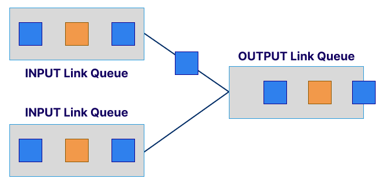
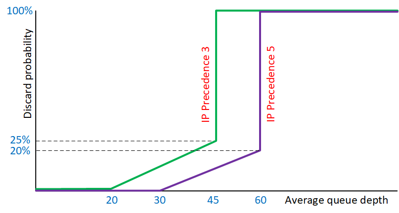
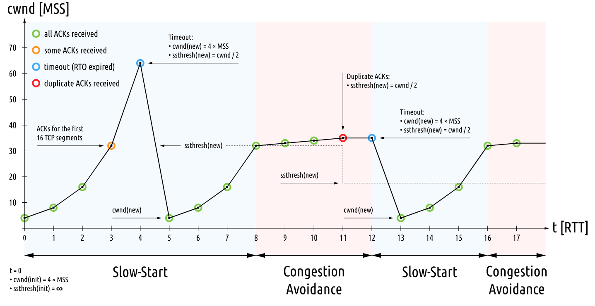

# Optimisation des performances réseau

## Objectifs du cours

- Comprendre et implémenter la QoS (Quality of Service) pour prioriser le trafic réseau
- Maîtriser DSCP et CoS pour identifier et marquer le trafic efficacement
- Différencier le shaping du policing pour gérer les flux de trafic
- Gérer la congestion réseau avec des techniques de buffering intelligentes comme WRED
- Explorer les outils d'optimisation WAN : compression, cache et optimisation de protocoles
- Prendre des décisions de conception qui améliorent l'expérience utilisateur

---

## Introduction à l'Optimisation des Performances Réseau

L'optimisation des performances réseau vise à maximiser l'efficacité, la fiabilité et la réactivité de la transmission de données. Que ce soit un LAN local ou un WAN d'entreprise global, vous devez vous assurer que les applications critiques obtiennent les ressources nécessaires sans être ralenties par du trafic moins important.

```
┌─────────────────────────────────────────────────────────────────────────┐
│                    SANS OPTIMISATION                                    │
├─────────────────────────────────────────────────────────────────────────┤
│                                                                         │
│   VoIP ──────┐                                                          │
│              │                                                          │
│   Video ─────┼────> [  FIFO Queue  ] ────> Sortie                       │
│              │       Tout mélangé !                                     │
│   Backup ────┘                                                          │
│                                                                         │
│   Résultat: Appels VoIP saccadés pendant les backups                    │
│                                                                         │
└─────────────────────────────────────────────────────────────────────────┘

┌─────────────────────────────────────────────────────────────────────────┐
│                    AVEC OPTIMISATION (QoS)                              │
├─────────────────────────────────────────────────────────────────────────┤
│                                                                         │
│   VoIP ──────> [Priority Queue] ─────────────────────> Sortie           │
│                                                          │              │
│   Video ─────> [Queue Normale ] ────────────────────────>│              │
│                                                          │              │
│   Backup ────> [Queue Basse   ] ────────────────────────>│              │
│                                                                         │
│   Résultat: VoIP toujours prioritaire, backups en arrière-plan          │
│                                                                         │
└─────────────────────────────────────────────────────────────────────────┘
```

Un réseau lent ou non réactif peut causer des appels coupés, des vidéoconférences avec lag, des transferts de fichiers échoués et une perte de productivité.

---

## Quality of Service (QoS) : Les Fondamentaux

La Quality of Service est un moyen de prioriser le trafic réseau, garantissant que les données importantes passent même quand la bande passante est limitée. Sans QoS, tout le trafic est traité de manière égale, ce qui n'est pas idéal quand des applications temps réel comme la VoIP ou la vidéoconférence sont en jeu.

### Classification du Trafic

Avant d'appliquer des politiques QoS, nous devons identifier et catégoriser les types de trafic.

| Catégorie | Caractéristiques | Exemples |
|-----------|------------------|----------|
| **Trafic Voix** | Très sensible aux délais et au jitter. Même quelques millisecondes impactent la qualité | VoIP, téléphonie IP |
| **Trafic Vidéo** | Besoin de haut débit et perte de paquets minimale | Vidéoconférence, streaming |
| **Données Bulk** | Pas besoin de livraison temps réel, peut attendre | Backups, mises à jour |
| **Trafic Interactif** | Sensible à la latence mais tolère quelques pertes | Web, email |

Cette classification est la fondation de la QoS. Une fois le trafic catégorisé, il peut être priorisé selon ses besoins.

### DSCP – Differentiated Services Code Point

DSCP est un champ dans l'en-tête IP utilisé pour classifier et gérer le trafic. Il assigne une valeur numérique aux paquets, représentant leur niveau de priorité.

```
┌─────────────────────────────────────────────────────────────────┐
│                     EN-TÊTE IP (IPv4)                           │
├─────────────────────────────────────────────────────────────────┤
│                                                                 │
│   Version │ IHL │   DSCP   │ ECN │  Total Length │ ...          │
│     4     │  5  │ 6 bits   │ 2b  │               │              │
│           │     │          │     │               │              │
│           │     │    ▲     │     │               │              │
│           │     │    │     │     │               │              │
│           │     │ Champ de │     │               │              │
│           │     │ priorité │     │               │              │
│                                                                 │
└─────────────────────────────────────────────────────────────────┘
```

**Valeurs DSCP courantes :**

| Classe | Valeur DSCP | Binaire | Usage |
|--------|-------------|---------|-------|
| **EF** (Expedited Forwarding) | 46 | 101110 | Voix - faible latence garantie |
| **AF41** (Assured Forwarding) | 34 | 100010 | Vidéo interactive |
| **AF31** | 26 | 011010 | Applications critiques |
| **AF21** | 18 | 010010 | Applications importantes |
| **AF11** | 10 | 001010 | Applications standard |
| **BE** (Best Effort) | 0 | 000000 | Trafic général, non critique |

Chaque valeur DSCP correspond à un traitement spécifique à travers les routeurs et switches. Les équipements réseau lisent cette valeur et agissent en conséquence, mettant les paquets haute priorité en tête de file.

### CoS – Class of Service

CoS opère à la Couche 2 (Liaison de données), couramment utilisé dans le tagging VLAN avec 802.1p. Alors que DSCP est appliqué à la Couche 3 (IP), CoS marque les paquets dans les trames Ethernet.

```
┌─────────────────────────────────────────────────────────────────┐
│                    TRAME ETHERNET 802.1Q                        │
├─────────────────────────────────────────────────────────────────┤
│                                                                 │
│   Dest MAC │ Src MAC │ 802.1Q Tag │ EtherType │ Payload │ FCS   │
│            │         │            │           │         │       │
│            │         │     ▼      │           │         │       │
│            │         │ ┌────────┐ │           │         │       │
│            │         │ │PRI│CFI │ │           │         │       │
│            │         │ │3b │1b  │ │           │         │       │
│            │         │ │CoS│    │ │           │         │       │
│            │         │ └────────┘ │           │         │       │
│                                                                 │
└─────────────────────────────────────────────────────────────────┘

Valeurs CoS (3 bits = 8 niveaux) :
  7 = Network Control (plus haute)
  6 = Internetwork Control
  5 = Voice
  4 = Video
  3 = Critical Applications
  2 = Excellent Effort
  1 = Background
  0 = Best Effort (plus basse)
```

DSCP et CoS peuvent fonctionner ensemble : CoS gère le trafic au sein d'un LAN tandis que DSCP s'en occupe à travers un réseau IP routé.

### Shaping vs Policing

Une fois le trafic classifié et marqué, vous devez gérer comment il circule à travers le réseau.

```
POLICING (strict) :

    Trafic ──────> [Policer] ──────> Sortie
        │               │
        │           Rate limit
        │               │
        └───────> DROP si excès


SHAPING (doux) :

    Trafic ──────> [Buffer] ──────> [Shaper] ──────> Sortie
        │              │                │
        │         Stockage          Envoi régulé
        │         temporaire
        │
        └───────> Retardé si excès (pas de perte)
```

| Aspect | Policing | Shaping |
|--------|----------|---------|
| **Action sur excès** | Drop ou re-marquage | Mise en buffer |
| **Impact** | Peut causer des pertes | Ajoute de la latence |
| **Usage typique** | Entrée réseau, SLA | Sortie vers WAN |
| **TCP-friendly** | Non (retransmissions) | Oui (délai contrôlé) |

**Analogie :**
- **Policing** = Radar automatique qui vous met une amende si vous dépassez la limite
- **Shaping** = Feu de régulation d'accès autoroute qui vous fait attendre pour entrer à un rythme sûr

### Exemple Concret

Imaginez une agence qui envoie des backups la nuit. Sans QoS, ces backups pourraient monopoliser tout le lien WAN, dégradant la qualité VoIP. Avec QoS, vous pouvez :
- Assigner au trafic voix une valeur DSCP haute comme EF
- Shaper le trafic backup aux heures creuses
- Maintenir des performances voix impeccables

La QoS n'est pas juste un outil, c'est une philosophie d'équité, garantissant que chaque type de trafic obtient ce dont il a besoin.

---

## Buffering et Gestion de la Congestion

La congestion réseau est inévitable. Trop de données, pas assez de place. Mais la façon dont nous gérons la congestion peut faire une énorme différence sur les performances.

### Qu'est-ce que le Buffering ?

Les routeurs et switches utilisent des buffers pour stocker temporairement les paquets pendant les périodes de congestion. Si l'interface sortante est occupée, les paquets sont mis en file dans le buffer jusqu'à ce que l'interface soit libre.



Le buffering aide à prévenir la perte de paquets, mais il y a une limite à ce qui peut être stocké :
- Buffer **trop petit** → pertes prématurées
- Buffer **trop grand** → augmente la latence et le jitter

### Tail Drop

Tail Drop est la forme la plus basique de gestion de congestion. Quand le buffer est plein, les nouveaux paquets entrants sont simplement supprimés.

```
Buffer avec Tail Drop :

    Paquet 1 ──┐
    Paquet 2 ──┼──> [ 1 | 2 | 3 | 4 | 5 ] ──> Sortie
    Paquet 3 ──┤         Buffer plein
    Paquet 4 ──┤
    Paquet 5 ──┘
    Paquet 6 ──X  DROPPED !
    Paquet 7 ──X  DROPPED !
```

C'est simple mais brutal. Ça ne différencie pas entre les types de paquets ou les priorités. Si vous avez du trafic temps réel derrière un transfert bulk, ils risquent tous d'être supprimés de la même façon.

### WRED – Weighted Random Early Detection

WRED est une amélioration par rapport au Tail Drop. Il gère proactivement le buffer en supprimant aléatoirement des paquets avant qu'il ne soit complètement plein.



**Fonctionnement de WRED :**

```
┌─────────────────────────────────────────────────────────────────┐
│                         WRED                                    │
├─────────────────────────────────────────────────────────────────┤
│                                                                 │
│   Queue Length                                                  │
│        │                                                        │
│   Max ─┼─────────────────────────────────────── Full Drop       │
│        │                              xxxxxxxxx                 │
│        │                        xxxxxx                          │
│   High─┼───────────────────xxxxx                                │
│        │              xxxxx   Drop progressif                   │
│   Low ─┼─────────xxxxx        (aléatoire)                       │
│        │    xxxxx                                               │
│   Min ─┼xxxx─────────────────────────────────── Pas de drop     │
│        │                                                        │
│        └────────────────────────────────────────────>           │
│                    Probabilité de drop                          │
│                                                                 │
└─────────────────────────────────────────────────────────────────┘
```

1. Il surveille la longueur moyenne de la file
2. Si la file grandit, WRED commence à supprimer aléatoirement les paquets basse priorité
3. Les paquets haute priorité ont plus de chances d'être conservés

WRED aide à prévenir la **synchronisation globale** dans les flux TCP. Sans lui, tous les flux TCP pourraient ralentir ensemble quand la congestion arrive, menant à des oscillations de performance.

WRED encourage certains flux à ralentir tôt, permettant un comportement réseau plus fluide.

### Contrôle de Congestion TCP

TCP est intrinsèquement conçu pour gérer la congestion. Ses algorithmes ajustent les taux de transmission basés sur les conditions réseau perçues.



**Mécanismes clés :**

| Phase | Description |
|-------|-------------|
| **Slow Start** | TCP augmente graduellement le taux de transmission jusqu'à détecter une perte |
| **Congestion Avoidance** | Une fois le seuil atteint, la croissance devient linéaire |
| **Fast Retransmit** | Si un paquet est perdu, TCP le retransmet immédiatement en recevant des ACKs dupliqués |
| **Fast Recovery** | Après retransmission, ne revient pas au slow start mais continue à un taux réduit |

```
ÉVOLUTION DE LA FENÊTRE DE CONGESTION TCP :

    cwnd (congestion window)
      │
   32 ┼                    xxxxxxxxx
      │                 xxx         xxx
   16 ┼              xxx               xx
      │           xxx                    x
    8 ┼        xxx                        x Timeout!
      │     xxx   Congestion              │
    4 ┼  xxx      Avoidance              │
      │xxx                               ▼
    2 ┼x  Slow                        Reset
      │   Start                       cwnd
    1 ┼───────────────────────────────────────>
      0        RTT (Round Trip Times)
```

Le comportement de TCP fonctionne main dans la main avec la gestion des buffers. Quand WRED supprime quelques paquets, TCP répond en ralentissant, réduisant la congestion.

Un réglage approprié des tailles de buffer et la compréhension des dynamiques TCP assurent un débit optimal sans induire de jitter ou de pertes.

---

## Techniques d'Optimisation WAN

Les réseaux étendus (WAN) posent des défis uniques dus à la haute latence, la perte de paquets et la bande passante limitée. L'optimisation WAN y répond en améliorant le débit, la réactivité et l'efficacité.

```
┌─────────────────────────────────────────────────────────────────────────┐
│                    OPTIMISATION WAN                                     │
├─────────────────────────────────────────────────────────────────────────┤
│                                                                         │
│   Site A                                              Site B            │
│   ┌─────┐    ┌───────────┐        ┌───────────┐    ┌─────┐              │
│   │ LAN │───>│ WAN       │───────>│ WAN       │───>│ LAN │              │
│   │     │    │ Optimizer │  WAN   │ Optimizer │    │     │              │
│   └─────┘    └───────────┘        └───────────┘    └─────┘              │
│                    │                    │                               │
│              ┌─────┴─────┐        ┌─────┴─────┐                         │
│              │Compression│        │Décompres. │                         │
│              │ Cache     │        │ Cache     │                         │
│              │ Déduplic. │        │ Déduplic. │                         │
│              └───────────┘        └───────────┘                         │
│                                                                         │
└─────────────────────────────────────────────────────────────────────────┘
```

### Compression

La compression réduit la taille des données transmises, menant à des transferts plus rapides et une utilisation réduite de la bande passante.

**Types de compression :**

| Type | Caractéristique | Usage |
|------|-----------------|-------|
| **Lossless** | Aucune donnée perdue | Fichiers texte, emails, configs |
| **Lossy** | Accepte une perte pour plus de compression | Audio, vidéo |

Les moteurs de compression temps réel sur les appliances WAN scannent les données pour des patterns et les compriment à la volée. Cela peut réduire l'utilisation de bande passante de 50% ou plus, selon le type de données.

### Déduplication

La déduplication de données élimine les copies redondantes avant transmission.

```
SANS DÉDUPLICATION :

    Fichier 100 MB ───> 50 sites = 5 GB transmis


AVEC DÉDUPLICATION :

    Fichier 100 MB ───> Site 1 (100 MB)
                   └──> Sites 2-50 : "Déjà en cache !" (références seulement)

    Total transmis : ~100 MB + références
```

Les appliances d'optimisation WAN maintiennent un historique des données transmises. Quand une correspondance est trouvée, seules des références ou des deltas sont envoyés.

C'est particulièrement puissant dans les environnements avec des transferts de fichiers répétés, backups ou systèmes de versioning.

### Caching (Mise en Cache)

Le caching stocke les données fréquemment accédées localement, réduisant le besoin de les récupérer répétitivement à travers le WAN.

**Exemples courants :**

| Type | Description |
|------|-------------|
| **Proxy web** | Cache des sites web |
| **Cache fichiers** | Documents partagés |
| **Cache DNS** | Évite les lookups répétés |
| **Cache objets** | Images, logos, scripts |

Avec un caching intelligent, les utilisateurs expérimentent des temps de chargement plus rapides et les réseaux réduisent le trafic redondant.

### Optimisation de Protocoles

Beaucoup de protocoles réseau n'ont pas été conçus pour des environnements haute latence. L'optimisation WAN inclut des techniques d'optimisation de protocoles pour y remédier.

| Protocole | Problème | Optimisation |
|-----------|----------|--------------|
| **TCP** | Fenêtres petites sur liens haute latence | Accélération TCP, fenêtres agrandies |
| **SMB/CIFS** | Très bavard (nombreux aller-retours) | Batching des requêtes |
| **HTTP/S** | Overhead des handshakes | Connexions persistantes, pipelining |
| **MAPI** | Synchronisation email lente | Compression, cache |

En optimisant les protocoles, nous éliminons les inefficacités qui causeraient autrement des performances médiocres.

### Appliances d'Optimisation WAN

Des vendeurs comme Riverbed, Cisco, et Silver Peak offrent du matériel spécialisé ou des appliances virtuelles pour l'optimisation WAN.

Celles-ci se placent entre le LAN et le WAN et gèrent toute l'optimisation de façon transparente. Elles compriment, cachent, dédupliquent et accélèrent le trafic sans nécessiter de changements sur le client ou le serveur.

Ces outils sont essentiels pour les entreprises avec des agences, des connexions cloud ou des équipes distantes.

---

## Bonnes Pratiques pour l'Optimisation des Performances

| Pratique | Description |
|----------|-------------|
| **Analyser le trafic d'abord** | Utiliser NetFlow, sFlow ou des analyseurs de paquets pour comprendre les patterns avant d'appliquer la QoS |
| **Classifier et marquer tout** | Identifier voix, vidéo et bulk, utiliser DSCP/CoS |
| **Prioriser le temps réel** | Toujours donner la préséance aux applications sensibles à la latence |
| **Surveiller les points de congestion** | Observer l'utilisation des buffers, les drops et l'utilisation des interfaces |
| **Optimiser aux heures creuses** | Planifier les transferts bulk ou backups la nuit ou le week-end |
| **Régler les paramètres TCP** | Ajuster les tailles de fenêtre et le scaling pour les liens haute latence |
| **Utiliser les outils WAN** | Compression, cache et déduplication |
| **Tester continuellement** | Implémenter de petits changements et tester leur impact |

---

## Tableau Récapitulatif

| Technique | Couche | But |
|-----------|--------|-----|
| **QoS** | L2-L4 | Prioriser le trafic |
| **DSCP** | L3 | Marquer les paquets IP |
| **CoS** | L2 | Marquer les trames Ethernet |
| **Policing** | L3 | Limiter strictement le débit |
| **Shaping** | L3 | Lisser le trafic |
| **WRED** | L3-L4 | Prévenir la congestion |
| **Compression** | L4-L7 | Réduire la taille des données |
| **Déduplication** | L7 | Éliminer les redondances |
| **Caching** | L7 | Stocker localement |

---

## Glossaire

| Terme | Définition |
|-------|------------|
| **QoS** | Quality of Service - ensemble de techniques pour prioriser le trafic |
| **DSCP** | Differentiated Services Code Point - champ de l'en-tête IP pour la priorité |
| **CoS** | Class of Service - priorité au niveau Ethernet (802.1p) |
| **Shaping** | Mise en forme du trafic avec buffer |
| **Policing** | Limitation stricte avec drop |
| **WRED** | Weighted Random Early Detection - drop préventif intelligent |
| **Tail Drop** | Suppression des paquets quand le buffer est plein |
| **cwnd** | Congestion Window - fenêtre de congestion TCP |
| **RTT** | Round-Trip Time - temps aller-retour |
| **WAN** | Wide Area Network - réseau étendu |
| **Déduplication** | Élimination des données redondantes |
| **Latence** | Délai de transmission |
| **Jitter** | Variation du délai |

---

## Schéma Récapitulatif

```
ARCHITECTURE QoS COMPLÈTE :

    CLASSIFICATION         MARQUAGE            QUEUING            SCHEDULING
    ─────────────         ────────            ───────            ──────────

    Voix ─────────────> DSCP EF ──────> Priority Queue ──────┐
                                                             │
    Vidéo ────────────> DSCP AF41 ───> Queue Haute ──────────┼──> Sortie
                                                             │
    Web ──────────────> DSCP AF21 ───> Queue Moyenne ────────┤
                                                             │
    Backup ───────────> DSCP BE ─────> Queue Basse ──────────┘


GESTION DE CONGESTION :

    Situation normale          Congestion légère         Congestion sévère
    ─────────────────          ─────────────────         ─────────────────

    [     |     ]              [  |||||||  ]             [|||||||||||||||]
    Buffer vide                WRED actif                Tail Drop
    Pas de drop                Drop sélectif             Drop massif


OPTIMISATION WAN - FLUX :

    Données originales                    Données optimisées
    ──────────────────                    ──────────────────

    ┌────────────────┐                    ┌──────────────────┐
    │ 1 GB de données│                    │ Compressé: 400MB │
    │                │───> Compression ───>│ Dédupliqué: 50MB│
    │                │                    │ Envoyé: 50 MB    │
    └────────────────┘                    └──────────────────┘

    Réduction: 95% de bande passante économisée !


DÉCISION QoS :

                        Paquet entrant
                              │
                              ▼
                    ┌─────────────────┐
                    │  Classification │
                    │  (ACL, ports,   │
                    │   protocoles)   │
                    └────────┬────────┘
                             │
                    ┌────────┴────────┐
                    │    Marquage     │
                    │  (DSCP / CoS)   │
                    └────────┬────────┘
                             │
              ┌──────────────┼──────────────┐
              │              │              │
              ▼              ▼              ▼
        ┌─────────┐    ┌─────────┐    ┌─────────┐
        │ Priority│    │ Normal  │    │  Low    │
        │  Queue  │    │  Queue  │    │  Queue  │
        └────┬────┘    └────┬────┘    └────┬────┘
             │              │              │
             └──────────────┼──────────────┘
                            │
                            ▼
                    ┌───────────────┐
                    │  Scheduling   │
                    │ (WFQ, CBWFQ,  │
                    │    LLQ...)    │
                    └───────────────┘
                            │
                            ▼
                        Interface
                         sortante
```

---

## Ressources

- [QoS Explained - Cisco](https://www.cisco.com/c/en/us/td/docs/ios-xml/ios/qos/configuration/xe-16/qos-xe-16-book.html)
- [WAN Optimization Explained - Cloudflare](https://www.cloudflare.com/learning/performance/what-is-wan-optimization/)
