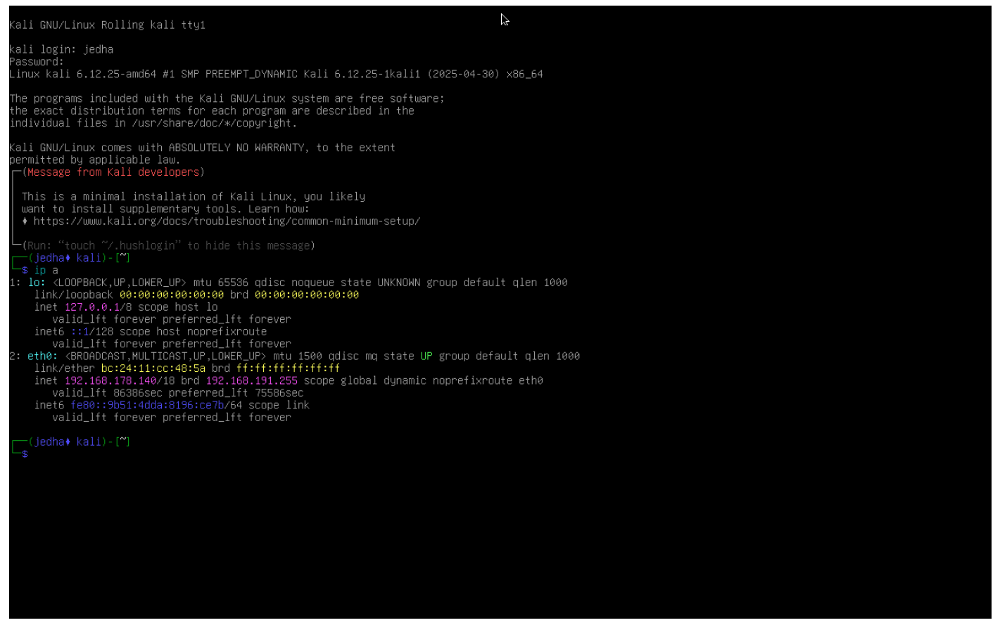
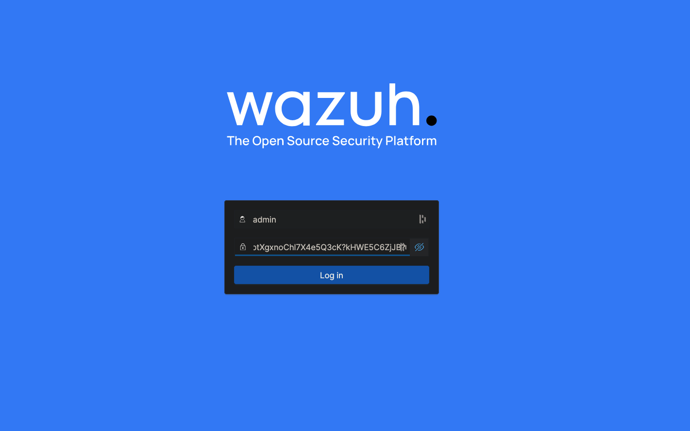

# Détection et Chasse aux Menaces

## Objectifs du cours

- Utiliser les données NetFlow pour repérer les comportements réseau anormaux et les compromissions possibles
- Comprendre comment les attaquants utilisent SNMP pour cartographier votre réseau
- Agréger et corréler les logs avec des plateformes SIEM comme ELK, Splunk, Wazuh
- Détecter l'exfiltration, le mouvement latéral et la reconnaissance avec des insights temps réel
- Concevoir des stratégies d'alerte intelligentes pour repérer les vraies menaces sans se noyer dans le bruit

---

## NetFlow pour la Détection de Compromission

NetFlow est l'un des outils les plus sous-estimés pour comprendre ce qui se passe réellement sur votre réseau. NetFlow ne concerne pas le contenu des communications, mais les métadonnées. C'est comme obtenir la liste de tous les appels téléphoniques : qui a appelé qui, quand, pendant combien de temps. Vous n'entendez pas la conversation, mais les patterns racontent une histoire.

### Qu'est-ce que NetFlow ?

NetFlow est un protocole réseau développé par Cisco qui collecte les informations de trafic IP lorsqu'il entre ou sort d'une interface.

```
┌─────────────────────────────────────────────────────────────────────────┐
│                         ENREGISTREMENT NETFLOW                          │
├─────────────────────────────────────────────────────────────────────────┤
│                                                                         │
│   ┌───────────────────────────────────────────────────────────────┐    │
│   │  Source IP        : 192.168.1.50                              │    │
│   │  Destination IP   : 185.143.223.47                            │    │
│   │  Source Port      : 49152                                     │    │
│   │  Destination Port : 443                                       │    │
│   │  Protocol         : TCP                                       │    │
│   │  Start Time       : 2024-01-15 14:32:15                       │    │
│   │  End Time         : 2024-01-15 14:45:23                       │    │
│   │  Packets          : 15,847                                    │    │
│   │  Bytes            : 847,392,156 (808 MB)                      │    │
│   └───────────────────────────────────────────────────────────────┘    │
│                                                                         │
│   → Qui parle à qui, quand, combien de temps, combien de données       │
│                                                                         │
└─────────────────────────────────────────────────────────────────────────┘
```

**Champs clés des enregistrements NetFlow :**

| Champ | Description |
|-------|-------------|
| Source/Destination IP | Qui communique avec qui |
| Source/Destination Port | Quels services sont utilisés |
| Protocol | TCP, UDP, ICMP... |
| Timestamps | Quand la communication a eu lieu |
| Packet/Byte counts | Volume de données échangées |
| Interface indexes | Par où le trafic passe |

NetFlow capture le **qui, quoi, où, quand et combien**, parfait pour l'analyse de sécurité.

### Détecter l'Exfiltration de Données

L'exfiltration de données se produit quand des données sensibles sont transférées hors de votre réseau vers un emplacement externe non autorisé. Cela arrive souvent via des protocoles qui se fondent dans la masse : HTTPS, tunneling DNS, ou même FTP.

```
┌─────────────────────────────────────────────────────────────────────────┐
│                     INDICATEURS D'EXFILTRATION                          │
├─────────────────────────────────────────────────────────────────────────┤
│                                                                         │
│  1. VOLUME INHABITUEL                                                   │
│     ──────────────────                                                  │
│     Normal:  Poste → Internet : 50 MB/jour                             │
│     Suspect: Poste → IP étrangère : 15 GB en 2 heures                  │
│                                                                         │
│  2. NOUVEAU PROTOCOLE                                                   │
│     ────────────────                                                    │
│     Normal:  Poste utilise HTTP, HTTPS                                 │
│     Suspect: Poste commence soudainement à utiliser FTP ou SSH          │
│                                                                         │
│  3. FLUX LONGUE DURÉE                                                   │
│     ─────────────────                                                   │
│     Normal:  Connexions de quelques minutes                            │
│     Suspect: Connexion active pendant 8 heures sans interruption       │
│                                                                         │
│  4. PATTERN DE BEACONING                                                │
│     ──────────────────                                                  │
│     Normal:  Connexions aléatoires                                     │
│     Suspect: Connexion toutes les 60 secondes exactement (C2)          │
│                                                                         │
└─────────────────────────────────────────────────────────────────────────┘
```

**Signes à rechercher dans NetFlow :**

| Pattern | Indicateur | Risque |
|---------|------------|--------|
| Volume inhabituel vers IPs externes | Appareil qui envoie normalement quelques KB et pousse soudainement des centaines de MB | Exfiltration |
| Nouveau protocole utilisé | Appareil qui commence à utiliser SSH ou FTP sans raison | Tunnel de données |
| Flux de longue durée | Connexions qui restent actives pendant des heures | C2 (Command & Control) |
| Pattern de beaconing | Connexions répétées à intervalle fixe (ex: toutes les 60 secondes) | Malware/Implant |

NetFlow peut révéler tous ces patterns d'un coup d'œil, souvent avant qu'une inspection de paquets complète ou un antivirus ne réagisse.

### Détecter les Connexions Anormales

NetFlow excelle à révéler les comportements "bizarres", surtout quand vous avez d'abord établi une baseline du trafic normal.

```
BASELINE NORMALE :                    ANOMALIE DÉTECTÉE :
─────────────────                     ──────────────────

Poste comptabilité :                  Poste comptabilité :
  → ERP (443)                           → ERP (443)
  → Mail (993)                          → Mail (993)
  → Internet (80/443)                   → Internet (80/443)
                                        → 50 serveurs internes (445) ← NOUVEAU !
                                        → IP russe (443) ← NOUVEAU !
```

**À surveiller :**

| Comportement | Description | Interprétation |
|--------------|-------------|----------------|
| **Port Scanning** | Nombreux flux courts vers multiples ports sur plusieurs IPs | Reconnaissance |
| **Mouvement Latéral** | Machine utilisateur accédant soudainement à plusieurs systèmes internes via SMB ou RDP | Compromission possible |
| **Systèmes internes allant vers l'extérieur** | Imprimante faisant des connexions HTTPS vers Internet | Très suspect |

La magie opère quand vous établissez une baseline de votre environnement et utilisez NetFlow pour voir les anomalies.

---

## SNMP comme Vecteur de Reconnaissance

SNMP, le Simple Network Management Protocol, est censé aider les administrateurs à gérer les équipements réseau (imprimantes, switches, routeurs), mais il peut aussi aider les attaquants à construire une carte détaillée de votre environnement.

### Comment les Attaquants Utilisent SNMP

```
┌─────────────────────────────────────────────────────────────────────────┐
│                    RECONNAISSANCE VIA SNMP                              │
├─────────────────────────────────────────────────────────────────────────┤
│                                                                         │
│   Attaquant                          Réseau Cible                       │
│   ──────────                         ────────────                       │
│                                                                         │
│   1. Scan du réseau                                                     │
│      └──> Découverte port UDP 161 ouvert                               │
│                                                                         │
│   2. Test community string "public"                                     │
│      └──> Succès ! (string par défaut non changé)                      │
│                                                                         │
│   3. Requête SNMP Walk                                                  │
│      └──> Récupération de :                                            │
│           • Nom du système                                              │
│           • Version OS                                                  │
│           • Interfaces réseau                                           │
│           • Table de routage                                            │
│           • Utilisateurs connectés                                      │
│           • Processus en cours                                          │
│           • Logiciels installés                                         │
│                                                                         │
│   RÉSULTAT: Carte complète du réseau !                                 │
│                                                                         │
└─────────────────────────────────────────────────────────────────────────┘
```

**Informations récupérables via SNMP :**

| OID | Information | Utilité pour l'attaquant |
|-----|-------------|--------------------------|
| sysDescr | Description du système, version OS | Identifier les vulnérabilités |
| sysName | Nom du système | Cartographie |
| ifTable | Interfaces réseau | Comprendre la topologie |
| ipRouteTable | Table de routage | Identifier les passerelles |
| hrSWRunName | Processus en cours | Identifier les services |
| hrSWInstalledName | Logiciels installés | Trouver des cibles |

### Se Défendre contre la Reconnaissance SNMP

| Mesure | Description |
|--------|-------------|
| **Désactiver SNMP** si non utilisé | Beaucoup d'imprimantes et routeurs l'ont activé par défaut |
| **Utiliser SNMPv3** | Toujours utiliser les versions sécurisées avec authentification et chiffrement |
| **Changer les community strings** | Ne jamais utiliser `public` ou `private` |
| **Restreindre l'accès SNMP** | N'autoriser les requêtes que depuis les stations de management |
| **Surveiller les logs SNMP** | Toute requête inattendue doit être investiguée |

SNMP est comme une fenêtre sur votre réseau. Ne la laissez pas grande ouverte.

---

## Agrégation de Logs avec les Plateformes SIEM

Passons au cœur de la chasse aux menaces moderne : l'agrégation et la corrélation de logs avec un système SIEM (Security Information and Event Management).

Chaque équipement de votre réseau génère des logs : tentatives d'authentification, statistiques de trafic, violations de politique, détections de malware. Mais sans centralisation, ces logs sont juste du bruit isolé.

**Le SIEM les rassemble, connecte les points, et raconte l'histoire.**

### Qu'est-ce qu'un SIEM ?


Un **SIEM** (Security Information and Event Management) est un système qui :
- Collecte les logs et événements de sécurité de multiples sources
- Normalise et indexe les données
- Permet la corrélation, les alertes temps réel et la détection d'incidents

Les SIEM modernes vont au-delà de l'agrégation de logs basique. Ils incluent souvent :
- Intégration de threat intelligence
- Analyse comportementale utilisateurs et entités (UEBA)
- Capacités de réponse automatisée

Ce sont des outils essentiels dans tout Security Operations Center (SOC).

### Wazuh : SIEM Open Source

Une des plateformes SIEM open source les plus populaires est **Wazuh**. Elle offre :
- Analyse complète des logs
- Monitoring d'intégrité des fichiers
- Détection de vulnérabilités
- Réponse automatisée aux menaces



Combiné avec la stack ELK pour l'indexation et la visualisation, Wazuh fournit une visibilité sécurité de niveau entreprise avec la flexibilité et la transparence de l'open source.



### Autres Plateformes SIEM

| Plateforme | Type | Caractéristiques |
|------------|------|------------------|
| **Splunk** | Commercial | Très scalable, recherche puissante, visualisations avancées |
| **ELK Stack** | Open Source | Elasticsearch + Logstash + Kibana, base pour de nombreux SIEM |
| **Wazuh** | Open Source | SIEM complet, FIM, détection vulnérabilités |
| **IBM QRadar** | Enterprise | Intégration profonde, compliance, analytics avancés |
| **Microsoft Sentinel** | Cloud | SIEM cloud-native, intégration Azure |

### Centraliser les Logs

```
┌─────────────────────────────────────────────────────────────────────────┐
│                    ARCHITECTURE SIEM                                    │
├─────────────────────────────────────────────────────────────────────────┤
│                                                                         │
│   SOURCES                    COLLECTE              ANALYSE              │
│   ───────                    ────────              ───────              │
│                                                                         │
│   Firewalls ─────────┐                                                  │
│                      │                                                  │
│   IDS/IPS ───────────┤                        ┌──────────────────┐     │
│                      │       ┌────────┐       │                  │     │
│   Serveurs ──────────┼──────>│ SIEM   │──────>│  CORRÉLATION     │     │
│                      │       │        │       │  ALERTES         │     │
│   Switches/Routeurs ─┤       │Logstash│       │  DASHBOARDS      │     │
│                      │       │Beats   │       │  THREAT HUNTING  │     │
│   Endpoints ─────────┤       └────────┘       │                  │     │
│                      │                        └──────────────────┘     │
│   Applications ──────┘                                                  │
│                                                                         │
└─────────────────────────────────────────────────────────────────────────┘
```

**Un bon setup SIEM ingère des logs depuis :**

| Source | Type de logs |
|--------|--------------|
| **Firewalls** | Deny/allow, tentatives d'intrusion |
| **IDS/IPS** | Alertes signatures, comportements suspects |
| **Serveurs** | Authentification, accès fichiers |
| **Switches/Routeurs** | SNMP traps, statut ports |
| **Endpoints** | Antivirus, logs locaux |
| **Applications** | Logs serveur web, systèmes email |

**Formats de logs courants :**

| Format | Usage |
|--------|-------|
| **Syslog** | Très utilisé par les devices UNIX/Linux |
| **SNMP Traps** | Messages d'alerte des équipements réseau |
| **Windows Event Logs** | Via agents ou Winlogbeat |
| **Custom App Logs** | Parsés avec Logstash ou similaire |

Tous ces logs sont parsés, enrichis (avec géolocalisation IP ou feeds de menaces), et indexés pour une recherche facile.

### Corrélation d'Événements et Détection de Menaces

C'est là que le SIEM brille : corréler les événements à travers les équipements et le temps.

```
┌─────────────────────────────────────────────────────────────────────────┐
│                    EXEMPLE DE CORRÉLATION                               │
├─────────────────────────────────────────────────────────────────────────┤
│                                                                         │
│   ÉVÉNEMENT 1 (isolé = normal)                                         │
│   ────────────────────────────                                         │
│   09:00 - Login réussi depuis Paris (France)                           │
│   User: jean.dupont                                                     │
│                                                                         │
│   ÉVÉNEMENT 2 (isolé = normal)                                         │
│   ────────────────────────────                                         │
│   09:03 - Login VPN réussi depuis Pékin (Chine)                        │
│   User: jean.dupont                                                     │
│                                                                         │
│   CORRÉLATION = ALERTE !                                               │
│   ────────────────────────                                             │
│   Impossible d'être à Paris ET Pékin à 3 minutes d'intervalle !        │
│   → COMPROMISSION PROBABLE                                             │
│                                                                         │
└─────────────────────────────────────────────────────────────────────────┘
```

**Autres cas d'usage de corrélation :**

| Pattern Détecté | Interprétation |
|-----------------|----------------|
| Multiples logins échoués suivis d'un succès | Attaque par brute-force |
| Utilisateur télécharge 10GB du serveur de fichiers à minuit | Menace interne |
| Firewall voit des connexions sortantes vers domaines C2 connus | Malware beaconing |
| Création de compte admin + accès sensible + exfiltration | Kill chain complète |

En définissant des règles de corrélation, vous pouvez détecter des comportements complexes qu'aucun équipement seul ne remarquerait.

### SIEM et Threat Hunting

Le **threat hunting** est une activité proactive. Au lieu d'attendre les alertes, les analystes interrogent le SIEM pour découvrir les menaces cachées.

**Exemples de chasses :**

| Hunt | Requête |
|------|---------|
| IP malveillante | Trouver tous les hosts qui se sont connectés à une IP nouvellement découverte comme malveillante |
| DNS suspect | Identifier les devices avec une augmentation soudaine de requêtes DNS |
| PowerShell | Rechercher les patterns d'exécution PowerShell sur tous les endpoints |
| Mouvement latéral | Tracer le mouvement latéral via les logs RDP ou SMB |

Les bonnes plateformes SIEM permettent des requêtes sauvegardées, des dashboards et des alertes programmées, rendant le hunting scalable et répétable.

### Réduire le Bruit

Une des parties les plus difficiles du déploiement SIEM est d'éviter la **fatigue d'alertes**. Avec des milliers de logs par seconde, un mauvais tuning mène à d'interminables faux positifs.

**Conseils pour réduire le bruit :**

| Technique | Description |
|-----------|-------------|
| **Baseline comportementale** | Alerter uniquement sur les déviations |
| **Feeds de threat intelligence** | Filtrer les événements bénins connus |
| **Niveaux de sévérité** | Les événements critiques doivent être peu nombreux et clairs |
| **Implication des analystes** | Les faire affiner continuellement les règles basées sur les vraies investigations |

Un SIEM n'est utile que s'il est bien tunné. Une configuration soignée transforme une jungle de logs bruyante en mine d'or d'insights sécurité.

---

## Bonnes Pratiques pour la Détection de Menaces

| Pratique | Description |
|----------|-------------|
| **Logger tout ce qui est important** | Surtout les logins échoués, exécutions de commandes, créations de processus, connexions réseau |
| **Filtrer tôt** | Utiliser les équipements réseau pour éliminer le bruit non pertinent avant le SIEM |
| **Corréler largement** | Toujours essayer de connecter les logs à travers équipements, utilisateurs et temps |
| **Établir une baseline** | Qu'est-ce qui est "normal" sur votre réseau ? Tout ce qui est en dehors mérite un second regard |
| **Enrichir les logs** | Ajouter rôles utilisateurs, types d'équipements, niveaux de risque pour des recherches plus significatives |
| **Surveiller le "low and slow"** | Beaucoup d'attaquants évitent la détection en restant sous le radar. Chercher les petites anomalies sur de longues périodes |
| **Tester les règles de détection** | Simuler des attaques (ex: Atomic Red Team) et vérifier que les alertes se déclenchent |
| **Former continuellement** | La détection est à la fois un art et une science. Garder l'équipe affûtée avec des exercices |

La détection de menaces n'est pas d'attraper chaque alerte, c'est d'attraper les bonnes.

---

## Tableau Récapitulatif

| Outil/Technique | Usage | Ce qu'il détecte |
|-----------------|-------|------------------|
| **NetFlow** | Analyse métadonnées trafic | Exfiltration, beaconing, mouvement latéral |
| **SNMP Monitoring** | Surveillance des requêtes SNMP | Reconnaissance attaquant |
| **SIEM** | Agrégation et corrélation logs | Patterns d'attaque complexes |
| **Threat Hunting** | Recherche proactive | Menaces cachées |
| **Baseline** | Établir le "normal" | Anomalies comportementales |

---

## Glossaire

| Terme | Définition |
|-------|------------|
| **NetFlow** | Protocole de collecte de métadonnées trafic réseau |
| **SIEM** | Security Information and Event Management |
| **Exfiltration** | Transfert non autorisé de données hors du réseau |
| **Beaconing** | Communication régulière d'un malware vers son C2 |
| **C2/C&C** | Command and Control - serveur de contrôle des malwares |
| **Mouvement latéral** | Progression d'un attaquant à travers le réseau interne |
| **Threat Hunting** | Recherche proactive de menaces cachées |
| **IOC** | Indicator of Compromise - indicateur de compromission |
| **UEBA** | User and Entity Behavior Analytics |
| **SOC** | Security Operations Center |
| **Corrélation** | Mise en relation d'événements pour détecter des patterns |
| **Baseline** | Comportement normal de référence |

---

## Schéma Récapitulatif

```
WORKFLOW DE DÉTECTION :

    COLLECTE                ANALYSE                RÉPONSE
    ────────                ───────                ───────

    NetFlow ────┐
                │
    SNMP ───────┼─────> SIEM ─────> Corrélation ─────> Alerte
                │         │
    Logs ───────┤         │
                │         ▼
    Endpoints ──┘    Threat Hunting ─────> Investigation


INDICATEURS D'EXFILTRATION (NetFlow) :

    NORMAL                          SUSPECT
    ──────                          ───────

    Volume: 50 MB/jour              Volume: 15 GB/2h
    Destinations: connues           Destination: IP étrangère
    Protocoles: HTTP/HTTPS          Protocole: nouveau (FTP, SSH)
    Durée: connexions courtes       Durée: flux 8h continu
    Pattern: aléatoire              Pattern: toutes les 60s


CORRÉLATION SIEM :

    Événement A             Événement B            Événement C
    (seul = OK)            (seul = OK)            (seul = OK)
         │                      │                      │
         └──────────────────────┼──────────────────────┘
                                │
                                ▼
                          CORRÉLATION
                                │
                                ▼
                    Pattern détecté = ALERTE !


DÉFENSE SNMP :

    VULNÉRABLE                      SÉCURISÉ
    ──────────                      ────────

    SNMPv1/v2c                      SNMPv3
    Community: "public"             Auth + Chiffrement
    Accès: tout le monde            Accès: stations autorisées
    Logs: non surveillés            Logs: surveillés


ARCHITECTURE THREAT HUNTING :

    ┌─────────────────────────────────────────────────────────┐
    │                      SIEM                               │
    ├─────────────────────────────────────────────────────────┤
    │                                                         │
    │   Requêtes sauvegardées ────> Dashboards               │
    │         │                          │                    │
    │         ▼                          ▼                    │
    │   Threat Hunting            Alertes automatiques       │
    │         │                          │                    │
    │         ▼                          ▼                    │
    │   Investigation ──────────> Incident Response          │
    │                                                         │
    └─────────────────────────────────────────────────────────┘
```

---

## Ressources

- [NetFlow for Security Monitoring](https://www.cisco.com/c/en/us/products/ios-nx-os-software/ios-netflow/index.html)
- [SNMP Pentest – HackTricks](https://book.hacktricks.xyz/network-services-pentesting/pentesting-snmp)
- [SIEM Basics – Varonis](https://www.varonis.com/blog/what-is-siem)
- [Wazuh Documentation](https://documentation.wazuh.com/)
