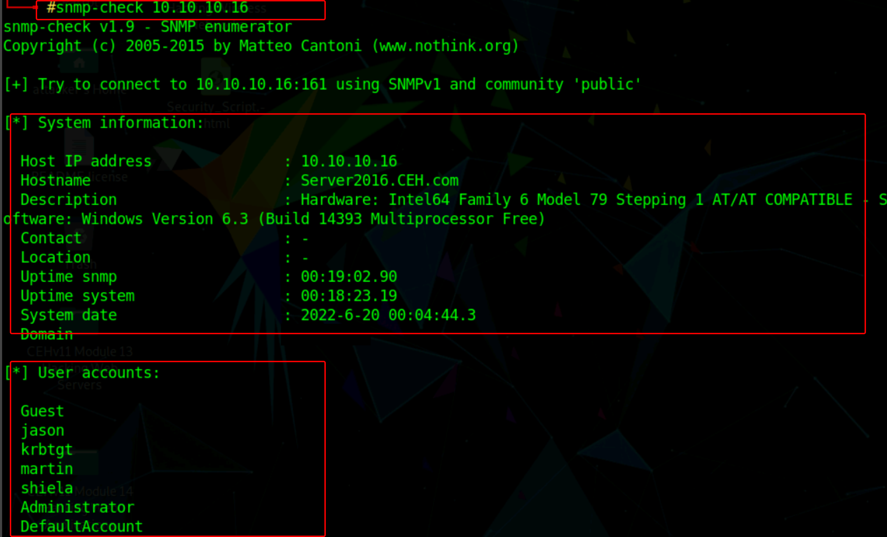

# Monitoring et énumération (red team)

## Objectifs du cours

- Comprendre le rôle de SNMP dans la reconnaissance red team et comment il expose des données réseau sensibles
- Maîtriser les méthodes utilisées par les attaquants pour découvrir et identifier les services
- Comprendre comment les informations SNMP contribuent à la planification d'attaque et au mouvement latéral
- Utiliser des requêtes personnalisées et les structures SNMP pour du renseignement ciblé
- Appliquer les stratégies et bonnes pratiques d'énumération red team en environnement entreprise

---

## Énumération SNMP et Son Rôle dans la Reconnaissance

SNMP (Simple Network Management Protocol) est conçu pour la surveillance et la gestion à distance des équipements réseau. Il simplifie les tâches administratives, mais quand il est mal sécurisé, il devient une source de renseignement involontaire pour les adversaires.

### Comment SNMP Expose Votre Réseau

```
┌─────────────────────────────────────────────────────────────────────────┐
│                    CE QUE SNMP RÉVÈLE AUX ATTAQUANTS                    │
├─────────────────────────────────────────────────────────────────────────┤
│                                                                         │
│   Attaquant                              Équipement SNMP                │
│   ──────────                             ───────────────                │
│                                                                         │
│   "Community = public ?" ─────────────> Port UDP 161                   │
│                                               │                         │
│           <────────────────────────────── "Oui !"                      │
│                                               │                         │
│   snmpwalk ─────────────────────────────────>│                         │
│                                               │                         │
│           <──────────────────────────────────│                         │
│                                                                         │
│   INFORMATIONS RÉCUPÉRÉES :                                            │
│   ─────────────────────────                                            │
│   • Type d'équipement et vendor                                        │
│   • Versions logicielles                                               │
│   • Interfaces et adresses IP                                          │
│   • Uptime du système                                                  │
│   • Contact et localisation physique                                   │
│   • Tables de routage                                                  │
│   • Cache ARP (voisins actifs)                                         │
│   • Processus en cours                                                 │
│   • Ports TCP/UDP en écoute                                            │
│                                                                         │
│   → CARTE COMPLÈTE DU RÉSEAU INTERNE                                   │
│                                                                         │
└─────────────────────────────────────────────────────────────────────────┘
```

SNMP communique via UDP, principalement sur les ports :
- **161** : pour les requêtes (queries)
- **162** : pour les messages trap

Au cœur de SNMP se trouve la **MIB** (Management Information Base), qui organise les données dans un arbre structuré d'**OID** (Object Identifiers). Ces identifiants permettent des requêtes très granulaires.

### Risque d'un Seul Équipement Mal Configuré

Avec un seul switch ou routeur mal configuré, un attaquant peut :
- Révéler la structure interne du réseau
- Préparer sa prochaine action avec précision chirurgicale
- Identifier les cibles prioritaires
- Planifier le mouvement latéral

---

## Utiliser snmp-check pour l'Énumération

`snmp-check` est un outil de reconnaissance pratique qui permet aux professionnels de sécurité (et aux attaquants) d'interroger les équipements SNMP et de récupérer des informations détaillées. Il est particulièrement efficace contre les équipements utilisant SNMPv1 ou SNMPv2 avec des community strings par défaut ou mal configurés.

### Installation

```bash
# Sur Kali Linux ou système Debian
sudo apt update
sudo apt install snmpcheck
```

### Utilisation de Base

```bash
# Utilise "public" par défaut
snmp-check -t 192.168.1.1

# Avec une community string personnalisée
snmp-check -t 192.168.1.1 -c myCustomString

# Mode verbeux
snmp-check -t 192.168.1.1 -v
```

### Exemple de Sortie



**La sortie inclut typiquement :**

| Catégorie | Informations |
|-----------|--------------|
| **System Info** | Hostname, version OS, uptime |
| **Network Interfaces** | IPs, MACs, status, VLANs |
| **Routing Table** | Routes statiques et dynamiques |
| **ARP Table** | Correspondances IP-MAC |
| **TCP Connections** | Ports en écoute, connexions actives |
| **UDP Listeners** | Services UDP actifs |
| **Running Processes** | Liste des processus |
| **Installed Software** | Applications installées |

### Usage Défensif

Si vous défendez un réseau, exécuter `snmp-check` contre votre propre infrastructure révèle ce que vous exposez involontairement. **Si vous pouvez le voir, un attaquant aussi.**

---

## Énumération et Fingerprinting de Services

Au-delà de SNMP, les opérations red team reposent sur la compréhension des services actifs sur chaque hôte et de leur comportement sous examen.

### Workflow d'Énumération Typique

```
┌─────────────────────────────────────────────────────────────────────────┐
│                    WORKFLOW D'ÉNUMÉRATION                               │
├─────────────────────────────────────────────────────────────────────────┤
│                                                                         │
│   1. DÉCOUVERTE DES PORTS                                              │
│      ────────────────────                                              │
│      nmap -sS -p- target                                               │
│      → Ports ouverts : 22, 80, 443, 3306, 8080                         │
│                                                                         │
│   2. IDENTIFICATION DES SERVICES                                        │
│      ───────────────────────                                           │
│      nmap -sV -p 22,80,443,3306,8080 target                            │
│      → SSH, Apache, MySQL, Tomcat                                      │
│                                                                         │
│   3. FINGERPRINTING                                                     │
│      ─────────────                                                     │
│      Requêtes HTTP, banners SMTP, handshakes TLS                       │
│      → Apache 2.4.29, OpenSSH 7.4, MySQL 5.7.21                        │
│                                                                         │
│   4. RECHERCHE DE VULNÉRABILITÉS                                       │
│      ───────────────────────────                                       │
│      CVE databases, exploit-db                                          │
│      → Apache 2.4.29 vulnérable à CVE-2019-0211                        │
│                                                                         │
└─────────────────────────────────────────────────────────────────────────┘
```

### Techniques de Fingerprinting

| Technique | Description | Exemple |
|-----------|-------------|---------|
| **Banner Grabbing** | Récupérer les bannières de service | `nc -v target 22` |
| **HTTP Headers** | Analyser les en-têtes de réponse | `curl -I target` |
| **TLS Handshake** | Examiner les certificats et ciphers | `openssl s_client -connect target:443` |
| **Error Messages** | Provoquer des erreurs révélatrices | Requêtes malformées |
| **Favicon Hash** | Identifier via l'icône web | Shodan favicon search |
| **Timing Analysis** | Différences de temps de réponse | Versions spécifiques |

### Corrélation avec les Vulnérabilités

Une fois le fingerprinting terminé, les red teamers connectent les services aux vulnérabilités connues :

```
SERVICE IDENTIFIÉ                    VULNÉRABILITÉ POTENTIELLE
─────────────────                    ─────────────────────────
Apache 2.4.29            ───────>    CVE-2019-0211 (Privilege Escalation)
OpenSSH 7.4              ───────>    CVE-2018-15473 (User Enumeration)
MySQL 5.7.21             ───────>    CVE-2017-3600 (RCE via UDF)
SMBv1                    ───────>    EternalBlue (MS17-010)
```

---

## Utiliser SNMP pour le Mapping Réseau

SNMP révèle bien plus que l'identité de l'équipement sur lequel il tourne. Il offre un aperçu de ses voisins, ce qui en fait un atout unique pour la découverte d'hôtes et le mapping de topologie.

### Informations de Mapping Disponibles via SNMP

```
┌─────────────────────────────────────────────────────────────────────────┐
│                    MAPPING RÉSEAU VIA SNMP                              │
├─────────────────────────────────────────────────────────────────────────┤
│                                                                         │
│   INTERFACES (ifTable)                                                  │
│   ────────────────────                                                  │
│   • Adresses MAC                                                        │
│   • Configurations IP                                                   │
│   • Status opérationnel                                                │
│   • Assignations VLAN                                                   │
│                                                                         │
│   TABLE ARP (ipNetToMediaTable)                                        │
│   ─────────────────────────────                                        │
│   • Correspondances IP → MAC                                           │
│   • Hôtes actifs sur le subnet local                                   │
│   → Liste instantanée des voisins !                                    │
│                                                                         │
│   TABLE DE ROUTAGE (ipRouteTable)                                      │
│   ────────────────────────────────                                     │
│   • Chemins connus dans le réseau                                      │
│   • Subnets distants non visibles autrement                            │
│   • Next-hop vers d'autres segments                                    │
│                                                                         │
│   DESCRIPTION SYSTÈME (sysDescr)                                       │
│   ───────────────────────────────                                      │
│   • Type d'équipement                                                  │
│   • Rôle (DC, serveur fichiers, imprimante...)                         │
│                                                                         │
└─────────────────────────────────────────────────────────────────────────┘
```

### Construction d'une Carte Réseau

```
                    SNMP Query
                        │
                        ▼
    ┌───────────────────────────────────────────────┐
    │              ROUTEUR CENTRAL                   │
    │         IP: 192.168.1.1                       │
    │                                               │
    │  Interfaces:                                  │
    │    eth0: 192.168.1.1/24  (LAN)               │
    │    eth1: 10.0.0.1/24     (Serveurs)          │
    │    eth2: 172.16.0.1/24   (DMZ)               │
    │                                               │
    │  Routes:                                      │
    │    192.168.2.0/24 via 192.168.1.254          │
    │    10.10.0.0/16 via 10.0.0.254               │
    │                                               │
    │  ARP Cache:                                   │
    │    192.168.1.10 → AA:BB:CC:DD:EE:01          │
    │    192.168.1.20 → AA:BB:CC:DD:EE:02          │
    │    192.168.1.30 → AA:BB:CC:DD:EE:03          │
    └───────────────────────────────────────────────┘
                        │
                        ▼
    ┌───────────────────────────────────────────────┐
    │           CARTE RÉSEAU CONSTRUITE             │
    ├───────────────────────────────────────────────┤
    │                                               │
    │  LAN (192.168.1.0/24)                        │
    │    ├── 192.168.1.10 (actif)                  │
    │    ├── 192.168.1.20 (actif)                  │
    │    └── 192.168.1.30 (actif)                  │
    │                                               │
    │  Serveurs (10.0.0.0/24)                      │
    │    └── Route vers 10.10.0.0/16               │
    │                                               │
    │  DMZ (172.16.0.0/24)                         │
    │    └── Segment isolé                         │
    │                                               │
    │  Autres segments découverts:                  │
    │    └── 192.168.2.0/24 via 192.168.1.254      │
    │                                               │
    └───────────────────────────────────────────────┘
```

### Avantage Stratégique

Cette visibilité transforme SNMP en atout de reconnaissance stratégique. Au lieu de scanner aveuglément, les attaquants planifient intelligemment :
- Zones peu surveillées
- Sections air-gapped reliées par des équipements dual-homed
- Points d'accès wireless comme cibles d'entrée faciles

---

## Identifier les Services et Données Exposés

Avec une vue claire du layout réseau, les red teamers priorisent l'identification des services exposés et des données qu'ils peuvent fuir.

### Services Fréquemment Vulnérables

| Service | Risque | Pourquoi |
|---------|--------|----------|
| **Panels web de configuration** | Élevé | Souvent credentials par défaut |
| **RDP exposé** | Élevé | Brute-force, CVEs |
| **Partages SMB** | Élevé | Null sessions, misconfigurations |
| **Imprimantes réseau** | Moyen | Rarement patchées, SNMP ouvert |
| **IoT dashboards** | Moyen | Oubliés, jamais mis à jour |
| **Bases de données** | Critique | Accès direct aux données |

### Questions à Se Poser

```
┌─────────────────────────────────────────────────────────────────────────┐
│                 ÉVALUATION D'UN SERVICE EXPOSÉ                         │
├─────────────────────────────────────────────────────────────────────────┤
│                                                                         │
│   □ Est-il accessible depuis l'extérieur ou interne uniquement ?       │
│                                                                         │
│   □ Requiert-il une authentification ?                                 │
│     └── Si oui, quelle force ? (basique, MFA, certificat)              │
│                                                                         │
│   □ Révèle-t-il des données avant même le login ?                      │
│     └── Pages de diagnostic, messages d'erreur verbeux                 │
│                                                                         │
│   □ Utilise-t-il des credentials par défaut ?                          │
│     └── admin/admin, root/root, etc.                                   │
│                                                                         │
│   □ Expose-t-il des informations de version ?                          │
│     └── Banners, headers, pages de status                              │
│                                                                         │
└─────────────────────────────────────────────────────────────────────────┘
```

Les red teamers évaluent tous ces éléments méthodiquement. Ils ne cherchent pas le bruit, mais les configurations précises qui trahissent silencieusement les opportunités d'accès.

---

## Évaluation des Vulnérabilités par Énumération

Une fois suffisamment de données de fingerprinting collectées, les attaquants alignent les versions et configurations observées avec les vulnérabilités connues.

### Processus d'Évaluation

```
FINGERPRINTING                RECHERCHE                    PRIORISATION
──────────────                ─────────                    ────────────

Apache 2.4.29 ─────> CVE Database ─────> CVE-2019-0211 ─────> CRITIQUE
                     Exploit-DB           (Priv Escalation)
OpenSSH 7.4 ───────> Vendor Advisories ─> CVE-2018-15473 ──> MOYEN
                                          (User Enum)
SMBv1 ─────────────> MITRE ATT&CK ──────> MS17-010 ────────> CRITIQUE
                                          (EternalBlue)
```

### Sources de Vulnérabilités

| Source | Usage |
|--------|-------|
| **CVE Database (NVD)** | Base officielle des vulnérabilités |
| **Exploit-DB** | Exploits publics disponibles |
| **Vendor Advisories** | Bulletins de sécurité officiels |
| **MITRE ATT&CK** | Techniques d'attaque documentées |
| **Searchsploit** | Recherche locale d'exploits |

### SNMP et Évaluation

SNMP aide à faire surface ces informations avec précision :
- Versions de software exposées
- Identifiants kernel
- Traps SNMP révélant des intégrations tierces

Ce niveau de détail permet aux attaquants de prioriser quels hôtes comptent le plus. L'énumération devient un mécanisme de filtrage : elle réduit le champ de centaines de systèmes à une poignée exploitables.

---

## Mouvement Latéral avec l'Intelligence SNMP

Avec un accès initial obtenu, les red teamers se concentrent sur l'expansion de leur emprise via le mouvement latéral. Ce processus bénéficie énormément de l'intelligence collectée via SNMP.

### Comment SNMP Facilite le Mouvement Latéral

```
┌─────────────────────────────────────────────────────────────────────────┐
│                MOUVEMENT LATÉRAL GUIDÉ PAR SNMP                         │
├─────────────────────────────────────────────────────────────────────────┤
│                                                                         │
│   INFORMATION SNMP                    USAGE POUR MOUVEMENT LATÉRAL      │
│   ────────────────                    ────────────────────────────      │
│                                                                         │
│   Table ARP ────────────────────────> Liste d'IPs actives à cibler     │
│                                                                         │
│   Liste Interfaces ─────────────────> VLANs et ports accessibles       │
│                                                                         │
│   Table de Routage ─────────────────> Subnets atteignables              │
│                                                                         │
│   sysName ──────────────────────────> Identifier Domain Controllers    │
│                                                                         │
│   sysDescr ─────────────────────────> Identifier serveurs critiques    │
│                                                                         │
│   sysContact ───────────────────────> Noms d'utilisateurs potentiels   │
│                                                                         │
│   Running Processes ────────────────> Services vulnérables actifs      │
│                                                                         │
└─────────────────────────────────────────────────────────────────────────┘
```

### Exemple de Progression

```
ACCÈS INITIAL                    INTELLIGENCE SNMP              MOUVEMENT
────────────                     ─────────────────              ─────────

Compromission      ────>   Table ARP révèle:         ────>   Pivot vers
switch périphérique        • 192.168.1.50 (DC)              serveur fichiers
                           • 192.168.1.60 (Fichiers)        via credentials
                           • 192.168.1.70 (DB)              réutilisés

                          sysContact révèle:
                           • admin@company.com       ────>   Username = admin
                                                             pour brute-force
```

Ce mouvement latéral n'est pas improvisé. Il est guidé par les insights collectés pendant l'énumération, transformant ce qui serait un jeu de devinettes risqué en campagne planifiée d'expansion d'accès.

---

## Requêtes SNMP Personnalisées et Renseignement Ciblé

Alors que la découverte SNMP large avec des outils comme `snmpwalk` est commune, elle produit souvent de gros volumes de données. Dans les environnements avec surveillance lourde ou contraintes de bande passante, ce n'est pas idéal.

### Pourquoi des Requêtes Personnalisées ?

| Requête Large | Requête Ciblée |
|---------------|----------------|
| Beaucoup de trafic | Peu de trafic |
| Facile à détecter | Difficile à distinguer |
| Données volumineuses | Données précises |
| Lent à analyser | Analyse rapide |

### Exemples de Requêtes Ciblées

```bash
# Récupérer uniquement le nom du système
snmpget -v2c -c public target 1.3.6.1.2.1.1.5.0

# Récupérer l'uptime
snmpget -v2c -c public target 1.3.6.1.2.1.1.3.0

# Récupérer une interface spécifique
snmpget -v2c -c public target 1.3.6.1.2.1.2.2.1.2.1

# Récupérer la table de routage seulement
snmpwalk -v2c -c public target 1.3.6.1.2.1.4.21
```

### OIDs Utiles pour le Red Team

| OID | Information |
|-----|-------------|
| `1.3.6.1.2.1.1.1.0` | sysDescr - Description système |
| `1.3.6.1.2.1.1.5.0` | sysName - Nom du système |
| `1.3.6.1.2.1.1.4.0` | sysContact - Contact admin |
| `1.3.6.1.2.1.4.21` | ipRouteTable - Table de routage |
| `1.3.6.1.2.1.4.22` | ipNetToMediaTable - Table ARP |
| `1.3.6.1.2.1.25.4` | hrSWRunTable - Processus en cours |

L'avantage stratégique des requêtes personnalisées réside dans leur furtivité et précision. Plutôt que d'inonder l'équipement de requêtes, les attaquants apparaissent comme des processus de management de routine.

---

## Usage Stratégique de l'Énumération en Red Teaming

L'énumération n'est pas juste une tâche, c'est une discipline. Elle définit la capacité du red team à agir délibérément plutôt que témérairement.

### Principes du Red Teamer Stratégique

```
┌─────────────────────────────────────────────────────────────────────────┐
│                    MÉTHODOLOGIE RED TEAM                                │
├─────────────────────────────────────────────────────────────────────────┤
│                                                                         │
│   1. COMMENCER PASSIF                                                   │
│      ─────────────────                                                  │
│      Observer le comportement réseau avant d'envoyer un seul paquet    │
│                                                                         │
│   2. CORRÉLER LES DONNÉES                                              │
│      ─────────────────────                                             │
│      Fusionner insights SNMP, DNS, banners, routage en modèle cohérent │
│                                                                         │
│   3. REQUÊTES MESURÉES                                                  │
│      ─────────────────                                                  │
│      Espacées, précises, conçues pour éviter la détection              │
│                                                                         │
│   4. PIVOTER SUR DONNÉES                                               │
│      ─────────────────                                                  │
│      Ne jamais par curiosité, seulement quand les données supportent   │
│                                                                         │
│   5. PENSER COMME UN ADMIN                                             │
│      ─────────────────────                                             │
│      Comprendre que les failles sont souvent complexité opérationnelle │
│                                                                         │
│   6. S'ADAPTER                                                          │
│      ─────────                                                          │
│      Chaque environnement requiert des stratégies sur mesure           │
│                                                                         │
└─────────────────────────────────────────────────────────────────────────┘
```

### La Clé du Succès

Le red teamer qui peut lire les signes du réseau (silencieusement, rapidement et précisément) gagne bien avant qu'un exploit ne soit jamais lancé.

---

## Tableau Récapitulatif

| Phase | Technique | Outil | Résultat |
|-------|-----------|-------|----------|
| Découverte | SNMP Enumeration | snmp-check, snmpwalk | Infos système, interfaces |
| Mapping | Extraction ARP/Routes | Requêtes OID ciblées | Topologie réseau |
| Fingerprinting | Service Enumeration | nmap, netcat | Versions et configurations |
| Évaluation | CVE Correlation | searchsploit, NVD | Vulnérabilités exploitables |
| Mouvement | Intelligence SNMP | Requêtes personnalisées | Cibles pour pivot |

---

## Glossaire

| Terme | Définition |
|-------|------------|
| **Énumération** | Processus de découverte et listage des ressources |
| **Fingerprinting** | Identification précise des versions et configurations |
| **MIB** | Management Information Base - structure de données SNMP |
| **OID** | Object Identifier - adresse d'une donnée dans la MIB |
| **Community String** | Mot de passe SNMP (v1/v2c) |
| **Mouvement Latéral** | Progression d'un attaquant à travers le réseau |
| **Pivot** | Utiliser une machine compromise pour accéder à d'autres |
| **Banner Grabbing** | Récupération des informations de version d'un service |
| **Red Team** | Équipe simulant des attaques pour tester la sécurité |

---

## Schéma Récapitulatif

```
WORKFLOW RED TEAM COMPLET :

    RECONNAISSANCE          ÉNUMÉRATION           EXPLOITATION
    ──────────────          ───────────           ────────────

    Scan réseau ────────> SNMP Check ─────────> Vulnérabilités
         │                    │                      │
         │               Fingerprinting              │
         │                    │                      │
         ▼                    ▼                      ▼
    Hôtes actifs         Services et         Accès initial
                         versions                   │
                              │                     │
                         CVE Lookup                 │
                              │                     │
                              └─────────────────────┘
                                        │
                                        ▼
                               MOUVEMENT LATÉRAL
                                        │
                    ┌───────────────────┼───────────────────┐
                    │                   │                   │
                    ▼                   ▼                   ▼
              Table ARP          Table Routes         sysName/Desc
                    │                   │                   │
              Voisins actifs      Subnets distants    Rôles serveurs


SNMP COMME VECTEUR D'INFORMATION :

    SNMP Query
         │
         ▼
    ┌─────────────────────────────────────────────┐
    │              ÉQUIPEMENT SNMP                 │
    ├─────────────────────────────────────────────┤
    │                                             │
    │  sysDescr ──────> Type et version OS        │
    │  sysName ───────> Nom/Rôle                  │
    │  ifTable ───────> Interfaces et VLANs       │
    │  ipRouteTable ──> Routes connues            │
    │  arpTable ──────> Voisins actifs            │
    │  hrSWRunTable ──> Processus                 │
    │                                             │
    └─────────────────────────────────────────────┘
         │
         ▼
    CARTE RÉSEAU COMPLÈTE + VULNÉRABILITÉS


DÉFENSE VS ATTAQUE SNMP :

    VULNÉRABLE                      SÉCURISÉ
    ──────────                      ────────

    SNMPv1/v2c                      SNMPv3
    "public"                        Auth + Encryption
    Port 161 ouvert                 ACL restrictives
    Pas de monitoring               Logs et alertes
         │                               │
         ▼                               ▼
    Énumération                     Détection et
    complète possible               blocage
```

---

## Ressources

- [MITRE ATT&CK - SNMP](https://attack.mitre.org/techniques/T1602/)
- [Red Team SNMP Tools](https://github.com/topics/snmp-enumeration)
- [HackTricks - SNMP Pentesting](https://book.hacktricks.xyz/network-services-pentesting/pentesting-snmp)
