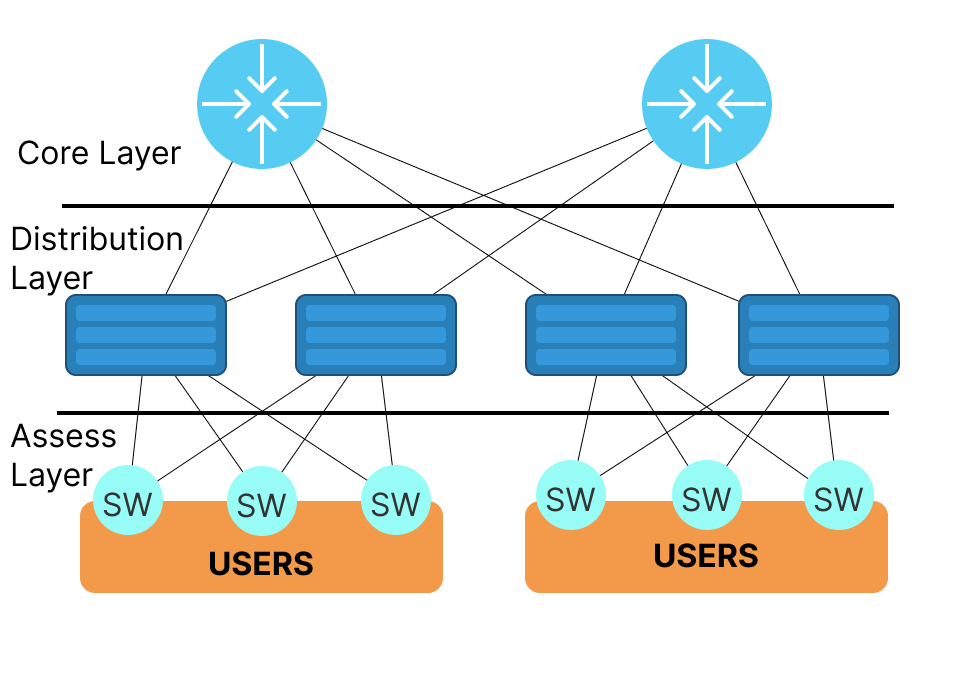
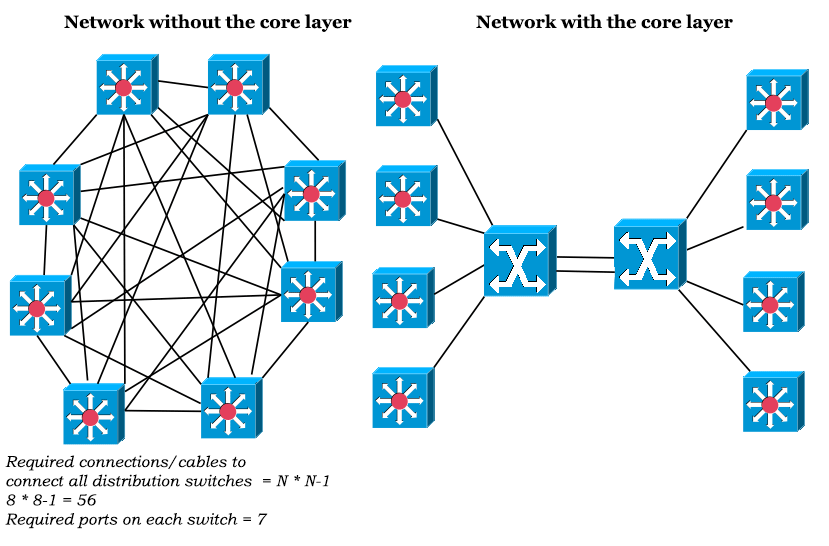
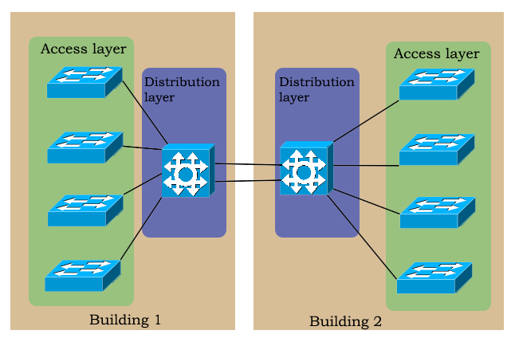
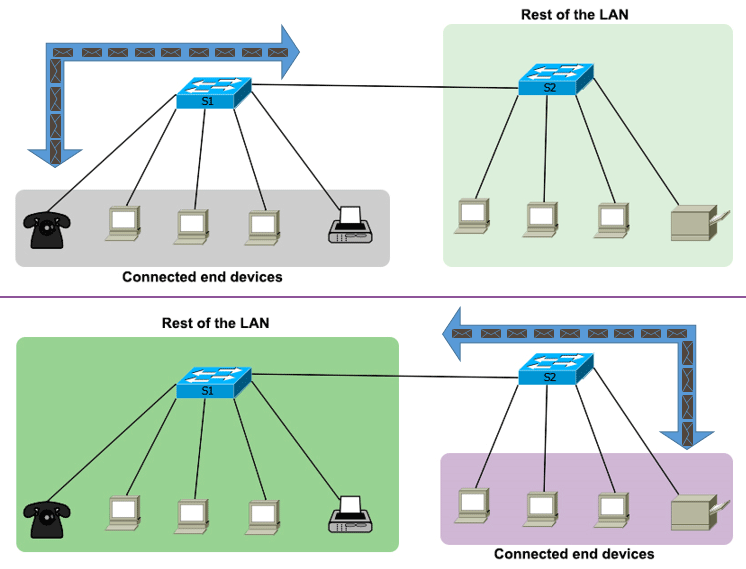
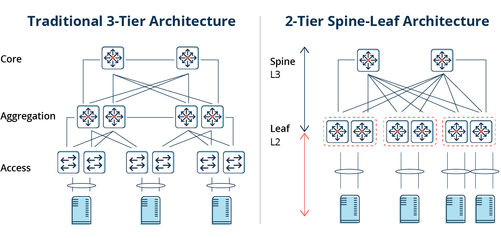

# Modèles de conception réseau : redondance et automatisation

## Objectifs du cours

Dans cette session, nous plongerons dans les principes fondamentaux qui façonnent les réseaux d'entreprise modernes : les modèles de conception réseau. Ces blueprints conceptuels ne sont pas que théoriques : ce sont les frameworks directeurs derrière les réseaux évolutifs, performants et résilients. Que vous construisiez une nouvelle infrastructure ou optimisiez une existante, comprendre ces modèles est clé pour prendre des décisions intelligentes et pérennes.

Cette session vous guidera à travers :

- Le modèle Core-Distribution-Access, incluant son architecture et ses avantages
- La philosophie modulaire derrière les conceptions en couches
- Les rôles et responsabilités de chaque couche
- Comment l'isolation des pannes et la scalabilité sont intégrées aux designs hiérarchiques
- Les topologies de data center, avec un focus particulier sur le modèle Leaf-Spine
- Comment l'architecture Leaf-Spine supporte le trafic est-ouest et minimise la latence
- Applications réelles et avantages de chaque modèle en entreprise

---

## Glossaire

### Termes généraux

| Sigle | Nom complet | Description |
|-------|-------------|-------------|
| **CDA** | Core-Distribution-Access | Modèle hiérarchique à trois niveaux pour les réseaux d'entreprise |
| **HSRP** | Hot Standby Router Protocol | Protocole Cisco de redondance de passerelle |
| **VRRP** | Virtual Router Redundancy Protocol | Protocole standard de redondance de passerelle (RFC 5798) |
| **GLBP** | Gateway Load Balancing Protocol | Protocole Cisco combinant redondance et répartition de charge |
| **QoS** | Quality of Service | Mécanismes de priorisation du trafic réseau |
| **ACL** | Access Control List | Liste de règles de filtrage du trafic |
| **VLAN** | Virtual Local Area Network | Segmentation logique du réseau |
| **PoE** | Power over Ethernet | Alimentation électrique via câble réseau |
| **802.1X** | Port-Based Network Access Control | Standard d'authentification des ports réseau |

### Termes Leaf-Spine

| Sigle | Nom complet | Description |
|-------|-------------|-------------|
| **Leaf** | Switch de bordure | Commutateur connecté aux serveurs et équipements |
| **Spine** | Switch de backbone | Commutateur interconnectant tous les Leaf switches |
| **ECMP** | Equal-Cost Multi-Path | Répartition de charge sur plusieurs chemins de coût égal |
| **OSPF** | Open Shortest Path First | Protocole de routage à état de liens |
| **BGP** | Border Gateway Protocol | Protocole de routage inter-domaines |
| **East-West** | Trafic horizontal | Communication serveur-à-serveur dans le data center |
| **North-South** | Trafic vertical | Communication entre le data center et l'extérieur |

---

## Modèle Core-Distribution-Access : L'Approche Modulaire

### La Mentalité Modulaire dans la Conception Réseau d'Entreprise

Quand les réseaux ont commencé à croître en taille, complexité et fonction, les ingénieurs ont rapidement réalisé qu'une architecture plate ne pourrait tout simplement pas évoluer. C'est là qu'intervient l'approche modulaire, une méthodologie qui décompose un réseau en zones fonctionnelles distinctes, chacune responsable de tâches spécifiques.

Pensez à cela comme l'urbanisme. On ne construirait pas une ville sans que le zonage, les routes, les services publics et les équipements soient soigneusement planifiés. De même, dans le monde des réseaux d'entreprise, le modèle modulaire apporte structure, prévisibilité et gestion au chaos des câbles et des paquets.

Le modèle **Core-Distribution-Access (CDA)**, aussi connu comme le modèle hiérarchique à trois niveaux, est l'une des approches modulaires les plus adoptées. Il sépare le réseau d'entreprise en couches logiques, chacune avec des rôles bien définis, ce qui facilite la conception, l'évolution, le dépannage et la sécurisation.

Décortiquons les trois couches une par une.

---

## La Couche Core : L'Autoroute du Backbone

La couche core est le backbone haute vitesse du réseau. Elle connecte plusieurs équipements de la couche distribution et gère des volumes massifs de trafic entre les sites ou sections majeures du réseau. Cette couche est entièrement dédiée à la vitesse et la fiabilité, pas à l'application de politiques ou l'inspection de paquets.

Le core a un seul job : le transport rapide et efficace. Imaginez-le comme les voies express d'une autoroute. Vous ne voulez pas de feux rouges, de ralentisseurs ou de péages, juste des routes propres et rapides pour que les données circulent.

### Fonctions et Caractéristiques

- Fournit commutation et routage haute vitesse
- Facilite l'interconnectivité entre les blocs de distribution
- Doit éviter la manipulation complexe des paquets
- Se concentre sur la disponibilité et la redondance
- Souvent construit avec des équipements enterprise-grade robustes avec un minimum de fonctionnalités activées

### Priorités de Conception

| Priorité | Description | Technologies |
|----------|-------------|--------------|
| **Redondance** | Doubles switches core | Dual-homing, stacking |
| **Faible latence** | Temps de traversée minimal | Cut-through switching |
| **Convergence rapide** | Récupération en cas de panne | RSTP, OSPF fast timers |
| **Répartition de charge** | Utilisation de tous les liens | ECMP, LAG |
| **Haute disponibilité** | Basculement transparent | HSRP, VRRP, VSS |

Une bonne pratique est de garder le core "léger" et libre de tâches complexes qui pourraient retarder le trafic. Pas d'ACLs, QoS minimale, et pas de filtrage de paquets. Son travail est de déplacer les paquets, et de les déplacer vite.

---

## La Couche Distribution : Gardien des Politiques et Agrégateur

Située entre les couches core et access, la couche distribution est là où les choses deviennent intéressantes car elle joue le double rôle de routage et d'application des politiques.

Cette couche agrège le trafic de multiples switches d'accès et fournit le contrôle aux frontières entre l'accès et le core. C'est souvent le point où les décisions de routage sont prises, les politiques sont appliquées, et la qualité de service (QoS) est mise en œuvre. C'est aussi l'endroit idéal pour implémenter des mécanismes de redondance comme **VRRP** (Virtual Router Redundancy Protocol) pour assurer la disponibilité continue des services de passerelle par défaut.

### Responsabilités Clés

- **Routage inter-VLAN** : permet la communication entre différents VLANs
- **Application des ACLs** : filtrage de sécurité et contrôle d'accès
- **Redondance et agrégation de liens** : VRRP pour le failover de passerelle
- **QoS** : shaping et priorisation du trafic
- **Détermination des chemins** : décisions de routage et mises à jour

### Fonctionnalités Souvent Présentes

| Fonctionnalité | Description |
|----------------|-------------|
| **Layer 3 switching** | Routage au niveau du switch |
| **Route summarization** | Agrégation des routes pour réduire les tables |
| **Intégration firewall** | Point de contrôle de sécurité |
| **Segmentation VLAN** | Isolation logique des réseaux |
| **Redondance gateway** | VRRP, HSRP, ou GLBP |

La couche distribution est comme le point de contrôle douanier entre les rues animées de la ville (couche access) et l'autoroute haute vitesse (core). Elle assure que seul le trafic légitime et conforme aux politiques avance, et grâce à VRRP, il y a toujours une route de secours si un chemin tombe.

---

## La Couche Access : La Passerelle Utilisateur

La couche access est l'endroit où les utilisateurs, terminaux et équipements se connectent au réseau. Pensez à cela comme les rues de quartier, plus lentes et plus variées en trafic, mais absolument essentielles pour l'entrée et la sortie.

C'est la ligne de front où les PCs, téléphones IP, points d'accès sans fil, imprimantes et autres équipements clients se connectent physiquement ou sans fil. La sécurité et la gestion du trafic commencent ici, et la couche access doit fournir une connectivité fiable et sécurisée.

### Responsabilités Typiques

- Connexion des équipements utilisateurs
- Sécurité des ports et filtrage d'adresses MAC
- Politiques de contrôle d'accès (802.1X, port security)
- Attribution de VLAN
- Fourniture de Power over Ethernet (PoE)

### Autres Considérations

| Aspect | Description |
|--------|-------------|
| **Uplinks redondants** | Doubles liens vers la distribution |
| **Storm control** | Protection contre les tempêtes de broadcast |
| **Loop prevention** | STP, BPDU Guard, Root Guard |
| **QoS basique** | Marquage voix/données séparé |

Les switches d'accès peuvent être Layer 2 ou Layer 3 selon la complexité et les exigences de la conception. Cependant, le Layer 2 est le plus courant, avec la couche distribution gérant les responsabilités de routage.

---

## Pourquoi le Modèle Three-Tier Reste Pertinent

Malgré les avancées dans les réseaux software-defined et les architectures cloud-native, le modèle CDA reste une pierre angulaire dans de nombreuses organisations, particulièrement celles avec de grands campus, universités, hôpitaux et institutions financières.

### Avantages de l'Architecture

| Avantage | Description |
|----------|-------------|
| **Scalabilité** | Chaque couche peut être étendue indépendamment selon la demande |
| **Isolation des pannes** | Les problèmes sont rapidement identifiés et confinés à une couche spécifique |
| **Troubleshooting facilité** | La séparation claire des rôles rend le diagnostic plus rapide |
| **Gestion simplifiée** | Les politiques peuvent être centralisées à la couche distribution |
| **Performance constante** | Le core optimisé pour la vitesse, l'access pour la connectivité |

Ce modèle s'aligne aussi bien avec les stratégies de segmentation réseau et les zones de sécurité, permettant un meilleur contrôle du trafic, monitoring et gestion des accès.

---

## Topologies Data Center : Leaf-Spine

### Le Défi du Data Center

Les data centers d'entreprise ne sont plus des lieux de trafic nord-sud uniquement. Avec la virtualisation, les microservices, les conteneurs et le calcul distribué, la majorité du trafic dans les data centers aujourd'hui est **est-ouest**, c'est-à-dire, serveur-à-serveur.

Les architectures traditionnelles three-tier ne sont pas optimisées pour ces flux de trafic. Elles introduisent souvent de la latence et des goulots d'étranglement imprévisibles. La solution ? La topologie **Leaf-Spine**, une conception née des besoins des data centers modernes.

### Comprendre l'Architecture Leaf-Spine

La topologie Leaf-Spine aplatit la hiérarchie trouvée dans les modèles traditionnels. Elle assure que chaque switch leaf (connecté aux serveurs et stockage) a un chemin direct à coût égal vers chaque switch spine (qui connecte les switches leaf entre eux).

Voici comment ça fonctionne :

- Les **switches Leaf** sont directement connectés aux terminaux tels que serveurs, routeurs, firewalls et équipements de stockage
- Les **switches Spine** servent de backbone en interconnectant tous les switches leaf
- Chaque switch leaf est connecté à **chaque** switch spine, formant une topologie full mesh entre les deux couches
- Les switches leaf ne sont **jamais** connectés entre eux, et les switches spine ne sont pas interconnectés

Cela crée une fabric non-bloquante et haute performance, idéale pour le flux de trafic horizontal (est-ouest).

---

## Avantages du Leaf-Spine

Ce modèle offre des bénéfices significatifs pour les organisations avec de fortes communications internes et des besoins de scalabilité.

| Avantage | Description |
|----------|-------------|
| **Performance prévisible** | Tous les chemins ont un coût égal, le trafic est réparti uniformément |
| **Faible latence** | Minimum de hops (2 max), temps de traversée réduit |
| **Scalabilité** | Ajouter des Leaf = plus d'endpoints, ajouter des Spine = plus de bande passante |
| **Résilience** | Full-mesh assure haute disponibilité et tolérance aux pannes |
| **Idéal pour Est-Ouest** | Parfait pour microservices, conteneurs, bases de données distribuées |

---

## Composants et Building Blocks

Bien que la topologie puisse sembler simple, le déploiement réussi du Leaf-Spine nécessite une planification soigneuse et du matériel de commutation puissant.

### Switches Spine

| Caractéristique | Description |
|-----------------|-------------|
| **Densité de ports** | Élevée (32-64 ports 100G typique) |
| **Capacité throughput** | Très élevée (>12 Tbps) |
| **Mode opération** | Souvent Layer 3 (OSPF, BGP) |

### Switches Leaf

| Caractéristique | Description |
|-----------------|-------------|
| **Nombre de ports** | Moins nombreux (48 serveur + 4-8 uplinks) |
| **Type** | Souvent hybrides L2/L3 |
| **Connexion** | Directe aux serveurs et appliances |

Un déploiement typique peut impliquer 2 à 8 switches spine et des dizaines de switches leaf, chacun avec des liens doubles 40Gb ou 100Gb pour la redondance et la vitesse.

Cette conception simplifie aussi le dépannage. Puisque tout le trafic se déplace de leaf à spine à leaf, il est beaucoup plus facile de tracer et diagnostiquer les problèmes. De plus, tout nouveau service peut être mis en ligne avec une perturbation minimale de la fabric réseau existante.

---

## Comparaison Traditionnel vs Leaf-Spine

| Caractéristique | Modèle Three-Tier | Leaf-Spine |
|-----------------|-------------------|------------|
| **Topologie** | Hiérarchique | Plate/Full Mesh |
| **Focus Trafic** | Nord-Sud | Est-Ouest |
| **Latence** | Plus élevée | Plus faible |
| **Scalabilité** | Modérée | Élevée |
| **Cas d'Usage** | Réseaux Campus | Data Centers |
| **Flexibilité** | Moindre | Plus grande |
| **Automation Friendly** | Limitée | Très bonne |

Ce n'est pas une question de l'un étant universellement meilleur que l'autre. Chacun a son propre domaine où il excelle. Par exemple, le CDA est fantastique pour les réseaux campus et edge d'entreprise, tandis que le Leaf-Spine domine le data center.

---

## Cas d'Usage Réels

### Data Centers d'Entreprise
Les organisations hébergeant des services cloud privé ou hybride adoptent le Leaf-Spine pour améliorer la communication serveur-à-serveur, supporter la mobilité des VMs, et automatiser les opérations.

### Hyperscalers et Fournisseurs Cloud
Google, Amazon, Facebook et Microsoft utilisent tous des implémentations massives de Leaf-Spine pour construire des data centers distribués mondialement.

### Fournisseurs de Services
Les opérateurs télécom hébergeant des réseaux de diffusion de contenu ou gérant le routage core 5G favorisent le Leaf-Spine pour sa performance et son échelle.

### Labs HPC Universitaires
Les clusters de calcul haute performance avec des exigences massives est-ouest utilisent le Leaf-Spine pour la communication interne entre les nœuds.

---

## Synthèse : Quand Utiliser Chaque Modèle

### Core-Distribution-Access est idéal quand :

- Vous construisez un campus ou bureau d'entreprise
- Les équipements sont distribués géographiquement
- Le trafic Nord-Sud domine
- Vous avez besoin de forte segmentation de sécurité

### Leaf-Spine excelle quand :

- Vous concevez un data center moderne
- Les applications sont basées sur les microservices
- Le trafic Est-Ouest domine
- La latence et le throughput sont critiques

Souvent, les deux modèles coexistent. Par exemple, une université pourrait utiliser le CDA à travers ses campus et le Leaf-Spine dans son data center de recherche. Une entreprise pourrait utiliser le CDA pour les réseaux de succursales et le Leaf-Spine au siège pour les services internes.

Concevoir un réseau est comme l'architecture : il n'y a pas de "one-size-fits-all". Mais avec ces modèles dans votre boîte à outils, vous pouvez aborder virtuellement n'importe quel scénario avec confiance.

---

## Ressources

- [Three-Layer Hierarchical Model in Cisco](https://www.cisco.com/c/en/us/solutions/enterprise-networks/what-is-network-topology.html)
- [Juniper DataCenter Fabric Reference](https://www.juniper.net/documentation/us/en/software/junos/evpn-vxlan/topics/concept/evpn-vxlan-data-center.html)
- [Auvik Network Design Best Practice](https://www.auvik.com/franklyit/blog/network-design-best-practices/)
