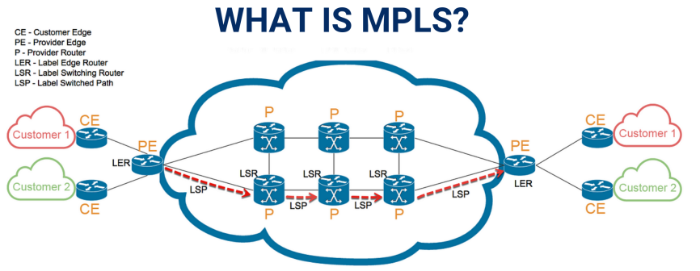

# Redondance en entreprise : MPLS et BGP multihoming

## Objectifs du cours

Il est temps de démystifier les concepts critiques de la redondance, un aspect fondamental de tout réseau visant la haute disponibilité, la tolérance aux pannes et des mécanismes de basculement robustes.

Nous explorerons deux technologies avancées mais indispensables qui apportent de la résilience aux réseaux modernes : **MPLS** et le **BGP multihoming**. Ces technologies garantissent un service ininterrompu, même lorsque des composants individuels, des liens ou des fournisseurs de services tombent en panne.

À la fin de cette leçon, vous aurez une compréhension solide de :

- Pourquoi la redondance est essentielle dans les réseaux d'entreprise
- Comment MPLS supporte l'ingénierie de trafic et la QoS
- Le rôle des VPNs MPLS dans la connectivité site-à-site et l'isolation
- Comment le BGP multihoming assure des liens ISP redondants
- Les concepts clés comme le pathing AS, le filtrage de routes et le partage de charge
- Comment les mécanismes de failover améliorent la continuité de service

---

## Glossaire

### Termes MPLS

| Sigle | Nom complet | Description |
|-------|-------------|-------------|
| **MPLS** | Multiprotocol Label Switching | Technique de commutation basée sur les labels plutôt que les adresses IP |
| **LSP** | Label Switched Path | Chemin prédéfini que suivent les paquets MPLS |
| **LSR** | Label Switch Router | Routeur core qui commute les paquets basés sur les labels |
| **LER** | Label Edge Router | Routeur de bordure qui insère/retire les labels MPLS |
| **PE** | Provider Edge | Routeur du fournisseur connecté au client |
| **CE** | Customer Edge | Routeur du client connecté au fournisseur |
| **VRF** | Virtual Routing and Forwarding | Instance de routage virtuelle pour isolation |
| **TE** | Traffic Engineering | Ingénierie de trafic pour optimiser les chemins |

### Termes BGP

| Sigle | Nom complet | Description |
|-------|-------------|-------------|
| **BGP** | Border Gateway Protocol | Protocole de routage inter-domaines (Internet) |
| **AS** | Autonomous System | Réseau sous une administration unique |
| **ASN** | Autonomous System Number | Numéro identifiant un AS |
| **AS_PATH** | Autonomous System Path | Attribut listant les AS traversés |
| **LOCAL_PREF** | Local Preference | Préférence locale pour la sélection de route sortante |
| **MED** | Multi-Exit Discriminator | Suggestion de chemin d'entrée préféré |
| **ECMP** | Equal-Cost Multi-Path | Répartition sur chemins de coût égal |
| **IP SLA** | IP Service Level Agreement | Monitoring de disponibilité des liens |

---

## La redondance : une ligne de vie réseau

Avant de plonger dans les protocoles techniques, prenons du recul. La redondance dans les réseaux d'entreprise n'est pas une question de paranoïa : c'est une question de préparation. Le matériel tombe en panne. Les fibres optiques sont coupées. Les ISPs subissent des pannes. La redondance garantit que le réseau ne bronche pas quand cela arrive.

### Les différents niveaux de redondance

| Niveau | Description | Exemple |
|--------|-------------|---------|
| **Lien** | Doubles uplinks Ethernet | Deux câbles vers le switch de distribution |
| **Équipement** | Doubles firewalls, switches, routeurs | Paire de routeurs en HSRP/VRRP |
| **Chemin** | Routes WAN ou MPLS alternatives | Deux circuits MPLS vers le même site |
| **Fournisseur** | Multiples ISPs avec BGP | Connexion à Orange et SFR |

C'est là que nos deux stars d'aujourd'hui entrent en jeu : **MPLS** et **BGP**. Ensemble, ils forment un duo puissant pour la redondance WAN et le failover.

---

## Qu'est-ce que MPLS ?

**Multiprotocol Label Switching (MPLS)** est une technique haute performance utilisée par les fournisseurs de services pour router le trafic efficacement à travers leurs réseaux backbone. Ce n'est pas un protocole à proprement parler, mais plutôt une méthode de transmission de paquets utilisant des **labels** au lieu des lookups IP traditionnels.

Chaque paquet entrant dans le réseau MPLS se voit attribuer un label. Les routeurs (appelés Label Switch Routers ou LSRs) transmettent les paquets basés sur ces labels plutôt que d'effectuer du routage IP à chaque saut. Ce processus réduit l'overhead et permet une ingénierie de trafic intelligente.



### Concepts clés MPLS

| Concept | Description |
|---------|-------------|
| **Labels** | Identifiants courts et fixes utilisés pour les décisions de transmission |
| **LSP (Label Switched Path)** | Chemin prédéfini que les paquets MPLS suivent |
| **LER (Edge Routers)** | Équipements qui insèrent ou retirent les labels MPLS |
| **LSR (Core Routers)** | Équipements qui commutent les paquets basés sur leurs labels |

### Fonctionnement du label switching

```
┌─────────────────────────────────────────────────────────────────────────────┐
│                        FONCTIONNEMENT MPLS                                   │
├─────────────────────────────────────────────────────────────────────────────┤
│                                                                              │
│   ROUTAGE IP TRADITIONNEL :                                                  │
│   ─────────────────────────                                                  │
│                                                                              │
│   [Paquet IP] → Routeur 1 → Routeur 2 → Routeur 3 → Destination              │
│                    │           │           │                                 │
│                 Lookup IP   Lookup IP   Lookup IP                            │
│                 Table FIB   Table FIB   Table FIB                            │
│                                                                              │
│   = Lookup complet à chaque saut (lent)                                      │
│                                                                              │
├─────────────────────────────────────────────────────────────────────────────┤
│                                                                              │
│   ROUTAGE MPLS :                                                             │
│   ──────────────                                                             │
│                                                                              │
│   [Paquet] → LER → [Label 25] → LSR → [Label 42] → LSR → LER → [Paquet]     │
│              (Push)              (Swap)            (Swap)  (Pop)              │
│                                                                              │
│   = Lookup simple basé sur le label (rapide)                                 │
│                                                                              │
└─────────────────────────────────────────────────────────────────────────────┘
```

---

## MPLS pour l'ingénierie de trafic et la QoS

L'un des joyaux de MPLS est sa capacité à effectuer de l'**Ingénierie de Trafic (TE)**. Cela permet aux fournisseurs de services et grandes entreprises de diriger le trafic sur des chemins moins congestionnés ou plus optimisés, indépendamment de ce que les protocoles de routage traditionnels pourraient dicter.

### Avantages pour la redondance

| Avantage | Description |
|----------|-------------|
| **Reroutage dynamique** | Le trafic est redirigé en temps réel loin des chemins défaillants ou congestionnés |
| **LSP primaire/backup** | Les chemins peuvent être préconfigurés avec des routes principales et de secours |
| **QoS garantie** | La bande passante peut être allouée par Class of Service (CoS) |

### Exemple : deux circuits WAN

```
┌─────────────────────────────────────────────────────────────────────────────┐
│                    MPLS TRAFFIC ENGINEERING                                  │
├─────────────────────────────────────────────────────────────────────────────┤
│                                                                              │
│   Site A                                                         Site B      │
│   ┌─────┐                                                       ┌─────┐     │
│   │ CE  │                                                       │ CE  │     │
│   └──┬──┘                                                       └──┬──┘     │
│      │                                                              │        │
│      │    ┌─────────────────────────────────────────────────┐      │        │
│      │    │              RÉSEAU MPLS PROVIDER                │      │        │
│      │    │                                                  │      │        │
│      └────┤  LSP 1 (Priorité Haute) ══════════════════════> ├──────┘        │
│           │  VoIP, Vidéo                                     │               │
│           │  QoS: EF (Expedited Forwarding)                  │               │
│           │                                                  │               │
│      └────┤  LSP 2 (Best Effort) - - - - - - - - - - - - - > ├──────┘        │
│           │  Backup, Bulk transfers                          │               │
│           │  QoS: BE (Best Effort)                           │               │
│           │                                                  │               │
│           └─────────────────────────────────────────────────┘               │
│                                                                              │
│   Si LSP 1 tombe → Trafic redirigé automatiquement vers LSP 2               │
│                                                                              │
└─────────────────────────────────────────────────────────────────────────────┘
```

### Bénéfices pour la redondance d'entreprise

- **Contrôle fin** sur les chemins de trafic
- **Temps de convergence réduit** en cas de panne
- **Load balancing** entre plusieurs chemins
- **Performance prévisible** grâce au marquage QoS

De nombreux fournisseurs de services offrent des services VPN MPLS avec des SLAs, garanties QoS et failover transparent. Les entreprises avec des applications critiques préfèrent souvent les WANs MPLS pour leur stabilité et performance.

---

## VPNs MPLS layer 3 : isolation logique et résilience

Une autre application vitale de MPLS est les **VPNs Layer 3**. Ceux-ci permettent aux entreprises de connecter plusieurs sites en utilisant le backbone MPLS d'un fournisseur tout en maintenant une séparation logique entre les réseaux clients.

Le trafic de chaque client est transporté dans une instance **VRF (Virtual Routing and Forwarding)**, l'isolant des autres. Le fournisseur utilise **MP-BGP** (Multiprotocol BGP) pour échanger les routes entre les routeurs PE (Provider Edge).

### Architecture VPN MPLS L3

```
┌─────────────────────────────────────────────────────────────────────────────┐
│                         VPN MPLS LAYER 3                                     │
├─────────────────────────────────────────────────────────────────────────────┤
│                                                                              │
│   CLIENT A - Site 1              PROVIDER MPLS              CLIENT A - Site 2│
│   ┌─────────┐                                               ┌─────────┐     │
│   │   CE    │                                               │   CE    │     │
│   │10.1.0.0 │                                               │10.2.0.0 │     │
│   └────┬────┘                                               └────┬────┘     │
│        │                                                         │          │
│        │         ┌───────────────────────────────┐               │          │
│        │         │                               │               │          │
│        └────────►│  PE ────── P ────── P ────── PE │◄─────────────┘          │
│                  │   │                       │   │               │          │
│                  │  VRF                     VRF  │               │          │
│                  │  Client_A               Client_A              │          │
│                  │                               │               │          │
│        ┌────────►│  PE ────── P ────── P ────── PE │◄─────────────┐          │
│        │         │   │                       │   │               │          │
│        │         │  VRF                     VRF  │               │          │
│        │         │  Client_B               Client_B              │          │
│        │         └───────────────────────────────┘               │          │
│        │                                                         │          │
│   ┌────┴────┐                                               ┌────┴────┐     │
│   │   CE    │                                               │   CE    │     │
│   │192.168.x│                                               │192.168.y│     │
│   └─────────┘                                               └─────────┘     │
│   CLIENT B - Site 1                                     CLIENT B - Site 2   │
│                                                                              │
│   Les VRFs isolent complètement les clients A et B                          │
│                                                                              │
└─────────────────────────────────────────────────────────────────────────────┘
```

### La redondance naturelle avec les VPNs MPLS

- Vous pouvez avoir des **routeurs PE doubles** à chaque site
- Si un circuit MPLS ou PE tombe, le routage bascule automatiquement vers l'autre
- Les instances VRF et les route distinguishers garantissent aucun chevauchement avec d'autres clients

Quand associés à des routeurs CE (Customer Edge) doubles à chaque site et des liens redondants, les VPNs MPLS offrent une solution WAN robuste et tolérante aux pannes.

### Scénarios réels

| Scénario | Description |
|----------|-------------|
| **Chemins MPLS redondants** | Deux circuits MPLS par site |
| **Routeurs PE/CE primaire/secondaire** | Failover automatique |
| **Tunnel IPsec backup** | En cas d'effondrement du réseau MPLS |

Les VPNs MPLS sont robustes, mais pas magiques. Ils nécessitent toujours des politiques de failover appropriées, du monitoring et des tests. Mais bien configurés, ils rendent votre WAN quasi-indestructible.

---

## BGP multihoming : la puissance de plusieurs ISPs

**BGP (Border Gateway Protocol)** est le protocole de routage qui fait fonctionner Internet. Quand une entreprise se connecte à plus d'un ISP pour la redondance, cette configuration s'appelle le **multihoming**. BGP est utilisé pour gérer et router le trafic à travers ces multiples fournisseurs upstream.


### Avantages du multihoming

| Avantage | Description |
|----------|-------------|
| **Connectivité redondante** | Accès Internet continu même si une connexion tombe |
| **Résilience aux pannes ISP** | Protection contre les dégradations de performance |
| **Load balancing** | Répartition du trafic et optimisation des routes |

Imaginez que votre ISP principal tombe. Sans BGP, vous seriez dans le noir. Mais avec le BGP multihoming, votre trafic se redirige simplement via le second ISP, souvent en quelques secondes à minutes.

### Comment BGP réalise le multihoming

```
┌─────────────────────────────────────────────────────────────────────────────┐
│                         BGP MULTIHOMING                                      │
├─────────────────────────────────────────────────────────────────────────────┤
│                                                                              │
│                            INTERNET                                          │
│                               │                                              │
│              ┌────────────────┼────────────────┐                             │
│              │                │                │                             │
│              ▼                │                ▼                             │
│         ┌────────┐            │           ┌────────┐                         │
│         │ ISP-A  │            │           │ ISP-B  │                         │
│         │AS 1234 │            │           │AS 5678 │                         │
│         └───┬────┘            │           └───┬────┘                         │
│             │                 │               │                              │
│             │    eBGP         │     eBGP      │                              │
│             │                 │               │                              │
│             ▼                 │               ▼                              │
│         ┌───────────────────────────────────────┐                            │
│         │           ENTREPRISE                   │                            │
│         │           AS 65001                     │                            │
│         │                                        │                            │
│         │  ┌─────────┐         ┌─────────┐      │                            │
│         │  │Router 1 │◄───────►│Router 2 │      │                            │
│         │  │(ISP-A)  │  iBGP   │(ISP-B)  │      │                            │
│         │  └─────────┘         └─────────┘      │                            │
│         │                                        │                            │
│         │  Annonce: 203.0.113.0/24              │                            │
│         │  vers les DEUX ISPs                   │                            │
│         └────────────────────────────────────────┘                            │
│                                                                              │
│   1. Annonce vos préfixes IP aux deux ISPs                                   │
│   2. Reçoit les tables de routage des ISPs                                   │
│   3. Prend des décisions de politique (AS_PATH, LOCAL_PREF, MED)             │
│                                                                              │
└─────────────────────────────────────────────────────────────────────────────┘
```

Les entreprises qui possèdent leur propre espace IP public et ASN (Autonomous System Number) peuvent annoncer leurs propres blocs à travers plusieurs ISPs. Cela leur donne un contrôle complet sur le routage entrant et sortant.

---

## Comprendre l'AS pathing et la sélection de route

Dans BGP, l'attribut **AS_PATH** est utilisé pour déterminer la route la plus courte (moins de sauts) vers une destination. Chaque fois qu'une route passe à travers un système autonome, son numéro AS est ajouté au chemin.

Cela crée une trace de comment un paquet devrait voyager. Les routeurs BGP utilisent cette trace pour prendre des décisions, préférant les chemins avec moins de sauts AS.

### Manipulation de l'AS_PATH

| Technique | Description | Cas d'usage |
|-----------|-------------|-------------|
| **AS Path Prepending** | Rendre une route plus longue pour la rendre moins préférée | Faire du backup sur un ISP |
| **Local Preference** | Prioriser les points de sortie depuis votre propre réseau | Préférer un ISP pour le trafic sortant |
| **MED** | Suggérer des chemins d'entrée préférés aux pairs | Influencer le trafic entrant |

### Exemple pratique

```
┌─────────────────────────────────────────────────────────────────────────────┐
│                    CONFIGURATION BGP - PRÉFÉRENCE ISP                        │
├─────────────────────────────────────────────────────────────────────────────┤
│                                                                              │
│   Objectif : ISP-A comme primaire, ISP-B comme backup                        │
│                                                                              │
│   CONFIGURATION :                                                            │
│   ───────────────                                                            │
│                                                                              │
│   router bgp 65001                                                           │
│     neighbor 198.51.100.1 remote-as 1234    ! ISP-A                          │
│     neighbor 203.0.113.1 remote-as 5678     ! ISP-B                          │
│                                                                              │
│   route-map PREFER-ISP-A permit 10                                           │
│     set local-preference 200                                                 │
│                                                                              │
│   route-map PREFER-ISP-B permit 10                                           │
│     set local-preference 100                                                 │
│                                                                              │
│   RÉSULTAT :                                                                 │
│   ──────────                                                                 │
│                                                                              │
│   Routes via ISP-A : LOCAL_PREF = 200 → PRÉFÉRÉ                              │
│   Routes via ISP-B : LOCAL_PREF = 100 → BACKUP                               │
│                                                                              │
│   BGP préfère toujours ISP-A sauf s'il est down                              │
│                                                                              │
└─────────────────────────────────────────────────────────────────────────────┘
```

---

## Filtrage de routes : gardez les indésirables dehors

Ce n'est pas parce que BGP fournit des informations de routage globales que vous voulez tout accepter. C'est là que le **filtrage de routes** entre en jeu.

Avec le filtrage de routes, vous décidez :
- Quels préfixes accepter des upstreams
- Quels préfixes leur annoncer
- Quels chemins AS sont considérés valides ou indésirables

### Stratégies de filtrage communes

| Stratégie | Description |
|-----------|-------------|
| **Prefix lists** | Autoriser uniquement les blocs CIDR approuvés |
| **AS-path filters** | Bloquer les routes depuis des ASNs suspects |
| **Route-maps** | Appliquer des contrôles logiques aux mises à jour de routage |

C'est particulièrement critique dans les environnements multihomés. Un mauvais filtrage peut résulter en des fuites de routes, du blackholing, ou l'annonce de réseaux internes au monde entier.

### Exemple de filtrage

```
┌─────────────────────────────────────────────────────────────────────────────┐
│                       FILTRAGE DE ROUTES BGP                                 │
├─────────────────────────────────────────────────────────────────────────────┤
│                                                                              │
│   ! N'accepter que des routes légitimes                                      │
│                                                                              │
│   ip prefix-list ALLOWED-IN seq 10 permit 0.0.0.0/0 le 24                    │
│   ip prefix-list ALLOWED-IN seq 20 deny 0.0.0.0/0 le 32                      │
│                                                                              │
│   ! Bloquer les préfixes RFC1918 (privés)                                    │
│   ip prefix-list BOGONS seq 10 deny 10.0.0.0/8 le 32                         │
│   ip prefix-list BOGONS seq 20 deny 172.16.0.0/12 le 32                      │
│   ip prefix-list BOGONS seq 30 deny 192.168.0.0/16 le 32                     │
│                                                                              │
│   ! N'annoncer que NOS préfixes                                              │
│   ip prefix-list OUR-PREFIXES seq 10 permit 203.0.113.0/24                   │
│                                                                              │
│   router bgp 65001                                                           │
│     neighbor 198.51.100.1 prefix-list ALLOWED-IN in                          │
│     neighbor 198.51.100.1 prefix-list OUR-PREFIXES out                       │
│                                                                              │
└─────────────────────────────────────────────────────────────────────────────┘
```

**Astuce** : Utilisez les **BGP communities** pour taguer les routes et appliquer des politiques cohérentes à travers les ISPs et routeurs. Les communities simplifient la gestion des déploiements BGP à grande échelle.

---

## Partage de charge avec BGP

La redondance ne signifie pas toujours utiliser un ISP comme backup. Parfois, vous voulez utiliser activement les deux. C'est ce qu'on appelle le **partage de charge (load sharing)**.

### Techniques de load sharing BGP

| Technique | Description |
|-----------|-------------|
| **Split par destination** | U.S. via ISP-A, Europe via ISP-B |
| **Attributs BGP** | Balancer les chemins de trafic |
| **ECMP** | Plusieurs next-hops dans des environnements Equal Cost Multi-Path |

```
┌─────────────────────────────────────────────────────────────────────────────┐
│                      LOAD SHARING BGP                                        │
├─────────────────────────────────────────────────────────────────────────────┤
│                                                                              │
│   OPTION 1 : Split par destination géographique                              │
│   ─────────────────────────────────────────────                              │
│                                                                              │
│   Trafic vers USA ───────► ISP-A (meilleur peering US)                       │
│   Trafic vers Europe ────► ISP-B (meilleur peering EU)                       │
│                                                                              │
│   OPTION 2 : ECMP (Equal Cost Multi-Path)                                    │
│   ───────────────────────────────────────                                    │
│                                                                              │
│                        ┌──► ISP-A ──┐                                        │
│   Trafic sortant ──────┤            ├──► Internet                            │
│                        └──► ISP-B ──┘                                        │
│                                                                              │
│   = Répartition automatique 50/50                                            │
│                                                                              │
│   OPTION 3 : Weighted load sharing                                           │
│   ────────────────────────────────                                           │
│                                                                              │
│   ISP-A (100 Mbps) : 70% du trafic                                           │
│   ISP-B (50 Mbps)  : 30% du trafic                                           │
│                                                                              │
└─────────────────────────────────────────────────────────────────────────────┘
```

Cependant, le vrai load balancing avec BGP nécessite un contrôle précis et une planification soigneuse. Les ISPs peuvent avoir des latences, coûts ou accords de peering différents. Le partage de charge est plus un art qu'une science, mais bien fait, il maximise votre investissement en bande passante et améliore la redondance.

---

## Mécanismes de failover : toujours prêt

La redondance n'a de valeur que si elle fonctionne quand nécessaire. C'est là que les **mécanismes de failover** entrent en jeu. Ces mécanismes sont comme les secouristes : ils interviennent quand les choses tournent mal.

### Déclencheurs de failover BGP

| Déclencheur | Description |
|-------------|-------------|
| **Panne de lien physique** | Interface qui tombe |
| **Session BGP dropped** | Pair qui ne répond plus |
| **Retrait de route** | Préfixe qui disparaît de la table |

### Stratégies de redondance

```
┌─────────────────────────────────────────────────────────────────────────────┐
│                    STRATÉGIES DE FAILOVER                                    │
├─────────────────────────────────────────────────────────────────────────────┤
│                                                                              │
│   1. DUAL WAN ROUTERS                                                        │
│   ───────────────────                                                        │
│                                                                              │
│   ┌─────────┐                              ┌─────────┐                       │
│   │Router 1 │──────► ISP-A                 │Router 2 │──────► ISP-B          │
│   └────┬────┘                              └────┬────┘                       │
│        │          Sessions BGP séparées         │                            │
│        └──────────────────┬─────────────────────┘                            │
│                           │                                                  │
│                    ┌──────┴──────┐                                           │
│                    │    HSRP     │                                           │
│                    │  Virtual IP │                                           │
│                    └─────────────┘                                           │
│                                                                              │
│   2. IP SLA TRACKING                                                         │
│   ──────────────────                                                         │
│                                                                              │
│   ip sla 1                                                                   │
│     icmp-echo 8.8.8.8 source-interface GigabitEthernet0/0                    │
│     frequency 5                                                              │
│                                                                              │
│   track 1 ip sla 1 reachability                                              │
│                                                                              │
│   ! Si ping échoue → déclenche failover HSRP                                 │
│                                                                              │
│   3. STATIC ROUTE BACKUP                                                     │
│   ──────────────────────                                                     │
│                                                                              │
│   ip route 0.0.0.0 0.0.0.0 198.51.100.1 10    ! ISP-A (AD=10, préféré)       │
│   ip route 0.0.0.0 0.0.0.0 203.0.113.1 20     ! ISP-B (AD=20, backup)        │
│                                                                              │
└─────────────────────────────────────────────────────────────────────────────┘
```

### Scénario exemple complet

```
┌─────────────────────────────────────────────────────────────────────────────┐
│                    SCÉNARIO FAILOVER COMPLET                                 │
├─────────────────────────────────────────────────────────────────────────────┤
│                                                                              │
│   Configuration :                                                            │
│   • Deux routeurs, chacun avec un lien vers un ISP différent                 │
│   • HSRP entre eux pour fournir une IP virtuelle                             │
│   • IP SLA track ping vers 8.8.8.8 via ISP-A                                 │
│                                                                              │
│   ÉTAT NORMAL :                                                              │
│   ─────────────                                                              │
│                                                                              │
│   [LAN] ──► Router 1 (HSRP Active) ──► ISP-A ──► Internet                    │
│             Router 2 (HSRP Standby)                                          │
│                                                                              │
│   PANNE ISP-A :                                                              │
│   ─────────────                                                              │
│                                                                              │
│   1. IP SLA détecte : ping 8.8.8.8 échoue                                    │
│   2. Track 1 passe à DOWN                                                    │
│   3. HSRP priority de Router 1 diminue                                       │
│   4. Router 2 devient HSRP Active                                            │
│   5. Trafic redirigé vers ISP-B                                              │
│                                                                              │
│   [LAN] ──► Router 2 (HSRP Active) ──► ISP-B ──► Internet                    │
│             Router 1 (HSRP Standby)                                          │
│                                                                              │
│   RÉSULTAT : Failover transparent avec disruption minimale                   │
│                                                                              │
└─────────────────────────────────────────────────────────────────────────────┘
```

---

## Synthèse : MPLS vs BGP multihoming

| Aspect | MPLS | BGP Multihoming |
|--------|------|-----------------|
| **Portée** | WAN privé (provider-managed) | Internet public |
| **Contrôle** | Fournisseur gère le backbone | Client contrôle le routage |
| **QoS** | Garantie par SLA | Best-effort (Internet) |
| **Coût** | Plus élevé | Variable selon ISPs |
| **Cas d'usage** | Connectivité site-à-site | Redondance Internet |
| **Complexité** | Gérée par provider | Configuration côté client |

### Quand utiliser quoi ?

```
┌─────────────────────────────────────────────────────────────────────────────┐
│                         GUIDE DE CHOIX                                       │
├─────────────────────────────────────────────────────────────────────────────┤
│                                                                              │
│   CHOISIR MPLS QUAND :                                                       │
│   ════════════════════                                                       │
│   ✓ Connectivité WAN site-à-site fiable                                      │
│   ✓ QoS garantie requise (VoIP, vidéo)                                       │
│   ✓ Isolation des trafics clients (VRF)                                      │
│   ✓ SLAs stricts nécessaires                                                 │
│                                                                              │
│   CHOISIR BGP MULTIHOMING QUAND :                                            │
│   ════════════════════════════════                                           │
│   ✓ Redondance d'accès Internet                                              │
│   ✓ Vous possédez votre espace IP public                                     │
│   ✓ Contrôle complet sur le routage entrant/sortant                          │
│   ✓ Load balancing entre ISPs souhaité                                       │
│                                                                              │
│   LES DEUX ENSEMBLE (Courant) :                                              │
│   ══════════════════════════════                                             │
│   • MPLS pour le WAN interne (sites → datacenter)                            │
│   • BGP multihoming pour l'accès Internet (datacenter → Internet)            │
│                                                                              │
└─────────────────────────────────────────────────────────────────────────────┘
```

---

## Ressources

- [Cisco MPLS Configuration Guide](https://www.cisco.com/c/en/us/td/docs/ios-xml/ios/mp_basic/configuration/xe-16/mp-basic-xe-16-book.html)
- [BGP Multihoming Techniques](https://www.cisco.com/c/en/us/support/docs/ip/border-gateway-protocol-bgp/26634-bgp-toc.html)
- [MPLS Layer 3 VPN Overview](https://www.juniper.net/documentation/us/en/software/junos/mpls/topics/concept/layer-3-vpn-overview.html)
- [BGP Communities Explained](https://www.noction.com/blog/bgp-communities-explained)
