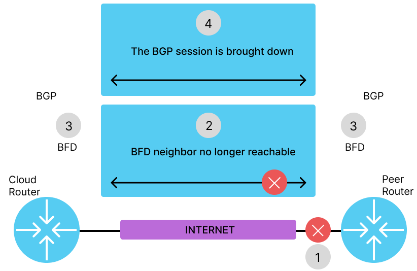
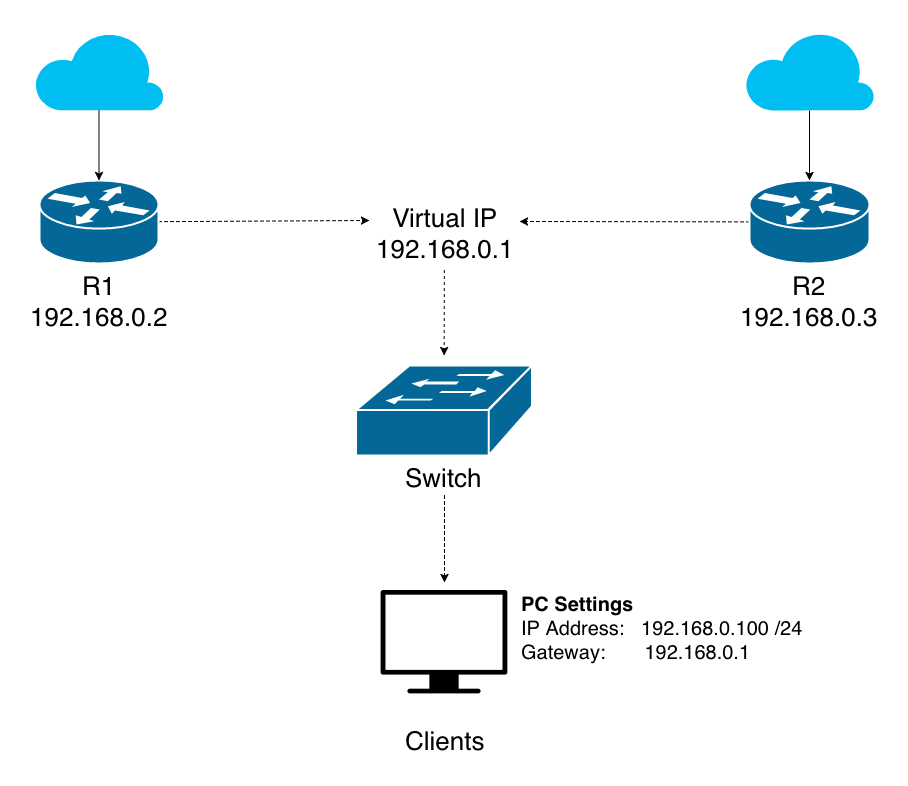

# WAN Failover et Ingénierie de Trafic

## Objectifs du cours

Les connexions WAN (Wide Area Network) sont souvent la ligne de vie des organisations modernes. Que vous connectiez plusieurs bureaux, permettiez l'accès au cloud, ou fournissiez des services à distance, une conception WAN stable et intelligente est essentielle. Les pannes ne sont pas "si" mais "quand". Ce cours vous apprend à garder une longueur d'avance.

Dans cette session, nous plongerons dans :

- La détection des pannes WAN avec BFD et IP SLA
- Le failover automatique avec BGP, HSRP ou VRRP
- Les stratégies de load balancing sur plusieurs liens WAN
- L'ingénierie de trafic avec les route maps et le routage basé sur les politiques (PBR)

---

## Glossaire

### Protocoles de Détection

| Sigle | Nom complet | Description |
|-------|-------------|-------------|
| **BFD** | Bidirectional Forwarding Detection | Protocole de détection rapide de pannes (<50ms) |
| **IP SLA** | IP Service Level Agreement | Monitoring de performance réseau (Cisco) |
| **ICMP** | Internet Control Message Protocol | Protocole utilisé pour les pings |

### Protocoles de Redondance

| Sigle | Nom complet | Description |
|-------|-------------|-------------|
| **HSRP** | Hot Standby Router Protocol | Redondance de gateway (Cisco propriétaire) |
| **VRRP** | Virtual Router Redundancy Protocol | Redondance de gateway (standard ouvert) |
| **GLBP** | Gateway Load Balancing Protocol | Redondance + load balancing (Cisco) |

### Concepts de Routage

| Sigle | Nom complet | Description |
|-------|-------------|-------------|
| **PBR** | Policy-Based Routing | Routage basé sur des politiques personnalisées |
| **ECMP** | Equal-Cost Multi-Path | Répartition sur chemins de coût égal |
| **CEF** | Cisco Express Forwarding | Mécanisme de forwarding optimisé |
| **BGP** | Border Gateway Protocol | Protocole de routage inter-domaines |

---

## WAN failover : pourquoi c'est important

### Comprendre les vulnérabilités WAN

Les liens WAN sont intrinsèquement susceptibles à une variété de problèmes : coupures de fibre, pannes de fournisseur, congestion, attaques DDoS, et la liste continue. Quand vos services cloud ou sites distants dépendent de ce lien, l'indisponibilité peut être coûteuse.

Les mécanismes de failover consistent à construire un filet de sécurité. Une conception WAN redondante assure la continuité des opérations et maintient les services essentiels en ligne même quand les choses tournent mal.

### Les composants clés

| Composant | Rôle | Temps de détection |
|-----------|------|-------------------|
| **BFD** | Détection de panne au niveau liaison | < 50 ms |
| **IP SLA** | Monitoring applicatif proactif | Configurable (secondes) |
| **BGP** | Failover dynamique entre ISPs | Secondes à minutes |
| **HSRP/VRRP** | Redondance de passerelle | Secondes |

---

## BFD : Bidirectional Forwarding Detection

**BFD** (Bidirectional Forwarding Detection) est un protocole léger et rapide conçu pour détecter les pannes entre deux moteurs de forwarding directement connectés.

Contrairement aux méthodes keepalive traditionnelles, BFD est agnostique aux protocoles et opère à un niveau plus bas, permettant une détection de panne en sous-seconde.



### Avantages clés de BFD

| Avantage | Description |
|----------|-------------|
| **Détection ultra-rapide** | Temps de détection souvent < 50 millisecondes |
| **Indépendant du protocole** | Fonctionne avec OSPF, BGP, EIGRP, etc. |
| **Faible charge CPU** | Convergence rapide sans surcharger le routeur |
| **Scalable** | Peut monitorer de nombreuses sessions simultanément |

### Comment BFD fonctionne

```
┌─────────────────────────────────────────────────────────────────────────────┐
│                        FONCTIONNEMENT BFD                                    │
├─────────────────────────────────────────────────────────────────────────────┤
│                                                                              │
│   ÉTAT NORMAL :                                                              │
│   ─────────────                                                              │
│                                                                              │
│   [Router A] ◄══════ BFD Hello (10ms) ══════► [Router B]                     │
│              ◄══════ BFD Hello (10ms) ══════►                                │
│              ◄══════ BFD Hello (10ms) ══════►                                │
│                                                                              │
│   Les routeurs échangent des paquets de contrôle à intervalles réguliers     │
│                                                                              │
├─────────────────────────────────────────────────────────────────────────────┤
│                                                                              │
│   DÉTECTION DE PANNE :                                                       │
│   ────────────────────                                                       │
│                                                                              │
│   [Router A] ══════ BFD Hello ══════X [Lien coupé] X══════ [Router B]        │
│                                                                              │
│   1. Router A ne reçoit plus de BFD Hello                                    │
│   2. Après 3 hellos manqués (~30ms) → Lien déclaré DOWN                      │
│   3. BFD notifie le protocole de routage (BGP, OSPF...)                      │
│   4. Le protocole déclenche immédiatement le failover                        │
│                                                                              │
│   Temps total de détection : ~50 millisecondes                               │
│                                                                              │
└─────────────────────────────────────────────────────────────────────────────┘
```

### Cas d'Usage : BFD avec BGP

```
┌─────────────────────────────────────────────────────────────────────────────┐
│                         BFD + BGP FAILOVER                                   │
├─────────────────────────────────────────────────────────────────────────────┤
│                                                                              │
│                           INTERNET                                           │
│                              │                                               │
│              ┌───────────────┼───────────────┐                               │
│              │               │               │                               │
│          [ISP-A]             │           [ISP-B]                             │
│              │               │               │                               │
│         BGP + BFD            │          BGP + BFD                            │
│              │               │               │                               │
│              ▼               │               ▼                               │
│         ┌────────────────────┴────────────────────┐                          │
│         │              ROUTEUR ENTREPRISE          │                          │
│         │                                          │                          │
│         │  WAN Primaire: ISP-A (avec BFD)          │                          │
│         │  WAN Backup:   ISP-B (avec BFD)          │                          │
│         └──────────────────────────────────────────┘                          │
│                                                                              │
│   SCÉNARIO :                                                                 │
│   1. Lien ISP-A tombe                                                        │
│   2. BFD détecte en ~50ms                                                    │
│   3. BGP retire les routes via ISP-A                                         │
│   4. Trafic bascule immédiatement sur ISP-B                                  │
│                                                                              │
│   Sans BFD : Détection en ~180 secondes (hold timer BGP par défaut)          │
│   Avec BFD : Détection en ~50 millisecondes                                  │
│                                                                              │
└─────────────────────────────────────────────────────────────────────────────┘
```

BFD est largement supporté et extrêmement efficace pour le failover dans les réseaux haute disponibilité. Sa vitesse de réaction en microsecondes en fait un choix de premier ordre pour les systèmes temps réel comme la VoIP ou les applications financières.

### Configuration BFD (exemple Cisco)

```
! Activer BFD globalement
bfd-template single-hop BFD-TEMPLATE
 interval min-tx 50 min-rx 50 multiplier 3

! Associer BFD à BGP
router bgp 65001
 neighbor 198.51.100.1 remote-as 1234
 neighbor 198.51.100.1 fall-over bfd
```

---

## IP SLA : monitoring proactif de la santé des liens

**IP SLA** (Service Level Agreement) est une fonctionnalité Cisco utilisée pour monitorer la performance réseau et détecter les pannes de liens basées sur des critères personnalisés comme la latence, le jitter, ou la perte de paquets.

Alors que BFD est focalisé sur la détection rapide au niveau liaison de données, IP SLA permet des décisions de failover tenant compte des applications.

### Types de sondes IP SLA

| Type de Sonde | Description | Cas d'usage |
|---------------|-------------|-------------|
| **ICMP echo** | Ping simple | Disponibilité basique |
| **TCP connect** | Connexion TCP | Vérifier qu'un service répond |
| **HTTP GET** | Requête HTTP | Monitoring de serveurs web |
| **DNS resolution** | Résolution DNS | Vérifier le DNS |
| **UDP jitter** | Mesure de jitter | QoS pour VoIP |

### Workflow IP SLA

```
┌─────────────────────────────────────────────────────────────────────────────┐
│                         WORKFLOW IP SLA                                      │
├─────────────────────────────────────────────────────────────────────────────┤
│                                                                              │
│   1. CONFIGURER LA SONDE                                                     │
│   ──────────────────────                                                     │
│                                                                              │
│   ip sla 1                                                                   │
│     icmp-echo 8.8.8.8 source-interface GigabitEthernet0/0                    │
│     frequency 5                       ← Ping toutes les 5 secondes           │
│   ip sla schedule 1 start-time now life forever                              │
│                                                                              │
│   2. CRÉER UN TRACKING OBJECT                                                │
│   ───────────────────────────                                                │
│                                                                              │
│   track 1 ip sla 1 reachability                                              │
│                                                                              │
│   3. ASSOCIER À UNE ROUTE STATIQUE                                           │
│   ─────────────────────────────────                                          │
│                                                                              │
│   ip route 0.0.0.0 0.0.0.0 198.51.100.1 track 1    ← Route primaire          │
│   ip route 0.0.0.0 0.0.0.0 203.0.113.1 10          ← Route backup (AD=10)    │
│                                                                              │
│   4. RÉSULTAT                                                                │
│   ───────────                                                                │
│                                                                              │
│   ┌──────────┐     Ping OK      ┌──────────┐                                 │
│   │ Routeur  │ ═══════════════► │ 8.8.8.8  │  → Route primaire active        │
│   └──────────┘                  └──────────┘                                 │
│                                                                              │
│   ┌──────────┐     Ping FAIL    ┌──────────┐                                 │
│   │ Routeur  │ ═══════X═══════► │ 8.8.8.8  │  → Track DOWN                   │
│   └──────────┘                  └──────────┘  → Route primaire retirée       │
│                                               → Route backup utilisée        │
│                                                                              │
└─────────────────────────────────────────────────────────────────────────────┘
```

### Exemple complet IP SLA

```
! Définir la sonde
ip sla 1
 icmp-echo 8.8.8.8 source-interface GigabitEthernet0/0
 threshold 500
 timeout 1000
 frequency 5

! Démarrer la sonde
ip sla schedule 1 start-time now life forever

! Créer l'objet de tracking
track 1 ip sla 1 reachability
 delay down 15 up 30

! Routes avec tracking
ip route 0.0.0.0 0.0.0.0 198.51.100.1 track 1
ip route 0.0.0.0 0.0.0.0 203.0.113.1 10
```

Ce type de failover est particulièrement utile dans les environnements plus petits où BGP peut être trop complexe, ou dans les scénarios où des applications spécifiques doivent être monitorées.

---

## Failover de routage avec BGP et HSRP/VRRP

### BGP : failover dynamique entre ISPs

**BGP** (Border Gateway Protocol) est le protocole de référence pour les organisations se connectant à plusieurs ISPs (multihoming). En plus de sa flexibilité et scalabilité, BGP offre de puissantes capacités de failover.

| Capacité | Description |
|----------|-------------|
| **Retrait automatique** | Quand un lien tombe, BGP retire automatiquement les préfixes inaccessibles |
| **Manipulation de chemin** | Attributs comme LOCAL_PREF, AS_PATH, MED pour influencer le routage |
| **Intégration BFD** | Pour une détection plus rapide des pannes |
| **Route-maps** | Logique conditionnelle pour un failover intelligent |

### Exemple réel BGP

```
┌─────────────────────────────────────────────────────────────────────────────┐
│                       BGP FAILOVER EN ACTION                                 │
├─────────────────────────────────────────────────────────────────────────────┤
│                                                                              │
│   1. ÉTAT NORMAL                                                             │
│   ──────────────                                                             │
│                                                                              │
│   Entreprise annonce 203.0.113.0/24 aux deux ISPs                            │
│   Sessions BGP actives avec les deux fournisseurs                            │
│                                                                              │
│                         INTERNET                                             │
│                            │                                                 │
│           ┌────────────────┼────────────────┐                                │
│           │                │                │                                │
│       [ISP-A]              │            [ISP-B]                              │
│       BGP OK ✓             │            BGP OK ✓                             │
│           │                │                │                                │
│           └────────────────┼────────────────┘                                │
│                            │                                                 │
│                    [Entreprise]                                              │
│                    203.0.113.0/24                                            │
│                                                                              │
│   2. PANNE ISP-A                                                             │
│   ──────────────                                                             │
│                                                                              │
│       [ISP-A] ══X══ Lien DOWN                                                │
│           │                                                                  │
│           └─► Session BGP torn down                                          │
│               └─► Routes via ISP-A retirées                                  │
│                   └─► Internet reroute via ISP-B automatiquement             │
│                                                                              │
└─────────────────────────────────────────────────────────────────────────────┘
```

### Conseils pro pour BGP

- Utilisez **BFD avec BGP** pour accélérer la détection et la convergence
- Combinez BGP avec des **communities** pour affiner les politiques de routage
- Préférez **eBGP** aux routes statiques pour un failover évolutif

---

## HSRP/VRRP : Redondance de Passerelle

Pour le failover au niveau du premier saut, **HSRP** (Hot Standby Router Protocol) et **VRRP** (Virtual Router Redundancy Protocol) fournissent la haute disponibilité pour les passerelles par défaut.



### Fonctionnement

```
┌─────────────────────────────────────────────────────────────────────────────┐
│                         HSRP / VRRP                                          │
├─────────────────────────────────────────────────────────────────────────────┤
│                                                                              │
│   Plusieurs routeurs sur un subnet partagent une IP virtuelle                │
│                                                                              │
│                    ┌─────────────────────┐                                   │
│                    │    IP Virtuelle     │                                   │
│                    │    192.168.1.1      │ ← Gateway pour les clients        │
│                    └──────────┬──────────┘                                   │
│                               │                                              │
│              ┌────────────────┼────────────────┐                             │
│              │                │                │                             │
│         ┌────┴────┐      ┌────┴────┐      ┌────┴────┐                        │
│         │Router A │      │Router B │      │Router C │                        │
│         │ ACTIVE  │      │ STANDBY │      │ STANDBY │                        │
│         │Pri: 110 │      │Pri: 100 │      │Pri: 90  │                        │
│         └────┬────┘      └────┬────┘      └────┬────┘                        │
│              │                │                │                             │
│         [WAN Link]       [WAN Link]       [WAN Link]                         │
│                                                                              │
│   ÉTAT NORMAL :                                                              │
│   Router A (priorité 110) = ACTIVE → gère tout le trafic                     │
│   Router B et C = STANDBY → en attente                                       │
│                                                                              │
│   PANNE ROUTER A :                                                           │
│   Router B (priorité 100) devient ACTIVE                                     │
│   Les clients ne voient RIEN (même IP virtuelle)                             │
│                                                                              │
└─────────────────────────────────────────────────────────────────────────────┘
```

### Comparaison HSRP vs VRRP

| Aspect | HSRP | VRRP |
|--------|------|------|
| **Standard** | Cisco propriétaire | Standard ouvert (RFC 5798) |
| **Support** | Cisco uniquement | Multi-vendeur |
| **Fonctionnalités** | Tracking natif | Tracking via scripts |
| **Performance** | Similaire | Similaire |

### Configuration HSRP avec IP SLA

```
! IP SLA pour monitorer le WAN
ip sla 1
 icmp-echo 8.8.8.8
 frequency 5
ip sla schedule 1 start-time now life forever

track 1 ip sla 1 reachability

! Configuration HSRP
interface Vlan10
 ip address 192.168.10.2 255.255.255.0
 standby 1 ip 192.168.10.1
 standby 1 priority 110
 standby 1 preempt
 standby 1 track 1 decrement 20
```

### Améliorations HSRP

| Amélioration | Description |
|--------------|-------------|
| **IP SLA + HSRP** | Tracking actif des liens WAN |
| **Priorité dynamique** | Ajustement basé sur les résultats IP SLA |
| **Timers optimisés** | Hello et hold timers réduits pour failover rapide |

---

## Load balancing sur liens WAN

### Per-Packet vs Per-Destination

Quand vous avez plusieurs liens WAN, pourquoi ne pas tous les utiliser ? Le load balancing répartit le trafic sur les chemins disponibles pour maximiser la bande passante et les performances.

### Types de load balancing

| Type | Description | Avantages | Inconvénients |
|------|-------------|-----------|---------------|
| **Per-Packet** | Chaque paquet sur un lien différent | Utilisation maximale | Paquets désordonnés |
| **Per-Destination** | Trafic divisé par IP destination | Ordre préservé | Distribution inégale possible |
| **Per-Session** | Par session TCP/UDP | Bon équilibre | Plus complexe |

```
┌─────────────────────────────────────────────────────────────────────────────┐
│                      LOAD BALANCING COMPARAISON                              │
├─────────────────────────────────────────────────────────────────────────────┤
│                                                                              │
│   PER-PACKET :                                                               │
│   ────────────                                                               │
│                                                                              │
│   Paquet 1 ──► ISP-A ──┐                                                     │
│   Paquet 2 ──► ISP-B ──┼──► Destination                                      │
│   Paquet 3 ──► ISP-A ──┤    (paquets peuvent arriver désordonnés)            │
│   Paquet 4 ──► ISP-B ──┘                                                     │
│                                                                              │
│   ✓ Utilisation maximale des liens                                           │
│   ✗ Problèmes pour VoIP, vidéo, sessions TCP                                 │
│                                                                              │
│   PER-DESTINATION :                                                          │
│   ─────────────────                                                          │
│                                                                              │
│   Vers Google ──────► ISP-A ──► Google                                       │
│   Vers Amazon ──────► ISP-B ──► Amazon                                       │
│   Vers Microsoft ───► ISP-A ──► Microsoft                                    │
│                                                                              │
│   ✓ Ordre des paquets préservé                                               │
│   ✓ Sessions stables                                                         │
│   ✗ Distribution peut être inégale                                           │
│                                                                              │
└─────────────────────────────────────────────────────────────────────────────┘
```

### ECMP : Equal-Cost Multi-Path

```
┌─────────────────────────────────────────────────────────────────────────────┐
│                              ECMP                                            │
├─────────────────────────────────────────────────────────────────────────────┤
│                                                                              │
│   Configuration :                                                            │
│   ───────────────                                                            │
│                                                                              │
│   ! Deux routes de coût égal                                                 │
│   ip route 0.0.0.0 0.0.0.0 198.51.100.1    ! ISP-A                           │
│   ip route 0.0.0.0 0.0.0.0 203.0.113.1     ! ISP-B                           │
│                                                                              │
│   ! Activer le load balancing CEF                                            │
│   ip cef                                                                     │
│   ip cef load-sharing algorithm include-ports source destination             │
│                                                                              │
│   Résultat :                                                                 │
│   ──────────                                                                 │
│                                                                              │
│   ┌──────────┐                                                               │
│   │ Routeur  │──┬──► ISP-A ──┬──► Internet                                   │
│   │          │  │            │                                               │
│   │  ECMP    │──┴──► ISP-B ──┘                                               │
│   └──────────┘                                                               │
│                                                                              │
│   Le trafic est automatiquement réparti sur les deux ISPs                    │
│                                                                              │
└─────────────────────────────────────────────────────────────────────────────┘
```

### Bonnes pratiques load balancing

| Pratique | Description |
|----------|-------------|
| **Match trafic/stratégie** | Per-destination pour VoIP, per-packet pour bulk |
| **Monitoring** | Surveiller l'utilisation des liens pour détecter les déséquilibres |
| **CEF** | Activer Cisco Express Forwarding pour un load balancing intelligent |

---

## Ingénierie de trafic avec route maps et PBR

### Route maps : le pouvoir du routage conditionnel

Les **route maps** sont des outils puissants et flexibles utilisés pour appliquer des politiques personnalisées aux décisions de routage. Ils fonctionnent comme des instructions "si-alors" pour les routeurs.

### Structure d'une Route Map

```
┌─────────────────────────────────────────────────────────────────────────────┐
│                         STRUCTURE ROUTE MAP                                  │
├─────────────────────────────────────────────────────────────────────────────┤
│                                                                              │
│   route-map NOM_POLICY permit|deny SEQUENCE                                  │
│     match CONDITION                                                          │
│     set ACTION                                                               │
│                                                                              │
│   EXEMPLE :                                                                  │
│   ─────────                                                                  │
│                                                                              │
│   ! Créer une ACL pour identifier le trafic HTTP                             │
│   access-list 101 permit tcp any any eq 80                                   │
│   access-list 101 permit tcp any any eq 443                                  │
│                                                                              │
│   ! Créer la route-map                                                       │
│   route-map HTTP_POLICY permit 10                                            │
│     match ip address 101                                                     │
│     set ip next-hop 192.0.2.1                                                │
│                                                                              │
│   RÉSULTAT :                                                                 │
│   ──────────                                                                 │
│                                                                              │
│   Trafic HTTP ────► [Match ACL 101] ────► Next-hop 192.0.2.1                 │
│                                           (lien haute bande passante)        │
│                                                                              │
│   Autre trafic ────► [Pas de match] ────► Routage normal                     │
│                                                                              │
└─────────────────────────────────────────────────────────────────────────────┘
```

### Cas d'usage route maps

| Cas d'usage | Description |
|-------------|-------------|
| **Chemins de backup** | Définir des routes alternatives |
| **Politique par application** | Router différemment selon le type de trafic |
| **Contrôle de route ISP** | Influencer le routage BGP |

---

## Policy-Based Routing (PBR)

**PBR** (Policy-Based Routing) vous donne un contrôle encore plus granulaire. Au lieu de laisser la table de routage prendre la décision, PBR permet à l'administrateur de définir comment le trafic spécifique doit être transmis.

### Quand utiliser PBR

| Scénario | Description |
|----------|-------------|
| **Trafic par département** | RH via ISP-A, Ventes via ISP-B |
| **VoIP prioritaire** | Toujours sur le lien faible latence |
| **Cloud direct** | Bypass des firewalls on-premises |

### Configuration PBR complète

```
┌─────────────────────────────────────────────────────────────────────────────┐
│                      CONFIGURATION PBR                                       │
├─────────────────────────────────────────────────────────────────────────────┤
│                                                                              │
│   SCÉNARIO :                                                                 │
│   ──────────                                                                 │
│   - Subnet HR (192.168.10.0/24) → ISP-A (lien sécurisé)                      │
│   - Subnet Sales (192.168.20.0/24) → ISP-B (lien rapide)                     │
│   - Reste → Routage normal                                                   │
│                                                                              │
│   CONFIGURATION :                                                            │
│   ───────────────                                                            │
│                                                                              │
│   ! ACL pour identifier le trafic HR                                         │
│   ip access-list extended HR_TRAFFIC                                         │
│     permit ip 192.168.10.0 0.0.0.255 any                                     │
│                                                                              │
│   ! ACL pour identifier le trafic Sales                                      │
│   ip access-list extended SALES_TRAFFIC                                      │
│     permit ip 192.168.20.0 0.0.0.255 any                                     │
│                                                                              │
│   ! Route-map pour HR                                                        │
│   route-map PBR_POLICY permit 10                                             │
│     match ip address HR_TRAFFIC                                              │
│     set ip next-hop 198.51.100.1          ! ISP-A                            │
│                                                                              │
│   ! Route-map pour Sales                                                     │
│   route-map PBR_POLICY permit 20                                             │
│     match ip address SALES_TRAFFIC                                           │
│     set ip next-hop 203.0.113.1           ! ISP-B                            │
│                                                                              │
│   ! Appliquer sur l'interface LAN                                            │
│   interface GigabitEthernet0/0                                               │
│     ip policy route-map PBR_POLICY                                           │
│                                                                              │
└─────────────────────────────────────────────────────────────────────────────┘
```

### Visualisation PBR

```
┌─────────────────────────────────────────────────────────────────────────────┐
│                           PBR EN ACTION                                      │
├─────────────────────────────────────────────────────────────────────────────┤
│                                                                              │
│                              INTERNET                                        │
│                                 │                                            │
│                 ┌───────────────┼───────────────┐                            │
│                 │               │               │                            │
│             [ISP-A]             │           [ISP-B]                          │
│             Sécurisé            │           Rapide                           │
│                 │               │               │                            │
│                 │     198.51.100.1     203.0.113.1                           │
│                 │               │               │                            │
│                 └───────────────┼───────────────┘                            │
│                                 │                                            │
│                          ┌──────┴──────┐                                     │
│                          │   ROUTEUR   │                                     │
│                          │    + PBR    │                                     │
│                          └──────┬──────┘                                     │
│                                 │                                            │
│              ┌──────────────────┼──────────────────┐                         │
│              │                  │                  │                         │
│         [HR Subnet]        [Sales Subnet]     [Autres]                       │
│        192.168.10.0/24    192.168.20.0/24                                    │
│              │                  │                  │                         │
│              ▼                  ▼                  ▼                         │
│          → ISP-A            → ISP-B          → Routage                       │
│          (sécurisé)         (rapide)           normal                        │
│                                                                              │
└─────────────────────────────────────────────────────────────────────────────┘
```

### Limitations du PBR

| Limitation | Solution |
|------------|----------|
| **Ne scale pas bien** | Limiter le nombre de politiques |
| **Troubleshooting complexe** | Documenter soigneusement |
| **Pas de failover auto** | Combiner avec IP SLA tracking |

### PBR avec IP SLA (Failover)

```
! IP SLA pour vérifier ISP-A
ip sla 1
 icmp-echo 198.51.100.1
 frequency 5
ip sla schedule 1 start-time now life forever

track 1 ip sla 1 reachability

! Route-map avec vérification
route-map PBR_POLICY permit 10
 match ip address HR_TRAFFIC
 set ip next-hop verify-availability 198.51.100.1 1 track 1
 set ip next-hop 203.0.113.1    ! Backup si track down
```

---

## Architecture complète : tout assembler

Imaginons la conception d'un WAN pour une entreprise avec :
- Deux ISPs Internet
- Un fournisseur MPLS
- Workloads cloud critiques
- Besoins de vidéoconférence

```
┌─────────────────────────────────────────────────────────────────────────────┐
│                    ARCHITECTURE WAN COMPLÈTE                                 │
├─────────────────────────────────────────────────────────────────────────────┤
│                                                                              │
│                              INTERNET                                        │
│                                 │                                            │
│                 ┌───────────────┼───────────────┐                            │
│                 │               │               │                            │
│             [ISP-A]             │           [ISP-B]                          │
│             eBGP + BFD          │          eBGP + BFD                        │
│                 │               │               │                            │
│                 └───────────────┼───────────────┘                            │
│                                 │                                            │
│   ┌─────────────────────────────┼─────────────────────────────┐              │
│   │                             │                             │              │
│   │  ┌──────────┐         ┌─────┴─────┐         ┌──────────┐ │              │
│   │  │ Router A │◄═══════►│   HSRP    │◄═══════►│ Router B │ │              │
│   │  │ Active   │  iBGP   │Virtual IP │  iBGP   │ Standby  │ │              │
│   │  └────┬─────┘         └───────────┘         └────┬─────┘ │              │
│   │       │                                          │       │              │
│   │       │              IP SLA Tracking             │       │              │
│   │       │                                          │       │              │
│   │  ┌────┴──────────────────────────────────────────┴────┐  │              │
│   │  │                    PBR ENGINE                      │  │              │
│   │  │  VoIP      → ISP-A (low latency)                   │  │              │
│   │  │  Cloud     → ISP-B (high bandwidth)                │  │              │
│   │  │  Backup    → MPLS (guaranteed)                     │  │              │
│   │  └────────────────────────────────────────────────────┘  │              │
│   │                                                          │              │
│   │                    SITE PRINCIPAL                        │              │
│   └──────────────────────────────────────────────────────────┘              │
│                                 │                                            │
│                              [MPLS]                                          │
│                                 │                                            │
│                         [Sites distants]                                     │
│                                                                              │
├─────────────────────────────────────────────────────────────────────────────┤
│                                                                              │
│   COMPOSANTS :                                                               │
│                                                                              │
│   1. ROUTAGE PRIMAIRE avec BGP                                               │
│      → Chaque routeur peer avec ISPs et MPLS                                 │
│      → BGP contrôle la sélection de chemin et la redondance                  │
│                                                                              │
│   2. FAILOVER RAPIDE avec BFD et IP SLA                                      │
│      → IP SLA monitore le statut des liens                                   │
│      → BFD accélère le failover pour les protocoles dynamiques               │
│                                                                              │
│   3. REDONDANCE GATEWAY avec HSRP                                            │
│      → Les deux routeurs annoncent une IP virtuelle                          │
│      → Failover transparent pour les clients internes                        │
│                                                                              │
│   4. LOAD BALANCING avec ECMP et CEF                                         │
│      → Les chemins de coût égal partagent la charge                          │
│      → Performance optimisée sans sacrifier l'ordre                          │
│                                                                              │
│   5. INGÉNIERIE DE TRAFIC avec PBR                                           │
│      → VoIP et apps critiques sur le lien faible latence                     │
│      → Chemins de backup pour les transferts bulk                            │
│                                                                              │
└─────────────────────────────────────────────────────────────────────────────┘
```

Ce niveau de contrôle et de résilience assure non seulement la haute disponibilité mais aussi des performances applicatives optimales et une efficacité des coûts.

---

## Ressources

- [Cisco IP SLA Configuration Guide](https://www.cisco.com/c/en/us/td/docs/ios-xml/ios/ipsla/configuration/15-mt/sla-15-mt-book.html)
- [BFD Overview and Configuration](https://www.cisco.com/c/en/us/td/docs/ios-xml/ios/iproute_bfd/configuration/xe-16/irb-xe-16-book.html)
- [HSRP vs VRRP Comparison](https://www.cisco.com/c/en/us/support/docs/ip/hot-standby-router-protocol-hsrp/9234-hsrpguidetoc.html)
- [Policy-Based Routing Guide](https://www.cisco.com/c/en/us/td/docs/ios-xml/ios/iproute_pi/configuration/xe-16/iri-xe-16-book/iri-poli-based-rtg.html)
