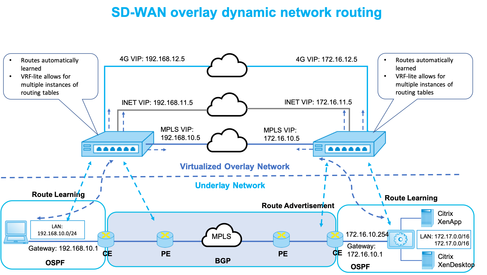
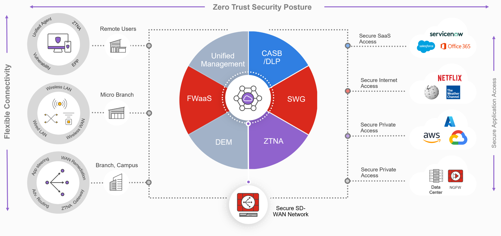

# SD-WAN : les fondamentaux

## Objectifs du cours

Le SD-WAN représente un bond majeur dans la façon dont nous connectons les bureaux distants, les data centers, les services cloud et les télétravailleurs. Il apporte agilité, contrôle centralisé, intelligence applicative et sécurité dans une seule plateforme, le tout sans la rigidité et le coût élevé des solutions WAN traditionnelles.

Dans cette session, nous explorerons :

- L'architecture SD-WAN : plan de contrôle vs plan de données
- La gestion centralisée avec des outils comme Cisco vManage et FortiManager
- Les fonctionnalités clés : sélection dynamique de chemin et routage applicatif
- L'intégration de la sécurité et du chiffrement sur tous les liens
- Comment le SD-WAN remplace ou complète les WANs MPLS traditionnels

---

## Glossaire

### Termes SD-WAN

| Sigle | Nom complet | Description |
|-------|-------------|-------------|
| **SD-WAN** | Software-Defined Wide Area Network | WAN défini par logiciel avec gestion centralisée |
| **CPE** | Customer Premises Equipment | Équipement SD-WAN installé chez le client |
| **DIA** | Direct Internet Access | Accès Internet direct (vs backhaul) |
| **Local Breakout** | Sortie Internet locale | Accès direct à Internet depuis une branche |
| **Overlay** | Réseau superposé | Tunnels virtuels au-dessus du réseau physique |
| **Underlay** | Réseau sous-jacent | Infrastructure physique (MPLS, Internet, LTE) |

### Termes sécurité

| Sigle | Nom complet | Description |
|-------|-------------|-------------|
| **SASE** | Secure Access Service Edge | Convergence SD-WAN + sécurité cloud |
| **ZTNA** | Zero Trust Network Access | Accès réseau Zero Trust |
| **CASB** | Cloud Access Security Broker | Courtier de sécurité pour accès cloud |
| **DPI** | Deep Packet Inspection | Inspection approfondie des paquets |
| **IPsec** | IP Security | Protocole de chiffrement des tunnels |

### Termes performance

| Sigle | Nom complet | Description |
|-------|-------------|-------------|
| **QoS** | Quality of Service | Qualité de service |
| **SLA** | Service Level Agreement | Accord de niveau de service |
| **Jitter** | Variation de latence | Instabilité du délai de transmission |
| **Packet Loss** | Perte de paquets | Pourcentage de paquets perdus |

---

## Comprendre les limitations du WAN traditionnel

### L'environnement WAN legacy

Les architectures WAN traditionnelles ont été conçues à une époque où Internet était considéré comme non fiable et où la plupart des applications étaient hébergées dans des data centers privés. À l'époque, la solution de référence pour connecter les bureaux distants était **MPLS** (Multiprotocol Label Switching), prisé pour sa fiabilité, ses garanties de performance et ses capacités QoS.

### Architecture WAN traditionnelle

```
┌─────────────────────────────────────────────────────────────────────────────┐
│                    ARCHITECTURE WAN TRADITIONNELLE                           │
├─────────────────────────────────────────────────────────────────────────────┤
│                                                                              │
│                              INTERNET                                        │
│                                 │                                            │
│                                 │                                            │
│                          ┌──────┴──────┐                                     │
│                          │   FIREWALL  │                                     │
│                          │     HQ      │                                     │
│                          └──────┬──────┘                                     │
│                                 │                                            │
│                    ┌────────────┼────────────┐                               │
│                    │            │            │                               │
│                    │      SIÈGE SOCIAL       │                               │
│                    │     (Datacenter)        │                               │
│                    └────────────┬────────────┘                               │
│                                 │                                            │
│                    ═════════════╪═════════════  MPLS                         │
│                    │            │            │                               │
│               ┌────┴────┐  ┌────┴────┐  ┌────┴────┐                          │
│               │Branch 1 │  │Branch 2 │  │Branch 3 │                          │
│               └─────────┘  └─────────┘  └─────────┘                          │
│                                                                              │
│   PROBLÈMES :                                                                │
│   • Tout le trafic Internet passe par le HQ (backhaul)                       │
│   • Latence élevée pour accéder au cloud                                     │
│   • MPLS coûteux et lent à provisionner                                      │
│   • Configuration manuelle de chaque site                                    │
│                                                                              │
└─────────────────────────────────────────────────────────────────────────────┘
```

### Défis du WAN traditionnel

| Défi | Description |
|------|-------------|
| **Coût élevé** | Circuits MPLS chers avec bande passante limitée |
| **Délais de provisioning** | Semaines/mois pour déployer un nouveau site |
| **Backhaul obligatoire** | Tout le trafic cloud doit passer par le HQ |
| **Mauvaise expérience SaaS** | Latence pour Office 365, Salesforce, etc. |
| **Manque d'agilité** | Pas de gestion centralisée moderne |

C'est là qu'intervient le **SD-WAN** : une solution moderne pour des défis modernes.

---

## Qu'est-ce que le SD-WAN ?

### Définition

Le **SD-WAN** est une architecture WAN virtuelle qui permet aux entreprises d'utiliser n'importe quelle combinaison de services de transport (incluant MPLS, LTE, Internet haut débit et satellite) pour connecter de manière sécurisée les utilisateurs aux applications.



Il utilise un logiciel pour diriger intelligemment le trafic à travers le WAN, exploitant le **routage applicatif**, la **gestion centralisée** et le **contrôle dynamique des chemins** pour prendre de meilleures décisions sur comment et où le trafic circule.

### Concept clé : séparation du plan de contrôle et du plan de données

L'une des caractéristiques définissantes du SD-WAN est la **séparation du plan de contrôle et du plan de données** :

| Plan | Rôle | Localisation |
|------|------|--------------|
| **Plan de Contrôle** | Gère les décisions de routage, politiques, topologie, sélection de chemin | Centralisé dans le contrôleur SD-WAN |
| **Plan de Données** | Gère la transmission effective des paquets | Distribué sur tous les équipements edge (CPE) |

Ce découplage permet une **orchestration centralisée** et une **application locale**, combinant visibilité globale et ajustements de performance en temps réel.

### Architecture SD-WAN vs traditionnelle

```
┌─────────────────────────────────────────────────────────────────────────────┐
│                        ARCHITECTURE SD-WAN                                   │
├─────────────────────────────────────────────────────────────────────────────┤
│                                                                              │
│                         ┌─────────────────┐                                  │
│                         │   CONTRÔLEUR    │                                  │
│                         │    SD-WAN       │                                  │
│                         │  (vManage,etc.) │                                  │
│                         └────────┬────────┘                                  │
│                                  │                                           │
│                    Configuration & Politiques                                │
│                                  │                                           │
│         ┌────────────────────────┼────────────────────────┐                  │
│         │                        │                        │                  │
│         ▼                        ▼                        ▼                  │
│   ┌──────────┐            ┌──────────┐            ┌──────────┐              │
│   │ Branch 1 │            │ Branch 2 │            │ Branch 3 │              │
│   │   CPE    │            │   CPE    │            │   CPE    │              │
│   └────┬─────┘            └────┬─────┘            └────┬─────┘              │
│        │                       │                       │                    │
│   ┌────┴────┐             ┌────┴────┐             ┌────┴────┐               │
│   │         │             │         │             │         │               │
│  MPLS    Internet        MPLS    Internet        LTE    Internet            │
│   │         │             │         │             │         │               │
│   │    ┌────┴─────────────┴────┬────┴─────────────┴────┐    │               │
│   │    │                       │                       │    │               │
│   └────┤      OVERLAY MESH     │    Tunnels IPsec      ├────┘               │
│        │                       │                       │                    │
│        └───────────────────────┼───────────────────────┘                    │
│                                │                                            │
│                    ┌───────────┴───────────┐                                │
│                    │                       │                                │
│                 [Cloud]               [Datacenter]                          │
│            Office 365, AWS           Applications                           │
│                                       internes                              │
│                                                                              │
│   AVANTAGES :                                                                │
│   • Local breakout pour le cloud (pas de backhaul)                          │
│   • Multiple transports (MPLS + Internet + LTE)                              │
│   • Failover automatique en sous-seconde                                    │
│   • Gestion centralisée de tous les sites                                   │
│                                                                              │
└─────────────────────────────────────────────────────────────────────────────┘
```

### Points clés

- **SD-WAN est défini par logiciel** : flexible et dynamique
- **Supporte plusieurs types de transport** : pas seulement MPLS
- **Priorise la performance applicative** et la sécurité
- **Peut être délivré depuis le cloud** ou on-premises

---

## Architecture et composants SD-WAN

### Contrôleurs centralisés

Le cœur d'une solution SD-WAN réside dans ses **contrôleurs centralisés**, qui maintiennent la topologie réseau en temps réel, appliquent les politiques et simplifient les opérations.

| Contrôleur | Vendeur | Description |
|------------|---------|-------------|
| **vManage** | Cisco (Viptela) | Dashboard unique pour configurer, monitorer et dépanner |
| **FortiManager** | Fortinet | Gestion des appliances FortiGate en déploiement SD-WAN |
| **VMware Orchestrator** | VMware | Contrôleur pour VMware SD-WAN (ex-VeloCloud) |
| **Juniper Mist Cloud** | Juniper | SD-WAN avec gestion AI-driven |

### Fonctions des contrôleurs

| Fonction | Description |
|----------|-------------|
| **Push de configuration** | Déploiement des politiques sur tous les edge devices |
| **Monitoring temps réel** | Surveillance de la performance et santé des liens |
| **Application des politiques** | Sécurité réseau unifiée |
| **Analytics et visibilité** | Insights sur les patterns de trafic et performance |

### Équipements edge (CPE)

Les **CPE** (Customer Premises Equipment) sont les équipements SD-WAN situés à chaque branche, data center ou bureau distant. Ces appareils appliquent les politiques reçues du contrôleur et gèrent la transmission du trafic en temps réel.

#### Fonctionnalités des CPE SD-WAN

| Fonctionnalité | Description |
|----------------|-------------|
| **Multi-WAN** | Interfaces duales/multiples (MPLS, LTE, DIA) |
| **Chiffrement** | Support IPsec et VPN |
| **Reconnaissance applicative** | Moteurs DPI intégrés |
| **Local breakout** | Sortie directe pour SaaS et trafic Internet |

Certains CPE sont physiques, d'autres virtuels, et beaucoup de vendeurs offrent les deux options selon les besoins de déploiement.

### Types de transport WAN

Une fabric SD-WAN supporte plusieurs underlays :

| Transport | Avantages | Cas d'usage |
|-----------|-----------|-------------|
| **MPLS** | Fiable, QoS garantie | Applications latency-sensitive |
| **Internet haut débit (DIA)** | Économique, disponible | Trafic général, cloud |
| **4G/5G LTE** | Sans fil, redondance | Branches mobiles, backup |
| **Satellite/Fixed Wireless** | Zones reculées | Sites isolés |

Le point clé : SD-WAN **abstrait ces liens** en une fabric logique unique et décide intelligemment lequel utiliser basé sur les métriques de performance temps réel.

---

## Sélection dynamique de chemin et routage applicatif

### Qu'est-ce que la sélection dynamique de chemin ?

Le SD-WAN **monitore continuellement** la santé et la performance de tous les liens WAN disponibles. Si la perte de paquets, le jitter ou la latence sur un chemin dépasse les seuils de politique, le trafic est **automatiquement rerouté** sur un chemin plus performant.

#### Métriques monitorées

| Métrique | Description | Seuil typique |
|----------|-------------|---------------|
| **Latence** | Délai de transmission | < 150ms pour VoIP |
| **Jitter** | Variation du délai | < 30ms pour VoIP |
| **Perte de paquets** | % de paquets perdus | < 1% pour voix |
| **Bande passante** | Capacité disponible | Variable |

```
┌─────────────────────────────────────────────────────────────────────────────┐
│                    SÉLECTION DYNAMIQUE DE CHEMIN                             │
├─────────────────────────────────────────────────────────────────────────────┤
│                                                                              │
│   ÉTAT NORMAL :                                                              │
│   ─────────────                                                              │
│                                                                              │
│   [Branch] ══► MPLS (latence 20ms, 0% loss) ══► [HQ]    ← PRÉFÉRÉ            │
│            ──► Internet (latence 50ms, 0% loss) ──►                          │
│                                                                              │
│   PROBLÈME SUR MPLS :                                                        │
│   ───────────────────                                                        │
│                                                                              │
│   [Branch] ══► MPLS (latence 200ms, 5% loss) ══► [HQ]   ← DÉGRADÉ            │
│            ──► Internet (latence 50ms, 0% loss) ──►     ← MEILLEUR !         │
│                                                                              │
│   DÉCISION SD-WAN :                                                          │
│   ─────────────────                                                          │
│                                                                              │
│   • Détection de la dégradation MPLS                                         │
│   • Basculement automatique du trafic vers Internet                          │
│   • En sous-seconde, sans intervention humaine                               │
│                                                                              │
└─────────────────────────────────────────────────────────────────────────────┘
```

Cela signifie que même si votre lien haut débit commence à avoir des problèmes, le trafic voix ou vidéo peut basculer sur MPLS ou LTE en quelques secondes, souvent sans que l'utilisateur final ne s'en aperçoive.

### Routage applicatif (application-aware routing)

Contrairement au routage traditionnel qui base ses décisions sur l'adresse IP et le port, le **routage applicatif** reconnaît le type d'application et prend des décisions de transmission en conséquence.

#### Exemple de politique applicative

| Application | Lien préféré | Raison |
|-------------|--------------|--------|
| Office 365, Zoom | Internet (local breakout) | Faible latence vers le cloud |
| SAP, ERP interne | MPLS | Fiabilité garantie |
| Backups | LTE/Internet | Pas critique, économique |
| VoIP | MPLS ou Internet (meilleur) | Dynamique selon qualité |

#### Comment les applications sont identifiées

| Technique | Description |
|-----------|-------------|
| **Deep Packet Inspection (DPI)** | Analyse du contenu des paquets |
| **Signatures Layer 7** | Détection des comportements applicatifs |
| **Mapping IP/Port** | Classification traditionnelle |
| **Reconnaissance FQDN** | Classification basée sur les domaines |

Certaines solutions supportent des milliers de signatures applicatives et peuvent même détecter des applications personnalisées avec du machine learning.

---

## Intégration de la sécurité dans SD-WAN

### Chiffrement intégré

Chaque tunnel overlay SD-WAN est **chiffré avec IPsec ou TLS**. Cela garantit la confidentialité des données quel que soit le transport WAN utilisé. Plus besoin de MPLS pour garantir la sécurité.

| Fonctionnalité | Description |
|----------------|-------------|
| **AES-256 IPsec** | Tunnels chiffrés entre tous les nœuds |
| **Monitoring des tunnels** | Surveillance santé et performance |
| **Rotation des clés** | Renforcement régulier de la sécurité |
| **VPN automatique** | Création automatique entre sites |

### Pare-feu et filtrage intégrés

Les solutions SD-WAN modernes incluent souvent des capacités de pare-feu intégrées :

| Fonctionnalité | Description |
|----------------|-------------|
| **Pare-feu basé sur zones** | Segmentation du trafic |
| **Filtrage applicatif** | Contrôle Layer 7 |
| **Filtrage URL/DNS** | Blocage des domaines malveillants |
| **IDS/IPS** | Détection et prévention d'intrusions |

```
┌─────────────────────────────────────────────────────────────────────────────┐
│                    SÉCURITÉ DISTRIBUÉE SD-WAN                                │
├─────────────────────────────────────────────────────────────────────────────┤
│                                                                              │
│   APPROCHE TRADITIONNELLE :                                                  │
│   ─────────────────────────                                                  │
│                                                                              │
│   [Branch] ──► [HQ Firewall] ──► Internet                                    │
│                     │                                                        │
│             Tout passe par le HQ                                             │
│             (backhaul, latence)                                              │
│                                                                              │
│   APPROCHE SD-WAN :                                                          │
│   ─────────────────                                                          │
│                                                                              │
│   [Branch] ──► [CPE avec Firewall intégré] ──► Internet                      │
│                        │                                                     │
│                  Sécurité à l'edge :                                         │
│                  • Filtrage URL                                              │
│                  • IDS/IPS                                                   │
│                  • Inspection du trafic                                      │
│                  • Local breakout sécurisé                                   │
│                                                                              │
└─────────────────────────────────────────────────────────────────────────────┘
```

### Convergence SASE et SD-WAN

Le SD-WAN sert souvent de fondation pour l'architecture **SASE** (Secure Access Service Edge), qui combine :

| Composant | Rôle |
|-----------|------|
| **SD-WAN** | Connectivité intelligente |
| **Firewall cloud** | Protection périmétrique |
| **CASB** | Sécurité des accès cloud |
| **ZTNA** | Accès Zero Trust |



Des vendeurs comme Palo Alto, Zscaler, Cisco et Fortinet mènent la convergence du SD-WAN et du SASE, délivrant une stack sécurité et réseau unifiée dans le cloud.

---

## Comment SD-WAN remplace ou complète MPLS

### MPLS n'est pas mort... pas encore

Le SD-WAN n'est pas nécessairement un remplacement complet de MPLS, du moins pas tout de suite. Beaucoup d'entreprises commencent par **augmenter MPLS** avec du haut débit ou LTE, créant un WAN hybride.

### Modèle de transition typique

```
┌─────────────────────────────────────────────────────────────────────────────┐
│                    TRANSITION MPLS → SD-WAN                                  │
├─────────────────────────────────────────────────────────────────────────────┤
│                                                                              │
│   PHASE 1 : WAN Hybride                                                      │
│   ─────────────────────                                                      │
│   • MPLS + Broadband en mode dual-WAN                                        │
│   • SD-WAN gère les deux liens                                               │
│                                                                              │
│   PHASE 2 : Local Breakout                                                   │
│   ────────────────────────                                                   │
│   • Trafic SaaS et public via broadband (local breakout)                     │
│   • Trafic interne critique via MPLS                                         │
│                                                                              │
│   PHASE 3 : Réduction MPLS                                                   │
│   ─────────────────────────                                                  │
│   • Downgrade de la bande passante MPLS                                      │
│   • MPLS uniquement pour apps critiques privées                              │
│                                                                              │
│   PHASE 4 : Élimination MPLS (optionnel)                                     │
│   ──────────────────────────────────────                                     │
│   • 100% Internet + LTE                                                      │
│   • Économies maximales                                                      │
│                                                                              │
└─────────────────────────────────────────────────────────────────────────────┘
```

Cette approche donne des économies de coûts et de meilleures performances tout en préservant l'investissement dans l'infrastructure existante.

### Comparaison SD-WAN vs MPLS

| Caractéristique | MPLS | SD-WAN |
|-----------------|------|--------|
| **Temps de provisioning** | Semaines/Mois | Heures/Jours |
| **Coût bande passante** | Élevé | Plus bas |
| **Accès cloud** | Centralisé/Backhaul | Local/Optimisé |
| **Intelligence applicative** | Limitée | Inspection profonde |
| **Vitesse de failover** | Minutes | Sous-seconde |
| **Chiffrement** | Optionnel | Par défaut & obligatoire |
| **Scalabilité** | Limitée par hardware | Définie par logiciel |

Avec le SD-WAN, les organisations n'ont plus à choisir entre performance et coût : elles obtiennent les deux.

---

## Cas d'usage et modèles de déploiement

### Cas d'usage 1 : connectivité des branches

Traditionnellement, connecter des branches nécessitait des configurations manuelles de routeurs, du MPLS dédié et un investissement temps significatif.

**Avec SD-WAN :**
- Nouvelles branches onboardées via **zero-touch provisioning**
- Politiques centrales poussent routage, sécurité et paramètres de performance
- Accès cloud et local breakout automatiques

**Résultat** : Déploiements plus rapides, moins d'erreurs, meilleure UX pour les utilisateurs distants.

### Cas d'usage 2 : optimisation des applications cloud

Le SD-WAN porte la performance SaaS et IaaS à de nouveaux sommets :

| Fonctionnalité | Bénéfice |
|----------------|----------|
| **Chemins optimisés** | Accès rapide à Microsoft 365, Salesforce, Google Workspace |
| **Métriques temps réel** | Monitoring de performance par application |
| **Politiques granulaires** | Sécurité appliquée à l'edge |

Certains vendeurs offrent des **gateways cloud** ou des points de peering avec les principaux fournisseurs SaaS, réduisant significativement les temps aller-retour.

### Cas d'usage 3 : retail et entreprises distribuées

Pensez franchises, magasins, cliniques distantes ou campus satellites. Ces sites manquent souvent de personnel IT et ont des besoins de conformité complexes.

**Avec SD-WAN :**
- L'IT central contrôle toutes les politiques distantes
- LTE fournit une connectivité out-of-the-box
- WAN et sécurité unifiés dans une seule appliance

### Cas d'usage 4 : réseaux mobiles et temporaires

Chantiers de construction, pop-up stores, événements : déployer des WANs traditionnels dans ces environnements est coûteux et chronophage.

Les CPE SD-WAN avec liens LTE ou satellite peuvent être déployés en quelques heures, offrant un réseau complet sans tranchées ni pose de fibre.

---

## Synthèse : pourquoi SD-WAN ?

```
┌─────────────────────────────────────────────────────────────────────────────┐
│                         POURQUOI SD-WAN ?                                    │
├─────────────────────────────────────────────────────────────────────────────┤
│                                                                              │
│   ┌─────────────────┐                                                        │
│   │   AGILITÉ       │  Zero-touch provisioning, déploiement en heures        │
│   └─────────────────┘                                                        │
│                                                                              │
│   ┌─────────────────┐                                                        │
│   │   ÉCONOMIES     │  Remplacement/réduction MPLS, utilisation Internet     │
│   └─────────────────┘                                                        │
│                                                                              │
│   ┌─────────────────┐                                                        │
│   │   PERFORMANCE   │  Local breakout, routage applicatif intelligent        │
│   └─────────────────┘                                                        │
│                                                                              │
│   ┌─────────────────┐                                                        │
│   │   SÉCURITÉ      │  Chiffrement intégré, firewall à l'edge, SASE ready    │
│   └─────────────────┘                                                        │
│                                                                              │
│   ┌─────────────────┐                                                        │
│   │   VISIBILITÉ    │  Dashboard centralisé, analytics, troubleshooting      │
│   └─────────────────┘                                                        │
│                                                                              │
│   ┌─────────────────┐                                                        │
│   │   RÉSILIENCE    │  Failover automatique, multi-transport, redondance     │
│   └─────────────────┘                                                        │
│                                                                              │
└─────────────────────────────────────────────────────────────────────────────┘
```

---

## Ressources

- [Cisco SD-WAN Documentation](https://www.cisco.com/c/en/us/solutions/enterprise-networks/sd-wan/index.html)
- [What Is SASE? - Palo Alto Networks](https://www.paloaltonetworks.com/cyberpedia/what-is-sase)
- [Fortinet SD-WAN](https://www.fortinet.com/products/sd-wan)
- [VMware SD-WAN](https://www.vmware.com/products/sd-wan.html)
