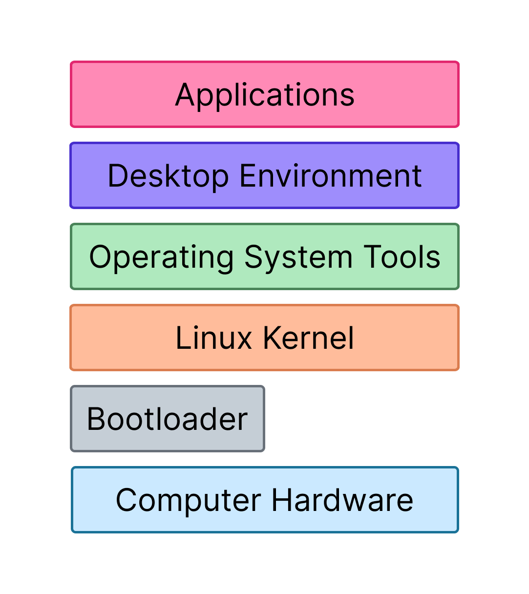

# Le système Linux

**Durée : 30 min**

## Ce que vous allez apprendre dans ce cours

Commençons par présenter le système d'exploitation Linux : son histoire, ses composants principaux et comment il organise et interagit avec les ressources. Dans cette leçon, vous allez :

- enfin connaître la différence entre Unix et Linux,
- identifier les composants principaux du système Linux,
- choisir votre distribution préférée parmi les 600 disponibles,
- comprendre ce qui se passe quand vous exécutez une commande shell.

---

## Introduction à Linux

Linux est un système d'exploitation open source créé en 1991 par Linus Torvalds. Il est composé du noyau Linux (kernel), qui est le composant central responsable de la gestion des ressources matérielles, et de divers autres composants logiciels qui en font un système d'exploitation complet.

Généralement, vous rencontrerez Linux sous forme de **distribution** : en soi, le système Linux fournit un environnement minimal et manque de fonctionnalités conviviales, donc ce qui est utilisé est en réalité une distribution. Une distribution Linux (souvent abrégée "distro") est une version packagée du système Linux qui inclut :

- le noyau Linux,
- un système de gestion de paquets,
- des logiciels supplémentaires tels que des environnements de bureau, des navigateurs web...

Voici quelques distributions Linux courantes :

| Distribution | Description |
|--------------|-------------|
| **Debian** | Une des premières distributions, avec un fort engagement envers les principes du logiciel libre et une gestion de projet démocratique |
| **Ubuntu** | Dérivée de Debian, une des distributions les plus populaires grâce à son interface conviviale et son support communautaire |
| **Kali Linux** | Basée sur Debian, conçue pour les tests d'intrusion, le hacking éthique et l'investigation numérique |
| **Alpine Linux** | Distribution légère proche de l'expérience Linux de base, souvent utilisée pour la conteneurisation grâce à sa taille minimale |

La flexibilité et l'évolutivité de Linux en font un système très polyvalent : vous pouvez l'installer sur un ordinateur personnel comme Windows, mais aussi sur un serveur web, une TV connectée, un routeur, un téléphone mobile (Android est basé sur le noyau Linux) ou un supercalculateur.

### Unix, GNU et Linux

Vous avez peut-être entendu que Linux est un système de type Unix, ou même vu Linux appelé GNU/Linux. Voici une brève leçon d'histoire :

- **Unix** : système d'exploitation développé en 1969, servant de fondation à de nombreux systèmes modernes comme Linux et macOS. C'est le premier OS basé sur le langage C. C'est un système propriétaire.

- **Projet GNU** : initié en 1983 par Richard Stallman pour créer un système d'exploitation libre de type Unix. Ce projet a produit des outils critiques comme le compilateur GCC et Bash, mais manquait de composants bas niveau.

- **Linux** : le noyau Linux a comblé ce vide, et ce que nous appelons Linux est en fait une combinaison des outils GNU et du noyau Linux pour former le système GNU/Linux.

---

## De quoi est composé Linux ?

Du plus bas niveau aux composants de plus haut niveau, voici les éléments d'un système Linux :



| Composant | Description |
|-----------|-------------|
| **Bootloader** | Premier logiciel qui s'exécute au démarrage, son rôle principal est de charger et démarrer le noyau. Exemple : GRUB |
| **Kernel (noyau)** | Cœur du système, gère les ressources matérielles (CPU, mémoire, périphériques). Fonctions clés : gestion des processus, gestion mémoire, pilotes de périphériques, opérations sur les fichiers, réseau |
| **Système d'init** | Premier processus démarré par le noyau et dernier à se terminer. Gère tous les autres processus. Les systèmes modernes utilisent **systemd** |
| **Daemons** | Processus en arrière-plan qui exécutent des tâches spécifiques (services réseau, journalisation...) |
| **Serveur graphique** | Gère les éléments graphiques et les affiche à l'écran. Exemple : X Window System (X11) |
| **Environnement de bureau** | Fournit une interface utilisateur complète (bureau, barre des tâches, icônes). Exemples : GNOME, KDE, XFCE |
| **Applications** | Logiciels pour les utilisateurs (éditeurs de texte, navigateurs, lecteurs vidéo...) |

### Espace utilisateur vs espace noyau

Les parties de Linux "au-dessus" du noyau (environnement de bureau, applications) sont appelées **espace utilisateur** (userspace ou userland). Les applications dans l'espace utilisateur ne peuvent pas accéder directement au matériel ou effectuer des opérations privilégiées. Elles communiquent avec le noyau via des **appels système** (syscalls).

Cette division offre plusieurs avantages :

- **Stabilité** : les plantages des programmes utilisateur n'affectent pas le système entier
- **Sécurité** : les processus utilisateur ont des permissions restreintes
- **Flexibilité** : les utilisateurs peuvent exécuter diverses applications sans interférence

### Le cas de `touch file.txt`

Voici ce qui se passe quand vous exécutez `touch file.txt` :


1. Le shell cherche le binaire `touch` via la variable `$PATH` (ex: `/usr/bin/touch`)
2. Le processus shell utilise l'appel système `fork()` pour créer un processus enfant
3. Le noyau vérifie si l'utilisateur a les permissions d'exécution et de lecture sur ce binaire
4. Si tout est correct, le noyau crée le processus
5. Le processus `touch` s'exécute dans l'espace utilisateur, vérifie si `file.txt` existe et utilise le syscall `open()` pour le créer
6. Le noyau résout le chemin de `file.txt` et utilise le VFS (Virtual Filesystem Switch) pour sélectionner le pilote de système de fichiers approprié
7. Le noyau retourne un descripteur de fichier au processus `touch`
8. Le processus `touch` se termine et on revient au processus shell

**Concepts clés à retenir :**
- Les **permissions** sont capitales pour sécuriser votre système
- Les **processus** exécutent les tâches dans le système
- Les **systèmes de fichiers** et le stockage sont cruciaux pour l'investigation de sécurité
- Le **noyau** est au centre de tout

---

## Tout est un fichier

Le concept "tout est un fichier" dans Linux est un principe fondamental hérité d'Unix. Cela signifie que toutes les ressources système (fichiers réguliers, répertoires, périphériques, processus, sockets) sont représentées comme des fichiers dans le système de fichiers.

Cette abstraction simplifie l'interaction avec les composants système en fournissant une manière unifiée d'y accéder : ouvrir, lire, écrire et fermer.

Exemples :

| Chemin | Description |
|--------|-------------|
| `/proc/` | Contient un répertoire par processus en cours, avec des fichiers comme `status` (métadonnées) ou `exe` (lien vers le binaire) |
| `/dev/` | Contient les fichiers de périphériques, comme `/dev/sda` pour un disque de stockage |
| `/run/` | Contient souvent les sockets réseau |

### Démonstration

```bash
# Afficher le pseudo-terminal utilisé
$ tty
/dev/pts/0

# Depuis un autre terminal (/dev/pts/1), envoyer un message au premier
$ echo "hello" > /dev/pts/0
```

---

## Glossaire des sigles et définitions

| Sigle/Terme | Définition |
|-------------|------------|
| **OS** | Operating System - Système d'exploitation |
| **Kernel** | Noyau - Composant central du système qui gère le matériel |
| **Distro** | Distribution - Version packagée de Linux |
| **GNU** | GNU's Not Unix - Projet de système libre initié par Richard Stallman |
| **GRUB** | GRand Unified Bootloader - Chargeur de démarrage populaire |
| **Daemon** | Processus en arrière-plan exécutant des tâches spécifiques |
| **Syscall** | System Call - Appel système, interface entre espace utilisateur et noyau |
| **VFS** | Virtual Filesystem Switch - Couche d'abstraction des systèmes de fichiers |
| **PID** | Process ID - Identifiant unique d'un processus |
| **Userspace/Userland** | Espace utilisateur - Partie du système au-dessus du noyau |
| **X11/X Window** | Serveur graphique pour Linux |
| **GNOME/KDE/XFCE** | Environnements de bureau populaires |

---

## Récapitulatif des commandes

| Commande | Description |
|----------|-------------|
| `tty` | Affiche le pseudo-terminal actuel |
| `echo "texte" > /dev/pts/X` | Envoie du texte vers un autre terminal |

---

## Ressources

- Linux Explained - zenarmor.com
- Syscalls - Wizard Zines
- Behind the Scenes: What happens when you execute a command in the shell? - Sergio Pietri
- UNIX and Linux System Administration Handbook - Evi et al.

### Ressources pratiques - TryHackMe / HackTheBox

| Plateforme | Room/Lab | Description |
|------------|----------|-------------|
| TryHackMe | [Linux Fundamentals Part 1](https://tryhackme.com/room/linuxfundamentalspart1) | Introduction aux bases de Linux |
| TryHackMe | [Linux Fundamentals Part 2](https://tryhackme.com/room/linuxfundamentalspart2) | Permissions et systèmes de fichiers |
| TryHackMe | [Linux Fundamentals Part 3](https://tryhackme.com/room/linuxfundamentalspart3) | Automatisation et scripts |
| HackTheBox | [Starting Point](https://app.hackthebox.com/starting-point) | Machines d'introduction incluant Linux |
