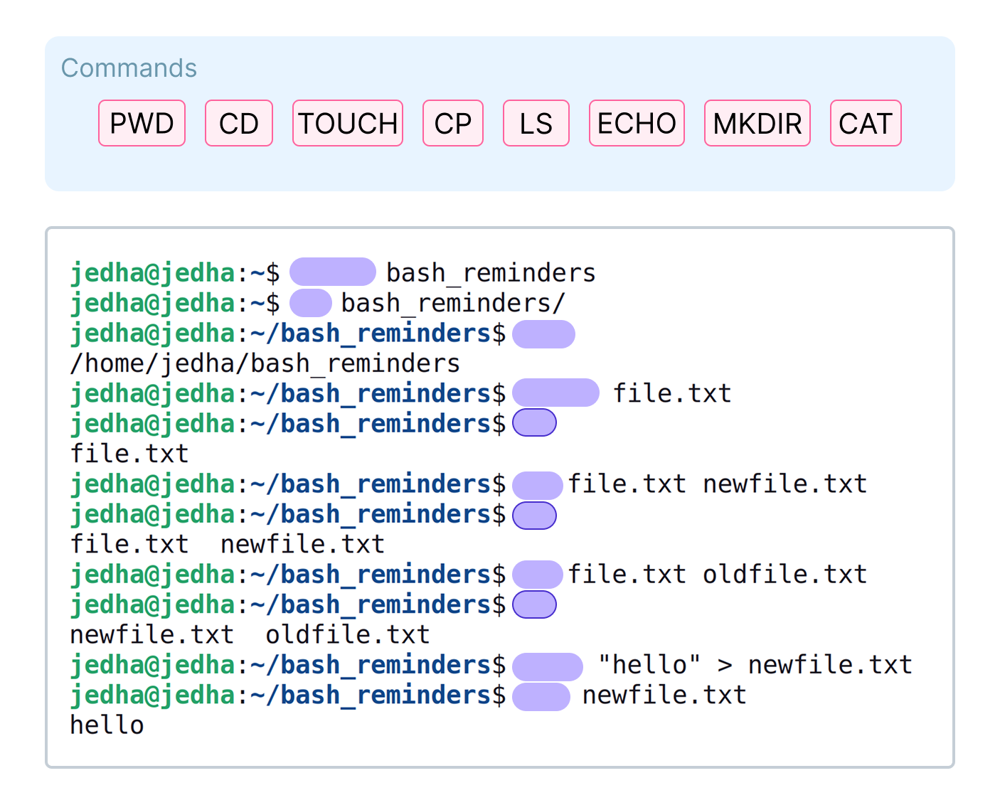

# Bash et scripts

**Durée : 45 min**

## Ce que vous allez apprendre dans ce cours

Dans cette leçon, nous allons revoir les commandes bash et les scripts. Vous allez découvrir :

- comment rediriger la sortie ou l'entrée de vos commandes,
- comment compresser des fichiers,
- ce que sont les liens de fichiers et comment les gérer,
- et bien d'autres astuces sur bash.

---

## Commandes Bash

Vous devriez déjà être familier avec les commandes bash de base. Voici un rappel des commandes essentielles :



Les commandes de base à connaître : `pwd`, `cd`, `touch`, `cp`, `ls`, `echo`, `mkdir`, `cat`.

### Redirections d'entrée et de sortie

Vous connaissez déjà comment rediriger la sortie de vos commandes avec `>` et `|`. Voici d'autres exemples de redirections.

#### `2>` - Rediriger la sortie d'erreur standard (stderr)

Vous pouvez utiliser `2>` et `2>>` pour rediriger ou ajouter les messages d'erreur vers un fichier spécifique :

```bash
ls fichierinexistant 2> error.log
```

Cette redirection est souvent utilisée par les attaquants pour masquer les erreurs :

```bash
./exploit.sh 2>/dev/null
```

#### `&>` - Rediriger stdout et stderr

Vous pouvez rediriger à la fois la sortie standard et la sortie d'erreur avec `&>` :

```bash
./script.sh &> output.log
```

Équivalent à :

```bash
./script.sh > output.log 2>&1
```

#### `<` - Rediriger l'entrée

Plusieurs façons de rediriger l'entrée vers une commande :

```bash
# Depuis un fichier
$ sort < noms.txt

# Here document (<<) - plusieurs lignes
$ sort <<EOF
Nimona
Alice
John
Bob
EOF

# Here string (<<<) - une seule ligne
$ grep waldo <<< "Où est waldo dans cette phrase?"
```

**Résumé des redirections d'entrée :**
| Symbole | Usage |
|---------|-------|
| `<` | Depuis un fichier |
| `<<` | Bloc de plusieurs lignes (here document) |
| `<<<` | Une seule chaîne (here string) |

---

### Expressions régulières pour grep et sed

Les expressions régulières (regex) sont des motifs utilisés pour faire correspondre des combinaisons de caractères dans du texte.

| Symbole | Signification |
|---------|---------------|
| `.` | Correspond à n'importe quel caractère unique |
| `*` | Correspond à zéro ou plusieurs du caractère précédent |
| `^` | Correspond au début d'une ligne |
| `$` | Correspond à la fin d'une ligne |
| `[abc]` | Correspond à un des caractères a, b ou c |
| `[^abc]` | Correspond à tout caractère sauf a, b ou c |

Exemple : le motif `^[A-Z][a-z]*$` recherche toute ligne contenant uniquement une majuscule suivie de minuscules (comme un prénom).

```bash
# Supprimer toutes les lignes commençant par # (commentaires)
$ sed '/^#/d' script.py
```

> **Attention** : `*` en bash (wildcard) et `*` en regex ont des significations différentes !
> - `grep 'http' *` : cherche "http" dans tous les fichiers du répertoire
> - `grep 'http.*pdf' log.txt` : cherche une URL commençant par http et finissant par pdf

---

### Archiver et compresser des fichiers

#### tar - Archiver des fichiers

`tar` combine plusieurs fichiers en une seule archive sans les compresser :

```bash
# Créer une archive
$ tar -cvf archive.tar fichier1.txt fichier2.txt

# Extraire une archive
$ tar -xvf archive.tar
```

#### gzip - Compresser des fichiers

`gzip` compresse un seul fichier avec l'algorithme Deflate :

```bash
# Compresser
$ gzip archive.tar
# Résultat : archive.tar.gz

# Décompresser
$ gzip -d archive.tar.gz

# Décompresser et extraire en une commande
$ tar -xvzf archive.tar.gz
```

#### bzip2 - Compression plus élevée

`bzip2` compresse plus efficacement que gzip, mais est plus lent :

```bash
# Compresser
$ bzip2 archive.tar

# Décompresser
$ bunzip2 archive.tar.bz2
```

---

### Gérer les liens de fichiers

Les liens permettent de référencer des fichiers à plusieurs endroits sans dupliquer leur contenu.

#### Lien physique (hard link)

Crée un autre nom pour le même contenu de fichier. Supprimer l'original ne supprime pas les données tant qu'un lien physique existe :

```bash
ln rapport.txt rapport_copie.txt
```

**Utilisation** : organiser les mêmes fichiers de différentes manières sans duplication.

#### Lien symbolique (symlink)

Pointe vers un autre fichier ou répertoire. Si la cible est supprimée, le symlink est cassé :

```bash
ln -s /var/log/syslog dernier-log
```

**Utilisation typique** : bibliothèques partagées en Linux :

```
lrwxrwxrwx. 1 root root 16 Dec 2 15:24 /usr/lib64/libcurl.so -> libcurl.so.4.2.0
```

---

### Accéder à la documentation système

```bash
# Ouvrir la page de manuel d'une commande
$ man ls
```

---

### head et tail

Pour manipuler de gros fichiers, utilisez `head` (début) et `tail` (fin) :

```bash
# Afficher les 5 dernières lignes et suivre les nouvelles
$ tail -n 5 -f /var/log/syslog
```

---

## Variables d'environnement

Les variables d'environnement sont des valeurs dynamiques qui affectent le comportement de votre shell et du système.

```bash
# Voir toutes les variables
$ printenv

# Voir une variable spécifique
$ echo $PATH

# Définir une variable temporaire
$ MY_VAR="Hello"
$ echo $MY_VAR

# Exporter pour les sous-processus
$ export MY_VAR
```

**Variables courantes :**

| Variable | Description |
|----------|-------------|
| `PATH` | Liste des répertoires où le shell cherche les exécutables |
| `HOME` | Pointe vers votre répertoire personnel |
| `USER` | Affiche votre nom d'utilisateur |

> **Sécurité** : Un `PATH` mal configuré peut permettre à un attaquant d'exécuter des binaires malveillants. Des variables comme `LD_PRELOAD` ou des secrets exposés (clés API, mots de passe) peuvent être exploités.

---

## Scripts Bash

### Shebang

La ligne au début d'un script indiquant quel interpréteur utiliser :

```bash
#!/usr/bin/env bash
```

Utiliser `env` est plus portable car il recherche bash dans le `PATH` de l'utilisateur.

Pour Python :
```bash
#!/usr/bin/env python3
```

### La commande set

`set` peut modifier les attributs du shell pour rendre vos scripts plus robustes :

| Option | Effet |
|--------|-------|
| `set -e` | Quitte immédiatement si une commande échoue |
| `set -x` | Affiche toutes les commandes exécutées (debug) |
| `set -u` | Traite les variables non définies comme des erreurs |
| `set -o pipefail` | Fait échouer le pipeline si une commande échoue |

```bash
#!/usr/bin/env bash
set -e
```

### Exit et codes de sortie

Chaque commande retourne un code de sortie : `0` = succès, autre = échec.

```bash
# Vérifier le code de la dernière commande
$ ls /chemin/inexistant
$ echo $?
2

# Quitter un script avec un code spécifique
exit 1
```

---

## Glossaire des sigles et définitions

| Sigle/Terme | Définition |
|-------------|------------|
| **Bash** | Bourne Again SHell - Interpréteur de commandes par défaut sur la plupart des systèmes Linux |
| **stdin** | Standard Input - Entrée standard (fichier descripteur 0) |
| **stdout** | Standard Output - Sortie standard (fichier descripteur 1) |
| **stderr** | Standard Error - Sortie d'erreur standard (fichier descripteur 2) |
| **Pipe** | Tube (`\|`) - Connecte la sortie d'une commande à l'entrée d'une autre |
| **Regex** | Regular Expression - Expression régulière, motif de recherche |
| **Shebang** | `#!` - Indique l'interpréteur à utiliser pour un script |
| **Hard link** | Lien physique - Pointe directement vers les données du fichier |
| **Symlink** | Symbolic link - Lien symbolique, pointe vers le chemin du fichier |
| **Here document** | Bloc de texte multi-ligne utilisé comme entrée (`<<`) |
| **Here string** | Chaîne unique utilisée comme entrée (`<<<`) |

---

## Récapitulatif des commandes

### Redirections

| Commande | Description |
|----------|-------------|
| `cmd > fichier` | Rediriger stdout vers un fichier (écrase) |
| `cmd >> fichier` | Rediriger stdout vers un fichier (ajoute) |
| `cmd 2> fichier` | Rediriger stderr vers un fichier |
| `cmd &> fichier` | Rediriger stdout et stderr vers un fichier |
| `cmd < fichier` | Utiliser un fichier comme entrée |
| `cmd1 \| cmd2` | Pipe - sortie de cmd1 vers entrée de cmd2 |

### Archivage et compression

| Commande | Description |
|----------|-------------|
| `tar -cvf archive.tar fichiers` | Créer une archive tar |
| `tar -xvf archive.tar` | Extraire une archive tar |
| `tar -xvzf archive.tar.gz` | Extraire une archive tar compressée gzip |
| `gzip fichier` | Compresser avec gzip |
| `gzip -d fichier.gz` | Décompresser gzip |
| `bzip2 fichier` | Compresser avec bzip2 |
| `bunzip2 fichier.bz2` | Décompresser bzip2 |

### Liens

| Commande | Description |
|----------|-------------|
| `ln fichier lien` | Créer un lien physique |
| `ln -s cible lien` | Créer un lien symbolique |

### Texte et recherche

| Commande | Description |
|----------|-------------|
| `grep 'motif' fichier` | Rechercher un motif dans un fichier |
| `sed 's/ancien/nouveau/g' fichier` | Remplacer du texte |
| `head -n X fichier` | Afficher les X premières lignes |
| `tail -n X fichier` | Afficher les X dernières lignes |
| `tail -f fichier` | Suivre les nouvelles lignes en temps réel |

### Variables et environnement

| Commande | Description |
|----------|-------------|
| `printenv` | Afficher toutes les variables d'environnement |
| `echo $VAR` | Afficher la valeur d'une variable |
| `export VAR=valeur` | Définir et exporter une variable |

### Documentation

| Commande | Description |
|----------|-------------|
| `man commande` | Afficher le manuel d'une commande |

---

## Ressources pratiques - TryHackMe / HackTheBox

| Plateforme | Lien | Description |
|------------|------|-------------|
| TryHackMe | [Linux Fundamentals Part 2](https://tryhackme.com/room/linuxfundamentalspart2) | Redirections et scripts |
| TryHackMe | [Bash Scripting](https://tryhackme.com/room/dvbashscripting) | Scripts Bash avancés |
| TryHackMe | [Regular Expressions](https://tryhackme.com/room/dvregularexpressions) | Expressions régulières |

---

## Ressources

- GameShell: a "game" to teach the Unix shell - Pierre Hyvernat
- BashGuide - Lhunath
- The Shell - Missing Semester (Youtube)
