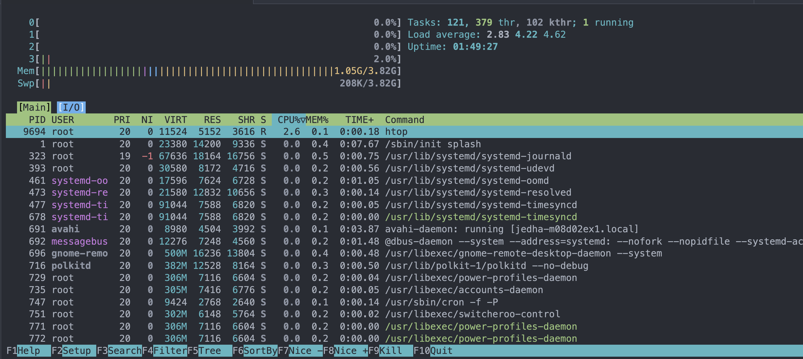

# Write-up : Investigation d'un processus gourmand en ressources

## Contexte

Skyview Media, une entreprise de production de contenu numerique, rencontre des ralentissements sur une de leurs stations de travail Linux. Des processus semblent consommer des ressources systeme importantes sans raison apparente.

**Objectif** : Identifier le probleme et arreter les processus responsables.

---

## Step 1 : Identifier le processus problematique

### Analyse initiale avec top

```bash
top
```

**Resultat** : Plusieurs processus `dd` consomment ~80% du CPU chacun.

```
    PID USER      PR  NI    VIRT    RES    SHR S  %CPU  %MEM     TIME+ COMMAND
   2837 root      20   0    8328   2028   2028 R  82.7   0.1  31:07.53 dd
   2817 root      20   0    8328   2028   2028 R  82.4   0.1  31:38.28 dd
   2787 root      20   0    8328   2028   2028 R  80.1   0.1  32:36.02 dd
```

### Confirmation avec ps

```bash
ps aux --sort=-%cpu
```

**Commande executee** :
```
dd if=/dev/zero of=/dev/null
```

Cette commande lit depuis `/dev/zero` (source infinie de zeros) et ecrit vers `/dev/null` (trou noir). C'est une methode classique pour consommer du CPU artificiellement.

### Tentative de resolution

```bash
kill <PID>
```

**Resultat** : Les processus reviennent apres quelques secondes. Il y a donc un mecanisme qui les relance.

---

## Step 2 : Trouver le parent des processus

### Methode 1 : Via /proc

```bash
cat /proc/<PID>/status | grep PPid
```

**Resultat** : `PPid: 700`

### Identifier le parent (PID 700)

```bash
cat /proc/700/status
```

**Resultat** :
```
Name:   backup.sh
PPid:   1
```

### Contenu du script

```bash
cat /usr/local/bin/backup.sh
```

```bash
#!/bin/bash

while true; do
    count=$(pgrep -fc "dd if=/dev/zero of=/dev/null")
    if [ "$count" -lt 5 ]; then
        dd if=/dev/zero of=/dev/null &
    fi
    sleep 30
done
```

**Analyse** : Le script maintient en permanence 5 processus `dd` en cours d'execution. Si un processus est tue, il en relance un nouveau.

---

## Step 3 : Trouver la source du script

Le PPid du script `backup.sh` est 1, ce qui signifie qu'il est lance par **systemd**.

### Recherche du service

```bash
systemctl list-units --type=service --state=running
```

**Resultat** : Un service suspect apparait :
```
myservice.service             loaded active running My service!
```

### Inspection du service

```bash
systemctl cat myservice.service
```

```ini
[Unit]
Description=My service!

[Service]
ExecStart=/usr/local/bin/backup.sh

[Install]
WantedBy=multi-user.target
```

### Arret du service

```bash
systemctl stop myservice.service
systemctl disable myservice.service
```

**Resultat** : Les processus `dd` reviennent toujours apres quelques instants !

---

## Step 4 : Trouver le dernier element

Quelque chose relance le service meme apres l'avoir arrete et desactive.

### Verification des cron jobs

```bash
crontab -l                 # Rien
cat /etc/crontab           # Contenu standard
ls /etc/cron.d/            # Rien de suspect
```

### Verification des timers systemd

```bash
systemctl list-timers
```

**Resultat** : Un timer suspect apparait :
```
-      - Thu 2026-01-22 13:23:18 CET   12ms ago watcher.timer   watcher.service
```

### Inspection du watcher

```bash
systemctl cat watcher.service
```

```ini
[Unit]
Description=My watcher!
After=myservice.service

[Service]
Type=oneshot
ExecStart=/bin/bash -c 'systemctl is-active --quiet myservice || systemctl start myservice'

[Install]
WantedBy=multi-user.target
```

**Analyse** : Ce service est un **watchdog** qui verifie periodiquement si `myservice` est actif. Si ce n'est pas le cas, il le relance.

### Resolution finale

```bash
systemctl stop watcher.timer
systemctl disable watcher.timer
systemctl stop watcher.service
systemctl disable watcher.service
systemctl stop myservice.service
systemctl disable myservice.service
```

---

## Resume de la chaine de persistance

```
watcher.timer (timer systemd)
    └── watcher.service (watchdog)
            └── myservice.service (service principal)
                    └── /usr/local/bin/backup.sh (script)
                            └── dd if=/dev/zero of=/dev/null (processus gourmands)
```

---

## Commandes utiles apprises

| Commande | Description |
|----------|-------------|
| `top` / `htop` | Visualiser les processus en temps reel |
| `ps aux --sort=-%cpu` | Lister les processus tries par CPU |
| `cat /proc/<PID>/status` | Voir les infos d'un processus (dont PPid) |
| `cat /proc/<PID>/comm` | Nom du processus |
| `systemctl list-units --type=service` | Lister les services |
| `systemctl cat <service>` | Voir la configuration d'un service |
| `systemctl list-timers` | Lister les timers systemd |
| `systemctl stop/disable <service>` | Arreter et desactiver un service |

---

## Resultat final

Apres avoir desactive tous les elements de la chaine de persistance, le systeme est revenu a la normale :



Plus aucun processus `dd` ne consomme les ressources.

---

## A retenir

1. **Toujours remonter la chaine des parents** : Un processus suspect a souvent un parent qui le lance.

2. **PPid = 1 signifie systemd** : Le processus est gere par le systeme d'init.

3. **Les timers systemd peuvent servir de watchdog** : Ils permettent de relancer des services periodiquement.

4. **La persistance peut etre multicouche** : Arreter un service ne suffit pas toujours, il faut aussi verifier ce qui pourrait le relancer (timers, cron, autres services).
