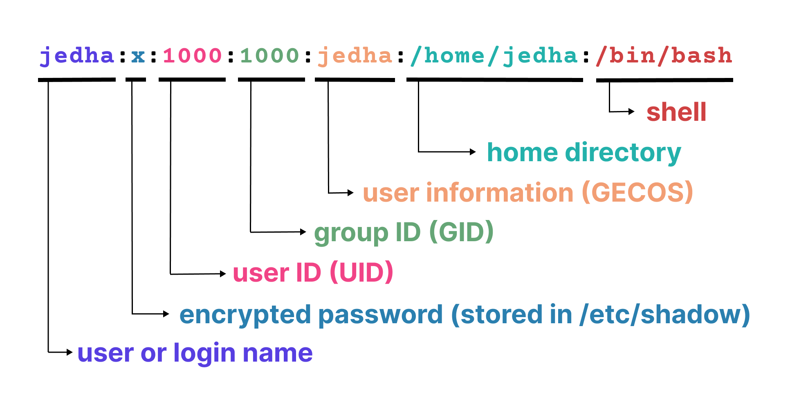
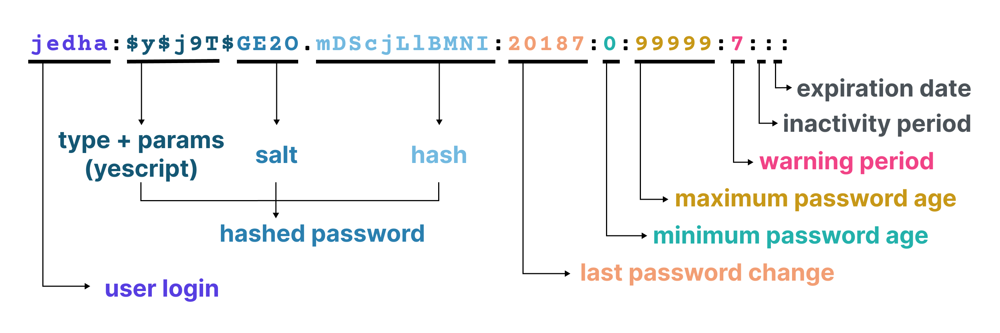
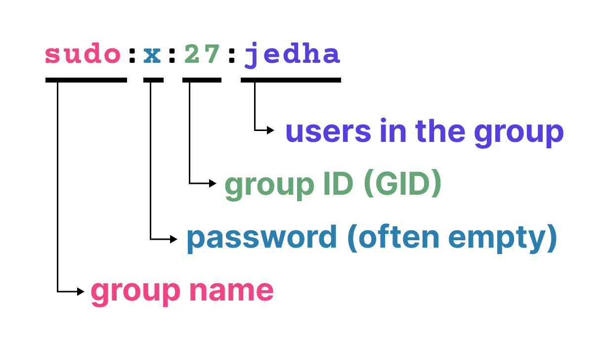
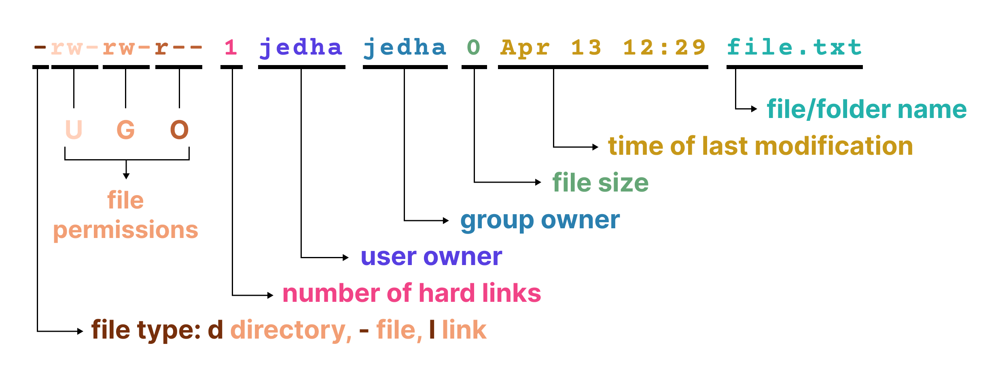

# Utilisateurs et permissions

**Durée : 50 min**

## Ce que vous allez apprendre dans ce cours

Comprendre les utilisateurs et les groupes sous Linux est crucial car ils constituent le fondement du modèle de sécurité et de permissions du système. Ils contrôlent qui peut accéder aux fichiers, exécuter des commandes et utiliser les ressources système. Dans cette leçon, vous allez :

- voir les concepts d'utilisateur et de groupe,
- revoir les principales commandes de gestion des utilisateurs,
- découvrir le composant PAM,
- (ré)apprendre les permissions de fichiers sous Linux.

---

## Utilisateurs et groupes

Il existe trois types d'utilisateurs sous Linux :

| Type | Description |
|------|-------------|
| **Utilisateurs réguliers** | Accès limité aux ressources, nécessitent des privilèges élevés (via sudo) pour les tâches administratives |
| **Utilisateurs système** | Créés pour exécuter des services spécifiques (ex: postgres pour PostgreSQL). Ces comptes n'ont généralement pas de capacité de connexion |
| **Utilisateur root** | Superutilisateur avec accès illimité au système. Peut modifier n'importe quel fichier, installer des logiciels et gérer tous les utilisateurs |

Les utilisateurs sont organisés en **groupes** : collections d'utilisateurs permettant aux administrateurs de gérer les permissions collectivement plutôt qu'individuellement.

### Fichiers de gestion des utilisateurs

| Fichier | Contenu |
|---------|---------|
| `/etc/passwd` | Informations utilisateur : nom, UID, GID, répertoire home, shell |
| `/etc/shadow` | Mots de passe hachés et informations de connexion |
| `/etc/group` | Liste des groupes avec leurs membres |

**Structure d'une entrée `/etc/passwd` :**



**Structure d'une entrée `/etc/shadow` :**



**Structure d'une entrée `/etc/group` :**



### UID et GID

- Chaque utilisateur a un **UID** (User ID) unique
- UID 1-500 : généralement réservés aux utilisateurs système
- UID >= 1000 : utilisateurs réguliers (sur Ubuntu)
- Quand vous créez un utilisateur, un groupe du même nom est créé (groupe primaire)
- Les autres groupes sont des **groupes supplémentaires**

### Le groupe sudoers

Le groupe **sudo** (ou **wheel** sur CentOS/RedHat) est un groupe spécial qui accorde à ses membres la capacité d'exécuter des commandes avec des privilèges élevés via la commande `sudo`.

Le fichier `/etc/sudoers` définit quels utilisateurs ou groupes peuvent exécuter des commandes en tant qu'autres utilisateurs (généralement root). Ce fichier doit être édité avec `visudo`.

Exemple de configuration :
```
# Spécification des privilèges utilisateur
root ALL=(ALL:ALL) ALL

# Permettre aux membres du groupe sudo d'exécuter toute commande
%sudo ALL=(ALL:ALL) ALL

# Permettre aux membres du groupe admin
%admin ALL=(ALL) ALL
```

Pour voir les dernières commandes sudo :
```bash
journalctl -e | grep sudo
```

---

## Commandes de gestion des utilisateurs

| Commande | Description |
|----------|-------------|
| `useradd` ou `adduser` | Créer un nouveau compte |
| `usermod` | Modifier les attributs d'un utilisateur (groupes, etc.) |
| `userdel` | Supprimer un compte |
| `groupadd` | Créer un groupe |
| `groupmod` | Modifier un groupe |
| `groupdel` | Supprimer un groupe |
| `groups utilisateur` | Voir les groupes d'un utilisateur |
| `id utilisateur` | Afficher UID, GID et groupes |
| `su` | Changer d'utilisateur |

---

## Authentification utilisateur

### PAM : gestion centralisée de l'authentification

PAM (Pluggable Authentication Modules) est une bibliothèque qui valide les identifiants utilisateur/mot de passe. Elle vérifie contre le stockage sécurisé des mots de passe (`/etc/shadow`).

Lors d'une connexion, voici ce qui se passe :

1. L'application de connexion déclenche la pile PAM configurée pour ce service (depuis `/etc/pam.d/login`, `/etc/pam.d/su`, etc.)
2. PAM lit le fichier de configuration depuis `/etc/pam.d`
3. PAM exécute les modules suivants :
   - **account** : valide que le compte est en bon état (expirations, limites)
   - **authentication** : vérifie l'identité (demande de mot de passe)
   - **password** : actions liées aux changements de mot de passe
   - **session** : tâches de début et fin de session (logs, nettoyage)
4. Si la connexion réussit, l'application utilise `setuid()` pour passer à l'UID de l'utilisateur

### Configuration PAM

Avec PAM, vous pouvez :

**Appliquer des politiques de mot de passe avec `pam_pwquality.so` :**
```
password requisite pam_pwquality.so retry=3 minlen=12
```

**Limiter les tentatives de connexion avec `pam_tally2.so` :**
```
auth required pam_tally.so onerr=fail deny=3 no_magic_root
```

**Activer l'authentification à deux facteurs** avec des modules comme `pam_google_authenticator.so` ou `pam_oath.so`.

---

## Propriétaires et permissions de fichiers

### Visualiser les permissions

```bash
$ touch fichier.txt
$ ls -l
-rw-rw-r-- 1 jedha jedha 0 Apr 13 12:29 fichier.txt
```



### Les permissions RWX

Les permissions `rw-rw-r--` représentent trois ensembles pour :
- **user (u)** : le propriétaire du fichier
- **group (g)** : le groupe propriétaire
- **others (o)** : tous les autres utilisateurs

Ce trio est parfois appelé "UGO". Chacun peut avoir les permissions :

| Permission | Signification |
|------------|---------------|
| `r` (read) | Lecture |
| `w` (write) | Écriture |
| `x` (execute) | Exécution |

### Propriétaire et groupe propriétaire

Dans l'exemple `jedha jedha`, le premier est l'utilisateur propriétaire, le second est le groupe propriétaire.

### Comment le noyau vérifie les permissions

1. Chaque processus s'exécute sous un UID et GID, hérités de l'utilisateur qui l'exécute
2. Quand un processus accède à un fichier, le noyau compare l'UID/GID du processus avec les métadonnées du fichier
3. Logique appliquée :
   - Si UID processus == UID fichier → utiliser les bits utilisateur
   - Sinon si GID processus == GID fichier → utiliser les bits groupe
   - Sinon → utiliser les bits autres
4. Si aucun bit ne correspond à l'action demandée, le noyau retourne une erreur (EACCES)

---

## Commandes de gestion des permissions

### chown - Changer le propriétaire

```bash
# Changer le propriétaire
$ sudo chown john fichier.txt

# Changer le groupe propriétaire
$ sudo chown :developers fichier.txt

# Changer les deux
$ sudo chown john:developers fichier.txt
```

### chmod - Changer les permissions

#### Mode symbolique

Trois composants :
1. Qui : `u` (user), `g` (group), `o` (others), `a` (all)
2. Action : `+` (ajouter), `-` (retirer), `=` (définir)
3. Permission : `r`, `w`, `x`

```bash
# Ajouter exécution au propriétaire, retirer écriture au groupe, lecture seule aux autres
$ chmod u+x,g-w,o=r fichier
```

#### Mode numérique

Chaque chiffre est une somme des bits de permission :

| Permission | Valeur |
|------------|--------|
| `---` | 0 |
| `--x` | 1 |
| `-w-` | 2 |
| `-wx` | 3 |
| `r--` | 4 |
| `r-x` | 5 |
| `rw-` | 6 |
| `rwx` | 7 |

```bash
# 754 = rwx (7) pour user, r-x (5) pour group, r-- (4) pour others
$ chmod 754 fichier.txt
```

---

## SUID et SGID

### SUID (Set User ID)

Quand le bit SUID est défini sur un exécutable, le processus s'exécute avec les privilèges du propriétaire du fichier, pas de l'utilisateur qui l'exécute.

Exemple : `/usr/bin/sudo`
```bash
$ ls -l /usr/bin/sudo
-rwsr-xr-x 1 root root 335120 Apr 8 2024 /usr/bin/sudo
```

Le `s` au lieu de `x` indique le bit SUID. Grâce à cela, `sudo` s'exécute avec l'UID effectif 0 (root).

### SGID (Set Group ID)

- Sur les exécutables : le processus s'exécute avec les permissions du groupe du fichier
- Sur les répertoires : les nouveaux fichiers héritent du groupe du répertoire

### Le sticky bit

Permission spéciale utilisée principalement sur les répertoires partagés. Quand il est défini, seul le propriétaire du fichier (ou root) peut supprimer ou renommer les fichiers.

Exemple : `/tmp`
```
drwxrwxrwt
```

Le `t` à la fin indique le sticky bit.

---

## ACLs : permissions à grain fin

Les listes de contrôle d'accès (ACL) étendent le modèle de permissions de base en permettant à plusieurs utilisateurs et groupes d'avoir des droits d'accès personnalisés sur un seul fichier.

```bash
# Voir les ACLs
$ getfacl fichier.txt

# Donner l'accès en lecture à john
$ sudo setfacl -m u:john:r fichier.txt
```

---

## Les permissions de fichiers ne font pas tout

Les permissions de fichiers sont essentielles mais ne couvrent pas toutes les actions :

| Domaine | Mécanisme |
|---------|-----------|
| **Processus** | Envoyer des signaux, changer les priorités, utiliser ptrace |
| **Réseau** | Lier aux ports privilégiés (<1024), ouvrir des sockets raw |
| **Capabilities** | Les capabilities Linux divisent les privilèges root en unités discrètes |
| **Modules de sécurité** | SELinux et AppArmor appliquent des politiques obligatoires |
| **Opérations système** | Monter des systèmes de fichiers, charger des modules noyau |

---

## Glossaire des sigles et définitions

| Sigle/Terme | Définition |
|-------------|------------|
| **UID** | User ID - Identifiant unique de l'utilisateur |
| **GID** | Group ID - Identifiant unique du groupe |
| **PAM** | Pluggable Authentication Modules - Modules d'authentification enfichables |
| **SUID** | Set User ID - Bit spécial permettant l'exécution avec les privilèges du propriétaire |
| **SGID** | Set Group ID - Bit spécial pour les privilèges de groupe |
| **ACL** | Access Control List - Liste de contrôle d'accès |
| **UGO** | User, Group, Others - Les trois catégories de permissions |
| **Sticky bit** | Bit spécial empêchant la suppression de fichiers par des non-propriétaires |
| **Root** | Superutilisateur avec tous les privilèges (UID 0) |
| **Sudoers** | Fichier définissant qui peut utiliser sudo et comment |

---

## Récapitulatif des commandes

### Gestion des utilisateurs

| Commande | Description |
|----------|-------------|
| `useradd nom` | Créer un utilisateur |
| `adduser nom` | Créer un utilisateur (interactif) |
| `usermod -aG groupe user` | Ajouter un utilisateur à un groupe |
| `userdel nom` | Supprimer un utilisateur |
| `passwd nom` | Changer le mot de passe |
| `su - utilisateur` | Changer d'utilisateur |
| `sudo commande` | Exécuter en tant que root |
| `id` | Afficher UID, GID et groupes |
| `groups` | Afficher les groupes |
| `whoami` | Afficher l'utilisateur courant |

### Gestion des groupes

| Commande | Description |
|----------|-------------|
| `groupadd nom` | Créer un groupe |
| `groupmod -n nouveau ancien` | Renommer un groupe |
| `groupdel nom` | Supprimer un groupe |

### Permissions

| Commande | Description |
|----------|-------------|
| `ls -l` | Afficher les permissions |
| `chmod 755 fichier` | Changer les permissions (numérique) |
| `chmod u+x fichier` | Ajouter exécution au propriétaire |
| `chown user:group fichier` | Changer propriétaire et groupe |
| `chown user fichier` | Changer le propriétaire |
| `chown :group fichier` | Changer le groupe |

### ACLs

| Commande | Description |
|----------|-------------|
| `getfacl fichier` | Voir les ACLs d'un fichier |
| `setfacl -m u:user:rwx fichier` | Définir une ACL pour un utilisateur |
| `setfacl -m g:group:rx fichier` | Définir une ACL pour un groupe |
| `setfacl -x u:user fichier` | Supprimer une ACL |

### Fichiers importants

| Fichier | Description |
|---------|-------------|
| `/etc/passwd` | Informations des utilisateurs |
| `/etc/shadow` | Mots de passe hachés |
| `/etc/group` | Informations des groupes |
| `/etc/sudoers` | Configuration sudo |
| `/etc/pam.d/` | Configuration PAM |

---

## Ressources pratiques - TryHackMe / HackTheBox

| Plateforme | Lien | Description |
|------------|------|-------------|
| TryHackMe | [Linux Fundamentals Part 2](https://tryhackme.com/room/linuxfundamentalspart2) | Permissions Linux |
| TryHackMe | [Linux Privilege Escalation](https://tryhackme.com/room/linprivesc) | Élévation de privilèges |
| TryHackMe | [Linux PrivEsc](https://tryhackme.com/room/dvlinuxprivesc) | Techniques privesc |
| HackTheBox | [Starting Point](https://app.hackthebox.com/starting-point) | Machines avec permissions mal configurées |

---

## Ressources

- Working With Users and Groups - Engineer Man (Youtube)
- How to interpret Linux user info
- Linux PAM Tutorial - Linux Code
- Check Linux file permissions with ls - rackspace.com
