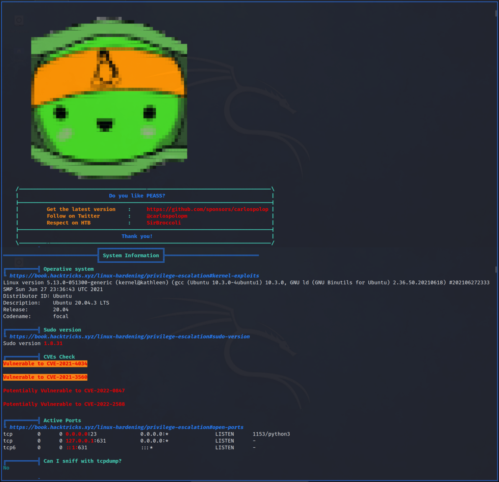

# Exploitation et reconnaissance Linux

**Durée : 45 min**

## Ce que vous allez apprendre dans ce cours

Nous avons parlé du système Linux et vu globalement comment il fonctionne, mais quel est le scénario d'attaque ? Dans cette leçon, vous allez :

- apprendre les bases de l'exploitation Linux et de l'élévation de privilèges,
- découvrir des techniques d'escalade classiques,
- vous familiariser avec les scanners d'élévation de privilèges.

---

## Introduction à l'exploitation Linux

L'**exploitation Linux** désigne le processus de tirer avantage des faiblesses ou des mauvaises configurations d'un système Linux pour obtenir un accès non autorisé ou des privilèges plus élevés.

### Scénarios d'attaque

**Obtenir un accès non autorisé** : un attaquant réussit à se placer sur le même réseau que votre machine. Il n'a pas encore accès mais cherche à entrer en exploitant la façon dont votre machine interagit avec le monde extérieur.

**Élévation de privilèges (privilege escalation)** : un attaquant a trouvé une vulnérabilité web et a accès à la machine avec un utilisateur peu privilégié (ex: l'utilisateur du serveur web). Il veut maintenant voir s'il peut s'exécuter en tant que root ou un autre utilisateur privilégié.

Ces vulnérabilités proviennent souvent de :
- Permissions mal configurées
- Services exposés
- Logiciels obsolètes
- Erreurs humaines

> **Important** : de nombreux exploits ne sont pas des zero-days avancés. Les attaquants utilisent souvent des fonctionnalités légitimes de manière non prévue. Les mauvaises configurations sudo, les scripts de sauvegarde oubliés ou les anciens binaires setuid sont des points d'entrée fréquents.

### Post-exploitation

Une fois une vulnérabilité exploitée, les attaquants ont d'autres objectifs :
- **Persistence** : garder l'accès actif après les redémarrages (cron jobs, binaires backdoorés, clés SSH)
- **Exfiltration** : collecter et transférer silencieusement des données (scp, curl, canaux secrets)

---

## Techniques de reconnaissance et d'élévation de privilèges

### Énumération des utilisateurs

Quand un attaquant accède à un nouveau système, il doit d'abord déterminer : qui suis-je ?

```bash
# Commandes de base
$ whoami
$ groups
$ id
```

**Énumérer les comptes utilisateurs :**
```bash
# Afficher uniquement les noms d'utilisateurs
$ cat /etc/passwd | cut -d: -f1

# Lister tous les utilisateurs et leurs groupes
$ for i in $(cut -d":" -f1 /etc/passwd 2>/dev/null);do id $i;done 2>/dev/null | sort
```

**Lister les utilisateurs avec accès console :**
```bash
cat /etc/passwd | grep "sh$"
```

**Découvrir les superutilisateurs (UID 0) :**
```bash
awk -F: '($3 == "0") {print}' /etc/passwd
```

**Vérifier les connexions :**
```bash
# Qui est connecté actuellement
$ who
$ w

# Historique des connexions
$ last -n 5
```

---

### Exploiter les groupes sudo et admin

Le groupe **sudo** (ou **admin**, **wheel**) détermine les utilisateurs pouvant élever leurs privilèges.

**Configuration par défaut typique :**
```
%sudo    ALL=(ALL:ALL) ALL
%admin   ALL=(ALL:ALL) ALL
```

Si vous connaissez le mot de passe d'un utilisateur de ce groupe :
```bash
sudo su
```

**Vérifier les permissions sudo :**
```bash
sudo -l
```

#### Mauvaises configurations dangereuses

**NOPASSWD - Exécution sans mot de passe :**
```
User user may run the following commands on this host:
   (root) NOPASSWD: /usr/bin/vim
```

Un attaquant pourrait obtenir un shell root avec :
```bash
sudo /usr/bin/vim -c ':!ls'
```

> **GTFOBins** : site web répertoriant les binaires Unix pouvant être utilisés pour contourner les restrictions de sécurité locales.

**SETENV - Manipulation des variables d'environnement :**
```
User waldo may run the following commands on this host:
    (ALL) SETENV: backup.py
```

Un attaquant peut créer son propre module Python malveillant et l'injecter :
```bash
sudo PYTHONPATH=/tmp/exploit backup.py
```

Autres variables manipulables : `LD_PRELOAD`, `LD_LIBRARY_PATH`

---

### Abuser des binaires SUID

Un binaire SUID qui exécute des commandes shell sans restrictions peut être manipulé pour obtenir un shell avec privilèges élevés.

**Identifier les binaires SUID :**
```bash
find / -type f -perm -4000 2>/dev/null
```

Résultat typique :
```
/bin/ping
/usr/bin/newgrp
/usr/bin/passwd
/bin/umount
/bin/su
```

Les binaires SUID personnalisés (créés par les administrateurs) peuvent introduire des vulnérabilités car ils n'ont pas subi de revue de sécurité rigoureuse.

---

### Fichiers intéressants

Les fichiers peuvent être intéressants pour plusieurs raisons :

| Type | Exemples |
|------|----------|
| **Données sensibles** | Bases de données, clés API, mots de passe |
| **Configuration** | Fichiers avec identifiants en clair |
| **Historique** | Logs, anciennes sauvegardes |
| **Exécutables et scripts** | Tâches planifiées, scripts de gestion |

**Rechercher des fichiers par extension :**
```bash
find / -name '*.conf' 2>/dev/null
```

**Rechercher des fichiers par propriétaire :**
```bash
find / -user utilisateur_cible 2>/dev/null
```

**Rechercher "password" dans les fichiers .conf :**
```bash
find / -name '*.conf' -exec grep -i 'password' {} + 2>/dev/null
```

**Rechercher récursivement avec grep :**
```bash
grep -Ril "password" /etc/ 2>/dev/null
```

**Extraire les chaînes lisibles d'un binaire :**
```bash
strings binaire | grep 'password'
```

#### Types de fichiers à surveiller

| Fichier/Dossier | Intérêt |
|-----------------|---------|
| `/var/log` | Logs système (auth.log pour les tentatives de connexion) |
| `~/.bash_history` | Historique des commandes (peut contenir des identifiants) |
| Scripts world-writable | Peuvent être modifiés à des fins malveillantes |
| Fichiers `.bak`, `.old`, `.tmp` | Sauvegardes pouvant contenir des données sensibles non chiffrées |

**Trouver les fichiers modifiables :**
```bash
find / -type f -writable 2>/dev/null
```

---

## Scanners d'élévation de privilèges

Les scanners privesc examinent méthodiquement un système Linux pour trouver des informations et mauvaises configurations permettant une élévation de privilèges.

### Fonctionnement

1. **Énumération système** : collecte d'informations sur l'OS, logiciels installés, processus, permissions, variables d'environnement
2. **Identification de vulnérabilités** : croisement avec les vulnérabilités connues
3. **Vérification des mauvaises configurations** : fichiers `/etc/passwd` modifiables, sudoers mal configurés
4. **Génération de rapport** : vulnérabilités potentielles avec sévérité et techniques d'exploitation

### Outils principaux

| Outil | Description |
|-------|-------------|
| **LinEnum** | Script léger pour un aperçu rapide des faiblesses système. Moins intrusif, moins susceptible de déclencher des alertes |
| **Linux Exploit Suggester** | Se concentre sur l'identification des exploits possibles pour la version du noyau Linux |
| **LinPEAS** | Énumération approfondie, activement maintenu. Souvent le premier outil utilisé lors d'un test d'intrusion. Peut être plus lent et fournir beaucoup d'informations |

**Exemple de sortie LinPEAS :**



---

## Glossaire des sigles et définitions

| Sigle/Terme | Définition |
|-------------|------------|
| **Privilege escalation** | Élévation de privilèges - Obtenir des droits supérieurs à ceux initialement accordés |
| **Privesc** | Abréviation de privilege escalation |
| **SUID** | Set User ID - Bit permettant l'exécution avec les privilèges du propriétaire |
| **SGID** | Set Group ID - Bit permettant l'exécution avec les privilèges du groupe |
| **Zero-day** | Vulnérabilité inconnue du public et du vendeur |
| **Persistence** | Technique pour maintenir l'accès après un reboot ou une déconnexion |
| **Exfiltration** | Transfert non autorisé de données hors du système |
| **GTFOBins** | Base de données de binaires Unix exploitables pour contourner les restrictions |
| **NOPASSWD** | Directive sudo permettant l'exécution sans mot de passe |
| **SETENV** | Directive sudo permettant de modifier les variables d'environnement |
| **World-writable** | Fichier modifiable par tous les utilisateurs |
| **Énumération** | Phase de collecte d'informations sur un système cible |
| **Reconnaissance** | Phase initiale d'une attaque visant à collecter des informations |

---

## Récapitulatif des commandes

### Énumération utilisateurs

| Commande | Description |
|----------|-------------|
| `whoami` | Afficher l'utilisateur courant |
| `id` | Afficher UID, GID et groupes |
| `groups` | Afficher les groupes de l'utilisateur |
| `cat /etc/passwd \| cut -d: -f1` | Lister les noms d'utilisateurs |
| `cat /etc/passwd \| grep "sh$"` | Utilisateurs avec accès shell |
| `awk -F: '($3 == "0") {print}' /etc/passwd` | Trouver les utilisateurs root (UID 0) |
| `who` | Utilisateurs connectés |
| `w` | Utilisateurs connectés avec activité |
| `last -n 5` | 5 dernières connexions |

### Vérification sudo

| Commande | Description |
|----------|-------------|
| `sudo -l` | Lister les commandes autorisées avec sudo |
| `sudo su` | Passer root (si autorisé) |
| `cat /etc/sudoers` | Voir la configuration sudo (root requis) |

### Recherche de binaires SUID

| Commande | Description |
|----------|-------------|
| `find / -type f -perm -4000 2>/dev/null` | Trouver les binaires SUID |
| `find / -type f -perm -2000 2>/dev/null` | Trouver les binaires SGID |

### Recherche de fichiers

| Commande | Description |
|----------|-------------|
| `find / -name '*.conf' 2>/dev/null` | Fichiers de configuration |
| `find / -user utilisateur 2>/dev/null` | Fichiers d'un utilisateur |
| `find / -type f -writable 2>/dev/null` | Fichiers modifiables |
| `grep -Ril "password" /etc/` | Rechercher "password" dans /etc |
| `strings binaire \| grep 'password'` | Extraire chaînes d'un binaire |

### Détection d'activité malveillante

| Commande | Description |
|----------|-------------|
| `ps aux \| grep '/tmp\|/dev\|/home'` | Exécutables suspects |
| `ps aux \| grep '[b]ash'` | Processus bash |
| `watch 'ps -eo pid,ppid,cmd --sort=start_time \| tail'` | Surveiller les nouveaux processus |

---

## Ressources pratiques - TryHackMe / HackTheBox

| Plateforme | Lien | Description |
|------------|------|-------------|
| TryHackMe | [Linux Privilege Escalation](https://tryhackme.com/room/linprivesc) | Techniques d'élévation complètes |
| TryHackMe | [Linux PrivEsc Arena](https://tryhackme.com/room/dvlinuxprivescarena) | Pratique privesc |
| TryHackMe | [Enumeration](https://tryhackme.com/room/dvenumeration) | Techniques d'énumération |
| HackTheBox | [Machines Linux](https://app.hackthebox.com/machines) | Scénarios réalistes |

---

## Ressources

- Linux Privilege Escalation: Exploiting User Groups - Stefano Lanaro
- Gaining Root Access on linux using SUID - Attack Detect Defend (Youtube)
- Linux Privilege Escalation - Hacktricks
- How to use linPEAS - RedBlue Labs (Youtube)
- GTFOBins - gtfobins.github.io
