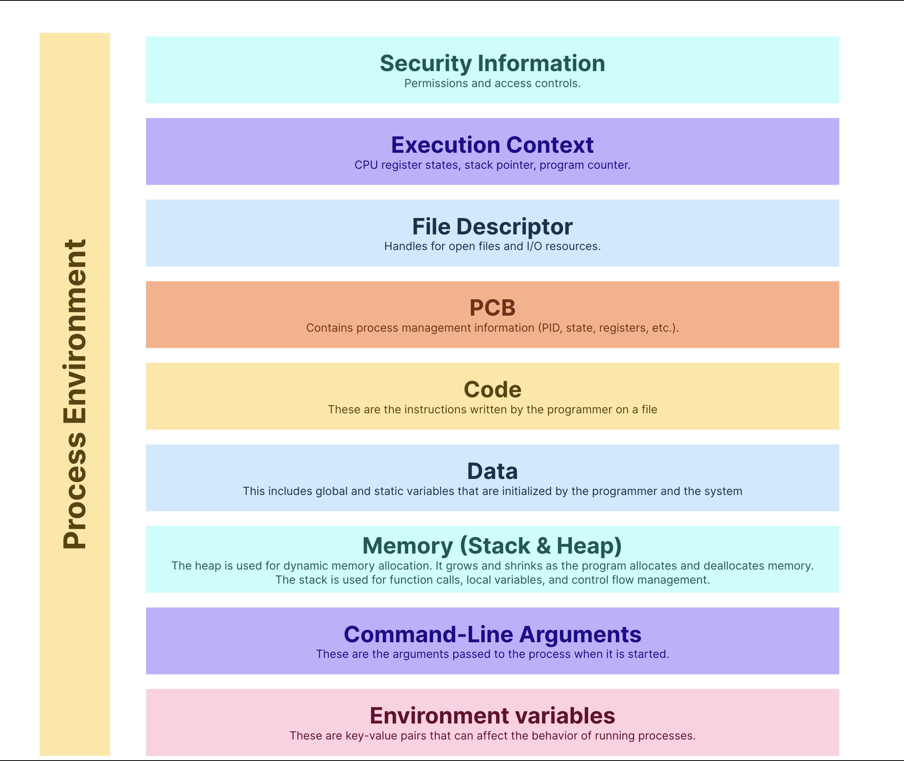
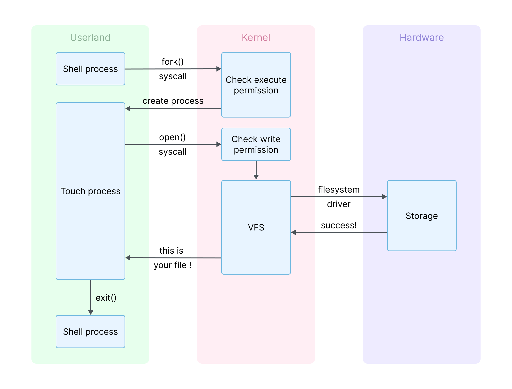
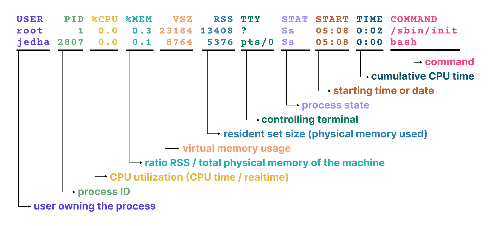

# Les processus Linux

**Durée : 70 min**

## Ce que vous allez apprendre dans ce cours

Hier, nous avons exploré comment les permissions définissent qui peut accéder aux fichiers, exécuter des commandes et modifier les ressources système. Mais ce ne sont pas les utilisateurs qui font le travail directement : les processus agissent en leur nom. Dans cette leçon, vous apprendrez à :

- identifier les processus actifs,
- les contrôler avec des signaux et des priorités,
- inspecter les détails d'un processus,
- limiter les ressources consommées par un processus.

---

## Qu'est-ce qu'un processus ?

Un **processus** sous Linux est une instance d'un programme en cours d'exécution par le système d'exploitation. Quand vous exécutez une commande, lancez une application ou exécutez un script, Linux crée un processus pour gérer cette tâche et lui attribue un **PID** (Process ID) unique.

### Programme vs processus

| Concept | Description |
|---------|-------------|
| **Programme** | Ensemble passif d'instructions et de données stockées sur disque |
| **Processus** | Exécution active de ces instructions, avec registres CPU et régions mémoire (heap, stack) |

### Environnement de processus

Un processus possède :
- Son propre espace d'adressage
- Ses fichiers ouverts
- Ses variables d'environnement
- Ses ressources système



Cette isolation garantit que les processus n'interfèrent pas entre eux.

### Création d'un processus

Un nouveau processus est créé quand un processus existant fait une copie exacte de lui-même :
- Le nouveau processus est le **processus enfant**
- L'original est le **processus parent**

**Exemple avec `touch file.txt` :**



1. `bash` utilise l'appel système `fork()` pour créer un processus enfant
2. La famille d'appels système `exec()` remplace le programme bash par `touch`
3. `touch` s'exécute : utilise mémoire et CPU, interagit avec le noyau
4. Une fois terminé, `touch` appelle `exit()`, envoyant un signal au parent
5. Le parent nettoie le processus avec l'appel système `wait()`

### Threads vs processus

| Concept | Description |
|---------|-------------|
| **Processus** | Instance d'un programme avec son propre espace mémoire |
| **Thread** | Unité d'exécution plus petite au sein d'un processus, partageant la mémoire |

Les threads sont plus légers et efficaces pour le traitement parallèle.

---

## Surveiller les processus

### La commande ps

`ps` (process status) donne un instantané des processus en cours. C'est un outil non interactif.

```bash
# Processus du shell courant
$ ps

# Tous les processus en format détaillé
$ ps aux
```

**Signification des options :**
- `a` : processus de tous les utilisateurs
- `u` : format orienté utilisateur
- `x` : inclut les processus sans terminal

**Explication des colonnes de ps aux :**



**Combiner ps et grep :**
```bash
ps aux | grep ssh
```

### États des processus (STAT)

| État | Symbole | Description |
|------|---------|-------------|
| Running | `R` | En cours d'exécution ou prêt à s'exécuter |
| Sleeping | `S` | En attente d'un événement (entrée utilisateur, données réseau...) |
| Disk Sleep | `D` | Sommeil non interruptible (attente I/O) - ne peut pas être tué |
| Stopped | `T` | Arrêté, souvent pour débogage |
| Zombie | `Z` | Terminé mais le parent n'a pas collecté son statut de sortie |
| Dead | `X` | Rare, processus plus en cours mais pas complètement nettoyé |

**Drapeaux supplémentaires :**
| Drapeau | Signification |
|---------|---------------|
| `<` | Haute priorité (plus de temps CPU) |
| `N` | Basse priorité |
| `L` | Pages verrouillées en mémoire |
| `s` | Leader de session |
| `+` | En premier plan |

### top et htop

Contrairement à `ps`, `top` et `htop` offrent une vue en temps réel, rafraîchie toutes les quelques secondes.

**Commande top :**
```bash
top
```


**Raccourcis dans top :**
| Touche | Action |
|--------|--------|
| `P` | Trier par CPU |
| `M` | Trier par mémoire |
| `k` | Tuer un processus (entrer PID) |
| `Shift+f` | Suivre un processus |
| `q` | Quitter |

**htop** est une alternative améliorée avec :
- Barres d'utilisation colorées
- Support souris
- F5 pour l'arbre des processus
- F3 pour rechercher
- F9 pour tuer

### pgrep et pidof

**pgrep** - Recherche par motif :
```bash
$ pgrep ssh
1990
268844

# Avec noms de processus
$ pgrep -l ssh

# Correspondance sur la ligne de commande complète
$ pgrep -lf systemd
```

**pidof** - Recherche par nom exact :
```bash
$ pidof sshd
268911 268846 268844
```

### Que surveiller ?

#### Utilisation élevée des ressources
- CPU élevé : application emballée, code inefficace, attaque DoS
- RAM élevée : fuites mémoire, swap excessif

```bash
ps aux --sort=-%cpu | head
```

#### Processus non réactifs ou bloqués
- Processus en état `D` (Disk Sleep) ou `Z` (Zombie)
- Peuvent causer l'épuisement des ressources

```bash
# Identifier les zombies
$ ps aux | awk '$8=="Z"'
```

#### Problèmes de sécurité
- Processus inconnus ou déguisés
- Relations parent-enfant suspectes
- Programmes exécutant depuis `/tmp` ou autres répertoires non standards

```bash
# Exécutables suspects
$ ps aux | grep '/tmp\|/dev\|/home'

# Processus bash
$ ps aux | grep '[b]ash'

# Surveiller les nouveaux processus
$ watch 'ps -eo pid,ppid,cmd --sort=start_time | tail'
```

> **Processus déguisés** : Les attaquants nomment souvent leurs processus malveillants pour ressembler à des processus légitimes (kworker, sshd, cron) ou utilisent des fautes de frappe subtiles.

---

## Contrôler les processus

### Envoyer des signaux avec kill et killall

Les **signaux** sont une forme de communication inter-processus (IPC) pour notifier qu'un événement s'est produit.

**Envoyer un signal avec kill :**
```bash
# SIGTERM par défaut (termine proprement)
$ kill 279494

# Signal spécifique
$ kill -s SIGKILL 279530
```

**Tuer par nom avec killall :**
```bash
killall firefox
```

**Signaux courants :**
| Signal | Numéro | Description |
|--------|--------|-------------|
| SIGTERM | 15 | Demande de terminer proprement |
| SIGKILL | 9 | Force la terminaison (ne peut pas être ignoré) |
| SIGINT | 2 | Envoyé avec Ctrl+C |
| SIGHUP | 1 | Déconnexion du terminal / recharger la configuration |

```bash
# Lister tous les signaux
$ kill -l
```

### Jobs en arrière-plan et premier plan

Quand vous exécutez une commande avec `&`, elle s'exécute en arrière-plan :

```bash
$ sleep 1000 &
[1] 279494
```

**Gestion des jobs :**
| Action | Commande |
|--------|----------|
| Lancer en arrière-plan | `commande &` |
| Suspendre | `Ctrl+Z` |
| Reprendre en arrière-plan | `bg` |
| Ramener en premier plan | `fg %[job_id]` |
| Lister les jobs | `jobs` |

### Changer les priorités : nice et renice

Le **scheduler** du noyau décide quel processus obtient du temps CPU. La valeur de **niceness** (NI) influence cette décision.

| Valeur nice | Signification |
|-------------|---------------|
| -20 | Priorité la plus haute (moins "gentil") |
| 0 | Par défaut |
| 19 | Priorité la plus basse (plus "gentil") |

**Définir la priorité au lancement :**
```bash
nice -n 10 sleep 1000 &
```

**Modifier un processus en cours :**
```bash
renice -n 5 -p 279887
```

> Seul root peut définir des valeurs négatives (priorité plus haute).

---

## Internes des processus

### Inspecter via /proc

Chaque processus a un répertoire sous `/proc` nommé d'après son PID, contenant des fichiers avec des informations en temps réel.

| Fichier | Contenu |
|---------|---------|
| `/proc/[pid]/status` | Résumé lisible : nom, état, PID, PPID |
| `/proc/[pid]/cmdline` | Ligne de commande complète (séparée par \0) |
| `/proc/[pid]/environ` | Variables d'environnement (séparées par \0) |
| `/proc/[pid]/cwd` | Lien vers le répertoire de travail |
| `/proc/[pid]/exe` | Lien vers le binaire exécuté |
| `/proc/[pid]/fd/` | Descripteurs de fichiers ouverts |

```bash
cat /proc/280027/status
ll /proc/280027/exe
ll /proc/280027/fd
```

> `/proc/` est un pseudo-système de fichiers : pas stocké sur disque, généré à la volée par le noyau.

### Daemons et hiérarchies de processus

La plupart des processus font partie d'une hiérarchie parent-enfant, commençant par **systemd** (PID 1), le premier processus espace utilisateur lancé par le noyau.

```bash
ps --forest
pstree
```

Un **daemon** est un processus en arrière-plan de longue durée, typiquement :
- Détaché de tout terminal
- Crée une nouvelle session (devient leader de session)
- Ferme stdin/stdout/stderr ou les redirige vers /dev/null
- Fork et laisse le parent se terminer

Exemple : `sshd` - le daemon OpenSSH.

### Processus zombie et orphelin

| Type | Description |
|------|-------------|
| **Zombie** | Processus terminé dont le parent n'a pas lu le statut de sortie. Visible avec état `Z`. Ne consomme pas de ressources mais encombre la table des processus. |
| **Orphelin** | Processus dont le parent est mort. Automatiquement re-parenté à systemd. |

---

## Capabilities et limites

### Linux Capabilities : getcap, setcap

Les **capabilities** divisent le modèle de privilèges root en unités spécifiques, permettant d'attribuer des permissions précises sans accès root complet.

**Voir les capabilities d'un exécutable :**
```bash
$ getcap /usr/bin/ping
/usr/bin/ping cap_net_raw=ep
```

**Valeurs des capabilities :**
| Valeur | Signification |
|--------|---------------|
| `p` (permitted) | Le processus peut utiliser cette capability |
| `e` (effective) | Le processus utilise cette capability |
| `i` (inheritable) | La capability est passée lors de exec() |

**Définir une capability :**
```bash
sudo setcap cap_net_bind_service=+ep /usr/local/bin/my_server
```

**Capabilities courantes :**
| Capability | Description |
|------------|-------------|
| CAP_NET_BIND_SERVICE | Lier aux ports < 1024 |
| CAP_NET_RAW | Utiliser les raw sockets (ping) |
| CAP_SYS_PTRACE | Tracer d'autres processus |
| CAP_CHOWN | Changer le propriétaire des fichiers |
| CAP_DAC_OVERRIDE | Contourner les permissions de fichiers |
| CAP_SETUID | Changer l'UID du processus |
| CAP_SYS_ADMIN | Super-pouvoir - nombreuses actions privilégiées |

### Limites de ressources : ulimit

`ulimit` affiche ou définit les limites de ressources pour les processus.

```bash
# Voir la limite des fichiers ouverts
$ ulimit -n
1024
```

**Options courantes :**
| Option | Limite |
|--------|--------|
| `-n` | Nombre max de descripteurs de fichiers ouverts |
| `-u` | Nombre max de processus par utilisateur |
| `-v` | Taille max de mémoire virtuelle (KB) |
| `-t` | Temps CPU max (secondes) |

**Modifier les limites d'un processus en cours :**
```bash
sudo prlimit --pid 278697 --nofile=1024:4096
```

**Voir les limites d'un processus :**
```bash
cat /proc/278697/limits
```

**Limites permanentes dans `/etc/security/limits.conf` :**
```
julia   hard   nproc   100
julia   soft   nofile  1024
```

---

## Glossaire des sigles et définitions

| Sigle/Terme | Définition |
|-------------|------------|
| **PID** | Process ID - Identifiant unique d'un processus |
| **PPID** | Parent Process ID - PID du processus parent |
| **UID/GID** | User/Group ID sous lequel le processus s'exécute |
| **Thread** | Unité d'exécution au sein d'un processus, partageant la mémoire |
| **Daemon** | Processus en arrière-plan de longue durée |
| **Zombie** | Processus terminé dont le parent n'a pas collecté le statut |
| **Orphelin** | Processus dont le parent est mort |
| **Signal** | Notification asynchrone envoyée à un processus |
| **Nice/Niceness** | Valeur influençant la priorité d'un processus (-20 à 19) |
| **Scheduler** | Composant du noyau décidant quel processus obtient du temps CPU |
| **IPC** | Inter-Process Communication - Communication inter-processus |
| **Capability** | Privilège spécifique pouvant être accordé sans accès root complet |
| **ulimit** | Limites de ressources pour les processus |
| **fork()** | Appel système créant un processus enfant |
| **exec()** | Appel système remplaçant le programme d'un processus |

---

## Récapitulatif des commandes

### Surveillance des processus

| Commande | Description |
|----------|-------------|
| `ps` | Instantané des processus du shell courant |
| `ps aux` | Tous les processus en détail |
| `ps aux --sort=-%cpu` | Trier par utilisation CPU |
| `ps --forest` | Afficher l'arbre des processus |
| `top` | Vue en temps réel des processus |
| `htop` | Version améliorée de top |
| `pgrep motif` | Trouver PID par motif |
| `pgrep -l motif` | Avec noms de processus |
| `pidof nom` | Trouver PID par nom exact |

### Contrôle des processus

| Commande | Description |
|----------|-------------|
| `kill PID` | Envoyer SIGTERM (terminer proprement) |
| `kill -9 PID` | Envoyer SIGKILL (forcer la terminaison) |
| `kill -s SIGNAL PID` | Envoyer un signal spécifique |
| `killall nom` | Tuer tous les processus par nom |
| `jobs` | Lister les jobs du shell |
| `bg` | Reprendre en arrière-plan |
| `fg` | Ramener en premier plan |
| `Ctrl+C` | Envoyer SIGINT (interrompre) |
| `Ctrl+Z` | Suspendre le processus |

### Priorité

| Commande | Description |
|----------|-------------|
| `nice -n 10 commande` | Lancer avec priorité réduite |
| `renice -n 5 -p PID` | Modifier la priorité d'un processus |

### Inspection /proc

| Commande | Description |
|----------|-------------|
| `cat /proc/PID/status` | Statut du processus |
| `cat /proc/PID/cmdline` | Ligne de commande |
| `cat /proc/PID/environ` | Variables d'environnement |
| `ls -l /proc/PID/fd` | Fichiers ouverts |
| `ls -l /proc/PID/exe` | Lien vers l'exécutable |
| `cat /proc/PID/limits` | Limites de ressources |

### Capabilities et limites

| Commande | Description |
|----------|-------------|
| `getcap fichier` | Voir les capabilities d'un fichier |
| `setcap cap=+ep fichier` | Définir une capability |
| `ulimit -a` | Afficher toutes les limites |
| `ulimit -n` | Limite de fichiers ouverts |
| `prlimit --pid PID` | Voir/modifier les limites d'un processus |

### Divers

| Commande | Description |
|----------|-------------|
| `pstree` | Arbre des processus |
| `kill -l` | Lister tous les signaux |

---

## Ressources pratiques - TryHackMe / HackTheBox

| Plateforme | Lien | Description |
|------------|------|-------------|
| TryHackMe | [Linux Fundamentals Part 3](https://tryhackme.com/room/linuxfundamentalspart3) | Gestion des processus |
| TryHackMe | [Linux Process Analysis](https://tryhackme.com/room/dvlinuxprocessanalysis) | Analyse de processus |
| TryHackMe | [Linux Forensics](https://tryhackme.com/room/linuxforensics) | Investigation forensique |

---

## Ressources

- The Essential Guide to Understanding Linux Process Status - Rahul
- Understanding Priority Levels in Linux - Jose Agustin Barrachina
- Chapter 4: Processes - David A Rusling
