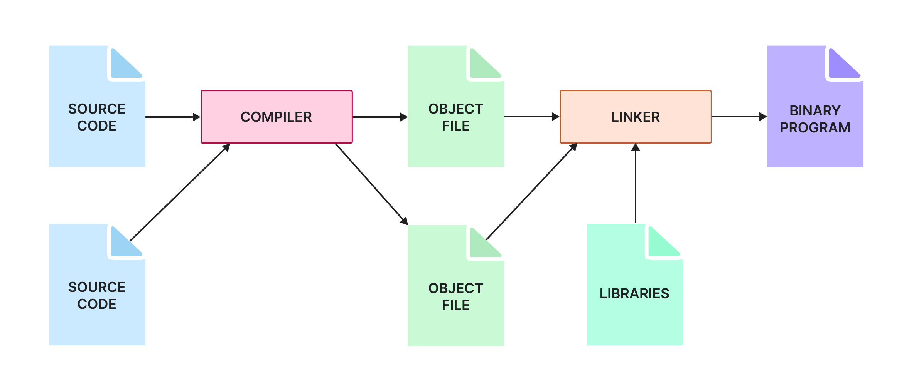

# Les exécutables

**Durée : 45 min**

## Ce que vous allez apprendre dans ce cours

Dans la leçon précédente, nous avons exploré comment fonctionnent les processus et comment les surveiller et les contrôler. Mais chaque processus commence par une chose : un fichier exécutable. Ces binaires, qu'il s'agisse de programmes compilés ou de scripts, sont le code réellement exécuté. Dans cette leçon, vous apprendrez :

- quels sont les différents types d'exécutables,
- comment le système identifie l'exécutable nécessaire à partir des variables d'environnement,
- les outils courants pour l'analyse binaire de base,
- comment gérer et assurer l'authenticité des paquets.

---

## Qu'est-ce qu'un exécutable ?

Un **fichier exécutable** est un fichier informatique contenant une série d'instructions que le système d'exploitation peut exécuter directement pour effectuer des tâches ou lancer des applications. Ces fichiers sont des formes "prêtes à l'exécution" de programmes :
- Soit compilés depuis du code source en code machine (exécutables binaires)
- Soit des scripts avec des instructions pour un interpréteur (Bash, Python)

---

## Programmes binaires

Les **programmes binaires** sont des fichiers exécutables contenant des instructions encodées en code machine, que le processeur peut directement interpréter et exécuter.

Ces programmes sont le produit final de la **compilation** du code source écrit dans des langages comme C, C++ ou Java, dans un format correspondant au système d'exploitation et à l'architecture matérielle cible.

> **Note** : Si vous avez compilé votre code pour Linux, vous ne pouvez pas l'exécuter directement sur Windows.

### Format ELF

La plupart des binaires incluent un **en-tête** qui identifie le type de fichier et fournit les métadonnées nécessaires au système. Linux utilise le format **ELF** (Executable and Linkable Format).

```bash
$ file /usr/bin/ls
/usr/bin/ls: ELF 64-bit LSB pie executable, ARM aarch64, version 1 (SYSV),
dynamically linked, interpreter /lib/ld-linux-aarch64.so.1,
for GNU/Linux 3.7.0, stripped
```

Cette sortie indique :
- Exécutable compilé pour architecture ARM 64-bit
- Lié dynamiquement (utilise des bibliothèques partagées)
- Pour un noyau Linux version 3.7.0 minimum

### Processus de création

1. **Compilateur** : traduit le code source en code machine
2. **Linker (éditeur de liens)** : combine votre code et les bibliothèques en un seul binaire



### Bibliothèques (libraries)

Une **bibliothèque** est une collection de code précompilé que les programmes peuvent utiliser pour effectuer des tâches courantes (afficher un message, fonctions mathématiques).

| Type | Description |
|------|-------------|
| **Statique** | Code inclus dans le binaire, exécutable autonome mais plus gros |
| **Dynamique/Partagée** | Métadonnées ajoutées, bibliothèques chargées à l'exécution |

**Emplacements courants des bibliothèques :**
| Chemin | Contenu |
|--------|---------|
| `/lib` et `/lib64` | Bibliothèques système essentielles |
| `/usr/lib` et `/usr/lib64` | Bibliothèques pour logiciels installés |
| `/usr/local/lib` | Bibliothèques compilées localement |

**Voir les bibliothèques utilisées par un binaire :**
```bash
ldd /usr/bin/ls
```

### Chargement et exécution

- **Binaire statique** : le noyau le charge directement en mémoire
- **Binaire dynamique** : le **loader** (chargeur dynamique) mappe le binaire, résout et charge les bibliothèques partagées, puis exécute le programme

---

## Scripts interprétés

Les **scripts interprétés** sont des fichiers texte contenant du code source dans un langage de script (Bash, Python, Perl) pouvant être exécutés directement depuis la ligne de commande.

Contrairement aux binaires, ces scripts sont lus et exécutés par un **interpréteur** ligne par ligne, ce qui les rend généralement plus lents que les programmes compilés.

**Exécution d'un script :**
```bash
# Avec shebang dans le script
$ ./mon_script.sh

# Sans shebang, en spécifiant l'interpréteur
$ python3 monscript.py
```

Le script doit avoir la permission d'exécution pour que le système sache qu'il peut être exécuté comme un programme.

---

## Découverte des exécutables et environnement

### La variable PATH

Quand vous tapez `touch file.txt`, comment le système trouve-t-il l'exécutable correspondant ?

Le shell utilise la variable d'environnement **PATH** pour localiser les exécutables. C'est une liste de répertoires séparés par des deux-points, parcourus dans l'ordre.

```bash
$ echo $PATH
/usr/local/sbin:/usr/local/bin:/usr/sbin:/usr/bin:/sbin:/bin

$ which touch
/usr/bin/touch
```

**Modifier le PATH :**
```bash
export PATH="/tmp:$PATH"
```

> **Sécurité - PATH hijacking** : Si un attaquant peut réécrire votre PATH et placer un binaire malveillant `ls` dans `/tmp`, ce binaire sera exécuté à la place du vrai `ls`.

### Autres variables d'environnement importantes

| Variable | Description | Risque |
|----------|-------------|--------|
| `LD_LIBRARY_PATH` | Répertoires pour les bibliothèques partagées | Peut être détourné pour charger des bibliothèques malveillantes |
| `LD_PRELOAD` | Bibliothèques à charger avant toutes les autres | Permet de remplacer des fonctions à l'exécution |
| `PYTHONPATH` | Répertoires pour les modules Python | Peut remplacer des modules standards |

---

## Analyse binaire

L'analyse binaire permet de comprendre le comportement d'un exécutable, vérifier sa légitimité ou enquêter sur des compromissions. Voici quelques commandes utiles sans avoir besoin de lire le code machine.

### Identifier avec file

`file` identifie le type d'un fichier en inspectant son contenu (pas son extension).

```bash
$ file fichier.txt
fichier.txt: ASCII text

$ file /usr/bin/gettext.sh
/usr/bin/gettext.sh: POSIX shell script, ASCII text executable

$ file /usr/bin/ls
/usr/bin/ls: ELF 64-bit LSB pie executable, ARM aarch64...
```

### Afficher les dépendances avec ldd

`ldd` liste les bibliothèques partagées requises par un binaire.

```bash
$ ldd /usr/bin/ping
    linux-vdso.so.1 (0x0000fa7895f8a000)
    libcap.so.2 => /lib/aarch64-linux-gnu/libcap.so.2
    libidn2.so.0 => /lib/aarch64-linux-gnu/libidn2.so.0
    libc.so.6 => /lib/aarch64-linux-gnu/libc.so.6
    /lib/ld-linux-aarch64.so.1
```

**Interprétation :**
| Bibliothèque | Description |
|--------------|-------------|
| `linux-vdso.so.1` | Objet virtuel fourni par le noyau |
| `libc.so.6` | Bibliothèque C standard |
| `libcap.so.2` | Support des capabilities |
| `/lib/ld-linux-*.so.1` | Chargeur dynamique |

> **Alerte sécurité** : Si un binaire système comme `/bin/ls` est lié à un chemin non standard (ex: `/tmp/libc.so.6`), c'est un signal d'alarme majeur.
>
> **Attention** : Ne jamais utiliser `ldd` sur des exécutables non fiables ! Utilisez plutôt `objdump` ou `readelf` :
>
> ```bash
> objdump -p /usr/bin/ping | grep NEEDED
> readelf -d /usr/bin/ping
> ```

### Rechercher du texte avec strings

`strings` extrait le texte ASCII et UTF-8 lisible des fichiers binaires.

```bash
strings /usr/bin/ls | head
```

Peut révéler :
- Chemins de fichiers codés en dur
- Messages d'erreur
- Numéros de version
- URLs suspectes
- Identifiants potentiellement intégrés

> **Limitation** : Ne détecte que le texte en clair, pas les données chiffrées ou obfusquées.

### Tracer les appels avec strace et ltrace

**strace** surveille les appels système et signaux d'un processus :
```bash
$ strace ls
execve("/usr/bin/ls", ["ls"], 0xfffffc191010 /* 26 vars */) = 0
brk(NULL)                               = 0xb381e88fd000
...
```

**ltrace** trace les appels aux fonctions de bibliothèques :
```bash
ltrace ls
```

**Ce qu'on peut détecter :**
- Accès à des fichiers sensibles (`/etc/passwd`)
- Connexions réseau inattendues
- Processus enfants suspects
- Appels à `setuid` ou `chmod`

---

## Gestion des paquets avec apt

La plupart des logiciels sous Linux sont installés via des **paquets**. Les distributions basées sur Debian/Ubuntu utilisent **APT** (Advanced Package Tool).

### Commandes de base

| Commande | Description |
|----------|-------------|
| `sudo apt install paquet` | Installer un paquet |
| `sudo apt update` | Télécharger les dernières métadonnées |
| `sudo apt upgrade` | Mettre à jour les paquets installés |
| `apt list --installed` | Lister les paquets installés |
| `apt search nom` | Rechercher un paquet |
| `apt show paquet` | Afficher les infos d'un paquet |
| `apt-cache policy paquet` | Vérifier l'origine d'un paquet |

### Sources des paquets

APT récupère les paquets depuis des dépôts définis dans :
- `/etc/apt/sources.list` (ancien format)
- `/etc/apt/sources.list.d/` (fichiers individuels)

**Exemple de configuration :**
```
Types: deb
URIs: http://ports.ubuntu.com/ubuntu-ports/
Suites: noble noble-updates noble-backports
Components: main restricted universe multiverse
Signed-By: /usr/share/keyrings/ubuntu-archive-keyring.gpg
```

| Champ | Description |
|-------|-------------|
| `Types` | Type de paquet (deb) |
| `URIs` | URL du dépôt |
| `Suites` | Version de la distribution |
| `Components` | Catégories (main, restricted, universe, multiverse) |
| `Signed-By` | Clé GPG pour la vérification |

### Assurer l'authenticité des paquets

| Mécanisme | Description |
|-----------|-------------|
| **Vérification GPG** | Signature numérique du fichier Release |
| **Validation des checksums** | Hashes SHA256 pour chaque paquet |
| **Configuration des dépôts** | Seuls les dépôts listés sont utilisés |

**Bonnes pratiques :**
- Ne jamais ignorer un avertissement sur des paquets non authentifiés
- Éviter les dépôts non officiels ou non fiables
- Vérifier régulièrement les fichiers sources

**Vérifier l'intégrité des fichiers installés :**
```bash
sudo debsums -s
```

---

## Glossaire des sigles et définitions

| Sigle/Terme | Définition |
|-------------|------------|
| **ELF** | Executable and Linkable Format - Format binaire standard sous Linux |
| **Compiler** | Compilateur - Traduit le code source en code machine |
| **Linker** | Éditeur de liens - Combine le code et les bibliothèques en un binaire |
| **Library** | Bibliothèque - Collection de code précompilé réutilisable |
| **Static linking** | Liaison statique - Bibliothèques incluses dans le binaire |
| **Dynamic linking** | Liaison dynamique - Bibliothèques chargées à l'exécution |
| **Loader** | Chargeur dynamique - Charge les bibliothèques à l'exécution |
| **Shebang** | `#!` - Indique l'interpréteur pour les scripts |
| **PATH** | Variable listant les répertoires d'exécutables |
| **LD_LIBRARY_PATH** | Variable pour les chemins de bibliothèques |
| **LD_PRELOAD** | Variable pour précharger des bibliothèques |
| **APT** | Advanced Package Tool - Gestionnaire de paquets Debian/Ubuntu |
| **GPG** | GNU Privacy Guard - Outil de chiffrement et signature |
| **Checksum** | Somme de contrôle pour vérifier l'intégrité |
| **PATH hijacking** | Attaque exploitant une variable PATH mal configurée |

---

## Récapitulatif des commandes

### Identification de fichiers

| Commande | Description |
|----------|-------------|
| `file fichier` | Identifier le type d'un fichier |
| `which commande` | Trouver le chemin d'un exécutable |
| `type commande` | Afficher le type d'une commande |

### Analyse des dépendances

| Commande | Description |
|----------|-------------|
| `ldd binaire` | Lister les bibliothèques partagées (attention sécurité!) |
| `objdump -p binaire \| grep NEEDED` | Alternative sécurisée à ldd |
| `readelf -d binaire` | Afficher les dépendances dynamiques |

### Analyse de contenu

| Commande | Description |
|----------|-------------|
| `strings binaire` | Extraire les chaînes lisibles |
| `strings -n 8 binaire` | Chaînes d'au moins 8 caractères |
| `hexdump -C binaire \| head` | Afficher en hexadécimal |

### Traçage

| Commande | Description |
|----------|-------------|
| `strace commande` | Tracer les appels système |
| `strace -p PID` | Tracer un processus existant |
| `strace -f commande` | Suivre les processus enfants |
| `ltrace commande` | Tracer les appels de bibliothèques |

### Variables d'environnement

| Commande | Description |
|----------|-------------|
| `echo $PATH` | Afficher le PATH |
| `export PATH="/chemin:$PATH"` | Ajouter au PATH |
| `printenv` | Afficher toutes les variables |

### Gestion des paquets (apt)

| Commande | Description |
|----------|-------------|
| `sudo apt update` | Mettre à jour les métadonnées |
| `sudo apt upgrade` | Mettre à jour les paquets |
| `sudo apt install paquet` | Installer un paquet |
| `sudo apt remove paquet` | Supprimer un paquet |
| `apt search terme` | Rechercher un paquet |
| `apt show paquet` | Informations sur un paquet |
| `apt list --installed` | Lister les paquets installés |
| `apt-cache policy paquet` | Vérifier l'origine |
| `sudo debsums -s` | Vérifier l'intégrité des fichiers |

### Fichiers importants

| Fichier | Description |
|---------|-------------|
| `/etc/apt/sources.list` | Sources des paquets (ancien) |
| `/etc/apt/sources.list.d/` | Sources des paquets (fichiers) |
| `/lib`, `/usr/lib` | Bibliothèques système |
| `/usr/local/lib` | Bibliothèques locales |

---

## Ressources pratiques - TryHackMe / HackTheBox

| Plateforme | Lien | Description |
|------------|------|-------------|
| TryHackMe | [Linux Privilege Escalation](https://tryhackme.com/room/linprivesc) | PATH hijacking et binaires |
| TryHackMe | [Malware Analysis](https://tryhackme.com/room/dvhistoryofmalware) | Introduction à l'analyse |
| TryHackMe | [REMnux](https://tryhackme.com/room/dvmalwareremnux) | Analyse de malware Linux |
| HackTheBox | [Challenges Reversing](https://app.hackthebox.com/challenges) | Défis d'analyse binaire |

---

## Ressources

- The 101 of ELF files on Linux - Michael Boelen
- What is the LD_PRELOAD Trick? - baeldung
- Manage Shared Libraries - borosan
- Attacks against GPG signed APT repositories - packagecloud
