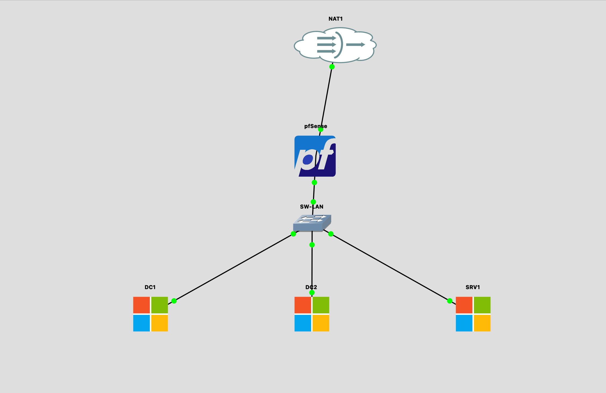

# Lab 30 : An AD for StellarTech

Mise en place d'une infrastructure Active Directory complete pour StellarTech Inc., une startup tech en croissance rapide (~80 employes). Vous devez construire un environnement AD securise et maintenable dans GNS3.

**Duree estimee** : 270 minutes

**Niveau** : Exercice intermediaire - Indices fournis

---

## Table des matieres

1. [Objectifs](#objectifs)
2. [Prerequis](#prerequis)
3. [Architecture](#architecture)
4. [Demarrage rapide](#demarrage-rapide)
5. [Configuration requise](#configuration-requise)
6. [Criteres de validation](#criteres-de-validation)
7. [Indices](#indices)
8. [Depannage](#depannage)

---

## Objectifs

- Concevoir et deployer une structure Active Directory complete (foret, domaine, OUs)
- Creer des utilisateurs et groupes selon le modele AGDLP
- Configurer un serveur de fichiers avec partages NTFS securises
- Implementer des strategies de groupe (GPO) pour la securite et la conformite
- Assurer la redondance avec un RODC (Read-Only Domain Controller)

---

## Prerequis

- GNS3 connecte au serveur distant (IP: voir `group_vars/all.yml`)
- Ansible installe (`brew install ansible` sur macOS)
- Python 3
- Appliances disponibles dans GNS3 :
  - Windows Server 2022 (QEMU)
  - pfSense (routeur/firewall)

---

## Architecture

### Structure du lab

```
30_AD_stellarTech/
├── ansible.cfg                # Configuration Ansible
├── inventory.yml              # Inventaire GNS3
├── group_vars/
│   └── all.yml                # Variables de configuration
├── playbooks/
│   ├── 00_full_lab.yml        # Deploiement complet
│   ├── 01_create_topology.yml # Creation de la topologie GNS3
│   └── 99_cleanup.yml         # Nettoyage
├── scripts/
│   ├── 01_install_ad_dc1.ps1           # Installation AD DS sur DC1
│   ├── 02_create_ou_structure.ps1      # Creation structure OUs
│   ├── 03_create_users_groups.ps1      # Creation utilisateurs et groupes
│   ├── 04_configure_dc2_rodc.ps1       # Promotion DC2 en RODC
│   ├── 05_configure_file_server.ps1    # Configuration serveur de fichiers
│   ├── 06_configure_gpo.ps1            # Configuration des GPOs
│   └── 07_verify.ps1                   # Script de verification
├── server_info.yml            # Genere automatiquement
├── README.md
└── SOLUTION.md                # Solution complete
```

### Topologie reseau



```
                        ┌─────────────────┐
                        │      NAT        │
                        │   (Internet)    │
                        │  192.168.122.1  │
                        └────────┬────────┘
                                 │ WAN
                        ┌────────┴────────┐
                        │    pfSense      │
                        │   (Firewall)    │
                        │  WAN: DHCP      │
                        │  LAN: 10.0.0.1  │
                        └────────┬────────┘
                                 │ LAN
                        ┌────────┴────────┐
                        │    SW-LAN       │
                        │ (Ethernet Sw.)  │
                        └──┬─────┬─────┬──┘
                           │     │     │
                 ┌─────────┘     │     └─────────┐
                 │               │               │
        ┌────────┴────────┐ ┌───┴──────────┐ ┌──┴───────────┐
        │      DC1        │ │     DC2      │ │     SRV1     │
        │ (Windows Server)│ │(Windows Srv) │ │(Windows Srv) │
        │  10.0.0.10      │ │ 10.0.0.11    │ │  10.0.0.20   │
        │                 │ │              │ │              │
        │ AD DS + DNS     │ │ RODC + GC    │ │ File Server  │
        │ Primary DC      │ │ Secondary    │ │ Partages     │
        └─────────────────┘ └──────────────┘ └──────────────┘
```

### Plan d'adressage

| Machine | IP | Role | DNS |
|---------|-----|------|-----|
| pfSense | 10.0.0.1 (LAN) | Passerelle | - |
| DC1 | 10.0.0.10 | Controleur de domaine principal | 127.0.0.1 |
| DC2 | 10.0.0.11 | RODC + Global Catalog | 10.0.0.10 |
| SRV1 | 10.0.0.20 | Serveur de fichiers | 10.0.0.10 |

### Domaine

| Parametre | Valeur |
|-----------|--------|
| Nom de domaine | stellar.local |
| Nom NetBIOS | STELLAR |
| Niveau fonctionnel | Windows Server 2016 |

---

## Demarrage rapide

### 1. Verifier la connexion au serveur GNS3

```bash
curl -s http://192.168.155.153:80/v2/version
```

### 2. Modifier l'IP si necessaire

Editer `group_vars/all.yml` si l'IP du serveur GNS3 a change.

### 3. Deployer la topologie

```bash
cd 30_AD_stellarTech
ansible-playbook playbooks/01_create_topology.yml
```

### 4. Configurer les serveurs

Apres le demarrage des VMs dans GNS3, connectez-vous a chaque serveur via la console GNS3 et executez les scripts PowerShell dans l'ordre :

```
1. Sur DC1  : scripts/01_install_ad_dc1.ps1
2. Sur DC1  : scripts/02_create_ou_structure.ps1
3. Sur DC1  : scripts/03_create_users_groups.ps1
4. Sur DC2  : scripts/04_configure_dc2_rodc.ps1
5. Sur SRV1 : scripts/05_configure_file_server.ps1
6. Sur DC1  : scripts/06_configure_gpo.ps1
7. Sur DC1  : scripts/07_verify.ps1
```

---

## Configuration requise

### 1. Structure AD et OUs

Creer la structure d'OUs suivante dans le domaine `stellar.local` :

```
stellar.local
├── Stellar Teams
│   ├── Engineering
│   ├── Marketing
│   └── HR
├── Servers
├── Groups
└── Policies
```

### 2. Utilisateurs et Groupes

#### Utilisateurs a creer

| Utilisateur | Departement | OU |
|-------------|-------------|-----|
| anakin | Engineering | Stellar Teams\Engineering |
| ahsoka | Engineering | Stellar Teams\Engineering |
| obiwan | Engineering | Stellar Teams\Engineering |
| padme | Marketing | Stellar Teams\Marketing |
| leia | Marketing | Stellar Teams\Marketing |
| monmothma | HR | Stellar Teams\HR |

#### Groupes (modele AGDLP)

**Global Groups** (dans l'OU Groups) :
- `GG_Engineering_Read`
- `GG_Marketing_Read`
- `GG_HR_Read`

**Domain Local Groups** (dans l'OU Groups) :
- `DL_Share_Engineering`
- `DL_Share_Marketing`
- `DL_Share_HR`

Les groupes globaux doivent etre imbriques dans les groupes domain local correspondants.

### 3. Serveur de fichiers + Permissions NTFS

Sur SRV1, configurer :

| Partage | Chemin | Groupe autorise | Permissions |
|---------|--------|----------------|-------------|
| `share_engineering` | `C:\Shares\Engineering` | DL_Share_Engineering | Read/Write |
| `share_marketing` | `C:\Shares\Marketing` | DL_Share_Marketing | Read/Write |
| `share_hr` | `C:\Shares\HR` | DL_Share_HR | Read/Write |

Tous les autres utilisateurs (sauf Administrator) doivent etre refuses.

### 4. Strategies de groupe (GPO)

| Nom GPO | OU cible | Description |
|---------|---------|-------------|
| WallpaperPolicy | Stellar Teams | Fond d'ecran corporate depuis `\\SRV1\shared_wallpaper` |
| SecurityPolicy | Stellar Teams | Desactive le Panneau de config, cmd et l'acces au registre |
| PasswordPolicy | Domaine (Default Domain Policy) | Mots de passe 8+ caracteres, verrouillage apres 5 tentatives |

**BONUS** : Utiliser les GPP (Group Policy Preferences) pour mapper des lecteurs reseaux :
- `P:` -> `\\SRV1\share_engineering` pour les utilisateurs Engineering
- `P:` -> `\\SRV1\share_marketing` pour les utilisateurs Marketing
- `P:` -> `\\SRV1\share_hr` pour les utilisateurs HR

### 5. Redondance

- DC1 : Controleur de domaine principal
- DC2 : RODC (Read-Only Domain Controller) avec Global Catalog
- Tester la connexion utilisateur depuis SRV1 lorsque DC1 est eteint

---

## Criteres de validation

Executer `scripts/07_verify.ps1` sur DC1 et verifier :

- [ ] Domaine `stellar.local` operationnel
- [ ] Structure OUs conforme (Stellar Teams, Servers, Groups, Policies)
- [ ] 6 utilisateurs crees dans les bonnes OUs
- [ ] 3 groupes globaux + 3 groupes domain local
- [ ] Imbrication AGDLP correcte (GG dans DL)
- [ ] 3 partages reseau accessibles sur SRV1
- [ ] Permissions NTFS conformes (seul le DL correspondant a acces)
- [ ] GPO WallpaperPolicy liee a Stellar Teams
- [ ] GPO SecurityPolicy liee a Stellar Teams
- [ ] GPO PasswordPolicy appliquee au domaine
- [ ] DC2 fonctionnel en tant que RODC avec Global Catalog
- [ ] Connexion utilisateur possible meme si DC1 est eteint

---

## Indices

<details>
<summary>Indice 1 : Installation AD DS sur DC1</summary>

```powershell
# Installer le role AD DS
Install-WindowsFeature -Name AD-Domain-Services -IncludeManagementTools

# Promouvoir en controleur de domaine
Install-ADDSForest `
    -DomainName "stellar.local" `
    -DomainNetBIOSName "STELLAR" `
    -ForestMode "WinThreshold" `
    -DomainMode "WinThreshold" `
    -InstallDNS:$true `
    -SafeModeAdministratorPassword (ConvertTo-SecureString "P@ssw0rd123!" -AsPlainText -Force) `
    -Force:$true
```

</details>

<details>
<summary>Indice 2 : Creation des OUs</summary>

```powershell
# OU racine
New-ADOrganizationalUnit -Name "Stellar Teams" -Path "DC=stellar,DC=local"

# Sous-OUs
New-ADOrganizationalUnit -Name "Engineering" -Path "OU=Stellar Teams,DC=stellar,DC=local"
```

</details>

<details>
<summary>Indice 3 : Creation d'un utilisateur</summary>

```powershell
New-ADUser -Name "anakin" `
    -SamAccountName "anakin" `
    -UserPrincipalName "anakin@stellar.local" `
    -Path "OU=Engineering,OU=Stellar Teams,DC=stellar,DC=local" `
    -AccountPassword (ConvertTo-SecureString "Welcome1!" -AsPlainText -Force) `
    -Enabled $true
```

</details>

<details>
<summary>Indice 4 : Modele AGDLP</summary>

```powershell
# Creer groupe global
New-ADGroup -Name "GG_Engineering_Read" -GroupScope Global -Path "OU=Groups,DC=stellar,DC=local"

# Creer groupe domain local
New-ADGroup -Name "DL_Share_Engineering" -GroupScope DomainLocal -Path "OU=Groups,DC=stellar,DC=local"

# Imbriquer GG dans DL
Add-ADGroupMember -Identity "DL_Share_Engineering" -Members "GG_Engineering_Read"

# Ajouter utilisateurs au GG
Add-ADGroupMember -Identity "GG_Engineering_Read" -Members "anakin","ahsoka","obiwan"
```

</details>

<details>
<summary>Indice 5 : Partage reseau + NTFS</summary>

```powershell
# Creer le dossier
New-Item -Path "C:\Shares\Engineering" -ItemType Directory -Force

# Creer le partage
New-SmbShare -Name "share_engineering" -Path "C:\Shares\Engineering" -FullAccess "Everyone"

# Configurer les permissions NTFS
$acl = Get-Acl "C:\Shares\Engineering"
$acl.SetAccessRuleProtection($true, $false)  # Desactiver l'heritage
# Ajouter le groupe DL
$rule = New-Object System.Security.AccessControl.FileSystemAccessRule(
    "STELLAR\DL_Share_Engineering", "Modify", "ContainerInherit,ObjectInherit", "None", "Allow")
$acl.AddAccessRule($rule)
# Ajouter Administrator
$rule = New-Object System.Security.AccessControl.FileSystemAccessRule(
    "BUILTIN\Administrators", "FullControl", "ContainerInherit,ObjectInherit", "None", "Allow")
$acl.AddAccessRule($rule)
Set-Acl "C:\Shares\Engineering" $acl
```

</details>

<details>
<summary>Indice 6 : Promotion DC2 en RODC</summary>

```powershell
# Sur DC2, d'abord joindre le domaine puis :
Install-WindowsFeature -Name AD-Domain-Services -IncludeManagementTools

Install-ADDSDomainController `
    -DomainName "stellar.local" `
    -ReadOnlyReplica:$true `
    -InstallDNS:$true `
    -NoGlobalCatalog:$false `
    -SiteName "Default-First-Site-Name" `
    -SafeModeAdministratorPassword (ConvertTo-SecureString "P@ssw0rd123!" -AsPlainText -Force) `
    -Credential (Get-Credential) `
    -Force:$true
```

</details>

<details>
<summary>Indice 7 : Creation d'une GPO</summary>

```powershell
# Creer la GPO
New-GPO -Name "SecurityPolicy"

# Lier la GPO a une OU
New-GPLink -Name "SecurityPolicy" -Target "OU=Stellar Teams,DC=stellar,DC=local"

# Configurer via Set-GPRegistryValue
Set-GPRegistryValue -Name "SecurityPolicy" `
    -Key "HKCU\Software\Microsoft\Windows\CurrentVersion\Policies\System" `
    -ValueName "DisableRegistryTools" -Type DWord -Value 1
```

</details>

---

## Depannage

### Les VMs Windows ne demarrent pas dans GNS3

1. Verifier que le template Windows Server 2022 est bien importe
2. Les VMs QEMU peuvent prendre 2-5 minutes pour demarrer completement
3. S'assurer que la RAM allouee est suffisante (4 Go min par VM)

### Erreur "The server is not operational" lors de la promotion AD

```powershell
# Verifier la configuration reseau
Get-NetIPConfiguration
# Le DNS doit pointer vers 127.0.0.1 (DC1) ou 10.0.0.10 (DC2/SRV1)

# Verifier la connectivite
Test-NetConnection -ComputerName 10.0.0.10 -Port 389
```

### DC2 ne peut pas joindre le domaine

```powershell
# Verifier que DC1 est bien joignable
nslookup stellar.local 10.0.0.10

# Verifier les ports
Test-NetConnection -ComputerName DC1 -Port 88   # Kerberos
Test-NetConnection -ComputerName DC1 -Port 389  # LDAP
Test-NetConnection -ComputerName DC1 -Port 445  # SMB
```

### Les GPOs ne s'appliquent pas

```powershell
# Forcer la mise a jour des GPO
gpupdate /force

# Verifier les GPOs appliquees
gpresult /r

# Verifier le lien GPO
Get-GPInheritance -Target "OU=Stellar Teams,DC=stellar,DC=local"
```

### Acces refuse aux partages

```powershell
# Verifier les permissions du partage
Get-SmbShareAccess -Name "share_engineering"

# Verifier les permissions NTFS
Get-Acl "C:\Shares\Engineering" | Format-List

# Tester l'acces
Test-Path "\\SRV1\share_engineering"
```

---

## References

- [Install AD DS using PowerShell](https://learn.microsoft.com/en-us/windows-server/identity/ad-ds/deploy/install-active-directory-domain-services--level-200-)
- [AGDLP Model](https://learn.microsoft.com/en-us/windows-server/identity/ad-ds/plan/security-best-practices/implementing-least-privilege-administrative-models)
- [Group Policy Overview](https://learn.microsoft.com/en-us/windows-server/identity/ad-ds/manage/group-policy/group-policy-overview)
- [RODC Deployment](https://learn.microsoft.com/en-us/windows-server/identity/ad-ds/deploy/rodc/install-a-windows-server-2012-active-directory-read-only-domain-controller--rodc---level-200-)
- [GNS3 API Documentation](https://gns3-server.readthedocs.io/en/latest/api.html)

---

## Solution

Une fois l'exercice termine (ou en cas de blocage), consulter `SOLUTION.md` pour la solution complete.
