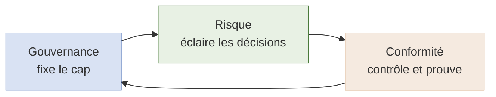
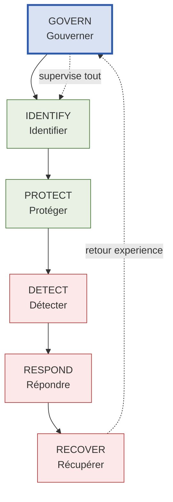
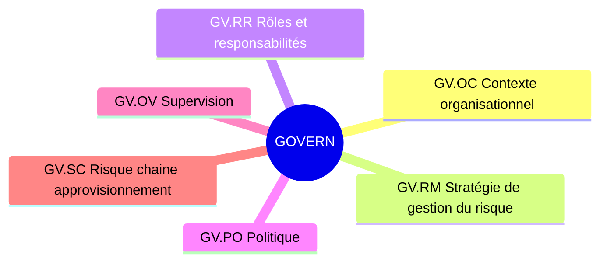
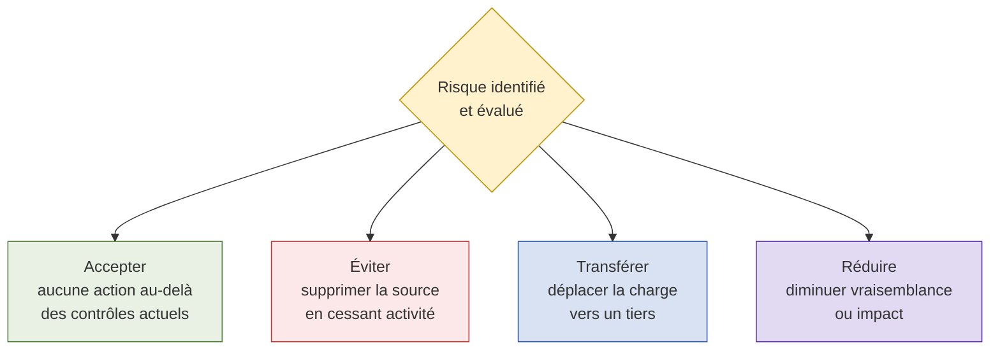
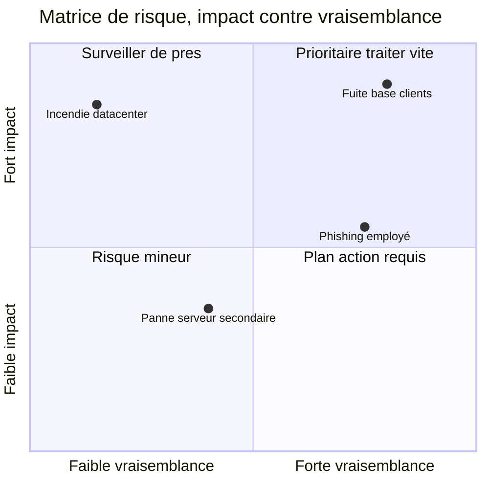
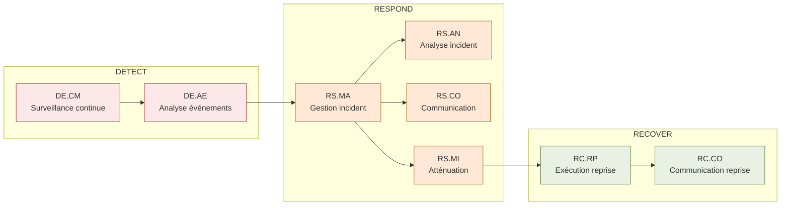
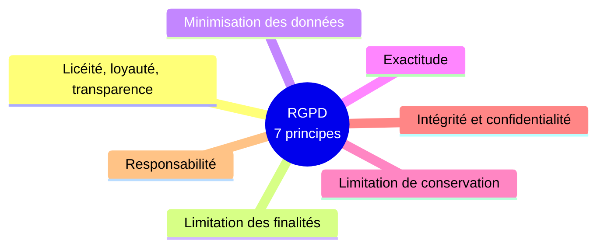
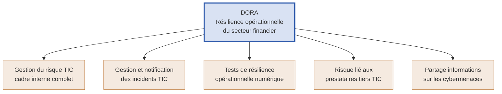
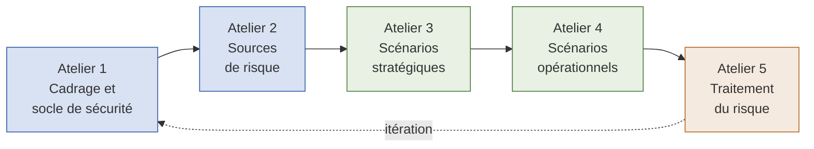
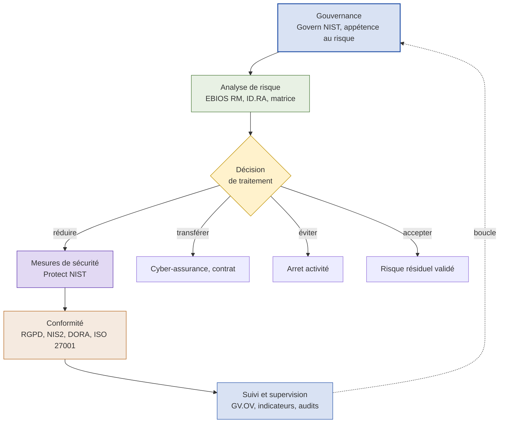

# Gouvernance, risque et conformité

## Un cours complet de GRC en cybersécurité

Ce cours fusionne deux approches complémentaires. D'un côté, la structure du NIST Cybersecurity Framework 2.0 et ses outils opérationnels, qui forment une colonne vertébrale solide et concrète. De l'autre, le cadre réglementaire européen et sectoriel (EBIOS Risk Manager, ISO 27001 et 27005, RGPD, NIS2, DORA), indispensable dès lors qu'on exerce en Europe et a fortiori dans le secteur de l'assurance ou de la finance.

L'objectif est de comprendre comment gouverner, évaluer le risque et démontrer la conformité, puis comment ces trois dimensions s'articulent en une démarche unique.

---

## Table des matières

1. Comprendre la GRC
2. Le cadre NIST CSF 2.0, fil conducteur
3. Govern, la fonction de pilotage
4. Identify, connaître son terrain
5. Protect, construire les défenses
6. Detect, Respond, Recover, gérer l'incident
7. La conformité réglementaire, RGPD
8. Le cadre européen, NIS2 et DORA
9. L'analyse de risque à la française, EBIOS RM
10. Les normes ISO 27001 et 27005
11. Articulation des trois piliers
12. Glossaire et ressources

---

## 1. Comprendre la GRC

La GRC, pour gouvernance, risque et conformité, est un cadre de pilotage qui réunit trois disciplines historiquement séparées. L'idée fondatrice est simple : une organisation pilote mal sa sécurité si elle traite la stratégie, l'évaluation des risques et le respect des règles dans des silos qui ne communiquent pas.

Chaque pilier répond à une question centrale.

- **Gouvernance** : qui décide, selon quelles règles, et comment s'assure-t-on que ces décisions sont appliquées ?
- **Risque** : qu'est-ce qui peut mal tourner, avec quelle probabilité, quel impact, et qu'en fait-on ?
- **Conformité** : à quelles obligations sommes-nous soumis, et comment prouvons-nous que nous les respectons ?

Pris isolément, chaque pilier a une faiblesse. La gouvernance sans gestion du risque produit des politiques déconnectées du terrain. Le risque sans gouvernance génère des analyses que personne n'arbitre ni ne finance. La conformité sans les deux autres devient une course aux cases à cocher. La valeur de la GRC vient de leur articulation.

> **À retenir.** La GRC n'est ni un outil ni un logiciel, c'est une démarche de pilotage. Les plateformes GRC du marché ne font qu'outiller cette démarche, elles ne la remplacent pas. Bon réflexe : toujours relier une action de sécurité à l'un des trois piliers. Si une action ne sert ni à gouverner, ni à réduire un risque, ni à satisfaire une obligation, sa justification mérite d'être questionnée.

---

## 2. Le cadre NIST CSF 2.0, fil conducteur

Le NIST Cybersecurity Framework version 2.0 est un référentiel de bonnes pratiques publié par l'agence américaine NIST. Il n'est pas obligatoire et ne mène à aucune certification, mais sa structure claire en fait un excellent squelette pour organiser une démarche de sécurité. Il s'articule autour de six fonctions.

La fonction Govern est la nouveauté majeure de la version 2.0 : elle chapeaute et conditionne les cinq autres. Une manière simple de mémoriser la logique : Identify et Protect préparent et défendent, Detect, Respond et Recover gèrent l'incident une fois que les défenses ont cédé, et Govern supervise l'ensemble.

> **Note.** Le NIST CSF est d'origine américaine. Pour une organisation européenne, il structure utilement la réflexion, mais ce sont les textes européens (RGPD, NIS2, DORA) qui créent les obligations légales. On utilise donc le NIST comme méthode, et les textes européens comme exigences.

---

## 3. Govern, la fonction de pilotage

La fonction Govern ne traite ni de pare-feu ni de malware. Elle traite du côté métier de la sécurité : définir les priorités, les rôles, la responsabilité et la stratégie. Elle garantit que la cybersécurité est gérée comme n'importe quelle autre fonction critique de l'entreprise.

On distingue trois niveaux de gouvernance : la direction (executives), les managers, et les praticiens. La fonction se décline en six catégories.

### GV.OC, contexte organisationnel

Chaque organisation est différente par sa taille, son marché, sa maturité et son appétence au risque. Il n'existe donc pas de gouvernance universelle, il faut s'adapter au contexte. Pour cela, il faut comprendre au moins quatre éléments : la mission de l'entreprise, la manière dont les risques cyber peuvent perturber cette mission, les exigences légales, réglementaires et contractuelles applicables, et qui sera responsable de définir et d'exécuter la stratégie.

> **Astuce.** Pas besoin d'outils sophistiqués pour démarrer : un tableur et de bons entretiens suffisent à cartographier ce contexte.

### GV.RM, stratégie de gestion du risque

Une fois le contexte compris, l'organisation définit comment le risque est mesuré, priorisé et accepté. Une institution financière aura par exemple une tolérance au risque bien plus faible qu'une startup.

Le concept clé ici est la distinction entre appétence et tolérance au risque.

| Notion | Niveau | Caractéristiques | Exemple |
|---|---|---|---|
| **Appétence au risque** (risk appetite) | Stratégique | Fixée par la direction, reflète la culture et les objectifs, exprimée en termes larges | « Faible appétence pour les violations de données personnelles, modérée pour le risque d'innovation » |
| **Tolérance au risque** (risk tolerance) | Opérationnel | Détaillée et quantitative, définie par unité ou système, exprimée en métriques | « Au plus 2 incidents par an sur des données à faible risque » |

Une analogie simple : l'appétence, c'est « je suis d'accord pour dépenser dans de belles vacances ». La tolérance, c'est « mais pas plus de 3 000 euros ».

Une fois le niveau de risque acceptable connu, un processus de décision détermine quoi faire de chaque risque. Quatre choix possibles, un seul retenu par risque.

Cette stratégie doit être alignée avec l'ERM (Enterprise Risk Management), l'approche structurée qui gère tous les types de risques de l'organisation, pas seulement cyber, mais aussi financiers, opérationnels, réputationnels et stratégiques.

### GV.RR, rôles, responsabilités et autorités

L'un des domaines les plus négligés : définir clairement qui fait quoi. Il faut définir les rôles (RSSI ou CISO, DPO, propriétaire de système, analyste de risque, équipe SOC), attribuer l'autorité de décider et d'appliquer les contrôles, et éviter les chevauchements et la confusion en cas d'incident. Dans les vraies brèches, la confusion sur les responsabilités cause des retards, des erreurs et des dommages de réputation.

> **Astuce.** Pour une convention commune sur la répartition des rôles, le référentiel NICE framework établit un langage standard pour décrire le travail en cybersécurité.

### GV.PO, politique

Cette catégorie garantit que l'organisation dispose de politiques de sécurité formelles et documentées qui définissent ce que les personnes doivent faire, ne doivent pas faire, qui applique les règles et comment les violations sont traitées. Une bonne politique fixe les attentes, s'aligne sur les objectifs et l'appétence au risque, permet l'application par des procédures et des conséquences, et est révisée régulièrement.

Quelques politiques courantes : la charte d'utilisation acceptable (ce que les utilisateurs peuvent faire avec les équipements), la politique de sécurité de l'information (l'engagement global), la classification des données (étiquetage selon la sensibilité : public, interne, confidentiel) et la politique d'accès distant (VPN, MFA, exigences sur les équipements).

> **Attention.** Un PDF poussiéreux sur un partage réseau n'est pas une politique. Si elle n'est ni communiquée, ni comprise, ni appliquée, ce n'est que de la paperasse. GV.PO exige des politiques vivantes qui guident le comportement réel.

### GV.OV, supervision

Cette catégorie garantit que la gouvernance n'est pas une tâche ponctuelle. Il doit y avoir une supervision continue de la direction et des mécanismes de responsabilité : rapports de cybersécurité au conseil d'administration, audits internes de conformité, indicateurs et tableaux de bord pour suivre les progrès. La supervision veille aussi à ce que la cybersécurité reste alignée sur la stratégie métier, et pas seulement sur la performance technique.

### GV.SC, risque lié à la chaîne d'approvisionnement

Cette catégorie reconnaît que votre sécurité ne dépend pas que de vous, mais aussi de celle de vos fournisseurs. Même avec des systèmes internes bien défendus, un seul tiers vulnérable (fournisseur, hébergeur cloud, éditeur logiciel, partenaire) peut devenir une porte dérobée.

Trois exemples réels d'attaques par la chaîne d'approvisionnement :

- **SolarWinds** : des attaquants ont inséré un malware dans les mises à jour, distribué ensuite à plus de 18 000 clients, dont des agences fédérales américaines.
- **MOVEit** : exploité par le groupe rançongiciel Cl0p pour voler des données de centaines d'organisations via une seule vulnérabilité.
- **Kaseya** : un outil de gestion à distance compromis pour pousser un rançongiciel vers des centaines de clients en aval.

Ce qu'attend GV.SC : connaître ses fournisseurs et leur rôle, fixer des exigences de sécurité minimales (chiffrement, MFA, application des correctifs) inscrites dans les contrats et SLA, exiger la conformité à des standards comme ISO 27001 ou SOC 2, évaluer et surveiller les fournisseurs (questionnaires, audits, tests), et les inclure dans le plan de réponse à incident.

> **Astuce, stratégie fournisseurs critiques.** Se concentrer d'abord sur les fournisseurs à haut risque : ceux qui ont accès au réseau ou aux données, ceux qui fournissent du code, et ceux dont la défaillance perturberait les opérations.

---

## 4. Identify, connaître son terrain

On ne protège pas ce qu'on ne connaît pas, et on ne protège pas à l'aveugle. La fonction Identify sert à comprendre ce qui compte : les actifs, les risques et le contexte métier.

### ID.AM, gestion des actifs

Les actifs sont tout ce que possède l'entreprise et qui a de la valeur. On distingue les actifs tangibles (matériel, ordinateurs portables, routeurs, équipements) et intangibles (logiciels, données, propriété intellectuelle, droits d'auteur). Le but est de créer un inventaire de ces actifs et de les classifier, tout en comprenant comment données et systèmes interagissent (flux réseau et de données) et quels actifs sont les plus critiques.

> **Astuce visuelle.** Créer une cartographie des actifs montrant les dépendances entre systèmes internes et services externes aide énormément à la gestion du risque et à la réponse à incident. On peut utiliser une CMDB (Configuration Management Database), construite soi-même dans un tableur ou via des outils professionnels.

### ID.RA, évaluation du risque

Une fois les actifs connus, il faut comprendre ce qui pourrait mal tourner. Le côté technique est familier (tests d'intrusion, renseignement sur les menaces via des plateformes CTI), mais il faut ensuite prendre du recul et évaluer le risque à plus haut niveau pour que les dirigeants décident.

Pour identifier les risques, les **principes de conception sécurisée OWASP** (Secure Product Design, à ne pas confondre avec l'OWASP Top 10) sont utiles. Quatre principes principaux :

- **Moindre privilège et séparation des tâches** : utilisateurs et systèmes n'ont que l'accès minimal nécessaire, et aucune personne ne contrôle seule toutes les étapes critiques d'un processus.
- **Défense en profondeur** : la sécurité est en couches, si un contrôle tombe, d'autres protègent encore.
- **Zero Trust** : ne jamais faire confiance automatiquement, tout vérifier explicitement quels que soient l'emplacement ou l'identité.
- **Sécurité à découvert** (security in the open) : la transparence améliore la sécurité, un système doit rester sûr même si sa conception et son code sont publics.

Le **catalogue de contrôles NIST SP 800-53** référence par ailleurs l'ensemble des bonnes pratiques et contrôles pour une politique donnée.

Une fois les risques identifiés, on évalue leur impact et leur vraisemblance à l'aide d'une matrice de risque.

Tous les risques sont ensuite consignés dans un **registre des risques** (risk register), qui peut commencer comme un simple tableur regroupant les risques identifiés et classifiés.

### ID.IM, amélioration

La cybersécurité n'est pas statique. Cette catégorie garantit qu'on surveille les changements de l'environnement et des menaces, qu'on apprend des incidents et des audits, et qu'on améliore continuellement sa posture. Par exemple, mettre à jour l'inventaire après une acquisition, ou ajuster les politiques après un incident de phishing.

---

## 5. Protect, construire les défenses

Après avoir identifié les actifs importants et évalué l'impact de leur compromission, la fonction Protect met en place des protections proportionnées et efficaces.

### PR.AA, gestion des identités, authentification et contrôle d'accès

Le contrôle d'accès est l'un des moyens les plus efficaces de réduire les menaces internes et externes. Il faut gérer les identités (systèmes IAM), appliquer le moindre privilège et l'accès basé sur les rôles, utiliser une authentification forte (MFA) et surveiller l'usage des comptes.

Deux mécanismes à distinguer :

- **ACL** (Access Control List) : donner le même accès à un utilisateur ou un groupe.
- **RBAC** (Role Based Access Control) : donner l'accès en fonction d'un rôle défini.

> **Distinction importante.** Le contrôle d'accès s'applique aux personnes comme aux systèmes. Les comptes de service et les API ont aussi besoin de protection.

### PR.AT, sensibilisation et formation

La technologie seule ne suffit pas. Les personnes doivent être formées au phishing et à l'ingénierie sociale (l'outil GoPhish est utile pour cela), conscientes de la bonne manipulation des données, et intégrées au signalement d'incident. Les programmes de sensibilisation efficaces sont mesurables (taux de réussite aux tests de phishing) et récurrents : les tests devraient se faire tous les 6 à 12 mois.

### PR.DS, sécurité des données

Comme les actifs, les données sont une cible. Cette catégorie met en place des contrôles pour identifier les données sensibles, les classifier, chiffrer les données au repos et en transit, surveiller les accès non autorisés ou l'exfiltration, et définir des politiques de rétention et de destruction.

> **Note, DLP.** Une solution de Data Loss Prevention (Forcepoint, Symantec, Trellix, Proofpoint) détecte, alerte et bloque la sortie de données sensibles, que ce soit par email, téléversement, synchronisation cloud ou clé USB. Au-delà de la protection contre les attaquants, elle est essentielle contre les menaces internes, par exemple en empêchant un employé de copier un document confidentiel sur une clé ou de l'envoyer vers une adresse personnelle. Ces outils sont surtout utilisés dans les organisations moyennes à grandes, en raison de leur complexité et de leur coût.

### PR.PS, sécurité des plateformes

Une plateforme désigne tout environnement matériel ou logiciel où tournent des systèmes : systèmes d'exploitation, applications, machines virtuelles et hyperviseurs, firmware et BIOS, objets connectés. Si la fondation est vulnérable, un malware peut persister à bas niveau (rootkits firmware), des erreurs de configuration peuvent exposer des services, et des plateformes faibles sont facilement exploitées.

Ce qu'attend PR.PS en pratique :

- **Appliquer des configurations sécurisées de référence** via des guides de durcissement comme les **CIS Benchmarks** (gratuits, communautaires) ou les **DISA STIGs** (standards de niveau Département de la Défense américain).
- **Maintenir les plateformes** : appliquer les correctifs régulièrement, décommissionner les logiciels et matériels non supportés, surveiller les technologies en fin de vie.
- **Restreindre les logiciels non autorisés** : empêcher l'installation d'applications, utiliser des listes d'autorisation ou AppLocker.
- **Activer la journalisation d'audit** : générer des journaux détaillés, les transférer vers un SIEM, les conserver de manière infalsifiable.
- **Sécuriser le cycle de développement (SDLC)** si l'organisation développe ses applications : codage sécurisé, analyse automatisée (SAST, DAST), signature des builds.

> **Attention.** Beaucoup d'attaques réussissent parce que des organisations font encore tourner de vieilles plateformes non corrigées, comme Windows 7 ou de vieilles versions de Java.

> **Astuce, Shift Left.** « Décaler vers la gauche » signifie intégrer la sécurité tôt dans le développement, et pas seulement tester les applications à la fin.

### PR.IR, résilience de l'infrastructure technologique

Quand les choses tournent mal, à quelle vitesse récupère-t-on ? Il faut concevoir pour la disponibilité (redondance, bascule), surveiller la santé des systèmes, maintenir des sauvegardes et se protéger contre le déni de service ou la panne matérielle. Cela se formalise par deux plans :

- **Plan de continuité d'activité** (Business Continuity) : garantir que le personnel critique accède de manière sécurisée aux systèmes essentiels pendant une perturbation, pour maintenir les opérations.
- **Plan de reprise après sinistre** (Disaster Recovery) : restaurer l'infrastructure, les données et les services après un incident majeur.

> **Astuce.** L'infrastructure n'est pas que le réseau : elle inclut bases de données, services cloud, applications et même systèmes du bâtiment. Protéger toutes les couches.

---

## 6. Detect, Respond, Recover, gérer l'incident

Ces trois fonctions interviennent après l'échec des protections, et oui, l'échec arrivera. Une image utile :

> **Penser comme un pompier.** Detect, repérer la fumée. Respond, contenir le feu. Recover, reconstruire la maison.

### DE.CM, surveillance continue

On ne protège pas ce qu'on ne voit pas. Cette catégorie surveille activement le trafic réseau (IDS/IPS, SIEM), les journaux matériels et logiciels (Sysmon, EDR), les espaces physiques (vidéosurveillance, journaux de badges) et les environnements cloud. Le but est de trouver des anomalies ou indicateurs de compromission. Exemples de signaux : plusieurs échecs de connexion depuis l'étranger, un poste contactant soudain un domaine de commande et contrôle connu, un employé branchant une clé USB suspecte.

> **Astuce, outils courants.** SIEM comme Splunk, Sentinel, Wazuh. EDR comme CrowdStrike, Defender, SentinelOne. Sysmon couplé aux journaux d'événements Windows. Outils cloud natifs comme GuardDuty (AWS) ou Security Command Center (GCP).

### DE.AE, analyse des événements indésirables

La surveillance trouve le signal suspect, encore faut-il lui donner du sens. Cette catégorie corrèle plusieurs alertes en un récit unique, comprend la portée et l'impact d'un incident potentiel, enrichit l'analyse avec du renseignement sur les menaces, et déclare un incident si les critères sont réunis. C'est le point de décision du SOC : simple bruit, ou véritable intrusion ?

> **Note.** Ne pas tarder à déclarer un incident. Plus l'escalade prend du temps, plus les attaquants ont le temps de se déplacer latéralement.

### RS.MA, gestion d'incident

Une fois l'incident déclaré, quelqu'un doit piloter la réponse : exécuter le plan de réponse à incident, trier et escalader, attribuer les responsabilités, contenir les dégâts. C'est là que les exercices sur table et les playbooks deviennent précieux : on ne veut pas improviser au milieu d'une brèche.

> **Attention, échec classique.** Un beau plan de réponse qui dort dans un classeur ne vaut rien si l'équipe ne sait pas l'utiliser sous pression.

### RS.AN, analyse d'incident

En parallèle de la containment, une investigation répond aux questions : que s'est-il passé, comment l'attaquant est-il entré, à quoi a-t-il accédé, la menace est-elle encore active ? Les outils de forensique permettent de préserver et vérifier les preuves pour d'éventuelles poursuites, la revue post-incident et les leçons apprises. La documentation doit inclure horodatages, décisions prises et chaîne de possession (chain of custody).

### RS.CO, signalement et communication

La communication claire est critique, pas seulement la réponse technique : notifier les équipes internes (IT, juridique, RH, communication), coordonner avec les parties externes (fournisseurs, forces de l'ordre, régulateurs), assurer un message exact et opportun. Dans de nombreux secteurs, le signalement des brèches est une obligation légale.

> **Note.** Si l'affaire arrive dans la presse, il faut déjà disposer de messages ou de modèles pré-approuvés pour les clients et les communiqués publics.

### RS.MI, atténuation d'incident

Cette catégorie arrête la menace et empêche sa propagation : mettre en quarantaine les systèmes affectés, révoquer les identifiants compromis, appliquer correctifs ou règles de pare-feu, expulser les attaquants. Elle inclut aussi l'éradication de la persistance (portes dérobées, tâches planifiées).

### RC.RP, exécution du plan de reprise

Une fois la menace écartée, le travail n'est pas fini. Cette catégorie garantit une restauration sûre depuis les sauvegardes, la validation de l'intégrité, le retour en production et une surveillance étroite contre une réinfection. Il faut aussi ajuster les contrôles selon ce qui a échoué et évaluer l'efficacité de la reprise.

### RC.CO, communication de reprise

De retour en fonctionnement, les autres doivent le savoir : partager les mises à jour avec la direction et les parties prenantes, diffuser des messages publics approuvés, remplir les obligations légales ou contractuelles.

> **Astuce, préserver la confiance.** La reprise n'est pas que technique. La manière de la communiquer peut préserver ou détruire la confiance des clients.

---

## 7. La conformité réglementaire, RGPD

Le RGPD (Règlement général sur la protection des données) est l'une des lois de protection des données les plus influentes au monde. Adopté par l'UE en 2016 et applicable depuis le 25 mai 2018, il vise à donner aux individus plus de contrôle sur leurs données personnelles.

> **S'applique-t-il à vous ?** Si votre organisation traite des données de résidents de l'UE, même située hors de l'UE, le RGPD s'applique probablement. Ce qui compte, c'est de qui sont les données, pas où vous êtes.

### Les 7 principes

1. **Licéité, loyauté, transparence** : collecter et traiter les données légalement et honnêtement.
2. **Limitation des finalités** : n'utiliser les données que pour la raison de leur collecte.
3. **Minimisation** : ne collecter que le nécessaire.
4. **Exactitude** : tenir les données à jour et correctes.
5. **Limitation de conservation** : ne pas garder les données plus longtemps que nécessaire.
6. **Intégrité et confidentialité** : sécuriser les données par des mesures techniques et organisationnelles.
7. **Responsabilité** : pouvoir démontrer la conformité à tout moment.

> **La sécurité est intégrée.** Le principe 6 renvoie directement à la protection des données par chiffrement, contrôle d'accès et réponse à incident.

### Droits des personnes concernées

Le RGPD accorde sept droits aux individus : accès (obtenir une copie de ses données), rectification (corriger des données inexactes), effacement (droit à l'oubli sous conditions), limitation du traitement, portabilité (déplacer ses données d'un service à un autre), opposition (refuser certains traitements comme le marketing), et protection face aux décisions automatisées. L'organisation doit traiter ces demandes dans un délai de 30 jours.

### Responsable de traitement et sous-traitant

- **Responsable de traitement** (data controller) : l'entité qui décide pourquoi et comment les données sont traitées.
- **Sous-traitant** (data processor) : l'entité qui traite les données pour le compte du responsable, par exemple un hébergeur cloud.

> **Pourquoi ça compte.** Le responsable porte la responsabilité légale première, mais responsable et sous-traitant doivent tous deux mettre en place la sécurité, tenir la documentation et signaler les incidents.

### Sécurité et RGPD

Bien que le RGPD ne soit pas une réglementation de cybersécurité par conception, il a des exigences claires : mettre en place des mesures techniques et organisationnelles appropriées (article 32), chiffrer et pseudonymiser quand c'est pertinent, assurer confidentialité, intégrité, disponibilité et résilience, tester régulièrement les contrôles, et disposer de procédures de notification de brèche. En cas de brèche affectant des données personnelles, il faut notifier le régulateur (en France, la CNIL) dans les 72 heures, et possiblement informer les individus si le risque est élevé.

> **Sanctions lourdes.** Le non-respect peut mener à des amendes allant jusqu'à 20 millions d'euros ou 4 % du chiffre d'affaires mondial, le plus élevé étant retenu. Exemples : British Airways, environ 20 millions de livres pour une vulnérabilité ayant exposé les données de plus de 400 000 clients. Meta, 1,2 milliard d'euros pour transfert illégal de données vers les États-Unis. H&M, 35 millions d'euros pour collecte et stockage illégaux de données d'employés.

---

## 8. Le cadre européen, NIS2 et DORA

Le NIST et le RGPD ne couvrent pas tout le paysage réglementaire européen. Deux textes sont devenus structurants, en particulier dans le secteur financier et assurantiel.

### NIS2

La directive NIS2 élargit fortement le périmètre des entités soumises à des obligations de cybersécurité en Europe et renforce les exigences de gestion du risque et de notification d'incidents. Elle classe les entités en deux catégories, essentielles et importantes, couvrant de nombreux secteurs (énergie, transport, santé, finance, infrastructures numériques, administration). Les obligations principales portent sur la gouvernance du risque, la gestion des incidents, la continuité d'activité, la sécurité de la chaîne d'approvisionnement et la responsabilisation des dirigeants.

### DORA

Le règlement DORA (Digital Operational Resilience Act) vise spécifiquement la résilience opérationnelle numérique du secteur financier européen : banques, assurances et leurs prestataires informatiques critiques. C'est le texte le plus structurant pour une organisation du secteur de l'assurance. Il repose sur cinq piliers.

> **Lien avec l'assurance.** Une compagnie d'assurance cumule souvent plusieurs obligations : DORA pour la résilience opérationnelle, le RGPD pour les données des assurés, et potentiellement NIS2 selon sa qualification. La conformité y est multi-référentiels, ce qui rend l'articulation avec la gouvernance et l'analyse de risque d'autant plus essentielle : on cherche les mesures qui satisfont plusieurs obligations à la fois. Le pilier DORA sur les prestataires tiers recoupe directement la catégorie GV.SC du NIST.

---

## 9. L'analyse de risque à la française, EBIOS RM

Le NIST décrit le quoi (évaluer le risque), EBIOS Risk Manager décrit un comment, reconnu en France et porté par l'ANSSI et le Club EBIOS. Sa force est d'être orientée scénarios : plutôt que de partir d'une liste figée de vulnérabilités, elle raisonne à partir des sources de risque (qui voudrait nous attaquer, et pourquoi) et construit des chemins d'attaque réalistes. C'est l'approche la plus pédagogique pour pratiquer concrètement.

- **Atelier 1, cadrage et socle de sécurité** : périmètre, valeurs métier, événements redoutés et socle de sécurité existant.
- **Atelier 2, sources de risque** : identifier qui pourrait viser l'organisation et avec quelles motivations.
- **Atelier 3, scénarios stratégiques** : les chemins d'attaque de haut niveau, notamment via l'écosystème et les parties prenantes.
- **Atelier 4, scénarios opérationnels** : le détail technique des chemins d'attaque.
- **Atelier 5, traitement du risque** : décisions, plan de mesures et risques résiduels.

> **Bon à savoir.** Le guide officiel EBIOS Risk Manager est téléchargeable gratuitement sur le site de l'ANSSI. C'est le meilleur point d'entrée gratuit pour pratiquer l'analyse de risque dans un contexte d'entreprise réglementée. EBIOS s'articule très bien avec la catégorie ID.RA du NIST et alimente le registre des risques.

---

## 10. Les normes ISO 27001 et 27005

Là où le NIST est un cadre volontaire sans certification, la famille ISO 2700x propose un standard international qui, lui, peut être certifié.

### ISO/IEC 27001

C'est la norme phare pour le management de la sécurité de l'information. Elle décrit comment construire et faire vivre un SMSI (système de management de la sécurité de l'information), c'est-à-dire un dispositif organisé et auditable de pilotage de la sécurité. C'est la seule du paysage qui mène à une certification reconnue mondialement, fondée sur la logique d'amélioration continue (cycle planifier, déployer, contrôler, améliorer).

### ISO/IEC 27005

La norme dédiée à la gestion des risques liés à la sécurité de l'information. Elle fournit un cadre méthodologique structuré, sans imposer une méthode unique, et s'inscrit dans la logique d'amélioration continue partagée avec ISO 27001. EBIOS RM est l'une des méthodes compatibles avec ISO 27005.

| Référentiel | Origine | Nature | Certifiant | Usage principal |
|---|---|---|---|---|
| NIST CSF 2.0 | États-Unis (NIST) | Cadre volontaire | Non | Structurer une démarche |
| ISO 27001 | International (ISO) | Norme | Oui | Manager et certifier un SMSI |
| ISO 27005 | International (ISO) | Norme | Non | Cadrer la gestion du risque |
| EBIOS RM | France (ANSSI) | Méthode | Non | Analyser le risque par scénarios |
| RGPD | Union européenne | Réglementation | Non | Protéger les données personnelles |
| NIS2 | Union européenne | Réglementation | Non | Sécuriser les secteurs essentiels |
| DORA | Union européenne | Réglementation | Non | Résilience du secteur financier |

---

## 11. Articulation des trois piliers

C'est ici que la GRC prend tout son sens. Les fonctions du NIST, les méthodes de risque et les réglementations ne sont pas des activités parallèles, mais un cycle qui s'alimente.

Un même élément joue souvent dans les trois registres. Prenons le MFA sur les comptes à privilèges.

| Pilier | Lecture de la mesure MFA |
|---|---|
| **Gouvernance** | Une règle de la politique d'accès (GV.PO), décidée et suivie par indicateur (GV.OV) |
| **Risque** | Une mesure qui réduit la vraisemblance du scénario de compromission de compte (PR.AA) |
| **Conformité** | Une preuve attendue par ISO 27001, le RGPD article 32, NIS2 et DORA |

> **L'idée maîtresse.** Chercher systématiquement les mesures qui servent les trois piliers à la fois. Une mesure qui réduit un risque réel, s'inscrit dans la politique et constitue une preuve de conformité est bien plus rentable qu'une mesure qui ne sert qu'une case à cocher. C'est exactement ce que vise une démarche GRC mature.

---

## 12. Glossaire et ressources

### Glossaire des sigles

| Sigle | Signification |
|---|---|
| GRC | Gouvernance, risque et conformité |
| NIST CSF | Cybersecurity Framework du NIST |
| SMSI | Système de management de la sécurité de l'information |
| PSSI | Politique de sécurité des systèmes d'information |
| RSSI / CISO | Responsable de la sécurité des systèmes d'information |
| DPO | Délégué à la protection des données |
| ERM | Enterprise Risk Management, gestion globale des risques |
| CMDB | Configuration Management Database, base d'inventaire |
| IAM | Identity and Access Management, gestion des identités et accès |
| ACL / RBAC | Listes de contrôle d'accès / contrôle d'accès basé sur les rôles |
| MFA | Authentification multifacteur |
| DLP | Data Loss Prevention, prévention des fuites de données |
| SIEM | Security Information and Event Management |
| EDR | Endpoint Detection and Response |
| IoC | Indicateur de compromission |
| SOC | Security Operations Center |
| SDLC | Cycle de développement logiciel |
| SAST / DAST | Analyse statique / dynamique de sécurité applicative |
| EBIOS RM | Méthode française d'analyse de risque (ANSSI) |
| RGPD | Règlement général sur la protection des données |
| NIS2 | Directive européenne sur la sécurité des réseaux et systèmes |
| DORA | Digital Operational Resilience Act |
| CNIL | Commission nationale de l'informatique et des libertés |
| TIC | Technologies de l'information et de la communication |

### Ressources gratuites

- **NIST CSF 2.0** : le cadre complet et les résumés par fonction, librement consultables sur le site du NIST.
- **Guide EBIOS Risk Manager (ANSSI)** : le téléchargement de référence pour pratiquer l'analyse de risque.
- **Catalogue NIST SP 800-53 Rev. 5** : la liste complète des contrôles de sécurité.
- **CIS Controls v8 et CIS Benchmarks** : contrôles priorisés et guides de durcissement gratuits.
- **OWASP** : principes de conception sécurisée et Top 10.
- **Textes officiels** : RGPD via EUR-Lex, NIS2 et DORA via les portails officiels de l'UE, guides pratiques de la CNIL.
- **NICE Framework** : référentiel des métiers et compétences en cybersécurité.
- **ENISA** : guides de gouvernance et de gestion du risque de l'agence européenne.

---

*Fin du cours. La suite logique consiste à approfondir un pilier selon les besoins : la méthode EBIOS RM appliquée à un cas réel, la mise en place d'un SMSI ISO 27001, ou la déclinaison concrète des obligations DORA dans le secteur de l'assurance.*
